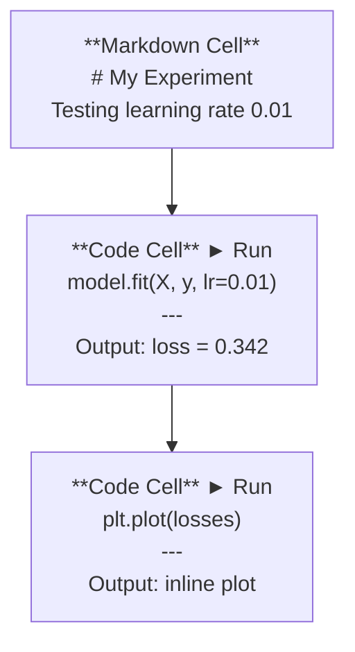
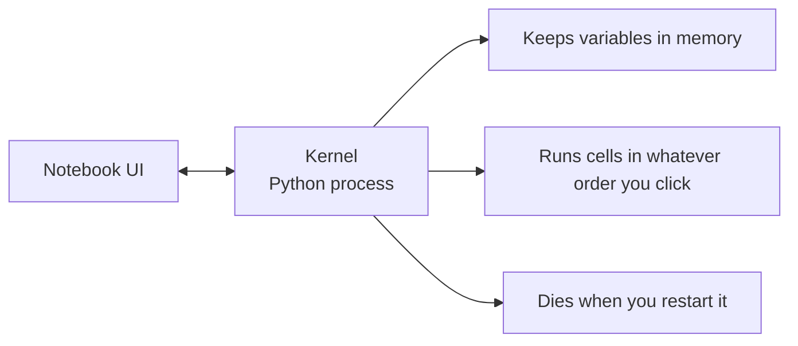

# Jupyter Notebooks

> 笔记本是 AI 工程师的实验台。你在这里做原型验证，然后把可行的方案迁移到生产环境。

**类型：** Build
**语言：** Python
**前置条件：** Phase 0, Lesson 01
**时间：** ~30 分钟

## 学习目标

- 安装并启动 JupyterLab、Jupyter Notebook，或搭配 Jupyter 扩展的 VS Code
- 使用 magic 命令（`%timeit`、`%%time`、`%matplotlib inline`）进行内联基准测试和可视化
- 区分何时使用笔记本、何时使用脚本，并应用"在笔记本中探索，在脚本中交付"的工作流
- 识别并规避常见的笔记本陷阱：乱序执行、隐藏状态和内存泄漏

## 问题所在

每一篇 AI 论文、教程和 Kaggle 竞赛都会用到 Jupyter 笔记本。它们让你可以分块运行代码、内联查看输出、混合代码与说明，并快速迭代。如果你试图不用笔记本学习 AI，那就好比做数学作业没有草稿纸。

但笔记本确实存在陷阱。人们用它们做所有事情，包括那些它们根本不擅长的事。知道何时用笔记本、何时用脚本，能让你免于日后的调试噩梦。

## 核心概念

笔记本是一系列单元格（cell）的列表。每个单元格要么是代码，要么是文本。



内核（kernel）是一个在后台运行的 Python 进程。当你运行一个单元格时，它会将代码发送给内核，内核执行后再把结果返回。所有单元格共享同一个内核，因此变量会在单元格之间保持。



"想点什么顺序点就什么顺序点"这件事，既是超能力，也是坑自己的利器。

## 动手实践

### 步骤 1：选择你的界面

三种选择，一种格式：

| 界面 | 安装方式 | 最适合 |
|------|---------|--------|
| JupyterLab | `pip install jupyterlab` 然后 `jupyter lab` | 完整 IDE 体验，多标签页、文件浏览器、终端 |
| Jupyter Notebook | `pip install notebook` 然后 `jupyter notebook` | 简单轻量，一次一个笔记本 |
| VS Code | 安装 "Jupyter" 扩展 | 已在编辑器中，Git 集成、调试功能 |

三者读写相同的 `.ipynb` 文件。随你喜欢选哪个。JupyterLab 在 AI 工作中最为常见。

```bash
pip install jupyterlab
jupyter lab
```

### 步骤 2：重要的键盘快捷键

你在两种模式之间操作。按 `Escape` 进入命令模式（左侧蓝色边框），按 `Enter` 进入编辑模式（绿色边框）。

**命令模式（最常用）：**

| 按键 | 操作 |
|------|------|
| `Shift+Enter` | 运行单元格，跳到下一个 |
| `A` | 在上方插入单元格 |
| `B` | 在下方插入单元格 |
| `DD` | 删除单元格 |
| `M` | 转换为 Markdown |
| `Y` | 转换为代码 |
| `Z` | 撤销单元格操作 |
| `Ctrl+Shift+H` | 显示所有快捷键 |

**编辑模式：**

| 按键 | 操作 |
|------|------|
| `Tab` | 自动补全 |
| `Shift+Tab` | 显示函数签名 |
| `Ctrl+/` | 切换注释 |

`Shift+Enter` 是你一天会用上千次的快捷键。先学会它。

### 步骤 3：单元格类型

**代码单元格** 运行 Python 并显示输出：

```python
import numpy as np
data = np.random.randn(1000)
data.mean(), data.std()
```

输出：`(0.0032, 0.9987)`

**Markdown 单元格** 渲染格式化文本。用它们来记录你在做什么以及为什么。支持标题、粗体、斜体、LaTeX 数学公式（`$E = mc^2$`）、表格和图片。

### 步骤 4：Magic 命令

这些不是 Python。它们是 Jupyter 特有的命令，以 `%`（行 magic）或 `%%`（单元格 magic）开头。

**为代码计时：**

```python
%timeit np.random.randn(10000)
```

输出：`45.2 us +/- 1.3 us per loop`

```python
%%time
model.fit(X_train, y_train, epochs=10)
```

输出：`Wall time: 2.34 s`

`%timeit` 会多次运行代码并取平均值。`%%time` 只运行一次。微基准测试用 `%timeit`，训练运行用 `%%time`。

**启用内联绘图：**

```python
%matplotlib inline
```

现在每个 `plt.plot()` 或 `plt.show()` 都会直接在笔记本中渲染。

**不离开笔记本安装包：**

```python
!pip install scikit-learn
```

`!` 前缀可以运行任何 shell 命令。

**检查环境变量：**

```python
%env CUDA_VISIBLE_DEVICES
```

### 步骤 5：内联显示富输出

笔记本会自动显示单元格中的最后一个表达式。但你可以控制它：

```python
import pandas as pd

df = pd.DataFrame({
    "model": ["Linear", "Random Forest", "Neural Net"],
    "accuracy": [0.72, 0.89, 0.94],
    "training_time": [0.1, 2.3, 45.6]
})
df
```

这会渲染一个格式化的 HTML 表格，而不是文本转储。绘图也一样：

```python
import matplotlib.pyplot as plt

plt.figure(figsize=(8, 4))
plt.plot([1, 2, 3, 4], [1, 4, 2, 3])
plt.title("Inline Plot")
plt.show()
```

图表会直接出现在单元格下方。这就是笔记本主导 AI 工作的原因。你可以同时看到数据、图表和代码。

对于图片：

```python
from IPython.display import Image, display
display(Image(filename="architecture.png"))
```

### 步骤 6：Google Colab

Colab 是云端的免费 Jupyter 笔记本。它提供 GPU、预装库和 Google Drive 集成。无需任何设置。

1. 访问 [colab.research.google.com](https://colab.research.google.com)
2. 上传本课程的任意 `.ipynb` 文件
3. 运行时 > 更改运行时类型 > T4 GPU（免费）

Colab 与本地 Jupyter 的区别：
- 文件在会话之间不会持久保存（保存到 Drive 或下载）
- 已预装：numpy、pandas、matplotlib、torch、tensorflow、sklearn
- `from google.colab import files` 用于上传/下载文件
- `from google.colab import drive; drive.mount('/content/drive')` 用于持久化存储
- 免费版会话在 90 分钟无活动后超时

## 应用实践

### 笔记本 vs 脚本：何时用哪个

| 用笔记本 | 用脚本 |
|---------|--------|
| 探索数据集 | 训练流水线 |
| 模型原型验证 | 可复用工具函数 |
| 可视化结果 | 任何带 `if __name__` 的东西 |
| 解释你的工作 | 定时运行的代码 |
| 快速实验 | 生产代码 |
| 课程练习 | 包和库 |

原则：**在笔记本中探索，在脚本中交付**。

AI 中的常见工作流：
1. 在笔记本中探索数据
2. 在笔记本中验证模型原型
3. 可行后，将代码迁移到 `.py` 文件
4. 将这些 `.py` 文件导入回笔记本，进行进一步实验

### 常见陷阱

**乱序执行。** 你先运行了单元格 5，然后是单元格 2，再是单元格 7。笔记本在你的机器上能跑，但别人从上到下运行时就崩了。解决办法：分享前执行 内核 > 重启并全部运行。

**隐藏状态。** 你删了一个单元格，但它创建的变量还在内存里。笔记本看起来很干净，却依赖着一个"幽灵单元格"。解决办法：定期重启内核。

**内存泄漏。** 加载了 4GB 数据集，训练模型，再加载另一个数据集。什么都没释放。解决办法：`del variable_name` 和 `gc.collect()`，或者重启内核。

## 交付成果

本节课产出：
- `outputs/prompt-notebook-helper.md`，用于调试笔记本问题

## 练习题

1. 打开 JupyterLab，创建一个笔记本，使用 `%timeit` 比较列表推导式与 numpy 在创建 100,000 个随机数数组时的性能
2. 创建一个包含 Markdown 和代码单元格的笔记本，加载 CSV、显示 dataframe、绘制图表。然后执行 内核 > 重启并全部运行，验证从上到下能正常运行
3. 从 `code/notebook_tips.py` 获取代码，粘贴到 Colab 笔记本中，用免费 GPU 运行

## 关键术语

| 术语 | 人们怎么说 | 实际含义 |
|------|-----------|---------|
| Kernel（内核） | "运行我代码的那个东西" | 一个独立的 Python 进程，执行单元格并在内存中保持变量 |
| Cell（单元格） | "一个代码块" | 笔记本中可独立运行的单元，可以是代码或 Markdown |
| Magic command（Magic 命令） | "Jupyter 技巧" | 以 `%` 或 `%%` 为前缀的特殊命令，用于控制笔记本环境 |
| `.ipynb` | "笔记本文件" | 一个包含单元格、输出和元数据的 JSON 文件。代表 IPython Notebook |

## 延伸阅读

- [JupyterLab 文档](https://jupyterlab.readthedocs.io/) 了解完整功能
- [Google Colab 常见问题](https://research.google.com/colaboratory/faq.html) 了解 Colab 特有的限制和功能
- [28 个 Jupyter Notebook 技巧](https://www.dataquest.io/blog/jupyter-notebook-tips-tricks-shortcuts/) 掌握高级用户快捷键
