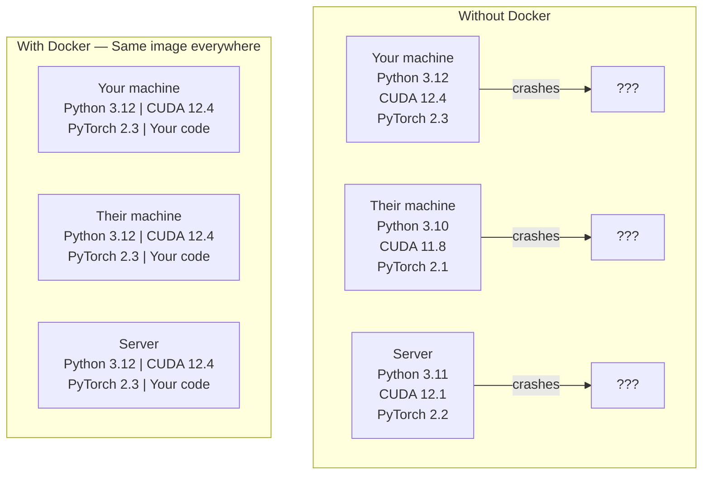

# 面向 AI 的 Docker

> 容器让“在我机器上能跑”成为历史。

**类型：** 构建
**语言：** Docker
**前置条件：** Phase 0，第 01 和 03 课
**时间：** ~60 分钟

## 学习目标

- 从 Dockerfile 构建包含 CUDA、PyTorch 和 AI 库的 GPU 启用镜像
- 将主机目录挂载为卷，以在容器重建之间持久化模型、数据集和代码
- 配置 NVIDIA Container Toolkit，使容器内部可以访问 GPU
- 使用 Docker Compose 编排多服务 AI 应用（推理服务器 + 向量数据库）

## 问题所在

你在笔记本电脑上用 PyTorch 2.3、CUDA 12.4 和 Python 3.12 训练了一个模型。你的同事用的是 PyTorch 2.1、CUDA 11.8 和 Python 3.10。你的模型在他们的机器上崩溃。你的 Dockerfile 在两者上都能工作。

AI 项目是依赖关系的噩梦。典型的技术栈包括 Python、PyTorch、CUDA 驱动、cuDNN、系统级 C 库，以及像 flash-attn 这样需要精确编译器版本的专用包。Docker 将所有这些打包成一个在任何地方都能一致运行的单一镜像。

## 核心概念

Docker 将你的代码、运行时、库和系统工具封装到一个称为容器的隔离单元中。可以把它看作轻量级虚拟机，只不过它共享主机操作系统内核而不是运行自己的内核，因此启动时间从分钟级缩短到秒级。



### 为什么 AI 项目比大多数项目更需要 Docker

1. **GPU 驱动很脆弱。** CUDA 12.4 的代码无法在 CUDA 11.8 上运行。Docker 将 CUDA 工具包隔离在容器内部，同时通过 NVIDIA Container Toolkit 共享主机的 GPU 驱动。

2. **模型权重很大。** 一个 7B 参数的 fp16 模型有 14 GB。你不希望每次重建时都重新下载。Docker 卷允许你从主机挂载模型目录。

3. **多服务架构很常见。** 真正的 AI 应用不仅仅是一个 Python 脚本。它包括推理服务器、用于 RAG 的向量数据库，可能还有 Web 前端。Docker Compose 可以用一条命令编排所有这些服务。

### 关键术语

| 术语 | 含义 |
|------|------|
| Image（镜像） | 只读模板。你的配方。从 Dockerfile 构建。 |
| Container（容器） | 镜像的运行实例。你的厨房。 |
| Dockerfile | 构建镜像的指令。逐层构建。 |
| Volume（卷） | 容器重启后仍然存在的持久化存储。 |
| docker-compose | 用 YAML 定义多容器应用的工具。 |

### AI 中的常见容器模式

```
Dev Container
  Full toolkit. Editor support. Jupyter. Debugging tools.
  Used during development and experimentation.

Training Container
  Minimal. Just the training script and dependencies.
  Runs on GPU clusters. No editor, no Jupyter.

Inference Container
  Optimized for serving. Small image. Fast cold start.
  Runs behind a load balancer in production.
```

## 动手构建

### 步骤 1：安装 Docker

```bash
# macOS
brew install --cask docker
open /Applications/Docker.app

# Ubuntu
curl -fsSL https://get.docker.com | sh
sudo usermod -aG docker $USER
# Log out and back in for group change to take effect
```

验证：

```bash
docker --version
docker run hello-world
```

### 步骤 2：安装 NVIDIA Container Toolkit（带 NVIDIA GPU 的 Linux）

这让 Docker 容器可以访问你的 GPU。macOS 和 Windows（WSL2）用户可以跳过这一步；Docker Desktop 在这些平台上以不同方式处理 GPU 透传。

```bash
distribution=$(. /etc/os-release;echo $ID$VERSION_ID)
curl -fsSL https://nvidia.github.io/libnvidia-container/gpgkey | sudo gpg --dearmor -o /usr/share/keyrings/nvidia-container-toolkit-keyring.gpg
curl -s -L https://nvidia.github.io/libnvidia-container/$distribution/libnvidia-container.list | \
    sed 's#deb https://#deb [signed-by=/usr/share/keyrings/nvidia-container-toolkit-keyring.gpg] https://#g' | \
    sudo tee /etc/apt/sources.list.d/nvidia-container-toolkit.list

sudo apt-get update
sudo apt-get install -y nvidia-container-toolkit
sudo nvidia-ctk runtime configure --runtime=docker
sudo systemctl restart docker
```

在容器内测试 GPU 访问：

```bash
docker run --rm --gpus all nvidia/cuda:12.4.1-base-ubuntu22.04 nvidia-smi
```

如果看到 GPU 信息，说明工具包已正常工作。

### 步骤 3：理解基础镜像

选择正确的基础镜像可以节省数小时的调试时间。

```
nvidia/cuda:12.4.1-devel-ubuntu22.04
  Full CUDA toolkit. Compilers included.
  Use for: building packages that need nvcc (flash-attn, bitsandbytes)
  Size: ~4 GB

nvidia/cuda:12.4.1-runtime-ubuntu22.04
  CUDA runtime only. No compilers.
  Use for: running pre-built code
  Size: ~1.5 GB

pytorch/pytorch:2.3.1-cuda12.4-cudnn9-runtime
  PyTorch pre-installed on top of CUDA.
  Use for: skipping the PyTorch install step
  Size: ~6 GB

python:3.12-slim
  No CUDA. CPU only.
  Use for: inference on CPU, lightweight tools
  Size: ~150 MB
```

### 步骤 4：编写用于 AI 开发的 Dockerfile

以下是 `code/Dockerfile` 中的 Dockerfile。逐步了解：

```dockerfile
FROM nvidia/cuda:12.4.1-devel-ubuntu22.04

ENV DEBIAN_FRONTEND=noninteractive
ENV PYTHONUNBUFFERED=1

RUN apt-get update && apt-get install -y --no-install-recommends \
    python3.12 \
    python3.12-venv \
    python3.12-dev \
    python3-pip \
    git \
    curl \
    build-essential \
    && rm -rf /var/lib/apt/lists/*

RUN update-alternatives --install /usr/bin/python python /usr/bin/python3.12 1

RUN python -m pip install --no-cache-dir --upgrade pip setuptools wheel

RUN python -m pip install --no-cache-dir \
    torch==2.3.1 \
    torchvision==0.18.1 \
    torchaudio==2.3.1 \
    --index-url https://download.pytorch.org/whl/cu124

RUN python -m pip install --no-cache-dir \
    numpy \
    pandas \
    scikit-learn \
    matplotlib \
    jupyter \
    transformers \
    datasets \
    accelerate \
    safetensors

WORKDIR /workspace

VOLUME ["/workspace", "/models"]

EXPOSE 8888

CMD ["python"]
```

构建：

```bash
docker build -t ai-dev -f phases/00-setup-and-tooling/07-docker-for-ai/code/Dockerfile .
```

第一次构建需要一些时间（下载 CUDA 基础镜像 + PyTorch）。后续构建会使用缓存的层。

运行：

```bash
docker run --rm -it --gpus all \
    -v $(pwd):/workspace \
    -v ~/models:/models \
    ai-dev python -c "import torch; print(f'PyTorch {torch.__version__}, CUDA: {torch.cuda.is_available()}')"
```

在容器内运行 Jupyter：

```bash
docker run --rm -it --gpus all \
    -v $(pwd):/workspace \
    -v ~/models:/models \
    -p 8888:8888 \
    ai-dev jupyter notebook --ip=0.0.0.0 --port=8888 --no-browser --allow-root
```

### 步骤 5：用于数据和模型的卷挂载

卷挂载对 AI 工作至关重要。没有它们，你的 14 GB 模型下载会在容器停止时消失。

```bash
# Mount your code
-v $(pwd):/workspace

# Mount a shared models directory
-v ~/models:/models

# Mount datasets
-v ~/datasets:/data
```

在你的训练脚本中，从挂载路径加载：

```python
from transformers import AutoModel

model = AutoModel.from_pretrained("/models/llama-7b")
```

模型保存在你的主机文件系统中。可以随意重建容器而无需重新下载。

### 步骤 6：用于多服务 AI 应用的 Docker Compose

真正的 RAG 应用需要推理服务器和向量数据库。Docker Compose 用一条命令运行两者。

参见 `code/docker-compose.yml`：

```yaml
services:
  ai-dev:
    build:
      context: .
      dockerfile: Dockerfile
    deploy:
      resources:
        reservations:
          devices:
            - driver: nvidia
              count: all
              capabilities: [gpu]
    volumes:
      - ../../../:/workspace
      - ~/models:/models
      - ~/datasets:/data
    ports:
      - "8888:8888"
    stdin_open: true
    tty: true
    command: jupyter notebook --ip=0.0.0.0 --port=8888 --no-browser --allow-root

  qdrant:
    image: qdrant/qdrant:v1.12.5
    ports:
      - "6333:6333"
      - "6334:6334"
    volumes:
      - qdrant_data:/qdrant/storage

volumes:
  qdrant_data:
```

启动所有服务：

```bash
cd phases/00-setup-and-tooling/07-docker-for-ai/code
docker compose up -d
```

现在你的 AI 开发容器可以通过服务名访问 `http://qdrant:6333` 上的向量数据库。Docker Compose 会自动创建一个共享网络。

从 AI 容器内部测试连接：

```python
from qdrant_client import QdrantClient

client = QdrantClient(host="qdrant", port=6333)
print(client.get_collections())
```

停止所有服务：

```bash
docker compose down
```

添加 `-v` 以同时删除 qdrant 卷：

```bash
docker compose down -v
```

### 步骤 7：AI 工作中常用的 Docker 命令

```bash
# List running containers
docker ps

# List all images and their sizes
docker images

# Remove unused images (reclaim disk space)
docker system prune -a

# Check GPU usage inside a running container
docker exec -it <container_id> nvidia-smi

# Copy a file from container to host
docker cp <container_id>:/workspace/results.csv ./results.csv

# View container logs
docker logs -f <container_id>
```

## 实际应用

你现在拥有可复现的 AI 开发环境。在本课程的其余部分：

- 使用 `docker compose up` 同时启动你的开发环境和向量数据库
- 将你的代码、模型和数据挂载为卷，确保重建之间不会丢失任何内容
- 当课程需要新的 Python 包时，将其添加到 Dockerfile 并重建
- 与团队成员分享你的 Dockerfile。他们获得完全相同的环境。

### 没有 GPU？

移除 `--gpus all` 标志和 NVIDIA deploy 块。容器仍然可以用于基于 CPU 的课程。PyTorch 会自动检测 CUDA 的缺失并回退到 CPU。

## 练习

1. 构建 Dockerfile 并在容器内运行 `python -c "import torch; print(torch.__version__)"`
2. 启动 docker-compose 栈，并验证从 AI 容器可以访问 Qdrant，地址为 `http://qdrant:6333/collections`
3. 将 `flask` 添加到 Dockerfile，重建，并在 5000 端口运行简单的 API 服务器。使用 `-p 5000:5000` 映射端口
4. 用 `docker images` 测量镜像大小。尝试将基础镜像从 `devel` 切换到 `runtime` 并比较大小

## 关键术语

| 术语 | 人们的说法 | 实际含义 |
|------|-----------|---------|
| Container（容器） | "轻量级 VM" | 使用主机内核的隔离进程，拥有独立的文件系统和网络 |
| Image layer（镜像层） | "缓存的步骤" | 每条 Dockerfile 指令创建一个层。未更改的层会被缓存，因此重建很快。 |
| NVIDIA Container Toolkit | "Docker 中的 GPU" | 一个运行时钩子，通过 `--gpus` 标志将主机 GPU 暴露给容器 |
| Volume mount（卷挂载） | "共享文件夹" | 映射到容器中的主机目录。容器停止后更改仍然保留。 |
| Base image（基础镜像） | "起点" | Dockerfile 构建所基于的 `FROM` 镜像。决定了预装的内容。 |
