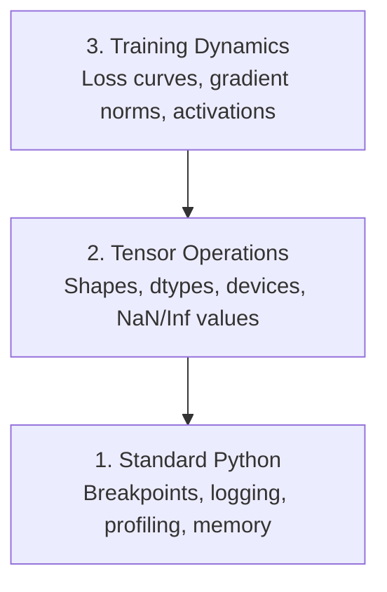

# 调试与性能分析

> 最糟糕的 AI bug 不会导致崩溃。它们会静默地在垃圾数据上训练，并输出一条漂亮的损失曲线。

**类型：** Build
**语言：** Python
**前置条件：** 第 1 课（开发环境），具备基本 PyTorch 知识
**时间：** ~60 分钟

## 学习目标

- 使用条件性 `breakpoint()` 和 `debug_print` 在训练过程中检查张量形状、数据类型和 NaN 值
- 使用 `cProfile`、`line_profiler` 和 `tracemalloc` 分析训练循环，找出性能瓶颈
- 识别常见的 AI bug：形状不匹配、NaN 损失、数据泄漏和错误设备上的张量
- 配置 TensorBoard 以可视化损失曲线、权重直方图和梯度分布

## 问题所在

AI 代码的失效方式与普通代码不同。Web 应用崩溃时会输出堆栈跟踪。而一个配置错误的训练循环可能运行 8 小时，消耗 200 美元的 GPU 时间，最终产出一个对任何输入都预测均值的模型。代码从未报错。bug 可能只是一个张量放在了错误的设备上、一个被遗忘的 `.detach()`，或是标签泄漏到了特征中。

你需要调试工具来在这些静默失败浪费你的时间和计算资源之前捕获它们。

## 核心概念

AI 调试分为三个层次：



大多数人直接跳到第 3 层（盯着 TensorBoard 看）。但 80% 的 AI bug 都存在于第 1 层和第 2 层。

## 动手实现

### 第 1 部分：打印调试（没错，它有效）

打印调试常被轻视。但它不应该被忽视。对于张量代码，一条精准的 print 语句胜过逐步调试，因为你需要同时看到形状、数据类型和数值范围。

```python
def debug_print(name, tensor):
    print(f"{name}: shape={tensor.shape}, dtype={tensor.dtype}, "
          f"device={tensor.device}, "
          f"min={tensor.min().item():.4f}, max={tensor.max().item():.4f}, "
          f"mean={tensor.mean().item():.4f}, "
          f"has_nan={tensor.isnan().any().item()}")
```

在每个可疑操作后调用这个函数。找到 bug 后，删除这些打印语句。简单直接。

### 第 2 部分：Python 调试器（pdb 和 breakpoint）

内置调试器在 AI 工作中被低估了。在你的训练循环中放入 `breakpoint()`，交互式地检查张量。

```python
def training_step(model, batch, criterion, optimizer):
    inputs, labels = batch
    outputs = model(inputs)
    loss = criterion(outputs, labels)

    if loss.item() > 100 or torch.isnan(loss):
        breakpoint()

    loss.backward()
    optimizer.step()
```

当调试器进入时，以下命令很有用：

- `p outputs.shape` 检查形状
- `p loss.item()` 查看损失值
- `p torch.isnan(outputs).sum()` 统计 NaN 数量
- `p model.fc1.weight.grad` 检查梯度
- `c` 继续执行，`q` 退出调试

这是条件性调试。只在看起来有问题时才停止。对于 10,000 步的训练运行，这很重要。

### 第 3 部分：Python 日志记录

当调试超出快速检查时，用日志记录替换 print 语句。

```python
import logging

logging.basicConfig(
    level=logging.INFO,
    format="%(asctime)s [%(levelname)s] %(message)s",
    handlers=[
        logging.FileHandler("training.log"),
        logging.StreamHandler()
    ]
)
logger = logging.getLogger(__name__)

logger.info("Starting training: lr=%.4f, batch_size=%d", lr, batch_size)
logger.warning("Loss spike detected: %.4f at step %d", loss.item(), step)
logger.error("NaN loss at step %d, stopping", step)
```

日志记录提供时间戳、严重级别和文件输出。当训练在凌晨 3 点失败时，你需要的是日志文件，而不是已经滚出屏幕的终端输出。

### 第 4 部分：代码段计时

了解时间花在哪里是优化的第一步。

```python
import time

class Timer:
    def __init__(self, name=""):
        self.name = name

    def __enter__(self):
        self.start = time.perf_counter()
        return self

    def __exit__(self, *args):
        elapsed = time.perf_counter() - self.start
        print(f"[{self.name}] {elapsed:.4f}s")

with Timer("data loading"):
    batch = next(dataloader_iter)

with Timer("forward pass"):
    outputs = model(batch)

with Timer("backward pass"):
    loss.backward()
```

常见发现：数据加载占训练时间的 60%。解决方案是在 DataLoader 中使用 `num_workers > 0`，而不是换一块更快的 GPU。

### 第 5 部分：cProfile 和 line_profiler

当你需要比手动计时更详细的分析时：

```bash
python -m cProfile -s cumtime train.py
```

这会按累计时间排序显示每个函数调用。对于逐行分析：

```bash
pip install line_profiler
```

```python
@profile
def train_step(model, data, target):
    output = model(data)
    loss = F.cross_entropy(output, target)
    loss.backward()
    return loss

# Run with: kernprof -l -v train.py
```

### 第 6 部分：内存分析

#### 使用 tracemalloc 分析 CPU 内存

```python
import tracemalloc

tracemalloc.start()

# your code here
model = build_model()
data = load_dataset()

snapshot = tracemalloc.take_snapshot()
top_stats = snapshot.statistics("lineno")
for stat in top_stats[:10]:
    print(stat)
```

#### 使用 memory_profiler 分析 CPU 内存

```bash
pip install memory_profiler
```

```python
from memory_profiler import profile

@profile
def load_data():
    raw = read_csv("data.csv")       # watch memory jump here
    processed = preprocess(raw)       # and here
    return processed
```

使用 `python -m memory_profiler your_script.py` 运行以查看逐行内存使用情况。

#### 使用 PyTorch 分析 GPU 内存

```python
import torch

if torch.cuda.is_available():
    print(torch.cuda.memory_summary())

    print(f"Allocated: {torch.cuda.memory_allocated() / 1e9:.2f} GB")
    print(f"Cached: {torch.cuda.memory_reserved() / 1e9:.2f} GB")
```

当你遇到 OOM（内存不足）时：

1. 减小 batch size（首先要尝试的，永远如此）
2. 使用 `torch.cuda.empty_cache()` 释放缓存内存
3. 对大的中间结果使用 `del tensor` 后接 `torch.cuda.empty_cache()`
4. 使用混合精度（`torch.cuda.amp`）将内存使用减半
5. 对非常深的模型使用梯度检查点

### 第 7 部分：常见 AI Bug 及捕获方法

#### 形状不匹配

最常见的 bug。张量形状为 `[batch, features]`，而模型期望的是 `[batch, channels, height, width]`。

```python
def check_shapes(model, sample_input):
    print(f"Input: {sample_input.shape}")
    hooks = []

    def make_hook(name):
        def hook(module, inp, out):
            in_shape = inp[0].shape if isinstance(inp, tuple) else inp.shape
            out_shape = out.shape if hasattr(out, "shape") else type(out)
            print(f"  {name}: {in_shape} -> {out_shape}")
        return hook

    for name, module in model.named_modules():
        hooks.append(module.register_forward_hook(make_hook(name)))

    with torch.no_grad():
        model(sample_input)

    for h in hooks:
        h.remove()
```

用一批样本数据运行一次。它会映射模型中的每个形状变换。

#### NaN 损失

NaN 损失意味着某些东西爆炸了。常见原因：

- 学习率过高
- 自定义损失中除以零
- 对零或负数取对数
- RNN 中的梯度爆炸

```python
def detect_nan(model, loss, step):
    if torch.isnan(loss):
        print(f"NaN loss at step {step}")
        for name, param in model.named_parameters():
            if param.grad is not None:
                if torch.isnan(param.grad).any():
                    print(f"  NaN gradient in {name}")
                if torch.isinf(param.grad).any():
                    print(f"  Inf gradient in {name}")
        return True
    return False
```

#### 数据泄漏

你的模型在测试集上达到 99% 的准确率。听起来很棒。这是个 bug。

```python
def check_data_leakage(train_set, test_set, id_column="id"):
    train_ids = set(train_set[id_column].tolist())
    test_ids = set(test_set[id_column].tolist())
    overlap = train_ids & test_ids
    if overlap:
        print(f"DATA LEAKAGE: {len(overlap)} samples in both train and test")
        return True
    return False
```

还要检查时间泄漏：使用未来数据预测过去。在拆分前按时间戳排序。

#### 错误设备

不同设备上的张量（CPU 与 GPU）会导致运行时错误。但有时张量静默地留在 CPU 上，而其他所有东西都在 GPU 上，训练只是运行得很慢。

```python
def check_devices(model, *tensors):
    model_device = next(model.parameters()).device
    print(f"Model device: {model_device}")
    for i, t in enumerate(tensors):
        if t.device != model_device:
            print(f"  WARNING: tensor {i} on {t.device}, model on {model_device}")
```

### 第 8 部分：TensorBoard 基础

TensorBoard 向你展示训练过程中内部发生了什么。

```bash
pip install tensorboard
```

```python
from torch.utils.tensorboard import SummaryWriter

writer = SummaryWriter("runs/experiment_1")

for step in range(num_steps):
    loss = train_step(model, batch)

    writer.add_scalar("loss/train", loss.item(), step)
    writer.add_scalar("lr", optimizer.param_groups[0]["lr"], step)

    if step % 100 == 0:
        for name, param in model.named_parameters():
            writer.add_histogram(f"weights/{name}", param, step)
            if param.grad is not None:
                writer.add_histogram(f"grads/{name}", param.grad, step)

writer.close()
```

启动它：

```bash
tensorboard --logdir=runs
```

需要关注的现象：

- **损失不下降**：学习率过低，或模型架构有问题
- **损失剧烈震荡**：学习率过高
- **损失变为 NaN**：数值不稳定（参见上面的 NaN 部分）
- **训练损失下降，验证损失上升**：过拟合
- **权重直方图坍缩到零**：梯度消失
- **梯度直方图爆炸**：需要梯度裁剪

### 第 9 部分：VS Code 调试器

对于交互式调试，使用 `launch.json` 配置 VS Code：

```json
{
    "version": "0.2.0",
    "configurations": [
        {
            "name": "Debug Training",
            "type": "debugpy",
            "request": "launch",
            "program": "${file}",
            "console": "integratedTerminal",
            "justMyCode": false
        }
    ]
}
```

点击行号旁的区域设置断点。使用 Variables 面板检查张量属性。Debug Console 允许你在执行过程中运行任意 Python 表达式。

适用于逐步调试数据预处理流水线，你想看到每个转换步骤的场景。

## 应用实践

以下是能捕获大多数 AI bug 的调试工作流：

1. **训练前**：用一批样本数据运行 `check_shapes`。验证输入和输出维度是否符合预期。
2. **前 10 步**：对损失、输出和梯度使用 `debug_print`。确认没有 NaN 且数值在合理范围内。
3. **训练期间**：记录损失、学习率和梯度范数。使用 TensorBoard 进行可视化。
4. **出现问题时**：在故障点放入 `breakpoint()`。交互式地检查张量。
5. **性能优化时**：计时你的数据加载 vs 前向传播 vs 反向传播。如果接近 OOM，分析内存使用情况。

## 交付运行

运行调试工具包脚本：

```bash
python phases/00-setup-and-tooling/12-debugging-and-profiling/code/debug_tools.py
```

参见 `outputs/prompt-debug-ai-code.md` 获取帮助诊断 AI 特定 bug 的提示。

## 练习题

1. 运行 `debug_tools.py` 并阅读每个部分的输出。修改虚拟模型引入 NaN（提示：在前向传播中除以零）并观察检测器捕获它。
2. 使用 `cProfile` 分析训练循环，找出最慢的函数。
3. 使用 `tracemalloc` 找出数据加载流水线中分配内存最多的行。
4. 为简单的训练运行配置 TensorBoard，判断模型是否过拟合。
5. 在训练循环中使用 `breakpoint()`。练习从调试器提示符检查张量形状、设备和梯度值。
