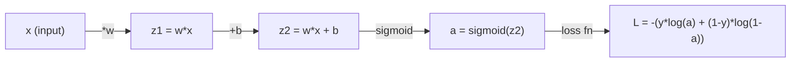
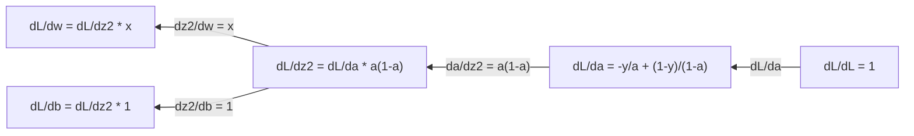
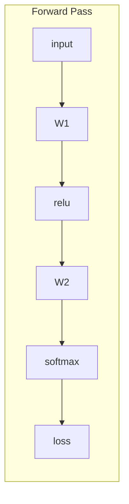
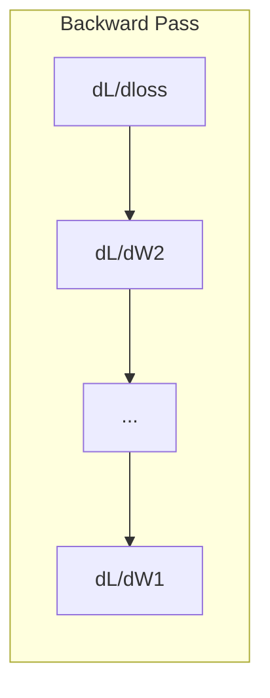

# 机器学习中的微积分

> 导数告诉你哪个方向是下坡。这就是神经网络学习所需的全部。

**类型：** 学习
**语言：** Python
**前置条件：** 第 1 阶段，第 01-03 课
**时间：** ~60 分钟

## 学习目标

- 计算常见 ML 函数（x^2、sigmoid、交叉熵）的数值导数和解析导数
- 从零实现梯度下降，在 1D 和 2D 中最小化损失函数
- 推导线性回归模型的梯度，并通过手动更新权重进行训练
- 解释 Hessian 矩阵、泰勒级数近似，以及它们与优化方法的联系

## 问题

你有一个拥有数百万权重的神经网络。每个权重都是一个旋钮。你需要弄清楚每个旋钮该往哪个方向转动，才能让模型稍微不那么错。微积分给你这个方向。

没有微积分，训练神经网络就意味着尝试随机改动然后寄希望于最好。有了导数，你确切知道每个权重如何影响误差。每次都能把每个旋钮转到正确的方向。

## 概念

### 什么是导数？

导数衡量变化率。对于函数 y = f(x)，导数 f'(x) 告诉你：如果把 x 稍微推动一点，y 会变化多少？

几何上，导数是某点处切线的斜率。

**f(x) = x^2：**

| x | f(x) | f'(x)（斜率） |
|---|------|---------------|
| 0 | 0    | 0（平坦，在底部） |
| 1 | 1    | 2 |
| 2 | 4    | 4（该点切线斜率） |
| 3 | 9    | 6 |

在 x=2 处，斜率是 4。如果把 x 稍微向右移动，y 会增加约 4 倍于该移动量。在 x=0 处，斜率是 0。你在碗的底部。

正式定义：

```
f'(x) = lim   f(x + h) - f(x)
        h->0  -----------------
                     h
```

在代码中，你跳过极限，只用一个非常小的 h。这就是数值导数。

### 偏导数：一次只变一个变量

真实函数有很多输入。神经网络损失依赖于数千个权重。偏导数保持所有变量不变，只对其中一个求导。

```
f(x, y) = x^2 + 3xy + y^2

df/dx = 2x + 3y     (treat y as a constant)
df/dy = 3x + 2y     (treat x as a constant)
```

每个偏导数回答：如果只推动这一个权重，损失会如何变化？

### 梯度：所有偏导数的向量

梯度将所有偏导数收集到一个向量中。对于函数 f(x, y, z)，梯度为：

```
grad f = [ df/dx, df/dy, df/dz ]
```

梯度指向最陡上升的方向。要最小化函数，就往相反方向走。

**f(x,y) = x^2 + y^2 的等高线图：**

该函数形成碗状，等高线为同心圆。最小值在 (0, 0)。

| 点 | grad f | -grad f（下降方向） |
|-------|--------|----------------------------|
| (1, 1) | [2, 2]（指向上坡，远离最小值） | [-2, -2]（指向下坡，朝向最小值） |
| (0, 0) | [0, 0]（平坦，在最小值处） | [0, 0] |

这就是梯度下降的图示。计算梯度，取反，迈一步。

### 与优化的联系

训练神经网络就是优化。你有一个损失函数 L(w1, w2, ..., wn) 来衡量模型有多错。你想最小化它。

```
Gradient descent update rule:

  w_new = w_old - learning_rate * dL/dw

For every weight:
  1. Compute the partial derivative of loss with respect to that weight
  2. Subtract a small multiple of it from the weight
  3. Repeat
```

学习率控制步长。太大则超调。太小则爬行。

**损失景观（1D 切片）：**

损失函数 L(w) 随权重 w 变化形成带有峰谷的曲线。

| 特征 | 描述 |
|---------|-------------|
| 全局最小值 | 整条曲线上的最低点——最佳解 |
| 局部最小值 | 比邻近点低但并非整体最低的山谷 |
| 斜率 | 梯度下降从任意起点沿斜率下坡 |

梯度下降沿斜率下坡。它可能陷入局部最小值，但在高维空间（数百万权重）中，这很少是实际问题。

### 数值导数 vs 解析导数

计算导数有两种方法。

解析法：手工应用微积分规则。对于 f(x) = x^2，导数为 f'(x) = 2x。精确。快速。

数值法：用定义近似。对极小的 h 计算 f(x+h) 和 f(x-h)，然后用差值。

```
Numerical (central difference):

f'(x) ~= f(x + h) - f(x - h)
          -----------------------
                  2h

h = 0.0001 works well in practice
```

数值导数更慢，但对任何函数都适用。解析导数快，但需要推导出公式。神经网络框架使用第三种方法：自动微分，机械地计算精确导数。你将在第 3 阶段看到。

### 简单函数的手算导数

这些导数你在 ML 中会反复遇到。

```
Function        Derivative       Used in
--------        ----------       -------
f(x) = x^2     f'(x) = 2x      Loss functions (MSE)
f(x) = wx + b  f'(w) = x        Linear layer (gradient w.r.t. weight)
                f'(b) = 1        Linear layer (gradient w.r.t. bias)
                f'(x) = w        Linear layer (gradient w.r.t. input)
f(x) = e^x     f'(x) = e^x     Softmax, attention
f(x) = ln(x)   f'(x) = 1/x     Cross-entropy loss
f(x) = 1/(1+e^-x)  f'(x) = f(x)(1-f(x))   Sigmoid activation
```

对于 f(x) = x^2：

```
f(x) = x^2    f'(x) = 2x

  x    f(x)   f'(x)   meaning
  -2    4      -4      slope tilts left (decreasing)
  -1    1      -2      slope tilts left (decreasing)
   0    0       0      flat (minimum!)
   1    1       2      slope tilts right (increasing)
   2    4       4      slope tilts right (increasing)
```

对于 f(w) = wx + b，其中 x=3, b=1：

```
f(w) = 3w + 1    f'(w) = 3

The derivative with respect to w is just x.
If x is big, a small change in w causes a big change in output.
```

### 链式法则

当函数复合时，链式法则告诉你如何求导。

```
If y = f(g(x)), then dy/dx = f'(g(x)) * g'(x)

Example: y = (3x + 1)^2
  outer: f(u) = u^2       f'(u) = 2u
  inner: g(x) = 3x + 1    g'(x) = 3
  dy/dx = 2(3x + 1) * 3 = 6(3x + 1)
```

神经网络是函数的链条：输入 -> 线性 -> 激活 -> 线性 -> 激活 -> 损失。反向传播就是从输出到输入反复应用链式法则。这就是整个算法。

### Hessian 矩阵

梯度告诉你斜率。Hessian 告诉你曲率。

Hessian 是二阶偏导数的矩阵。对于函数 f(x1, x2, ..., xn)，Hessian 的 (i, j) 项为：

```
H[i][j] = d^2f / (dx_i * dx_j)
```

对于二元函数 f(x, y)：

```
H = | d^2f/dx^2    d^2f/dxdy |
    | d^2f/dydx    d^2f/dy^2 |
```

**Hessian 在临界点（梯度 = 0 处）告诉你什么：**

| Hessian 性质 | 含义 | 示例曲面 |
|-----------------|---------|-----------------|
| 正定（所有特征值 > 0） | 局部最小值 | 碗口朝上 |
| 负定（所有特征值 < 0） | 局部最大值 | 碗口朝下 |
| 不定（特征值有正有负） | 鞍点 | 马鞍形 |

**示例：** f(x, y) = x^2 - y^2（鞍函数）

```
df/dx = 2x       df/dy = -2y
d^2f/dx^2 = 2    d^2f/dy^2 = -2    d^2f/dxdy = 0

H = | 2   0 |
    | 0  -2 |

Eigenvalues: 2 and -2 (one positive, one negative)
--> Saddle point at (0, 0)
```

与 f(x, y) = x^2 + y^2（碗）比较：

```
H = | 2  0 |
    | 0  2 |

Eigenvalues: 2 and 2 (both positive)
--> Local minimum at (0, 0)
```

**Hessian 在 ML 中的重要性：**

牛顿法使用 Hessian 来做出比梯度下降更好的优化步。不只是跟随斜率，还考虑曲率：

```
Newton's update:    w_new = w_old - H^(-1) * gradient
Gradient descent:   w_new = w_old - lr * gradient
```

牛顿法收敛更快，因为 Hessian "重新缩放"了梯度——陡的方向步长变小，平的方向步长变大。

问题所在：对于 N 个参数的神经网络，Hessian 是 N x N。100 万参数的模型需要 1 万亿项的矩阵。这就是为什么我们使用近似。

| 方法 | 使用什么 | 代价 | 收敛性 |
|--------|-------------|------|-------------|
| 梯度下降 | 仅一阶导数 | 每步 O(N) | 慢（线性） |
| 牛顿法 | 完整 Hessian | 每步 O(N^3) | 快（二次） |
| L-BFGS | 从梯度历史近似 Hessian | 每步 O(N) | 中等（超线性） |
| Adam | 逐参数自适应速率（对角 Hessian 近似） | 每步 O(N) | 中等 |
| 自然梯度 | Fisher 信息矩阵（统计 Hessian） | 每步 O(N^2) | 快 |

实践中，Adam 是深度学习的默认优化器。它通过跟踪每个参数的梯度运行均值和方差，廉价地近似二阶信息。

### 泰勒级数近似

任何光滑函数都可以在局部用多项式近似：

```
f(x + h) = f(x) + f'(x)*h + (1/2)*f''(x)*h^2 + (1/6)*f'''(x)*h^3 + ...
```

包含的项越多，近似越好——但只在 x 点附近。

**泰勒级数对 ML 的重要性：**

- **一阶泰勒 = 梯度下降。** 当你使用 f(x + h) ~ f(x) + f'(x)*h 时，你在做线性近似。梯度下降最小化这个线性模型来选择 h = -lr * f'(x)。

- **二阶泰勒 = 牛顿法。** 使用 f(x + h) ~ f(x) + f'(x)*h + (1/2)*f''(x)*h^2，你得到二次模型。最小化它得到 h = -f'(x)/f''(x)——牛顿步。

- **损失函数设计。** MSE 和交叉熵是光滑的，意味着它们的泰勒展开表现良好。这不是偶然。光滑损失使优化可预测。

```
Approximation order    What it captures    Optimization method
-------------------    -----------------   -------------------
0th order (constant)   Just the value      Random search
1st order (linear)     Slope               Gradient descent
2nd order (quadratic)  Curvature           Newton's method
Higher orders          Finer structure     Rarely used in ML
```

关键洞见：所有基于梯度的优化实际上都是关于局部近似损失函数，然后迈向该近似的最小值。

### ML 中的积分

导数告诉你变化率。积分计算累积——曲线下的面积。

在 ML 中，你很少手算积分，但这个概念无处不在：

**概率。** 对于具有密度 p(x) 的连续随机变量：
```
P(a < X < b) = integral from a to b of p(x) dx
```
概率密度曲线下 a 到 b 之间的面积就是落在该范围内的概率。

**期望值。** 按概率加权的平均结果：
```
E[f(X)] = integral of f(x) * p(x) dx
```
数据分布上的期望损失是一个积分。训练最小化的是它的经验近似。

**KL 散度。** 衡量两个分布的差异：
```
KL(p || q) = integral of p(x) * log(p(x) / q(x)) dx
```
用于 VAE、知识蒸馏和贝叶斯推断。

**归一化常数。** 在贝叶斯推断中：
```
p(w | data) = p(data | w) * p(w) / integral of p(data | w) * p(w) dw
```
分母是对所有可能参数值的积分。它通常难以计算，这就是为什么我们使用 MCMC 和变分推断等近似。

| 积分概念 | 在 ML 中出现的地方 |
|-----------------|----------------------|
| 曲线下方面积 | 来自密度函数的概率 |
| 期望值 | 损失函数、风险最小化 |
| KL 散度 | VAE、策略优化、蒸馏 |
| 归一化 | 贝叶斯后验、softmax 分母 |
| 边际似然 | 模型比较、证据下界（ELBO） |

### 计算图中的多变量链式法则

链式法则不仅适用于直线上的标量函数。在神经网络中，变量分叉又汇合。以下是导数如何通过简单前向传播流动的：



反向传播从右到左计算梯度：



每条箭头乘以局部导数。任何参数的梯度是从损失到该参数路径上所有局部导数的乘积。当路径分叉又汇合时，你将贡献相加（多变量链式法则）。

这就是反向传播的全部：通过计算图系统地应用链式法则，从输出到输入。

### Jacobian 矩阵

当函数将向量映射到向量（如神经网络层）时，它的导数是一个矩阵。Jacobian 包含每个输出对每个输入的所有偏导数。

对于 f: R^n -> R^m，Jacobian J 是 m x n 矩阵：

| | x1 | x2 | ... | xn |
|---|---|---|---|---|
| f1 | df1/dx1 | df1/dx2 | ... | df1/dxn |
| f2 | df2/dx1 | df2/dx2 | ... | df2/dxn |
| ... | ... | ... | ... | ... |
| fm | dfm/dx1 | dfm/dx2 | ... | dfm/dxn |

你不会为神经网络手算 Jacobian。PyTorch 会处理。但知道它存在有助于理解反向传播中的形状：如果一层将 R^n 映射到 R^m，它的 Jacobian 是 m x n。梯度通过该矩阵的转置向后流动。

### 这对神经网络为何重要

神经网络中的每个权重都获得一个梯度。梯度告诉你如何调整该权重以减少损失。





每次权重更新：
- `W1 = W1 - lr * dL/dW1`
- `W2 = W2 - lr * dL/dW2`

前向传播计算预测和损失。反向传播计算损失对每个权重的梯度。然后每个权重迈一小步下坡。重复数百万步。这就是深度学习。

## 动手实现

### 步骤 1：从零实现数值导数

```python
def numerical_derivative(f, x, h=1e-7):
    return (f(x + h) - f(x - h)) / (2 * h)

def f(x):
    return x ** 2

for x in [-2, -1, 0, 1, 2]:
    numerical = numerical_derivative(f, x)
    analytical = 2 * x
    print(f"x={x:2d}  f'(x) numerical={numerical:.6f}  analytical={analytical:.1f}")
```

数值导数与解析导数在多位小数上匹配。

### 步骤 2：偏导数和梯度

```python
def numerical_gradient(f, point, h=1e-7):
    gradient = []
    for i in range(len(point)):
        point_plus = list(point)
        point_minus = list(point)
        point_plus[i] += h
        point_minus[i] -= h
        partial = (f(point_plus) - f(point_minus)) / (2 * h)
        gradient.append(partial)
    return gradient

def f_multi(point):
    x, y = point
    return x**2 + 3*x*y + y**2

grad = numerical_gradient(f_multi, [1.0, 2.0])
print(f"Numerical gradient at (1,2): {[f'{g:.4f}' for g in grad]}")
print(f"Analytical gradient at (1,2): [2*1+3*2, 3*1+2*2] = [{2*1+3*2}, {3*1+2*2}]")
```

### 步骤 3：梯度下降寻找 f(x) = x^2 的最小值

```python
x = 5.0
lr = 0.1
for step in range(20):
    grad = 2 * x
    x = x - lr * grad
    print(f"step {step:2d}  x={x:8.4f}  f(x)={x**2:10.6f}")
```

从 x=5 开始，每步都更接近 x=0（最小值）。

### 步骤 4：二维函数上的梯度下降

```python
def f_2d(point):
    x, y = point
    return x**2 + y**2

point = [4.0, 3.0]
lr = 0.1
for step in range(30):
    grad = numerical_gradient(f_2d, point)
    point = [p - lr * g for p, g in zip(point, grad)]
    loss = f_2d(point)
    if step % 5 == 0 or step == 29:
        print(f"step {step:2d}  point=({point[0]:7.4f}, {point[1]:7.4f})  f={loss:.6f}")
```

### 步骤 5：比较数值导数和解析导数

```python
import math

test_functions = [
    ("x^2",      lambda x: x**2,          lambda x: 2*x),
    ("x^3",      lambda x: x**3,          lambda x: 3*x**2),
    ("sin(x)",   lambda x: math.sin(x),   lambda x: math.cos(x)),
    ("e^x",      lambda x: math.exp(x),   lambda x: math.exp(x)),
    ("1/x",      lambda x: 1/x,           lambda x: -1/x**2),
]

x = 2.0
print(f"{'Function':<12} {'Numerical':>12} {'Analytical':>12} {'Error':>12}")
print("-" * 50)
for name, f, df in test_functions:
    num = numerical_derivative(f, x)
    ana = df(x)
    err = abs(num - ana)
    print(f"{name:<12} {num:12.6f} {ana:12.6f} {err:12.2e}")
```

### 步骤 6：数值计算 Hessian

```python
def hessian_2d(f, x, y, h=1e-5):
    fxx = (f(x + h, y) - 2 * f(x, y) + f(x - h, y)) / (h ** 2)
    fyy = (f(x, y + h) - 2 * f(x, y) + f(x, y - h)) / (h ** 2)
    fxy = (f(x + h, y + h) - f(x + h, y - h) - f(x - h, y + h) + f(x - h, y - h)) / (4 * h ** 2)
    return [[fxx, fxy], [fxy, fyy]]

def saddle(x, y):
    return x ** 2 - y ** 2

def bowl(x, y):
    return x ** 2 + y ** 2

H_saddle = hessian_2d(saddle, 0.0, 0.0)
H_bowl = hessian_2d(bowl, 0.0, 0.0)
print(f"Saddle Hessian: {H_saddle}")  # [[2, 0], [0, -2]] -- mixed signs
print(f"Bowl Hessian:   {H_bowl}")    # [[2, 0], [0, 2]]  -- both positive
```

鞍函数 Hessian 的特征值为 2 和 -2（符号混合，确认鞍点）。碗状函数的特征值为 2 和 2（均为正，确认最小值）。

### 步骤 7：泰勒近似实战

```python
import math

def taylor_approx(f, f_prime, f_double_prime, x0, h, order=2):
    result = f(x0)
    if order >= 1:
        result += f_prime(x0) * h
    if order >= 2:
        result += 0.5 * f_double_prime(x0) * h ** 2
    return result

x0 = 0.0
for h in [0.1, 0.5, 1.0, 2.0]:
    true_val = math.sin(h)
    t1 = taylor_approx(math.sin, math.cos, lambda x: -math.sin(x), x0, h, order=1)
    t2 = taylor_approx(math.sin, math.cos, lambda x: -math.sin(x), x0, h, order=2)
    print(f"h={h:.1f}  sin(h)={true_val:.4f}  order1={t1:.4f}  order2={t2:.4f}")
```

在 x0=0 附近，sin(x) ~ x（一阶泰勒）。对于小 h 近似极好，但对于大 h 失效。这就是为什么梯度下降最适合小学习率——每步都假设线性近似是准确的。

### 步骤 8：这对神经网络为何重要

```python
import random

random.seed(42)

w = random.gauss(0, 1)
b = random.gauss(0, 1)
lr = 0.01

xs = [1.0, 2.0, 3.0, 4.0, 5.0]
ys = [3.0, 5.0, 7.0, 9.0, 11.0]

for epoch in range(200):
    total_loss = 0
    dw = 0
    db = 0
    for x, y in zip(xs, ys):
        pred = w * x + b
        error = pred - y
        total_loss += error ** 2
        dw += 2 * error * x
        db += 2 * error
    dw /= len(xs)
    db /= len(xs)
    total_loss /= len(xs)
    w -= lr * dw
    b -= lr * db
    if epoch % 40 == 0 or epoch == 199:
        print(f"epoch {epoch:3d}  w={w:.4f}  b={b:.4f}  loss={total_loss:.6f}")

print(f"\nLearned: y = {w:.2f}x + {b:.2f}")
print(f"Actual:  y = 2x + 1")
```

每个基于梯度的训练循环都遵循这个模式：预测、计算损失、计算梯度、更新权重。

## 应用它

使用 NumPy，相同操作更快更简洁：

```python
import numpy as np

x = np.array([1, 2, 3, 4, 5], dtype=float)
y = np.array([3, 5, 7, 9, 11], dtype=float)

w, b = np.random.randn(), np.random.randn()
lr = 0.01

for epoch in range(200):
    pred = w * x + b
    error = pred - y
    loss = np.mean(error ** 2)
    dw = np.mean(2 * error * x)
    db = np.mean(2 * error)
    w -= lr * dw
    b -= lr * db

print(f"Learned: y = {w:.2f}x + {b:.2f}")
```

你刚刚从零构建了梯度下降。PyTorch 自动化了梯度计算，但更新循环是相同的。

## 练习

1. 实现 `numerical_second_derivative(f, x)`，使用 `numerical_derivative` 调用两次。验证 x^3 在 x=2 处的二阶导数为 12。
2. 使用梯度下降找到 f(x, y) = (x - 3)^2 + (y + 1)^2 的最小值。从 (0, 0) 开始。答案应收敛到 (3, -1)。
3. 为梯度下降循环添加动量：维护一个累积过去梯度的速度向量。在 f(x) = x^4 - 3x^2 上比较有动量和无动量的收敛速度。

## 关键术语

| 术语 | 人们怎么说 | 实际含义 |
|------|----------------|----------------------|
| 导数 | "斜率" | 函数在某点的变化率。告诉你输出随输入单位变化的变化量。 |
| 偏导数 | "一个变量的导数" | 保持其他变量不变，对其中一个变量的导数。 |
| 梯度 | "最陡上升方向" | 所有偏导数的向量。指向函数增长最快的方向。 |
| 梯度下降 | "下坡" | 从参数中减去梯度（乘以学习率）以减少损失。神经网络训练的核心。 |
| 学习率 | "步长" | 控制每个梯度下降步有多大的标量。太大：发散。太小：收敛慢。 |
| 链式法则 | "导数相乘" | 复合函数求导规则：df/dx = df/dg * dg/dx。反向传播的数学基础。 |
| Jacobian | "导数矩阵" | 当函数将向量映射到向量时，Jacobian 是所有输出对输入的偏导数矩阵。 |
| 数值导数 | "有限差分" | 通过在两个邻近点求值并计算它们之间的斜率来近似导数。 |
| 反向传播 | "反向模式自动微分" | 使用链式法则从输出到输入逐层计算梯度。神经网络如何学习。 |
| Hessian | "二阶导数矩阵" | 所有二阶偏导数的矩阵。描述函数的曲率。临界点处 Hessian 正定意味着局部最小值。 |
| 泰勒级数 | "多项式近似" | 用导数在一点附近近似函数：f(x+h) ~ f(x) + f'(x)h + (1/2)f''(x)h^2 + ... 理解梯度下降和牛顿法为何有效的基础。 |
| 积分 | "曲线下方面积" | 某量在一定范围内的累积。在 ML 中，积分定义概率、期望值和 KL 散度。 |

## 延伸阅读

- [3Blue1Brown: 微积分的本质](https://www.3blue1brown.com/topics/calculus) - 导数、积分和链式法则的视觉直觉
- [Stanford CS231n: 反向传播](https://cs231n.github.io/optimization-2/) - 梯度如何流经神经网络层
