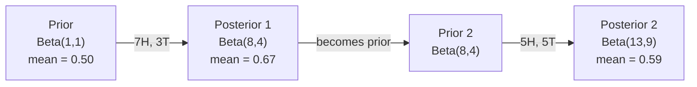

# 贝叶斯定理

> 概率关乎你的预期。贝叶斯定理关乎你的学习。

**类型：** 构建
**语言：** Python
**前置知识：** 阶段 1，第 06 课（概率基础）
**时间：** ~75 分钟

## 学习目标

- 应用贝叶斯定理，从先验、似然和证据计算后验概率
- 从零构建带拉普拉斯平滑和对数空间计算的朴素贝叶斯文本分类器
- 比较 MLE 和 MAP 估计，并解释 MAP 如何对应于 L2 正则化
- 使用 Beta-二项共轭先验实现用于 A/B 测试的序贯贝叶斯更新

## 问题

一种医学检测的准确率为 99%。你检测呈阳性。你实际患病的概率是多少？

大多数人会说 99%。真正的答案取决于疾病的罕见程度。如果每 10,000 人中只有 1 人患病，那么阳性结果只意味着你大约有 1% 的概率患病。其余 99% 的阳性结果来自健康人的误报。

这不是脑筋急转弯。这就是贝叶斯定理。每个垃圾邮件过滤器、每个医学诊断、每个量化不确定性的机器学习模型都使用这种推理。你从一个信念开始。你看到证据。你更新。

如果你在不理解这一点的情况下构建 ML 系统，你会误解模型输出、设置糟糕的阈值，并交付过度自信的预测。

## 概念

### 从联合概率到贝叶斯

从第 06 课你已经知道条件概率是：

```
P(A|B) = P(A and B) / P(B)
```

对称地：

```
P(B|A) = P(A and B) / P(A)
```

两个表达式共享相同的分子：P(A and B)。令它们相等并重新排列：

```
P(A and B) = P(A|B) * P(B) = P(B|A) * P(A)

Therefore:

P(A|B) = P(B|A) * P(A) / P(B)
```

这就是贝叶斯定理。四个量，一个方程。

### 四个部分

| 部分 | 名称 | 含义 |
|------|------|------|
| P(A\|B) | 后验 | 看到证据 B 后，你对 A 的更新信念 |
| P(B\|A) | 似然 | 如果 A 为真，证据 B 出现的概率 |
| P(A) | 先验 | 看到任何证据之前，你对 A 的信念 |
| P(B) | 证据 | 在所有可能性下看到 B 的总概率 |

证据项 P(B) 充当归一化因子。你可以用全概率公式展开它：

```
P(B) = P(B|A) * P(A) + P(B|not A) * P(not A)
```

### 医学检测示例

一种疾病影响每 10,000 人中的 1 人。检测准确率为 99%（能检出 99% 的患者，对健康人有 1% 的误报率）。

```
P(sick)          = 0.0001     (prior: disease is rare)
P(positive|sick) = 0.99       (likelihood: test catches it)
P(positive|healthy) = 0.01    (false positive rate)

P(positive) = P(positive|sick) * P(sick) + P(positive|healthy) * P(healthy)
            = 0.99 * 0.0001 + 0.01 * 0.9999
            = 0.000099 + 0.009999
            = 0.010098

P(sick|positive) = P(positive|sick) * P(sick) / P(positive)
                 = 0.99 * 0.0001 / 0.010098
                 = 0.0098
                 = 0.98%
```

不到 1%。先验占主导。当一种疾病罕见时，即使准确的检测也会产生大量误报。这就是为什么医生要安排确认检测。

### 垃圾邮件过滤器示例

你收到一封包含单词 "lottery" 的邮件。它是垃圾邮件吗？

```
P(spam)                = 0.3      (30% of email is spam)
P("lottery"|spam)      = 0.05     (5% of spam emails contain "lottery")
P("lottery"|not spam)  = 0.001    (0.1% of legitimate emails contain "lottery")

P("lottery") = 0.05 * 0.3 + 0.001 * 0.7
             = 0.015 + 0.0007
             = 0.0157

P(spam|"lottery") = 0.05 * 0.3 / 0.0157
                  = 0.955
                  = 95.5%
```

一个词将概率从 30% 提升到 95.5%。真正的垃圾邮件过滤器会同时在数百个词上应用贝叶斯。

### 朴素贝叶斯：独立性假设

朴素贝叶斯通过假设所有特征在给定类别条件下相互独立，将上述方法扩展到多个特征：

```
P(class | feature_1, feature_2, ..., feature_n)
  = P(class) * P(feature_1|class) * P(feature_2|class) * ... * P(feature_n|class)
    / P(feature_1, feature_2, ..., feature_n)
```

"朴素"之处在于独立性假设。在文本中，词的出现并不独立（"New" 和 "York" 相关）。但这个假设在实践中出奇地有效，因为分类器只需要对类别进行排序，而不是产生经过校准的概率。

由于所有类别的分母相同，你可以跳过它，只比较分子：

```
score(class) = P(class) * product of P(feature_i | class)
```

选择得分最高的类别。

### 最大似然估计（MLE）

如何从训练数据中得到 P(feature|class)？计数。

```
P("free"|spam) = (number of spam emails containing "free") / (total spam emails)
```

这就是 MLE：选择使观测数据最可能的参数值。你在最大化似然函数，对于离散计数来说，它简化为相对频率。

问题：如果一个词在训练期间从未在垃圾邮件中出现，MLE 给出的概率为零。一个未见过的词就毁掉整个乘积。用拉普拉斯平滑来修复：

```
P(word|class) = (count(word, class) + 1) / (total_words_in_class + vocabulary_size)
```

给每个计数加 1，确保没有任何概率为零。

### 最大后验估计（MAP）

MLE 问：什么参数能最大化 P(data|parameters)？

MAP 问：什么参数能最大化 P(parameters|data)？

根据贝叶斯定理：

```
P(parameters|data) proportional to P(data|parameters) * P(parameters)
```

MAP 为参数本身添加了先验。如果你认为参数应该很小，你就将其编码为惩罚大值的先验。这与 ML 中的 L2 正则化完全相同。岭回归中的"岭"惩罚本质上就是权重的高斯先验。

| 估计方法 | 优化目标 | ML 等价形式 |
|----------|----------|------------|
| MLE | P(data\|params) | 无正则化训练 |
| MAP | P(data\|params) * P(params) | L2 / L1 正则化 |

### 贝叶斯学派 vs 频率学派：实际差异

频率学派将参数视为固定的未知量。他们问："如果我重复这个实验很多次，会发生什么？"

贝叶斯学派将参数视为分布。他们问："给定我已观测到的，我对参数有什么信念？"

对于构建 ML 系统，实际差异如下：

| 方面 | 频率学派 | 贝叶斯学派 |
|------|----------|-----------|
| 输出 | 点估计 | 值的分布 |
| 不确定性 | 置信区间（关于程序） | 可信区间（关于参数） |
| 小数据 | 可能过拟合 | 先验充当正则化 |
| 计算 | 通常更快 | 通常需要采样（MCMC） |

大多数生产 ML 是频率学派的（SGD、点估计）。贝叶斯方法在需要校准不确定性（医学决策、安全关键系统）或数据稀缺（少样本学习、冷启动）时表现出色。

### 为什么贝叶斯思维对 ML 很重要

这种联系比类比更深：

**先验就是正则化。** 权重上的高斯先验就是 L2 正则化。拉普拉斯先验就是 L1。每次你添加正则化项时，你都在做一个关于期望参数值的贝叶斯陈述。

**后验就是不确定性。** 单一的预测概率无法告诉你模型对该估计的置信程度。贝叶斯方法给你一个分布："我认为 P(spam) 在 0.8 到 0.95 之间。"

**贝叶斯更新是在线学习。** 今天的后验成为明天的先验。当模型看到新数据时，它增量地更新信念，而不是从头重新训练。

**模型比较是贝叶斯的。** 贝叶斯信息准则（BIC）、边际似然和贝叶斯因子都使用贝叶斯推理来选择模型，避免过拟合。

## 动手构建

### 步骤 1：贝叶斯定理函数

```python
def bayes(prior, likelihood, false_positive_rate):
    evidence = likelihood * prior + false_positive_rate * (1 - prior)
    posterior = likelihood * prior / evidence
    return posterior

result = bayes(prior=0.0001, likelihood=0.99, false_positive_rate=0.01)
print(f"P(sick|positive) = {result:.4f}")
```

### 步骤 2：朴素贝叶斯分类器

```python
import math
from collections import defaultdict

class NaiveBayes:
    def __init__(self, smoothing=1.0):
        self.smoothing = smoothing
        self.class_counts = defaultdict(int)
        self.word_counts = defaultdict(lambda: defaultdict(int))
        self.class_word_totals = defaultdict(int)
        self.vocab = set()

    def train(self, documents, labels):
        for doc, label in zip(documents, labels):
            self.class_counts[label] += 1
            words = doc.lower().split()
            for word in words:
                self.word_counts[label][word] += 1
                self.class_word_totals[label] += 1
                self.vocab.add(word)

    def predict(self, document):
        words = document.lower().split()
        total_docs = sum(self.class_counts.values())
        vocab_size = len(self.vocab)
        best_class = None
        best_score = float("-inf")
        for cls in self.class_counts:
            score = math.log(self.class_counts[cls] / total_docs)
            for word in words:
                count = self.word_counts[cls].get(word, 0)
                total = self.class_word_totals[cls]
                score += math.log((count + self.smoothing) / (total + self.smoothing * vocab_size))
            if score > best_score:
                best_score = score
                best_class = cls
        return best_class
```

对数概率防止下溢。将许多小概率相乘会产生浮点数无法表示的极小数值。求和对数概率在数值上是稳定的，且在数学上等价。

### 步骤 3：在垃圾邮件数据上训练

```python
train_docs = [
    "win free money now",
    "free lottery ticket winner",
    "claim your prize today free",
    "urgent offer free cash",
    "congratulations you won free",
    "meeting tomorrow at noon",
    "project update attached",
    "can we schedule a call",
    "quarterly report review",
    "lunch on thursday sounds good",
    "team standup notes attached",
    "please review the pull request",
]

train_labels = [
    "spam", "spam", "spam", "spam", "spam",
    "ham", "ham", "ham", "ham", "ham", "ham", "ham",
]

classifier = NaiveBayes()
classifier.train(train_docs, train_labels)

test_messages = [
    "free money waiting for you",
    "meeting rescheduled to friday",
    "you won a free prize",
    "please review the attached report",
]

for msg in test_messages:
    print(f"  '{msg}' -> {classifier.predict(msg)}")
```

### 步骤 4：检查学习到的概率

```python
def show_top_words(classifier, cls, n=5):
    vocab_size = len(classifier.vocab)
    total = classifier.class_word_totals[cls]
    probs = {}
    for word in classifier.vocab:
        count = classifier.word_counts[cls].get(word, 0)
        probs[word] = (count + classifier.smoothing) / (total + classifier.smoothing * vocab_size)
    sorted_words = sorted(probs.items(), key=lambda x: x[1], reverse=True)
    for word, prob in sorted_words[:n]:
        print(f"    {word}: {prob:.4f}")

print("\nTop spam words:")
show_top_words(classifier, "spam")
print("\nTop ham words:")
show_top_words(classifier, "ham")
```

## 使用它

Scikit-learn 提供了生产就绪的朴素贝叶斯实现：

```python
from sklearn.feature_extraction.text import CountVectorizer
from sklearn.naive_bayes import MultinomialNB
from sklearn.metrics import classification_report

vectorizer = CountVectorizer()
X_train = vectorizer.fit_transform(train_docs)
clf = MultinomialNB()
clf.fit(X_train, train_labels)

X_test = vectorizer.transform(test_messages)
predictions = clf.predict(X_test)
for msg, pred in zip(test_messages, predictions):
    print(f"  '{msg}' -> {pred}")
```

同样的算法。CountVectorizer 处理分词和词汇构建。MultinomialNB 内部处理平滑和对数概率。你从零构建的版本用 40 行代码做了同样的事情。

## 交付

这里构建的 NaiveBayes 类展示了完整流程：分词、带拉普拉斯平滑的概率估计、对数空间预测。`code/bayes.py` 中的代码端到端运行，除了 Python 标准库外无需任何依赖。

### 共轭先验

当先验和后验属于同一分布族时，该先验称为"共轭"先验。这使得贝叶斯更新在代数上很简洁——你得到闭式后验，无需数值积分。

| 似然 | 共轭先验 | 后验 | 示例 |
|------|----------|------|------|
| 伯努利 | Beta(a, b) | Beta(a + 成功次数, b + 失败次数) | 硬币偏差估计 |
| 正态（已知方差） | Normal(mu_0, sigma_0) | Normal（加权均值，更小方差） | 传感器校准 |
| 泊松 | Gamma(a, b) | Gamma(a + 计数之和, b + n) | 到达率建模 |
| 多项式 | Dirichlet(alpha) | Dirichlet(alpha + 计数) | 主题建模、语言模型 |

为什么重要：没有共轭先验时，你需要蒙特卡洛采样或变分推断来近似后验。有了共轭先验，你只需要更新两个数字。

Beta 分布是实践中最常见的共轭先验。Beta(a, b) 表示你对概率参数的信念。均值是 a/(a+b)。a+b 越大，分布越集中（越有信心）。

Beta 先验的特殊情况：
- Beta(1, 1) = 均匀分布。你对参数没有偏好。
- Beta(10, 10) = 在 0.5 处尖锐。你强烈认为参数接近 0.5。
- Beta(1, 10) = 偏向 0。你认为参数很小。

更新规则非常简单：

```
Prior:     Beta(a, b)
Data:      s successes, f failures
Posterior: Beta(a + s, b + f)
```

没有积分。没有采样。只有加法。

### 序贯贝叶斯更新

贝叶斯推断天然是序贯的。今天的后验成为明天的先验。这是真实系统增量学习的方式，无需重新处理所有历史数据。

具体示例：估计硬币是否公平。

**第 1 天：尚无数据。**
从 Beta(1, 1) 开始——均匀先验。你没有偏好。
- 先验均值：0.5
- 先验在 [0, 1] 上平坦

**第 2 天：观测到 7 次正面，3 次反面。**
后验 = Beta(1 + 7, 1 + 3) = Beta(8, 4)
- 后验均值：8/12 = 0.667
- 证据表明硬币偏向正面

**第 3 天：再观测到 5 次正面，5 次反面。**
用昨天的后验作为今天的先验。
后验 = Beta(8 + 5, 4 + 5) = Beta(13, 9)
- 后验均值：13/22 = 0.591
- 新的平衡数据将估计拉回 0.5



观测顺序无关紧要。Beta(1,1) 一次性更新所有 12 次正面和 8 次反面，得到 Beta(13, 9)——同样的结果。序贯更新和批量更新在数学上等价。但序贯更新让你能在每一步做出决策，无需存储原始数据。

这是生产 ML 系统中在线学习的基础。用于多臂老虎机的 Thompson 采样、增量推荐系统和流式异常检测器都使用这种模式。

### 与 A/B 测试的联系

A/B 测试是伪装的贝叶斯推断。

设定：你在测试两种按钮颜色。变体 A（蓝色）和变体 B（绿色）。你想知道哪个获得更多点击。

贝叶斯 A/B 测试：

1. **先验。** 对两个变体都从 Beta(1, 1) 开始。无先验偏好。
2. **数据。** 变体 A：1000 次展示中 50 次点击。变体 B：1000 次展示中 65 次点击。
3. **后验。**
   - A：Beta(1 + 50, 1 + 950) = Beta(51, 951)。均值 = 0.051
   - B：Beta(1 + 65, 1 + 935) = Beta(66, 936)。均值 = 0.066
4. **决策。** 计算 P(B > A)——B 的真实转化率高于 A 的概率。

解析计算 P(B > A) 很难。但蒙特卡洛让它变得简单：

```
1. Draw 100,000 samples from Beta(51, 951)  -> samples_A
2. Draw 100,000 samples from Beta(66, 936)  -> samples_B
3. P(B > A) = fraction of samples where B > A
```

如果 P(B > A) > 0.95，你发布变体 B。如果在 0.05 到 0.95 之间，你继续收集数据。如果 P(B > A) < 0.05，你发布变体 A。

相比频率学派 A/B 测试的优势：
- 你得到直接的概率陈述："B 更好的概率是 97%"
- 没有 p 值困惑。没有"未能拒绝原假设"的含糊其辞。
- 你可以随时查看结果，不会增加假阳性率（没有"偷看问题"）
- 你可以纳入先验知识（例如，先前测试表明转化率通常在 3-8%）

| 方面 | 频率学派 A/B | 贝叶斯 A/B |
|------|-------------|-----------|
| 输出 | p 值 | P(B > A) |
| 解释 | "如果 A=B，这数据有多令人惊讶？" | "B 比 A 好的可能性有多大？" |
| 提前停止 | 增加假阳性 | 任何时刻都安全（给定良好选择的先验和正确设定的模型） |
| 先验知识 | 不使用 | 编码为 Beta 先验 |
| 决策规则 | p < 0.05 | P(B > A) > 阈值 |

## 练习

1. **多次检测。** 一位患者在两次独立检测中均呈阳性（两次准确率均为 99%，疾病患病率 1/10,000）。两次检测后 P(患病) 是多少？用第一次检测的后验作为第二次检测的先验。

2. **平滑的影响。** 用 0.01、0.1、1.0 和 10.0 的平滑值运行垃圾邮件分类器。最高词概率如何变化？当 smoothing=0 且某个词只在 ham 中出现时会发生什么？

3. **添加特征。** 扩展 NaiveBayes 类，将消息长度（短/长）作为与词频并列的特征。从训练数据中估计 P(short|spam) 和 P(short|ham)，并将其纳入预测得分。

4. **手算 MAP。** 给定观测数据（10 次抛硬币中 7 次正面），使用 Beta(2,2) 先验计算偏差的 MAP 估计。与 MLE 估计（7/10）比较。

## 关键术语

| 术语 | 人们的说法 | 实际含义 |
|------|----------|---------|
| 先验 | "我的初始猜测" | 观测证据前的 P(假设)。在 ML 中：正则化项。 |
| 似然 | "数据拟合得如何" | P(证据\|假设)。在特定假设下观测到数据的概率。 |
| 后验 | "我更新后的信念" | P(假设\|证据)。先验乘以似然，然后归一化。 |
| 证据 | "归一化常数" | 所有假设下的 P(数据)。确保后验之和为 1。 |
| 朴素贝叶斯 | "那个简单的文本分类器" | 假设特征在给定类别条件下独立的分类器。尽管假设不成立，效果却很好。 |
| 拉普拉斯平滑 | "加一平滑" | 给每个特征加一个小计数，防止未见数据产生零概率。 |
| MLE | "直接用频率" | 选择最大化 P(data\|parameters) 的参数。无先验。小数据可能过拟合。 |
| MAP | "带先验的 MLE" | 选择最大化 P(data\|parameters) * P(parameters) 的参数。等价于正则化 MLE。 |
| 对数概率 | "在对数空间工作" | 使用 log(P) 代替 P，避免将许多小数相乘时的浮点下溢。 |
| 假阳性 | "错误的警报" | 检测说阳性，但真实状态是阴性。导致基础比率谬误。 |

## 延伸阅读

- [3Blue1Brown: Bayes' theorem](https://www.youtube.com/watch?v=HZGCoVF3YvM) - 医学检测示例的可视化解释
- [Stanford CS229: Generative Learning Algorithms](https://cs229.stanford.edu/notes2022fall/cs229-notes2.pdf) - 朴素贝叶斯及其与判别模型的联系
- [Think Bayes](https://greenteapress.com/wp/think-bayes/) - 免费书籍，用 Python 代码讲解贝叶斯统计
- [scikit-learn Naive Bayes](https://scikit-learn.org/stable/modules/naive_bayes.html) - 生产实现及每种变体的适用场景
