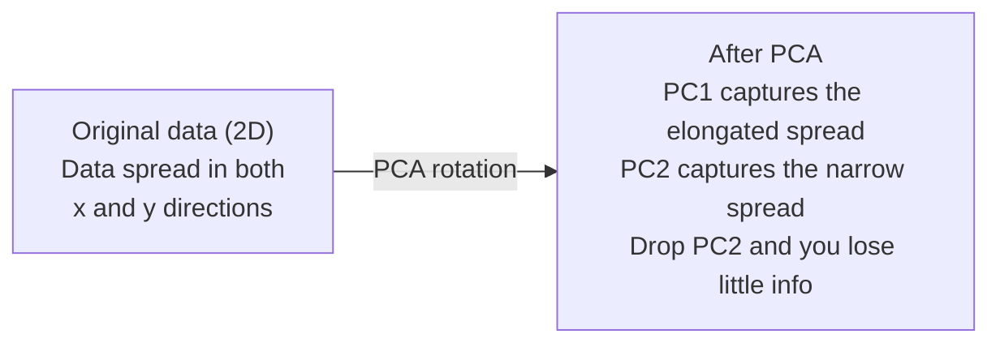

# 降维

> 高维数据具有结构。你需要从正确的角度去发现它。

**类型：** Build
**语言：** Python
**前置知识：** 第一阶段，课程 01（线性代数直觉）、02（向量、矩阵与运算）、03（特征值与特征向量）、06（概率与分布）
**时间：** ~90 分钟

## 学习目标

- 从零实现 PCA：数据中心化、计算协方差矩阵、特征分解、投影
- 使用解释方差比率和肘部法选择主成分数量
- 比较 PCA、t-SNE 和 UMAP 在 MNIST 数字二维可视化中的效果，并解释它们的权衡
- 对标准 PCA 无法处理的非线性数据结构应用带 RBF 核的核 PCA

## 问题

你有一个每个样本 784 个特征的数据集。可能是手写数字的像素值，可能是基因表达水平，也可能是用户行为信号。你无法可视化 784 维。无法绘制它们。甚至无法想象它们。

但这 784 个特征中大多数是冗余的。真正的信息存在于一个小得多的表面上。一个手写的"7"不需要 784 个独立数字来描述。它只需要几个：笔画的角度、横杠的长度、倾斜程度。其余都是噪声。

降维就是找到那个更小的表面。它将你的 784 维数据压缩到 2 维、10 维或 50 维，同时保留重要的结构。

## 概念

### 维度灾难

高维空间是反直觉的。随着维度增长，有三件事会出问题。

**距离变得无意义。** 在高维空间中，任意两个随机点之间的距离收敛到相同的值。如果每个点到其他每个点的距离都差不多，最近邻搜索就会失效。

```
Dimension    Avg distance ratio (max/min between random points)
2            ~5.0
10           ~1.8
100          ~1.2
1000         ~1.02
```

**体积集中在角落。** d 维单位超立方体有 2^d 个角。在 100 维中，几乎所有体积都在角落，远离中心。数据点扩散到边缘，而你的模型在内部缺乏数据。

**你需要指数级更多的数据。** 要在空间中保持相同的样本密度，从 2D 到 20D 意味着你需要 10^18 倍的数据。你永远不够。降维将数据密度带回可处理的范围。

### PCA：找到重要的方向

主成分分析（PCA）找到数据方差最大的轴。它旋转坐标系，使第一个轴捕获最多方差，第二个轴捕获次多方差，以此类推。

算法：

```
1. Center the data        (subtract the mean from each feature)
2. Compute covariance     (how features move together)
3. Eigendecomposition     (find the principal directions)
4. Sort by eigenvalue     (biggest variance first)
5. Project               (keep top k eigenvectors, drop the rest)
```

为什么要特征分解？协方差矩阵是对称半正定的。它的特征向量是特征空间中的正交方向。特征值告诉你每个方向捕获多少方差。最大特征值对应的特征向量指向最大方差的方向。



- **PCA 之前：** 数据云在 x 和 y 轴上呈对角线分布
- **PCA 之后：** 坐标系旋转，使 PC1 与最大方差方向（ elongated spread）对齐，PC2 与最小方差方向（narrow spread）对齐
- **降维：** 丢弃 PC2 将数据投影到 PC1 上，损失极少信息

### 解释方差比率

每个主成分捕获总方差的一部分。解释方差比率告诉你具体是多少。

```
Component    Eigenvalue    Explained ratio    Cumulative
PC1          4.73          0.473              0.473
PC2          2.51          0.251              0.724
PC3          1.12          0.112              0.836
PC4          0.89          0.089              0.925
...
```

当累积解释方差达到 0.95 时，你就知道这么多成分捕获了 95% 的信息。之后的部分大多是噪声。

### 选择成分数量

三种策略：

1. **阈值法。** 保留足够解释 90-95% 方差的成分。
2. **肘部法。** 绘制每个成分的贡献方差。寻找急剧下降的点。
3. **下游性能法。** 将 PCA 作为预处理。遍历 k 并测量模型准确率。最佳 k 是准确率趋于平稳的位置。

### t-SNE：保留邻域

t 分布随机邻域嵌入（t-SNE）专为可视化设计。它将高维数据映射到 2D（或 3D），同时保留哪些点彼此靠近。

直觉是：在原始空间中，基于点对之间的距离计算概率分布。近的点概率高，远的点概率低。然后找到一个 2D 布局，使相同的概率分布成立。在 784 维中是邻居的点，在 2D 中仍然是邻居。

t-SNE 的关键特性：
- 非线性。可以展开 PCA 无法处理的复杂流形。
- 随机性。不同运行产生不同布局。
- 困惑度参数控制考虑多少邻居（典型范围：5-50）。
- 输出中聚类之间的距离没有意义。只有聚类本身有意义。
- 大数据集上较慢。默认 O(n^2)。

### UMAP：更快，更好的全局结构

均匀流形近似与投影（UMAP）与 t-SNE 类似，但有两个优势：
- 更快。使用近似最近邻图，而非计算所有成对距离。
- 更好的全局结构。输出中聚类的相对位置往往比 t-SNE 更有意义。

UMAP 在高维空间中构建加权图（"模糊拓扑表示"），然后找到尽可能保留该图的低维布局。

关键参数：
- `n_neighbors`：多少邻居定义局部结构（类似于困惑度）。更高的值保留更多全局结构。
- `min_dist`：点在输出中聚集的紧密程度。较低的值创建更密集的聚类。

### 何时使用哪种方法

| 方法 | 使用场景 | 保留什么 | 速度 |
|--------|----------|-----------|-------|
| PCA | 训练前预处理 | 全局方差 | 快（精确），可处理数百万样本 |
| PCA | 快速探索性可视化 | 线性结构 | 快 |
| t-SNE | 出版物级 2D 图 | 局部邻域 | 慢（< 10k 样本理想） |
| UMAP | 大规模 2D 可视化 | 局部 + 部分全局结构 | 中等（可处理数百万） |
| PCA | 模型特征降维 | 按方差排序的特征 | 快 |
| t-SNE / UMAP | 理解聚类结构 | 聚类分离度 | 中等到慢 |

经验法则：预处理和数据压缩用 PCA。需要可视化 2D 结构时用 t-SNE 或 UMAP。

### 核 PCA

标准 PCA 找到线性子空间。它旋转坐标系并丢弃轴。但如果数据位于非线性流形上呢？2D 中的圆无法被任何直线分开。标准 PCA 帮不上忙。

核 PCA 在核函数诱导的高维特征空间中应用 PCA，而无需显式计算该空间中的坐标。这就是核技巧——SVM 背后的相同思想。

算法：
1. 计算核矩阵 K，其中 K_ij = k(x_i, x_j)
2. 在特征空间中对核矩阵进行中心化
3. 对中心化后的核矩阵进行特征分解
4. 顶部特征向量（按 1/sqrt(特征值) 缩放）即为投影

常见核函数：

| 核函数 | 公式 | 适用场景 |
|--------|---------|----------|
| RBF（高斯） | exp(-gamma * \|\|x - y\|\|^2) | 大多数非线性数据，光滑流形 |
| 多项式 | (x . y + c)^d | 多项式关系 |
| Sigmoid | tanh(alpha * x . y + c) | 类神经网络映射 |

何时使用核 PCA 与标准 PCA：

| 标准 | 标准 PCA | 核 PCA |
|-----------|-------------|------------|
| 数据结构 | 线性子空间 | 非线性流形 |
| 速度 | O(min(n^2 d, d^2 n)) | O(n^2 d + n^3) |
| 可解释性 | 成分是特征的线性组合 | 成分缺乏直接的特征解释 |
| 可扩展性 | 可处理数百万样本 | 核矩阵为 n x n，受内存限制 |
| 重建 | 直接逆变换 | 需要原像近似 |

经典例子：2D 中的同心圆。两个点环，一个在内，一个在外。标准 PCA 将两者投影到同一条线上——对分类无用。带 RBF 核的核 PCA 将内圆和外圆映射到不同区域，使其线性可分。

### 重建误差

你的降维效果有多好？你把 784 维压缩到 50 维。损失了什么？

测量重建误差：
1. 将数据投影到 k 维：X_reduced = X @ W_k
2. 重建：X_hat = X_reduced @ W_k^T
3. 计算 MSE：mean((X - X_hat)^2)

对于 PCA，重建误差与解释方差有清晰的关系：

```
Reconstruction error = sum of eigenvalues NOT included
Total variance = sum of ALL eigenvalues
Fraction lost = (sum of dropped eigenvalues) / (sum of all eigenvalues)
```

每个成分的贡献方差比率为：

```
explained_ratio_k = eigenvalue_k / sum(all eigenvalues)
```

绘制累积解释方差与成分数量的关系图，得到"肘部"曲线。合适的成分数量位于：
- 曲线趋于平缓的位置（收益递减）
- 累积方差超过阈值（通常为 0.90 或 0.95）
- 下游任务性能趋于平稳

重建误差在选择 k 之外还有用。可用于异常检测：重建误差高的样本是不符合学习子空间的异常值。这是生产系统中基于 PCA 的异常检测的基础。

## 动手实现

### 步骤 1：从零实现 PCA

```python
import numpy as np

class PCA:
    def __init__(self, n_components):
        self.n_components = n_components
        self.components = None
        self.mean = None
        self.eigenvalues = None
        self.explained_variance_ratio_ = None

    def fit(self, X):
        self.mean = np.mean(X, axis=0)
        X_centered = X - self.mean

        cov_matrix = np.cov(X_centered, rowvar=False)

        eigenvalues, eigenvectors = np.linalg.eigh(cov_matrix)

        sorted_idx = np.argsort(eigenvalues)[::-1]
        eigenvalues = eigenvalues[sorted_idx]
        eigenvectors = eigenvectors[:, sorted_idx]

        self.components = eigenvectors[:, :self.n_components].T
        self.eigenvalues = eigenvalues[:self.n_components]
        total_var = np.sum(eigenvalues)
        self.explained_variance_ratio_ = self.eigenvalues / total_var

        return self

    def transform(self, X):
        X_centered = X - self.mean
        return X_centered @ self.components.T

    def fit_transform(self, X):
        self.fit(X)
        return self.transform(X)
```

### 步骤 2：在合成数据上测试

```python
np.random.seed(42)
n_samples = 500

t = np.random.uniform(0, 2 * np.pi, n_samples)
x1 = 3 * np.cos(t) + np.random.normal(0, 0.2, n_samples)
x2 = 3 * np.sin(t) + np.random.normal(0, 0.2, n_samples)
x3 = 0.5 * x1 + 0.3 * x2 + np.random.normal(0, 0.1, n_samples)

X_synthetic = np.column_stack([x1, x2, x3])

pca = PCA(n_components=2)
X_reduced = pca.fit_transform(X_synthetic)

print(f"Original shape: {X_synthetic.shape}")
print(f"Reduced shape:  {X_reduced.shape}")
print(f"Explained variance ratios: {pca.explained_variance_ratio_}")
print(f"Total variance captured: {sum(pca.explained_variance_ratio_):.4f}")
```

### 步骤 3：MNIST 数字的 2D 可视化

```python
from sklearn.datasets import fetch_openml

mnist = fetch_openml("mnist_784", version=1, as_frame=False, parser="auto")
X_mnist = mnist.data[:5000].astype(float)
y_mnist = mnist.target[:5000].astype(int)

pca_mnist = PCA(n_components=50)
X_pca50 = pca_mnist.fit_transform(X_mnist)
print(f"50 components capture {sum(pca_mnist.explained_variance_ratio_):.2%} of variance")

pca_2d = PCA(n_components=2)
X_pca2d = pca_2d.fit_transform(X_mnist)
print(f"2 components capture {sum(pca_2d.explained_variance_ratio_):.2%} of variance")
```

### 步骤 4：与 sklearn 对比

```python
from sklearn.decomposition import PCA as SklearnPCA
from sklearn.manifold import TSNE

sklearn_pca = SklearnPCA(n_components=2)
X_sklearn_pca = sklearn_pca.fit_transform(X_mnist)

print(f"\nOur PCA explained variance:     {pca_2d.explained_variance_ratio_}")
print(f"Sklearn PCA explained variance: {sklearn_pca.explained_variance_ratio_}")

diff = np.abs(np.abs(X_pca2d) - np.abs(X_sklearn_pca))
print(f"Max absolute difference: {diff.max():.10f}")

tsne = TSNE(n_components=2, perplexity=30, random_state=42)
X_tsne = tsne.fit_transform(X_mnist)
print(f"\nt-SNE output shape: {X_tsne.shape}")
```

### 步骤 5：UMAP 对比

```python
try:
    from umap import UMAP

    reducer = UMAP(n_components=2, n_neighbors=15, min_dist=0.1, random_state=42)
    X_umap = reducer.fit_transform(X_mnist)
    print(f"UMAP output shape: {X_umap.shape}")
except ImportError:
    print("Install umap-learn: pip install umap-learn")
```

## 应用

PCA 作为分类器前的预处理：

```python
from sklearn.decomposition import PCA as SklearnPCA
from sklearn.linear_model import LogisticRegression
from sklearn.model_selection import train_test_split
from sklearn.metrics import accuracy_score

X_train, X_test, y_train, y_test = train_test_split(
    X_mnist, y_mnist, test_size=0.2, random_state=42
)

results = {}
for k in [10, 30, 50, 100, 200]:
    pca_k = SklearnPCA(n_components=k)
    X_tr = pca_k.fit_transform(X_train)
    X_te = pca_k.transform(X_test)

    clf = LogisticRegression(max_iter=1000, random_state=42)
    clf.fit(X_tr, y_train)
    acc = accuracy_score(y_test, clf.predict(X_te))
    var_captured = sum(pca_k.explained_variance_ratio_)
    results[k] = (acc, var_captured)
    print(f"k={k:>3d}  accuracy={acc:.4f}  variance={var_captured:.4f}")
```

性能在远未达到 784 维时就趋于平稳。那个平稳点就是你的工作点。

## 交付

本课程产出：
- `outputs/skill-dimensionality-reduction.md` — 一项为给定任务选择合适降维技术的技能

## 练习

1. 修改 PCA 类以支持 `inverse_transform`。从 10、50 和 200 个成分重建 MNIST 数字。打印每种情况的重建误差（与原始图像的均方差）。

2. 在相同的 MNIST 子集上用困惑度 5、30 和 100 运行 t-SNE。描述输出如何变化。为什么困惑度会影响聚类紧密度？

3. 取一个 50 个特征但只有 5 个有信息量的数据集（用 `sklearn.datasets.make_classification` 生成）。应用 PCA 并检查解释方差曲线是否正确识别出数据实际上是 5 维的。

## 关键术语

| 术语 | 人们怎么说 | 实际含义 |
|------|----------------|----------------------|
| 维度灾难 | "特征太多" | 距离、体积和数据密度在维度增长时都表现出反直觉的行为。模型需要指数级更多的数据来补偿。 |
| PCA | "降维" | 旋转坐标系使轴与最大方差方向对齐，然后丢弃低方差轴。 |
| 主成分 | "一个重要的方向" | 协方差矩阵的特征向量。数据在特征空间中变化最大的方向。 |
| 解释方差比率 | "这个成分有多少信息" | 一个主成分捕获的总方差的比例。累加前 k 个比率可看到 k 个成分保留了多少。 |
| 协方差矩阵 | "特征如何相关" | 对称矩阵，其中条目 (i,j) 衡量特征 i 和特征 j 如何共同变化。对角线条目是单个方差。 |
| t-SNE | "那个聚类图" | 通过保留成对邻域概率将高维数据映射到 2D 的非线性方法。适合可视化，不适合预处理。 |
| UMAP | "更快的 t-SNE" | 基于拓扑数据分析的非线性方法。保留局部和部分全局结构。比 t-SNE 更具扩展性。 |
| 困惑度 | "t-SNE 的旋钮" | 控制每个点考虑的有效邻居数量。低困惑度关注非常局部的结构。高困惑度捕获更广泛的规律。 |
| 流形 | "数据所在的表面" | 嵌入高维空间中的低维表面。3D 中揉皱的纸是 2D 流形。 |

## 延伸阅读

- [A Tutorial on Principal Component Analysis](https://arxiv.org/abs/1404.1100) (Shlens) — 从基础推导 PCA 的清晰教程
- [How to Use t-SNE Effectively](https://distill.pub/2016/misread-tsne/) (Wattenberg et al.) — t-SNE 陷阱和参数选择的交互式指南
- [UMAP documentation](https://umap-learn.readthedocs.io/) — UMAP 作者提供的理论和实践指导
