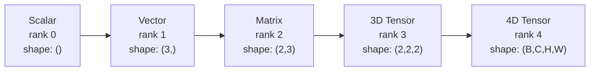
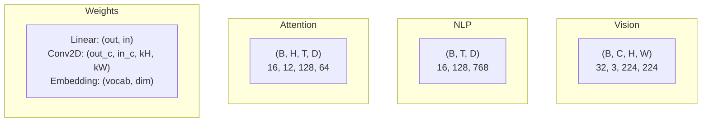
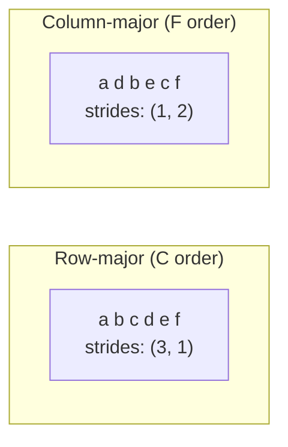
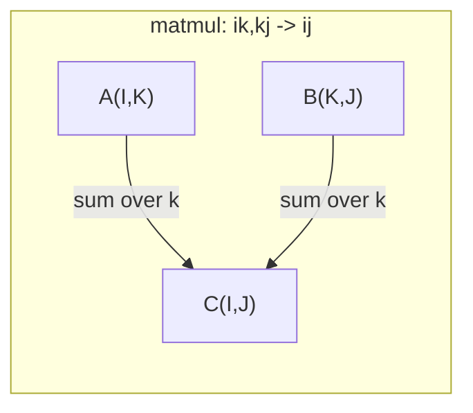

# 张量操作

> 张量是数据与深度学习之间的通用语言。每一张图像、每一个句子、每一个梯度都流经它们。

**类型：** 构建
**语言：** Python
**前置知识：** 第 1 阶段，第 01 课（线性代数直觉）、第 02 课（向量、矩阵与运算）
**时间：** ~90 分钟

## 学习目标

- 从零实现一个张量类，包含形状、步长、reshape、transpose 和逐元素操作
- 应用广播规则，在不同形状的张量上进行操作而无需复制数据
- 编写 einsum 表达式，用于点积、矩阵乘法、外积和批处理操作
- 追踪多头注意力每一步的精确张量形状

## 问题

你构建了一个 transformer。前向传播看起来很干净。运行后却得到：`RuntimeError: mat1 and mat2 shapes cannot be multiplied (32x768 and 512x768)`。你盯着形状看。尝试转置。现在显示 `Expected 4D input (got 3D input)`。你添加一个 unsqueeze。别的东西又坏了。

形状错误是深度学习代码中最常见的 bug。它们在概念上并不难——每个操作都有形状契约——但它们传播得很快。一个 transformer 有数十个 reshape、transpose 和 broadcast 串联在一起。一个错误的轴就会导致错误级联。更糟的是，有些形状错误根本不会抛出异常。它们会静默地产生垃圾结果，比如沿错误的维度广播，或在错误的轴上求和。

矩阵处理两组事物之间的成对关系。真实数据无法放入两个维度。32 张 224×224 的 RGB 图像批次是一个 4D 张量：`(32, 3, 224, 224)`。12 个头的自注意力也是 4D：`(batch, heads, seq_len, head_dim)`。你需要一种数据结构，能够推广到任意数量的维度，并且操作能在所有维度上清晰组合。这种结构就是张量。掌握它的操作，形状错误就变得极易调试。

## 概念

### 什么是张量

张量是一个具有统一数据类型的多维数字数组。维度的数量称为**秩**（或**阶**）。每个维度是一个**轴**。**形状**是一个元组，列出每个轴上的大小。



总元素数 = 所有大小的乘积。形状 `(2, 3, 4)` 包含 `2 * 3 * 4 = 24` 个元素。

### 深度学习中的张量形状

按照惯例，不同的数据类型映射到特定的张量形状。



PyTorch 使用 NCHW（通道优先）。TensorFlow 默认使用 NHWC（通道在后）。布局不匹配会导致隐式性能下降或错误。

### 内存布局如何工作

内存中的 2D 数组是 1D 字节序列。**步长**告诉你沿每个轴移动一步需要跳过多少元素。



转置不会移动数据。它交换步长，使张量变为**非连续**——一行中的元素在内存中不再相邻。

### 广播规则

广播让你在不同形状的张量上进行操作而无需复制数据。从右侧对齐形状。两个维度在相等或其中一个为 1 时兼容。较少的维度会在左侧用 1 填充。

```
Tensor A:     (8, 1, 6, 1)
Tensor B:        (7, 1, 5)
Padded B:     (1, 7, 1, 5)
Result:       (8, 7, 6, 5)
```

### Einsum：通用张量操作

爱因斯坦求和用字母标记每个轴。输入中有但输出中没有的轴会被求和。两边都有的轴被保留。



关键模式：`i,i->`（点积）、`i,j->ij`（外积）、`ii->`（迹）、`ij->ji`（转置）、`bij,bjk->bik`（批量矩阵乘法）、`bhtd,bhsd->bhts`（注意力分数）。

## 动手实现

代码位于 `code/tensors.py`。每一步都参考那里的实现。

### 步骤 1：张量存储与步长

张量存储一个扁平的数字列表加上形状元数据。步长告诉索引逻辑如何将多维索引映射到扁平位置。

```python
class Tensor:
    def __init__(self, data, shape=None):
        if isinstance(data, (list, tuple)):
            self._data, self._shape = self._flatten_nested(data)
        elif isinstance(data, np.ndarray):
            self._data = data.flatten().tolist()
            self._shape = tuple(data.shape)
        else:
            self._data = [data]
            self._shape = ()

        if shape is not None:
            total = reduce(lambda a, b: a * b, shape, 1)
            if total != len(self._data):
                raise ValueError(
                    f"Cannot reshape {len(self._data)} elements into shape {shape}"
                )
            self._shape = tuple(shape)

        self._strides = self._compute_strides(self._shape)

    @staticmethod
    def _compute_strides(shape):
        if len(shape) == 0:
            return ()
        strides = [1] * len(shape)
        for i in range(len(shape) - 2, -1, -1):
            strides[i] = strides[i + 1] * shape[i + 1]
        return tuple(strides)
```

对于形状 `(3, 4)`，步长为 `(4, 1)`——前进一行跳过 4 个元素，前进一列跳过 1 个元素。

### 步骤 2：Reshape、Squeeze、Unsqueeze

Reshape 改变形状而不改变元素顺序。元素总数必须保持不变。使用 `-1` 让其中一个维度自动推断大小。

```python
t = Tensor(list(range(12)), shape=(2, 6))
r = t.reshape((3, 4))
r = t.reshape((-1, 3))
```

Squeeze 移除大小为 1 的轴。Unsqueeze 插入一个大小为 1 的轴。Unsqueeze 对广播至关重要——偏置向量 `(D,)` 加到批次 `(B, T, D)` 上时，需要 unsqueeze 到 `(1, 1, D)`。

```python
t = Tensor(list(range(6)), shape=(1, 3, 1, 2))
s = t.squeeze()
v = Tensor([1, 2, 3])
u = v.unsqueeze(0)
```

### 步骤 3：Transpose 和 Permute

Transpose 交换两个轴。Permute 重新排序所有轴。这就是你在 NCHW 和 NHWC 之间转换的方式。

```python
mat = Tensor(list(range(6)), shape=(2, 3))
tr = mat.transpose(0, 1)

t4d = Tensor(list(range(24)), shape=(1, 2, 3, 4))
perm = t4d.permute((0, 2, 3, 1))
```

经过 transpose 或 permute 后，张量在内存中是非连续的。在 PyTorch 中，`view` 在非连续张量上会失败——使用 `reshape` 或先调用 `.contiguous()`。

### 步骤 4：逐元素操作和归约

逐元素操作（加、乘、减）独立应用于每个元素并保持形状。归约（求和、平均、最大）折叠一个或多个轴。

```python
a = Tensor([[1, 2], [3, 4]])
b = Tensor([[10, 20], [30, 40]])
c = a + b
d = a * 2
s = a.sum(axis=0)
```

CNN 中的全局平均池化：`(B, C, H, W).mean(axis=[2, 3])` 产生 `(B, C)`。NLP 中的序列平均池化：`(B, T, D).mean(axis=1)` 产生 `(B, D)`。

### 步骤 5：使用 NumPy 进行广播

`tensors.py` 中的 `demo_broadcasting_numpy()` 函数展示了核心模式。

```python
activations = np.random.randn(4, 3)
bias = np.array([0.1, 0.2, 0.3])
result = activations + bias

images = np.random.randn(2, 3, 4, 4)
scale = np.array([0.5, 1.0, 1.5]).reshape(1, 3, 1, 1)
result = images * scale

a = np.array([1, 2, 3]).reshape(-1, 1)
b = np.array([10, 20, 30, 40]).reshape(1, -1)
outer = a * b
```

通过广播计算成对距离：将 `(M, 2)` reshape 为 `(M, 1, 2)`，将 `(N, 2)` reshape 为 `(1, N, 2)`，相减、平方、沿最后一个轴求和、取平方根。结果：`(M, N)`。

### 步骤 6：Einsum 操作

`demo_einsum()` 和 `demo_einsum_gallery()` 函数遍历了每种常见模式。

```python
a = np.array([1.0, 2.0, 3.0])
b = np.array([4.0, 5.0, 6.0])
dot = np.einsum("i,i->", a, b)

A = np.array([[1, 2], [3, 4], [5, 6]], dtype=float)
B = np.array([[7, 8, 9], [10, 11, 12]], dtype=float)
matmul = np.einsum("ik,kj->ij", A, B)

batch_A = np.random.randn(4, 3, 5)
batch_B = np.random.randn(4, 5, 2)
batch_mm = np.einsum("bij,bjk->bik", batch_A, batch_B)
```

缩并的计算成本是所有索引大小的乘积（保留的和求和的）。对于 `bij,bjk->bik`，B=32, I=128, J=64, K=128：`32 * 128 * 64 * 128 = 33,554,432` 次乘加运算。

### 步骤 7：通过 einsum 实现注意力机制

`demo_attention_einsum()` 函数端到端实现了多头注意力。

```python
B, H, T, D = 2, 4, 8, 16
E = H * D

X = np.random.randn(B, T, E)
W_q = np.random.randn(E, E) * 0.02

Q = np.einsum("bte,ek->btk", X, W_q)
Q = Q.reshape(B, T, H, D).transpose(0, 2, 1, 3)

scores = np.einsum("bhtd,bhsd->bhts", Q, K) / np.sqrt(D)
weights = softmax(scores, axis=-1)
attn_output = np.einsum("bhts,bhsd->bhtd", weights, V)

concat = attn_output.transpose(0, 2, 1, 3).reshape(B, T, E)
output = np.einsum("bte,ek->btk", concat, W_o)
```

每一步都是张量操作：投影（通过 einsum 的 matmul）、头拆分（reshape + transpose）、注意力分数（通过 einsum 的批量 matmul）、加权求和（通过 einsum 的批量 matmul）、头合并（transpose + reshape）、输出投影（通过 einsum 的 matmul）。

## 应用

### 手写实现 vs NumPy

| 操作 | 手写实现（Tensor 类） | NumPy |
|---|---|---|
| 创建 | `Tensor([[1,2],[3,4]])` | `np.array([[1,2],[3,4]])` |
| Reshape | `t.reshape((3,4))` | `a.reshape(3,4)` |
| Transpose | `t.transpose(0,1)` | `a.T` 或 `a.transpose(0,1)` |
| Squeeze | `t.squeeze(0)` | `np.squeeze(a, 0)` |
| 求和 | `t.sum(axis=0)` | `a.sum(axis=0)` |
| Einsum | 不适用 | `np.einsum("ij,jk->ik", a, b)` |

### 手写实现 vs PyTorch

```python
import torch

t = torch.tensor([[1, 2, 3], [4, 5, 6]], dtype=torch.float32)
t.shape
t.stride()
t.is_contiguous()

t.reshape(3, 2)
t.unsqueeze(0)
t.transpose(0, 1)
t.transpose(0, 1).contiguous()

torch.einsum("ik,kj->ij", A, B)
```

PyTorch 增加了 autograd、GPU 支持和优化的 BLAS 内核。形状语义完全相同。如果你理解了手写实现版本，PyTorch 的形状错误就变得可读。

### 每个神经网络层作为张量操作

| 操作 | 张量形式 | Einsum |
|---|---|---|
| 线性层 | `Y = X @ W.T + b` | `"bd,od->bo"` + bias |
| 注意力 QKV | `Q = X @ W_q` | `"btd,dh->bth"` |
| 注意力分数 | `Q @ K.T / sqrt(d)` | `"bhtd,bhsd->bhts"` |
| 注意力输出 | `softmax(scores) @ V` | `"bhts,bhsd->bhtd"` |
| 批归一化 | `(X - mu) / sigma * gamma` | 逐元素 + 广播 |
| Softmax | `exp(x) / sum(exp(x))` | 逐元素 + 归约 |

## 交付

本课产生两个可复用的提示词：

1. **`outputs/prompt-tensor-shapes.md`** —— 一个系统化的调试张量形状不匹配问题的提示词。包含每种常见操作（matmul、broadcast、cat、Linear、Conv2d、BatchNorm、softmax）的决策表和修复查找表。

2. **`outputs/prompt-tensor-debugger.md`** —— 一个分步调试提示词，当形状错误阻碍你时，可以粘贴到任何 AI 助手中。输入错误信息和你的张量形状，获得精确的修复方案。

## 练习

1. **简单 —— Reshape 往返。** 取一个形状为 `(2, 3, 4)` 的张量。将其 reshape 为 `(6, 4)`，然后到 `(24,)`，再回到 `(2, 3, 4)`。通过打印扁平数据验证每一步的元素顺序都被保留。

2. **中等 —— 实现广播。** 扩展 `Tensor` 类，添加一个 `broadcast_to(shape)` 方法，将大小为 1 的维度扩展到匹配目标形状。然后修改 `_elementwise_op`，在操作前自动广播。测试形状 `(3, 1)` 和 `(1, 4)` 产生 `(3, 4)`。

3. **困难 —— 从零实现 einsum。** 实现一个基础的 `einsum(subscripts, *tensors)` 函数，至少处理：点积（`i,i->`）、矩阵乘法（`ij,jk->ik`）、外积（`i,j->ij`）和转置（`ij->ji`）。解析下标字符串，识别收缩索引，并遍历所有索引组合。将你的结果与 `np.einsum` 进行比较。

4. **困难 —— 注意力形状追踪器。** 编写一个函数，以 `batch_size`、`seq_len`、`embed_dim` 和 `num_heads` 为输入，打印多头注意力每一步的精确形状：输入、Q/K/V 投影、头拆分、注意力分数、softmax 权重、加权求和、头合并、输出投影。与 `demo_attention_einsum()` 的输出进行验证。

## 关键术语

| 术语 | 人们的说法 | 实际含义 |
|---|---|---|
| Tensor | "比矩阵更多维的东西" | 具有统一类型和定义形状、步长及操作的多维数组 |
| Rank | "维度的数量" | 轴的数量。矩阵的 rank 为 2，不是指矩阵的秩 |
| Shape | "张量的大小" | 列出每个轴上大小的元组。`(2, 3)` 表示 2 行 3 列 |
| Stride | "内存如何布局" | 沿每个轴前进一个位置需要跳过的元素数量 |
| Broadcasting | "形状不同时它自动就能工作" | 严格的规则集：从右对齐，维度必须相等或其中一个为 1 |
| Contiguous | "张量是正常的" | 元素在内存中顺序存储，与逻辑布局相比没有间隙或重排 |
| Einsum | "写 matmul 的花哨方式" | 一种通用表示法，用一行代码表达任何张量缩并、外积、迹或转置 |
| View | "和 reshape 一样" | 共享相同内存缓冲区但具有不同形状/步长元数据的张量。在非连续数据上会失败 |
| Contraction | "对一个索引求和" | 一般操作，其中张量之间的共享索引被相乘并求和，产生更低秩的结果 |
| NCHW / NHWC | "PyTorch vs TensorFlow 格式" | 图像张量的内存布局约定。NCHW 将通道放在空间维度之前，NHWC 将通道放在之后 |

## 延伸阅读

- [NumPy Broadcasting](https://numpy.org/doc/stable/user/basics.broadcasting.html) —— 带有可视化示例的权威规则
- [PyTorch Tensor Views](https://pytorch.org/docs/stable/tensor_view.html) —— 视图何时有效、何时会复制
- [einops](https://github.com/arogozhnikov/einops) —— 让张量 reshape 可读且安全的库
- [The Illustrated Transformer](https://jalammar.github.io/illustrated-transformer/) —— 可视化注意力中流动的张量形状
- [Einstein Summation in NumPy](https://numpy.org/doc/stable/reference/generated/numpy.einsum.html) —— 完整的 einsum 文档及示例
