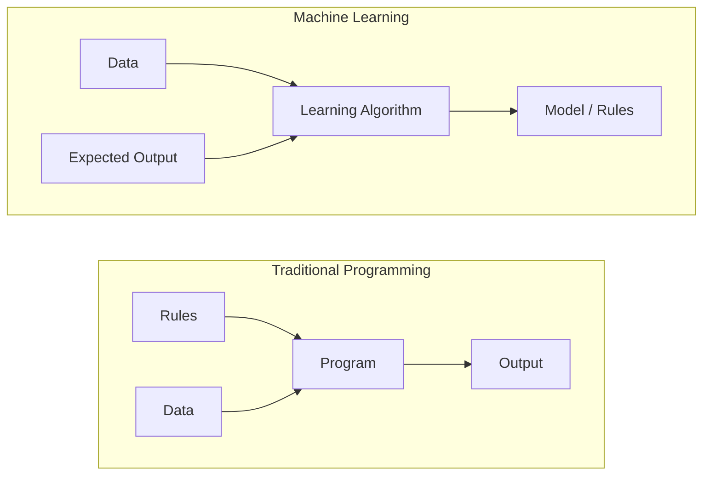
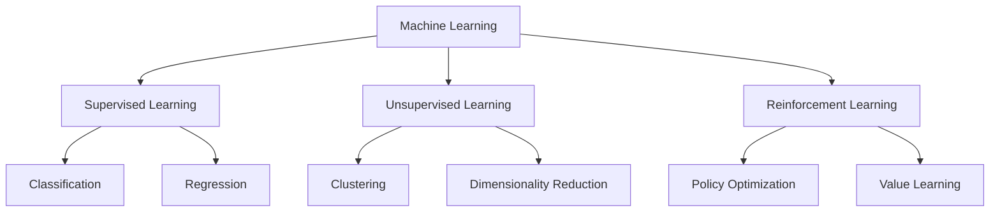
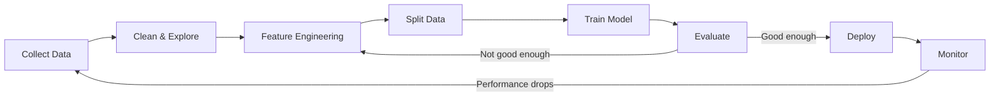
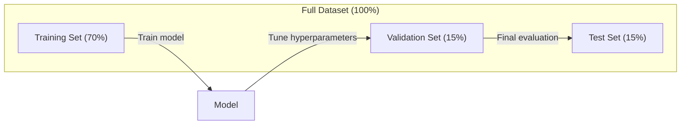
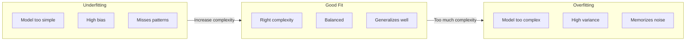
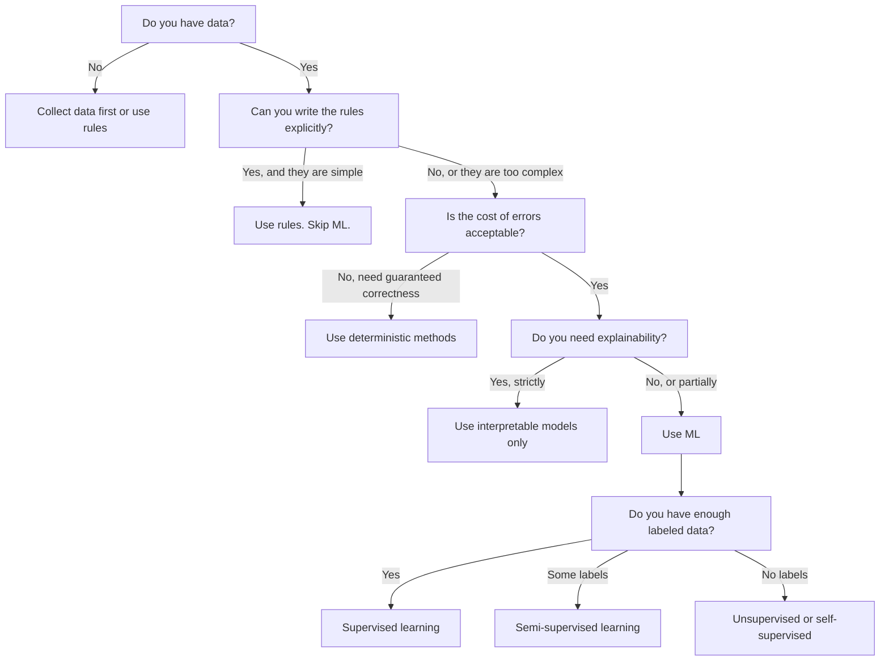

# 什么是机器学习

> 机器学习是教计算机从数据中发现模式，而不是手写规则。

**类型：** 学习
**语言：** Python
**前置条件：** 阶段 1（数学基础）
**时间：** ~45 分钟

## 学习目标

- 解释监督学习、无监督学习和强化学习之间的区别，并能识别给定问题属于哪种类型
- 从零实现最近质心分类器，并将其与随机基线进行评估对比
- 区分分类任务和回归任务，并为每种任务选择合适的损失函数
- 评估给定的业务问题是否适合用机器学习解决，还是更适合用确定性规则解决

## 问题背景

你想构建一个垃圾邮件过滤器。传统方法：坐下来写数百条规则。"如果邮件包含'FREE MONEY'，标记为垃圾邮件。如果包含超过 3 个感叹号，标记为垃圾邮件。"你花数周写规则。然后垃圾邮件发送者换了措辞。你的规则失效。你写更多规则。这个循环永无止境。

机器学习颠覆了这一模式。与其写规则，你给计算机成千上万封已标注的邮件（"垃圾邮件"或"非垃圾邮件"），让它自己找出规则。计算机发现你从未想过的模式。当垃圾邮件发送者改变策略时，你用新数据重新训练，而不是重写代码。

这种从"编程规则"到"从数据中学习"的转变，是机器学习的核心。每个推荐引擎、语音助手、自动驾驶汽车和语言模型都是这样工作的。

## 核心概念

### 从数据中学习，而非规则

传统编程和机器学习以相反的方向解决问题。



传统编程：你编写规则。程序将规则应用于数据以产生输出。

机器学习：你提供数据和预期输出。算法发现规则。

训练出来的"模型"**就是**规则，以数字形式编码（权重、参数）。它从见过的例子中进行泛化，对从未见过的数据进行预测。

### 机器学习的三种类型



**监督学习**：你有输入-输出对。模型学习将输入映射到输出。
- "这里有 10,000 张标注为猫或狗的照片。学会区分它们。"
- "这里有房屋特征和价格。学会预测价格。"

**无监督学习**：你只有输入。没有标签。模型自己发现结构。
- "这里有 10,000 条客户购买记录。找出自然的分组。"
- "这里有 1,000 维的数据点。在保持结构的同时降到 2 维。"

**强化学习**：智能体在环境中采取行动，获得奖励或惩罚。它学习一种策略（policy）来最大化总奖励。
- "玩这个游戏。赢了 +1，输了 -1。想出个策略。"
- "控制这个机械臂。拿起物体 +1，每浪费一秒 -0.01。"

你在实践中构建的大多数内容都使用监督学习。无监督学习常用于预处理和探索。强化学习驱动游戏 AI、机器人技术以及语言模型的 RLHF。

### 超越三大类别

上述三大类别很清晰，但现实中的机器学习常常模糊界限。

**半监督学习**使用少量标注数据和大量未标注数据。你可能有 100 张标注的医学图像和 100,000 张未标注的图像。技术包括：

- **标签传播**：构建连接相似数据点的图。标签通过图从已标注节点传播到未标注邻居。
- **伪标签**：用标注数据训练模型，用它预测未标注数据的标签，然后在所有数据上重新训练。模型自举自己的训练集。
- **一致性正则化**：模型对某个输入及其轻微扰动版本应给出相同预测。即使没有标签也有效。

**自监督学习**从数据本身创建监督。完全不需要人工标注。模型从数据结构创建自己的预测任务。

- **掩码语言建模（BERT）**：隐藏句子中 15% 的词，训练模型预测缺失的词。"标签"来自原始文本。
- **对比学习（SimCLR）**：取一张图像，创建两个增强版本。训练模型识别它们来自同一图像，同时将其与其他图像的增强版本区分开。
- **下一词预测（GPT）**：给定所有前面的词，预测下一个词。每个文本文档都成为一个训练样本。

这些不是与三大类别并列的独立类别。它们是结合监督和无监督思想的策略。自监督学习技术上属于监督学习（模型预测某物），但标签是自动生成的，而非人工标注。

### 分类 vs 回归

这是两种主要的监督学习任务。

| 方面 | 分类 | 回归 |
|------|------|------|
| 输出 | 离散类别 | 连续数值 |
| 示例 | "这封邮件是垃圾邮件吗？" | "这所房子的价格会是多少？" |
| 输出空间 | {猫, 狗, 鸟} | 任意实数 |
| 损失函数 | 交叉熵、准确率 | 均方误差、MAE |
| 决策 | 类别之间的边界 | 拟合数据的曲线 |

分类回答"哪个类别？"回归回答"多少？"

有些问题可以两种方式构建。预测股票涨跌是分类。预测精确价格是回归。

### 机器学习工作流

每个机器学习项目都遵循相同的流程，无论算法如何。



**收集数据**：收集原始数据。数据几乎总是越多越好，但质量比数量更重要。

**清洗与探索**：处理缺失值，删除重复项，可视化分布，发现异常值。这一步通常占项目总时间的 60-80%。

**特征工程**：将原始数据转换为模型可用的特征。将日期转换为星期几。归一化数值列。编码分类变量。好的特征比花哨的算法更重要。

**划分数据**：分成训练集、验证集和测试集。模型在训练数据上训练，你在验证数据上调整超参数，在测试数据上报告最终性能。

**训练模型**：将训练数据输入算法。算法调整内部参数以最小化损失函数。

**评估**：在验证/测试数据上测量性能。如果性能不可接受，返回尝试不同的特征、算法或超参数。

**部署**：将模型投入生产，对新数据进行预测。

**监控**：随时间跟踪性能。数据分布会变化（数据漂移），模型会退化。性能下降时，重新训练。

### 训练、验证和测试划分

这是初学者最容易理解错的最重要概念。你必须在模型训练期间从未见过的数据上评估它。否则你测量的是记忆，不是学习。



| 划分 | 用途 | 何时使用 | 典型大小 |
|------|------|---------|---------|
| 训练 | 模型从此数据学习 | 训练期间 | 60-80% |
| 验证 | 调整超参数，比较模型 | 每次训练运行后 | 10-20% |
| 测试 | 最终无偏性能估计 | 一次，在最后一刻 | 10-20% |

测试集是神圣的。你只看它一次。如果你不断根据测试性能调整模型，你实际上是在测试集上训练，报告的数字毫无意义。

对于小数据集，使用 k 折交叉验证：将数据分成 k 份，在 k-1 份上训练，在剩余一份上验证，轮换，并平均结果。

### 过拟合 vs 欠拟合



**欠拟合**：模型太简单，无法捕捉数据中的模式。一条直线试图拟合曲线关系。训练误差高。测试误差高。

**过拟合**：模型太复杂，记住了训练数据，包括其中的噪声。一条弯弯曲曲的曲线穿过每个训练点，但在新数据上失败。训练误差低。测试误差高。

**良好拟合**：模型捕捉真实模式而不记忆噪声。训练误差和测试误差都相对较低。

过拟合的迹象：
- 训练准确率远高于验证准确率
- 模型在训练数据上表现好，但在新数据上表现差
- 增加训练数据能改善性能（模型在记忆，不是在学习）

过拟合的解决方法：
- 获取更多训练数据
- 降低模型复杂度（更少的参数，更简单的架构）
- 正则化（对大权重添加惩罚）
- Dropout（训练期间随机将神经元置零）
- 早停（验证误差开始上升时停止训练）

欠拟合的解决方法：
- 使用更复杂的模型
- 添加更多特征
- 减少正则化
- 训练更长时间

### 偏差-方差权衡

这是过拟合和欠拟合背后的数学框架。

**偏差**：模型中错误假设导致的误差。当真实关系是非线性时，线性模型具有高偏差。高偏差导致欠拟合。

**方差**：模型对训练数据微小波动的敏感度。高方差模型在不同数据子集上训练时给出非常不同的预测。高方差导致过拟合。

| 模型复杂度 | 偏差 | 方差 | 结果 |
|-----------|------|------|------|
| 太低（用线性模型拟合曲线数据） | 高 | 低 | 欠拟合 |
| 恰到好处 | 中等 | 中等 | 良好泛化 |
| 太高（用 20 次多项式拟合 10 个点） | 低 | 高 | 过拟合 |

总误差 = 偏差² + 方差 + 不可约噪声

你无法减少不可约噪声（它是数据本身的随机性）。你想找到偏差² + 方差最小化的最佳点。

### 没有免费午餐定理

不存在对所有问题都表现最好的单一算法。在某个问题类别上表现良好的算法，在另一个类别上会表现糟糕。这就是为什么数据科学家尝试多种算法并比较结果。

实践中，选择取决于：
- 你有多少数据
- 有多少特征
- 关系是线性还是非线性
- 你是否需要可解释性
- 你能负担多少计算资源

### 何时不使用机器学习

ML 很强大，但不总是正确的工具。在拿起模型之前，问问自己是否真的需要它。

**不要使用 ML 的情况：**

- **规则简单且定义明确。** 税务计算、排序算法、单位换算。如果你能用几个 if 语句写出逻辑，模型只会增加复杂度而没有收益。
- **你没有数据或数据很少。** ML 需要例子来学习。只有 10 个数据点时，你无法训练出任何有意义的东西。先收集数据。
- **错误的代价是灾难性的，你需要保证正确性。** 药物剂量计算、核反应堆控制、密码学验证。ML 模型是概率性的。它们有时会出错。如果"有时出错"不可接受，使用确定性方法。
- **查找表或启发式方法能解决问题。** 如果简单阈值或表格覆盖了 99% 的情况，添加 ML 会增加维护成本而没有实质性改进。
- **你无法解释决策，而可解释性是必需的。** 受监管的行业（贷款、保险、刑事司法）有时要求每个决策都可完全解释。有些 ML 模型是可解释的（线性回归、小型决策树）。大多数不是。
- **问题变化速度超过你能重新训练的速度。** 如果规则每天变化而重新训练需要一周，模型永远是过时的。

使用此决策流程图：



## 动手实现

`code/ml_intro.py` 中的代码从零实现了最近质心分类器，这是最简单的 ML 算法。它演示了核心思想：从数据中学习，然后对新数据进行预测。

### 步骤 1：从零实现最近质心分类器

最近质心分类器计算训练数据中每个类别的中心（均值）。预测时，它将每个新点分配给中心最近的类别。

```python
class NearestCentroid:
    def fit(self, X, y):
        self.classes = np.unique(y)
        self.centroids = np.array([
            X[y == c].mean(axis=0) for c in self.classes
        ])

    def predict(self, X):
        distances = np.array([
            np.sqrt(((X - c) ** 2).sum(axis=1))
            for c in self.centroids
        ])
        return self.classes[distances.argmin(axis=0)]
```

这就是整个算法。Fit 计算两个均值。Predict 计算距离。没有梯度下降，没有迭代，没有超参数。

### 步骤 2：在合成数据上训练

我们生成一个两类略有重叠的 2D 分类数据集。质心分类器在类别中心之间绘制线性决策边界。

```python
rng = np.random.RandomState(42)
X_class0 = rng.randn(100, 2) + np.array([1.0, 1.0])
X_class1 = rng.randn(100, 2) + np.array([-1.0, -1.0])
X = np.vstack([X_class0, X_class1])
y = np.array([0] * 100 + [1] * 100)
```

### 步骤 3：与基线比较

每个 ML 模型都应与简单基线比较。这里，基线预测随机类别。如果你的 ML 模型打不过随机猜测，说明有问题。

```python
baseline_preds = rng.choice([0, 1], size=len(y_test))
baseline_acc = np.mean(baseline_preds == y_test)
```

在这个干净的数据集上，质心分类器应达到约 90%+ 的准确率。随机基线约为 50%。

### 为什么这很重要

最近质心分类器极其简单。它没有超参数，没有迭代，没有梯度下降。但它捕捉了 ML 的基本模式：

1. **学习** 训练数据的表示（质心）
2. **预测** 时使用该表示对新数据进行预测（最近距离）
3. **评估** 与基线对比（随机猜测）

从逻辑回归到 transformer，每个 ML 算法都遵循这个相同的三步模式。表示变得更复杂，但工作流保持不变。

### 步骤 4：质心分类器的局限性

最近质心分类器假设每个类别形成单个 blob。它绘制线性决策边界。它在以下情况会失败：

- 类别有多个簇（例如，数字"1"可以有多种不同写法）
- 决策边界是非线性的（例如，一个类别环绕另一个类别）
- 特征尺度差异很大（距离被最大尺度的特征主导）

这些局限性推动了你将学习的每个其他算法。K 近邻处理多个簇。决策树处理非线性边界。特征缩放解决尺度问题。每节课都建立在前一课的局限性之上。

## 使用它

sklearn 提供了 `NearestCentroid` 和合成数据生成器：

```python
from sklearn.neighbors import NearestCentroid
from sklearn.datasets import make_classification
from sklearn.model_selection import train_test_split

X, y = make_classification(
    n_samples=500, n_features=2, n_redundant=0,
    n_clusters_per_class=1, random_state=42
)
X_train, X_test, y_train, y_test = train_test_split(X, y, test_size=0.3)

clf = NearestCentroid()
clf.fit(X_train, y_train)
print(f"Accuracy: {clf.score(X_test, y_test):.3f}")
```

## 交付它

本节课产出 `outputs/prompt-ml-problem-framer.md` —— 一个将模糊业务问题转化为具体 ML 任务的提示词。给它一个问题描述（"我们想减少流失"或"预测下季度需求"），它会识别学习类型、定义预测目标、列出候选特征、选择成功指标、建立基线，并标记数据泄漏或类别不平衡等陷阱。在任何 ML 项目开始时使用它，以避免构建错误的东西。

## 关键术语

| 术语 | 人们常说的 | 实际含义 |
|------|-----------|---------|
| Model | "那个 AI" | 一个具有可学习参数的数学函数，将输入映射到输出 |
| Training | "教 AI" | 运行优化算法调整模型参数，使预测与已知输出匹配 |
| Feature | "一列输入" | 数据的可测量属性，模型用它来进行预测 |
| Label | "答案" | 训练样本的已知输出，用于计算误差信号 |
| Hyperparameter | "你调的那个设置" | 训练前设置的参数，控制学习过程（学习率、层数等） |
| Loss function | "模型有多错" | 衡量预测输出与实际输出差距的函数，训练试图最小化它 |
| Overfitting | "它把测试题背下来了" | 模型学习了训练特有的噪声而非通用模式，所以在新数据上失败 |
| Underfitting | "它啥也没学会" | 模型太简单，无法捕捉数据中的真实模式 |
| Generalization | "它在新的数据上也能用" | 模型对未训练过的数据做出准确预测的能力 |
| Cross-validation | "用不同的块测试" | 反复将数据分成训练/测试折并平均结果，给出更稳健的性能估计 |
| Regularization | "让权重保持小" | 向损失函数添加惩罚项，抑制过于复杂的模型 |
| Data drift | "世界变了" | 传入数据的统计分布随时间偏移，导致模型性能下降 |

## 练习

1. 取任意数据集（如 Iris、Titanic）。按 70/15/15 分成训练/验证/测试。解释为什么不应该在测试集上调优超参数。
2. 列出三个现实世界问题。对每个问题，识别它是分类、回归还是聚类，以及是监督还是无监督。
3. 一个模型在训练数据上达到 99% 准确率，但在测试数据上只有 60%。诊断问题并列出你会尝试的三种修复方法。

## 延伸阅读

- [An Introduction to Statistical Learning](https://www.statlearning.com/) - 涵盖所有经典 ML 方法及实践示例的免费教材
- [Google's Machine Learning Crash Course](https://developers.google.com/machine-learning/crash-course) - 简洁可视的 ML 概念入门
- [Scikit-learn User Guide](https://scikit-learn.org/stable/user_guide.html) - 在 Python 中实现 ML 的实用参考
