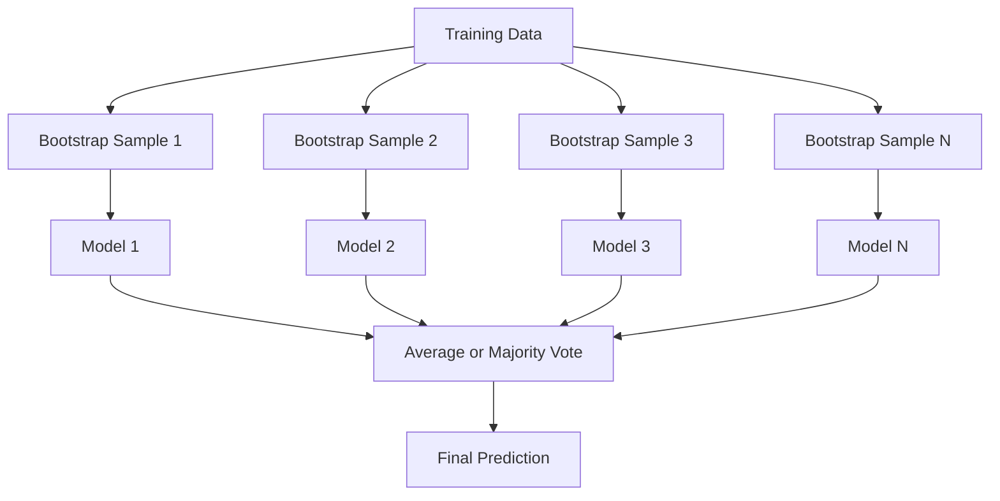
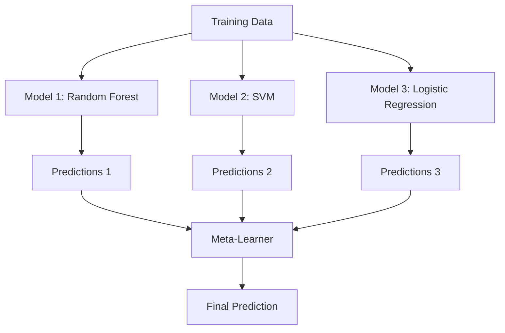

# 集成方法

> 一群弱学习器，以正确的方式组合起来，就能成为强学习器。这不是比喻，而是定理。

**类型：** Build
**语言：** Python
**前置知识：** Phase 2, Lesson 10 (Bias-Variance Tradeoff)
**时间：** ~120 分钟

## 学习目标

- 从零实现 AdaBoost 和梯度提升，并解释 boosting 如何逐步降低偏差
- 构建 bagging 集成，并证明对去相关模型的预测取平均如何降低方差而不增加偏差
- 从各方法针对的误差成分角度，比较 bagging、boosting 和 stacking
- 评估集成多样性，并解释为什么多数投票的准确率会随着独立弱学习器数量的增加而提升

## 问题

单个决策树训练快、易解释，但会过拟合。单个线性模型在复杂边界上欠拟合。你可以花数天时间去设计完美的模型架构。或者，你可以将一堆不完美的模型组合起来，得到比任何一个单独模型都更好的结果。

集成方法正是这样做的。它们是赢得表格数据 Kaggle 竞赛最可靠的技术，驱动着大多数生产级 ML 系统，并且生动地展示了偏差-方差权衡。Bagging 降低方差。Boosting 降低偏差。Stacking 学习在哪些输入上信任哪些模型。

## 概念

### 为什么集成有效

假设你有 N 个独立的分类器，每个的准确率 p > 0.5。多数投票的准确率为：

```
P(majority correct) = sum over k > N/2 of C(N,k) * p^k * (1-p)^(N-k)
```

对于 21 个准确率均为 60% 的分类器，多数投票准确率约为 74%。当有 101 个分类器时，上升到 84%。当模型犯不同的错误时，误差会相互抵消。

关键要求是**多样性**。如果所有模型都犯同样的错误，组合它们毫无帮助。集成之所以有效，是因为它们通过以下方式产生多样化的模型：

- 不同的训练子集（bagging）
- 不同的特征子集（随机森林）
- 顺序误差修正（boosting）
- 不同的模型族（stacking）

### Bagging（Bootstrap Aggregating）

Bagging 通过对每个模型使用不同的 bootstrap 样本进行训练来创造多样性。



Bootstrap 样本是从原始数据中有放回地抽取的，大小与原始数据相同。每个 bootstrap 样本中约有 63.2% 的唯一样本出现。剩余的 36.8%（袋外样本）提供了一个免费的验证集。

Bagging 降低方差，同时不会显著增加偏差。每棵单独的树对其 bootstrap 样本过拟合，但每棵树的过拟合方式不同，因此取平均可以抵消噪声。

**随机森林**是 bagging 的一个变体：在每个分裂点，只考虑特征的随机子集。这迫使树之间产生更大的多样性。分类时典型的候选特征数量是 `sqrt(n_features)`，回归时是 `n_features / 3`。

### Boosting（顺序误差修正）

Boosting 按顺序训练模型。每个新模型专注于之前模型预测错误的样本。


Boosting 降低偏差。每个新模型修正当前集成模型的系统性错误。最终预测是所有模型的加权和，其中表现更好的模型获得更高的权重。

权衡：如果运行轮次过多，boosting 可能会过拟合，因为它不断拟合更难处理的样本，其中一些可能是噪声。

### AdaBoost

AdaBoost（自适应提升）是第一个实用的 boosting 算法。它可以与任何基学习器配合使用，通常使用决策树桩（深度为 1 的树）。

算法：

```
1. Initialize sample weights: w_i = 1/N for all i

2. For t = 1 to T:
   a. Train weak learner h_t on weighted data
   b. Compute weighted error:
      err_t = sum(w_i * I(h_t(x_i) != y_i)) / sum(w_i)
   c. Compute model weight:
      alpha_t = 0.5 * ln((1 - err_t) / err_t)
   d. Update sample weights:
      w_i = w_i * exp(-alpha_t * y_i * h_t(x_i))
   e. Normalize weights to sum to 1

3. Final prediction: H(x) = sign(sum(alpha_t * h_t(x)))
```

误差较低的模型获得更高的 alpha。被错误分类的样本获得更高的权重，以便下一个模型专注于它们。

### 梯度提升

梯度提升将 boosting 推广到任意损失函数。它不是重新加权样本，而是让每个新模型拟合当前集成的残差（损失的负梯度）。

```
1. Initialize: F_0(x) = argmin_c sum(L(y_i, c))

2. For t = 1 to T:
   a. Compute pseudo-residuals:
      r_i = -dL(y_i, F_{t-1}(x_i)) / dF_{t-1}(x_i)
   b. Fit a tree h_t to the residuals r_i
   c. Find optimal step size:
      gamma_t = argmin_gamma sum(L(y_i, F_{t-1}(x_i) + gamma * h_t(x_i)))
   d. Update:
      F_t(x) = F_{t-1}(x) + learning_rate * gamma_t * h_t(x)

3. Final prediction: F_T(x)
```

对于平方误差损失，伪残差就是实际的残差：`r_i = y_i - F_{t-1}(x_i)`。每棵树实际上是在拟合之前集成模型的误差。

学习率（收缩）控制每棵树的贡献程度。较小的学习率需要更多的树，但泛化效果更好。典型值：0.01 到 0.3。

### XGBoost：为什么它在表格数据上占主导地位

XGBoost（极端梯度提升）是经过工程优化的梯度提升，使其快速、准确且抗过拟合：

- **正则化目标：** 对叶子权重施加 L1 和 L2 惩罚，防止单棵树过于自信
- **二阶近似：** 使用损失函数的一阶和二阶导数，做出更好的分裂决策
- **稀疏感知分裂：** 原生处理缺失值，在每个分裂点学习缺失数据的最佳方向
- **列子采样：** 像随机森林一样，在每个分裂点采样特征以增加多样性
- **加权分位数草图：** 在分布式数据上高效地找到连续特征的分裂点
- **缓存感知块结构：** 针对 CPU 缓存行优化的内存布局

对于表格数据，XGBoost（及其后继者 LightGBM）始终优于神经网络。这种情况短期内不会改变。如果你的数据以行列形式存在于表格中，从梯度提升开始。

### Stacking（元学习）

Stacking 使用多个基模型的预测作为元学习器的特征。



元学习器学习对于哪些输入应该信任哪个基模型。如果随机森林在某些区域表现更好，而 SVM 在其他区域表现更好，元学习器将学会相应地路由。

为避免数据泄露，基模型的预测必须通过训练集上的交叉验证生成。永远不要在同一数据上训练基模型并生成元特征。

### 投票

最简单的集成。直接组合预测。

- **硬投票：** 对类别标签进行多数投票。
- **软投票：** 平均预测概率，选择平均概率最高的类别。通常更好，因为它利用了置信度信息。

## 动手实现

### 步骤 1：决策树桩（基学习器）

`code/ensembles.py` 中的代码从零实现所有内容。我们从决策树桩开始：只有单个分裂的树。

```python
class DecisionStump:
    def __init__(self):
        self.feature_idx = None
        self.threshold = None
        self.polarity = 1
        self.alpha = None

    def fit(self, X, y, weights):
        n_samples, n_features = X.shape
        best_error = float("inf")

        for f in range(n_features):
            thresholds = np.unique(X[:, f])
            for thresh in thresholds:
                for polarity in [1, -1]:
                    pred = np.ones(n_samples)
                    pred[polarity * X[:, f] < polarity * thresh] = -1
                    error = np.sum(weights[pred != y])
                    if error < best_error:
                        best_error = error
                        self.feature_idx = f
                        self.threshold = thresh
                        self.polarity = polarity

    def predict(self, X):
        n = X.shape[0]
        pred = np.ones(n)
        idx = self.polarity * X[:, self.feature_idx] < self.polarity * self.threshold
        pred[idx] = -1
        return pred
```

### 步骤 2：从零实现 AdaBoost

```python
class AdaBoostScratch:
    def __init__(self, n_estimators=50):
        self.n_estimators = n_estimators
        self.stumps = []
        self.alphas = []

    def fit(self, X, y):
        n = X.shape[0]
        weights = np.full(n, 1 / n)

        for _ in range(self.n_estimators):
            stump = DecisionStump()
            stump.fit(X, y, weights)
            pred = stump.predict(X)

            err = np.sum(weights[pred != y])
            err = np.clip(err, 1e-10, 1 - 1e-10)

            alpha = 0.5 * np.log((1 - err) / err)
            weights *= np.exp(-alpha * y * pred)
            weights /= weights.sum()

            stump.alpha = alpha
            self.stumps.append(stump)
            self.alphas.append(alpha)

    def predict(self, X):
        total = sum(a * s.predict(X) for a, s in zip(self.alphas, self.stumps))
        return np.sign(total)
```

### 步骤 3：从零实现梯度提升

```python
class GradientBoostingScratch:
    def __init__(self, n_estimators=100, learning_rate=0.1, max_depth=3):
        self.n_estimators = n_estimators
        self.lr = learning_rate
        self.max_depth = max_depth
        self.trees = []
        self.initial_pred = None

    def fit(self, X, y):
        self.initial_pred = np.mean(y)
        current_pred = np.full(len(y), self.initial_pred)

        for _ in range(self.n_estimators):
            residuals = y - current_pred
            tree = SimpleRegressionTree(max_depth=self.max_depth)
            tree.fit(X, residuals)
            update = tree.predict(X)
            current_pred += self.lr * update
            self.trees.append(tree)

    def predict(self, X):
        pred = np.full(X.shape[0], self.initial_pred)
        for tree in self.trees:
            pred += self.lr * tree.predict(X)
        return pred
```

### 步骤 4：与 sklearn 对比

代码验证我们的从零实现与 sklearn 的 `AdaBoostClassifier` 和 `GradientBoostingClassifier` 产生相似的准确率，并并排比较所有方法。

## 应用

### 何时使用每种方法

| 方法 | 降低 | 最适合 | 注意事项 |
|------|------|--------|----------|
| Bagging / Random Forest | 方差 | 噪声数据、特征众多 | 对偏差无帮助 |
| AdaBoost | 偏差 | 干净数据、简单基学习器 | 对异常值和噪声敏感 |
| Gradient Boosting | 偏差 | 表格数据、竞赛 | 训练慢，不调参容易过拟合 |
| XGBoost / LightGBM | 两者 | 生产级表格数据 ML | 超参数众多 |
| Stacking | 两者 | 追求最后 1-2% 的准确率 | 复杂，元学习器有过拟合风险 |
| Voting | 方差 | 快速组合多样化模型 | 只有模型多样化时才有效 |

### 表格数据的生产级方案

对于大多数表格数据预测问题，按以下顺序尝试：

1. 使用默认参数的 **LightGBM 或 XGBoost**
2. 调优 n_estimators、learning_rate、max_depth、min_child_weight
3. 如果需要最后 0.5% 的提升，构建包含 3-5 个多样化模型的 stacking 集成
4. 全程使用交叉验证

表格数据上的神经网络几乎总是比梯度提升差，尽管相关研究不断尝试。TabNet、NODE 等架构偶尔能匹敌，但很少能击败调优良好的 XGBoost。

## 交付

本节课产出 `outputs/prompt-ensemble-selector.md` —— 一个帮助你为给定数据集选择合适集成方法的提示词。描述你的数据（大小、特征类型、噪声水平、类别平衡）和要解决的问题。该提示词会引导你完成决策清单，推荐方法，建议起始超参数，并警告该方法常见的陷阱。同时产出包含完整选择指南的 `outputs/skill-ensemble-builder.md`。

## 练习

1. 修改 AdaBoost 实现，在每一轮后跟踪训练准确率。绘制准确率 vs. 估计器数量的曲线。它在何时收敛？

2. 通过为回归树添加随机特征子采样，从零实现随机森林。训练 100 棵 `max_features=sqrt(n_features)` 的树并平均预测结果。与单棵树相比，方差降低效果如何？

3. 在梯度提升实现中，添加早停：在每一轮后跟踪验证损失，当连续 10 轮没有改善时停止。实际上需要多少棵树？

4. 构建一个 stacking 集成，包含三个基模型（逻辑回归、决策树、k 近邻）和一个逻辑回归元学习器。使用 5 折交叉验证生成元特征。与每个基模型单独比较。

5. 在相同数据集上用默认参数运行 XGBoost。将其准确率与你的从零实现梯度提升对比。计时两者。速度差距有多大？

## 关键术语

| 术语 | 人们常说的 | 实际含义 |
|------|-----------|----------|
| Bagging | "在随机子集上训练" | Bootstrap aggregating：在 bootstrap 样本上训练模型，平均预测以降低方差 |
| Boosting | "关注难样本" | 顺序训练模型，每个修正当前集成的错误，以降低偏差 |
| AdaBoost | "重新加权数据" | 通过样本权重更新进行 boosting；误分类点在下一轮获得更高权重 |
| Gradient boosting | "拟合残差" | 通过让每个新模型拟合损失函数的负梯度来进行 boosting |
| XGBoost | "Kaggle 大杀器" | 带有正则化、二阶优化和系统级速度技巧的梯度提升 |
| Stacking | "模型之上叠模型" | 将基模型的预测作为元学习器的输入特征 |
| Random forest | "很多随机化的树" | 用决策树进行 bagging，在每个分裂点添加随机特征子采样以增加多样性 |
| Ensemble diversity | "犯不同的错误" | 模型在误差上必须不相关，集成才能优于单个模型 |
| Out-of-bag error | "免费验证" | 不在 bootstrap 抽取中的样本（~36.8%）可作为验证集，无需额外留出 |

## 延伸阅读

- [Schapire & Freund: Boosting: Foundations and Algorithms](https://mitpress.mit.edu/9780262526036/) -- AdaBoost 创造者的著作
- [Friedman: Greedy Function Approximation: A Gradient Boosting Machine (2001)](https://statweb.stanford.edu/~jhf/ftp/trebst.pdf) -- 原始梯度提升论文
- [Chen & Guestrin: XGBoost (2016)](https://arxiv.org/abs/1603.02754) -- XGBoost 论文
- [Wolpert: Stacked Generalization (1992)](https://www.sciencedirect.com/science/article/abs/pii/S0893608005800231) -- 原始 stacking 论文
- [scikit-learn Ensemble Methods](https://scikit-learn.org/stable/modules/ensemble.html) -- 实用参考
