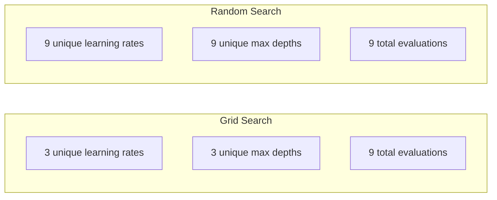
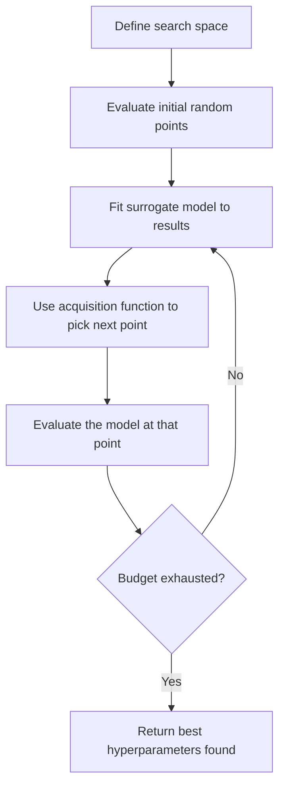
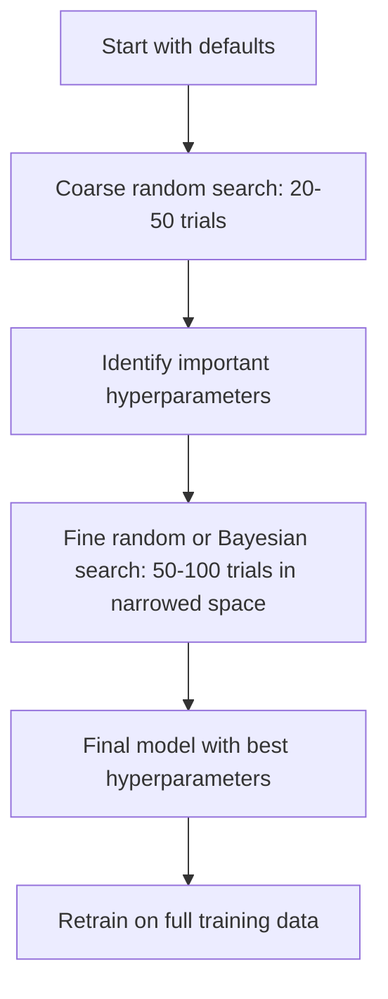
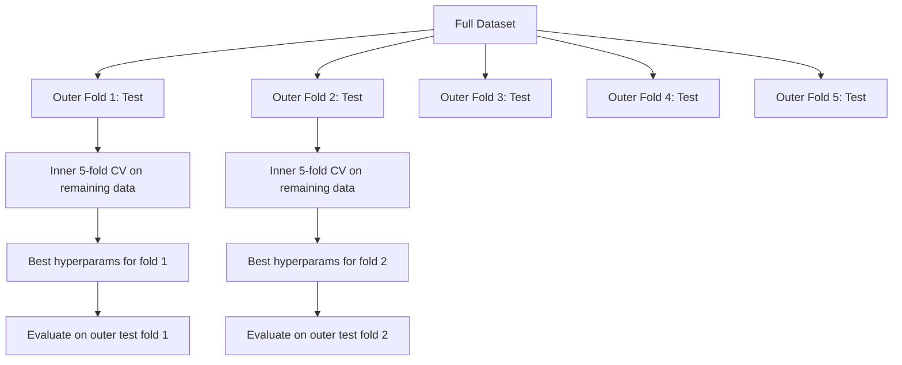

# 超参数调优

> 超参数是训练开始前调节的旋钮。调节得好坏，决定了模型是平庸还是出色。

**类型：** Build
**语言：** Python
**前置知识：** Phase 2, Lesson 11 (Ensemble Methods)
**时间：** ~90 分钟

## 学习目标

- 从零实现网格搜索、随机搜索和贝叶斯优化，并比较它们的样本效率
- 解释为什么当大多数超参数的有效维度较低时，随机搜索优于网格搜索
- 使用代理模型和采集函数构建贝叶斯优化循环来指导搜索
- 设计一种超参数调优策略，通过适当的交叉验证避免对验证集过拟合

## 问题背景

你的梯度提升模型有学习率、树的数量、最大深度、叶节点最小样本数、子采样比例和列采样比例。共六个超参数。如果每个超参数有 5 个合理取值，网格共有 5^6 = 15,625 种组合。每次训练耗时 10 秒，全部尝试一遍需要 43 小时计算时间。

网格搜索是最直观的方法，也是大规模下最糟糕的方法。随机搜索用更少的计算就能取得更好效果。贝叶斯优化通过从过去的评估中学习，表现更优。知道该用哪种策略、哪些超参数真正重要，能节省数天浪费的 GPU 时间。

## 核心概念

### 参数 vs 超参数

参数在训练过程中学习得到（权重、偏置、分裂阈值）。超参数在训练前设定，控制学习如何进行。

| 超参数 | 控制内容 | 典型范围 |
|-------|---------|---------|
| Learning rate | 每次更新的步长 | 0.001 到 1.0 |
| Number of trees/epochs | 训练时长 | 10 到 10,000 |
| Max depth | 模型复杂度 | 1 到 30 |
| Regularization (lambda) | 防止过拟合 | 0.0001 到 100 |
| Batch size | 梯度估计噪声 | 16 到 512 |
| Dropout rate | 神经元丢弃比例 | 0.0 到 0.5 |

### 网格搜索

网格搜索评估所有指定值的组合。它穷举且易于理解，但随超参数数量指数级增长。

```
Grid for 2 hyperparameters:

  learning_rate: [0.01, 0.1, 1.0]
  max_depth:     [3, 5, 7]

  Evaluations: 3 x 3 = 9 combinations

  (0.01, 3)  (0.01, 5)  (0.01, 7)
  (0.1,  3)  (0.1,  5)  (0.1,  7)
  (1.0,  3)  (1.0,  5)  (1.0,  7)
```

网格搜索有一个根本性缺陷：如果一个超参数重要而另一个不重要，大多数评估都被浪费了。9 次评估中，重要参数只得到 3 个不同的取值。

### 随机搜索

随机搜索从分布中采样超参数，而非从网格中选取。在同样的 9 次评估预算下，每个超参数都能得到 9 个不同的取值。



随机优于网格的原因（Bergstra & Bengio, 2012）：

- 大多数超参数的有效维度较低。在给定问题中，6 个超参数通常只有 1-2 个真正重要。
- 网格搜索在不重要的维度上浪费评估。
- 对于相同预算，随机搜索在重要维度上覆盖得更密集。
- 在 60 次随机试验中，有 95% 的概率找到搜索空间内距离最优解 5% 以内的点（如果存在的话）。

### 贝叶斯优化

随机搜索忽略结果。它不会学到高学习率导致发散，或者深度 3 持续优于深度 10。贝叶斯优化利用过去的评估来决定下一步搜索何处。



两个关键组件：

**代理模型（Surrogate model）：** 一种评估成本低的模型（通常是高斯过程），用于近似昂贵的目标函数。它能给出搜索空间中任意一点的预测值和不确定性估计。

**采集函数（Acquisition function）：** 通过平衡利用（在已知好点附近搜索）和探索（在不确定性高的地方搜索）来决定下一步评估何处。常见选择：

- **Expected Improvement (EI)：** 在该点预期比当前最优解提升多少？
- **Upper Confidence Bound (UCB)：** 预测值加上不确定性的倍数。UCB 越高表示该点越有前景或越未探索。
- **Probability of Improvement (PI)：** 该点击败当前最优解的概率是多少？

贝叶斯优化通常比随机搜索少用 2-5 倍评估就能找到更优的超参数。拟合代理模型的开销与实际训练模型相比可以忽略不计。

### 早停

并非每次训练都需要完成。如果一个配置在 10 个 epoch 后明显很差，就停止它并继续下一个。这就是超参数搜索中的早停。

策略：
- **Patience-based：** 如果验证损失连续 N 个 epoch 没有改善，则停止
- **Median pruning：** 如果试验的中间结果比同一步已完成试验的中位数差，则停止
- **Hyperband：** 给许多配置分配小预算，然后逐步增加最优配置的预算

Hyperband 尤其有效。它从 81 个配置各训练 1 个 epoch 开始，保留前三分之一，给它们 3 个 epoch，再保留前三分之一，依此类推。这比用完整预算评估所有配置快 10-50 倍找到好配置。

### 学习率调度器

学习率几乎总是最重要的超参数。与其固定不变，不如用调度器在训练过程中调整。

| 调度器 | 公式 | 适用场景 |
|-------|------|---------|
| Step decay | 每 N 个 epoch 乘以 0.1 | 经典 CNN 训练 |
| Cosine annealing | lr * 0.5 * (1 + cos(pi * t / T)) | 现代默认选择 |
| Warmup + decay | 线性增加后接余弦衰减 | Transformers |
| One-cycle | 一个周期内先增后减 | 快速收敛 |
| Reduce on plateau | 指标停滞时按因子衰减 | 安全默认 |

### 超参数重要性

并非所有超参数都同等重要。关于随机森林（Probst et al., 2019）和梯度提升的研究显示了稳定模式：

**高重要性：**
- 学习率（始终优先调优）
- 估计器数量 / epoch 数（用早停代替调优）
- 正则化强度

**中等重要性：**
- 最大深度 / 层数
- 叶节点最小样本数 / 权重衰减
- 子采样比例

**低重要性：**
- 最大特征数（随机森林）
- 具体激活函数选择
- 批量大小（在合理范围内）

先调优重要的，其余保持默认。

### 实用策略



具体工作流程：

1. **从库默认值开始。** 它们由经验丰富的从业者选择，通常能达到 80% 的效果。
2. **粗粒度随机搜索。** 宽范围，20-50 次试验。用早停快速淘汰差的结果。
3. **分析结果。** 哪些超参数与性能相关？缩小搜索空间。
4. **精细搜索。** 在缩小的空间中使用贝叶斯优化或聚焦的随机搜索。50-100 次试验。
5. **用找到的最优超参数在所有训练数据上重新训练。**

### 交叉验证集成

在单一验证集上调优超参数有风险。最优超参数可能过拟合到特定的验证折。嵌套交叉验证通过两层循环解决这个问题：

- **外层循环**（评估）：将数据分为 train+val 和 test。报告无偏性能。
- **内层循环**（调优）：将 train+val 分为 train 和 val。寻找最优超参数。



每个外层折独立寻找自己的最优超参数。外层分数是对泛化性能的无偏估计。

使用 sklearn：

```python
from sklearn.model_selection import cross_val_score, GridSearchCV
from sklearn.ensemble import GradientBoostingRegressor

inner_cv = GridSearchCV(
    GradientBoostingRegressor(),
    param_grid={
        "learning_rate": [0.01, 0.05, 0.1],
        "max_depth": [2, 3, 5],
        "n_estimators": [50, 100, 200],
    },
    cv=5,
    scoring="neg_mean_squared_error",
)

outer_scores = cross_val_score(
    inner_cv, X, y, cv=5, scoring="neg_mean_squared_error"
)

print(f"Nested CV MSE: {-outer_scores.mean():.4f} +/- {outer_scores.std():.4f}")
```

这很昂贵（5 个外层折 × 5 个内层折 × 27 个网格点 = 675 次模型拟合），但能给出可信的性能估计。在论文中报告最终结果或决策风险较高时使用。

### 实用技巧

**从学习率开始。** 它始终是梯度方法中最重要的超参数。糟糕的学习率会让其他一切都不重要。将其他超参数固定为默认值，先扫描学习率。

**对学习率和正则化使用对数均匀分布。** 0.001 和 0.01 的差距与 0.1 和 1.0 的差距同样重要。线性搜索会在大值端浪费预算。

**用早停代替调优 n_estimators。** 对于提升和神经网络，将 n_estimators 或 epoch 设高，让早停决定何时停止。这从搜索中移除一个超参数。

**预算分配。** 将 60% 的调优预算花在最重要的 2 个超参数上，剩余 40% 用于其他。前 2 个超参数占据了大部分性能变化。

**尺度很重要。** 绝不要在对数尺度上搜索批量大小（16, 32, 64 即可）。始终在对数尺度上搜索学习率。让搜索分布与超参数影响模型的方式匹配。

| 模型类型 | 最重要超参数 | 推荐搜索方式 | 预算 |
|----------|------------|-----------|------|
| Random Forest | n_estimators, max_depth, min_samples_leaf | 随机搜索，50 次试验 | 低（训练快） |
| Gradient Boosting | learning_rate, n_estimators, max_depth | 贝叶斯，100 次试验 + 早停 | 中 |
| Neural Network | learning_rate, weight_decay, batch_size | 贝叶斯或随机，100+ 次试验 | 高（训练慢） |
| SVM | C, gamma (RBF kernel) | 对数尺度网格，25-50 次试验 | 低（2 个参数） |
| Lasso/Ridge | alpha | 对数尺度一维搜索，20 次试验 | 极低 |
| XGBoost | learning_rate, max_depth, subsample, colsample | 贝叶斯，100-200 次试验 + 早停 | 中 |

**不确定时：** 随机搜索的试验次数设为超参数数量的 2 倍（例如 6 个超参数 = 至少 12 次试验）。你会惊讶地发现，50 次试验的随机搜索经常击败精心设计的网格搜索。

## 动手实现

### 步骤 1：从零实现网格搜索

`code/tuning.py` 中的代码从零实现了网格搜索、随机搜索和简单的贝叶斯优化器。

```python
def grid_search(model_fn, param_grid, X_train, y_train, X_val, y_val):
    keys = list(param_grid.keys())
    values = list(param_grid.values())
    best_score = -float("inf")
    best_params = None
    n_evals = 0

    for combo in itertools.product(*values):
        params = dict(zip(keys, combo))
        model = model_fn(**params)
        model.fit(X_train, y_train)
        score = evaluate(model, X_val, y_val)
        n_evals += 1

        if score > best_score:
            best_score = score
            best_params = params

    return best_params, best_score, n_evals
```

### 步骤 2：从零实现随机搜索

```python
def random_search(model_fn, param_distributions, X_train, y_train,
                  X_val, y_val, n_iter=50, seed=42):
    rng = np.random.RandomState(seed)
    best_score = -float("inf")
    best_params = None

    for _ in range(n_iter):
        params = {k: sample(v, rng) for k, v in param_distributions.items()}
        model = model_fn(**params)
        model.fit(X_train, y_train)
        score = evaluate(model, X_val, y_val)

        if score > best_score:
            best_score = score
            best_params = params

    return best_params, best_score, n_iter
```

### 步骤 3：贝叶斯优化（简化版）

核心思想：将高斯过程拟合到观察到的（超参数，分数）对，然后用采集函数决定下一步搜索何处。

```python
class SimpleBayesianOptimizer:
    def __init__(self, search_space, n_initial=5):
        self.search_space = search_space
        self.n_initial = n_initial
        self.X_observed = []
        self.y_observed = []

    def _kernel(self, x1, x2, length_scale=1.0):
        dists = np.sum((x1[:, None, :] - x2[None, :, :]) ** 2, axis=2)
        return np.exp(-0.5 * dists / length_scale ** 2)

    def _fit_gp(self, X_new):
        X_obs = np.array(self.X_observed)
        y_obs = np.array(self.y_observed)
        y_mean = y_obs.mean()
        y_centered = y_obs - y_mean

        K = self._kernel(X_obs, X_obs) + 1e-4 * np.eye(len(X_obs))
        K_star = self._kernel(X_new, X_obs)

        L = np.linalg.cholesky(K)
        alpha = np.linalg.solve(L.T, np.linalg.solve(L, y_centered))
        mu = K_star @ alpha + y_mean

        v = np.linalg.solve(L, K_star.T)
        var = 1.0 - np.sum(v ** 2, axis=0)
        var = np.maximum(var, 1e-6)

        return mu, var

    def _expected_improvement(self, mu, var, best_y):
        sigma = np.sqrt(var)
        z = (mu - best_y) / (sigma + 1e-10)
        ei = sigma * (z * norm_cdf(z) + norm_pdf(z))
        return ei

    def suggest(self):
        if len(self.X_observed) < self.n_initial:
            return sample_random(self.search_space)

        candidates = [sample_random(self.search_space) for _ in range(500)]
        X_cand = np.array([to_vector(c) for c in candidates])
        mu, var = self._fit_gp(X_cand)
        ei = self._expected_improvement(mu, var, max(self.y_observed))
        return candidates[np.argmax(ei)]

    def observe(self, params, score):
        self.X_observed.append(to_vector(params))
        self.y_observed.append(score)
```

GP 代理在每个候选点给出两样东西：预测分数（mu）和不确定性（var）。Expected Improvement 平衡这两者：它青睐模型预测高分**或**不确定性高的点。早期大多数点不确定性高，所以优化器探索。后期则聚焦最有前景的区域。

### 步骤 4：比较所有方法

在相同合成目标上运行三种方法并比较。此比较使用简化包装器直接调用各优化器与目标函数（无需模型训练），因此 API 与上述基于模型的实现不同：

```python
def synthetic_objective(params):
    lr = params["learning_rate"]
    depth = params["max_depth"]
    return -(np.log10(lr) + 2) ** 2 - (depth - 4) ** 2 + 10

param_grid = {
    "learning_rate": [0.001, 0.01, 0.1, 1.0],
    "max_depth": [2, 3, 4, 5, 6, 7, 8],
}

grid_best = None
grid_score = -float("inf")
grid_history = []
for combo in itertools.product(*param_grid.values()):
    params = dict(zip(param_grid.keys(), combo))
    score = synthetic_objective(params)
    grid_history.append((params, score))
    if score > grid_score:
        grid_score = score
        grid_best = params

param_dist = {
    "learning_rate": ("log_float", 0.001, 1.0),
    "max_depth": ("int", 2, 8),
}

rand_best = None
rand_score = -float("inf")
rand_history = []
rng = np.random.RandomState(42)
for _ in range(28):
    params = {k: sample(v, rng) for k, v in param_dist.items()}
    score = synthetic_objective(params)
    rand_history.append((params, score))
    if score > rand_score:
        rand_score = score
        rand_best = params

optimizer = SimpleBayesianOptimizer(param_dist, n_initial=5)
bayes_history = []
for _ in range(28):
    params = optimizer.suggest()
    score = synthetic_objective(params)
    optimizer.observe(params, score)
    bayes_history.append((params, score))
bayes_score = max(s for _, s in bayes_history)

print(f"{'Method':<20} {'Best Score':>12} {'Evaluations':>12}")
print("-" * 50)
print(f"{'Grid Search':<20} {grid_score:>12.4f} {len(grid_history):>12}")
print(f"{'Random Search':<20} {rand_score:>12.4f} {len(rand_history):>12}")
print(f"{'Bayesian Opt':<20} {bayes_score:>12.4f} {len(bayes_history):>12}")
```

在相同预算下，贝叶斯优化通常最快找到最优分数，因为它不会在明显差的区域浪费评估。随机搜索比网格搜索覆盖更广。网格搜索只在超参数很少且能负担穷举时获胜。

## 实际应用

### Optuna 实践

Optuna 是严肃超参数调优的推荐库。它原生支持剪枝、分布式搜索和可视化。

```python
import optuna

def objective(trial):
    lr = trial.suggest_float("learning_rate", 1e-4, 1e-1, log=True)
    n_est = trial.suggest_int("n_estimators", 50, 500)
    max_depth = trial.suggest_int("max_depth", 2, 10)

    model = GradientBoostingRegressor(
        learning_rate=lr,
        n_estimators=n_est,
        max_depth=max_depth,
    )
    model.fit(X_train, y_train)
    return mean_squared_error(y_val, model.predict(X_val))

study = optuna.create_study(direction="minimize")
study.optimize(objective, n_trials=100)

print(f"Best params: {study.best_params}")
print(f"Best MSE: {study.best_value:.4f}")
```

Optuna 关键特性：
- `suggest_float(..., log=True)` 用于最适合对数尺度搜索的参数（学习率、正则化）
- `suggest_int` 用于整数参数
- `suggest_categorical` 用于离散选择
- 内置 MedianPruner 用于早停淘汰差试验
- `study.trials_dataframe()` 用于分析

### 带剪枝的 Optuna

剪枝提前停止无前景的试验，节省大量计算。模式如下：

```python
import optuna
from sklearn.model_selection import cross_val_score

def objective(trial):
    params = {
        "learning_rate": trial.suggest_float("lr", 1e-4, 0.5, log=True),
        "max_depth": trial.suggest_int("max_depth", 2, 10),
        "n_estimators": trial.suggest_int("n_estimators", 50, 500),
        "subsample": trial.suggest_float("subsample", 0.5, 1.0),
    }

    model = GradientBoostingRegressor(**params)
    scores = cross_val_score(model, X_train, y_train, cv=3,
                             scoring="neg_mean_squared_error")
    mean_score = -scores.mean()

    trial.report(mean_score, step=0)
    if trial.should_prune():
        raise optuna.TrialPruned()

    return mean_score

pruner = optuna.pruners.MedianPruner(n_startup_trials=10, n_warmup_steps=5)
study = optuna.create_study(direction="minimize", pruner=pruner)
study.optimize(objective, n_trials=200)
```

`MedianPruner` 在试验的中间值比同一步已完成试验的中位数差时停止该试验。剪枝需要调用 `trial.report()` 报告中间指标，以及 `trial.should_prune()` 检查是否应停止。`n_startup_trials=10` 确保至少 10 个试验完整完成后剪枝才开始生效。这通常节省 40-60% 的总计算量。

### sklearn 内置调优器

对于快速实验，sklearn 提供了 `GridSearchCV`、`RandomizedSearchCV` 和 `HalvingRandomSearchCV`：

```python
from sklearn.model_selection import RandomizedSearchCV
from scipy.stats import loguniform, randint

param_dist = {
    "learning_rate": loguniform(1e-4, 0.5),
    "max_depth": randint(2, 10),
    "n_estimators": randint(50, 500),
}

search = RandomizedSearchCV(
    GradientBoostingRegressor(),
    param_dist,
    n_iter=100,
    cv=5,
    scoring="neg_mean_squared_error",
    random_state=42,
    n_jobs=-1,
)
search.fit(X_train, y_train)
print(f"Best params: {search.best_params_}")
print(f"Best CV MSE: {-search.best_score_:.4f}")
```

对学习率和正则化使用 scipy 的 `loguniform`。对整数超参数使用 `randint`。`n_jobs=-1` 标志在所有 CPU 核心上并行。

### 超参数调优常见错误

**预处理导致的数据泄漏。** 如果在交叉验证前就在完整数据集上拟合缩放器，验证折的信息会泄漏到训练中。始终将预处理放在 `Pipeline` 内，使其只在训练折上拟合。

**对验证集过拟合。** 运行数千次试验实际上是在验证集上训练。对最终性能估计使用嵌套交叉验证，或保留一个独立的测试集在调优期间绝不触碰。

**搜索范围太窄。** 如果最优值在搜索空间的边界上，说明搜索不够广泛。最优值可能在范围之外。始终检查最优参数是否在边缘。

**忽略交互效应。** 学习率和估计器数量在提升中强交互。低学习率需要更多估计器。独立调优它们比一起调优效果更差。

**对迭代模型不使用早停。** 对于梯度提升和神经网络，将 n_estimators 或 epoch 设高并使用早停。这严格优于将迭代次数作为超参数调优。

## 练习

1. 用相同总预算（例如 50 次评估）运行网格搜索和随机搜索。比较找到的最优分数。用不同种子运行 10 次实验。随机搜索赢了多少次？

2. 从零实现 Hyperband。从 81 个配置各训练 1 个 epoch 开始。每轮保留前 1/3，将它们的预算增加三倍。比较总计算量（所有配置的所有 epoch 之和）与运行 81 个配置完整预算的计算量。

3. 在 Lesson 11 的梯度提升实现中加入学习率调度器（余弦退火）。与固定学习率相比是否有帮助？

4. 使用 Optuna 在真实数据集（如 sklearn 的 breast cancer 数据集）上调优 RandomForestClassifier。使用 `optuna.visualization.plot_param_importances(study)` 查看哪些超参数最重要。是否与本文的重要性排序一致？

5. 实现简单的采集函数（Expected Improvement）并演示探索与利用。绘制代理模型的均值和不确定性，展示 EI 选择下一步评估的位置。

## 关键术语

| 术语 | 人们常说 | 实际含义 |
|------|---------|---------|
| Hyperparameter | "你选择的设置" | 训练前设定的值，控制学习过程，不从数据中学习 |
| Grid search | "尝试每种组合" | 在指定参数网格上的穷举搜索。指数级成本。 |
| Random search | "随机采样就行" | 从分布中采样超参数。比网格搜索更好地覆盖重要维度。 |
| Bayesian optimization | "智能搜索" | 使用目标函数的代理模型决定下一步评估何处，平衡探索和利用 |
| Surrogate model | "便宜的近似" | 一种模型（通常是高斯过程），从观察到的评估中近似昂贵的目标函数 |
| Acquisition function | "下一步看哪里" | 通过平衡预期改进与不确定性来评分候选点。EI 和 UCB 是常见选择。 |
| Early stopping | "别浪费时间" | 验证性能不再提升时提前终止训练 |
| Hyperband | "配置的锦标赛" | 自适应资源分配：从许多小预算配置开始，保留最优并增加其预算 |
| Learning rate scheduler | "训练时改变 lr" | 在训练过程中调整学习率的函数，以获得更好的收敛 |

## 延伸阅读

- [Bergstra & Bengio: Random Search for Hyper-Parameter Optimization (2012)](https://jmlr.org/papers/v13/bergstra12a.html) — 证明随机优于网格的论文
- [Snoek et al., Practical Bayesian Optimization of Machine Learning Algorithms (2012)](https://arxiv.org/abs/1206.2944) — 面向机器学习贝叶斯优化
- [Li et al., Hyperband: A Novel Bandit-Based Approach (2018)](https://jmlr.org/papers/v18/16-558.html) — Hyperband 论文
- [Optuna: A Next-generation Hyperparameter Optimization Framework](https://arxiv.org/abs/1907.10902) — Optuna 论文
- [Probst et al., Tunability: Importance of Hyperparameters (2019)](https://jmlr.org/papers/v20/18-444.html) — 哪些超参数重要
