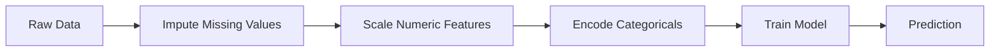
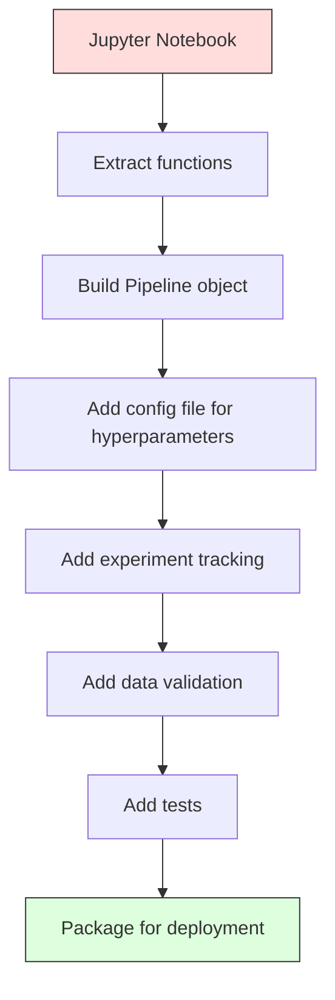

# ML 流水线

> 模型不是产品，流水线才是。流水线涵盖从原始数据到部署预测的全过程，每一步都必须是可复现的。

**类型：** 构建
**语言：** Python
**前置知识：** 第二阶段，第 12 课（超参数调优）
**时间：** ~120 分钟

## 学习目标

- 从零构建一个 ML 流水线，将缺失值填充、缩放、编码和模型训练串联为单一可复现对象
- 识别数据泄露场景，并解释流水线如何通过仅在训练数据上拟合转换器来防止泄露
- 构建一个 ColumnTransformer，对数值型和分类型特征应用不同的预处理
- 实现流水线序列化，并验证同一个拟合流水线在训练环境和生产环境中产生相同的结果

## 问题所在

你有一个笔记本：加载数据，用中位数填充缺失值，缩放特征，训练模型，打印准确率。它能用，你就部署了。

一个月后，有人重新训练模型，得到了不同的结果。中位数是在包含测试数据的完整数据集上计算的（数据泄露）。缩放参数没有保存，所以推理时使用了不同的统计量。特征工程代码在训练和服务之间被复制粘贴，两份代码发生了分歧。生产环境中某个分类列出现了一个编码器从未见过的新值。

这些并非假设场景，而是 ML 系统在生产环境中最常见的失败原因。流水线通过将每个转换步骤打包为单一的、有序的、可复现的对象，解决了所有这些问题。

## 核心概念

### 什么是流水线

流水线是一个有序的数据转换序列，最后接一个模型。每一步将前一步的输出作为输入。整个流水线在训练数据上拟合一次。在推理时，同一个已拟合流水线转换新数据并产生预测。



流水线保证：
- 转换器仅在训练数据上拟合（无泄露）
- 推理时应用相同的转换
- 整个对象可以序列化并作为单一产物部署
- 交叉验证在每个折上应用流水线，防止细微的泄露

### 数据泄露：无声的杀手

数据泄露是指来自测试集或未来数据的信息污染了训练过程。流水线防止了最常见的形式。

**有泄露的（错误）：**
```python
X = df.drop("target", axis=1)
y = df["target"]

scaler = StandardScaler()
X_scaled = scaler.fit_transform(X)

X_train, X_test = X_scaled[:800], X_scaled[800:]
y_train, y_test = y[:800], y[800:]
```

缩放器看到了测试数据。均值和标准差包含了测试样本。这会虚高准确率估计。

**正确的：**
```python
X_train, X_test = X[:800], X[800:]

scaler = StandardScaler()
X_train_scaled = scaler.fit_transform(X_train)
X_test_scaled = scaler.transform(X_test)
```

使用流水线时，你无需考虑这些。流水线自动处理。

### sklearn Pipeline

sklearn 的 `Pipeline` 串联转换器和估计器。它暴露 `.fit()`、`.predict()` 和 `.score()`，按顺序应用所有步骤。

```python
from sklearn.pipeline import Pipeline
from sklearn.preprocessing import StandardScaler
from sklearn.linear_model import LogisticRegression

pipe = Pipeline([
    ("scaler", StandardScaler()),
    ("model", LogisticRegression()),
])

pipe.fit(X_train, y_train)
predictions = pipe.predict(X_test)
```

当你调用 `pipe.fit(X_train, y_train)` 时：
1. 缩放器在 X_train 上调用 `fit_transform`
2. 模型在缩放后的 X_train 上调用 `fit`

当你调用 `pipe.predict(X_test)` 时：
1. 缩放器在 X_test 上调用 `transform`（不是 fit_transform）
2. 模型在缩放后的 X_test 上调用 `predict`

缩放器在拟合期间永远看不到测试数据。这就是关键所在。

### ColumnTransformer：不同列不同流水线

真实数据集包含数值型和分类型列，需要不同的预处理。`ColumnTransformer` 处理这种情况。

```python
from sklearn.compose import ColumnTransformer
from sklearn.preprocessing import StandardScaler, OneHotEncoder
from sklearn.impute import SimpleImputer

numeric_pipe = Pipeline([
    ("impute", SimpleImputer(strategy="median")),
    ("scale", StandardScaler()),
])

categorical_pipe = Pipeline([
    ("impute", SimpleImputer(strategy="most_frequent")),
    ("encode", OneHotEncoder(handle_unknown="ignore")),
])

preprocessor = ColumnTransformer([
    ("num", numeric_pipe, ["age", "income", "score"]),
    ("cat", categorical_pipe, ["city", "gender", "plan"]),
])

full_pipeline = Pipeline([
    ("preprocess", preprocessor),
    ("model", GradientBoostingClassifier()),
])
```

OneHotEncoder 中的 `handle_unknown="ignore"` 对生产环境至关重要。当出现新类别时（模型从未见过的城市），它生成零向量而不是崩溃。

### 实验追踪

流水线使训练可复现，但你还需要追踪跨实验的信息：使用了哪些超参数、哪个数据集版本、指标是多少、运行了哪段代码。

**MLflow** 是最常见的开源解决方案：

```python
import mlflow

with mlflow.start_run():
    mlflow.log_param("max_depth", 5)
    mlflow.log_param("n_estimators", 100)
    mlflow.log_param("learning_rate", 0.1)

    pipe.fit(X_train, y_train)
    accuracy = pipe.score(X_test, y_test)

    mlflow.log_metric("accuracy", accuracy)
    mlflow.sklearn.log_model(pipe, "model")
```

每次运行都记录了参数、指标、产物和完整模型。你可以比较运行、复现任何实验，并部署任何模型版本。

**Weights & Biases (wandb)** 提供相同功能，并带有托管仪表板：

```python
import wandb

wandb.init(project="my-pipeline")
wandb.config.update({"max_depth": 5, "n_estimators": 100})

pipe.fit(X_train, y_train)
accuracy = pipe.score(X_test, y_test)

wandb.log({"accuracy": accuracy})
```

### 模型版本管理

实验追踪之后，你需要管理模型版本。哪个模型在生产环境？哪个在预发布环境？上周的是哪个？

MLflow 的模型注册表提供：
- **版本追踪：** 每个保存的模型获得版本号
- **阶段转换：** "预发布"、"生产"、"已归档"
- **审批工作流：** 模型必须显式提升为生产状态
- **回滚：** 立即切换回之前的版本

### 使用 DVC 进行数据版本管理

代码用 git 进行版本管理。数据也应该版本管理，但 git 无法处理大文件。DVC（Data Version Control）解决了这个问题。

```
dvc init
dvc add data/training.csv
git add data/training.csv.dvc data/.gitignore
git commit -m "Track training data"
dvc push
```

DVC 将实际数据存储在远程存储（S3、GCS、Azure）中，并在 git 中保留一个小的 `.dvc` 文件来记录哈希值。当你检出 git 提交时，`dvc checkout` 恢复当时使用的精确数据。

这意味着每个 git 提交同时固定了代码和数据。完全可复现。

### 可复现实验

可复现实验需要四个要素：

1. **固定随机种子：** 为 numpy、random 和框架（torch、sklearn）设置种子
2. **固定依赖：** requirements.txt 或 poetry.lock 使用精确版本
3. **版本化数据：** DVC 或类似工具
4. **配置文件：** 所有超参数放在配置文件中，不要硬编码

```python
import numpy as np
import random

def set_seed(seed=42):
    random.seed(seed)
    np.random.seed(seed)
    try:
        import torch
        torch.manual_seed(seed)
        torch.cuda.manual_seed_all(seed)
        torch.backends.cudnn.deterministic = True
    except ImportError:
        pass
```

### 从笔记本到生产流水线



典型演进过程：

1. **笔记本探索：** 快速实验、可视化、特征想法
2. **提取函数：** 将预处理、特征工程、评估移入模块
3. **构建流水线：** 将转换串联为 sklearn Pipeline 或自定义类
4. **配置管理：** 将所有超参数移入 YAML/JSON 配置
5. **实验追踪：** 添加 MLflow 或 wandb 日志
6. **数据验证：** 训练前检查模式、分布和缺失值模式
7. **测试：** 转换器的单元测试，完整流水线的集成测试
8. **部署：** 序列化流水线，包装为 API（FastAPI、Flask），容器化

### 常见流水线错误

| 错误 | 为什么不好 | 修复方法 |
|---------|-------------|-----|
| 在拆分前对整个数据集拟合 | 数据泄露 | 使用 Pipeline 配合 cross_val_score |
| 在流水线外进行特征工程 | 训练和服务时的转换不同 | 将所有转换放入 Pipeline |
| 未处理未知类别 | 生产环境遇到新值时崩溃 | OneHotEncoder(handle_unknown="ignore") |
| 硬编码列名 | 模式变化时中断 | 从配置中使用列名列表 |
| 没有数据验证 | 坏数据上产生静默错误预测 | 预测前添加模式检查 |
| 训练/服务偏差 | 模型在生产环境看到不同特征 | 使用同一个 Pipeline 对象 |

## 动手构建

`code/pipeline.py` 中的代码从零构建完整的 ML 流水线：

### 步骤 1：自定义转换器

```python
class CustomTransformer:
    def __init__(self):
        self.means = None
        self.stds = None

    def fit(self, X):
        self.means = np.mean(X, axis=0)
        self.stds = np.std(X, axis=0)
        self.stds[self.stds == 0] = 1.0
        return self

    def transform(self, X):
        return (X - self.means) / self.stds

    def fit_transform(self, X):
        return self.fit(X).transform(X)
```

### 步骤 2：从零构建流水线

```python
class PipelineFromScratch:
    def __init__(self, steps):
        self.steps = steps

    def fit(self, X, y=None):
        X_current = X.copy()
        for name, step in self.steps[:-1]:
            X_current = step.fit_transform(X_current)
        name, model = self.steps[-1]
        model.fit(X_current, y)
        return self

    def predict(self, X):
        X_current = X.copy()
        for name, step in self.steps[:-1]:
            X_current = step.transform(X_current)
        name, model = self.steps[-1]
        return model.predict(X_current)
```

### 步骤 3：使用流水线进行交叉验证

代码演示了使用流水线进行交叉验证如何防止数据泄露：缩放器在每个折的训练数据上分别拟合。

### 步骤 4：使用 sklearn 的完整生产流水线

包含 `ColumnTransformer`、多条预处理路径和模型的完整流水线，使用正确的交叉验证和实验日志进行训练。

## 交付成果

本课程产出：
- `outputs/prompt-ml-pipeline.md` —— 构建和调试 ML 流水线的技能
- `code/pipeline.py` —— 从零到 sklearn 的完整流水线

## 练习

1. 构建一个处理包含 3 个数值列和 2 个分类列的数据集的流水线。使用 `ColumnTransformer` 对数值列应用中位数填充 + 缩放，对分类列应用最频繁值填充 + 独热编码。使用 5 折交叉验证进行训练。

2. 故意引入数据泄露：在拆分前对整个数据集拟合缩放器。比较（有泄露的）交叉验证分数与流水线交叉验证分数（干净的）。差异有多大？

3. 使用 `joblib.dump` 序列化你的流水线。在单独的脚本中加载并运行预测。验证预测结果是否相同。

4. 在流水线中添加一个自定义转换器，为两个最重要的数值列创建多项式特征（degree 2）。它应该放在流水线的哪个位置？

5. 为流水线设置 MLflow 追踪。运行 5 个不同超参数的实验。使用 MLflow UI（`mlflow ui`）比较运行并选择最佳模型。

## 关键术语

| 术语 | 人们怎么说 | 实际含义 |
|------|----------------|----------------------|
| Pipeline | "转换 + 模型的链条" | 有序的拟合转换器和模型序列，作为一个单元应用以防止泄露 |
| Data leakage | "测试信息泄露到训练" | 使用训练集之外的信息构建模型，虚高性能估计 |
| ColumnTransformer | "每列不同预处理" | 对不同列子集应用不同流水线，合并结果 |
| Experiment tracking | "记录你的运行" | 记录每次训练的参数、指标、产物和代码版本 |
| MLflow | "追踪和部署模型" | 用于实验追踪、模型注册和部署的开源平台 |
| DVC | "数据的 Git" | 大数据文件的版本控制系统，在 git 中存储哈希值，数据存储在远程存储 |
| Model registry | "模型版本目录" | 追踪模型版本并带有阶段标签（预发布、生产、已归档）的系统 |
| Training/serving skew | "笔记本里能跑" | 训练期间与推理期间数据处理方式的差异，导致静默错误 |
| Reproducibility | "相同代码，相同结果" | 从相同代码、数据和配置中获得相同结果的能力 |

## 延伸阅读

- [scikit-learn Pipeline docs](https://scikit-learn.org/stable/modules/compose.html) —— 官方流水线参考
- [MLflow documentation](https://mlflow.org/docs/latest/index.html) —— 实验追踪和模型注册
- [DVC documentation](https://dvc.org/doc) —— 数据版本管理
- [Sculley et al., Hidden Technical Debt in Machine Learning Systems (2015)](https://papers.nips.cc/paper/2015/hash/86df7dcfd896fcaf2674f757a2463eba-Abstract.html) —— 关于 ML 系统复杂性的开创性论文
- [Google ML Best Practices: Rules of ML](https://developers.google.com/machine-learning/guides/rules-of-ml) —— 实用的生产 ML 建议
