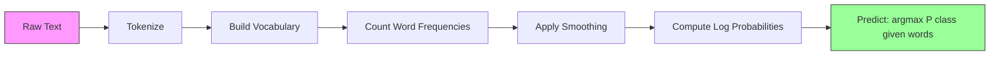

# 朴素贝叶斯

> "朴素"的假设是错误的，但它依然有效。这就是它的美妙之处。

**类型：** 构建
**语言：** Python
**前置知识：** 阶段 2，第 01-07 课（分类、贝叶斯定理）
**时间：** ~75 分钟

## 学习目标

- 从零实现带拉普拉斯平滑的多项式朴素贝叶斯，用于文本分类
- 解释为什么朴素独立性假设在数学上是错误的，但在实践中却能产生正确的类别排序
- 比较多项式、伯努利和高斯朴素贝叶斯变体，并为给定的特征类型选择合适的一种
- 在高维稀疏数据上评估朴素贝叶斯与逻辑回归，并解释其中的偏差-方差权衡

## 问题

你需要对文本进行分类。将邮件分为垃圾邮件或非垃圾邮件。将客户评论分为正面或负面。将支持工单分类到不同类别。你有成千上万个特征（每个词一个），而训练数据有限。

大多数分类器在这里会陷入困境。逻辑回归需要足够的样本来可靠地估计数千个权重。决策树每次只在一个词上分裂，严重过拟合。KNN 在 10,000 维中毫无意义，因为每个点到其他每个点的距离都差不多。

朴素贝叶斯能处理这种情况。它做了一个数学上错误的假设（即每个特征在给定类别下与其他所有特征独立），但它在文本分类上仍然优于"更聪明"的模型，尤其是在训练集较小的情况下。它只需对数据进行单次遍历即可完成训练。它能扩展到数百万个特征。它能产生概率估计（尽管由于独立性假设，通常校准效果较差）。

理解为什么错误的假设能带来良好的预测，能让你学到机器学习的一个根本道理：最好的模型不是最正确的那个，而是对你的数据来说偏差-方差权衡最好的那个。

## 概念

### 贝叶斯定理（快速回顾）

贝叶斯定理翻转条件概率：

```
P(class | features) = P(features | class) * P(class) / P(features)
```

我们想要 `P(class | features)` —— 即文档属于某个类别的概率，给定文档中的词。我们可以从以下方面计算：
- `P(features | class)` —— 在该类文档中看到这些词的可能性
- `P(class)` —— 类别的先验概率（垃圾邮件总体上有多常见？）
- `P(features)` —— 证据，对所有类别都相同，所以比较时可以忽略

`P(class | features)` 最高的类别获胜。

### 朴素独立性假设

精确计算 `P(features | class)` 需要估计所有特征联合在一起的联合概率。对于 10,000 个词的词汇表，你需要估计 2^10,000 种可能组合的分布。不可能。

朴素假设：每个特征在给定类别下条件独立。

```
P(w1, w2, ..., wn | class) = P(w1 | class) * P(w2 | class) * ... * P(wn | class)
```

与其面对一个不可能实现的联合分布，你只需估计 n 个简单的单特征分布。每个只需要计数即可。

这个假设显然是错误的。在任何文档中，"machine" 和 "learning" 都不是独立的。但分类器不需要正确的概率估计。它需要的是正确的排序 —— 哪个类别的概率最高。独立性假设引入了系统性误差，但这些误差对所有类别的影响相似，所以排序保持正确。

### 为什么它仍然有效

三个原因：

1. **排序优于校准。** 分类只需要排名最高的类别是正确的。即使 P(spam) = 0.99999 而真实概率是 0.7，分类器仍然能正确选出 spam。我们不需要正确的概率。我们需要正确的赢家。

2. **高偏差，低方差。** 独立性假设是一个强先验。它 heavily 约束了模型，防止过拟合。在训练数据有限的情况下，一个稍微错误但稳定的模型，胜过一个理论上正确但 wildly 不稳定的模型。这就是偏差-方差权衡的实际体现。

3. **特征冗余相互抵消。** 相关特征提供了冗余的证据。分类器会重复计算这些证据，但它对正确类别也重复计算。如果 "machine" 和 "learning" 总是一起出现，两者都为 "tech" 类别提供证据。NB 把它们计算两次，但它对正确的类别计算两次。

第四个实际原因：朴素贝叶斯极快。训练是对数据进行单次遍历计数频率。预测是矩阵乘法。你可以在几秒钟内训练百万文档。这种速度意味着你可以比慢模型更快地迭代、尝试更多特征集、运行更多实验。

### 逐步数学推导

让我们通过一个具体例子来追踪。假设有两个类别：spam 和 not-spam。词汇表有三个词："free"、"money"、"meeting"。

训练数据：
- 垃圾邮件提到 "free" 80 次，"money" 60 次，"meeting" 10 次（共 150 个词）
- 非垃圾邮件提到 "free" 5 次，"money" 10 次，"meeting" 100 次（共 115 个词）
- 40% 的邮件是垃圾邮件，60% 不是

使用拉普拉斯平滑（alpha=1）：

```
P(free | spam)    = (80 + 1) / (150 + 3) = 81/153 = 0.529
P(money | spam)   = (60 + 1) / (150 + 3) = 61/153 = 0.399
P(meeting | spam) = (10 + 1) / (150 + 3) = 11/153 = 0.072

P(free | not-spam)    = (5 + 1) / (115 + 3) = 6/118 = 0.051
P(money | not-spam)   = (10 + 1) / (115 + 3) = 11/118 = 0.093
P(meeting | not-spam) = (100 + 1) / (115 + 3) = 101/118 = 0.856
```

新邮件包含："free"（2 次），"money"（1 次），"meeting"（0 次）。

```
log P(spam | email) = log(0.4) + 2*log(0.529) + 1*log(0.399) + 0*log(0.072)
                    = -0.916 + 2*(-0.637) + (-0.919) + 0
                    = -3.109

log P(not-spam | email) = log(0.6) + 2*log(0.051) + 1*log(0.093) + 0*log(0.856)
                        = -0.511 + 2*(-2.976) + (-2.375) + 0
                        = -8.838
```

Spam 以很大优势获胜。"free" 出现两次是 spam 的有力证据。注意 "meeting" 没有出现对两个对数求和的贡献都是零（0 * log(P)）—— 在多项式 NB 中，缺失的词没有影响。是伯努利 NB 显式建模了词的缺失。

### 三种变体

朴素贝叶斯有三种形式。每种对 `P(feature | class)` 的建模方式不同。

#### 多项式朴素贝叶斯

将每个特征建模为计数。最适合特征为词频或 TF-IDF 值的文本数据。

```
P(word_i | class) = (count of word_i in class + alpha) / (total words in class + alpha * vocab_size)
```

`alpha` 是拉普拉斯平滑（见下文解释）。这种变体是文本分类的主力。

#### 高斯朴素贝叶斯

将每个特征建模为正态分布。最适合连续特征。

```
P(x_i | class) = (1 / sqrt(2 * pi * var)) * exp(-(x_i - mean)^2 / (2 * var))
```

每个类别获得每个特征自己的均值和方差。当特征在每个类别内真正服从钟形曲线时，效果很好。

#### 伯努利朴素贝叶斯

将每个特征建模为二元（存在或缺失）。最适合短文本或二元特征向量。

```
P(word_i | class) = (docs in class containing word_i + alpha) / (total docs in class + 2 * alpha)
```

与多项式不同，伯努利显式惩罚词的缺失。如果 "free" 通常出现在 spam 中，但这封邮件中没有，伯努利会将其视为反对 spam 的证据。

### 何时使用每种变体

| 变体 | 特征类型 | 最适合 | 示例 |
|---------|-------------|----------|---------|
| 多项式 | 计数或频率 | 文本分类，词袋模型 | 邮件垃圾检测、主题分类 |
| 高斯 | 连续值 | 特征近似正态分布的表格数据 | Iris 分类、传感器数据 |
| 伯努利 | 二元（0/1） | 短文本、二元特征向量 | 短信垃圾检测、存在/缺失特征 |

### 拉普拉斯平滑

当一个词出现在测试数据中，但从未在训练数据的某个特定类别中出现过时，会发生什么？

没有平滑时：`P(word | class) = 0/N = 0`。一个零乘以整个乘积，使得 `P(class | features) = 0`，无论其他所有证据如何。一个未见过的词就摧毁了整个预测，无论多少其他证据支持它。

拉普拉斯平滑给每个特征计数加上一个小的 `alpha`（通常为 1）：

```
P(word_i | class) = (count(word_i, class) + alpha) / (total_words_in_class + alpha * vocab_size)
```

当 alpha=1 时，每个词都至少获得微小的概率。测试邮件中出现 "discombobulate" 这个词不再会杀死 spam 概率。这种平滑有贝叶斯解释：它等价于在词分布上放置一个均匀的狄利克雷先验。

更高的 alpha 意味着更强的平滑（更均匀的分布）。更低的 alpha 意味着模型更信任数据。Alpha 是一个需要调优的超参数。

Alpha 的效果：

| Alpha | 效果 | 何时使用 |
|-------|--------|-------------|
| 0.001 | 几乎无平滑，信任数据 | 非常大的训练集，预计没有未见特征 |
| 0.1 | 轻度平滑 | 大训练集 |
| 1.0 | 标准拉普拉斯平滑 | 默认起点 |
| 10.0 | 强平滑，使分布更平坦 | 非常小的训练集，预计有很多未见特征 |

### 对数空间计算

将数百个概率（每个都小于 1）相乘会导致浮点下溢。乘积在浮点数中变为零，即使真实值是一个非常小的正数。

解决方案：在对数空间中工作。不乘以概率，而是加上它们的对数：

```
log P(class | x1, x2, ..., xn) = log P(class) + sum_i log P(xi | class)
```

这将预测转化为点积：

```
log_scores = X @ log_feature_probs.T + log_class_priors
prediction = argmax(log_scores)
```

矩阵乘法。这就是朴素贝叶斯预测如此快的原因 —— 它与单层线性模型的运算相同。

### 朴素贝叶斯 vs 逻辑回归

两者都是用于文本的线性分类器。区别在于它们建模的对象。

| 方面 | 朴素贝叶斯 | 逻辑回归 |
|--------|------------|-------------------|
| 类型 | 生成式（建模 P(X\|Y)） | 判别式（建模 P(Y\|X)） |
| 训练 | 计数频率 | 优化损失函数 |
| 小数据 | 更好（强先验有帮助） | 更差（不足以估计权重） |
| 大数据 | 更差（错误假设有害） | 更好（灵活的边界） |
| 特征 | 假设独立 | 处理相关性 |
| 速度 | 单次遍历，非常快 | 迭代优化 |
| 校准 | 概率较差 | 概率更好 |

经验法则：从朴素贝叶斯开始。如果有足够数据且 NB 遇到瓶颈，切换到逻辑回归。

### 分类流程



实践中，我们在对数空间工作以避免浮点下溢。不将许多小概率相乘，而是加上它们的对数：

```
log P(class | features) = log P(class) + sum_i log P(feature_i | class)
```

## 构建

`code/naive_bayes.py` 中的代码从零实现了多项式 NB 和高斯 NB。

### 多项式 NB

从零实现：

1. **fit(X, y)**：对每个类别，计数每个特征的频率。加上拉普拉斯平滑。计算对数概率。存储类别先验（类别频率的对数）。

2. **predict_log_proba(X)**：对每个样本，对所有类别计算 log P(class) + 所有 log P(feature_i | class) 的和。这是矩阵乘法：X @ log_probs.T + log_priors。

3. **predict(X)**：返回对数概率最高的类别。

```python
class MultinomialNB:
    def __init__(self, alpha=1.0):
        self.alpha = alpha

    def fit(self, X, y):
        classes = np.unique(y)
        n_classes = len(classes)
        n_features = X.shape[1]

        self.classes_ = classes
        self.class_log_prior_ = np.zeros(n_classes)
        self.feature_log_prob_ = np.zeros((n_classes, n_features))

        for i, c in enumerate(classes):
            X_c = X[y == c]
            self.class_log_prior_[i] = np.log(X_c.shape[0] / X.shape[0])
            counts = X_c.sum(axis=0) + self.alpha
            self.feature_log_prob_[i] = np.log(counts / counts.sum())

        return self
```

关键洞察：拟合后，预测只是矩阵乘法加上偏置。这就是朴素贝叶斯如此快的原因。

### 高斯 NB

对于连续特征，我们估计每个类别每个特征的均值和方差：

```python
class GaussianNB:
    def __init__(self):
        pass

    def fit(self, X, y):
        classes = np.unique(y)
        self.classes_ = classes
        self.means_ = np.zeros((len(classes), X.shape[1]))
        self.vars_ = np.zeros((len(classes), X.shape[1]))
        self.priors_ = np.zeros(len(classes))

        for i, c in enumerate(classes):
            X_c = X[y == c]
            self.means_[i] = X_c.mean(axis=0)
            self.vars_[i] = X_c.var(axis=0) + 1e-9
            self.priors_[i] = X_c.shape[0] / X.shape[0]

        return self
```

预测使用每个特征的高斯 PDF，跨特征相乘（对数空间中相加）。

### 演示：文本分类

代码生成合成的词袋数据，模拟两个类别（科技文章 vs 体育文章）。每个类别有不同的词频分布。多项式 NB 使用词频进行分类。

合成数据的工作原理：我们创建 200 个"词"（特征列）。词 0-39 在科技文章中高频出现，在体育中低频。词 80-119 在体育中高频出现，在科技中低频。词 40-79 在两者中都是中等频率。这创造了一个现实场景，其中一些词是强类别指示器，另一些是噪声。

### 演示：连续特征

代码生成类 Iris 数据（3 个类别，4 个特征，高斯聚类）。高斯 NB 使用每个类别的均值和方差进行分类。每个类别有不同的中心（均值向量）和不同的散布（方差），模拟真实世界中不同类别间测量系统差异的数据。

代码还演示了：
- **平滑比较：** 用不同的 alpha 值训练多项式 NB，展示平滑强度对准确率的影响。
- **训练规模实验：** NB 准确率如何随训练数据从 20 增长到 1600 个样本而提升。NB 即使在样本很少时也能达到不错的准确率 —— 这是它的主要优势。
- **混淆矩阵：** 每个类别的精确率、召回率和 F1 分数，展示 NB 在哪里犯错。

### 预测速度

朴素贝叶斯预测是矩阵乘法。对于 n 个样本、d 个特征、k 个类别：
- 多项式 NB：一次矩阵乘法 (n x d) @ (d x k) = O(n * d * k)
- 高斯 NB：n * k 次高斯 PDF 评估，每次跨越 d 个特征 = O(n * d * k)

两者在每个维度上都是线性的。与 KNN（需要计算到所有训练点的距离）或带 RBF 核的 SVM（需要对所有支持向量进行核评估）相比。NB 在预测时快几个数量级。

## 使用

使用 sklearn，两种变体都是一行代码：

```python
from sklearn.naive_bayes import GaussianNB, MultinomialNB

gnb = GaussianNB()
gnb.fit(X_train, y_train)
print(f"GaussianNB accuracy: {gnb.score(X_test, y_test):.3f}")

mnb = MultinomialNB(alpha=1.0)
mnb.fit(X_train_counts, y_train)
print(f"MultinomialNB accuracy: {mnb.score(X_test_counts, y_test):.3f}")
```

使用 sklearn 进行文本分类：

```python
from sklearn.feature_extraction.text import CountVectorizer
from sklearn.naive_bayes import MultinomialNB
from sklearn.pipeline import Pipeline

text_clf = Pipeline([
    ("vectorizer", CountVectorizer()),
    ("classifier", MultinomialNB(alpha=1.0)),
])

text_clf.fit(train_texts, train_labels)
accuracy = text_clf.score(test_texts, test_labels)
```

`naive_bayes.py` 中的代码将从头实现与 sklearn 在同一数据上的比较，以验证正确性。

### 与朴素贝叶斯结合使用 TF-IDF

原始词频让每个词每次出现都有相同的权重。但像 "the" 和 "is" 这样的常见词在每个类别中都频繁出现 —— 它们不携带信息。TF-IDF（词频-逆文档频率）降低常见词的权重，提高稀有、有区分力词的权重。

```python
from sklearn.feature_extraction.text import TfidfVectorizer
from sklearn.naive_bayes import MultinomialNB
from sklearn.pipeline import Pipeline

text_clf = Pipeline([
    ("tfidf", TfidfVectorizer()),
    ("classifier", MultinomialNB(alpha=0.1)),
])
```

TF-IDF 值是非负的，所以它们可以与多项式 NB 一起使用。TF-IDF + 多项式 NB 的组合是文本分类最强的基线之一。它经常在少于 10,000 个训练样本的数据集上击败更复杂的模型。

### 用于短文本的伯努利 NB

对于短文本（推文、短信、聊天消息），伯努利 NB 可以胜过多项式 NB。短文本的词频低，所以多项式 NB 依赖的频率信息很嘈杂。伯努利 NB 只关心存在或缺失，这在短文本中更可靠。

```python
from sklearn.naive_bayes import BernoulliNB
from sklearn.feature_extraction.text import CountVectorizer

text_clf = Pipeline([
    ("vectorizer", CountVectorizer(binary=True)),
    ("classifier", BernoulliNB(alpha=1.0)),
])
```

CountVectorizer 中的 `binary=True` 标志将所有计数转换为 0/1。没有它，伯努利 NB 仍然可以工作，但它看到的是为计数设计的值。

### 校准 NB 概率

NB 概率校准效果差。当 NB 说 P(spam) = 0.95 时，真实概率可能是 0.7。如果你需要可靠的概率估计（例如，设置阈值或与其他模型结合），使用 sklearn 的 CalibratedClassifierCV：

```python
from sklearn.calibration import CalibratedClassifierCV

calibrated_nb = CalibratedClassifierCV(MultinomialNB(), cv=5, method="sigmoid")
calibrated_nb.fit(X_train, y_train)
proba = calibrated_nb.predict_proba(X_test)
```

这在 NB 的原始分数上使用交叉验证拟合逻辑回归。得到的概率更接近真实的类别频率。

### 常见陷阱

1. **负特征值。** 多项式 NB 需要非负特征。如果你有负值（如某些设置下的 TF-IDF 或标准化特征），改用高斯 NB，或将特征平移为正。

2. **零方差特征。** 高斯 NB 除以方差。如果一个特征在某个类别中的方差为零（所有值相同），概率计算会崩溃。代码给所有方差加上一个小的平滑项（1e-9）来防止这种情况。

3. **类别不平衡。** 如果 99% 的邮件是非垃圾邮件，先验 P(not-spam) = 0.99 太强，会压倒可能性证据。你可以手动设置类别先验，或在 sklearn 中使用 class_prior 参数。

4. **特征缩放。** 多项式 NB 不需要缩放（它基于计数工作）。高斯 NB 也不需要缩放（它估计每个特征的统计量）。这相对于逻辑回归和 SVM 是优势，后者对特征尺度敏感。

## 交付

本课产出：
- `outputs/skill-naive-bayes-chooser.md` —— 选择正确 NB 变体的决策技能
- `code/naive_bayes.py` —— 从零实现的多项式 NB 和高斯 NB，并与 sklearn 对比

### 朴素贝叶斯何时失效

NB 在独立性假设导致错误排序时失效（不仅仅是错误的概率）。这种情况发生在：

1. **强特征交互。** 如果类别依赖于两个特征的组合而非单独任何一个（类 XOR 模式），NB 完全无法捕捉。每个特征单独提供不了证据，而 NB 无法非线性地组合它们。

2. **高度相关特征带有相反证据。** 如果特征 A 说 "spam" 而特征 B 说 "not-spam"，但 A 和 B 完全相关（现实中它们总是一致的），NB 会看到实际上不存在的冲突证据。

3. **非常大的训练集。** 有足够数据时，判别式模型如逻辑回归能学到真正的决策边界并 outperform NB。在小数据时有帮助的独立性假设现在限制了模型。

实践中，这些失效模式在文本分类中很少见。文本特征众多、单独较弱，独立性假设的错误往往相互抵消。对于特征少且强相关的表格数据，优先考虑逻辑回归或树模型。

## 练习

1. **平滑实验。** 在文本数据上用 alpha 值为 0.01、0.1、1.0、10.0 和 100.0 训练多项式 NB。绘制准确率 vs alpha 图。性能在哪里达到峰值？为什么很高的 alpha 有害？

2. **特征独立性测试。** 取一个真实文本数据集。挑选两个明显相关的词（"machine" 和 "learning"）。计算 P(word1 | class) * P(word2 | class) 并与 P(word1 AND word2 | class) 比较。独立性假设有多错误？它影响分类准确率吗？

3. **伯努利实现。** 扩展代码实现伯努利 NB 类。将词袋转换为二元（存在/缺失）并在文本数据上与多项式 NB 比较准确率。伯努利何时获胜？

4. **NB vs 逻辑回归。** 在文本数据上训练两者。从 100 个训练样本开始增加到 10,000。为两者绘制准确率 vs 训练集大小图。逻辑回归何时超过朴素贝叶斯？

5. **垃圾过滤器。** 构建完整的垃圾分类器：分词原始邮件文本，构建词汇表，创建词袋特征，训练多项式 NB，用精确率和召回率评估（不只是准确率 —— 为什么？）。

## 关键术语

| 术语 | 人们怎么说 | 实际含义 |
|------|----------------|----------------------|
| 朴素贝叶斯 | "简单的概率分类器" | 应用贝叶斯定理并假设特征在给定类别下条件独立的分类器 |
| 条件独立 | "特征互不影响" | P(A, B \| C) = P(A \| C) * P(B \| C) —— 一旦知道 C，知道 B 对 A 没有额外信息 |
| 拉普拉斯平滑 | "加一平滑" | 给每个特征加一个小计数，防止零概率主导预测 |
| 先验 | "看到数据之前的信念" | P(class) —— 在观察任何特征之前每个类别的概率 |
| 似然 | "数据拟合程度" | P(features \| class) —— 如果已知类别，观察到这些特征的概率 |
| 后验 | "看到数据之后的信念" | P(class \| features) —— 观察到特征后类别的更新概率 |
| 生成模型 | "建模数据如何生成" | 学习 P(X \| Y) 和 P(Y)，然后用贝叶斯定理得到 P(Y \| X) 的模型 |
| 判别模型 | "建模决策边界" | 直接学习 P(Y \| X) 而不建模 X 如何生成的模型 |
| 对数概率 | "避免下溢" | 使用 log P 而非 P，防止许多小数的乘积在浮点数中变为零 |

## 延伸阅读

- [scikit-learn 朴素贝叶斯文档](https://scikit-learn.org/stable/modules/naive_bayes.html) —— 三种变体及其数学细节
- [McCallum and Nigam, A Comparison of Event Models for Naive Bayes Text Classification (1998)](https://www.cs.cmu.edu/~knigam/papers/multinomial-aaaiws98.pdf) —— 多项式与伯努利用于文本的经典比较
- [Rennie et al., Tackling the Poor Assumptions of Naive Bayes Text Classifiers (2003)](https://people.csail.mit.edu/jrennie/papers/icml03-nb.pdf) —— 文本 NB 的改进
- [Ng and Jordan, On Discriminative vs. Generative Classifiers (2001)](https://ai.stanford.edu/~ang/papers/nips01-discriminativegenerative.pdf) —— 证明 NB 比 LR 在更少数据时收敛更快
