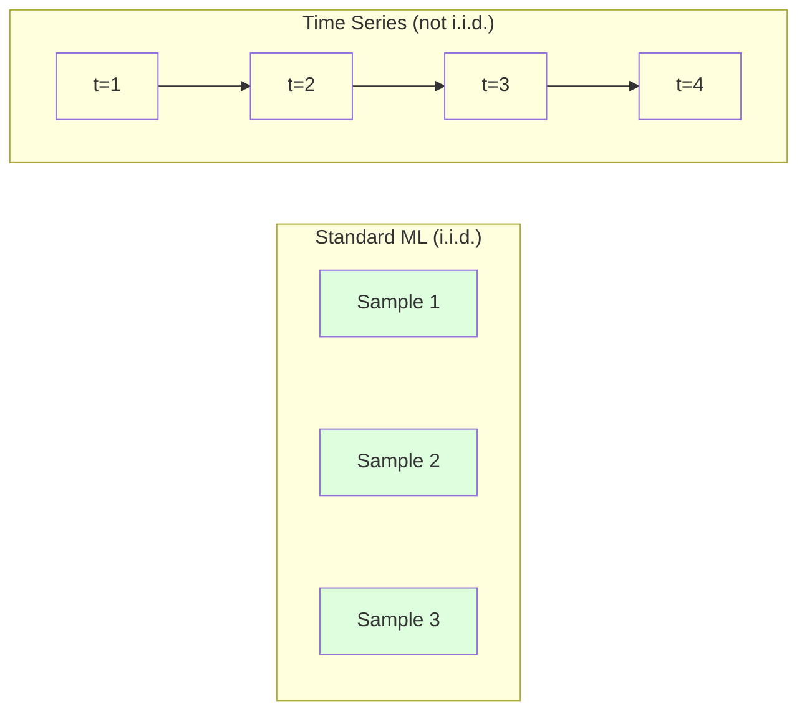
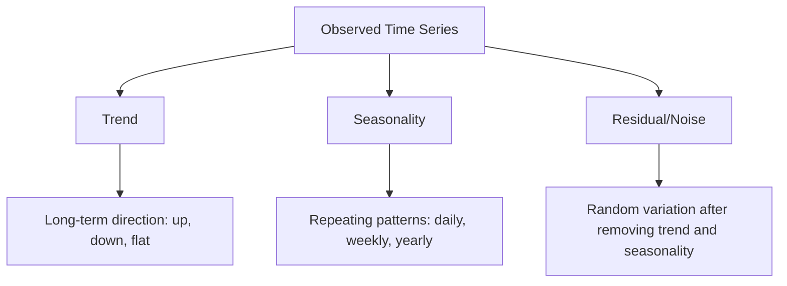
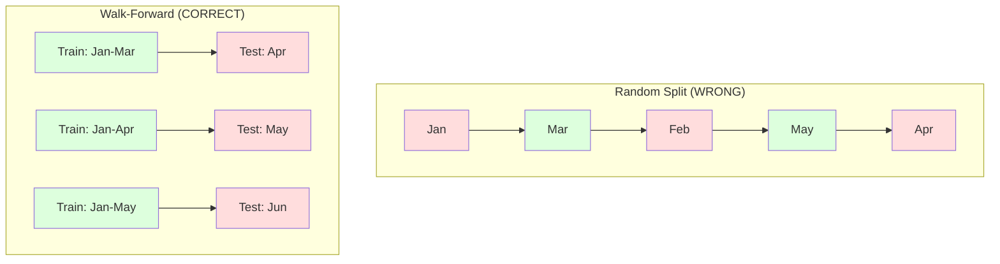

# 时间序列基础

> 历史表现确实能预测未来结果——但前提是先检验平稳性。

**类型：** 构建
**语言：** Python
**前置知识：** 第二阶段，第 01-09 课
**时间：** ~90 分钟

## 学习目标

- 将时间序列分解为趋势、季节性和残差分量，并检验平稳性
- 实现滞后特征和滚动统计量，将时间序列转化为监督学习问题
- 构建前向验证框架，防止未来数据泄露到训练集中
- 解释为什么随机训练/测试拆分对时间序列无效，并展示与正确时间拆分之间的性能差距

## 问题背景

你拥有按时间排序的数据：每日销售额、每小时温度、每分钟 CPU 使用率、每周股价。你想预测下一个值、下一周、下一季度。

你拿出标准的机器学习工具箱：随机训练/测试拆分、交叉验证、特征矩阵输入、预测输出。每一步都是错的。

时间序列打破了标准机器学习所依赖的假设。样本不是独立的——今天的温度取决于昨天。随机拆分将未来信息泄露到过去。在回测中表现优异的特征在生产环境中失败，因为它们依赖随时间变化的模式。

一个模型在随机交叉验证中获得 95% 准确率，在正确的时间评估中可能只有 55%。这种差异不是技术细节，而是纸上模型与生产可用模型之间的区别。

本课涵盖基础知识：时间数据有何不同、如何诚实评估模型，以及如何将时间序列转化为标准机器学习模型可以使用的特征。

## 核心概念

### 时间序列的特殊之处

标准机器学习假设 i.i.d.——独立同分布。每个样本从同一分布中独立抽取。时间序列违反了两点：

- **不独立。** 今天的股价取决于昨天。本周的销售额与上周相关。
- **不同分布。** 分布随时间漂移。十二月的销售额与三月不同。

这些违反不是小问题。它们改变了你构建特征、评估模型和选择算法的方式。



在标准机器学习中，样本可互换。打乱它们没有任何影响。在时间序列中，顺序就是一切。打乱会破坏信号。

### 时间序列的组成成分

每个时间序列都是以下成分的组合：



- **趋势**：长期方向。收入每年增长 10%。全球气温上升。
- **季节性**：固定间隔重复的模式。十二月零售额激增。七月空调使用达到峰值。
- **残差**：去除趋势和季节性后剩余的部分。如果残差看起来像白噪声，说明分解已捕获信号。

### 平稳性

如果时间序列的统计特性（均值、方差、自相关）不随时间变化，则称其为平稳的。大多数预测方法假设平稳性。

**为什么重要：** 非平稳序列的均值会漂移。在一月份数据上训练的模型学到的均值与二月份不同。它将系统性出错。

**如何检验：** 计算滑动窗口上的滚动均值和滚动标准差。如果它们漂移，则序列非平稳。

**如何修正：** 差分。不对原始值建模，而是对连续值之间的变化建模：

```
diff[t] = value[t] - value[t-1]
```

如果一轮差分不能使序列平稳，则再次应用（二阶差分）。大多数真实世界序列最多需要两轮。

**示例：**

原始序列：[100, 102, 106, 112, 120]
一阶差分： [2, 4, 6, 8]（仍呈上升趋势）
二阶差分： [2, 2, 2]（恒定——平稳）

原始序列具有二次趋势。一阶差分将其变为线性趋势。二阶差分使其平坦。实践中很少需要超过两轮。

**正式检验：** 增广迪基-富勒（ADF）检验是检验平稳性的标准统计检验。原假设为"序列非平稳"。p 值低于 0.05 意味着可以拒绝原假设，得出平稳性结论。我们不从头实现 ADF（它需要渐近分布表），但代码中的滚动统计方法提供了实用的可视化检验。

### 自相关

自相关衡量时间 t 的值与时间 t-k（过去 k 步）的值的相关程度。自相关函数（ACF）为每个滞后 k 绘制这种相关性。

**ACF 告诉你：**
- 序列的记忆有多远。如果 ACF 在滞后 5 后降至零，则超过 5 步以前的值无关紧要。
- 季节性是否存在。如果 ACF 在滞后 12 处出现峰值（月度数据），则存在年度季节性。
- 应创建多少滞后特征。使用到 ACF 变得可忽略为止的滞后。

**PACF（偏自相关函数）** 去除了间接相关。如果今天与 3 天前的相关仅仅是因为两者都与昨天相关，那么滞后 3 的 PACF 将为零，而滞后 3 的 ACF 不会。

### 滞后特征：将时间序列转化为监督学习

标准机器学习模型需要特征矩阵 X 和目标 y。时间序列给你的是单列值。桥梁就是滞后特征。

取序列 [10, 12, 14, 13, 15] 并创建滞后 1 和滞后 2 特征：

| lag_2 | lag_1 | target |
|-------|-------|--------|
| 10    | 12    | 14     |
| 12    | 14    | 13     |
| 14    | 13    | 15     |

现在你有了标准的回归问题。任何机器学习模型（线性回归、随机森林、梯度提升）都可以从滞后特征预测目标。

可以工程化的其他特征：
- **滚动统计量：** 最近 k 个值的均值、标准差、最小值、最大值
- **日历特征：** 星期几、月份、是否节假日、是否周末
- **差分值：** 与前一步的变化
- **扩展统计量：** 累积均值、累积和
- **比率特征：** 当前值 / 滚动均值（与近期平均值的偏离程度）
- **交互特征：** lag_1 * day_of_week（工作日对动量的影响）

**多少滞后？** 使用自相关函数。如果 ACF 到滞后 10 都显著，则至少使用 10 个滞后。如果存在周季节性，则包含滞后 7（可能还有 14）。更多滞后给模型更多历史信息，但也增加更多待拟合特征，提高过拟合风险。

**目标对齐陷阱。** 创建滞后特征时，目标必须是时间 t 的值，所有特征必须使用时间 t-1 或更早的值。如果不小心将时间 t 的值作为特征包含进来，你就有了完美预测器——以及完全无用的模型。这是时间序列特征工程中最常见的 bug。

### 前向验证

这是本课最重要的概念。标准 k 折交叉验证随机分配样本到训练集和测试集。对于时间序列，这会泄露未来信息。



前向验证：
1. 用时间 t 之前的数据训练
2. 预测时间 t+1（或 t+1 到 t+k 的多步预测）
3. 滑动窗口向前
4. 重复

每个测试折只包含所有训练数据之后的数据。没有未来泄露。这给你模型部署时表现的真实估计。

**扩展窗口** 使用所有历史数据训练（窗口增长）。**滑动窗口** 使用固定大小的训练窗口（窗口滑动）。当认为旧数据仍然相关时使用扩展窗口。当世界变化且旧数据有害时使用滑动窗口。

### ARIMA 直观理解

ARIMA 是经典的时间序列模型。它有三个组成部分：

- **AR（自回归）：** 从过去值预测。AR(p) 使用过去 p 个值。
- **I（差分）：** 通过差分实现平稳性。I(d) 应用 d 轮差分。
- **MA（移动平均）：** 从过去预测误差预测。MA(q) 使用过去 q 个误差。

ARIMA(p, d, q) 结合三者。基于 ACF/PACF 分析或自动搜索（auto-ARIMA）选择 p, d, q。

我们不会从头实现 ARIMA——它需要超出本课范围的数值优化。关键洞察是理解每个组成部分的作用，以便解释 ARIMA 结果并知道何时使用它。

### 何时使用何种方法

| 方法 | 最适合 | 处理季节性 | 处理外部特征 |
|----------|---------|---------------|------------------------|
| 滞后特征 + ML | 具有大量外部特征的表格数据 | 通过日历特征 | 是 |
| ARIMA | 单变量序列，短期预测 | SARIMA 变体 | 否（ARIMAX 有限支持） |
| 指数平滑 | 简单趋势 + 季节性 | 是（Holt-Winters） | 否 |
| Prophet | 业务预测，节假日 | 是（傅里叶项） | 有限 |
| 神经网络（LSTM、Transformer） | 长序列，多序列 | 学习得到 | 是 |

对于大多数实际问题，滞后特征 + 梯度提升是最强的起点。它自然处理外部特征，不需要平稳性，且易于调试。

### 预测范围与策略

单步预测预测一个时间步。多步预测预测多个时间步。有三种策略：

**递归（迭代）：** 预测一步，将预测作为下一步的输入。简单但误差累积——每次预测使用上一次的预测，因此错误复合。

**直接：** 为每个范围训练单独的模型。模型-1 预测 t+1，模型-5 预测 t+5。无误差累积，但每个模型训练样本更少，且它们不共享信息。

**多输出：** 训练一个同时输出所有范围的模型。在范围间共享信息，但需要支持多输出的模型（或自定义损失函数）。

对于大多数实际问题，短范围（1-5 步）从递归开始，长范围使用直接法。

### 时间序列常见错误

| 错误 | 发生原因 | 如何修正 |
|---------|---------------|-----------|
| 随机训练/测试拆分 | 标准机器学习的习惯 | 使用前向验证或时间拆分 |
| 使用未来特征 | 误将时间 t 的特征包含进来 | 审计每个特征的时间对齐 |
| 对季节性过拟合 | 模型记住日历模式 | 在测试集中保留完整季节性周期 |
| 忽略尺度变化 | 收入翻倍但模式不变 | 对百分比变化而非绝对值建模 |
| 滞后特征过多 | "更多历史更好" | 使用 ACF 确定相关滞后 |
| 不进行差分 | "模型会自己搞懂" | 树模型处理趋势；线性模型需要平稳性 |

## 动手实现

`code/time_series.py` 中的代码从头实现了核心构建模块。

### 滞后特征创建器

```python
def make_lag_features(series, n_lags):
    n = len(series)
    X = np.full((n, n_lags), np.nan)
    for lag in range(1, n_lags + 1):
        X[lag:, lag - 1] = series[:-lag]
    valid = ~np.isnan(X).any(axis=1)
    return X[valid], series[valid]
```

这将一维序列转化为特征矩阵，其中每行以最近 `n_lags` 个值作为特征，当前值作为目标。

### 前向交叉验证

```python
def walk_forward_split(n_samples, n_splits=5, min_train=50):
    assert min_train < n_samples, "min_train must be less than n_samples"
    step = max(1, (n_samples - min_train) // n_splits)
    for i in range(n_splits):
        train_end = min_train + i * step
        test_end = min(train_end + step, n_samples)
        if train_end >= n_samples:
            break
        yield slice(0, train_end), slice(train_end, test_end)
```

每次拆分确保训练数据严格早于测试数据。训练窗口随每折扩展。

### 简单自回归模型

纯 AR 模型就是对滞后特征做线性回归：

```python
class SimpleAR:
    def __init__(self, n_lags=5):
        self.n_lags = n_lags
        self.weights = None
        self.bias = None

    def fit(self, series):
        X, y = make_lag_features(series, self.n_lags)
        # Solve via normal equations
        X_b = np.column_stack([np.ones(len(X)), X])
        theta = np.linalg.lstsq(X_b, y, rcond=None)[0]
        self.bias = theta[0]
        self.weights = theta[1:]
        return self
```

这在概念上与第 02 课的线性回归相同，但应用于同一变量的时间滞后版本。

### 平稳性检验

代码计算滚动统计量，以可视化和数值方式评估平稳性：

```python
def check_stationarity(series, window=50):
    rolling_mean = np.array([
        series[max(0, i - window):i].mean()
        for i in range(1, len(series) + 1)
    ])
    rolling_std = np.array([
        series[max(0, i - window):i].std()
        for i in range(1, len(series) + 1)
    ])
    return rolling_mean, rolling_std
```

如果滚动均值漂移或滚动标准差变化，则序列非平稳。应用差分并再次检验。

代码还通过比较序列的前半部分和后半部分来检验平稳性。如果均值差异超过半个标准差，或方差比超过 2 倍，则标记序列非平稳。

### 自相关

```python
def autocorrelation(series, max_lag=20):
    n = len(series)
    mean = series.mean()
    var = series.var()
    acf = np.zeros(max_lag + 1)
    for k in range(max_lag + 1):
        cov = np.mean((series[:n-k] - mean) * (series[k:] - mean))
        acf[k] = cov / var if var > 0 else 0
    return acf
```

## 实际应用

使用 sklearn，你可以直接将滞后特征与任何回归器配合使用：

```python
from sklearn.linear_model import Ridge
from sklearn.ensemble import GradientBoostingRegressor

X, y = make_lag_features(series, n_lags=10)

for train_idx, test_idx in walk_forward_split(len(X)):
    model = Ridge(alpha=1.0)
    model.fit(X[train_idx], y[train_idx])
    predictions = model.predict(X[test_idx])
```

对于 ARIMA，使用 statsmodels：

```python
from statsmodels.tsa.arima.model import ARIMA

model = ARIMA(train_series, order=(5, 1, 2))
fitted = model.fit()
forecast = fitted.forecast(steps=30)
```

`time_series.py` 中的代码演示了两种方法，并使用前向验证进行比较。

### sklearn TimeSeriesSplit

sklearn 提供了 `TimeSeriesSplit`，它实现了前向验证：

```python
from sklearn.model_selection import TimeSeriesSplit

tscv = TimeSeriesSplit(n_splits=5)
for train_index, test_index in tscv.split(X):
    X_train, X_test = X[train_index], X[test_index]
    y_train, y_test = y[train_index], y[test_index]
    model.fit(X_train, y_train)
    score = model.score(X_test, y_test)
```

这等同于我们从头实现的 `walk_forward_split`，但集成到了 sklearn 的交叉验证框架中。你可以配合 `cross_val_score` 使用：

```python
from sklearn.model_selection import cross_val_score

scores = cross_val_score(model, X, y, cv=TimeSeriesSplit(n_splits=5))
print(f"Mean score: {scores.mean():.4f} +/- {scores.std():.4f}")
```

### 评估指标

时间序列预测使用回归指标，但带有时间感知上下文：

- **MAE（平均绝对误差）：** |y_true - y_pred| 的平均值。易于用原始单位解释。"平均而言，预测偏差 3.2 度。"
- **RMSE（均方根误差）：** 均方误差的平方根。比 MAE 更惩罚大误差。当大误差比多个小误差更糟时使用。
- **MAPE（平均绝对百分比误差）：** |error / true_value| * 100 的平均值。与尺度无关，适用于跨不同序列比较。但真实值为零时无定义。
- **朴素基线比较：** 始终与简单基线比较。季节性朴素基线预测前一个周期的值（昨天、上周）。如果你的模型无法击败朴素基线，说明有问题。

### 滚动特征

代码演示了将滚动统计量（7 天和 14 天窗口的均值、标准差、最小值、最大值）添加到滞后特征中。这些给模型提供了滞后特征本身无法捕捉的近期趋势和波动率信息。

例如，如果滚动均值上升，表明上升趋势。如果滚动标准差增加，表明波动率增大。这些是树模型可以学习但线性模型无法学习的模式。

## 交付成果

本课产出：
- `outputs/prompt-time-series-advisor.md` —— 用于构建时间序列问题的提示词
- `code/time_series.py` —— 滞后特征、前向验证、AR 模型、平稳性检验

### 必须击败的基线

构建任何模型之前，建立基线：

1. **最后值（ persistence）。** 预测明天与今天相同。对于许多序列，这 surprisingly 难以击败。
2. **季节性朴素。** 预测今天与上周同一天（或去年同一天）相同。如果你的模型无法击败这个，说明它没有学到季节性之外的有用模式。
3. **移动平均。** 预测最近 k 个值的平均。平滑噪声但无法捕捉突变。

如果你的复杂机器学习模型输给季节性朴素基线，说明有 bug。最常见的是：特征中的未来泄露、错误的评估方法，或者序列确实是随机不可预测的。

### 实用技巧

1. **从绘图开始。** 任何建模之前，绘制原始序列。寻找趋势、季节性、异常值、结构性断裂（行为的突然变化）。30 秒的视觉检查往往比一小时的自动分析更有价值。

2. **先差分，后建模。** 如果序列有明显趋势，在创建滞后特征前先差分。树模型可以处理趋势，但线性模型不能，而差分永远不会有害。

3. **保留至少一个完整季节性周期。** 如果你有周季节性，测试集需要至少完整一周。如果是月度，至少完整一个月。否则你无法评估模型是否捕捉到季节性模式。

4. **生产环境监控。** 时间序列模型随世界变化而退化。滚动跟踪预测误差。当误差开始增加时，用近期数据重新训练模型。

5. **警惕体制变化。** 用疫情前数据训练的模型无法预测疫情后行为。将已知体制变化的指标作为特征包含进来，或使用遗忘旧数据的滑动窗口。

6. **对偏斜序列取对数。** 收入、价格和计数通常右偏。取对数稳定方差，使乘法模式变为加法模式，线性模型可以处理。在对数空间预测，然后取指数回到原始单位。

## 练习

1. **平稳性实验。** 生成具有线性趋势的序列。用滚动统计量检验平稳性。应用一阶差分。再次检验。二次趋势需要多少轮差分？

2. **滞后选择。** 在季节性序列（周期=7）上计算 ACF。哪些滞后具有最高自相关？仅使用这些滞后（而非连续滞后）创建滞后特征。与使用滞后 1 到 7 相比，准确率是否提高？

3. **前向验证 vs 随机拆分。** 在滞后特征上训练 Ridge 回归。用随机 80/20 拆分和前向验证评估。随机拆分高估了多少性能？

4. **特征工程。** 在滞后特征中添加滚动均值（窗口=7）、滚动标准差（窗口=7）和星期几特征。使用前向验证比较有无这些额外特征的准确率。

5. **多步预测。** 修改 AR 模型以预测未来 5 步而非 1 步。比较两种策略：(a) 预测一步，将预测作为下一步输入（递归）；(b) 为每个范围训练单独模型（直接）。哪种更准确？

## 关键术语

| 术语 | 人们怎么说 | 实际含义 |
|------|----------------|----------------------|
| 平稳性 | "统计量不随时间变化" | 均值、方差和自相关结构随时间恒定的序列 |
| 差分 | "连续值相减" | 计算 y[t] - y[t-1] 以去除趋势并实现平稳性 |
| 自相关（ACF） | "序列与自身的相关性" | 时间序列与其滞后副本之间的相关性，作为滞后的函数 |
| 偏自相关（PACF） | "仅直接相关" | 去除所有更短滞后影响后，滞后 k 的自相关 |
| 滞后特征 | "过去值作为输入" | 使用 y[t-1], y[t-2], ..., y[t-k] 作为特征预测 y[t] |
| 前向验证 | "尊重时间的交叉验证" | 训练数据始终按时间早于测试数据的评估方式 |
| ARIMA | "经典时间序列模型" | 自回归积分滑动平均：结合过去值（AR）、差分（I）和过去误差（MA） |
| 季节性 | "重复的日历模式" | 时间序列中与日历周期（日、周、年）绑定的规则、可预测循环 |
| 趋势 | "长期方向" | 序列水平随时间的持续增加或减少 |
| 扩展窗口 | "使用全部历史" | 训练集随每折增长的前向验证 |
| 滑动窗口 | "固定长度历史" | 训练集为固定长度窗口向前滑动的前向验证 |

## 延伸阅读

- [Hyndman and Athanasopoulos, Forecasting: Principles and Practice (3rd ed.)](https://otexts.com/fpp3/) —— 最好的免费时间序列预测教材
- [scikit-learn Time Series Split](https://scikit-learn.org/stable/modules/generated/sklearn.model_selection.TimeSeriesSplit.html) —— sklearn 的前向验证拆分器
- [statsmodels ARIMA docs](https://www.statsmodels.org/stable/generated/statsmodels.tsa.arima.model.ARIMA.html) —— 带诊断的 ARIMA 实现
- [Makridakis et al., The M5 Competition (2022)](https://www.sciencedirect.com/science/article/pii/S0169207021001874) —— 大规模预测竞赛，展示机器学习方法 vs 统计方法
