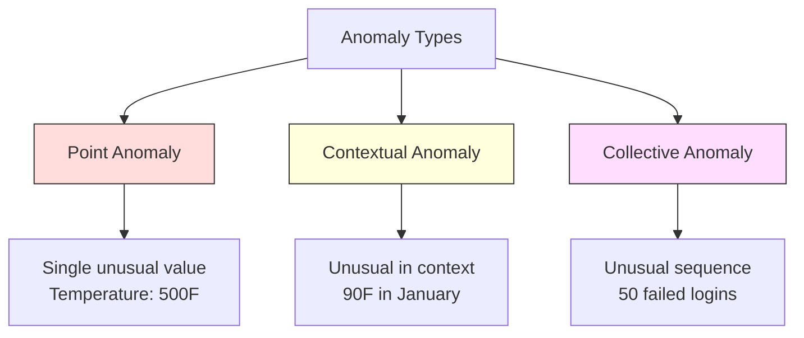
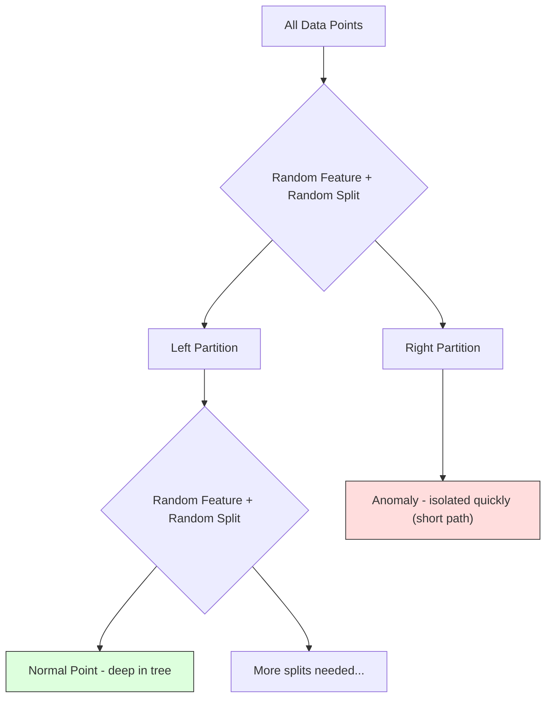
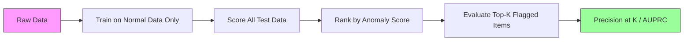

# 异常检测

> 正常很容易定义。异常就是任何不符合正常的东西。

**类型：** 构建
**语言：** Python
**前置要求：** 第二阶段，第 01-09 课
**时间：** ~75 分钟

## 学习目标

- 从零实现 Z-score、IQR 和 Isolation Forest 异常检测方法
- 区分点异常、上下文异常和集体异常，并为每种情况选择合适的检测方法
- 解释为什么异常检测被框架为建模正常数据，而不是对异常进行分类
- 比较无监督异常检测与监督分类，并评估新颖异常覆盖率与精确度之间的权衡

## 问题

一张信用卡下午 2 点在纽约使用，然后下午 2:05 在东京使用。工厂传感器读数为 150 度，而正常范围是 80-120 度。一台服务器每秒发送 50,000 个请求，而日均值是 200 个。

这些都是异常。发现它们很重要。欺诈造成数十亿损失。设备故障造成停机。网络入侵造成数据泄露。

挑战在于：你很少有标记好的异常样本。欺诈只占交易的 0.1%。设备故障每年发生几次。你无法训练标准分类器，因为"异常"类别中几乎没有可学习的内容。即使你有一些标签，你已经见过的异常也不是你将要遇到的唯一类型。明天的欺诈方案与今天的不同。

异常检测翻转了问题。与其学习什么是异常的，不如学习什么是正常的。任何偏离正常的东西都是可疑的。这无需标签即可工作，能适应新类型的异常，并能扩展到海量数据集。

## 概念

### 异常的类型

并非所有异常都相同：

- **点异常。** 单个数据点，无论上下文如何都是不寻常的。温度读数为 500 度。一笔 50,000 美元的交易，来自通常只花 50 美元的账户。
- **上下文异常。** 给定上下文后不寻常的数据点。90 度的温度在夏天是正常的，在冬天是异常的。相同的值，不同的上下文。
- **集体异常。** 作为一组不寻常的数据点序列，即使每个单独的点可能是正常的。五次登录失败是正常的。连续五十次是暴力破解攻击。

大多数方法检测点异常。上下文异常需要时间或位置特征。集体异常需要序列感知方法。



### 无监督框架

在标准分类中，你有两个类别的标签。在异常检测中，你通常面临以下三种情况之一：

1. **完全无监督。** 完全没有标签。你在所有数据上拟合检测器，并希望异常足够稀少，不会腐蚀"正常"模型。
2. **半监督。** 你只有正常数据的干净数据集。在这个干净集上拟合，对其他所有数据进行评分。这是可能时的最强设置。
3. **弱监督。** 你有少量标记的异常。用它们进行评估，而不是训练。无监督训练，然后在标记子集上测量精确度/召回率。

关键洞见：异常检测与分类根本不同。你是在建模正常数据的分布，而不是两个类别之间的决策边界。

### 监督 vs 无监督：权衡

如果你确实有标记的异常，应该将它们用于训练（监督分类）还是仅用于评估（无监督检测）？

**监督（视为分类）：**
- 捕捉你之前见过的确切异常类型
- 对已知异常类型的精确度更高
- 完全错过新颖异常类型
- 当出现新异常类型时需要重新训练
- 需要足够的异常样本（通常太少）

**无监督（建模正常，标记偏差）：**
- 捕捉任何偏离正常的情况，包括新颖类型
- 不需要标记的异常
- 误报率更高（并非所有不寻常都是坏的）
- 对分布漂移更稳健

在实践中，最好的系统结合两者：无监督检测用于广泛覆盖，监督模型用于已知的高优先级异常类型，人工审查用于模糊案例。

### Z-Score 方法

最简单的方法。计算每个特征的均值和标准差。标记任何距离均值超过 k 个标准差的点。

```text
z_score = (x - mean) / std
anomaly if |z_score| > threshold
```

默认阈值是 3.0（对于高斯分布，99.7% 的正常数据落在 3 个标准差内）。

**优势：** 简单。快速。可解释（"该值距离正常有 4.5 个标准差"）。

**劣势：** 假设数据正态分布。对训练数据中的异常值敏感（异常值会偏移均值并膨胀标准差，使它们更难检测）。在多模态分布上失效。

**适用场景：** 数据大致呈钟形的单特征监控。服务器响应时间、制造公差、基线稳定的传感器读数。

**失效场景：** 多集群数据（两个办公室位置有不同的基线温度）、偏斜数据（交易金额中 1000 美元很少见但并非异常）、训练集中有异常值的数据。

### IQR 方法

比 Z-score 更稳健。使用四分位距而非均值和标准差。

```
Q1 = 25th percentile
Q3 = 75th percentile
IQR = Q3 - Q1
lower_bound = Q1 - factor * IQR
upper_bound = Q3 + factor * IQR
anomaly if x < lower_bound or x > upper_bound
```

默认因子是 1.5。

**优势：** 对异常值稳健（百分位数不受极端值影响）。适用于偏斜分布。无需正态性假设。

**劣势：** 仅单变量（独立应用于每个特征）。无法检测仅在特征联合考虑时才不寻常的异常（一个点在单独每个特征上可能都是正常的，但在联合空间中却是异常的）。

**实际注意：** IQR 中的 1.5 因子对应于箱线图的须。须外的点是潜在的异常值。使用 3.0 而非 1.5 会使检测器更保守（更少的标记，更少的误报）。正确的因子取决于你对误报的容忍度。

### Isolation Forest

关键洞见：异常是稀少且不同的。在数据的随机划分中，异常更容易被隔离——它们需要更少的随机分割就能与其余数据分开。



**工作原理：**
1. 构建许多随机树（一个隔离森林）
2. 在每个节点，随机选择一个特征和该特征最小值与最大值之间的随机分割值
3. 持续分割直到每个点都被隔离（在其自己的叶子中）
4. 异常在所有树中的平均路径长度更短

**为什么有效：** 正常点位于密集区域。需要许多随机分割才能将其中一个与其邻居隔离。异常位于稀疏区域。一两个随机分割就足以隔离它们。

异常分数基于所有树中的平均路径长度，由随机二叉搜索树的期望路径长度归一化：

```
score(x) = 2^(-average_path_length(x) / c(n))
```

其中 `c(n)` 是 n 个样本的期望路径长度。分数接近 1 表示异常。分数接近 0.5 表示正常。分数接近 0 表示非常正常（深藏在密集集群中）。

**优势：** 无需分布假设。适用于高维。扩展性好（样本量的次线性，因为每棵树使用子样本）。处理混合特征类型。

**劣势：** 难以检测密集区域中的异常（掩蔽效应）。当许多特征不相关时，随机分割效果较差。

**关键超参数：**
- `n_estimators`：树的数量。100 通常足够。更多的树给出更稳定的分数但计算更慢。
- `max_samples`：每棵树的样本数。256 是原始论文中的默认值。较小的值使单棵树不太准确但增加多样性。子采样使 Isolation Forest 快速——每棵树只看到数据的一小部分。
- `contamination`：期望的异常比例。仅用于设置阈值。不影响分数本身。

### Local Outlier Factor (LOF)

LOF 比较某点周围的局部密度与其邻居周围的密度。位于稀疏区域且被密集区域包围的点是异常的。

**工作原理：**
1. 对于每个点，找到其 k 个最近邻
2. 计算局部可达密度（邻域有多密集）
3. 比较每个点的密度与其邻居的密度
4. 如果一个点的密度远低于其邻居，它就是异常值

**LOF 分数：**
- LOF 接近 1.0 表示与邻居密度相似（正常）
- LOF 大于 1.0 表示密度低于邻居（可能异常）
- LOF 远大于 1.0（例如 2.0+）表示密度显著更低（可能是异常）

"局部"部分至关重要。考虑一个有两个集群的数据集：1000 个点的密集集群和 50 个点的稀疏集群。稀疏集群边缘的点在全局上并不异常——它有 50 个邻居。但如果其直接邻居比它更密集，它在局部就是不寻常的。LOF 捕捉了全局方法遗漏的这种细微差别。

**优势：** 检测局部异常（在局部邻域中不寻常的点，即使它们在全局上不异常）。适用于不同密度的集群。

**劣势：** 大数据集上较慢（朴素实现为 O(n²)）。对 k 的选择敏感。在非常高维的情况下效果不佳（维度灾难影响距离计算）。

### 比较

| 方法 | 假设 | 速度 | 处理高维 | 检测局部异常 |
|------|------|------|---------|------------|
| Z-score | 正态分布 | 非常快 | 是（每特征） | 否 |
| IQR | 无（每特征） | 非常快 | 是（每特征） | 否 |
| Isolation Forest | 无 | 快 | 是 | 部分 |
| LOF | 距离有意义 | 慢 | 差 | 是 |

### 评估挑战

评估异常检测器比评估分类器更难：

- **极端类别不平衡。** 异常占 0.1% 时，预测全部为"正常"可获得 99.9% 的准确率。准确率毫无用处。
- **AUROC 具有误导性。** 严重不平衡时，AUROC 即使在模型在实用阈值下错过大多数异常时也可能看起来不错。
- **更好的指标：** Precision@k（在标记的前 k 个项目中，有多少是真正的异常）、AUPRC（精确度-召回率曲线下面积）、以及固定误报率下的召回率。



### 异常检测流水线

在实践中，异常检测遵循以下工作流程：

1. **收集基线数据。** 理想情况下，是一个你知道没有（或很少）异常的时期。
2. **特征工程。** 原始特征加上派生特征（滚动统计、时间特征、比率）。
3. **训练检测器。** 在基线数据上拟合。模型学习"正常"的样子。
4. **对新数据评分。** 每个新观测获得一个异常分数。
5. **阈值选择。** 选择分数 cutoff。这是业务决策：更高的阈值意味着更少的误报但更多的漏检。
6. **告警和调查。** 标记的点进入人工审查或自动响应。
7. **反馈收集。** 记录标记的项目是真正的异常还是误报。使用这些数据来评估检测器并随时间调整阈值。

流水线永远不会"完成"。数据分布漂移，新异常类型出现，阈值需要调整。将异常检测视为一个活的系统，而非一次性的模型。

## 构建

`code/anomaly_detection.py` 中的代码从零实现了 Z-score、IQR 和 Isolation Forest。

### Z-Score 检测器

```python
def zscore_detect(X, threshold=3.0):
    mean = X.mean(axis=0)
    std = X.std(axis=0)
    std[std == 0] = 1.0
    z = np.abs((X - mean) / std)
    return z.max(axis=1) > threshold
```

简单且向量化。如果任何特征超过阈值则标记该点。

### IQR 检测器

```python
def iqr_detect(X, factor=1.5):
    q1 = np.percentile(X, 25, axis=0)
    q3 = np.percentile(X, 75, axis=0)
    iqr = q3 - q1
    iqr[iqr == 0] = 1.0
    lower = q1 - factor * iqr
    upper = q3 + factor * iqr
    outside = (X < lower) | (X > upper)
    return outside.any(axis=1)
```

### 从零实现 Isolation Forest

从零实现构建随机划分特征空间的隔离树：

```python
class IsolationTree:
    def __init__(self, max_depth):
        self.max_depth = max_depth

    def fit(self, X, depth=0):
        n, p = X.shape
        if depth >= self.max_depth or n <= 1:
            self.is_leaf = True
            self.size = n
            return self
        self.is_leaf = False
        self.feature = np.random.randint(p)
        x_min = X[:, self.feature].min()
        x_max = X[:, self.feature].max()
        if x_min == x_max:
            self.is_leaf = True
            self.size = n
            return self
        self.threshold = np.random.uniform(x_min, x_max)
        left_mask = X[:, self.feature] < self.threshold
        self.left = IsolationTree(self.max_depth).fit(X[left_mask], depth + 1)
        self.right = IsolationTree(self.max_depth).fit(X[~left_mask], depth + 1)
        return self
```

隔离一个点的路径长度决定其异常分数。更短的路径意味着更异常。

`IsolationForest` 类包装多棵树：

```python
class IsolationForest:
    def __init__(self, n_estimators=100, max_samples=256, seed=42):
        self.n_estimators = n_estimators
        self.max_samples = max_samples

    def fit(self, X):
        sample_size = min(self.max_samples, X.shape[0])
        max_depth = int(np.ceil(np.log2(sample_size)))
        for _ in range(self.n_estimators):
            idx = rng.choice(X.shape[0], size=sample_size, replace=False)
            tree = IsolationTree(max_depth=max_depth)
            tree.fit(X[idx])
            self.trees.append(tree)

    def anomaly_score(self, X):
        avg_path = average path length across all trees
        scores = 2.0 ** (-avg_path / c(max_samples))
        return scores
```

归一化因子 `c(n)` 是 n 个元素的二叉搜索树中不成功搜索的期望路径长度。它等于 `2 * H(n-1) - 2*(n-1)/n`，其中 `H` 是调和数。这种归一化确保不同大小数据集的分数可比。

### 演示场景

代码生成多个测试场景：

1. **带异常值的单集群。** 注入远离中心的异常的二维高斯集群。所有方法在这里都应该有效。
2. **多模态数据。** 三个不同大小和密度的集群。集群之间的点是异常的。Z-score 挣扎，因为每特征的范围很宽。
3. **高维数据。** 50 个特征，但异常仅在其中的 5 个中不同。测试方法能否在特征子集中找到异常。

每个演示使用精确度、召回率、F1 和 Precision@k 比较所有方法。

## 使用

使用 sklearn（使用库实现，非从零实现）：

```python
from sklearn.ensemble import IsolationForest
from sklearn.neighbors import LocalOutlierFactor

iso = IsolationForest(n_estimators=100, contamination=0.05, random_state=42)
iso.fit(X_train)
predictions = iso.predict(X_test)

lof = LocalOutlierFactor(n_neighbors=20, contamination=0.05, novelty=True)
lof.fit(X_train)
predictions = lof.predict(X_test)
```

注意 `contamination` 设置期望的异常比例。正确设置很重要——太低会漏掉异常，太高会产生误报。

`anomaly_detection.py` 中的代码将从零实现与 sklearn 在相同数据上进行比较。

### sklearn Contamination 参数

sklearn 中的 `contamination` 参数决定将连续异常分数转换为二元预测的阈值。它不改变底层分数。

```python
iso_5 = IsolationForest(contamination=0.05)
iso_10 = IsolationForest(contamination=0.10)
```

两者产生相同的异常分数。但 `iso_5` 标记前 5%，而 `iso_10` 标记前 10%。如果你不知道真实的异常率（通常不知道），将 contamination 设为 "auto" 并直接使用原始分数。根据误报和漏报之间的成本权衡设置自己的阈值。

### One-Class SVM

另一个值得了解的异常检测器。One-Class SVM 在高维特征空间中围绕正常数据拟合边界（使用核技巧）。

```python
from sklearn.svm import OneClassSVM

oc_svm = OneClassSVM(kernel="rbf", gamma="auto", nu=0.05)
oc_svm.fit(X_train)
predictions = oc_svm.predict(X_test)
```

`nu` 参数近似异常的比例。One-Class SVM 在中等规模数据集上表现良好，但无法扩展到非常大的数据（核矩阵二次增长）。

### 自编码器方法（预览）

自编码器是学会压缩和重建数据的神经网络。在正常数据上训练。测试时，异常具有高重建误差，因为网络只学会了重建正常模式。

这在第三阶段（深度学习）中介绍，但原理相同：建模什么是正常的，标记偏离的。

### 集成异常检测

正如集成方法改进分类（第 11 课），结合多个异常检测器改进检测。最简单的方法：

1. 运行多个检测器（Z-score、IQR、Isolation Forest、LOF）
2. 将每个检测器的分数归一化到 [0, 1]
3. 平均归一化后的分数
4. 对平均分数超过阈值的点进行标记

这减少了误报，因为不同方法有不同的失效模式。被所有四种方法标记的点几乎肯定是异常的。仅被一种方法标记的点可能是该方法的怪癖。

更复杂的集成根据每个检测器的估计可靠性加权（在已知异常的验证集上测量，如果可用）。

### 生产考虑

1. **阈值漂移。** 随着数据分布漂移，固定阈值会过时。监控异常分数的分布并定期调整。
2. **告警疲劳。** 太多误报，操作员就不再关注。从高阈值开始（更少、更可靠的告警），随着信任建立而降低。
3. **集成方法。** 在生产中，结合多个检测器。仅当多种方法一致认为异常时才标记点。这显著减少误报。
4. **特征工程。** 原始特征通常不够。添加滚动统计、比率、距上次事件的时间、领域特定特征。好的特征集比检测器的选择更重要。
5. **反馈循环。** 当操作员调查标记项并确认或驳回时，将其反馈到系统中。随时间积累标记数据以评估和改进检测器。

## 交付

本课程产出：
- `outputs/skill-anomaly-detector.md` —— 选择正确检测器的决策技能
- `code/anomaly_detection.py` —— 从零实现的 Z-score、IQR 和 Isolation Forest，含 sklearn 比较

### 选择阈值

异常分数是连续的。你需要阈值来做出二元决策。这是业务决策，而非技术决策。

考虑两个场景：
- **欺诈检测。** 错过欺诈代价高昂（拒付、客户信任）。误报花费人工分析师 5 分钟调查。设置低阈值以捕捉更多欺诈，接受更多误报。
- **设备维护。** 误报意味着不必要的停机，损失 50,000 美元。漏检故障意味着 500,000 美元的维修。设置阈值以平衡这些成本。

在这两种情况下，最优阈值取决于误报和漏报之间的成本比。在不同阈值下绘制精确度和召回率，叠加成本函数，选择最小成本点。

### 扩展到生产

对于生产中的实时异常检测：

1. **批量训练，在线评分。** 定期（每天、每周）在最近正常数据上训练模型。每个新观测到达时进行评分。
2. **特征计算必须匹配。** 如果你用 30 天的滚动统计训练，你需要 30 天的历史来计算新观测的特征。缓冲所需的历史。
3. **分数分布监控。** 跟踪异常分数随时间的分布。如果中位数分数向上漂移，要么数据在变化，要么模型过时。
4. **可解释性。** 当你标记异常时，说明原因。Z-score："特征 X 比正常高 4.2 个标准差。" Isolation Forest："该点平均在 3.1 次分割中被隔离（正常点需要 8.5 次）。"

## 练习

1. **阈值调优。** 以 0.5 为步长，从 1.0 到 5.0 运行 Z-score 检测器。在每个阈值下绘制精确度和召回率。你的数据的甜蜜点在哪里？

2. **多变量异常。** 创建二维数据，其中每个特征单独看起来正常，但组合起来是异常的（例如，远离主集群对角线的点）。展示按特征的 Z-score 遗漏这些，但 Isolation Forest 捕捉到它们。

3. **从零实现 LOF。** 使用 k 近邻实现 Local Outlier Factor。与 sklearn 的 LocalOutlierFactor 在相同数据上比较。使用 k=10 和 k=50 —— k 的选择如何影响结果？

4. **流式异常检测。** 修改 Z-score 检测器以在流式设置中工作：随着新点到达更新运行均值和方差（Welford 在线算法）。与相同数据上的批量 Z-score 比较。

5. **真实世界评估。** 取一个已知异常的数据集（例如 Kaggle 上的信用卡欺诈）。使用 precision@100、precision@500 和 AUPRC 评估所有四种方法。哪种方法最好？为什么？

## 关键术语

| 术语 | 人们怎么说 | 实际含义 |
|------|-----------|---------|
| Anomaly | "异常值、不寻常的点" | 显著偏离正常数据预期模式的数据点 |
| Point anomaly | "单个奇怪的值" | 无论上下文如何都不寻常的单个观测 |
| Contextual anomaly | "正常的值，错误的上下文" | 给定上下文（时间、位置等）后不寻常的观测，但在另一上下文中可能正常 |
| Isolation Forest | "随机分割找异常" | 随机树集成，用比正常点更少的分割隔离异常 |
| Local Outlier Factor | "与邻居比较密度" | 标记局部密度远低于邻居密度的点的方法 |
| Z-score | "距均值的标准差数" | (x - mean) / std，测量一点距离中心有多少个标准差 |
| IQR | "四分位距" | Q3 - Q1，测量数据中间 50% 的离散程度，用于稳健异常检测 |
| Contamination | "期望的异常比例" | 告诉检测器应将多大比例的数据标记为异常的超参数 |
| Precision@k | "前 k 个标记中，有多少是真的" | 仅在最可疑的 k 个点上计算的精确度，适用于不平衡异常检测 |
| AUPRC | "精确度-召回率曲线下面积" | 汇总所有阈值下精确度-召回率表现的指标，对于不平衡数据优于 AUROC |

## 延伸阅读

- [Liu et al., Isolation Forest (2008)](https://cs.nju.edu.cn/zhouzh/zhouzh.files/publication/icdm08b.pdf) —— Isolation Forest 原始论文
- [Breunig et al., LOF: Identifying Density-Based Local Outliers (2000)](https://dl.acm.org/doi/10.1145/342009.335388) —— LOF 原始论文
- [scikit-learn Outlier Detection docs](https://scikit-learn.org/stable/modules/outlier_detection.html) —— sklearn 异常检测器概览
- [Chandola et al., Anomaly Detection: A Survey (2009)](https://dl.acm.org/doi/10.1145/1541880.1541882) —— 异常检测方法综合综述
- [Goldstein and Uchida, A Comparative Evaluation of Unsupervised Anomaly Detection Algorithms (2016)](https://journals.plos.org/plosone/article?id=10.1371/journal.pone.0152173) —— 10 种方法在真实数据集上的实证比较
