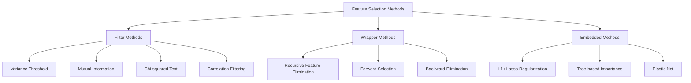
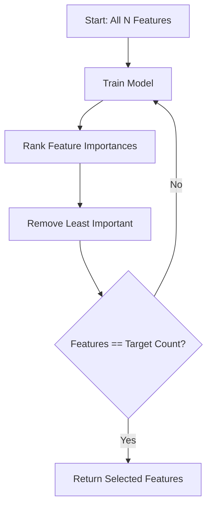
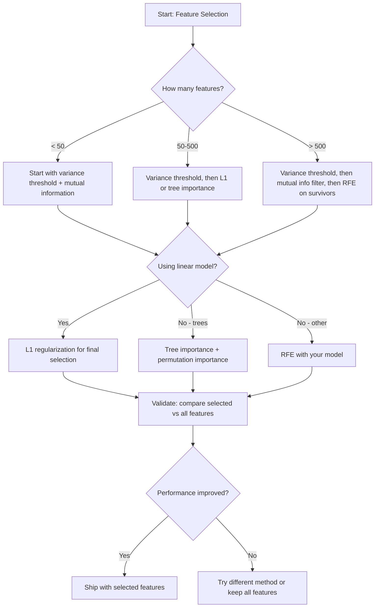

# 特征选择

> 更多特征并非更好。正确的特征才是更好。

**类型：** Build
**语言：** Python
**前置知识：** Phase 2, Lessons 01-09, 08（特征工程）
**时间：** ~75 分钟

## 学习目标

- 从零实现过滤法（方差阈值、互信息、卡方检验）和包装法（RFE、前向选择）
- 解释为什么互信息能够捕捉相关性无法检测的非线性特征-目标关系
- 比较 L1 正则化（嵌入式选择）与 RFE（包装法选择），并评估它们的计算权衡
- 构建一个结合多种方法的特征选择流水线，并在留出数据上展示泛化性能的提升

## 问题所在

你有 500 个特征。模型训练缓慢，持续过拟合，而且没人能解释它学到了什么。你添加更多特征希望提升性能。结果变得更糟。

这就是维数灾难的实际表现。随着特征数量增长，特征空间的体积呈指数级膨胀。数据点变得稀疏。点之间的距离趋于收敛。模型需要指数级更多的数据才能发现真实模式。噪声特征淹没了信号特征。过拟合成为常态。

特征选择是解药。剥离噪声。消除冗余。保留那些真正携带目标信息的特征。结果是：训练更快、泛化更好、模型真正可解释。

目标不是使用所有可用信息，而是使用正确的信息。

## 核心概念

### 特征选择的三大类别

每种特征选择方法都属于以下三类之一：



**过滤法（Filter methods）** 使用统计度量独立地为每个特征打分。它们不使用模型。速度快，但会遗漏特征交互。

**包装法（Wrapper methods）** 训练模型来评估特征子集。它们使用模型性能作为评分标准。效果更好，但代价高昂，因为需要多次重新训练模型。

**嵌入法（Embedded methods）** 在模型训练过程中选择特征。L1 正则化将权重驱向零。决策树在最有用的特征上进行分裂。选择发生在拟合过程中，而非作为独立步骤。

### 方差阈值

最简单的过滤法。如果一个特征在样本间几乎没有变化，它几乎不携带任何信息。

考虑一个特征，在 1000 个样本中有 999 个为 0.0。它的方差接近零。任何模型都无法用它来区分不同类别。移除它。

```
variance(x) = mean((x - mean(x))^2)
```

设定一个阈值（例如 0.01）。丢弃方差低于该阈值的所有特征。这可以在完全不考虑目标变量的情况下去除恒定或近恒定特征。

适用场景：作为其他方法之前的预处理步骤。它以近乎零的代价捕获明显无用的特征。

局限性：一个特征可以有高方差却仍是纯噪声。方差阈值是必要但不充分的。

### 互信息

互信息衡量知道特征 X 的值能减少多少关于目标 Y 的不确定性。

```
I(X; Y) = sum_x sum_y p(x, y) * log(p(x, y) / (p(x) * p(y)))
```

如果 X 和 Y 独立，p(x, y) = p(x) * p(y)，因此对数项为零，I(X; Y) = 0。X 关于 Y 的信息越多，互信息越高。

相对于相关性的关键优势：互信息能捕捉非线性关系。一个特征可能与目标零相关，但具有高互信息，因为关系是二次或周期性的。

对于连续特征，先离散化为分箱（基于直方图的估计）。分箱数量会影响估计——分箱太少会丢失信息，分箱太多会引入噪声。常见选择：sqrt(n) 个分箱或 Sturges 规则 (1 + log2(n))。


### 递归特征消除（RFE）

RFE 是一种包装法。它利用模型自身的特征重要性进行迭代剪枝：

1. 用所有特征训练模型
2. 按重要性对特征排序（线性模型用系数，树模型用不纯度减少）
3. 移除最不重要的特征
4. 重复直到剩余目标数量的特征



RFE 考虑特征交互，因为模型同时看到所有剩余特征。移除一个特征会改变其他特征的重要性。这使它比过滤法更彻底。

代价：需要训练 N - target 次模型。500 个特征目标保留 10 个，就是 490 次训练。对于昂贵模型，这很慢。可以通过每步移除多个特征来加速（例如每轮移除底部 10%）。

### L1（Lasso）正则化

L1 正则化将权重的绝对值加入损失函数：

```
loss = prediction_error + alpha * sum(|w_i|)
```

alpha 参数控制特征剪枝的激进程度。alpha 越高，越多权重精确变为零。

为什么精确为零？L1 惩罚在权重空间中形成菱形约束区域。最优解倾向于落在菱形的角上，即一个或多个权重为零。L2 正则化（岭回归）形成圆形约束，权重缩小但很少精确为零。

这是嵌入式特征选择：模型在训练过程中学习忽略哪些特征。权重为零的特征实际上被移除了。

优势：单次训练运行，处理相关特征（选择一个，其他的置零），内置于大多数线性模型实现中。

局限性：仅适用于线性模型。无法捕捉非线性特征重要性。

### 基于树的特征重要性

决策树及其集成（随机森林、梯度提升）天然地对特征进行排序。每次分裂减少不纯度（分类用 Gini 或熵，回归用方差）。产生更大不纯度减少的特征更重要。

对于包含 T 棵树的随机森林：

```
importance(feature_j) = (1/T) * sum over all trees of
    sum over all nodes splitting on feature_j of
        (n_samples * impurity_decrease)
```

这给出每个特征的归一化重要性分数。它自动处理非线性关系和特征交互。

注意：基于树的重要性偏向具有大量唯一值的特征（高基数）。随机 ID 列会显得重要，因为它能完美分裂每个样本。使用置换重要性进行校验。

### 置换重要性

一种与模型无关的方法：

1. 训练模型并记录验证数据上的基线性能
2. 对于每个特征：随机打乱其值，测量性能下降幅度
3. 下降越大，特征越重要

如果打乱某个特征不影响性能，模型不依赖它。如果性能崩溃，该特征至关重要。

置换重要性避免了基于树重要性的基数偏差。但它很慢：每个特征一次完整评估，重复多次以保证稳定性。

### 对比表

| 方法 | 类型 | 速度 | 非线性 | 特征交互 |
|--------|------|-------|-----------|---------------------|
| 方差阈值 | 过滤法 | 极快 | 否 | 否 |
| 互信息 | 过滤法 | 快 | 是 | 否 |
| 相关性过滤 | 过滤法 | 快 | 否 | 否 |
| RFE | 包装法 | 慢 | 取决于模型 | 是 |
| L1 / Lasso | 嵌入法 | 快 | 否（线性） | 否 |
| 树重要性 | 嵌入法 | 中等 | 是 | 是 |
| 置换重要性 | 模型无关 | 慢 | 是 | 是 |

### 决策流程图



## 动手实现

### 步骤 1：生成具有已知特征结构的合成数据

```python
import numpy as np


def make_feature_selection_data(n_samples=500, seed=42):
    rng = np.random.RandomState(seed)

    x1 = rng.randn(n_samples)
    x2 = rng.randn(n_samples)
    x3 = rng.randn(n_samples)
    x4 = x1 + 0.1 * rng.randn(n_samples)
    x5 = x2 + 0.1 * rng.randn(n_samples)

    informative = np.column_stack([x1, x2, x3, x4, x5])

    correlated = np.column_stack([
        x1 * 0.9 + 0.1 * rng.randn(n_samples),
        x2 * 0.8 + 0.2 * rng.randn(n_samples),
        x3 * 0.7 + 0.3 * rng.randn(n_samples),
        x1 * 0.5 + x2 * 0.5 + 0.1 * rng.randn(n_samples),
        x2 * 0.6 + x3 * 0.4 + 0.1 * rng.randn(n_samples),
    ])

    noise = rng.randn(n_samples, 10) * 0.5

    X = np.hstack([informative, correlated, noise])
    y = (2 * x1 - 1.5 * x2 + x3 + 0.5 * rng.randn(n_samples) > 0).astype(int)

    feature_names = (
        [f"info_{i}" for i in range(5)]
        + [f"corr_{i}" for i in range(5)]
        + [f"noise_{i}" for i in range(10)]
    )

    return X, y, feature_names
```

我们知道真实结构：特征 0-4 是信息性的（其中 3 和 4 是 0 和 1 的相关副本），特征 5-9 与信息性特征相关，特征 10-19 是纯噪声。好的选择方法应该将 0-4 排在最高，10-19 排在最低。

### 步骤 2：方差阈值

```python
def variance_threshold(X, threshold=0.01):
    variances = np.var(X, axis=0)
    mask = variances > threshold
    return mask, variances
```

### 步骤 3：互信息（离散）

```python
def discretize(x, n_bins=10):
    min_val, max_val = x.min(), x.max()
    if max_val == min_val:
        return np.zeros_like(x, dtype=int)
    bin_edges = np.linspace(min_val, max_val, n_bins + 1)
    binned = np.digitize(x, bin_edges[1:-1])
    return binned


def mutual_information(X, y, n_bins=10):
    n_samples, n_features = X.shape
    mi_scores = np.zeros(n_features)

    y_vals, y_counts = np.unique(y, return_counts=True)
    p_y = y_counts / n_samples

    for f in range(n_features):
        x_binned = discretize(X[:, f], n_bins)
        x_vals, x_counts = np.unique(x_binned, return_counts=True)
        p_x = dict(zip(x_vals, x_counts / n_samples))

        mi = 0.0
        for xv in x_vals:
            for yi, yv in enumerate(y_vals):
                joint_mask = (x_binned == xv) & (y == yv)
                p_xy = np.sum(joint_mask) / n_samples
                if p_xy > 0:
                    mi += p_xy * np.log(p_xy / (p_x[xv] * p_y[yi]))
        mi_scores[f] = mi

    return mi_scores
```

### 步骤 4：递归特征消除

```python
def simple_logistic_importance(X, y, lr=0.1, epochs=100):
    n_samples, n_features = X.shape
    w = np.zeros(n_features)
    b = 0.0

    for _ in range(epochs):
        z = X @ w + b
        pred = 1.0 / (1.0 + np.exp(-np.clip(z, -500, 500)))
        error = pred - y
        w -= lr * (X.T @ error) / n_samples
        b -= lr * np.mean(error)

    return w, b


def rfe(X, y, n_features_to_select=5, lr=0.1, epochs=100):
    n_total = X.shape[1]
    remaining = list(range(n_total))
    rankings = np.ones(n_total, dtype=int)
    rank = n_total

    while len(remaining) > n_features_to_select:
        X_subset = X[:, remaining]
        w, _ = simple_logistic_importance(X_subset, y, lr, epochs)
        importances = np.abs(w)

        least_idx = np.argmin(importances)
        original_idx = remaining[least_idx]
        rankings[original_idx] = rank
        rank -= 1
        remaining.pop(least_idx)

    for idx in remaining:
        rankings[idx] = 1

    selected_mask = rankings == 1
    return selected_mask, rankings
```

### 步骤 5：L1 特征选择

```python
def soft_threshold(w, alpha):
    return np.sign(w) * np.maximum(np.abs(w) - alpha, 0)


def l1_feature_selection(X, y, alpha=0.1, lr=0.01, epochs=500):
    n_samples, n_features = X.shape
    w = np.zeros(n_features)
    b = 0.0

    for _ in range(epochs):
        z = X @ w + b
        pred = 1.0 / (1.0 + np.exp(-np.clip(z, -500, 500)))
        error = pred - y

        gradient_w = (X.T @ error) / n_samples
        gradient_b = np.mean(error)

        w -= lr * gradient_w
        w = soft_threshold(w, lr * alpha)
        b -= lr * gradient_b

    selected_mask = np.abs(w) > 1e-6
    return selected_mask, w
```

### 步骤 6：基于树的重要性（简单决策树）

```python
def gini_impurity(y):
    if len(y) == 0:
        return 0.0
    classes, counts = np.unique(y, return_counts=True)
    probs = counts / len(y)
    return 1.0 - np.sum(probs ** 2)


def best_split(X, y, feature_idx):
    values = np.unique(X[:, feature_idx])
    if len(values) <= 1:
        return None, -1.0

    best_threshold = None
    best_gain = -1.0
    parent_gini = gini_impurity(y)
    n = len(y)

    for i in range(len(values) - 1):
        threshold = (values[i] + values[i + 1]) / 2.0
        left_mask = X[:, feature_idx] <= threshold
        right_mask = ~left_mask

        n_left = np.sum(left_mask)
        n_right = np.sum(right_mask)

        if n_left == 0 or n_right == 0:
            continue

        gain = parent_gini - (n_left / n) * gini_impurity(y[left_mask]) - (n_right / n) * gini_impurity(y[right_mask])

        if gain > best_gain:
            best_gain = gain
            best_threshold = threshold

    return best_threshold, best_gain


def tree_importance(X, y, n_trees=50, max_depth=5, seed=42):
    rng = np.random.RandomState(seed)
    n_samples, n_features = X.shape
    importances = np.zeros(n_features)

    for _ in range(n_trees):
        sample_idx = rng.choice(n_samples, size=n_samples, replace=True)
        feature_subset = rng.choice(n_features, size=max(1, int(np.sqrt(n_features))), replace=False)

        X_boot = X[sample_idx]
        y_boot = y[sample_idx]

        tree_imp = _build_tree_importance(X_boot, y_boot, feature_subset, max_depth)
        importances += tree_imp

    total = importances.sum()
    if total > 0:
        importances /= total

    return importances


def _build_tree_importance(X, y, feature_subset, max_depth, depth=0):
    n_features = X.shape[1]
    importances = np.zeros(n_features)

    if depth >= max_depth or len(np.unique(y)) <= 1 or len(y) < 4:
        return importances

    best_feature = None
    best_threshold = None
    best_gain = -1.0

    for f in feature_subset:
        threshold, gain = best_split(X, y, f)
        if gain > best_gain:
            best_gain = gain
            best_feature = f
            best_threshold = threshold

    if best_feature is None or best_gain <= 0:
        return importances

    importances[best_feature] += best_gain * len(y)

    left_mask = X[:, best_feature] <= best_threshold
    right_mask = ~left_mask

    importances += _build_tree_importance(X[left_mask], y[left_mask], feature_subset, max_depth, depth + 1)
    importances += _build_tree_importance(X[right_mask], y[right_mask], feature_subset, max_depth, depth + 1)

    return importances
```

### 步骤 7：运行所有方法并比较

代码文件在相同的合成数据集上运行所有五种方法，并打印对比表，展示每种方法选择了哪些特征。

## 实际应用

使用 scikit-learn，特征选择内置于流水线中：

```python
from sklearn.feature_selection import (
    VarianceThreshold,
    mutual_info_classif,
    RFE,
    SelectFromModel,
)
from sklearn.linear_model import Lasso, LogisticRegression
from sklearn.ensemble import RandomForestClassifier

vt = VarianceThreshold(threshold=0.01)
X_filtered = vt.fit_transform(X)

mi_scores = mutual_info_classif(X, y)
top_k = np.argsort(mi_scores)[-10:]

rfe_selector = RFE(LogisticRegression(), n_features_to_select=10)
rfe_selector.fit(X, y)
X_rfe = rfe_selector.transform(X)

lasso_selector = SelectFromModel(Lasso(alpha=0.01))
lasso_selector.fit(X, y)
X_lasso = lasso_selector.transform(X)

rf = RandomForestClassifier(n_estimators=100)
rf.fit(X, y)
importances = rf.feature_importances_
```

从零实现展示了每种方法内部的确切机制。方差阈值只是计算 `var(X, axis=0)` 并应用掩码。互信息是在列联表中统计联合和边际频率。RFE 是训练、排序、剪枝的循环。L1 是带有软阈值步骤的梯度下降。树重要性是跨分裂累积不纯度减少。没有魔法——只是统计和循环。

sklearn 版本增加了鲁棒性（例如 mutual_info_classif 使用 k-NN 密度估计而非分箱）、速度（C 实现）和流水线集成。

## 产出交付

本课程产出：
- `outputs/skill-feature-selector.md` —— 选择正确特征选择方法的快速参考决策树

## 练习题

1. **前向选择**：实现 RFE 的相反过程。从零个特征开始。每步添加能最大程度提升模型性能的特征。当添加特征不再有帮助时停止。将选择的特征与 RFE 结果比较。哪个更快？哪个效果更好？

2. **稳定性选择**：运行 L1 特征选择 50 次，每次在随机 80% 数据子样本上，使用略有不同的 alpha 值。统计每个特征被选中的频率。在 >80% 运行中被选中的特征为"稳定"特征。将稳定特征与单次 L1 选择比较。哪个更可靠？

3. **多重共线性检测**：计算所有特征的相关矩阵。实现一个函数，给定相关性阈值（例如 0.9），从每个高度相关的特征对中移除一个特征（保留与目标互信息较高的那个）。在合成数据集上测试，验证它移除了冗余的相关特征。

4. **特征选择流水线**：将方差阈值、互信息过滤和 RFE 链接成单个流水线。首先移除近零方差特征，然后保留互信息最高的 50%，最后对幸存者运行 RFE。将此流水线与单独在所有特征上运行 RFE 比较。流水线更快吗？准确性相当吗？

5. **从零实现置换重要性**：实现置换重要性。对每个特征，打乱其值 10 次，测量 F1 分数的平均下降。与基于树的重要性比较排序。找出它们不一致的情况并解释原因（提示：相关特征）。

## 关键术语

| 术语 | 人们怎么说 | 实际含义 |
|------|----------------|----------------------|
| 过滤法 | "独立地为特征打分" | 一种特征选择方法，使用统计度量对特征排序，不训练模型，独立评估每个特征 |
| 包装法 | "用模型来挑选特征" | 一种特征选择方法，通过训练模型并使用其性能作为选择标准来评估特征子集 |
| 嵌入法 | "模型在训练时选择特征" | 作为模型拟合一部分发生的特征选择，例如 L1 正则化将权重驱向零 |
| 互信息 | "一个变量告诉你另一个变量的多少信息" | 衡量给定 X 的知识后 Y 的不确定性减少量，捕捉线性和非线性依赖关系 |
| 递归特征消除 | "训练、排序、剪枝、重复" | 一种迭代包装法，训练模型，移除最不重要的特征，重复直到达到目标数量 |
| L1 / Lasso 正则化 | "消灭特征的惩罚" | 将权重绝对值之和加入损失函数，使不重要特征的权重精确变为零 |
| 方差阈值 | "移除恒定特征" | 丢弃样本间方差低于指定阈值的特征，过滤掉不携带信息的特征 |
| 特征重要性 | "哪些特征最重要" | 指示每个特征对模型预测贡献程度的分数，从分裂增益（树）或系数大小（线性）计算 |
| 置换重要性 | "打乱并测量损失" | 通过随机打乱每个特征的值并测量模型性能的下降来评估特征重要性 |
| 维数灾难 | "特征太多，数据太少" | 添加特征使特征空间体积指数增长，导致数据稀疏和距离无意义的现象 |

## 延伸阅读

- [An Introduction to Variable and Feature Selection (Guyon & Elisseeff, 2003)](https://jmlr.org/papers/v3/guyon03a.html) —— 特征选择方法的基础性综述，至今仍被广泛引用
- [scikit-learn Feature Selection Guide](https://scikit-learn.org/stable/modules/feature_selection.html) —— 过滤法、包装法和嵌入法的实用参考，附代码示例
- [Stability Selection (Meinshausen & Buhlmann, 2010)](https://arxiv.org/abs/0809.2932) —— 将子采样与特征选择结合，获得稳健、可复现的结果
- [Beware Default Random Forest Importances (Strobl et al., 2007)](https://bmcbioinformatics.biomedcentral.com/articles/10.1186/1471-2105-8-25) —— 展示基于树重要性的基数偏差，并提出条件重要性作为替代方案
