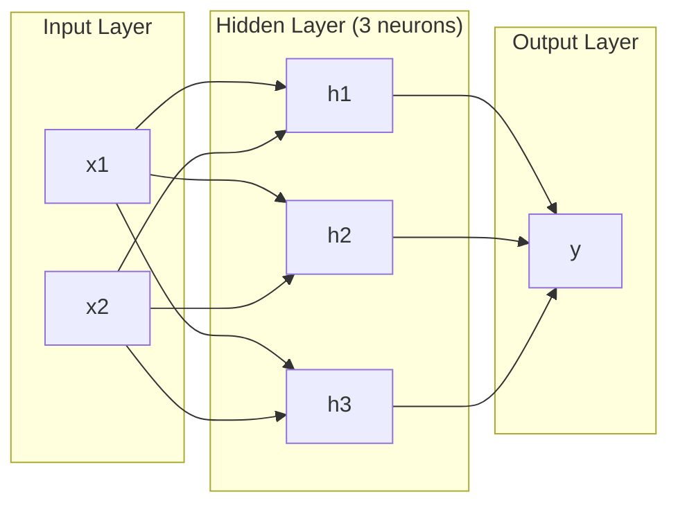
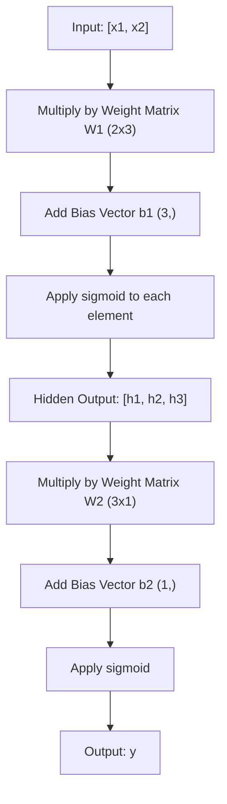
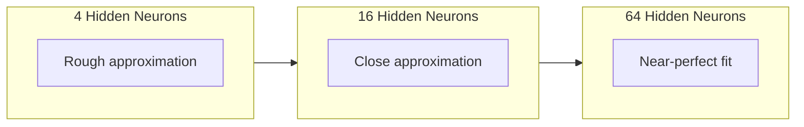

# 多层网络与前向传播

> 一个神经元画一条线。把它们堆叠起来，你就能画出任何东西。

**类型：** 构建
**语言：** Python
**前置知识：** 阶段 01（数学基础），课程 03.01（感知机）
**时间：** ~90 分钟

## 学习目标

- 从零构建多层网络，使用 Layer 和 Network 类完成完整的前向传播
- 追踪网络每一层的矩阵维度并识别形状不匹配
- 解释堆叠非线性激活函数如何使网络学习弯曲的决策边界
- 使用 2-2-1 架构和手动调优的 sigmoid 权重解决 XOR 问题

## 问题

单个神经元是一条画线器。仅此而已。一条穿过数据的直线。AI 中的每个实际问题——图像识别、语言理解、下围棋——都需要曲线。将神经元堆叠成层就是获得曲线的方法。

1969 年，Minsky 和 Papert 证明了这一限制是致命的：单层网络无法学习 XOR。不是"学习困难"——而是数学上不可能。XOR 真值表将 [0,1] 和 [1,0] 放在一侧，[0,0] 和 [1,1] 放在另一侧。没有单条直线能将它们分开。

这让神经网络的资金断流了十多年。解决方案事后看来显而易见：别再用一层了。把神经元堆叠成层。让第一层将输入空间切割成新特征，让第二层将这些特征组合成决策，这是单条直线无法做到的。

这个堆叠就是多层网络。它是当今生产中每个深度学习模型的基础。前向传播——数据从输入流经隐藏层到达输出——是你在其他任何东西能工作之前需要构建的第一件事。

## 概念

### 层：输入层、隐藏层、输出层

多层网络有三种类型的层：

**输入层**——不算真正的层。它保存你的原始数据。两个特征意味着两个输入节点。这里没有计算发生。

**隐藏层**——工作发生的地方。每个神经元接收上一层的所有输出，应用权重和偏置，然后将结果通过激活函数。"隐藏"是因为你在训练数据中永远不能直接看到这些值。

**输出层**——最终答案。对于二分类，一个带 sigmoid 的神经元。对于多分类，每个类别一个神经元。



这是一个 2-3-1 网络。两个输入，三个隐藏神经元，一个输出。每个连接携带一个权重。每个神经元（除输入外）携带一个偏置。

每一层产生一个称为隐藏状态的数字向量。对于文本，隐藏状态增加维度——将一个词编码为 768 个数字以捕捉语义含义。对于图像，它们降低维度——将数百万像素压缩为可管理的表示。隐藏状态是学习发生的地方。

### 神经元与激活函数

每个神经元做三件事：

1. 将每个输入乘以其对应的权重
2. 将所有乘积相加并加上偏置
3. 将和通过激活函数

目前，激活函数是 sigmoid：

```
sigmoid(z) = 1 / (1 + e^(-z))
```

Sigmoid 将任何数字压缩到 (0, 1) 范围内。大的正输入推向 1。大的负输入推向 0。零映射到 0.5。这条平滑曲线使学习成为可能——与感知机的硬阶跃不同，sigmoid 处处都有梯度。

### 前向传播：数据如何流动

前向传播将输入数据逐层推过网络，直到到达输出。前向传播期间没有学习发生。它是纯粹的计算：乘、加、激活、重复。



在每一层，三个操作依次发生：

```
z = W * input + b       (linear transformation)
a = sigmoid(z)           (activation)
```

一层的输出成为下一层的输入。这就是整个前向传播。

### 矩阵维度

追踪维度是深度学习中最关键的调试技能。以下是 2-3-1 网络：

| 步骤 | 操作 | 维度 | 结果形状 |
|------|------|------|---------|
| 输入 | x | -- | (2,) |
| 隐藏线性 | W1 * x + b1 | W1: (3, 2), b1: (3,) | (3,) |
| 隐藏激活 | sigmoid(z1) | -- | (3,) |
| 输出线性 | W2 * h + b2 | W2: (1, 3), b2: (1,) | (1,) |
| 输出激活 | sigmoid(z2) | -- | (1,) |

规则：第 k 层的权重矩阵 W 的形状为 (layer_k_神经元数, layer_k-1_神经元数)。行匹配当前层。列匹配前一层。如果形状对不齐，你就有 bug。

### 通用近似定理

1989 年，George Cybenko 证明了一个 remarkable 的结论：具有单个隐藏层和足够多神经元的神经网络可以以任意期望的精度近似任何连续函数。

这并不意味着一个隐藏层总是最好的。它意味着该架构在理论上是可行的。在实践中，更深的网络（更多层，每层更少神经元）比浅而宽的网络用更少的总参数学习相同的函数。这就是深度学习有效的原因。

直觉：隐藏层中的每个神经元学习一个"凸起"或特征。足够多的凸起放在正确的位置可以近似任何平滑曲线。神经元越多，凸起越多，近似越好。



### 可组合性

神经网络是可组合的。你可以堆叠它们、链式连接它们、并行运行它们。Whisper 模型使用编码器网络处理音频，使用单独的解码器网络生成文本。现代 LLM 仅使用解码器。BERT 仅使用编码器。T5 使用编码器-解码器。架构选择定义了模型能做什么。

## 构建它

纯 Python。没有 numpy。每个矩阵操作都从零手写。

### 步骤 1：Sigmoid 激活

```python
import math

def sigmoid(x):
    x = max(-500.0, min(500.0, x))
    return 1.0 / (1.0 + math.exp(-x))
```

钳制到 [-500, 500] 防止溢出。`math.exp(500)` 很大但有限。`math.exp(1000)` 是无穷大。

### 步骤 2：Layer 类

深度学习中最重要的是矩阵乘法。每一层、每个注意力头、每次前向传播——归根结底都是矩阵乘法。线性层接收输入向量，将其乘以权重矩阵，并加上偏置向量：y = Wx + b。这个单一等式占神经网络 90% 的计算量。

一个层持有权重矩阵和偏置向量。它的 forward 方法接收输入向量并返回激活后的输出。

```python
class Layer:
    def __init__(self, n_inputs, n_neurons, weights=None, biases=None):
        if weights is not None:
            self.weights = weights
        else:
            import random
            self.weights = [
                [random.uniform(-1, 1) for _ in range(n_inputs)]
                for _ in range(n_neurons)
            ]
        if biases is not None:
            self.biases = biases
        else:
            self.biases = [0.0] * n_neurons

    def forward(self, inputs):
        self.last_input = inputs
        self.last_output = []
        for neuron_idx in range(len(self.weights)):
            z = sum(
                w * x for w, x in zip(self.weights[neuron_idx], inputs)
            )
            z += self.biases[neuron_idx]
            self.last_output.append(sigmoid(z))
        return self.last_output
```

权重矩阵的形状为 (n_neurons, n_inputs)。每一行是一个神经元在所有输入上的权重。forward 方法遍历神经元，计算加权和加偏置，应用 sigmoid，并收集结果。

### 步骤 3：Network 类

网络是一个层的列表。前向传播将它们链式连接：第 k 层的输出送入第 k+1 层。

```python
class Network:
    def __init__(self, layers):
        self.layers = layers

    def forward(self, inputs):
        current = inputs
        for layer in self.layers:
            current = layer.forward(current)
        return current
```

这就是整个前向传播。四行逻辑。数据进入，流经每一层，从另一端出来。

### 步骤 4：用人工调优权重解决 XOR

在课程 01 中，我们通过组合 OR、NAND 和 AND 感知机解决了 XOR。现在用我们的 Layer 和 Network 类做同样的事。2-2-1 架构：两个输入，两个隐藏神经元，一个输出。

```python
hidden = Layer(
    n_inputs=2,
    n_neurons=2,
    weights=[[20.0, 20.0], [-20.0, -20.0]],
    biases=[-10.0, 30.0],
)

output = Layer(
    n_inputs=2,
    n_neurons=1,
    weights=[[20.0, 20.0]],
    biases=[-30.0],
)

xor_net = Network([hidden, output])

xor_data = [
    ([0, 0], 0),
    ([0, 1], 1),
    ([1, 0], 1),
    ([1, 1], 0),
]

for inputs, expected in xor_data:
    result = xor_net.forward(inputs)
    predicted = 1 if result[0] >= 0.5 else 0
    print(f"  {inputs} -> {result[0]:.6f} (rounded: {predicted}, expected: {expected})")
```

大权重 (20, -20) 使 sigmoid 表现得像阶跃函数。第一个隐藏神经元近似 OR。第二个近似 NAND。输出神经元将它们组合成 AND，这就是 XOR。

### 步骤 5：圆形分类

一个更难的问题：将二维点分类为在原点半径 0.5 的圆内或圆外。这需要一个弯曲的决策边界——单个感知机不可能做到。

```python
import random
import math

random.seed(42)

data = []
for _ in range(200):
    x = random.uniform(-1, 1)
    y = random.uniform(-1, 1)
    label = 1 if (x * x + y * y) < 0.25 else 0
    data.append(([x, y], label))

circle_net = Network([
    Layer(n_inputs=2, n_neurons=8),
    Layer(n_inputs=8, n_neurons=1),
])
```

使用随机权重，网络分类效果不会好。但前向传播仍然运行。这就是关键——前向传播只是计算。学习正确的权重是反向传播，将在课程 03 中讲解。

```python
correct = 0
for inputs, expected in data:
    result = circle_net.forward(inputs)
    predicted = 1 if result[0] >= 0.5 else 0
    if predicted == expected:
        correct += 1

print(f"Accuracy with random weights: {correct}/{len(data)} ({100*correct/len(data):.1f}%)")
```

随机权重给出糟糕的准确率——往往比猜测多数类更差。训练后（课程 03），这个具有 8 个隐藏神经元的相同架构将画出一条弯曲的边界，将内外分开。

## 使用它

PyTorch 用四行代码完成上面的所有内容：

```python
import torch
import torch.nn as nn

model = nn.Sequential(
    nn.Linear(2, 8),
    nn.Sigmoid(),
    nn.Linear(8, 1),
    nn.Sigmoid(),
)

x = torch.tensor([[0.0, 0.0], [0.0, 1.0], [1.0, 0.0], [1.0, 1.0]])
output = model(x)
print(output)
```

`nn.Linear(2, 8)` 是你的 Layer 类：权重矩阵形状为 (8, 2)，偏置向量形状为 (8,)。`nn.Sigmoid()` 是逐元素应用的 sigmoid 函数。`nn.Sequential` 是你的 Network 类：按顺序链式连接层。

区别在于速度和规模。PyTorch 在 GPU 上运行，处理数百万样本的批次，并自动计算反向传播的梯度。但前向传播逻辑与你刚才从零构建的完全相同。

## 交付

本课程产生一个可复用的提示，用于设计网络架构：

- `outputs/prompt-network-architect.md`

当你需要决定给定问题使用多少层、每层多少神经元、以及使用哪些激活函数时，使用它。

## 练习

1. 构建一个 2-4-2-1 网络（两个隐藏层）并在 XOR 数据上运行前向传播，使用随机权重。打印中间隐藏层输出，观察表示如何在每一层变换。

2. 将圆形分类器中的隐藏层大小从 8 改为 2，再改为 32。每次使用随机权重运行前向传播。隐藏神经元数量会改变输出范围或分布吗？为什么？

3. 在 Network 类上实现一个 `count_parameters` 方法，返回可训练权重和偏置的总数。在 784-256-128-10 网络（经典 MNIST 架构）上测试它。它有多少参数？

4. 为 3-4-4-2 网络构建前向传播。输入 RGB 颜色值（归一化到 0-1）并观察两个输出。这是一个简单颜色分类器（两类）的架构。

5. 将 sigmoid 替换为" leaky step" 函数：如果 z < 0 返回 0.01 * z，否则返回 1.0。在 XOR 上运行前向传播，使用步骤 4 中相同的调优权重。它还能工作吗？为什么平滑的 sigmoid 比硬截断更受青睐？

## 关键术语

| 术语 | 人们怎么说 | 实际含义 |
|------|-----------|---------|
| 前向传播 | "运行模型" | 将输入推过每一层——乘以权重、加偏置、激活——以产生输出 |
| 隐藏层 | "中间部分" | 输入和输出之间的任何层，其值在数据中不能直接观察到 |
| 多层网络 | "深度神经网络" | 顺序堆叠的神经元层，每一层的输出送入下一层的输入 |
| 激活函数 | "非线性" | 在线性变换后应用的函数，为决策边界引入曲线 |
| Sigmoid | "S 曲线" | sigma(z) = 1/(1+e^(-z))，将任何实数压缩到 (0,1)，处处平滑可导 |
| 权重矩阵 | "参数" | 形状为 (当前层神经元数, 前一层神经元数) 的矩阵 W，包含可学习的连接强度 |
| 偏置向量 | "偏移量" | 矩阵乘法后加的向量，让神经元即使所有输入为零时也能激活 |
| 通用近似 | "神经网络能学习任何东西" | 单个隐藏层有足够多神经元可以近似任何连续函数——但"足够多"可能意味着数十亿 |
| 线性变换 | "矩阵乘法步骤" | z = W * x + b，激活前的计算，将输入映射到新空间 |
| 决策边界 | "分类器切换的地方" | 输入空间中网络输出跨越分类阈值的表面 |

## 延伸阅读

- Michael Nielsen, "Neural Networks and Deep Learning", 第 1-2 章 (http://neuralnetworksanddeeplearning.com/) —— 前向传播和网络结构最清晰的免费解释，带有交互式可视化
- Cybenko, "Approximation by Superpositions of a Sigmoidal Function" (1989) —— 通用近似定理的原始论文，出奇地易读
- 3Blue1Brown, "But what is a neural network?" (https://www.youtube.com/watch?v=aircAruvnKk) —— 20 分钟的层、权重和前向传播视觉讲解，建立正确的心智模型
- Goodfellow, Bengio, Courville, "Deep Learning", 第 6 章 (https://www.deeplearningbook.org/) —— 多层网络的标准参考，免费在线阅读
