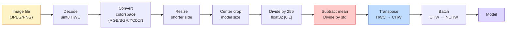
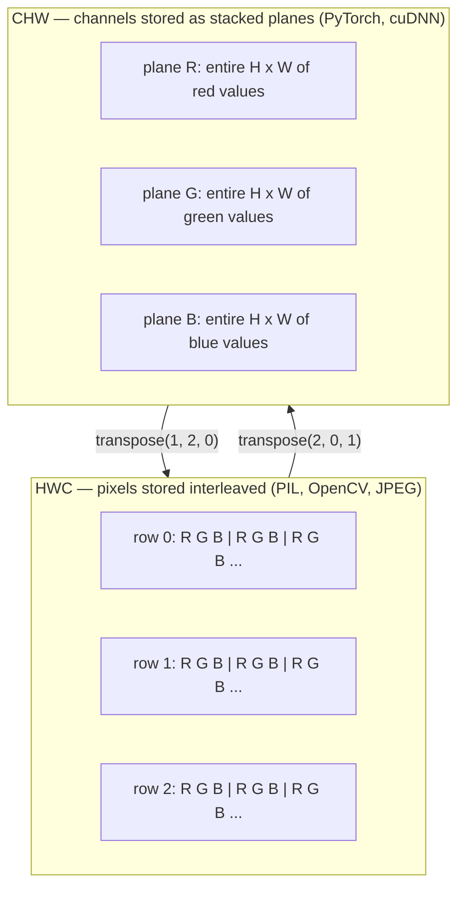

# 图像基础 — 像素、通道、色彩空间

> 图像是光样本的张量。你将要使用的每一个视觉模型都始于这一个事实。

**类型：** 构建
**语言：** Python
**前置知识：** 阶段 1 第 12 课（张量操作），阶段 3 第 11 课（PyTorch 入门）
**时间：** ~45 分钟

## 学习目标

- 解释连续场景如何被离散化为像素，以及采样/量化决策为何为每个下游模型设定了上限
- 将图像作为 NumPy 数组读取、切片和检查，并在 HWC 与 CHW 布局之间流畅切换
- 在 RGB、灰度、HSV 和 YCbCr 之间转换，并说明每种色彩空间存在的理由
- 按照 torchvision 的期望精确应用像素级预处理（归一化、标准化、调整大小、通道优先）

## 问题所在

你将要阅读的每一篇论文、将要下载的每一个预训练权重、将要调用的每一个视觉 API 都假设输入采用特定的编码。在模型期望 `float32` 的地方传入 `uint8` 图像，它仍然会运行——然后悄无声息地产生垃圾结果。将 BGR 喂给在 RGB 上训练的网络，准确率会暴跌十个点。在模型期望通道优先时给它通道居后的输入，第一个卷积层会把高度当作特征通道。这些都不会抛出错误。它只是毁掉你的指标，然后你花一周时间寻找一个存在于文件加载方式中的 bug。

卷积本身并不复杂，一旦你知道它在什么上面滑动。困难的部分在于，"图像"对相机、JPEG 解码器、PIL、OpenCV、torchvision 和 CUDA 内核来说意味着不同的东西。每个技术栈都有自己的轴顺序、字节范围和通道约定。一个无法理清这些的视觉工程师会交付损坏的流水线。

本课修复基础，以便本阶段的其余部分可以在此基础上构建。结束时你将知道像素是什么、为什么每个像素有三个数字而不是一个、"用 ImageNet 统计量标准化"实际上做了什么，以及如何在本阶段其他课程都会假设的两三种布局之间移动。

## 核心概念

### 完整预处理流水线一览

每个生产视觉系统都是相同序列的可逆变换。错一步，模型看到的输入就与训练时的不同。



两个红色和蓝色方框是 80% 静默故障的藏身之处：遗漏标准化和错误布局。

### 像素是样本，不是方块

相机传感器计算落在微小探测器网格上的光子数量。每个探测器在极短时间内积分光线，并发出与击中它的光子数量成正比的电压。然后传感器将该电压离散化为整数。一个探测器变成一个像素。

```
Continuous scene                 Sensor grid                     Digital image
(infinite detail)                (H x W detectors)               (H x W integers)

    ~~~~~                        +--+--+--+--+--+                 210 198 180 155 120
   ~   ~   ~                     |  |  |  |  |  |                 205 195 178 152 118
  ~ light ~      ---->           +--+--+--+--+--+     ---->       200 190 175 150 115
   ~~~~~                         |  |  |  |  |  |                 195 185 170 148 112
                                 +--+--+--+--+--+                 188 180 165 145 108
```

这一步发生两个选择，它们为所有下游处理设定了上限：

- **空间采样** 决定场景每度有多少个探测器。太少，边缘变得锯齿状（混叠）。太多，存储和计算爆炸式增长。
- **强度量化** 决定电压被分桶的精细程度。8 位提供 256 个级别，是显示的标准。10、12、16 位提供更平滑的渐变，对医学成像、HDR 和原始传感器流水线很重要。

像素不是有面积的有色方块。它是单一测量值。当你调整大小或旋转时，你是在重采样那个测量网格。

### 为什么有三个通道

一个探测器计算整个可见光谱的光子——这就是灰度。为了获得颜色，传感器用红、绿、蓝滤镜的马赛克覆盖网格。去马赛克后，每个空间位置都有三个整数：红滤镜探测器、绿滤镜和蓝滤镜附近探测器的响应。这三个整数就是像素的 RGB 三元组。

```
One pixel in memory:

    (R, G, B) = (210, 140, 30)   <- reddish-orange

An H x W RGB image:

    shape (H, W, 3)     stored as   H rows of W pixels of 3 values
                                    each in [0, 255] for uint8
```

三不是魔法。深度相机添加 Z 通道。卫星添加红外和紫外波段。医学扫描通常有一个通道（X 射线、CT）或很多（高光谱）。通道数是最后一个轴；卷积层学习跨通道混合。

### 两种布局约定：HWC 和 CHW

同一个张量，两种排序。每个库选择一种。

```
HWC (height, width, channels)           CHW (channels, height, width)

   W ->                                    H ->
  +-----+-----+-----+                     +-----+-----+
H |R G B|R G B|R G B|                   C |R R R R R R|
| +-----+-----+-----+                   | +-----+-----+
v |R G B|R G B|R G B|                   v |G G G G G G|
  +-----+-----+-----+                     +-----+-----+
                                          |B B B B B B|
                                          +-----+-----+

   PIL, OpenCV, matplotlib,              PyTorch, most deep learning
   almost every image file on disk       frameworks, cuDNN kernels
```

CHW 存在是因为卷积核在 H 和 W 上滑动。将通道轴放在前面意味着每个核每通道看到连续的 2D 平面，这可以干净地向量化。磁盘格式保持 HWC，因为这匹配扫描线从传感器输出的方式。

你将输入一千次的一行转换：

```
img_chw = img_hwc.transpose(2, 0, 1)      # NumPy
img_chw = img_hwc.permute(2, 0, 1)        # PyTorch tensor
```

内存布局，可视化：



### 字节范围和 dtype

三种约定占主导：

| 约定 | dtype | 范围 | 常见场景 |
|------|-------|------|----------|
| 原始 | `uint8` | [0, 255] | 磁盘文件、PIL、OpenCV 输出 |
| 归一化 | `float32` | [0.0, 1.0] | 执行 `img.astype('float32') / 255` 后 |
| 标准化 | `float32` | 约 [-2, +2] | 减去均值并除以标准差后 |

卷积网络是在标准化输入上训练的。ImageNet 统计量 `mean=[0.485, 0.456, 0.406]`、`std=[0.229, 0.224, 0.225]` 是完整 ImageNet 训练集上三个通道的算术均值和标准差，在 [0, 1] 归一化像素上计算。将原始 `uint8` 喂给期望标准化浮点数的模型是应用视觉中最常见的单一静默故障。

### 色彩空间及其存在理由

RGB 是采集格式，但它并不总是对模型最有用的表示。

```
 RGB               HSV                       YCbCr / YUV

 R red             H hue (angle 0-360)       Y luminance (brightness)
 G green           S saturation (0-1)        Cb chroma blue-yellow
 B blue            V value/brightness (0-1)  Cr chroma red-green

 Linear to         Separates color from      Separates brightness from
 sensor output     brightness. Useful for    color. JPEG and most video
                   color thresholding, UI    codecs compress the chroma
                   sliders, simple filters   channels harder because the
                                             human eye is less sensitive
                                             to chroma detail than to Y.
```

对于大多数现代 CNN，你输入 RGB。你在以下情况遇到其他空间：

- **HSV** — 经典 CV 代码、基于颜色的分割、白平衡。
- **YCbCr** — 读取 JPEG 内部结构、视频流水线、仅对 Y 操作的超分辨率模型。
- **灰度** — OCR、文档模型、任何颜色是干扰变量而非信号的情况。

从 RGB 转灰度是加权求和，不是平均，因为人眼对绿色比红色或蓝色更敏感：

```
Y = 0.299 R + 0.587 G + 0.114 B       (ITU-R BT.601, the classic weights)
```

### 宽高比、调整大小和插值

每个模型都有固定的输入尺寸（大多数 ImageNet 分类器为 224x224，现代检测器为 384x384 或 512x512）。你的图像很少匹配。三种重要的调整大小选择：

- **调整短边，然后中心裁剪** — 标准 ImageNet 配方。保持宽高比，丢弃边缘像素条。
- **调整大小并填充** — 保持宽高比和每个像素，添加黑边。检测和 OCR 的标准。
- **直接调整到目标** — 拉伸图像。便宜，扭曲几何，对许多分类任务可接受。

当新网格与旧网格不对齐时，插值方法决定中间像素如何计算：

```
Nearest neighbour     fastest, blocky, only choice for masks/labels
Bilinear              fast, smooth, default for most image resizing
Bicubic               slower, sharper on upscaling
Lanczos               slowest, best quality, used for final display
```

经验法则：训练用双线性，你将查看的资源用双三次或 lanczos，任何包含整数类别 ID 的用最近邻。

## 动手构建

### 步骤 1：加载图像并检查其形状

使用 Pillow 加载任意 JPEG 或 PNG，转换为 NumPy，并打印结果。为了确定性的离线示例，合成一个。

```python
import numpy as np
from PIL import Image

def synthetic_rgb(h=128, w=192, seed=0):
    rng = np.random.default_rng(seed)
    yy, xx = np.meshgrid(np.linspace(0, 1, h), np.linspace(0, 1, w), indexing="ij")
    r = (np.sin(xx * 6) * 0.5 + 0.5) * 255
    g = yy * 255
    b = (1 - yy) * xx * 255
    rgb = np.stack([r, g, b], axis=-1) + rng.normal(0, 6, (h, w, 3))
    return np.clip(rgb, 0, 255).astype(np.uint8)

arr = synthetic_rgb()
# Or load from disk:
# arr = np.asarray(Image.open("your_image.jpg").convert("RGB"))

print(f"type:   {type(arr).__name__}")
print(f"dtype:  {arr.dtype}")
print(f"shape:  {arr.shape}     # (H, W, C)")
print(f"min:    {arr.min()}")
print(f"max:    {arr.max()}")
print(f"pixel at (0, 0): {arr[0, 0]}")
```

预期输出：`shape: (H, W, 3)`、`dtype: uint8`、范围 `[0, 255]`。这就是规范的磁盘表示，无论字节来自相机、JPEG 解码器还是合成生成器。

### 步骤 2：分离通道并重新排序布局

分别提取 R、G、B，然后从 HWC 转换为 CHW 以供 PyTorch 使用。

```python
R = arr[:, :, 0]
G = arr[:, :, 1]
B = arr[:, :, 2]
print(f"R shape: {R.shape}, mean: {R.mean():.1f}")
print(f"G shape: {G.shape}, mean: {G.mean():.1f}")
print(f"B shape: {B.shape}, mean: {B.mean():.1f}")

arr_chw = arr.transpose(2, 0, 1)
print(f"\nHWC shape: {arr.shape}")
print(f"CHW shape: {arr_chw.shape}")
```

三个灰度平面，每通道一个。CHW 只是重新排序轴；当内存布局允许时，严格来说不需要数据拷贝。

### 步骤 3：灰度和 HSV 转换

加权求和灰度，然后手动 RGB 转 HSV。

```python
def rgb_to_grayscale(rgb):
    weights = np.array([0.299, 0.587, 0.114], dtype=np.float32)
    return (rgb.astype(np.float32) @ weights).astype(np.uint8)

def rgb_to_hsv(rgb):
    rgb_f = rgb.astype(np.float32) / 255.0
    r, g, b = rgb_f[..., 0], rgb_f[..., 1], rgb_f[..., 2]
    cmax = np.max(rgb_f, axis=-1)
    cmin = np.min(rgb_f, axis=-1)
    delta = cmax - cmin

    h = np.zeros_like(cmax)
    mask = delta > 0
    rmax = mask & (cmax == r)
    gmax = mask & (cmax == g)
    bmax = mask & (cmax == b)
    h[rmax] = ((g[rmax] - b[rmax]) / delta[rmax]) % 6
    h[gmax] = ((b[gmax] - r[gmax]) / delta[gmax]) + 2
    h[bmax] = ((r[bmax] - g[bmax]) / delta[bmax]) + 4
    h = h * 60.0

    s = np.where(cmax > 0, delta / cmax, 0)
    v = cmax
    return np.stack([h, s, v], axis=-1)

gray = rgb_to_grayscale(arr)
hsv = rgb_to_hsv(arr)
print(f"gray shape: {gray.shape}, range: [{gray.min()}, {gray.max()}]")
print(f"hsv   shape: {hsv.shape}")
print(f"hue range: [{hsv[..., 0].min():.1f}, {hsv[..., 0].max():.1f}] degrees")
print(f"sat range: [{hsv[..., 1].min():.2f}, {hsv[..., 1].max():.2f}]")
print(f"val range: [{hsv[..., 2].min():.2f}, {hsv[..., 2].max():.2f}]")
```

色调以度为单位输出，饱和度和明度在 [0, 1] 中。这匹配 OpenCV 的 `hsv_full` 约定。

### 步骤 4：归一化、标准化并还原

从原始字节到预训练 ImageNet 模型期望的确切张量，然后再还原回来。

```python
mean = np.array([0.485, 0.456, 0.406], dtype=np.float32)
std = np.array([0.229, 0.224, 0.225], dtype=np.float32)

def preprocess_imagenet(rgb_uint8):
    x = rgb_uint8.astype(np.float32) / 255.0
    x = (x - mean) / std
    x = x.transpose(2, 0, 1)
    return x

def deprocess_imagenet(chw_float32):
    x = chw_float32.transpose(1, 2, 0)
    x = x * std + mean
    x = np.clip(x * 255.0, 0, 255).astype(np.uint8)
    return x

x = preprocess_imagenet(arr)
print(f"preprocessed shape: {x.shape}     # (C, H, W)")
print(f"preprocessed dtype: {x.dtype}")
print(f"preprocessed mean per channel:  {x.mean(axis=(1, 2)).round(3)}")
print(f"preprocessed std  per channel:  {x.std(axis=(1, 2)).round(3)}")

roundtrip = deprocess_imagenet(x)
max_diff = np.abs(roundtrip.astype(int) - arr.astype(int)).max()
print(f"roundtrip max pixel diff: {max_diff}    # should be 0 or 1")
```

每通道均值应接近零，标准差接近一。预处理/后处理对正是每个 torchvision `transforms.Normalize` 调用在底层所做的。

### 步骤 5：用三种插值方法调整大小

在上采样时比较最近邻、双线性和双三次，使差异可见。

```python
target = (arr.shape[0] * 3, arr.shape[1] * 3)

nearest = np.asarray(Image.fromarray(arr).resize(target[::-1], Image.NEAREST))
bilinear = np.asarray(Image.fromarray(arr).resize(target[::-1], Image.BILINEAR))
bicubic = np.asarray(Image.fromarray(arr).resize(target[::-1], Image.BICUBIC))

def local_roughness(x):
    gy = np.diff(x.astype(float), axis=0)
    gx = np.diff(x.astype(float), axis=1)
    return float(np.abs(gy).mean() + np.abs(gx).mean())

for name, out in [("nearest", nearest), ("bilinear", bilinear), ("bicubic", bicubic)]:
    print(f"{name:>8}  shape={out.shape}  roughness={local_roughness(out):6.2f}")
```

最近邻在粗糙度上得分最高，因为它保持硬边缘。双线性最平滑。双三次居中，保留感知锐度而没有阶梯伪影。

## 应用实践

`torchvision.transforms` 将上述所有内容打包成单一的可组合流水线。下面的代码精确复现 `preprocess_imagenet` 所做的，外加调整大小和裁剪。

```python
import torch
from torchvision import transforms
from PIL import Image

img = Image.fromarray(synthetic_rgb(256, 256))

pipeline = transforms.Compose([
    transforms.Resize(256),
    transforms.CenterCrop(224),
    transforms.ToTensor(),
    transforms.Normalize(mean=[0.485, 0.456, 0.406], std=[0.229, 0.224, 0.225]),
])

x = pipeline(img)
print(f"tensor type:  {type(x).__name__}")
print(f"tensor dtype: {x.dtype}")
print(f"tensor shape: {tuple(x.shape)}      # (C, H, W)")
print(f"per-channel mean: {x.mean(dim=(1, 2)).tolist()}")
print(f"per-channel std:  {x.std(dim=(1, 2)).tolist()}")

batch = x.unsqueeze(0)
print(f"\nbatched shape: {tuple(batch.shape)}   # (N, C, H, W) — ready for a model")
```

四步，按此确切顺序：`Resize(256)` 将短边缩放到 256；`CenterCrop(224)` 从中间取 224x224 块；`ToTensor()` 除以 255 并将 HWC 交换为 CHW；`Normalize` 减去 ImageNet 均值并除以标准差。反转该顺序会静默改变到达模型的内容。

## 交付产出

本课产生：

- `outputs/prompt-vision-preprocessing-audit.md` — 一个提示词，将任何模型卡片或数据集卡片转换为团队必须遵守的确切预处理不变量清单。
- `outputs/skill-image-tensor-inspector.md` — 一项技能，给定任何图像形状的张量或数组，报告 dtype、布局、范围，以及它看起来是原始的、归一化的还是标准化的。

## 练习题

1. **（简单）** 用 OpenCV（`cv2.imread`）和 Pillow 加载 JPEG。打印两者的形状和 `(0, 0)` 处的像素。解释通道顺序差异，然后写一行转换使 OpenCV 数组与 Pillow 的相同。
2. **（中等）** 编写 `standardize(img, mean, std)` 及其逆变换，使其一起在任何 uint8 图像上通过 `roundtrip_max_diff <= 1` 测试。你的函数必须对 HWC 中的单张图像和 NCHW 中的批次使用相同的调用方式工作。
3. **（困难）** 取一个 3 通道 ImageNet 标准化张量，通过一个 1x1 卷积运行，该卷积学习将 RGB 加权混合为单通道灰度。将权重初始化为 `[0.299, 0.587, 0.114]`，冻结它们，并验证输出与你的手动 `rgb_to_grayscale` 在浮点误差范围内匹配。还有哪些经典色彩空间变换可以写成 1x1 卷积？

## 关键术语

| 术语 | 人们的说法 | 实际含义 |
|------|-----------|---------|
| 像素 | "一个有色方块" | 一个网格位置上的光强度样本——彩色为三个数字，灰度为一个数字 |
| 通道 | "颜色" | 堆叠到图像张量中的并行空间网格之一；HWC 中为最后一轴，CHW 中为第一轴 |
| HWC / CHW | "形状" | 图像张量的轴排序；磁盘和 PIL 使用 HWC，PyTorch 和 cuDNN 使用 CHW |
| 归一化 | "缩放图像" | 除以 255 使像素落在 [0, 1] ——必要但不充分 |
| 标准化 | "零中心化" | 每通道减去均值并除以标准差，使输入分布与模型训练时匹配 |
| 灰度转换 | "平均通道" | 系数为 0.299/0.587/0.114 的加权求和，匹配人类亮度感知 |
| 插值 | "调整大小时如何选取像素" | 当新网格与旧网格不对齐时决定输出值的规则——标签用最近邻，训练用双线性，显示用双三次 |
| 宽高比 | "宽除以高" | 区分"调整大小并填充"与"调整大小并拉伸"的比率 |

## 延伸阅读

- [Charles Poynton — A Guided Tour of Color Space](https://poynton.ca/PDFs/Guided_tour.pdf) — 关于为什么存在如此多色彩空间以及每种何时重要的最清晰技术论述
- [PyTorch Vision Transforms Docs](https://pytorch.org/vision/stable/transforms.html) — 你将在生产中实际组合使用的完整变换流水线
- [How JPEG Works (Colt McAnlis)](https://www.youtube.com/watch?v=F1kYBnY6mwg) — 关于色度子采样、DCT 以及为什么 JPEG 编码 YCbCr 而非 RGB 的精彩视觉之旅
- [ImageNet Preprocessing Conventions (torchvision models)](https://pytorch.org/vision/stable/models.html) — `mean=[0.485, 0.456, 0.406]` 的来源真相，以及为什么模型库中的每个模型都期望它
