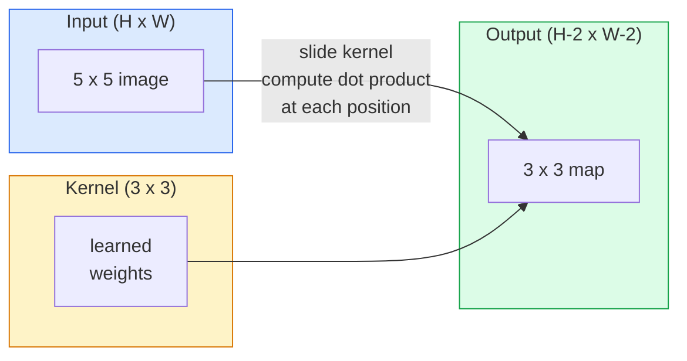
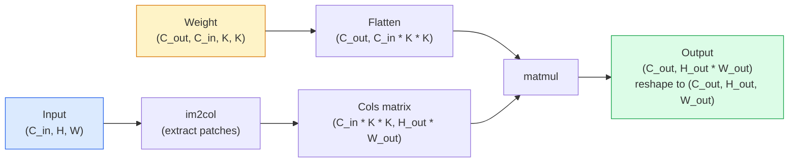

# 从零实现卷积

> 卷积是一个微小的密集层，你在图像上滑动它，在每个位置共享相同的权重。

**类型：** 构建
**语言：** Python
**前置知识：** 阶段 3（深度学习核心），阶段 4 第 01 课（图像基础）
**时间：** ~75 分钟

## 学习目标

- 仅使用 NumPy 从零实现 2D 卷积，包括嵌套循环版本和向量化 `im2col` 版本
- 计算任意输入大小、核大小、填充和步长组合下的输出空间大小，并推导 `(H - K + 2P) / S + 1` 公式
- 手工设计卷积核（边缘、模糊、锐化、Sobel），并解释每个卷积核为何产生相应的激活模式
- 将卷积堆叠为特征提取器，并将堆叠深度与感受野大小关联起来

## 问题

在 224×224 的 RGB 图像上使用全连接层，每个神经元需要 224 * 224 * 3 = 150,528 个输入权重。一个包含 1,000 个单元的隐藏层就已经有 1.5 亿个参数——在你学到任何有用的东西之前。更糟的是，该层完全不知道左上角的狗和右下角的狗是相同的模式。它将每个像素位置视为独立的，而这对于图像来说是完全错误的：将一只猫平移三个像素不应该迫使网络重新学习这个概念。

图像模型需要的两个特性是**平移等变性**（输入移动时输出也移动）和**参数共享**（相同的特征检测器到处运行）。密集层两者都不具备。卷积则免费提供两者。

卷积并非为深度学习而发明。它是驱动 JPEG 压缩、Photoshop 中的高斯模糊、工业视觉中的边缘检测以及所有已发布的音频滤波器的相同操作。CNN 从 2012 年到 2020 年主导 ImageNet 的原因是，卷积是邻近值相关且相同模式可出现在任何位置的数据的正确先验。

## 概念

### 一个核，滑动

2D 卷积取一个称为核（或滤波器）的小权重矩阵，在输入上滑动，在每个位置计算逐元素乘积的和。该和成为一个输出像素。



一个具体的 3×3 例子在 5×5 输入上（无填充，步长 1）：

```
Input X (5 x 5):                Kernel W (3 x 3):

  1  2  0  1  2                   1  0 -1
  0  1  3  1  0                   2  0 -2
  2  1  0  2  1                   1  0 -1
  1  0  2  1  3
  2  1  1  0  1

The kernel slides across every valid 3 x 3 window. Output Y is 3 x 3:

 Y[0,0] = sum( W * X[0:3, 0:3] )
 Y[0,1] = sum( W * X[0:3, 1:4] )
 Y[0,2] = sum( W * X[0:3, 2:5] )
 Y[1,0] = sum( W * X[1:4, 0:3] )
 ... and so on
```

这一个公式——**共享权重、局部性、滑动窗口**——就是全部思想。其他一切都是簿记。

### 输出大小公式

给定输入空间大小 `H`、核大小 `K`、填充 `P`、步长 `S`：

```
H_out = floor( (H - K + 2P) / S ) + 1
```

记住这个。你将在每个架构中计算它数十次。

| 场景 | H | K | P | S | H_out |
|----------|---|---|---|---|-------|
| 有效卷积，无填充 | 32 | 3 | 0 | 1 | 30 |
| 相同卷积（保持大小） | 32 | 3 | 1 | 1 | 32 |
| 下采样 2 倍 | 32 | 3 | 1 | 2 | 16 |
| 2×2 池化 | 32 | 2 | 0 | 2 | 16 |
| 大感受野 | 32 | 7 | 3 | 2 | 16 |

"相同填充"意味着选择 P 使得当 S == 1 时 H_out == H。对于奇数 K，即 P = (K - 1) / 2。这就是 3×3 核占主导地位的原因——它们是最小的仍有中心的奇数核。

### 填充

没有填充时，每次卷积都会缩小特征图。堆叠 20 层后，你的 224×224 图像变成 184×184，这会在边界浪费计算，并使需要匹配形状残差连接复杂化。

```
Zero padding (P = 1) on a 5 x 5 input:

  0  0  0  0  0  0  0
  0  1  2  0  1  2  0
  0  0  1  3  1  0  0
  0  2  1  0  2  1  0       Now the kernel can centre on pixel
  0  1  0  2  1  3  0       (0, 0) and still have three rows and
  0  2  1  1  0  1  0       three columns of values to multiply.
  0  0  0  0  0  0  0
```

实践中遇到的填充模式：`zero`（最常见）、`reflect`（镜像边缘，避免生成模型中的硬边界）、`replicate`（复制边缘）、`circular`（环绕，用于环形问题）。

### 步长

步长是滑动的步进大小。`stride=1` 是默认值。`stride=2` 将空间维度减半，是 CNN 中不借助单独池化层进行下采样的经典方式——每个现代架构（ResNet、ConvNeXt、MobileNet）都在某处使用步长卷积替代最大池化。

```
Stride 1 on a 5 x 5 input, 3 x 3 kernel:

  starts: (0,0) (0,1) (0,2)        -> output row 0
          (1,0) (1,1) (1,2)        -> output row 1
          (2,0) (2,1) (2,2)        -> output row 2

  Output: 3 x 3

Stride 2 on the same input:

  starts: (0,0) (0,2)              -> output row 0
          (2,0) (2,2)              -> output row 1

  Output: 2 x 2
```

### 多输入通道

真实图像有三个通道。RGB 输入上的 3×3 卷积实际上是一个 3×3×3 的体积：每个输入通道一个 3×3 切片。在每个空间位置，你跨所有三个切片相乘并求和，然后加上偏置。

```
Input:   (C_in,  H,  W)        3 x 5 x 5
Kernel:  (C_in,  K,  K)        3 x 3 x 3 (one kernel)
Output:  (1,     H', W')       2D map

For a layer that produces C_out output channels, you stack C_out kernels:

Weight:  (C_out, C_in, K, K)   e.g. 64 x 3 x 3 x 3
Output:  (C_out, H', W')       64 x 3 x 3

Parameter count: C_out * C_in * K * K + C_out   (the + C_out is biases)
```

最后一行是你规划模型时要计算的。一个 64 通道的 3×3 卷积在 3 通道输入上有 `64 * 3 * 3 * 3 + 64 = 1,792` 个参数。很便宜。

### im2col 技巧

嵌套循环易于阅读但速度慢。GPU 喜欢大型矩阵乘法。技巧是：将输入的每个感受野窗口展平为大矩阵的一列，将核展平为一行，整个卷积就变成一次矩阵乘法。



每个生产级卷积实现都是这个的某种变体加上缓存分块技巧（直接卷积、Winograd、大核 FFT 卷积）。理解 im2col 就理解了核心。

### 感受野

单个 3×3 卷积看 9 个输入像素。堆叠两个 3×3 卷积，第二层的一个神经元看 5×5 输入像素。三个 3×3 卷积得到 7×7。一般地：

```
RF after L stacked K x K convs (stride 1) = 1 + L * (K - 1)

With strides:   RF grows multiplicatively with stride along each layer.
```

"全程 3×3" 有效的全部原因（VGG、ResNet、ConvNeXt）是两个 3×3 卷积看到的输入区域与一个 5×5 卷积相同，但参数更少，且中间多了一层非线性。

## 构建

### 步骤 1：填充数组

从最小的原语开始：一个用零填充 H × W 数组周围的函数。

```python
import numpy as np

def pad2d(x, p):
    if p == 0:
        return x
    h, w = x.shape[-2:]
    out = np.zeros(x.shape[:-2] + (h + 2 * p, w + 2 * p), dtype=x.dtype)
    out[..., p:p + h, p:p + w] = x
    return out

x = np.arange(9).reshape(3, 3)
print(x)
print()
print(pad2d(x, 1))
```

尾部轴技巧 `x.shape[:-2]` 意味着同一函数无需修改即可在 `(H, W)`、`(C, H, W)` 或 `(N, C, H, W)` 上工作。

### 步骤 2：嵌套循环实现 2D 卷积

参考实现——慢，但明确无误。这就是 `torch.nn.functional.conv2d` 在原理上的做法。

```python
def conv2d_naive(x, w, b=None, stride=1, padding=0):
    c_in, h, w_in = x.shape
    c_out, c_in_w, kh, kw = w.shape
    assert c_in == c_in_w

    x_pad = pad2d(x, padding)
    h_out = (h + 2 * padding - kh) // stride + 1
    w_out = (w_in + 2 * padding - kw) // stride + 1

    out = np.zeros((c_out, h_out, w_out), dtype=np.float32)
    for oc in range(c_out):
        for i in range(h_out):
            for j in range(w_out):
                hs = i * stride
                ws = j * stride
                patch = x_pad[:, hs:hs + kh, ws:ws + kw]
                out[oc, i, j] = np.sum(patch * w[oc])
        if b is not None:
            out[oc] += b[oc]
    return out
```

四层嵌套循环（输出通道、行、列，加上对 C_in、kh、kw 的隐式求和）。这是你用来检验每个更快实现的基准真相。

### 步骤 3：用手工设计的核验证

构建一个垂直 Sobel 核，将其应用于合成阶梯图像，观察垂直边缘亮起。

```python
def synthetic_step_image():
    img = np.zeros((1, 16, 16), dtype=np.float32)
    img[:, :, 8:] = 1.0
    return img

sobel_x = np.array([
    [[-1, 0, 1],
     [-2, 0, 2],
     [-1, 0, 1]]
], dtype=np.float32)[None]

x = synthetic_step_image()
y = conv2d_naive(x, sobel_x, padding=1)
print(y[0].round(1))
```

期望在第 7 列出现大的正值（从左到右亮度增加），其他地方为零。这一个打印输出就是你验证数学正确的 sanity check。

### 步骤 4：im2col

将输入中每个核大小的窗口转换为矩阵的一列。对于 `C_in=3, K=3`，每列是 27 个数。

```python
def im2col(x, kh, kw, stride=1, padding=0):
    c_in, h, w = x.shape
    x_pad = pad2d(x, padding)
    h_out = (h + 2 * padding - kh) // stride + 1
    w_out = (w + 2 * padding - kw) // stride + 1

    cols = np.zeros((c_in * kh * kw, h_out * w_out), dtype=x.dtype)
    col = 0
    for i in range(h_out):
        for j in range(w_out):
            hs = i * stride
            ws = j * stride
            patch = x_pad[:, hs:hs + kh, ws:ws + kw]
            cols[:, col] = patch.reshape(-1)
            col += 1
    return cols, h_out, w_out
```

它仍然是 Python 循环，但现在繁重的计算将是一次向量化的矩阵乘法。

### 步骤 5：通过 im2col + matmul 实现快速卷积

用一次矩阵乘法替换四重循环。

```python
def conv2d_im2col(x, w, b=None, stride=1, padding=0):
    c_out, c_in, kh, kw = w.shape
    cols, h_out, w_out = im2col(x, kh, kw, stride, padding)
    w_flat = w.reshape(c_out, -1)
    out = w_flat @ cols
    if b is not None:
        out += b[:, None]
    return out.reshape(c_out, h_out, w_out)
```

正确性检查：运行两种实现并比较。

```python
rng = np.random.default_rng(0)
x = rng.normal(0, 1, (3, 16, 16)).astype(np.float32)
w = rng.normal(0, 1, (8, 3, 3, 3)).astype(np.float32)
b = rng.normal(0, 1, (8,)).astype(np.float32)

y_naive = conv2d_naive(x, w, b, padding=1)
y_im2col = conv2d_im2col(x, w, b, padding=1)

print(f"max abs diff: {np.max(np.abs(y_naive - y_im2col)):.2e}")
```

`max abs diff` 应该在 `1e-5` 左右——差异是浮点数累加顺序造成的，不是 bug。

### 步骤 6：一组手工设计的核

五个滤波器，展示单个卷积层在训练前能表达什么。

```python
KERNELS = {
    "identity": np.array([[0, 0, 0], [0, 1, 0], [0, 0, 0]], dtype=np.float32),
    "blur_3x3": np.ones((3, 3), dtype=np.float32) / 9.0,
    "sharpen": np.array([[0, -1, 0], [-1, 5, -1], [0, -1, 0]], dtype=np.float32),
    "sobel_x": np.array([[-1, 0, 1], [-2, 0, 2], [-1, 0, 1]], dtype=np.float32),
    "sobel_y": np.array([[-1, -2, -1], [0, 0, 0], [1, 2, 1]], dtype=np.float32),
}

def apply_kernel(img2d, kernel):
    x = img2d[None].astype(np.float32)
    w = kernel[None, None]
    return conv2d_im2col(x, w, padding=1)[0]
```

应用于任何灰度图像时，模糊会柔化，锐化会 crisp 边缘，Sobel-x 点亮垂直边缘，Sobel-y 点亮水平边缘。这些正是 AlexNet 和 VGG 中*第一层*训练卷积层最终学到的模式——因为一个好的图像模型无论后续任务是什么，都需要边缘和 blob 检测器。

## 使用

PyTorch 的 `nn.Conv2d` 包装了相同的操作，带有 autograd、CUDA 核和 cuDNN 优化。形状语义完全相同。

```python
import torch
import torch.nn as nn

conv = nn.Conv2d(in_channels=3, out_channels=64, kernel_size=3, stride=1, padding=1)
print(conv)
print(f"weight shape: {tuple(conv.weight.shape)}   # (C_out, C_in, K, K)")
print(f"bias shape:   {tuple(conv.bias.shape)}")
print(f"param count:  {sum(p.numel() for p in conv.parameters())}")

x = torch.randn(8, 3, 224, 224)
y = conv(x)
print(f"\ninput  shape: {tuple(x.shape)}")
print(f"output shape: {tuple(y.shape)}")
```

将 `padding=1` 替换为 `padding=0`，输出降至 222×222。将 `stride=1` 替换为 `stride=2`，输出降至 112×112。与你上面记住的公式相同。

## 交付

本课产出：

- `outputs/prompt-cnn-architect.md` — 一个提示词，给定输入大小、参数预算和目标感受野，设计一堆每层都有正确 K/S/P 的 `Conv2d` 层。
- `outputs/skill-conv-shape-calculator.md` — 一项技能，逐层遍历网络规格并返回每个块的输出形状、感受野和参数数量。

## 练习

1. **（简单）** 给定 128×128 灰度输入和一堆 `[Conv3x3(s=1,p=1), Conv3x3(s=2,p=1), Conv3x3(s=1,p=1), Conv3x3(s=2,p=1)]`，手工计算每层输出空间大小和感受野。用 PyTorch `nn.Sequential` 的虚拟卷积验证。
2. **（中等）** 扩展 `conv2d_naive` 和 `conv2d_im2col` 以接受 `groups` 参数。证明 `groups=C_in=C_out` 复现深度可分离卷积，且其参数数量为 `C * K * K` 而非 `C * C * K * K`。
3. **（困难）** 手工实现 `conv2d_im2col` 的反向传播：给定输出梯度，计算 `x` 和 `w` 的梯度。在相同输入和权重下与 `torch.autograd.grad` 验证。技巧：im2col 的梯度是 `col2im`，且它必须累积重叠窗口。

## 关键术语

| 术语 | 人们的说法 | 实际含义 |
|------|----------------|----------------------|
| 卷积 | "滑动一个滤波器" | 在每个空间位置应用的可学习点积，权重共享；数学上是互相关，但大家都叫它卷积 |
| 核 / 滤波器 | "特征检测器" | 形状为 (C_in, K, K) 的小权重张量，与输入窗口的点积产生一个输出像素 |
| 步长 | "你跳多远" | 连续核放置之间的步进大小；步长 2 将每个空间维度减半 |
| 填充 | "边缘上的零" | 添加到输入周围的额外值，使核能中心于边界像素；`same` 填充保持输出大小等于输入大小 |
| 感受野 | "神经元看到多少" | 给定输出激活依赖的原始输入区域，随深度和步长增长 |
| im2col | "GEMM 技巧" | 将每个感受窗口重排为列，使卷积变成一次大型矩阵乘法——每个快速卷积核的核心 |
| 深度可分离卷积 | "每个通道一个核" | `groups == C_in` 的卷积，每个输出通道仅从匹配的输入通道计算；MobileNet 和 ConvNeXt 的骨干 |
| 平移等变性 | "移入，移出" | 输入平移 k 像素导致输出平移 k 像素的性质；由权重共享免费提供 |

## 延伸阅读

- [A guide to convolution arithmetic for deep learning (Dumoulin & Visin, 2016)](https://arxiv.org/abs/1603.07285) —— 每个课程悄悄复制的填充/步长/空洞卷积的权威图示
- [CS231n: Convolutional Neural Networks for Visual Recognition](https://cs231n.github.io/convolutional-networks/) —— 经典讲义，包括原始 im2col 解释
- [The Annotated ConvNet (fast.ai)](https://nbviewer.org/github/fastai/fastbook/blob/master/13_convolutions.ipynb) —— 从手动卷积到训练数字分类器的笔记本
- [Receptive Field Arithmetic for CNNs (Dang Ha The Hien)](https://distill.pub/2019/computing-receptive-fields/) —— 论文级感受野计算交互式解释器
