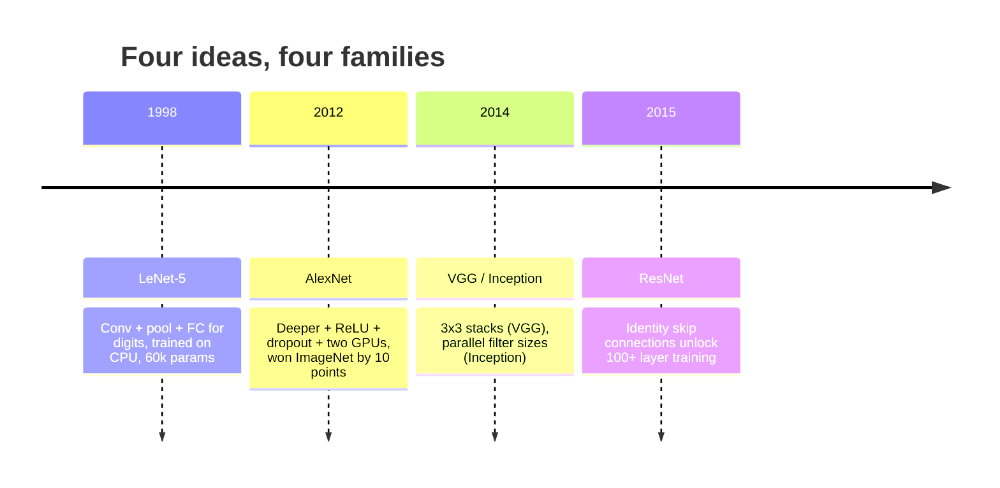
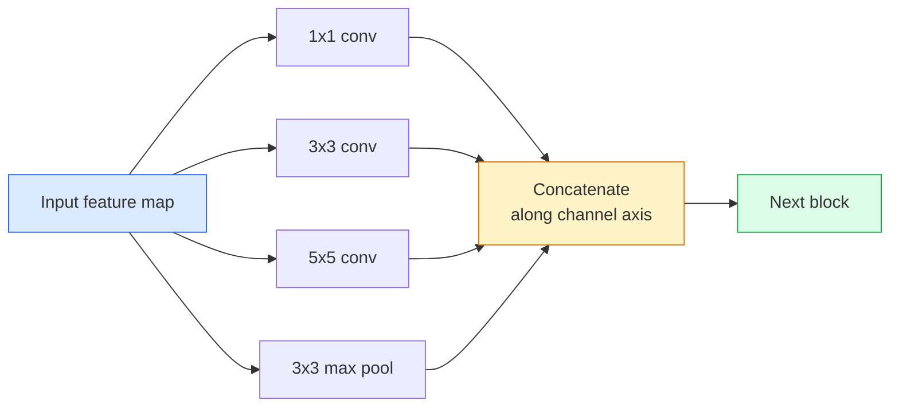
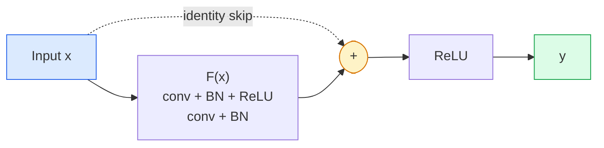

# CNN — 从 LeNet 到 ResNet

> 过去三十年中，每一款重要的 CNN 都是相同的卷积–非线性–下采样配方，再附加一个新想法。按顺序学习这些想法。

**类型：** 学习 + 构建
**语言：** Python
**前置知识：** 第三阶段 第11课 (PyTorch)，第四阶段 第01课 (图像基础)，第四阶段 第02课 (从零实现卷积)
**时间：** 约75分钟

## 学习目标

- 梳理 LeNet-5 -> AlexNet -> VGG -> Inception -> ResNet 的架构谱系，并说明每个家族贡献的单一核心思想
- 在 PyTorch 中实现 LeNet-5、VGG 风格模块和 ResNet BasicBlock，每个均不超过40行代码
- 解释残差连接如何将一个1000层的网络从无法训练转变为业界领先
- 阅读现代骨干网络 (ResNet-18, ResNet-50) 的代码，在查看源码前预测其输出形状、感受野和参数量

## 问题背景

2011年，最好的 ImageNet 分类器 top-5 准确率约为74%。2012年 AlexNet 达到85%。2015年 ResNet 达到96%。没有新数据，没有新一代 GPU。这些提升来自架构思想。一名合格的视觉工程师必须知道哪个想法来自哪篇论文，因为你在2026年部署的每一个生产级骨干网络都是这些组件的重新组合——而且这些思想持续迁移：分组卷积从 CNN 走向 transformer，残差连接从 ResNet 走向每一个存在的 LLM，批归一化存在于扩散模型中。

按顺序学习这些网络还能让你避免一个常见错误：在 LeNet 规模的网络就能解决问题时，却去选用最大的可用模型。MNIST 不需要 ResNet。了解每个家族的缩放曲线，才能知道应该落在曲线的哪个位置。

## 核心概念

### 改变视觉领域的四个思想



在经典视觉领域，没有什么比这四次飞跃更重要。

### LeNet-5 (1998)

Yann LeCun 的数字识别器。60,000 参数。两个卷积-池化模块，两个全连接层，tanh 激活。它定义了每个 CNN 继承的模板：

```
input (1, 32, 32)
  conv 5x5 -> (6, 28, 28)
  avg pool 2x2 -> (6, 14, 14)
  conv 5x5 -> (16, 10, 10)
  avg pool 2x2 -> (16, 5, 5)
  flatten -> 400
  dense -> 120
  dense -> 84
  dense -> 10
```

现代世界称之为 CNN 的一切——交替的卷积和下采样， feeding 到小型分类器头部——都是层数更多、通道更宽、激活函数更好的 LeNet。

### AlexNet (2012)

三个改变共同打破了 ImageNet 的局面：

1. **ReLU** 替代 tanh。梯度不再消失。训练速度提升六倍。
2. **全连接头部中的 Dropout**。正则化成为一个层，而非技巧。
3. **深度和宽度**。五个卷积层，三个全连接层，60M 参数，在两块 GPU 上训练，模型被分割在它们之间。

该论文的图2至今仍显示 GPU 分割为两个并行流。这种并行性是硬件层面的变通方案，而非架构洞见——但上述三个想法仍存在于你使用的每个模型中。

### VGG (2014)

VGG 提出的问题是：如果只使用 3x3 卷积并加深网络，会发生什么？

```
stack:   conv 3x3 -> conv 3x3 -> pool 2x2
repeat:  16 or 19 conv layers
```

两个 3x3 卷积看到的 5x5 输入区域与一个 5x5 卷积相同，但参数更少 (2*9*C^2 = 18C^2 对比 25*C^2)，且中间多了一层 ReLU。VGG 将这一观察转化为完整的架构。其简洁性——一种模块类型，重复堆叠——使其成为此后一切工作的参考基准。

代价：138M 参数，训练慢，推理昂贵。

### Inception (2014，同年)

Google 对"应该用什么卷积核尺寸？"的回答是：全部都要，并行使用。



每个分支各司其职——1x1 用于通道混合，3x3 用于局部纹理，5x5 用于更大模式，池化用于平移不变特征——而拼接操作让下一层选择有用的分支。Inception v1 在每个分支内部使用 1x1 卷积作为瓶颈，以保持参数量合理。

### 退化问题

到2015年，VGG-19 能工作，VGG-32 却不能。深度本应有所帮助，但超过约20层后，训练和测试损失都变差了。这不是过拟合。这是优化器无法找到有效权重，因为梯度在每层乘法性地衰减。

```
Plain deep network:
  y = f_L( f_{L-1}( ... f_1(x) ... ) )

Gradient wrt early layer:
  dL/dW_1 = dL/dy * df_L/df_{L-1} * ... * df_2/df_1 * df_1/dW_1

Each multiplicative term has magnitude roughly (weight magnitude) * (activation gain).
Stack 100 of them with gains < 1 and the gradient is effectively zero.
```

VGG 在19层时能工作，是因为同时期发表的批归一化 (batch norm) 保持了激活的良好尺度。但即使是批归一化也无法挽救超过约30层的深度。

### ResNet (2015)

He, Zhang, Ren, Sun 提出了一个改变一切的修改：

```
standard block:   y = F(x)
residual block:   y = F(x) + x
```

`+ x` 意味着该层总可以通过将 `F(x)` 驱动为零来选择什么都不做。1000层的 ResNet 现在最多只和1层网络一样差，因为每个额外模块都有一个简单的逃生通道。有了这个保证，优化器愿意让每个模块*稍微*有点用——而稍微有点用，堆叠100次，就是业界领先。



该模块的两种变体随处可见：

- **BasicBlock** (ResNet-18, ResNet-34)：两个 3x3 卷积，跳过两者。
- **Bottleneck** (ResNet-50, -101, -152)：1x1 降维，3x3 中间，1x1 升维，跳过三者。通道数高时更省计算。

当跳跃连接必须跨越下采样 (stride=2) 时，恒等路径被替换为 stride=2 的 1x1 卷积以匹配形状。

### 为什么残差思想超越视觉领域

这个想法其实与图像分类无关。它是关于将深度网络从"祈祷梯度能存活"转变为可靠、可扩展的工程工具。你在下一阶段将读到的每个 transformer 都在每个模块中有完全相同的跳跃连接。没有 ResNet，就没有 GPT。

## 动手构建

### 步骤 1：LeNet-5

一个最小、忠实的 LeNet 实现。Tanh 激活，平均池化。唯一向现代性妥协的是，我们在下游使用 `nn.CrossEntropyLoss` 而非原始的 Gaussian 连接。

```python
import torch
import torch.nn as nn
import torch.nn.functional as F

class LeNet5(nn.Module):
    def __init__(self, num_classes=10):
        super().__init__()
        self.conv1 = nn.Conv2d(1, 6, kernel_size=5)
        self.conv2 = nn.Conv2d(6, 16, kernel_size=5)
        self.pool = nn.AvgPool2d(2)
        self.fc1 = nn.Linear(16 * 5 * 5, 120)
        self.fc2 = nn.Linear(120, 84)
        self.fc3 = nn.Linear(84, num_classes)

    def forward(self, x):
        x = self.pool(torch.tanh(self.conv1(x)))
        x = self.pool(torch.tanh(self.conv2(x)))
        x = torch.flatten(x, 1)
        x = torch.tanh(self.fc1(x))
        x = torch.tanh(self.fc2(x))
        return self.fc3(x)

net = LeNet5()
x = torch.randn(1, 1, 32, 32)
print(f"output: {net(x).shape}")
print(f"params: {sum(p.numel() for p in net.parameters()):,}")
```

预期输出：`output: torch.Size([1, 10])`, `params: 61,706`。这就是开启现代视觉的整个数字分类器。

### 步骤 2：VGG 模块

一个可复用的模块：两个 3x3 卷积，ReLU，批归一化，最大池化。

```python
class VGGBlock(nn.Module):
    def __init__(self, in_c, out_c):
        super().__init__()
        self.conv1 = nn.Conv2d(in_c, out_c, kernel_size=3, padding=1)
        self.bn1 = nn.BatchNorm2d(out_c)
        self.conv2 = nn.Conv2d(out_c, out_c, kernel_size=3, padding=1)
        self.bn2 = nn.BatchNorm2d(out_c)
        self.pool = nn.MaxPool2d(2)

    def forward(self, x):
        x = F.relu(self.bn1(self.conv1(x)))
        x = F.relu(self.bn2(self.conv2(x)))
        return self.pool(x)

class MiniVGG(nn.Module):
    def __init__(self, num_classes=10):
        super().__init__()
        self.stack = nn.Sequential(
            VGGBlock(3, 32),
            VGGBlock(32, 64),
            VGGBlock(64, 128),
        )
        self.head = nn.Sequential(
            nn.AdaptiveAvgPool2d(1),
            nn.Flatten(),
            nn.Linear(128, num_classes),
        )

    def forward(self, x):
        return self.head(self.stack(x))

net = MiniVGG()
x = torch.randn(1, 3, 32, 32)
print(f"output: {net(x).shape}")
print(f"params: {sum(p.numel() for p in net.parameters()):,}")
```

三个 VGG 模块作用于 CIFAR 尺寸的输入，接一个自适应池化和一个线性层。约290k参数。对 CIFAR-10 来说绰绰有余。

### 步骤 3：ResNet BasicBlock

ResNet-18 和 ResNet-34 的核心构建模块。

```python
class BasicBlock(nn.Module):
    def __init__(self, in_c, out_c, stride=1):
        super().__init__()
        self.conv1 = nn.Conv2d(in_c, out_c, kernel_size=3, stride=stride, padding=1, bias=False)
        self.bn1 = nn.BatchNorm2d(out_c)
        self.conv2 = nn.Conv2d(out_c, out_c, kernel_size=3, stride=1, padding=1, bias=False)
        self.bn2 = nn.BatchNorm2d(out_c)
        if stride != 1 or in_c != out_c:
            self.shortcut = nn.Sequential(
                nn.Conv2d(in_c, out_c, kernel_size=1, stride=stride, bias=False),
                nn.BatchNorm2d(out_c),
            )
        else:
            self.shortcut = nn.Identity()

    def forward(self, x):
        out = F.relu(self.bn1(self.conv1(x)))
        out = self.bn2(self.conv2(out))
        out = out + self.shortcut(x)
        return F.relu(out)
```

`bias=False` 在卷积层上是一个批归一化惯例——BN 的 beta 参数已经处理了偏置，因此再携带卷积偏置是浪费。`shortcut` 仅在步幅或通道数变化时才需要真正的卷积；否则它就是无操作的恒等映射。

### 步骤 4：微型 ResNet

堆叠四组 BasicBlock，得到一个适用于 CIFAR 尺寸输入的可用 ResNet。

```python
class TinyResNet(nn.Module):
    def __init__(self, num_classes=10):
        super().__init__()
        self.stem = nn.Sequential(
            nn.Conv2d(3, 32, kernel_size=3, stride=1, padding=1, bias=False),
            nn.BatchNorm2d(32),
            nn.ReLU(inplace=True),
        )
        self.layer1 = self._make_group(32, 32, num_blocks=2, stride=1)
        self.layer2 = self._make_group(32, 64, num_blocks=2, stride=2)
        self.layer3 = self._make_group(64, 128, num_blocks=2, stride=2)
        self.layer4 = self._make_group(128, 256, num_blocks=2, stride=2)
        self.head = nn.Sequential(
            nn.AdaptiveAvgPool2d(1),
            nn.Flatten(),
            nn.Linear(256, num_classes),
        )

    def _make_group(self, in_c, out_c, num_blocks, stride):
        blocks = [BasicBlock(in_c, out_c, stride=stride)]
        for _ in range(num_blocks - 1):
            blocks.append(BasicBlock(out_c, out_c, stride=1))
        return nn.Sequential(*blocks)

    def forward(self, x):
        x = self.stem(x)
        x = self.layer1(x)
        x = self.layer2(x)
        x = self.layer3(x)
        x = self.layer4(x)
        return self.head(x)

net = TinyResNet()
x = torch.randn(1, 3, 32, 32)
print(f"output: {net(x).shape}")
print(f"params: {sum(p.numel() for p in net.parameters()):,}")
```

四组，每组两个模块。在第2、3、4组的起始处 stride=2。每次下采样时通道数翻倍。约2.8M参数。这就是能干净地扩展到 ResNet-152 的标准配方。

### 步骤 5：比较参数-特征效率

将相同输入通过三个网络并比较参数量。

```python
def summary(name, net, x):
    y = net(x)
    params = sum(p.numel() for p in net.parameters())
    print(f"{name:12s}  input {tuple(x.shape)} -> output {tuple(y.shape)}  params {params:>10,}")

x = torch.randn(1, 3, 32, 32)
summary("LeNet5",     LeNet5(),       torch.randn(1, 1, 32, 32))
summary("MiniVGG",    MiniVGG(),      x)
summary("TinyResNet", TinyResNet(),   x)
```

三个模型，三个时代，三个数量级的参数量差异。对于 CIFAR-10 准确率，你大致需要：LeNet 60%，MiniVGG 89%，TinyResNet 训练几个 epoch 后 93%。

## 实际应用

`torchvision.models` 提供上述所有模型的预训练版本。调用签名在各家族间保持一致，这正是骨干网络抽象的意义所在。

```python
from torchvision.models import resnet18, ResNet18_Weights, vgg16, VGG16_Weights

r18 = resnet18(weights=ResNet18_Weights.IMAGENET1K_V1)
r18.eval()

print(f"ResNet-18 params: {sum(p.numel() for p in r18.parameters()):,}")
print(r18.layer1[0])
print()

v16 = vgg16(weights=VGG16_Weights.IMAGENET1K_V1)
v16.eval()
print(f"VGG-16   params: {sum(p.numel() for p in v16.parameters()):,}")
```

ResNet-18 有 11.7M 参数。VGG-16 有 138M。相似的 ImageNet top-1 准确率 (69.8% 对比 71.6%)。残差连接带来了12倍的参数效率优势。这就是 ResNet 变体从2016年主导到2021年 ViT 出现的原因——而且在计算受限的真实世界部署中仍然占主导地位。

对于迁移学习，配方永远相同：加载预训练权重，冻结骨干网络，替换分类器头部。

```python
for p in r18.parameters():
    p.requires_grad = False
r18.fc = nn.Linear(r18.fc.in_features, 10)
```

三行代码。你现在拥有了一个10类 CIFAR 分类器，继承了 ImageNet 付费训练出的表征。

## 交付成果

本课程产出：

- `outputs/prompt-backbone-selector.md` — 一个根据任务、数据集规模和计算预算选择合适 CNN 家族 (LeNet/VGG/ResNet/MobileNet/ConvNeXt) 的提示词。
- `outputs/skill-residual-block-reviewer.md` — 一个读取 PyTorch 模块并标记跳跃连接错误的技能（步幅变化时缺少捷径、捷径激活顺序、BN 相对于加法的位置）。

## 练习题

1. **(简单)** 逐层手动计算 `TinyResNet` 的参数量。与 `sum(p.numel() for p in net.parameters())` 对比。参数预算的大部分流向哪里——卷积、BN，还是分类器头部？
2. **(中等)** 实现 Bottleneck 模块 (1x1 -> 3x3 -> 1x1 带跳跃连接)，并用它构建一个 CIFAR 用的 ResNet-50 风格网络。与 `TinyResNet` 比较参数量。
3. **(困难)** 从 `BasicBlock` 中移除跳跃连接，分别训练一个34块"普通"网络和一个34块 ResNet 在 CIFAR-10 上各10个 epoch。绘制两者的训练损失随 epoch 变化曲线。复现 He 等人论文中图1的结果：更深的普通网络收敛到比其浅层版本更高的损失。

## 关键术语

| 术语 | 人们怎么说 | 实际含义 |
|------|-----------|---------|
| Backbone | "模型" | 产生特征图供任务头部使用的卷积模块堆叠 |
| Residual connection | "跳跃连接" | `y = F(x) + x`；让优化器通过将 F 设为零来学习恒等映射，从而使任意深度可训练 |
| BasicBlock | "两个 3x3 卷积带跳跃" | ResNet-18/34 的构建模块：conv-BN-ReLU-conv-BN-add-ReLU |
| Bottleneck | "1x1 降维，3x3，1x1 升维" | ResNet-50/101/152 的模块；高通道数时更省，因为 3x3 在缩减后的宽度上运行 |
| Degradation problem | "更深更差" | 超过约20层普通卷积层后，训练和测试误差均增加；由残差连接解决，而非更多数据 |
| Stem | "第一层" | 将3通道输入转换为基础特征宽度的初始卷积；ImageNet 通常为 7x7 stride 2，CIFAR 通常为 3x3 stride 1 |
| Head | "分类器" | 最终骨干模块之后的层：自适应池化、展平、线性层 |
| Transfer learning | "预训练权重" | 加载 ImageNet 上训练的骨干网络，仅在你的任务上微调头部 |

## 延伸阅读

- [Deep Residual Learning for Image Recognition (He et al., 2015)](https://arxiv.org/abs/1512.03385) — ResNet 论文；每张图都值得研究
- [Very Deep Convolutional Networks (Simonyan & Zisserman, 2014)](https://arxiv.org/abs/1409.1556) — VGG 论文；仍是"为什么用 3x3"的最佳参考
- [ImageNet Classification with Deep CNNs (Krizhevsky et al., 2012)](https://papers.nips.cc/paper_files/paper/2012/hash/c399862d3b9d6b76c8436e924a68c45b-Abstract.html) — AlexNet；终结手工特征时代的论文
- [Going Deeper with Convolutions (Szegedy et al., 2014)](https://arxiv.org/abs/1409.4842) — Inception v1；并行滤波思想，至今仍见于视觉 transformer
