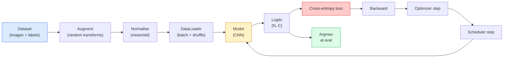

# 图像分类

> 分类器是一个从像素到类别概率分布的函数。其他一切都是管道工程。

**类型：** 构建
**语言：** Python
**前置知识：** 阶段 2 第 09 课（模型评估）、阶段 3 第 10 课（迷你框架）、阶段 4 第 03 课（CNN）
**时间：** ~75 分钟

## 学习目标

- 在 CIFAR-10 上构建端到端图像分类流水线：数据集、数据增强、模型、训练循环、评估
- 解释每个组件的作用（数据加载器、损失函数、优化器、学习率调度器、数据增强），并预测破坏其中任何一个会在损失曲线上如何体现
- 从零实现 mixup、cutout 和标签平滑，并论证每种方法何时值得添加
- 阅读混淆矩阵和逐类精确率/召回率表，以诊断数据集和模型在整体准确率之外的失败

## 问题

每个交付的视觉任务在某种程度上都可以归结为图像分类。检测是对区域进行分类。分割是对像素进行分类。检索是按与类别中心的相似度进行排序。把分类做对——数据集循环、增强策略、损失函数、评估——是转移到该阶段其他所有任务的核心技能。

大多数分类 bug 不在模型中。它们存在于流水线里：损坏的归一化、未打乱顺序的训练集、扭曲标签的增强、被训练数据污染的验证集拆分、在第 30 个 epoch 后悄然发散的学习率。一个在正确设置下能在 CIFAR-10 上达到 93% 的 CNN，在设置损坏的情况下通常只能得到 70-75%，而损失曲线整个过程看起来都是合理的。

本课手工搭建整个流水线，使每个部分都可检查。你不会使用任何来自 `torchvision.datasets` 可能隐藏 bug 的东西。

## 概念

### 分类流水线



这个循环中的每一行都是 bug 可能藏身之处。交叉熵接收原始 logits，而非 softmax 输出，因此在损失计算前进行任何 `model(x).softmax()` 都会悄然计算出错误的梯度。增强只应用于输入，不应用于标签——除了 mixup，它同时混合两者。`optimizer.zero_grad()` 必须每步执行一次；跳过它会累积梯度，看起来像是学习率极度不稳定。这些 bug 中的每一个都会压平学习曲线，而不会抛出错误。

### 交叉熵、logits 和 softmax

分类器为每张图像产生 `C` 个数值，称为 logits。应用 softmax 将它们转换为概率分布：

```
softmax(z)_i = exp(z_i) / sum_j exp(z_j)
```

交叉熵衡量正确类别的负对数概率：

```
CE(z, y) = -log( softmax(z)_y )
        = -z_y + log( sum_j exp(z_j) )
```

右侧形式是数值稳定的版本（log-sum-exp）。PyTorch 的 `nn.CrossEntropyLoss` 将 softmax + NLL 融合为单个操作，并直接接收原始 logits。先自己应用 softmax 几乎总是一个 bug——你会计算 log(softmax(softmax(z)))，一个无意义的量。

### 为什么增强有效

CNN 具有平移的归纳偏置（来自权重共享），但没有内置的对裁剪、翻转、颜色抖动或遮挡的不变性。教会它这些不变性的唯一方法是展示包含这些变化的像素。训练期间的每次随机变换都是在说："这两张图像具有相同的标签；学习忽略差异的特征。"

```
Original crop:  "dog facing left"
Flip:           "dog facing right"       <- same label, different pixels
Rotate(+15):    "dog, slight tilt"
Colour jitter:  "dog in warmer light"
RandomErasing:  "dog with patch missing"
```

规则：增强必须保留标签。在数字上进行 cutout 和旋转可能把 "6" 变成 "9"；对于该数据集，应使用更小的旋转范围，并选择尊重数字特定不变性的增强。

### Mixup 和 cutmix

普通增强变换像素但保持标签为 one-hot。**Mixup** 和 **cutmix** 打破这一点，同时对两者进行插值。

```
Mixup:
  lambda ~ Beta(a, a)
  x = lambda * x_i + (1 - lambda) * x_j
  y = lambda * y_i + (1 - lambda) * y_j

Cutmix:
  paste a random rectangle of x_j into x_i
  y = area-weighted mix of y_i and y_j
```

为什么有效：模型停止记忆尖锐的 one-hot 目标，学会在类别之间进行插值。训练损失上升，测试准确率上升。这是任何分类器最便宜的鲁棒性升级。

### 标签平滑

mixup 的表亲。不针对 `[0, 0, 1, 0, 0]` 训练，而是针对 `[eps/C, eps/C, 1-eps, eps/C, eps/C]` 训练，其中 `eps` 是一个较小的值，如 0.1。阻止模型产生任意尖锐的 logits，并以几乎零成本改善校准。自 PyTorch 1.10 起内置于 `nn.CrossEntropyLoss(label_smoothing=0.1)`。

### 超越准确率的评估

整体准确率隐藏了不平衡。一个总是预测多数类的 90-10 二分类器得分 90%。真正能告诉你发生了什么的工具：

- **逐类准确率** —— 每个类别一个数字；立即暴露表现不佳的类别。
- **混淆矩阵** —— C × C 网格，行 i 列 j = 真实类别 i 被预测为类别 j 的次数；对角线是正例，非对角线是模型犯错的地方。
- **Top-1 / Top-5** —— 正确类别是否在前 1 或前 5 个预测中；Top-5 对 ImageNet 很重要，因为像 "Norwich terrier" 和 "Norfolk terrier" 这样的类别确实难以区分。
- **校准（ECE）** —— 0.8 置信度的预测是否 80% 正确？现代网络系统性地过度自信；可通过温度缩放或标签平滑修复。

## 动手构建

### 步骤 1：确定性合成数据集

CIFAR-10 存储在磁盘上。为了使本课可复现且快速，我们构建一个看起来像 CIFAR 的合成数据集——32×32 RGB 图像，具有类别特定的结构，模型必须学习这些结构。完全相同的流水线可直接用于真实 CIFAR-10，无需修改。

```python
import numpy as np
import torch
from torch.utils.data import Dataset


def synthetic_cifar(num_per_class=1000, num_classes=10, seed=0):
    rng = np.random.default_rng(seed)
    X = []
    Y = []
    for c in range(num_classes):
        centre = rng.uniform(0, 1, (3,))
        freq = 2 + c
        for _ in range(num_per_class):
            yy, xx = np.meshgrid(np.linspace(0, 1, 32), np.linspace(0, 1, 32), indexing="ij")
            r = np.sin(xx * freq) * 0.5 + centre[0]
            g = np.cos(yy * freq) * 0.5 + centre[1]
            b = (xx + yy) * 0.5 * centre[2]
            img = np.stack([r, g, b], axis=-1)
            img += rng.normal(0, 0.08, img.shape)
            img = np.clip(img, 0, 1)
            X.append(img.astype(np.float32))
            Y.append(c)
    X = np.stack(X)
    Y = np.array(Y)
    idx = rng.permutation(len(X))
    return X[idx], Y[idx]


class ArrayDataset(Dataset):
    def __init__(self, X, Y, transform=None):
        self.X = X
        self.Y = Y
        self.transform = transform

    def __len__(self):
        return len(self.X)

    def __getitem__(self, i):
        img = self.X[i]
        if self.transform is not None:
            img = self.transform(img)
        img = torch.from_numpy(img).permute(2, 0, 1)
        return img, int(self.Y[i])
```

每个类别获得自己的调色板和频率模式，加上高斯噪声以迫使模型学习信号而非记忆像素。十个类别，每个一千张图像，已打乱。

### 步骤 2：归一化和增强

每个视觉流水线都有的两个变换。

```python
def standardize(mean, std):
    mean = np.array(mean, dtype=np.float32)
    std = np.array(std, dtype=np.float32)
    def _fn(img):
        return (img - mean) / std
    return _fn


def random_hflip(p=0.5):
    def _fn(img):
        if np.random.random() < p:
            return img[:, ::-1, :].copy()
        return img
    return _fn


def random_crop(pad=4):
    def _fn(img):
        h, w = img.shape[:2]
        padded = np.pad(img, ((pad, pad), (pad, pad), (0, 0)), mode="reflect")
        y = np.random.randint(0, 2 * pad)
        x = np.random.randint(0, 2 * pad)
        return padded[y:y + h, x:x + w, :]
    return _fn


def compose(*fns):
    def _fn(img):
        for fn in fns:
            img = fn(img)
        return img
    return _fn
```

裁剪前使用反射填充，而非零填充，因为黑色边框是模型会学会以非有用方式忽略的信号。

### 步骤 3：Mixup

在训练步骤中混合两张图像和两个标签。作为批次变换实现，使其位于前向传播旁边，而非数据集内部。

```python
def mixup_batch(x, y, num_classes, alpha=0.2):
    if alpha <= 0:
        return x, torch.nn.functional.one_hot(y, num_classes).float()
    lam = float(np.random.beta(alpha, alpha))
    idx = torch.randperm(x.size(0), device=x.device)
    x_mixed = lam * x + (1 - lam) * x[idx]
    y_onehot = torch.nn.functional.one_hot(y, num_classes).float()
    y_mixed = lam * y_onehot + (1 - lam) * y_onehot[idx]
    return x_mixed, y_mixed


def soft_cross_entropy(logits, soft_targets):
    log_probs = torch.log_softmax(logits, dim=-1)
    return -(soft_targets * log_probs).sum(dim=-1).mean()
```

`soft_cross_entropy` 是针对软标签分布的交叉熵。当目标恰好是 one-hot 时，它退化为通常的 one-hot 情况。

### 步骤 4：训练循环

完整配方：一次数据遍历，每批次计算梯度，每 epoch 步进调度器。

```python
import torch
import torch.nn as nn
from torch.utils.data import DataLoader
from torch.optim import SGD
from torch.optim.lr_scheduler import CosineAnnealingLR

def train_one_epoch(model, loader, optimizer, device, num_classes, use_mixup=True):
    model.train()
    total, correct, loss_sum = 0, 0, 0.0
    for x, y in loader:
        x, y = x.to(device), y.to(device)
        if use_mixup:
            x_m, y_soft = mixup_batch(x, y, num_classes)
            logits = model(x_m)
            loss = soft_cross_entropy(logits, y_soft)
        else:
            logits = model(x)
            loss = nn.functional.cross_entropy(logits, y, label_smoothing=0.1)
        optimizer.zero_grad()
        loss.backward()
        optimizer.step()
        loss_sum += loss.item() * x.size(0)
        total += x.size(0)
        # Training accuracy vs the un-mixed labels `y` is only an approximation
        # when mixup is on (the model saw soft targets, not y). Treat it as a
        # rough progress signal; rely on val accuracy for real performance.
        with torch.no_grad():
            pred = logits.argmax(dim=-1)
            correct += (pred == y).sum().item()
    return loss_sum / total, correct / total


@torch.no_grad()
def evaluate(model, loader, device, num_classes):
    model.eval()
    total, correct = 0, 0
    loss_sum = 0.0
    cm = torch.zeros(num_classes, num_classes, dtype=torch.long)
    for x, y in loader:
        x, y = x.to(device), y.to(device)
        logits = model(x)
        loss = nn.functional.cross_entropy(logits, y)
        pred = logits.argmax(dim=-1)
        for t, p in zip(y.cpu(), pred.cpu()):
            cm[t, p] += 1
        loss_sum += loss.item() * x.size(0)
        total += x.size(0)
        correct += (pred == y).sum().item()
    return loss_sum / total, correct / total, cm
```

每次编写训练循环时都要检查的五条不变式：

1. 训练前 `model.train()`，评估前 `model.eval()` —— 切换 dropout 和 batchnorm 行为。
2. `.zero_grad()` 在 `.backward()` 之前。
3. 累积指标时 `.item()`，以免任何内容保持计算图存活。
4. 评估期间 `@torch.no_grad()` —— 节省内存和时间，防止微妙的事故。
5. 对原始 logits 取 argmax，而非 softmax —— 结果相同，少一个操作。

### 步骤 5：整合

使用上一课的 `TinyResNet`，训练几个 epoch，评估。

```python
from main import synthetic_cifar, ArrayDataset
from main import standardize, random_hflip, random_crop, compose
from main import mixup_batch, soft_cross_entropy
from main import train_one_epoch, evaluate
# TinyResNet comes from the previous lesson (03-cnns-lenet-to-resnet).
# Adjust the import path to wherever you stored the previous lesson's code.
from cnns_lenet_to_resnet import TinyResNet  # example placeholder

X, Y = synthetic_cifar(num_per_class=500)
split = int(0.9 * len(X))
X_train, Y_train = X[:split], Y[:split]
X_val, Y_val = X[split:], Y[split:]

mean = [0.5, 0.5, 0.5]
std = [0.25, 0.25, 0.25]
train_tf = compose(random_hflip(), random_crop(pad=4), standardize(mean, std))
eval_tf = standardize(mean, std)

train_ds = ArrayDataset(X_train, Y_train, transform=train_tf)
val_ds = ArrayDataset(X_val, Y_val, transform=eval_tf)

train_loader = DataLoader(train_ds, batch_size=128, shuffle=True, num_workers=0)
val_loader = DataLoader(val_ds, batch_size=256, shuffle=False, num_workers=0)

device = "cuda" if torch.cuda.is_available() else "cpu"
model = TinyResNet(num_classes=10).to(device)
optimizer = SGD(model.parameters(), lr=0.1, momentum=0.9, weight_decay=5e-4, nesterov=True)
scheduler = CosineAnnealingLR(optimizer, T_max=10)

for epoch in range(10):
    tr_loss, tr_acc = train_one_epoch(model, train_loader, optimizer, device, 10, use_mixup=True)
    va_loss, va_acc, _ = evaluate(model, val_loader, device, 10)
    scheduler.step()
    print(f"epoch {epoch:2d}  lr {scheduler.get_last_lr()[0]:.4f}  "
          f"train {tr_loss:.3f}/{tr_acc:.3f}  val {va_loss:.3f}/{va_acc:.3f}")
```

在合成数据集上，这能在五个 epoch 内达到接近完美的验证准确率，这就是关键：流水线正确，模型能学习可学习的内容。将数据集替换为真实 CIFAR-10，相同的循环无需修改即可训练到 ~90%。

### 步骤 6：解读混淆矩阵

仅靠准确率无法告诉你模型在哪里失败。混淆矩阵可以。

```python
def print_confusion(cm, labels=None):
    c = cm.shape[0]
    labels = labels or [str(i) for i in range(c)]
    print(f"{'':>6}" + "".join(f"{l:>5}" for l in labels))
    for i in range(c):
        row = cm[i].tolist()
        print(f"{labels[i]:>6}" + "".join(f"{v:>5}" for v in row))
    print()
    tp = cm.diag().float()
    fp = cm.sum(dim=0).float() - tp
    fn = cm.sum(dim=1).float() - tp
    prec = tp / (tp + fp).clamp_min(1)
    rec = tp / (tp + fn).clamp_min(1)
    f1 = 2 * prec * rec / (prec + rec).clamp_min(1e-9)
    for i in range(c):
        print(f"{labels[i]:>6}  prec {prec[i]:.3f}  rec {rec[i]:.3f}  f1 {f1[i]:.3f}")

_, _, cm = evaluate(model, val_loader, device, 10)
print_confusion(cm)
```

行是真实类别，列是预测。类别 3 和 5 之间非对角线计数的聚集意味着模型混淆了这两个类别，为你提供了定向数据收集或类别特定增强的起点。

## 使用它

`torchvision` 将上述所有内容封装成语义的组件中。对于真实 CIFAR-10，完整流水线只需四行代码加一个训练循环。

```python
from torchvision.datasets import CIFAR10
from torchvision.transforms import Compose, RandomCrop, RandomHorizontalFlip, ToTensor, Normalize

mean = (0.4914, 0.4822, 0.4465)
std = (0.2470, 0.2435, 0.2616)
train_tf = Compose([
    RandomCrop(32, padding=4, padding_mode="reflect"),
    RandomHorizontalFlip(),
    ToTensor(),
    Normalize(mean, std),
])
eval_tf = Compose([ToTensor(), Normalize(mean, std)])

train_ds = CIFAR10(root="./data", train=True,  download=True, transform=train_tf)
val_ds   = CIFAR10(root="./data", train=False, download=True, transform=eval_tf)
```

需要注意两点：mean/std 是**数据集特定的**——在 CIFAR-10 训练集上计算，而非 ImageNet——反射填充是社区默认的裁剪策略。在此处复制粘贴 ImageNet 统计信息是一个 ~1% 的准确率泄漏，直到有人分析模型时才会被发现。

## 交付

本课产出：

- `outputs/prompt-classifier-pipeline-auditor.md` —— 一个审计训练脚本是否违反上述五条不变式并暴露首个违规的提示词。
- `outputs/skill-classification-diagnostics.md` —— 一项技能，给定混淆矩阵和类别名称列表，总结逐类失败并提出单一最具影响力的修复方案。

## 练习

1. **（简单）** 在合成数据集上，分别用和不用 mixup 训练相同模型五个 epoch。绘制两者的训练和验证损失。解释为什么使用 mixup 时训练损失更高，而验证准确率相似或更好。
2. **（中等）** 实现 Cutout——在每个训练图像中随机清零一个 8×8 的正方形——并进行消融实验：无增强、水平翻转+裁剪、水平翻转+裁剪+cutout、水平翻转+裁剪+mixup。报告每种情况的验证准确率。
3. **（困难）** 构建 CIFAR-100 流水线（100 个类别，相同输入尺寸），复现 ResNet-34 训练运行，达到公布准确率的 1% 以内。额外任务：扫描三个学习率和两个权重衰减，记录到本地 CSV，生成最终的混淆矩阵-最高混淆表。

## 关键术语

| 术语 | 人们怎么说 | 实际含义 |
|------|-----------|---------|
| Logits | "原始输出" | 每张图像 C 个数字的 pre-softmax 向量；交叉熵期望这些，而非 softmax 后的值 |
| 交叉熵 | "损失" | 正确类别的负对数概率；将 log-softmax 和 NLL 融合为一个稳定操作 |
| DataLoader | "批次生成器" | 用打乱、分批次和（可选）多工人加载包装数据集；背了一半训练 bug 的锅 |
| 增强 | "随机变换" | 训练时任何保留标签的像素级变换；教会 CNN 天生没有的不变性 |
| Mixup / Cutmix | "混合两张图像" | 混合输入和标签，使分类器学习平滑插值而非硬边界 |
| 标签平滑 | "更软的目标" | 将 one-hot 替换为 (1-eps, eps/(C-1), ...)；改善校准并略微提升准确率 |
| Top-k 准确率 | "Top-5" | 正确类别在 k 个最高概率预测中；用于类别确实难以区分的数据集 |
| 混淆矩阵 | "错误所在" | C × C 表，条目 (i, j) 统计真实类别 i 被预测为 j 的次数；对角线正确，非对角线告诉你该修什么 |

## 延伸阅读

- [CS231n: Training Neural Networks](https://cs231n.github.io/neural-networks-3/) —— 单页最清晰的训练流水线导览
- [Bag of Tricks for Image Classification (He et al., 2019)](https://arxiv.org/abs/1812.01187) —— 每个小技巧合在一起为 ImageNet 上的 ResNet 增加 3-4% 准确率
- [mixup: Beyond Empirical Risk Minimization (Zhang et al., 2017)](https://arxiv.org/abs/1710.09412) —— 原始 mixup 论文；三页理论加令人信服的实验
- [Why temperature scaling matters (Guo et al., 2017)](https://arxiv.org/abs/1706.04599) —— 证明现代网络校准不良并用单个标量参数修复的论文
