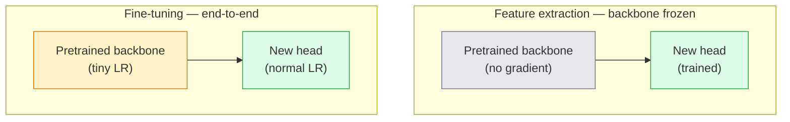

# 迁移学习与微调

> 别人已经花费了数百万 GPU 小时来训练网络识别边缘、纹理和物体部件。在训练你自己的模型之前，你应该直接借用这些特征。

**类型：** 构建
**语言：** Python
**前置课程：** Phase 4 Lesson 03 (CNNs), Phase 4 Lesson 04 (Image Classification)
**耗时：** 约 75 分钟

## 学习目标

- 区分特征提取与微调，并根据数据集大小、领域距离和计算预算选择合适的方法
- 加载预训练骨干网络，替换其分类头部，并在 20 行代码内仅训练头部以达到可用基线
- 通过判别性学习率逐步解冻层，使早期通用特征的更新幅度小于晚期任务特定特征
- 诊断三种常见故障：未冻结块的学习率过高导致特征漂移、极小数据集上 BN 统计量崩溃，以及灾难性遗忘

## 问题背景

在 ImageNet 上训练 ResNet-50 大约需要 2,000 个 GPU 小时。很少有团队能为他们交付的每个任务都承担这样的预算。实际上，每个团队交付的都是一个预训练的骨干网络，配合在一个只有几百或几千张任务特定图像的数据集上训练的新头部。

这并非捷径。任何经过 ImageNet 训练的 CNN 的第一个卷积块都会学习边缘和类 Gabor 滤波器。接下来的几个块学习纹理和简单模式。中间的块学习物体部件。最后的块学习开始看起来像 1,000 个 ImageNet 类别的组合。该层次结构的前 90% 几乎可以原封不动地迁移到医学成像、工业检测、卫星数据以及所有其他视觉任务中——因为自然界的边缘和纹理词汇是有限的。最后 10% 才是你真正需要训练的部分。

正确进行迁移学习有三个潜伏的陷阱：用过高的学习率破坏预训练特征、冻结过多导致模型信息匮乏，以及让 BatchNorm 的运行统计量向网络其余部分从未学习过的极小数据集漂移。本课程将逐一讲解它们。

## 核心概念

### 特征提取与微调

两种模式，取决于你对预训练特征的信任程度以及你拥有的数据量。



经验法则：

| 数据集大小 | 领域距离 | 方案 |
|------------|----------|------|
| < 1k 张图像 | 接近 ImageNet | 冻结骨干网络，仅训练头部 |
| 1k-10k | 接近 | 冻结前 2-3 个阶段，微调其余部分 |
| 10k-100k | 任意 | 使用判别性学习率端到端微调 |
| 100k+ | 较远 | 微调所有内容；如果领域差异足够大，考虑从头训练 |

“接近 ImageNet”大致指带有类对象内容的自然 RGB 照片。医学 CT 扫描、高空卫星图像和显微镜图像属于较远的领域——特征仍然有用，但你需要允许更多层进行适应。

### 为什么冻结有效

CNN 在 ImageNet 上学到的特征并非针对那 1,000 个类别专门设计的。它们是针对自然图像的统计特性专门设计的：特定方向的边缘、纹理、对比度模式、形状基元。这些统计特性在人类能命名的几乎所有视觉领域中都是稳定的。这就是为什么在 ImageNet 上训练并在 CIFAR-10 上进行零样本评估（仅使用新的线性头部，不微调骨干网络）的模型能达到 80% 以上的准确率的原因。头部正在学习如何为当前任务加权那些已学到的特征。

### 判别性学习率

当你解冻时，早期层的训练速度应慢于晚期层。早期层编码了你希望保留的通用特征；晚期层编码了你需要大幅调整的任务特定结构。

```
Typical recipe:

  stage 0 (stem + first group): lr = base_lr / 100    (mostly fixed)
  stage 1:                       lr = base_lr / 10
  stage 2:                       lr = base_lr / 3
  stage 3 (last backbone group): lr = base_lr
  head:                          lr = base_lr  (or slightly higher)
```

在 PyTorch 中，这仅仅是传递给优化器的参数组列表。一个模型，五个学习率，零额外代码。

### BatchNorm 问题

BN 层包含在 ImageNet 上计算的 `running_mean` 和 `running_var` 缓冲区。如果你的任务具有不同的像素分布——不同的光照、不同的传感器、不同的颜色空间——这些缓冲区就是错误的。按优先级排序有三种选项：

1. **Fine-tune with BN in train mode.** Let BN update its running statistics along with everything else. Default choice when the task dataset is medium-sized (>= 5k examples). -> 1. **以训练模式微调 BN。** 让 BN 与其他参数一起更新其运行统计量。当任务数据集为中等规模（>= 5k 样本）时的默认选择。
2. **Freeze BN in eval mode.** Keep the ImageNet statistics and train only the weights. Correct when your dataset is small enough that BN's moving average would be noisy. -> 2. **以评估模式冻结 BN。** 保留 ImageNet 统计量，仅训练权重。当你的数据集小到 BN 的移动平均会产生噪声时适用。
3. **Replace BN with GroupNorm.** Removes the moving-average problem entirely. Used in detection and segmentation backbones where batch size per GPU is tiny. -> 3. **用 GroupNorm 替换 BN。** 彻底消除移动平均问题。用于每 GPU 批次大小极小的检测和分割骨干网络。

处理不当会悄无声息地将准确率降低 5-15%。

### 头部设计

分类头部由 1-3 个线性层加上可选的 Dropout 组成。每个 torchvision 骨干网络都附带一个默认的头部供你替换：

```
backbone.fc = nn.Linear(backbone.fc.in_features, num_classes)          # ResNet
backbone.classifier[1] = nn.Linear(..., num_classes)                    # EfficientNet, MobileNet
backbone.heads.head = nn.Linear(..., num_classes)                       # torchvision ViT
```

对于小型数据集，单个线性层通常就足够了。当任务分布远离骨干网络的训练分布时，添加隐藏层（Linear -> ReLU -> Dropout -> Linear）会有所帮助。

### 逐层学习率衰减

现代微调（BEiT、DINOv2、ViT-B 微调）中使用的一种更平滑的判别性学习率变体。与其将层分组为阶段，不如给每一层分配比上一层略小的学习率：

```
lr_layer_k = base_lr * decay^(L - k)
```

当 decay = 0.75 且 L = 12 个 Transformer 块时，第一个块的学习率为头部学习率的 `0.75^11 ≈ 0.04x`。这对 Transformer 微调比对 CNN 更重要，后者通常阶段分组学习率就足够了。

### 评估指标

迁移学习运行需要两个你在从头训练中不会跟踪的指标：

- **Pretrained-only accuracy** — the head's accuracy with the backbone frozen. This is your floor. -> - **仅预训练准确率** —— 骨干网络冻结时头部的准确率。这是你的下限。
- **Fine-tuned accuracy** — the same model after end-to-end training. This is your ceiling. -> - **微调后准确率** —— 端到端训练后同一模型的准确率。这是你的上限。

如果微调后的准确率低于仅预训练准确率，说明存在学习率或 BN 的 Bug。务必同时打印这两个值。

## 动手实现

### 步骤 1：加载预训练骨干网络并检查它

```python
import torch
import torch.nn as nn
from torchvision.models import resnet18, ResNet18_Weights

backbone = resnet18(weights=ResNet18_Weights.IMAGENET1K_V1)
print(backbone)
print()
print("classifier head:", backbone.fc)
print("feature dim:", backbone.fc.in_features)
```

`ResNet18` 拥有四个阶段（`layer1..layer4`），加上一个茎部和一个 `fc` 头部。每个 torchvision 分类骨干网络都具有类似的结构。

### 步骤 2：特征提取 —— 冻结所有内容，替换头部

```python
def make_feature_extractor(num_classes=10):
    model = resnet18(weights=ResNet18_Weights.IMAGENET1K_V1)
    for p in model.parameters():
        p.requires_grad = False
    model.fc = nn.Linear(model.fc.in_features, num_classes)
    return model

model = make_feature_extractor(num_classes=10)
trainable = sum(p.numel() for p in model.parameters() if p.requires_grad)
frozen = sum(p.numel() for p in model.parameters() if not p.requires_grad)
print(f"trainable: {trainable:>10,}")
print(f"frozen:    {frozen:>10,}")
```

仅 `model.fc` 可训练。骨干网络是一个冻结的特征提取器。

### 步骤 3：判别性微调

一个构建具有阶段特定学习率的参数组的工具函数。

```python
def discriminative_param_groups(model, base_lr=1e-3, decay=0.3):
    stages = [
        ["conv1", "bn1"],
        ["layer1"],
        ["layer2"],
        ["layer3"],
        ["layer4"],
        ["fc"],
    ]
    groups = []
    for i, names in enumerate(stages):
        lr = base_lr * (decay ** (len(stages) - 1 - i))
        params = [p for n, p in model.named_parameters()
                  if any(n.startswith(k) for k in names)]
        if params:
            groups.append({"params": params, "lr": lr, "name": "_".join(names)})
    return groups

model = resnet18(weights=ResNet18_Weights.IMAGENET1K_V1)
model.fc = nn.Linear(model.fc.in_features, 10)
for p in model.parameters():
    p.requires_grad = True

groups = discriminative_param_groups(model)
for g in groups:
    print(f"{g['name']:>10s}  lr={g['lr']:.2e}  params={sum(p.numel() for p in g['params']):>8,}")
```

`decay=0.3` 表示每个阶段的学习率是下一阶段的 30%。`fc` 获得 `base_lr`，`layer4` 获得 `0.3 * base_lr`，`conv1` 获得 `0.3^5 * base_lr ≈ 0.00243 * base_lr`。听起来很极端；但在经验上是有效的。

### 步骤 4：BatchNorm 处理

用于在不冻结权重的情况下冻结 BN 运行统计量的辅助函数。

```python
def freeze_bn_stats(model):
    for m in model.modules():
        if isinstance(m, (nn.BatchNorm1d, nn.BatchNorm2d, nn.BatchNorm3d)):
            m.eval()
            for p in m.parameters():
                p.requires_grad = False
    return model
```

在每个 epoch 开始时设置 `model.train()` 后调用它。`model.train()` 会将所有内容切换到训练模式；此操作仅对 BN 层进行反向切换。

### 步骤 5：最小的端到端微调循环

```python
from torch.optim import SGD
from torch.utils.data import DataLoader
from torch.optim.lr_scheduler import CosineAnnealingLR
import torch.nn.functional as F

def fine_tune(model, train_loader, val_loader, device, epochs=5, base_lr=1e-3, freeze_bn=False):
    model = model.to(device)
    groups = discriminative_param_groups(model, base_lr=base_lr)
    optimizer = SGD(groups, momentum=0.9, weight_decay=1e-4, nesterov=True)
    scheduler = CosineAnnealingLR(optimizer, T_max=epochs)

    for epoch in range(epochs):
        model.train()
        if freeze_bn:
            freeze_bn_stats(model)
        tr_loss, tr_correct, tr_total = 0.0, 0, 0
        for x, y in train_loader:
            x, y = x.to(device), y.to(device)
            logits = model(x)
            loss = F.cross_entropy(logits, y, label_smoothing=0.1)
            optimizer.zero_grad()
            loss.backward()
            optimizer.step()
            tr_loss += loss.item() * x.size(0)
            tr_total += x.size(0)
            tr_correct += (logits.argmax(-1) == y).sum().item()
        scheduler.step()

        model.eval()
        va_total, va_correct = 0, 0
        with torch.no_grad():
            for x, y in val_loader:
                x, y = x.to(device), y.to(device)
                pred = model(x).argmax(-1)
                va_total += x.size(0)
                va_correct += (pred == y).sum().item()
        print(f"epoch {epoch}  train {tr_loss/tr_total:.3f}/{tr_correct/tr_total:.3f}  "
              f"val {va_correct/va_total:.3f}")
    return model
```

在 CIFAR-10 上使用上述配方进行五个 epoch 的训练，可将 `ResNet18-IMAGENET1K_V1` 从零样本线性探测的约 70% 准确率提升至约 93% 的微调准确率。仅靠头部而不触碰骨干网络，准确率会在 86% 左右达到瓶颈。

### 步骤 6：渐进式解冻

一种调度策略，从末尾向开头每个 epoch 解冻一个阶段。以牺牲少量额外 epoch 为代价缓解特征漂移。

```python
def progressive_unfreeze_schedule(model):
    stages = ["layer4", "layer3", "layer2", "layer1"]
    yielded = set()

    def start():
        for p in model.parameters():
            p.requires_grad = False
        for p in model.fc.parameters():
            p.requires_grad = True

    def unfreeze(epoch):
        if epoch < len(stages):
            name = stages[epoch]
            yielded.add(name)
            for n, p in model.named_parameters():
                if n.startswith(name):
                    p.requires_grad = True
            return name
        return None

    return start, unfreeze
```

在第一个 epoch 之前调用一次 `start()`。在每个 epoch 开始时调用 `unfreeze(epoch)`。每当可训练参数集合发生变化时重建优化器，否则冻结的参数仍持有缓存的动量，这会干扰优化器。

## 实际应用

对于大多数实际任务，`torchvision.models` 加三行代码就足够了。当你遇到库默认设置无法解决的问题时，上面提到的更复杂的机制才派得上用场。

```python
from torchvision.models import resnet50, ResNet50_Weights

model = resnet50(weights=ResNet50_Weights.IMAGENET1K_V2)
model.fc = nn.Linear(model.fc.in_features, num_classes)
optimizer = torch.optim.AdamW(model.parameters(), lr=1e-4, weight_decay=1e-4)
```

另外两个生产级默认选项：

- `timm` ships ~800 pretrained vision backbones with a consistent API (`timm.create_model("resnet50", pretrained=True, num_classes=10)`). For any fine-tune beyond the torchvision zoo, it is the standard. -> - `timm` 提供了约 800 个预训练视觉骨干网络，并提供一致的 API（`timm.create_model("resnet50", pretrained=True, num_classes=10)`）。对于 torchvision 动物园之外的任何微调，它是标准选择。
- For transformers, `transformers.AutoModelForImageClassification.from_pretrained(name, num_labels=N)` gives you ViT / BEiT / DeiT with the same loading semantics as text models. -> - 对于 Transformer 模型，`transformers.AutoModelForImageClassification.from_pretrained(name, num_labels=N)` 提供 ViT / BEiT / DeiT，其加载语义与文本模型相同。

## 交付物

本课产出：

- `outputs/prompt-fine-tune-planner.md` — a prompt that picks feature-extraction vs progressive vs end-to-end fine-tuning based on dataset size, domain distance, and compute budget. -> - `outputs/prompt-fine-tune-planner.md` —— 一个提示词，根据数据集大小、领域距离和计算预算来选择特征提取、渐进式还是端到端微调。
- `outputs/skill-freeze-inspector.md` — a skill that, given a PyTorch model, reports which parameters are trainable, which BatchNorm layers are in eval mode, and whether the optimizer is actually being fed the trainable parameters. -> - `outputs/skill-freeze-inspector.md` —— 一项技能，给定一个 PyTorch 模型后，报告哪些参数可训练、哪些 BatchNorm 层处于评估模式，以及优化器是否实际接收到了可训练参数。

## 练习

1. **(Easy)** Train a `ResNet18` as a linear probe (backbone frozen) and as a full fine-tune on the same synthetic-CIFAR dataset. Report both accuracies side by side. Explain which gap tells you the features transfer well and which tells you they do not. -> 1. **（简单）** 在同一合成 CIFAR 数据集上，将 `ResNet18` 分别作为线性探测（骨干网络冻结）和完整微调进行训练。并排报告两者的准确率。解释哪个差距表明特征迁移效果好，哪个表明效果差。
2. **(Medium)** Introduce a bug on purpose: set `base_lr = 1e-1` on the backbone stage instead of the head. Show the training loss explode, then recover by applying the `discriminative_param_groups` helper. Record the LR at which each stage starts diverging. -> 2. **（中等）** 故意引入一个 Bug：将 `base_lr = 1e-1` 设置在骨干网络阶段而不是头部。展示训练损失爆炸，然后通过应用 `discriminative_param_groups` 辅助函数进行恢复。记录每个阶段开始发散时的学习率。
3. **(Hard)** Take a medical imaging dataset (e.g. CheXpert-small, PatchCamelyon, or HAM10000) and compare three regimes: (a) ImageNet-pretrained frozen backbone + linear head; (b) ImageNet-pretrained fine-tune end-to-end; (c) scratch training. Report accuracy and compute cost for each. At what dataset size does scratch training become competitive? -> 3. **（困难）** 选取一个医学成像数据集（例如 CheXpert-small、PatchCamelyon 或 HAM10000），比较三种模式：(a) ImageNet 预训练冻结骨干网络 + 线性头部；(b) ImageNet 预训练端到端微调；(c) 从头训练。报告每种模式的准确率和计算成本。在什么数据集规模下，从头训练变得具有竞争力？

## 关键术语

| 术语 | 人们常说的说法 | 实际含义 |
|------|----------------|----------|
| Feature extraction（特征提取） | “冻结并训练头部” | 骨干网络参数冻结，仅新的分类头部接收梯度 |
| Fine-tuning（微调） | “端到端重新训练” | 所有参数均可训练，通常使用比从头训练小得多的学习率 |
| Discriminative LR（判别性学习率） | “早期层使用较小的学习率” | 优化器参数组中，早期阶段的学习率是晚期阶段学习率的一个分数 |
| Layer-wise LR decay（逐层学习率衰减） | “平滑的学习率梯度” | 每层的学习率乘以 decay^(L - k)；在 Transformer 微调中很常见 |
| Catastrophic forgetting（灾难性遗忘） | “模型丢失了 ImageNet 知识” | 学习率过高，在新任务信号被学会之前就覆盖了预训练特征 |
| BN statistics drift（BN 统计量漂移） | “运行均值错误” | BatchNorm 的 running_mean/var 是在与当前任务不同的分布上计算的，悄无声息地损害准确率 |
| Linear probe（线性探测） | “冻结骨干网络 + 线性头部” | 对预训练特征的评估——在冻结表示之上最佳线性分类器的准确率 |
| Catastrophic collapse（灾难性坍塌） | “所有预测都指向一个类别” | 当微调使用的学习率高到足以在头部梯度稳定之前摧毁特征时发生 |

## 延伸阅读

- [How transferable are features in deep neural networks? (Yosinski et al., 2014)](https://arxiv.org/abs/1411.1792) — the paper that quantified feature transferability across layers -> - [How transferable are features in deep neural networks? (Yosinski et al., 2014)](https://arxiv.org/abs/1411.1792) —— 量化了跨层特征可迁移性的论文
- [Universal Language Model Fine-tuning (ULMFiT, Howard & Ruder, 2018)](https://arxiv.org/abs/1801.06146) — the original discriminative LR / progressive unfreezing recipe; the ideas transfer directly to vision -> - [Universal Language Model Fine-tuning (ULMFiT, Howard & Ruder, 2018)](https://arxiv.org/abs/1801.06146) —— 原始的判别性学习率/渐进式解冻配方；这些思想可直接迁移到视觉领域
- [timm documentation](https://huggingface.co/docs/timm) — the reference for modern vision backbones and the exact fine-tune defaults they were trained with -> - [timm documentation](https://huggingface.co/docs/timm) —— 现代视觉骨干网络的参考文档及其训练时使用的确切微调默认值
- [A Simple Framework for Linear-Probe Evaluation (Kornblith et al., 2019)](https://arxiv.org/abs/1805.08974) — why linear-probe accuracy matters and how to report it correctly -> - [A Simple Framework for Linear-Probe Evaluation (Kornblith et al., 2019)](https://arxiv.org/abs/1805.08974) —— 为什么线性探测准确率很重要以及如何正确报告它
