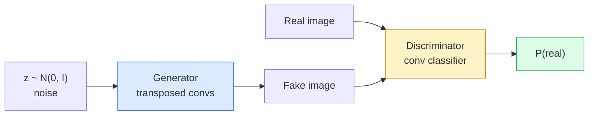
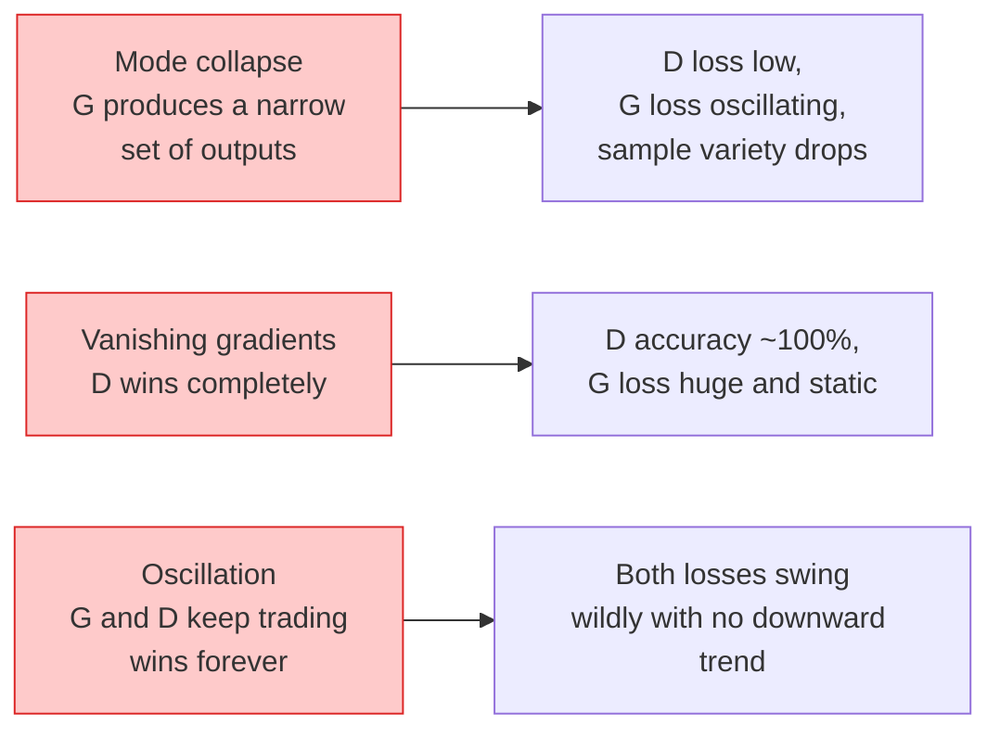

# 图像生成 — GANs

> GAN 是两个神经网络的固定博弈。一个负责画，一个负责评判。它们共同进步，直到画作能骗过评判者。

**类型：** 构建
**语言：** Python
**前置知识：** 阶段 4 第 03 课 (CNNs)，阶段 3 第 06 课 (Optimizers)，阶段 3 第 07 课 (Regularization)
**时间：** ~75 分钟

## 学习目标

- 解释生成器与判别器之间的 minimax 博弈，以及为什么均衡对应于 p_model = p_data
- 在 PyTorch 中实现 DCGAN，并在 60 行代码内生成清晰的 32x32 合成图像
- 用三种标准技巧稳定 GAN 训练：非饱和损失、谱归一化、TTUR（双时间尺度更新规则）
- 解读训练曲线，区分健康收敛与模式坍塌、振荡、判别器完全获胜

## 问题

分类教会网络将图像映射到标签。生成则反转了问题：采样出看起来来自同一分布的新图像。没有"正确"的输出可供对比；只有想要模仿的分布。

标准损失函数（MSE、交叉熵）无法衡量"这个样本是否来自真实分布"。最小化逐像素误差会产生模糊的平均值，而非真实样本。突破在于学习损失：训练第二个网络，其任务是区分真假，并利用它的判断来推动生成器。

GANs（Goodfellow 等，2014）定义了该框架。到 2018 年，StyleGAN 已能生成与照片无法区分的 1024x1024 人脸。扩散模型随后在质量和可控性方面占据主导，但使扩散实用的每项技巧——归一化选择、潜空间、特征损失——最初都是在 GANs 上理解的。

## 概念

### 两个网络



**生成器** G 接收噪声向量 `z` 并输出图像。**判别器** D 接收图像并输出单个标量：图像是真实的概率。

### 博弈

G 想让 D 出错。D 想判断正确。形式上：

```
min_G max_D  E_x[log D(x)] + E_z[log(1 - D(G(z)))]
```

从右向左读：D 最大化对真实图像（`log D(real)`）和假图像（`log (1 - D(fake))`）的准确率。G 最小化 D 对假图像的准确率——它希望 `D(G(z))` 高。

Goodfellow 证明了该 minimax 存在全局均衡，此时 `p_G = p_data`，D 处处输出 0.5，生成分布与真实分布之间的 Jensen-Shannon 散度为零。难点在于如何达到该均衡。

### 非饱和损失

上述形式在数值上不稳定。训练初期，`D(G(z))` 对每个假样本都接近零，因此 `log(1 - D(G(z)))` 关于 G 的梯度消失。解决方法：翻转 G 的损失。

```
L_D = -E_x[log D(x)] - E_z[log(1 - D(G(z)))]
L_G = -E_z[log D(G(z))]                          # non-saturating
```

现在当 `D(G(z))` 接近零时，G 的损失很大且梯度有信息量。现代 GAN 都用这个变体训练。

### DCGAN 架构规则

Radford、Metz、Chintala（2015）将多年失败实验提炼为五条使 GAN 训练稳定的规则：

1. 用步长卷积替代池化（两个网络都如此）。
2. 在生成器和判别器中都使用 batch norm，但 G 的输出层和 D 的输入层除外。
3. 在更深的架构中移除全连接层。
4. G 在所有层使用 ReLU，输出层除外（输出用 tanh，范围 [-1, 1]）。
5. D 在所有层使用 LeakyReLU（negative_slope=0.2）。

每个现代基于卷积的 GAN（StyleGAN、BigGAN、GigaGAN）仍然从这些规则出发，再逐个替换组件。

### 失效模式及其特征



- **模式坍塌**：G 找到一张能骗过 D 的图像，只生成那张。修复方法：添加 minibatch discrimination、谱归一化或标签条件。
- **判别器获胜**：D 变得太强太快，G 的梯度消失。修复方法：更小的 D、更低的 D 学习率，或对真实标签应用标签平滑。
- **振荡**：两个网络交替获胜，始终无法接近均衡。修复方法：TTUR（D 的学习速度比 G 快 2-4 倍），或切换到 Wasserstein 损失。

### 评估

GAN 没有 ground truth，如何知道它们在工作？

- **样本检查**——每个 epoch 结束时直接看 64 个样本。不可妥协。
- **FID（Fréchet Inception Distance）**——真实图像集与生成图像集的 Inception-v3 特征分布之间的距离。越低越好。社区标准。
- **Inception Score**——更老、更脆弱；优先用 FID。
- **生成模型的 Precision/Recall**——分别衡量质量（precision）和覆盖度（recall）。比单独 FID 更有信息量。

对于小型合成数据运行，样本检查就足够了。

## 构建

### 步骤 1：生成器

一个小的 DCGAN 生成器，接收 64 维噪声，生成 32x32 图像。

```python
import torch
import torch.nn as nn

class Generator(nn.Module):
    def __init__(self, z_dim=64, img_channels=3, feat=64):
        super().__init__()
        self.net = nn.Sequential(
            nn.ConvTranspose2d(z_dim, feat * 4, kernel_size=4, stride=1, padding=0, bias=False),
            nn.BatchNorm2d(feat * 4),
            nn.ReLU(inplace=True),
            nn.ConvTranspose2d(feat * 4, feat * 2, kernel_size=4, stride=2, padding=1, bias=False),
            nn.BatchNorm2d(feat * 2),
            nn.ReLU(inplace=True),
            nn.ConvTranspose2d(feat * 2, feat, kernel_size=4, stride=2, padding=1, bias=False),
            nn.BatchNorm2d(feat),
            nn.ReLU(inplace=True),
            nn.ConvTranspose2d(feat, img_channels, kernel_size=4, stride=2, padding=1, bias=False),
            nn.Tanh(),
        )

    def forward(self, z):
        return self.net(z.view(z.size(0), -1, 1, 1))
```

四个转置卷积，每个都有 `kernel_size=4, stride=2, padding=1`，因此空间尺寸干净地翻倍。通过 tanh 将输出激活限制在 [-1, 1]。

### 步骤 2：判别器

生成器的镜像。LeakyReLU、步长卷积，最终以标量 logit 结束。

```python
class Discriminator(nn.Module):
    def __init__(self, img_channels=3, feat=64):
        super().__init__()
        self.net = nn.Sequential(
            nn.Conv2d(img_channels, feat, kernel_size=4, stride=2, padding=1),
            nn.LeakyReLU(0.2, inplace=True),
            nn.Conv2d(feat, feat * 2, kernel_size=4, stride=2, padding=1, bias=False),
            nn.BatchNorm2d(feat * 2),
            nn.LeakyReLU(0.2, inplace=True),
            nn.Conv2d(feat * 2, feat * 4, kernel_size=4, stride=2, padding=1, bias=False),
            nn.BatchNorm2d(feat * 4),
            nn.LeakyReLU(0.2, inplace=True),
            nn.Conv2d(feat * 4, 1, kernel_size=4, stride=1, padding=0),
        )

    def forward(self, x):
        return self.net(x).view(-1)
```

最后一层卷积将 `4x4` 特征图降为 `1x1`。输出是每张图像的单个标量；仅在计算损失时应用 sigmoid。

### 步骤 3：训练步骤

交替进行：每个 batch 先更新 D 一次，再更新 G 一次。

```python
import torch.nn.functional as F

def train_step(G, D, real, z, opt_g, opt_d, device):
    real = real.to(device)
    bs = real.size(0)

    # D step
    opt_d.zero_grad()
    d_real = D(real)
    d_fake = D(G(z).detach())
    loss_d = (F.binary_cross_entropy_with_logits(d_real, torch.ones_like(d_real))
              + F.binary_cross_entropy_with_logits(d_fake, torch.zeros_like(d_fake)))
    loss_d.backward()
    opt_d.step()

    # G step
    opt_g.zero_grad()
    d_fake = D(G(z))
    loss_g = F.binary_cross_entropy_with_logits(d_fake, torch.ones_like(d_fake))
    loss_g.backward()
    opt_g.step()

    return loss_d.item(), loss_g.item()
```

D 步骤中的 `G(z).detach()` 至关重要：我们不希望梯度在 D 更新时流入 G。忘记这是经典的新手 bug。

### 步骤 4：在合成形状上的完整训练循环

```python
from torch.utils.data import DataLoader, TensorDataset
import numpy as np

def synthetic_images(num=2000, size=32, seed=0):
    rng = np.random.default_rng(seed)
    imgs = np.zeros((num, 3, size, size), dtype=np.float32) - 1.0
    for i in range(num):
        r = rng.uniform(6, 12)
        cx, cy = rng.uniform(r, size - r, size=2)
        yy, xx = np.meshgrid(np.arange(size), np.arange(size), indexing="ij")
        mask = (xx - cx) ** 2 + (yy - cy) ** 2 < r ** 2
        color = rng.uniform(-0.5, 1.0, size=3)
        for c in range(3):
            imgs[i, c][mask] = color[c]
    return torch.from_numpy(imgs)

device = "cuda" if torch.cuda.is_available() else "cpu"
data = synthetic_images()
loader = DataLoader(TensorDataset(data), batch_size=64, shuffle=True)

G = Generator(z_dim=64, img_channels=3, feat=32).to(device)
D = Discriminator(img_channels=3, feat=32).to(device)
opt_g = torch.optim.Adam(G.parameters(), lr=2e-4, betas=(0.5, 0.999))
opt_d = torch.optim.Adam(D.parameters(), lr=2e-4, betas=(0.5, 0.999))

for epoch in range(10):
    for (batch,) in loader:
        z = torch.randn(batch.size(0), 64, device=device)
        ld, lg = train_step(G, D, batch, z, opt_g, opt_d, device)
    print(f"epoch {epoch}  D {ld:.3f}  G {lg:.3f}")
```

`Adam(lr=2e-4, betas=(0.5, 0.999))` 是 DCGAN 默认值——低 beta1 防止动量项过度稳定对抗博弈。

### 步骤 5：采样

```python
@torch.no_grad()
def sample(G, n=16, z_dim=64, device="cpu"):
    G.eval()
    z = torch.randn(n, z_dim, device=device)
    imgs = G(z)
    imgs = (imgs + 1) / 2
    return imgs.clamp(0, 1)
```

采样前务必切换到 eval 模式。对 DCGAN 而言这很重要，因为此时使用 batch norm 的运行统计量而非 batch 统计量。

### 步骤 6：谱归一化

判别器中 batch norm 的即插即用替代品，保证网络是 1-Lipschitz。修复大多数"D 赢得太狠"的故障。

```python
from torch.nn.utils import spectral_norm

def build_sn_discriminator(img_channels=3, feat=64):
    return nn.Sequential(
        spectral_norm(nn.Conv2d(img_channels, feat, 4, 2, 1)),
        nn.LeakyReLU(0.2, inplace=True),
        spectral_norm(nn.Conv2d(feat, feat * 2, 4, 2, 1)),
        nn.LeakyReLU(0.2, inplace=True),
        spectral_norm(nn.Conv2d(feat * 2, feat * 4, 4, 2, 1)),
        nn.LeakyReLU(0.2, inplace=True),
        spectral_norm(nn.Conv2d(feat * 4, 1, 4, 1, 0)),
    )
```

将 `Discriminator` 替换为 `build_sn_discriminator()`，你往往就不需要 TTUR 技巧了。谱归一化是你能应用的最简单的单一鲁棒性升级。

## 使用

对于严肃的生成任务，使用预训练权重或切换到扩散模型。两个标准库：

- `torch_fidelity` 计算你生成器的 FID / IS，无需编写自定义评估代码。
- `pytorch-gan-zoo`（遗留）和 `StudioGAN` 提供经过测试的 DCGAN、WGAN-GP、SN-GAN、StyleGAN 和 BigGAN 实现。

2026 年，GAN 仍然是以下场景的最佳选择：实时图像生成（延迟 <10 ms）、风格迁移、精确控制的图像到图像翻译（Pix2Pix、CycleGAN）。扩散模型在照片真实感和文本条件方面胜出。

## 交付

本课产出：

- `outputs/prompt-gan-training-triage.md` —— 一个 prompt，读取训练曲线描述并判断失效模式（模式坍塌、D 获胜、振荡）及单一推荐修复方案。
- `outputs/skill-dcgan-scaffold.md` —— 一个 skill，从 `z_dim`、目标 `image_size` 和 `num_channels` 写出 DCGAN 脚手架，包括训练循环和样本保存。

## 练习

1. **（简单）** 在上述合成圆形数据集上训练 DCGAN，每个 epoch 结束时保存 16 个样本的网格。到第几个 epoch 时，生成的圆圈明显变圆？
2. **（中等）** 将判别器的 batch norm 替换为谱归一化。并排训练两个版本。哪个收敛更快？哪个在三个种子间方差更低？
3. **（困难）** 实现条件 DCGAN：将类别标签同时输入 G 和 D（在 G 中与噪声拼接 one-hot，在 D 中拼接类别嵌入通道）。在第 7 课的合成"圆形 vs 方形"数据集上训练，并通过按特定标签采样证明类别条件有效。

## 关键术语

| 术语 | 人们的说法 | 实际含义 |
|------|-----------|---------|
| Generator (G) | "画东西的网络" | 将噪声映射到图像；训练目标是欺骗判别器 |
| Discriminator (D) | "评论家" | 二分类器；训练目标是区分真实图像与生成图像 |
| Minimax | "博弈" | 对 G 取 min、对 D 取 max 的对抗损失；均衡时 p_G = p_data |
| Non-saturating loss | "数值上更稳定的版本" | G 的损失为 -log(D(G(z))) 而非 log(1 - D(G(z)))，避免训练初期梯度消失 |
| Mode collapse | "生成器只会做一种东西" | G 只产生数据分布的一小部分；用 SN、minibatch discrimination 或更大 batch 修复 |
| TTUR | "两个学习率" | D 的学习速度比 G 快，通常快 2-4 倍；稳定训练 |
| Spectral norm | "1-Lipschitz 层" | 一种权重归一化，限制每层 Lipschitz 常数；阻止 D 变得任意陡峭 |
| FID | "Fréchet Inception Distance" | 真实图像集与生成图像集的 Inception-v3 特征分布之间的距离；标准评估指标 |

## 延伸阅读

- [Generative Adversarial Networks (Goodfellow et al., 2014)](https://arxiv.org/abs/1406.2661) —— 一切的开端
- [DCGAN (Radford, Metz, Chintala, 2015)](https://arxiv.org/abs/1511.06434) —— 使 GAN 可训练的架构规则
- [Spectral Normalization for GANs (Miyato et al., 2018)](https://arxiv.org/abs/1802.05957) —— 最有用的单一稳定技巧
- [StyleGAN3 (Karras et al., 2021)](https://arxiv.org/abs/2106.12423) —— SOTA GAN；读起来像是过去十年所有技巧的精选集
