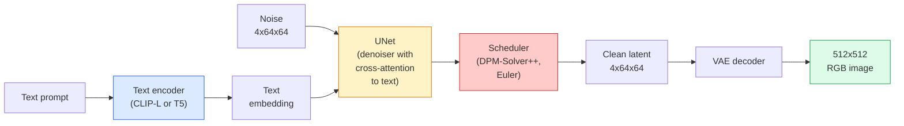

# Stable Diffusion — 架构与微调

> Stable Diffusion 是一种在预训练 VAE 的潜在空间中运行的 DDPM，通过交叉注意力以文本为条件，使用快速确定性 ODE 求解器进行采样，并由无分类器引导（classifier-free guidance）控制。

**类型：** 学习 + 使用
**语言：** Python
**前置知识：** 第 4 阶段第 10 课（扩散模型），第 7 阶段第 2 课（自注意力）
**时间：** ~75 分钟

## 学习目标

- 梳理 Stable Diffusion 流水线的五个组成部分：VAE、文本编码器、U-Net、调度器、安全检查器 —— 以及它们各自的作用
- 解释潜在扩散（latent diffusion）以及为什么在 4x64x64 的潜在空间中训练（而非 3x512x512 的图像）能在不损失质量的情况下将计算量减少 48 倍
- 使用 `diffusers` 生成图像，执行图生图、图像修复和 ControlNet 引导生成
- 在小型自定义数据集上使用 LoRA 微调 Stable Diffusion，并在推理时加载 LoRA 适配器

## 问题所在

直接在 512x512 RGB 图像上训练 DDPM 成本高昂。每一步训练都要通过 U-Net 反向传播，该 U-Net 接收 3x512x512 = 786,432 个输入值，而采样需要 50 多次前向传播穿过同一个 U-Net。以 Stable Diffusion 1.5（2022 年发布）的质量水平，像素空间扩散大约需要 256 个 GPU 月的训练时间，在消费级 GPU 上每张图像需要 10-30 秒。

使开源文本到图像模型变得可行的关键技术是**潜在扩散**（latent diffusion，Rombach 等人，CVPR 2022）。训练一个 VAE，将 3x512x512 的图像映射到 4x64x64 的潜在张量并反向还原，然后在该潜在空间中进行扩散。计算量降低为 `(3*512*512)/(4*64*64) = 48x`。在相同 GPU 上，采样时间从数十秒降至不到两秒。

几乎所有现代图像生成模型 —— SDXL、SD3、FLUX、HunyuanDiT、Wan-Video —— 都是潜在扩散模型，其变体体现在自编码器、去噪器（U-Net 或 DiT）和文本条件化方面。学会 Stable Diffusion，你就掌握了通用模板。

## 核心概念

### 流水线



- **VAE** —— 冻结的自编码器。编码器将图像转为潜在变量（用于图生图和训练）。解码器将潜在变量还原为图像。
- **文本编码器** —— CLIP 文本编码器（SD 1.x/2.x）、CLIP-L + CLIP-G（SDXL）或 T5-XXL（SD3/FLUX）。生成一系列 token 嵌入。
- **U-Net** —— 去噪器。包含交叉注意力层，在每个分辨率级别上从潜在变量关注文本嵌入。
- **调度器** —— 采样算法（DDIM、Euler、DPM-Solver++）。选择 sigma，将预测的噪声混合回潜在变量。
- **安全检查器** —— 对输出图像进行可选的 NSFW / 非法内容过滤。

### 无分类器引导（CFG）

纯文本条件化对每个提示 `c` 学习 `epsilon_theta(x_t, t, c)`。CFG 在训练同一网络时，10% 的时间丢弃 `c`（替换为空嵌入），使单个模型同时预测条件噪声和非条件噪声。推理时：

```
eps = eps_uncond + w * (eps_cond - eps_uncond)
```

`w` 是引导尺度。`w=0` 是无条件的，`w=1` 是纯条件的，`w>1` 以牺牲多样性为代价，推动输出"更贴合提示"。SD 默认值是 `w=7.5`。

CFG 是文本到图像能在生产质量下工作的关键。没有它，提示对输出的影响很弱；有了它，提示占主导地位。

### 潜在空间几何

VAE 的 4 通道潜在变量不仅仅是压缩图像。它是一个流形，其中的算术大致对应语义编辑（提示工程 + 插值都发生在这里），扩散 U-Net 在这里投入全部建模能力。解码随机 4x64x64 潜在变量不会产生随机外观的图像 —— 而是产生垃圾，因为只有特定的潜在变量子流形能解码为有效图像。

两个推论：

1. **图生图** = 将图像编码为潜在变量，添加部分噪声，运行去噪器，解码。图像结构得以保留，因为编码近似可逆；内容根据提示变化。
2. **图像修复** = 与图生图相同，但去噪器只更新遮罩区域；未遮罩区域保持编码后的潜在变量不变。

### U-Net 架构

SD U-Net 是第 10 课 TinyUNet 的大型版本，有三处新增：

- **Transformer 块** 位于每个空间分辨率，包含自注意力 + 对文本嵌入的交叉注意力。
- **时间嵌入** 通过正弦编码上的 MLP 实现。
- **跳跃连接** 在编码器和解码器的匹配分辨率之间。

SD 1.5 的总参数量：~860M。SDXL：~2.6B。FLUX：~12B。参数量的增长主要在注意力层。

### LoRA 微调

完整微调 Stable Diffusion 需要 20+ GB 显存，更新 860M 参数。LoRA（Low-Rank Adaptation，低秩适配）保持基础模型冻结，向注意力层注入小型秩分解矩阵。SD 的 LoRA 适配器通常为 10-50 MB，在单张消费级 GPU 上训练 10-60 分钟，推理时作为即插即用的修改加载。

```
Original: W_q : (d_in, d_out)   frozen
LoRA:     W_q + alpha * (A @ B)   where A : (d_in, r), B : (r, d_out)

r is typically 4-32.
```

LoRA 是几乎所有社区微调的分发方式。CivitAI 和 Hugging Face 托管了数百万个 LoRA 适配器。

### 常见调度器

- **DDIM** —— 确定性，~50 步，简单。
- **Euler ancestral** —— 随机性，30-50 步，采样略富创造性。
- **DPM-Solver++ 2M Karras** —— 确定性，20-30 步，生产默认。
- **LCM / TCD / Turbo** —— 一致性模型和蒸馏变体；1-4 步，牺牲部分质量。

在 `diffusers` 中更换调度器只需改一行代码，有时无需重新训练即可修复采样问题。

## 动手实践

本课全程使用 `diffusers`，而非从零重建 Stable Diffusion。需要重建的组件（VAE、文本编码器、U-Net、调度器）各自都是独立课题；这里的目标是熟练掌握生产级 API。

### 步骤 1：文生图

```python
import torch
from diffusers import StableDiffusionPipeline

pipe = StableDiffusionPipeline.from_pretrained(
    "runwayml/stable-diffusion-v1-5",
    torch_dtype=torch.float16,
).to("cuda")

image = pipe(
    prompt="a dog riding a skateboard in tokyo, studio ghibli style",
    guidance_scale=7.5,
    num_inference_steps=25,
    generator=torch.Generator("cuda").manual_seed(42),
).images[0]
image.save("dog.png")
```

`float16` 在无明显质量损失的情况下将显存减半。`num_inference_steps=25` 配合默认 DPM-Solver++ 与 `num_inference_steps=50` 配合 DDIM 效果相当。

### 步骤 2：更换调度器

```python
from diffusers import DPMSolverMultistepScheduler, EulerAncestralDiscreteScheduler

pipe.scheduler = DPMSolverMultistepScheduler.from_config(pipe.scheduler.config)
pipe.scheduler = EulerAncestralDiscreteScheduler.from_config(pipe.scheduler.config)
```

调度器状态与 U-Net 权重解耦。可以用 DDPM 训练，用任意调度器采样。

### 步骤 3：图生图

```python
from diffusers import StableDiffusionImg2ImgPipeline
from PIL import Image

img2img = StableDiffusionImg2ImgPipeline.from_pretrained(
    "runwayml/stable-diffusion-v1-5",
    torch_dtype=torch.float16,
).to("cuda")

init_image = Image.open("dog.png").convert("RGB").resize((512, 512))
out = img2img(
    prompt="a dog riding a skateboard, oil painting",
    image=init_image,
    strength=0.6,
    guidance_scale=7.5,
).images[0]
```

`strength` 控制去噪前添加多少噪声（0.0 = 不变，1.0 = 完全重生成）。0.5-0.7 是风格迁移的标准范围。

### 步骤 4：图像修复

```python
from diffusers import StableDiffusionInpaintPipeline

inpaint = StableDiffusionInpaintPipeline.from_pretrained(
    "runwayml/stable-diffusion-inpainting",
    torch_dtype=torch.float16,
).to("cuda")

image = Image.open("dog.png").convert("RGB").resize((512, 512))
mask = Image.open("dog_mask.png").convert("L").resize((512, 512))

out = inpaint(
    prompt="a cat",
    image=image,
    mask_image=mask,
    guidance_scale=7.5,
).images[0]
```

遮罩中的白色像素是需要重生成的区域。黑色像素被保留。

### 步骤 5：加载 LoRA

```python
pipe.load_lora_weights("sayakpaul/sd-lora-ghibli")
pipe.fuse_lora(lora_scale=0.8)

image = pipe(prompt="a village square in ghibli style").images[0]
```

`lora_scale` 控制强度；0.0 = 无效果，1.0 = 完整效果。`fuse_lora` 将适配器就地烘焙到权重中以提升速度，但无法更换。加载不同适配器前需调用 `pipe.unfuse_lora()`。

### 步骤 6：LoRA 训练（概览）

真正的 LoRA 训练在 `peft` 或 `diffusers.training` 中实现。大纲如下：

```python
# Pseudocode
for step, batch in enumerate(dataloader):
    images, prompts = batch
    latents = vae.encode(images).latent_dist.sample() * 0.18215

    t = torch.randint(0, num_train_timesteps, (batch_size,))
    noise = torch.randn_like(latents)
    noisy_latents = scheduler.add_noise(latents, noise, t)

    text_emb = text_encoder(tokenizer(prompts))

    pred_noise = unet(noisy_latents, t, text_emb)  # LoRA weights injected here

    loss = F.mse_loss(pred_noise, noise)
    loss.backward()
    optimizer.step()
```

只有 LoRA 矩阵接收梯度；基础 U-Net、VAE 和文本编码器保持冻结。batch size 为 1 并启用梯度检查点时，可在 8 GB 显存中运行。

## 实际应用

在生产环境中，你实际做出的决策：

- **模型系列**：SD 1.5 用于开源社区微调，SDXL 用于更高保真度，SD3 / FLUX 用于最先进效果和严格许可要求。
- **调度器**：DPM-Solver++ 2M Karras 用于 20-30 步，LCM-LoRA 用于延迟低于 1 秒时。
- **精度**：4080/4090 上使用 `float16`，A100 及更新显卡上使用 `bfloat16`，显存紧张时使用 `int8`（通过 `bitsandbytes` 或 `compel`）。
- **条件化**：纯文本即可；需要更强控制时，在基础流水线之上添加 ControlNet（canny、深度、姿态）。

对于批量生成，`AUTO1111` / `ComfyUI` 是社区工具；对于生产 API，使用 `diffusers` + `accelerate` 或 `optimum-nvidia` 配合 TensorRT 编译。

## 交付成果

本课产出：

- `outputs/prompt-sd-pipeline-planner.md` —— 一个提示，根据延迟预算、保真度目标和许可约束选择 SD 1.5 / SDXL / SD3 / FLUX 及调度器和精度。
- `outputs/skill-lora-training-setup.md` —— 一项技能，为自定义数据集编写完整 LoRA 训练配置，包括 caption、rank、batch size 和学习率。

## 练习

1. **（简单）** 使用 `guidance_scale` 在 `[1, 3, 5, 7.5, 10, 15]` 中生成相同提示。描述图像如何变化。在什么引导值下出现伪影？
2. **（中等）** 取任意真实照片，在 `[0.2, 0.4, 0.6, 0.8, 1.0]` 中使用 `StableDiffusionImg2ImgPipeline` 以 `strength` 运行。哪个强度在改变风格的同时保留构图？为什么 1.0 会完全忽略输入？
3. **（困难）** 在 10-20 张单一主题（宠物、logo、角色）图像上训练 LoRA，并生成包含该主题的新场景。报告在不过度拟合输入图像的情况下，实现最佳身份保持的 LoRA rank 和训练步数。

## 关键术语

| 术语 | 人们怎么说 | 实际含义 |
|------|-----------|---------|
| Latent diffusion | "在潜在变量中扩散" | 在 VAE 潜在空间（4x64x64）而非像素空间（3x512x512）中运行完整 DDPM；节省 48 倍计算量 |
| VAE scale factor | "0.18215" | 将 VAE 原始潜在变量重新缩放至大致单位方差的常数；在每个 SD 流水线中硬编码 |
| Classifier-free guidance | "CFG" | 混合条件和非条件噪声预测；最具影响力的推理旋钮 |
| Scheduler | "采样器" | 将噪声 + 模型预测转化为去噪潜在变量轨迹的算法 |
| LoRA | "低秩适配器" | 微调注意力层的小型秩分解矩阵，不触碰基础权重 |
| Cross-attention | "文本-图像注意力" | 从潜在 token 到文本 token 的注意力；在每个 U-Net 层级注入提示信息 |
| ControlNet | "结构条件化" | 单独训练的适配器，用额外输入（canny、深度、姿态、分割）引导 SD |
| DPM-Solver++ | "默认调度器" | 二阶确定性 ODE 求解器；2026 年在低步数（20-30）下最佳质量 |

## 延伸阅读

- [High-Resolution Image Synthesis with Latent Diffusion (Rombach et al., 2022)](https://arxiv.org/abs/2112.10752) —— Stable Diffusion 论文；包含证明设计合理性的所有消融实验
- [Classifier-Free Diffusion Guidance (Ho & Salimans, 2022)](https://arxiv.org/abs/2207.12598) —— CFG 论文
- [LoRA: Low-Rank Adaptation of Large Language Models (Hu et al., 2021)](https://arxiv.org/abs/2106.09685) —— LoRA 最初用于 NLP；迁移到 SD 时几乎无需改动
- [diffusers documentation](https://huggingface.co/docs/diffusers) —— 每个 SD / SDXL / SD3 / FLUX 流水线的参考文档
