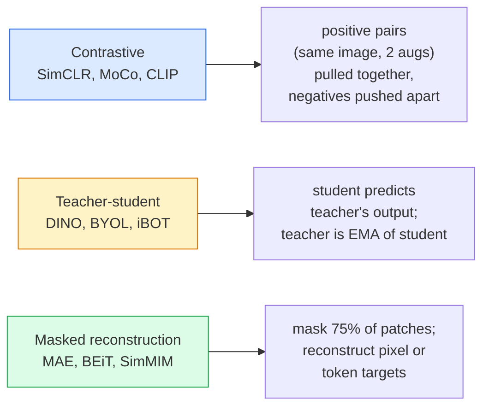

# 自监督视觉 — SimCLR、DINO、MAE

> 标签是监督视觉的瓶颈。自监督预训练将其移除：从 1 亿张无标签图像中学习视觉特征，再在 1 万张有标签图像上微调。

**类型：** 学习 + 构建
**语言：** Python
**前置知识：** 阶段 4 第 04 课（图像分类）、阶段 4 第 14 课（ViT）
**时间：** ~75 分钟

## 学习目标

- 梳理三大自监督方法家族 — 对比学习（SimCLR）、教师-学生（DINO）、掩码重建（MAE）— 并说明每种方法优化的目标
- 从零实现 InfoNCE 损失，并解释为什么 batch size 为 512 可以工作而 32 会失败
- 解释为什么 MAE 的 75% 掩码比例并非随意设定，以及它与 BERT 在文本上使用的 15% 有何不同
- 使用 DINOv2 或 MAE 的 ImageNet 检查点进行线性探测和零样本检索

## 问题背景

监督式 ImageNet 有 130 万张标注图像，估计标注成本为 1000 万美元。医学和工业数据集规模更小，标注成本更高。每个视觉团队都在问：能否在廉价的无标签数据上预训练 — YouTube 帧、网络爬取、摄像头画面、卫星扫描 — 然后在少量有标签数据上微调？

自监督学习就是答案。在 LAION 或 JFT 上训练的现代自监督 ViT，微调后达到或超过监督式 ImageNet 的准确率。它在下游任务（检测、分割、深度估计）上的迁移效果也比监督预训练更好。DINOv2（Meta，2023）和 MAE（Meta，2022）是目前可迁移视觉特征的生产默认选择。

核心概念转变在于：代理任务（pretext task）— 即模型被训练去做的任务 — 不必是下游任务。重要的是它迫使模型学习有用的特征。预测灰度图像的颜色、旋转图像并让模型分类旋转角度、掩码图像块并重建它们 — 这些方法都曾奏效。三种能够规模化的是对比学习、教师-学生蒸馏和掩码重建。

## 核心概念

### 三大方法家族



### 对比学习（SimCLR）

取一张图像，应用两种随机增强，得到两个视图。将两者输入同一个编码器加投影头。最小化一个损失，该损失表示"这两个嵌入应该接近"且"这个嵌入应该与 batch 中所有其他图像的嵌入远离"。

```
Loss for positive pair (z_i, z_j) among 2N views per batch:

   L_ij = -log( exp(sim(z_i, z_j) / tau) / sum_k in batch \ {i} exp(sim(z_i, z_k) / tau) )

sim = cosine similarity
tau = temperature (0.1 standard)
```

这就是 InfoNCE 损失。它需要大量负样本，因此 batch size 很关键 — SimCLR 需要 512-8192。MoCo 引入了过去 batch 的动量队列，将负样本数量与 batch size 解耦。

### 教师-学生（DINO）

两个相同架构的网络：学生网络和教师网络。教师网络是学生网络权重的指数移动平均（EMA）。两者都看到图像的增强视图。训练学生网络的输出匹配教师网络的输出 — 没有显式的负样本。

```
loss = CE( student_output(view_1),  teacher_output(view_2) )
     + CE( student_output(view_2),  teacher_output(view_1) )

teacher_weights = m * teacher_weights + (1 - m) * student_weights   (m ≈ 0.996)
```

为什么它不会坍缩为"预测常数"：教师网络的输出经过中心化处理（减去各维度均值）和锐化处理（除以较小的温度参数）。中心化防止某一维度主导；锐化防止输出坍缩为均匀分布。

DINOv2 是 DINO 的规模化版本，在 1.42 亿张精选图像上训练。其生成的特征是目前零样本视觉检索和密集预测的最先进水平。

### 掩码重建（MAE）

对 ViT 输入掩码 75% 的图像块。仅将可见的 25% 输入编码器。一个轻量解码器接收编码器输出加上掩码位置的掩码标记，并被训练来重建被掩码图像块的像素。

```
Encoder:  visible 25% of patches -> features
Decoder:  features + mask tokens at masked positions -> reconstructed pixels
Loss:     MSE between reconstructed and original pixels on masked patches only
```

使 MAE 有效的关键设计选择：

- **75% 掩码比例** — 很高。迫使编码器学习语义特征；重建 25% 会过于简单（相邻像素高度相关，CNN 可以轻松完成）。
- **非对称编码器/解码器** — 大型 ViT 编码器仅看到可见图像块；轻量解码器（8 层，512 维）处理重建。比朴素的 BEiT 快 3 倍。
- **像素空间重建目标** — 比 BEiT 的 token 化目标更简单，在 ViT 上效果更好。

预训练后，丢弃解码器。编码器即为特征提取器。

### 为什么是 75% 而不是 15%

BERT 掩码 15% 的 token。MAE 掩码 75%。差异在于信息密度。

- 自然语言每个 token 的熵很高。预测 15% 的 token 仍然困难，因为每个掩码位置都有很多合理的补全。
- 图像块的熵很低 — 未掩码的邻域往往几乎完全确定了掩码图像块的像素。要让预测需要语义理解，必须激进地掩码。

75% 足够高，简单的空间外推无法解决任务；编码器必须表征图像内容。

### 线性探测评估

自监督预训练后，标准评估是**线性探测**：冻结编码器，在 ImageNet 标签上训练顶层线性分类器。报告 top-1 准确率。

- SimCLR ResNet-50: ~71% (2020)
- DINO ViT-S/16: ~77% (2021)
- MAE ViT-L/16: ~76% (2022)
- DINOv2 ViT-g/14: ~86% (2023)

线性探测是特征质量的纯粹度量；微调通常增加 2-5 个百分点，但也混入了头部重新训练的影响。

## 动手构建

### 步骤 1：双视图增强流水线

```python
import torch
import torchvision.transforms as T

two_view_train = lambda: T.Compose([
    T.RandomResizedCrop(96, scale=(0.2, 1.0)),
    T.RandomHorizontalFlip(),
    T.ColorJitter(0.4, 0.4, 0.4, 0.1),
    T.RandomGrayscale(p=0.2),
    T.ToTensor(),
])


class TwoViewDataset(torch.utils.data.Dataset):
    def __init__(self, base):
        self.base = base
        self.aug = two_view_train()

    def __len__(self):
        return len(self.base)

    def __getitem__(self, i):
        img, _ = self.base[i]
        v1 = self.aug(img)
        v2 = self.aug(img)
        return v1, v2
```

每个 `__getitem__` 返回同一张图像的两个增强视图；不需要标签。

### 步骤 2：InfoNCE 损失

```python
import torch.nn.functional as F

def info_nce(z1, z2, tau=0.1):
    """
    z1, z2: (N, D) L2-normalised embeddings of paired views
    """
    N, D = z1.shape
    z = torch.cat([z1, z2], dim=0)  # (2N, D)
    sim = z @ z.T / tau              # (2N, 2N)

    mask = torch.eye(2 * N, dtype=torch.bool, device=z.device)
    sim = sim.masked_fill(mask, float("-inf"))

    targets = torch.cat([torch.arange(N, 2 * N), torch.arange(0, N)]).to(z.device)
    return F.cross_entropy(sim, targets)
```

调用前对嵌入进行 L2 归一化。`tau=0.1` 是 SimCLR 默认值；更低的温度使损失更尖锐，需要更多负样本。

### 步骤 3：InfoNCE  sanity check

```python
z1 = F.normalize(torch.randn(16, 32), dim=-1)
z2 = z1.clone()
loss_same = info_nce(z1, z2, tau=0.1).item()
z2_random = F.normalize(torch.randn(16, 32), dim=-1)
loss_random = info_nce(z1, z2_random, tau=0.1).item()
print(f"InfoNCE with identical pairs:  {loss_same:.3f}")
print(f"InfoNCE with random pairs:     {loss_random:.3f}")
```

相同图像对应应该给出低损失（大 batch 和低温时接近 0）。随机图像对应给出 log(2N-1) = ~log(31) = ~3.4，使用 16 对 batch。

### 步骤 4：MAE 风格掩码

```python
def random_mask_indices(num_patches, mask_ratio=0.75, seed=0):
    g = torch.Generator().manual_seed(seed)
    n_keep = int(num_patches * (1 - mask_ratio))
    perm = torch.randperm(num_patches, generator=g)
    visible = perm[:n_keep]
    masked = perm[n_keep:]
    return visible.sort().values, masked.sort().values


num_patches = 196
visible, masked = random_mask_indices(num_patches, mask_ratio=0.75)
print(f"visible: {len(visible)} / {num_patches}")
print(f"masked:  {len(masked)} / {num_patches}")
```

简单、快速，对给定种子是确定性的。真实 MAE 实现会将其 batch 化并保持每样本掩码。

## 实际应用

DINOv2 是 2026 年的生产标准：

```python
import torch
from transformers import AutoImageProcessor, AutoModel

processor = AutoImageProcessor.from_pretrained("facebook/dinov2-base")
model = AutoModel.from_pretrained("facebook/dinov2-base")
model.eval()

# Per-image embeddings for zero-shot retrieval
with torch.no_grad():
    inputs = processor(images=[pil_image], return_tensors="pt")
    outputs = model(**inputs)
    embedding = outputs.last_hidden_state[:, 0]  # CLS token
```

生成的 768 维嵌入是现代图像检索、密集对应和零样本迁移流水线的骨干。在下游任务上微调通常只需要线性头部。

对于图像-文本嵌入，等效的是 SigLIP 或 OpenCLIP；对于 MAE 风格微调，`timm` 仓库提供了所有 MAE 检查点。

## 交付产出

本课程产出：

- `outputs/prompt-ssl-pretraining-picker.md` — 一个根据数据集大小、计算资源和下游任务选择 SimCLR / MAE / DINOv2 的提示词。
- `outputs/skill-linear-probe-runner.md` — 一个为任何冻结编码器 + 有标签数据集编写线性探测评估的技能。

## 练习题

1. **（简单）** 验证当温度降低时，对齐良好的嵌入的 InfoNCE 损失下降，而随机嵌入的损失上升。绘制 `tau in [0.05, 0.1, 0.2, 0.5]` 与损失的关系图。
2. **（中等）** 实现 DINO 风格的中心缓冲。展示没有中心化时，学生网络在几个 epoch 内坍缩为常数向量。
3. **（困难）** 使用第 10 课的 TinyUNet 作为骨干，在 CIFAR-100 上训练 MAE。报告 10、50 和 200 epoch 时的线性探测准确率。证明在相同的 1000 张图像子集上，MAE 预训练的线性探测优于从头训练的监督线性探测。

## 关键术语

| 术语 | 人们怎么说 | 实际含义 |
|------|-----------|---------|
| Self-supervised | "无标签" | 一种代理任务，从无标签数据中产生有用的表征 |
| Pretext task | "假任务" | SSL 期间使用的目标（重建图像块、匹配视图）；预训练后丢弃 |
| Linear probe | "冻结编码器 + 线性头部" | 标准 SSL 评估：仅在冻结特征上训练线性分类器 |
| InfoNCE | "对比损失" | 余弦相似度的 softmax；正样本对是目标类，其他都是负样本 |
| EMA teacher | "移动平均教师" | 权重为学生网络指数移动平均的教师网络；BYOL、MoCo、DINO 使用 |
| Mask ratio | "隐藏图像块的百分比" | MAE 期间掩码的图像块比例；视觉 75%，文本 15% |
| Representation collapse | "常数输出" | SSL 失败模式，编码器对所有输入输出常数向量；通过中心化、锐化或负样本防止 |
| DINOv2 | "生产 SSL 骨干" | Meta 2023 年的自监督 ViT；2026 年最强的通用图像特征 |

## 延伸阅读

- [SimCLR (Chen et al., 2020)](https://arxiv.org/abs/2002.05709) — 对比学习参考
- [DINO (Caron et al., 2021)](https://arxiv.org/abs/2104.14294) — 动量、中心化、锐化的教师-学生方法
- [MAE (He et al., 2022)](https://arxiv.org/abs/2111.06377) — ViT 的掩码自编码器预训练
- [DINOv2 (Oquab et al., 2023)](https://arxiv.org/abs/2304.07193) — 将自监督 ViT 规模化到生产特征
