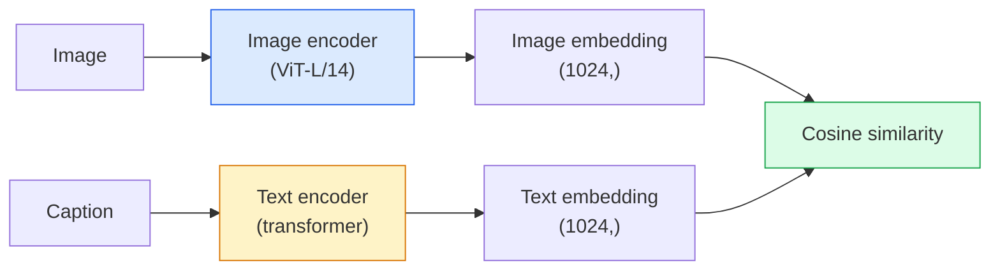

# 开放词汇视觉 — CLIP

> 同时训练一个图像编码器和一个文本编码器，使得匹配的（图像，标题）对在共享空间中落到同一点。这就是全部诀窍。

**类型：** 构建 + 使用
**语言：** Python
**前置知识：** Phase 4 第 14 课 (ViT), Phase 4 第 17 课 (自监督)
**时间：** ~45 分钟

## 学习目标

- 解释 CLIP 的双塔架构和对比训练目标
- 使用预训练 CLIP（或 SigLIP）进行零样本分类，无需任何任务特定训练
- 从零实现零样本分类：编码类别提示、计算余弦相似度、取 argmax
- 区分 CLIP、SigLIP、OpenCLIP 以及 LLaVA/LLaMA-vision 模型 —— 2026 年各自的应用场景

## 问题

传统分类器是封闭词汇的：1000 类的 ImageNet 模型只能预测 1000 个标签。每个新类别都需要标注数据和重新训练分类头。

CLIP（Radford 等，OpenAI 2021）表明，在从网络抓取的 4 亿（图像，标题）对上训练，可以产生一个能够在推理时对任意类别集合进行分类的模型，这些类别完全用自然语言描述。你通过写一句话来给它一个新类别。

这种能力 —— 零样本迁移 —— 就是为什么每个现代视觉系统都以 CLIP 家族检查点为起点。检测（Grounding DINO、OWL-ViT）、分割（CLIPSeg、SAM）、检索、内容审核、VLM 和文生图都建立在 CLIP 风格的联合嵌入之上。

## 概念

### 双塔



两个编码器最后都通过线性投影到相同的嵌入维度（CLIP-B/32 为 512，CLIP-L/14 为 1024）。进行 L2 归一化并计算余弦相似度。

### 目标

给定 N 个（图像，标题）对的 batch，构建一个 N×N 的相似度矩阵。训练两个编码器，使得对角线（匹配对）具有高相似度，而非对角线（不匹配对）具有低相似度。

```
sim_matrix = image_embeddings @ text_embeddings.T / tau

loss_i2t = cross_entropy(sim_matrix,       targets=arange(N))
loss_t2i = cross_entropy(sim_matrix.T,     targets=arange(N))
loss = (loss_i2t + loss_t2i) / 2
```

对称的，因为图像到文本和文本到图像的检索都应该有效。`tau`（温度）通常作为标量参数学习，初始化为 0.07。

### SigLIP：更好的损失

SigLIP（Zhai 等，2023）将 softmax 替换为逐对 sigmoid：

```
loss = mean over pairs of log(1 + exp(-y_ij * sim_ij))
y_ij = +1 if matching, -1 otherwise
```

逐对损失去除了 CLIP 所需的 batch 级归一化。SigLIP 在小 batch size 下训练效果更好，在同等数据量下达到或超过 CLIP。

### 零样本分类

给定训练好的 CLIP：

1. 对每个类别，构造提示："a photo of a {class}"。
2. 用文本编码器编码所有类别提示 -> `T` 形状 (C, d)。
3. 编码测试图像 -> `I` 形状 (1, d)。
4. 相似度 = `I @ T.T` 形状 (1, C)。
5. Argmax -> 预测类别。

提示工程很重要。OpenAI 发布了 80 个 ImageNet 提示模板（"a photo of a {}"、"a blurry photo of a {}"、"a sketch of a {}"，...）。对每个类别所有模板的嵌入取平均，可额外提升 1-3% 的 top-1 准确率。

### 2026 年 CLIP 风格模型的应用场景

- **零样本分类** — 直接使用。
- **图像检索** — 一次性编码所有图像，推理时嵌入查询。
- **文本条件检测** — Grounding DINO、OWL-ViT 将 CLIP 文本塔包裹在检测器周围。
- **文本条件分割** — CLIPSeg；SAM 通过 CLIP 使用文本提示输入。
- **VLM** — LLaVA、Qwen-VL、InternVL 将 CLIP 家族视觉编码器接入 LLM。
- **文生图** — Stable Diffusion、DALL-E 3 以 CLIP 文本嵌入为条件。

一旦有了共享嵌入空间，每个视觉+语言任务都变成了距离计算。

## 构建

### 步骤 1：一个微型双塔模型

真实 CLIP 是 ViT + transformer。本课中塔是小 MLP，基于预提取特征，以便在 CPU 上可见训练信号。

```python
import torch
import torch.nn as nn
import torch.nn.functional as F


class TwoTower(nn.Module):
    def __init__(self, img_in=128, txt_in=64, emb=64):
        super().__init__()
        self.image_proj = nn.Sequential(nn.Linear(img_in, 128), nn.ReLU(), nn.Linear(128, emb))
        self.text_proj = nn.Sequential(nn.Linear(txt_in, 128), nn.ReLU(), nn.Linear(128, emb))
        self.logit_scale = nn.Parameter(torch.ones([]) * 2.6592)  # ln(1/0.07)

    def forward(self, img_feats, txt_feats):
        i = F.normalize(self.image_proj(img_feats), dim=-1)
        t = F.normalize(self.text_proj(txt_feats), dim=-1)
        return i, t, self.logit_scale.exp()
```

两个投影，共享维度输出，可学习温度。与真实 CLIP API 形状相同。

### 步骤 2：对比损失

```python
def clip_loss(image_emb, text_emb, logit_scale):
    N = image_emb.size(0)
    sim = logit_scale * image_emb @ text_emb.T
    targets = torch.arange(N, device=sim.device)
    l_i = F.cross_entropy(sim, targets)
    l_t = F.cross_entropy(sim.T, targets)
    return (l_i + l_t) / 2
```

对称的。更高的 logit_scale = 更锐利的 softmax = 更自信但有不稳定风险。

### 步骤 3：零样本分类器

```python
@torch.no_grad()
def zero_shot_classify(model, image_feats, class_text_feats, class_names):
    """
    image_feats:      (N, img_in)
    class_text_feats: (C, txt_in)   one averaged embedding per class
    """
    i = F.normalize(model.image_proj(image_feats), dim=-1)
    t = F.normalize(model.text_proj(class_text_feats), dim=-1)
    sim = i @ t.T
    pred = sim.argmax(dim=-1)
    return [class_names[p] for p in pred.tolist()]
```

每步一行。这与生产级 CLIP 检查点使用的零样本流程完全一致。

### 步骤 4：合理性检查

```python
torch.manual_seed(0)
model = TwoTower()

img = torch.randn(8, 128)
txt = torch.randn(8, 64)
i, t, scale = model(img, txt)
loss = clip_loss(i, t, scale)
print(f"batch size: {i.size(0)}   loss: {loss.item():.3f}")
```

对于随机初始化的模型，损失应接近 `log(N) = log(8) = 2.08` —— 尚未学到任何结构时的对称交叉熵目标。

## 使用

OpenCLIP 是 2026 年的社区默认选择：

```python
import open_clip
import torch
from PIL import Image

model, _, preprocess = open_clip.create_model_and_transforms("ViT-B-32", pretrained="laion2b_s34b_b79k")
tokenizer = open_clip.get_tokenizer("ViT-B-32")

image = preprocess(Image.open("dog.jpg")).unsqueeze(0)
text = tokenizer(["a photo of a dog", "a photo of a cat", "a photo of a car"])

with torch.no_grad():
    image_features = model.encode_image(image)
    text_features = model.encode_text(text)
    image_features = image_features / image_features.norm(dim=-1, keepdim=True)
    text_features = text_features / text_features.norm(dim=-1, keepdim=True)
    probs = (100.0 * image_features @ text_features.T).softmax(dim=-1)

print(probs)
```

SigLIP 更新，在小规模下训练更好，新工作更倾向使用：`google/siglip-base-patch16-224`。Hugging Face 同时提供两者。

## 交付

本课产出：

- `outputs/prompt-zero-shot-class-picker.md` — 一个给定类别列表和领域时，为零样本 CLIP 设计类别模板的提示。
- `outputs/skill-image-text-retriever.md` — 一个使用任意 CLIP 检查点构建图像嵌入索引的技能，支持文本查询和图像查询。

## 练习

1. **（简单）** 使用预训练 OpenCLIP ViT-B/32，用 80 模板提示集对 CIFAR-10 进行零样本分类。报告 top-1 准确率；应在 85-90% 左右。
2. **（中等）** 在同一 CIFAR-10 任务上比较单模板（"a photo of a {}"）与 80 模板平均嵌入。量化差距并解释模板为何有帮助。
3. **（困难）** 构建零样本图像检索索引：用 CLIP 嵌入 1,000 张图像，构建 FAISS 索引，用自然语言描述查询。报告 20 个手写查询的检索 recall@5。

## 关键术语

| 术语 | 人们怎么说 | 实际含义 |
|------|-----------|---------|
| Two-tower | "Dual encoder" | 独立的图像和文本编码器，最后以共享维度投影头结束 |
| Zero-shot | "No task-specific training" | 仅在推理时用文本描述类别进行分类；未接触任何标签 |
| Temperature / logit_scale | "tau" | 可学习标量，在 softmax 前缩放相似度矩阵 |
| Prompt template | "A photo of a {}" | 类别名称的自然语言包装；多模板平均可提升零样本准确率 |
| CLIP | "Image+text model" | 2021 年 OpenAI 模型；2026 年该领域的通用词汇 |
| SigLIP | "Sigmoid CLIP" | 将 softmax 替换为逐对 sigmoid；小 batch 下训练更好 |
| OpenCLIP | "Open reproduction" | 社区在 LAION 上训练的 CLIP 变体；开源 pipeline 的生产默认 |
| VLM | "Vision-language model" | CLIP 家族编码器 + LLM，训练用于回答图像相关问题 |

## 延伸阅读

- [CLIP: Learning Transferable Visual Models from Natural Language Supervision (Radford et al., 2021)](https://arxiv.org/abs/2103.00020)
- [SigLIP: Sigmoid Loss for Language-Image Pre-Training (Zhai et al., 2023)](https://arxiv.org/abs/2303.15343)
- [OpenCLIP](https://github.com/mlfoundations/open_clip) — 社区代码库
- [DINOv2 vs CLIP vs MAE: a features comparison](https://huggingface.co/blog/dinov2) — HF 指南，含并排使用场景
