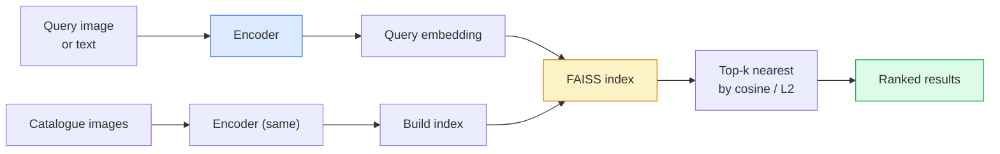

# 图像检索与度量学习

> 检索系统通过在嵌入空间中的距离对候选结果进行排序。度量学习是塑造该空间，使距离符合你期望的学科。

**类型：** Build
**语言：** Python
**前置知识：** Phase 4 Lesson 14 (ViT), Phase 4 Lesson 18 (CLIP)
**时间：** ~45 分钟

## 学习目标

- 解释三元组、对比和基于代理的度量学习损失，并为给定数据集选择合适的一种
- 正确实现 L2 归一化和余弦相似度，并区分"同一物品"和"同一类别"检索
- 构建 FAISS 索引，通过文本和图像进行查询，并对保留的查询集报告 recall@K
- 使用 DINOv2、CLIP 和 SigLIP 作为现成的嵌入骨干网络，并了解各自的优势场景

## 问题背景

检索在生产级视觉系统中无处不在：重复检测、反向图像搜索、视觉搜索（"查找相似产品"）、人脸再识别、监控中的人体重识别、电商中的实例级匹配。产品问题始终相同："给定这张查询图像，为我的目录排序。"

两个设计决策决定了整个系统。嵌入——什么模型生成向量。索引——如何在大规模下找到最近邻。两者在 2026 年都已是成熟技术（DINOv2 用于嵌入，FAISS 用于索引），这提高了门槛：困难的部分是定义你的应用中*什么算相似*，然后塑造嵌入空间使距离与之匹配。

这种塑造就是度量学习。它是一个小而高杠杆的学科。

## 核心概念

### 检索概览



### 四大损失函数家族

| 损失 | 需要 | 优点 | 缺点 |
|------|------|------|------|
| **Contrastive** | (anchor, positive) + negatives | 简单，适用于任何成对标签 | 没有大量负样本时收敛慢 |
| **Triplet** | (anchor, positive, negative) | 直观；可直接控制 margin | 难三元组挖掘计算昂贵 |
| **NT-Xent / InfoNCE** | 成对样本 + batch 内挖掘的负样本 | 可扩展到大 batch | 需要大 batch 或动量队列 |
| **Proxy-based (ProxyNCA)** | 仅需类别标签 | 快速、稳定、无需挖掘 | 在小数据集上可能过拟合到代理 |

对于大多数生产用例，从预训练骨干网络开始，仅在现成的嵌入在测试集上表现不佳时，才添加度量学习微调。

### 三元组损失的形式化

```
L = max(0, ||f(a) - f(p)||^2 - ||f(a) - f(n)||^2 + margin)
```

将 anchor `a` 拉近 positive `p`，推远 negative `n`，通过 `margin` 确保间隔。三图像结构可推广到任意相似性排序。

挖掘至关重要：简单三元组（`n` 已经远离 `a`）贡献零损失；只有难三元组才能教会网络。半难挖掘（`n` 比 `p` 更远但在 margin 内）是 2016 年 FaceNet 的配方，至今仍占主导。

### 余弦相似度 vs L2

两种度量，两种惯例：

- **Cosine**：向量之间的夹角。需要 L2 归一化的嵌入。
- **L2**：欧几里得距离。适用于原始或归一化嵌入，但通常与 L2 归一化 + 平方 L2 配对使用。

对于大多数现代网络，两者等价：`||a - b||^2 = 2 - 2 cos(a, b)` 当 `||a|| = ||b|| = 1` 时。选择与你嵌入训练匹配的惯例；混用它们会静默改变"最近"的含义。

### Recall@K

标准检索指标：

```
recall@K = fraction of queries where at least one correct match is in the top K results
```

并排报告 recall@1、@5、@10。recall@10 高于 0.95 而 recall@1 低于 0.5 意味着嵌入空间结构正确但排序有噪声——尝试更长的微调或重排序步骤。

对于重复检测，precision@K 更重要，因为每个假阳性都是用户可见的错误。对于视觉搜索，recall@K 是产品信号。

### FAISS 简介

Facebook AI Similarity Search。最近邻搜索的事实标准库。三种索引选择：

- `IndexFlatIP` / `IndexFlatL2` —— 暴力搜索，精确，无需训练。适用于 ~1M 向量以内。
- `IndexIVFFlat` —— 划分为 K 个单元，仅搜索最近的几个单元。近似，快速，需要训练数据。
- `IndexHNSW` —— 基于图，对大量查询最快，索引体积大。

对于 100k 向量，你可能想要 `IndexFlatIP` 基于余弦相似度。对于 10M，想要 `IndexIVFFlat`。对于 100M+ 结合乘积量化（`IndexIVFPQ`）。

### 实例级 vs 类别级检索

两个名称相同但截然不同的问题：

- **Category-level** —— "在我的目录中找猫。"类别条件相似性；现成的 CLIP / DINOv2 嵌入效果很好。
- **Instance-level** —— "在我的目录中找到*这个确切的产品*。"需要对同一类别中视觉相似的物体进行细粒度区分；现成的嵌入表现不佳；度量学习微调至关重要。

在选择模型之前，务必先明确你要解决的是哪一种。

## 动手实现

### Step 1: 三元组损失

```python
import torch
import torch.nn.functional as F

def triplet_loss(anchor, positive, negative, margin=0.2):
    d_ap = F.pairwise_distance(anchor, positive, p=2)
    d_an = F.pairwise_distance(anchor, negative, p=2)
    return F.relu(d_ap - d_an + margin).mean()
```

一行代码。适用于 L2 归一化或原始嵌入。

### Step 2: 半难挖掘

给定一批嵌入和标签，为每个 anchor 找到最难的半难负样本。

```python
def semi_hard_negatives(emb, labels, margin=0.2):
    dist = torch.cdist(emb, emb)
    same_class = labels[:, None] == labels[None, :]
    diff_class = ~same_class
    N = emb.size(0)

    positives = dist.clone()
    positives[~same_class] = float("-inf")
    positives.fill_diagonal_(float("-inf"))
    pos_idx = positives.argmax(dim=1)

    semi_hard = dist.clone()
    semi_hard[same_class] = float("inf")
    d_ap = dist[torch.arange(N), pos_idx].unsqueeze(1)
    semi_hard[dist <= d_ap] = float("inf")
    neg_idx = semi_hard.argmin(dim=1)

    fallback_mask = semi_hard[torch.arange(N), neg_idx] == float("inf")
    if fallback_mask.any():
        hardest = dist.clone()
        hardest[same_class] = float("inf")
        neg_idx = torch.where(fallback_mask, hardest.argmin(dim=1), neg_idx)
    return pos_idx, neg_idx
```

每个 anchor 获得同类中最难的正样本，以及一个比正样本更远但在 margin 内的半难负样本。

### Step 3: Recall@K

```python
def recall_at_k(query_emb, gallery_emb, query_labels, gallery_labels, k=1):
    sim = query_emb @ gallery_emb.T
    _, top_k = sim.topk(k, dim=-1)
    matches = (gallery_labels[top_k] == query_labels[:, None]).any(dim=-1)
    return matches.float().mean().item()
```

L2 归一化嵌入上的内积 top-k 等价于余弦 top-k。报告至少有一个正确邻居的查询比例均值。

### Step 4: 整合

```python
import torch
import torch.nn as nn
from torch.optim import Adam

class Encoder(nn.Module):
    def __init__(self, in_dim=128, emb_dim=64):
        super().__init__()
        self.net = nn.Sequential(
            nn.Linear(in_dim, 128), nn.ReLU(),
            nn.Linear(128, emb_dim),
        )

    def forward(self, x):
        return F.normalize(self.net(x), dim=-1)

torch.manual_seed(0)
num_classes = 6
protos = F.normalize(torch.randn(num_classes, 128), dim=-1)

def sample_batch(bs=32):
    labels = torch.randint(0, num_classes, (bs,))
    x = protos[labels] + 0.15 * torch.randn(bs, 128)
    return x, labels

enc = Encoder()
opt = Adam(enc.parameters(), lr=3e-3)

for step in range(200):
    x, y = sample_batch(32)
    emb = enc(x)
    pos_idx, neg_idx = semi_hard_negatives(emb, y)
    loss = triplet_loss(emb, emb[pos_idx], emb[neg_idx])
    opt.zero_grad(); loss.backward(); opt.step()
```

经过几百步后，嵌入聚类形成每个类别一个簇。

## 实际应用

2026 年的生产栈：

- **DINOv2 + FAISS** —— 通用视觉检索。开箱即用。
- **CLIP + FAISS** —— 查询为文本时。
- **Fine-tuned DINOv2 + FAISS** —— 实例级检索、人脸再识别、时尚、电商。
- **Milvus / Weaviate / Qdrant** —— FAISS 或 HNSW 的托管向量数据库封装。

对于 SOTA 实例检索，配方是：DINOv2 骨干网络，添加嵌入头，用实例标记的三元组或 InfoNCE 损失微调，在 FAISS 中建立索引。

## 交付成果

本课产出：

- `outputs/prompt-retrieval-loss-picker.md` —— 一个为给定检索问题选择 triplet / InfoNCE / ProxyNCA 的 prompt。
- `outputs/skill-recall-at-k-runner.md` —— 一个编写 recall@K 干净评估框架的 skill，包含 train/val/gallery 划分和合适的数据契约。

## 练习

1. **(Easy)** 运行上面的 toy 示例。用 PCA 绘制训练前后的嵌入，观察六个簇的形成。
2. **(Medium)** 添加 ProxyNCA 损失实现：每个类别一个可学习的"代理"，在余弦相似度上做标准交叉熵。与 triplet loss 在 toy 数据上比较收敛速度。
3. **(Hard)** 取 1,000 张 ImageNet 验证图像，通过 HuggingFace 用 DINOv2 嵌入，构建 FAISS flat 索引，报告对相同图像作为查询的 recall@{1, 5, 10}（应为 1.0），以及对保留划分以 ImageNet 标签为真值的 recall@{1, 5, 10}。

## 关键术语

| 术语 | 人们常说的 | 实际含义 |
|------|-----------|---------|
| Metric learning | "塑造空间" | 训练编码器，使其输出空间中的距离反映目标相似性 |
| Triplet loss | "拉近推远" | L = max(0, d(a, p) - d(a, n) + margin)；度量学习的经典损失 |
| Semi-hard mining | "有用的负样本" | 比正样本离 anchor 更远但在 margin 内的负样本；经验上信息量最大 |
| Proxy-based loss | "类别原型" | 每个类别一个可学习代理；对代理相似度做交叉熵；无需成对挖掘 |
| Recall@K | "Top-K 命中率" | 在 top K 中至少有一个正确结果的查询比例 |
| Instance retrieval | "找到这个确切的东西" | 细粒度匹配；现成特征通常表现不佳 |
| FAISS | "那个 NN 库" | Facebook 的最近邻库；支持精确和近似索引 |
| HNSW | "图索引" | Hierarchical navigable small world；快速近似 NN，内存开销小 |

## 延伸阅读

- [FaceNet: A Unified Embedding for Face Recognition (Schroff et al., 2015)](https://arxiv.org/abs/1503.03832) —— 三元组损失 / 半难挖掘论文
- [In Defense of the Triplet Loss for Person Re-Identification (Hermans et al., 2017)](https://arxiv.org/abs/1703.07737) —— 三元组微调实践指南
- [FAISS documentation](https://github.com/facebookresearch/faiss/wiki) —— 每个索引，每个权衡
- [SMoT: Metric Learning Taxonomy (Kim et al., 2021)](https://arxiv.org/abs/2010.06927) —— 现代损失及其关联综述
