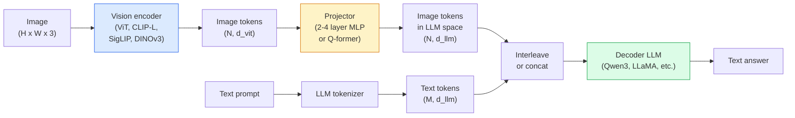

# 视觉-语言模型 —— ViT-MLP-LLM 模式

> 视觉编码器将图像转换为 token。MLP 投影器将这些 token 映射到 LLM 的嵌入空间。语言模型完成其余工作。这个模式 —— ViT-MLP-LLM —— 是 2026 年所有生产级 VLM 的基础。

**类型：** 学习 + 使用
**语言：** Python
**前置知识：** 阶段 4 第 14 课 (ViT), 阶段 4 第 18 课 (CLIP), 阶段 7 第 02 课 (Self-Attention)
**时间：** ~75 分钟

## 学习目标

- 阐述 ViT-MLP-LLM 架构，并解释三个组件各自的作用
- 对比 Qwen3-VL、InternVL3.5、LLaVA-Next 和 GLM-4.6V 在参数量、上下文长度和基准测试性能方面的差异
- 解释 DeepStack：为什么多层级 ViT 特征比单层最后一层特征更能紧密对齐视觉-语言
- 使用跨模态错误率 (CMER) 在生产环境中测量 VLM 幻觉，并根据信号采取行动

## 问题

CLIP（阶段 4 第 18 课）为图像和文本提供了共享的嵌入空间，足以进行零样本分类和检索。但它无法回答"这张图片里有多少辆红色汽车？"，因为 CLIP 不生成文本 —— 它只计算相似度分数。

视觉-语言模型 (VLMs) —— Qwen3-VL、InternVL3.5、LLaVA-Next、GLM-4.6V —— 将一个 CLIP 家族的图像编码器连接到完整的语言模型上。模型看到图像和问题后生成答案。到 2026 年，开源 VLM 在多模态基准测试（MMMU、MMBench、DocVQA、ChartQA、MathVista、OSWorld）上已经匹敌或超越 GPT-5 和 Gemini-2.5-Pro。

这三个组件（ViT、投影器、LLM）是标准配置。模型之间的差异在于使用哪个 ViT、哪个投影器、哪个 LLM、训练数据和对齐方案。一旦理解了这个模式，替换任何组件都是机械性的工作。

## 概念

### ViT-MLP-LLM 架构



1. **视觉编码器** —— 预训练的 ViT（CLIP-L/14、SigLIP、DINOv3 或其微调变体）。生成 patch token。
2. **投影器** —— 一个小模块（2-4 层 MLP，或 Q-former），将视觉 token 映射到 LLM 的嵌入维度。这是大部分微调发生的地方。
3. **LLM** —— 仅解码器的语言模型（Qwen3、Llama、Mistral、GLM、InternLM）。按顺序读取视觉 + 文本 token，生成文本。

原则上三个组件都可以训练。实践中，视觉编码器和 LLM 大部分保持冻结，只训练投影器 —— 几十亿参数的信号，成本低廉。

### DeepStack

普通投影只使用 ViT 的最后一层。DeepStack（Qwen3-VL）从多个 ViT 深度采样特征并将它们堆叠。更深的层携带高层语义；更浅的层携带细粒度的空间和纹理信息。将两者都输入 LLM，缩小了"图像包含什么"（语义）和"具体在哪里"（空间定位）之间的差距。

### 三阶段训练

现代 VLM 分阶段训练：

1. **对齐** —— 冻结 ViT 和 LLM。只在图像-标题对上训练投影器。教会投影器将视觉空间映射到语言空间。
2. **预训练** —— 解冻所有组件。在大规模交错的图像-文本数据上训练（5 亿+ 对）。构建模型的视觉知识。
3. **指令微调** —— 在精选的（图像、问题、答案）三元组上微调。教会对话行为和任务格式。这是将"视觉感知 LM"转变为可用助手的关键。

大多数 LoRA 微调针对第 3 阶段，使用小型标注数据集。

### 模型家族对比（2026 年初）

| 模型 | 参数量 | 视觉编码器 | LLM | 上下文长度 | 优势 |
|-------|--------|----------------|-----|---------|-----------|
| Qwen3-VL-235B-A22B (MoE) | 235B (22B 激活) | custom ViT + DeepStack | Qwen3 | 256K | 通用 SOTA, GUI 智能体 |
| Qwen3-VL-30B-A3B (MoE) | 30B (3B 激活) | custom ViT + DeepStack | Qwen3 | 256K | 更小的 MoE 替代方案 |
| Qwen3-VL-8B (dense) | 8B | custom ViT | Qwen3 | 128K | 生产级 dense 默认选择 |
| InternVL3.5-38B | 38B | InternViT-6B | Qwen3 + GPT-OSS | 128K | MMBench / MMVet 表现强劲 |
| InternVL3.5-241B-A28B | 241B (28B 激活) | InternViT-6B | Qwen3 | 128K | 与 GPT-4o 竞争 |
| LLaVA-Next 72B | 72B | SigLIP | Llama-3 | 32K | 开源, 易于微调 |
| GLM-4.6V | ~70B | custom | GLM | 64K | 开源, OCR 强劲 |
| MiniCPM-V-2.6 | 8B | SigLIP | MiniCPM | 32K | 边缘设备友好 |

### 视觉智能体

Qwen3-VL-235B 在 OSWorld 上达到全球顶尖性能 —— 这是一个**视觉智能体**基准测试，用于操作 GUI（桌面、移动、网页）。模型看到屏幕截图，理解 UI，并输出动作（点击、输入、滚动）。结合工具，它能完成常见桌面任务的闭环。这就是大多数 2026 年"AI PC"演示在底层运行的技术。

### 智能体能力 + RoPE 变体

VLM 需要知道视频中的帧出现在**何时**。Qwen3-VL 从 T-RoPE（时间旋转位置编码）演进为**基于文本的时间对齐** —— 显式的时间戳文本 token 与视频帧交错。模型看到"`<timestamp 00:32>` frame, prompt"并能推理时间关系。

### 对齐问题

爬取数据集中 12% 的图像-文本对包含未完全基于图像的描述。在此数据上训练的 VLM 会静默学会幻觉 —— 虚构物体、误读数字、编造关系。在生产环境中，这是主要的失效模式。

Skywork.ai 引入**跨模态错误率 (CMER)** 来追踪这一问题：

```
CMER = fraction of outputs where the text confidence is high but the image-text similarity (via a CLIP-family checker) is low
```

高 CMER 意味着模型自信地陈述未基于图像的内容。将 CMER 作为生产 KPI 进行监控，在他们的部署中将幻觉率降低了约 35%。关键不在于"修复模型"，而是"将高 CMER 输出路由给人工审核"。

### 使用 LoRA / QLoRA 微调

对 70B VLM 进行完整微调对大多数团队来说遥不可及。在注意力层 + 投影器层上使用 LoRA（秩 16-64），或使用 4-bit 基础权重的 QLoRA，可适配单张 A100 / H100。成本：5,000-50,000 个样本，$100-$5,000 计算费用，2-10 小时训练。

### 空间推理仍然薄弱

当前 VLM 在空间推理基准测试（上下、左右、计数、距离）上得分 50-60%。如果你的用例依赖"哪个物体在哪个上面"，请大量验证 —— 通用 VLM 性能低于人类。纯空间任务的更优替代方案：专门的关键点 / 姿态估计器、深度模型，或带几何后处理的检测模型。

## 动手实现

### 步骤 1：投影器

你最常训练的部分。2-4 层带 GELU 的 MLP。

```python
import torch
import torch.nn as nn


class Projector(nn.Module):
    def __init__(self, vit_dim=768, llm_dim=4096, hidden=4096):
        super().__init__()
        self.net = nn.Sequential(
            nn.Linear(vit_dim, hidden),
            nn.GELU(),
            nn.Linear(hidden, llm_dim),
        )

    def forward(self, x):
        return self.net(x)
```

输入是 `(N_patches, d_vit)` token 张量。输出是 `(N_patches, d_llm)`。LLM 将每一输出行视为另一个普通 token。

### 步骤 2：端到端组装 ViT-MLP-LLM

最小 VLM 前向传播的骨架。真实代码使用 `transformers`；这是概念布局。

```python
class MinimalVLM(nn.Module):
    def __init__(self, vit, projector, llm, image_token_id):
        super().__init__()
        self.vit = vit
        self.projector = projector
        self.llm = llm
        self.image_token_id = image_token_id  # placeholder token in text prompt

    def forward(self, image, input_ids, attention_mask):
        # 1. vision features
        vision_tokens = self.vit(image)                     # (B, N_patches, d_vit)
        vision_embeds = self.projector(vision_tokens)       # (B, N_patches, d_llm)

        # 2. text embeddings
        text_embeds = self.llm.get_input_embeddings()(input_ids)  # (B, M, d_llm)

        # 3. replace image placeholder tokens with vision embeds
        merged = self._merge(text_embeds, vision_embeds, input_ids)

        # 4. run LLM
        return self.llm(inputs_embeds=merged, attention_mask=attention_mask)

    def _merge(self, text_embeds, vision_embeds, input_ids):
        out = text_embeds.clone()
        expected = vision_embeds.size(1)
        for b in range(input_ids.size(0)):
            positions = (input_ids[b] == self.image_token_id).nonzero(as_tuple=True)[0]
            if len(positions) != expected:
                raise ValueError(
                    f"batch item {b} has {len(positions)} image tokens but vision_embeds has {expected} patches."
                    " Every sample in the batch must be pre-padded to the same number of image placeholder tokens.")
            out[b, positions] = vision_embeds[b]
        return out
```

文本中的 `<image>` 占位符 token 被替换为真实图像嵌入 —— LLaVA、Qwen-VL 和 InternVL 使用的相同模式。

### 步骤 3：CMER 计算

轻量级运行时检查。

```python
import torch.nn.functional as F


def cross_modal_error_rate(image_emb, text_emb, text_confidence, sim_threshold=0.25, conf_threshold=0.8):
    """
    image_emb, text_emb: embeddings of image and generated text (normalised internally)
    text_confidence:     mean per-token probability in [0, 1]
    Returns:             fraction of high-confidence outputs with low image-text alignment
    """
    image_emb = F.normalize(image_emb, dim=-1)
    text_emb = F.normalize(text_emb, dim=-1)
    sim = (image_emb * text_emb).sum(dim=-1)        # cosine similarity
    high_conf_low_sim = (text_confidence > conf_threshold) & (sim < sim_threshold)
    return high_conf_low_sim.float().mean().item()
```

将 CMER 作为生产 KPI。按端点、按提示类型、按客户监控它。CMER 上升表明模型开始在某些输入分布上产生幻觉。

### 步骤 4：玩具 VLM 分类器（可运行）

演示投影器训练。假"ViT 特征"输入；微型类 LLM token 预测类别。

```python
class ToyVLM(nn.Module):
    def __init__(self, vit_dim=32, llm_dim=64, num_classes=5):
        super().__init__()
        self.projector = Projector(vit_dim, llm_dim, hidden=64)
        self.head = nn.Linear(llm_dim, num_classes)

    def forward(self, vision_tokens):
        projected = self.projector(vision_tokens)
        pooled = projected.mean(dim=1)
        return self.head(pooled)
```

可以在 200 步内用合成（特征、类别）对拟合 —— 足以展示投影器模式有效。

## 使用

2026 年生产团队使用 VLM 的三种方式：

- **托管 API** —— OpenAI Vision、Anthropic Claude Vision、Google Gemini Vision。零基础设施，承担供应商风险。
- **开源自托管** —— 通过 `transformers` 和 `vllm` 部署 Qwen3-VL 或 InternVL3.5。完全控制，前期投入更高。
- **领域微调** —— 加载 Qwen2.5-VL-7B 或 LLaVA-1.6-7B，在 5k-50k 自定义样本上进行 LoRA，使用 `vllm` 或 `TGI` 提供服务。

```python
from transformers import AutoProcessor, AutoModelForVision2Seq
import torch
from PIL import Image

model_id = "Qwen/Qwen3-VL-8B-Instruct"
processor = AutoProcessor.from_pretrained(model_id)
model = AutoModelForVision2Seq.from_pretrained(model_id, torch_dtype=torch.bfloat16, device_map="auto")

messages = [{
    "role": "user",
    "content": [
        {"type": "image", "image": Image.open("plot.png")},
        {"type": "text", "text": "What does this chart show?"},
    ],
}]
inputs = processor.apply_chat_template(messages, add_generation_prompt=True, tokenize=True, return_dict=True, return_tensors="pt").to("cuda")
generated = model.generate(**inputs, max_new_tokens=256)
answer = processor.decode(generated[0][inputs["input_ids"].shape[1]:], skip_special_tokens=True)
```

`apply_chat_template` 隐藏了 `<image>` 占位符 tokenisation；模型内部处理合并。

## 交付

本课程产出：

- `outputs/prompt-vlm-selector.md` —— 根据准确率、延迟、上下文长度和预算选择 Qwen3-VL / InternVL3.5 / LLaVA-Next / API。
- `outputs/skill-cmer-monitor.md` —— 输出代码，为生产 VLM 端点配备跨模态错误率检测、按端点仪表板和告警阈值。

## 练习

1. **(简单)** 对五张图像运行三个提示（"这是什么？"、"数一下物体"、"描述场景"），使用任意开源 VLM。手工将每个答案评分为正确 / 部分正确 / 幻觉。计算首轮类 CMER 比率。
2. **(中等)** 使用 LoRA（秩 16）在 500 张目标领域图像及标题上微调 Qwen2.5-VL-3B 或 LLaVA-1.6-7B。对比零样本与微调后的类 MMBench 准确率。
3. **(困难)** 将 VLM 的图像编码器替换为 DINOv3，替代默认的 SigLIP/CLIP。仅重新训练投影器（冻结 LLM + 冻结 DINOv3）。测量密集预测任务（计数、空间推理）是否改善。

## 关键术语

| 术语 | 人们怎么说 | 实际含义 |
|------|----------------|----------------------|
| ViT-MLP-LLM | "VLM 模式" | 视觉编码器 + 投影器 + 语言模型；2026 年所有 VLM 的基础 |
| Projector | "桥梁" | 2-4 层 MLP（或 Q-former），将视觉 token 映射到 LLM 嵌入空间 |
| DeepStack | "Qwen3-VL 的特征技巧" | 堆叠多层级 ViT 特征，而非仅使用最后一层 |
| Image token | "<image> 占位符" | 文本流中被投影视觉嵌入替换的特殊 token |
| CMER | "幻觉 KPI" | 跨模态错误率；文本置信度高但图像-文本相似度低时升高 |
| Visual agent | "会点击的 VLM" | 操作 GUI（OSWorld、移动、网页）并调用工具的 VLM |
| Q-former | "固定数量 token 桥梁" | BLIP-2 风格的投影器，生成固定数量的视觉查询 token |
| Alignment / pre-training / instruction tuning | "三个阶段" | 标准 VLM 训练流程 |

## 延伸阅读

- [Qwen3-VL Technical Report (arXiv 2511.21631)](https://arxiv.org/abs/2511.21631)
- [InternVL3.5 Advancing Open-Source Multimodal Models (arXiv 2508.18265)](https://arxiv.org/html/2508.18265v1)
- [LLaVA-Next series](https://llava-vl.github.io/blog/2024-05-10-llava-next-stronger-llms/)
- [BentoML: Best Open-Source VLMs 2026](https://www.bentoml.com/blog/multimodal-ai-a-guide-to-open-source-vision-language-models)
- [MMMU: Multi-discipline Multimodal Understanding benchmark](https://mmmu-benchmark.github.io/)
- [VLMs in manufacturing (Robotics Tomorrow, March 2026)](https://www.roboticstomorrow.com/story/2026/03/when-machines-learn-to-see-like-experts-the-rise-of-vision-language-models-in-manufacturing/26335/)
