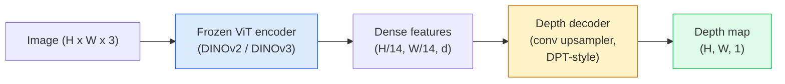

# 单目深度与几何估计

> 深度图是一种单通道图像，其中每个像素表示到相机的距离。过去，如果没有立体视觉或 LiDAR，仅从一张 RGB 帧预测深度是不可能的。到 2026 年，一个冻结的 ViT 编码器加上一个轻量级头部网络就能达到与真值仅有百分之几差距的精度。

**类型：** 构建 + 使用
**语言：** Python
**前置知识：** Phase 4 第 14 课 (ViT)、Phase 4 第 17 课 (自监督视觉)、Phase 4 第 07 课 (U-Net)
**时间：** ~60 分钟

## 学习目标

- 区分相对深度和度量深度，并说明每个生产模型（MiDaS、Marigold、Depth Anything V3、ZoeDepth）解决的是哪一种
- 使用 Depth Anything V3（DINOv2 骨干网络）对任意单张图像进行无需标定的深度预测
- 解释为什么单张图像就能产生深度（透视线索、纹理梯度、学习到的先验），以及它无法恢复什么（绝对尺度、被遮挡的几何结构）
- 利用深度图和针孔相机内参将 2D 检测提升到 3D 点

## 问题背景

深度是 2D 计算机视觉中缺失的维度。给定 RGB，你知道物体在图像平面上的位置；但不知道它们有多远。深度传感器（立体装置、LiDAR、飞行时间）可以直接解决这个问题，但价格昂贵、易损坏且量程有限。

单目深度估计——从单张 RGB 帧预测深度——过去会产生模糊、不可靠的输出。到 2026 年，大型预训练编码器改变了这一局面：Depth Anything V3 使用冻结的 DINOv2 骨干网络，生成的深度图可泛化到室内、室外、医学和卫星领域。Marigold 将深度重新定义为条件扩散问题。ZoeDepth 回归真实的度量距离。

深度也是 2D 检测与 3D 理解之间的桥梁：将检测框的像素乘以深度，就能将 2D 物体提升到 3D 点云。这是每个 AR 遮挡系统、每个避障管道以及每个"拿起杯子"机器人的核心。

## 核心概念

### 相对深度与度量深度

- **相对深度** — 有序的 `z` 值，没有真实世界单位。"像素 A 比像素 B 更近，但距离比并不锚定到米。"
- **度量深度** — 从相机出发的绝对距离（米）。要求模型已学习到图像线索与真实距离之间的统计关系。

MiDaS 和 Depth Anything V3 产生相对深度。Marigold 产生相对深度。ZoeDepth、UniDepth 和 Metric3D 产生度量深度。度量模型对相机内参敏感；相对模型则不敏感。

### 编码器-解码器模式



Depth Anything V3 冻结编码器，仅训练 DPT 风格的解码器。编码器提供丰富的特征；解码器将它们插值回图像分辨率并回归深度。

### 为什么单张图像能产生深度

2D 图像包含许多与深度相关的单目线索：

- **透视** — 3D 中的平行线在 2D 中汇聚。
- **纹理梯度** — 远处的表面具有更小、更密集的纹理。
- **遮挡顺序** — 较近的物体遮挡较远的物体。
- **大小恒常性** — 已知物体（汽车、人）提供近似尺度。
- **大气透视** — 远处物体在户外场景中显得更朦胧、更偏蓝。

在数十亿张图像上训练的 ViT 内化了这些线索。只要有足够的数据和强大的骨干网络，单目深度就能达到合理的精度，无需任何显式的 3D 监督。

### 单目深度无法做到什么

- **没有内参或场景中已知物体时的绝对度量尺度**。网络可以预测"杯子比勺子远两倍"，而无需知道杯子是 1 米还是 10 米远。
- **被遮挡的几何结构** — 椅子的背面是看不到的，无法可靠推断。
- **真正无纹理/反射表面** — 镜子、玻璃、均匀墙壁。网络会给出看似合理但错误的深度。

### 2026 年的 Depth Anything V3

- 编码器使用标准 DINOv2 ViT-L/14（冻结）。
- DPT 解码器。
- 在来自多样化来源的位姿图像对上训练（无需除光度一致性外的显式深度监督）。
- 从**任意数量的视觉输入**预测空间一致的几何结构，无论是否已知相机位姿。
- 在单目深度、任意视角几何、视觉渲染、相机位姿估计方面达到 SOTA。

这是 2026 年需要深度时的即插即用模型。

### Marigold — 用于深度的扩散模型

Marigold（Ke 等人，CVPR 2024）将深度估计重新定义为条件图像到图像扩散问题。条件：RGB。目标：深度图。使用预训练的 Stable Diffusion 2 U-Net 作为骨干网络。输出深度图在物体边界处异常锐利。权衡：比前馈模型推理更慢（10-50 步去噪）。

### 内参和针孔相机

要将像素 `(u, v)` 在深度 `d` 下提升到相机坐标系中的 3D 点 `(X, Y, Z)`：

```
fx, fy, cx, cy = camera intrinsics
X = (u - cx) * d / fx
Y = (v - cy) * d / fy
Z = d
```

内参来自 EXIF 元数据、标定图案或单目内参估计器（Perspective Fields、UniDepth）。没有内参时，仍可假设 60-70° 视场角和中等分辨率主点来渲染点云——可用于可视化，不可用于测量。

### 评估

两个标准指标：

- **AbsRel**（绝对相对误差）：`mean(|d_pred - d_gt| / d_gt)`。越低越好。生产模型为 0.05-0.1。
- **delta < 1.25**（阈值准确率）：`max(d_pred/d_gt, d_gt/d_pred) < 1.25` 的像素比例。越高越好。SOTA 为 0.9+。

对于相对深度（Depth Anything V3、MiDaS），评估使用两种指标的尺度和平移不变版本。

## 动手构建

### 步骤 1：深度指标

```python
import torch

def abs_rel_error(pred, target, mask=None):
    if mask is not None:
        pred = pred[mask]
        target = target[mask]
    return (torch.abs(pred - target) / target.clamp(min=1e-6)).mean().item()


def delta_accuracy(pred, target, threshold=1.25, mask=None):
    if mask is not None:
        pred = pred[mask]
        target = target[mask]
    ratio = torch.maximum(pred / target.clamp(min=1e-6), target / pred.clamp(min=1e-6))
    return (ratio < threshold).float().mean().item()
```

评估前务必掩码无效深度像素（零、NaN、饱和）。

### 步骤 2：尺度和平移对齐

对于相对深度模型，在计算指标前将预测对齐到真值。`a * pred + b = target` 的最小二乘拟合：

```python
def align_scale_shift(pred, target, mask=None):
    if mask is not None:
        p = pred[mask]
        t = target[mask]
    else:
        p = pred.flatten()
        t = target.flatten()
    A = torch.stack([p, torch.ones_like(p)], dim=1)
    coeffs, *_ = torch.linalg.lstsq(A, t.unsqueeze(-1))
    a, b = coeffs[:2, 0]
    return a * pred + b
```

评估 MiDaS / Depth Anything 时，在 `abs_rel_error` 之前运行 `align_scale_shift`。

### 步骤 3：将深度提升到点云

```python
import numpy as np

def depth_to_point_cloud(depth, intrinsics):
    H, W = depth.shape
    fx, fy, cx, cy = intrinsics
    v, u = np.meshgrid(np.arange(H), np.arange(W), indexing="ij")
    z = depth
    x = (u - cx) * z / fx
    y = (v - cy) * z / fy
    return np.stack([x, y, z], axis=-1)


depth = np.random.uniform(0.5, 4.0, (240, 320))
intr = (320.0, 320.0, 160.0, 120.0)
pc = depth_to_point_cloud(depth, intr)
print(f"point cloud shape: {pc.shape}  (H, W, 3)")
```

一个函数，涵盖所有 3D 提升应用。将点云导出为 `.ply`，在 MeshLab 或 CloudCompare 中打开。

### 步骤 4：使用合成深度场景进行冒烟测试

```python
def synthetic_depth(size=96):
    yy, xx = np.meshgrid(np.arange(size), np.arange(size), indexing="ij")
    # Floor: linear gradient from near (top) to far (bottom)
    depth = 1.0 + (yy / size) * 4.0
    # Box in the middle: closer
    mask = (np.abs(xx - size / 2) < size / 6) & (np.abs(yy - size * 0.6) < size / 6)
    depth[mask] = 2.0
    return depth.astype(np.float32)


gt = torch.from_numpy(synthetic_depth(96))
pred = gt + 0.3 * torch.randn_like(gt)  # simulated prediction
aligned = align_scale_shift(pred, gt)
print(f"before align  absRel = {abs_rel_error(pred, gt):.3f}")
print(f"after align   absRel = {abs_rel_error(aligned, gt):.3f}")
```

### 步骤 5：Depth Anything V3 使用方式（参考）

```python
import torch
from transformers import pipeline
from PIL import Image

pipe = pipeline(task="depth-estimation", model="LiheYoung/depth-anything-v2-large")

image = Image.open("street.jpg").convert("RGB")
out = pipe(image)
depth_np = np.array(out["depth"])
```

三行代码。`out["depth"]` 是 PIL 灰度图；转换为 numpy 进行数学运算。对于 Depth Anything V3，发布后只需更换模型 ID；API 不变。

## 实际应用

- **Depth Anything V3**（Meta AI / ByteDance，2024-2026）—— 相对深度的默认选择。生产中最快的 ViT-large 骨干模型。
- **Marigold**（ETH，2024）—— 最高视觉质量，推理较慢。
- **UniDepth**（ETH，2024）—— 带相机内参估计的度量深度。
- **ZoeDepth**（Intel，2023）—— 度量深度；较老，仍然可靠。
- **MiDaS v3.1** —— 遗留但稳定；良好的对比基线。

典型集成模式：

1. RGB 帧到达。
2. 深度模型生成深度图。
3. 检测器产生检测框。
4. 通过深度将检测框中心提升到 3D；如有现有点云则合并。
5. 下游：AR 遮挡、路径规划、物体尺寸估计、立体替代。

对于实时使用，Depth Anything V2 Small（INT8 量化）在消费级 GPU 上 518x518 分辨率可达 ~30 fps。

## 交付成果

本课程产出：

- `outputs/prompt-depth-model-picker.md` —— 根据延迟、度量/相对需求以及场景类型，在 Depth Anything V3、Marigold、UniDepth、MiDaS 之间进行选择。
- `outputs/skill-depth-to-pointcloud.md` —— 一个从深度图构建点云的技能，正确处理内参并导出到 `.ply`。

## 练习题

1. **（简单）** 在桌面任意 10 张图像上运行 Depth Anything V2。将深度保存为灰度 PNG 并检查。找出一个预测深度明显错误的物体，解释为什么单目线索失效了。
2. **（中等）** 给定 Depth Anything V2 的 RGB + 深度，提升到点云并用 `open3d` 渲染。比较两个场景（室内/室外），注意哪个看起来更可信。
3. **（困难）** 取五对图像，仅让一个已知物体的位置不同（例如瓶子移近 30 cm）。在两张图像上都用 UniDepth 预测度量深度。报告预测距离差值与真实 30 cm 的对比。

## 关键术语

| 术语 | 人们的说法 | 实际含义 |
|------|-----------|---------|
| Monocular depth | "单图深度" | 从单张 RGB 帧估计深度，无需立体视觉或 LiDAR |
| Relative depth | "有序深度" | 有序的 z 值，没有真实世界单位 |
| Metric depth | "绝对距离" | 以米为单位的深度；需要标定或带度量监督训练的模型 |
| AbsRel | "绝对相对误差" | \|d_pred - d_gt\| / d_gt 的均值；标准深度指标 |
| Delta accuracy | "delta < 1.25" | 预测值在真值 25% 范围内的像素比例 |
| Pinhole camera | "fx, fy, cx, cy" | 用于将 (u, v, d) 提升到 (X, Y, Z) 的相机模型 |
| DPT | "Dense Prediction Transformer" | 在冻结 ViT 编码器之上用于深度的卷积解码器 |
| DINOv2 backbone | "它有效的原因" | 无需深度标签即可跨领域泛化的自监督特征 |

## 延伸阅读

- [Depth Anything V3 论文页面](https://depth-anything.github.io/) —— 使用 DINOv2 编码器的 SOTA 单目深度
- [Marigold（Ke 等人，CVPR 2024）](https://marigoldmonodepth.github.io/) —— 基于扩散的深度估计
- [UniDepth（Piccinelli 等人，2024）](https://arxiv.org/abs/2403.18913) —— 带内参的度量深度
- [MiDaS v3.1（Intel ISL）](https://github.com/isl-org/MiDaS) —— 经典的相对深度基线
- [DINOv3 博客文章（Meta）](https://ai.meta.com/blog/dinov3-self-supervised-vision-model/) —— 提升深度精度的编码器家族
