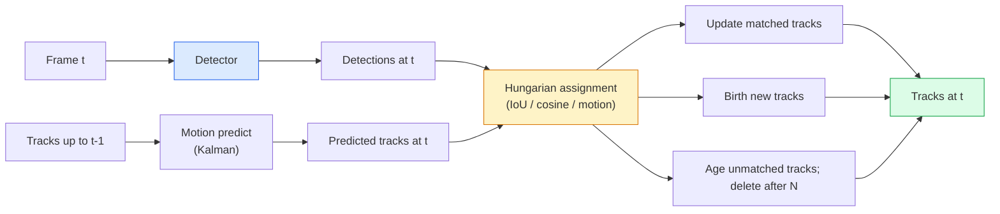

# 多目标跟踪与视频记忆

> 跟踪即检测加关联。每帧进行检测。通过 ID 将当前帧的检测结果与上一帧的轨迹进行匹配。

**类型：** 构建
**语言：** Python
**前置知识：** 阶段 4 第 06 课（YOLO 检测）、阶段 4 第 08 课（Mask R-CNN）、阶段 4 第 24 课（SAM 3）
**时间：** ~60 分钟

## 学习目标

- 区分基于检测的跟踪与基于查询的跟踪，并能说出算法家族名称（SORT、DeepSORT、ByteTrack、BoT-SORT、SAM 2 记忆跟踪器、SAM 3.1 Object Multiplex）
- 从零实现 IoU + 匈牙利指派，完成经典基于检测的跟踪
- 解释 SAM 2 的记忆库及其为何比基于 IoU 的关联更能处理遮挡
- 理解三项跟踪指标（MOTA、IDF1、HOTA），并能根据用例选择合适指标

## 问题背景

检测器告诉你单帧中物体的位置。跟踪器告诉你 `t` 帧中的哪个检测与 `t-1` 帧中的检测是同一个物体。没有跟踪，你无法统计穿越某条线的物体数量、无法跟踪被遮挡的球，也无法知道"4 号车已在车道中停留 8 秒"。

跟踪对每一个面向视频的产品都至关重要：体育分析、监控、自动驾驶、医学视频分析、野生动物监测、水印计数。核心构建模块是共通的：逐帧检测器、运动模型（卡尔曼滤波器或更复杂的模型）、关联步骤（基于 IoU / 余弦相似度 / 学习特征的匈牙利算法），以及轨迹生命周期（诞生、更新、消亡）。

2026 年出现了两种新模式：**SAM 2 基于记忆的跟踪**（用特征记忆替代运动模型关联）和 **SAM 3.1 Object Multiplex**（同一概念的多个实例共享记忆）。本课先走经典路线，再介绍基于记忆的方法。

## 核心概念

### 基于检测的跟踪



2026 年你会遇到的每个跟踪器都是这个循环的变体。差异在于：

- **SORT** (2016)：卡尔曼滤波 + IoU 匈牙利算法。简单、快速、无外观模型。
- **DeepSORT** (2017)：SORT + 基于 CNN 的每轨迹外观特征（ReID 嵌入）。能更好地处理交叉场景。
- **ByteTrack** (2021)：将低置信度检测作为第二阶段进行关联；无需外观特征，但在 MOT17 上表现顶尖。
- **BoT-SORT** (2022)：ByteTrack + 相机运动补偿 + ReID。
- **StrongSORT / OC-SORT** — ByteTrack 的后继者，具有更好的运动和外观建模。

### 卡尔曼滤波器一句话

卡尔曼滤波器维护一个带协方差的每轨迹状态 `(x, y, w, h, dx, dy, dw, dh)`。每帧先用恒速模型**预测**状态，再用匹配到的检测进行**更新**。预测不确定性高时，更新更信任检测。这带来平滑轨迹，并能在短遮挡（1-5 帧）中维持轨迹。

每个经典跟踪器都在运动预测步骤中使用卡尔曼滤波器。

### 匈牙利算法

给定一个 `M x N` 代价矩阵（轨迹 × 检测），找到使总代价最小的一对一匹配。代价通常是 `1 - IoU(track_bbox, detection_bbox)` 或外观特征的负余弦相似度。运行时间为 O((M+N)^3)；当 M、N 达到约 1000 时，通过 `scipy.optimize.linear_sum_assignment` 在 Python 中足够快。

### ByteTrack 的核心思想

标准跟踪器会丢弃低置信度检测（< 0.5）。ByteTrack 将其保留为**第二阶段候选**：在将轨迹与高置信度检测匹配后，未匹配的轨迹尝试以稍宽松的 IoU 阈值与低置信度检测匹配。能恢复短遮挡、减少人群附近的 ID 切换。

### SAM 2 基于记忆的跟踪

SAM 2 通过维护一个**记忆库**来处理视频，记忆库中存储每实例的时空特征。给定某一帧上的提示（点、框、文本），它将实例编码为记忆。在后续帧中，记忆与新帧特征进行交叉注意力计算，解码器输出同一实例在新帧中的掩码。

没有卡尔曼滤波器，没有匈牙利指派。关联隐含在记忆注意力操作中。

优点：
- 对大遮挡鲁棒（记忆能在多帧间保持实例身份）。
- 与 SAM 3 的文本提示结合时支持开放词汇。
- 无需单独的运动模型。

缺点：
- 在多目标跟踪中比 ByteTrack 慢。
- 记忆库不断增长；限制上下文窗口。

### SAM 3.1 Object Multiplex

此前的 SAM 2 / SAM 3 跟踪为每个实例维护独立的记忆库。50 个对象就是 50 个记忆库。Object Multiplex（2026 年 3 月）将其折叠为单个共享记忆，使用**每实例查询令牌**。成本随实例数量亚线性增长。

Multiplex 是 2026 年人群跟踪的新默认：演唱会人群、仓库工人、交通路口。

### 三项必知指标

- **MOTA（多目标跟踪准确率）** — 1 - (FN + FP + ID 切换数) / GT。按错误类型加权；单一指标，混合了检测失败和关联失败。
- **IDF1（ID F1）** — ID 精确率和召回率的调和平均。专门关注每个真实轨迹在时间上的 ID 保持能力。对 ID 切换敏感的任务优于 MOTA。
- **HOTA（高阶跟踪准确率）** — 分解为检测准确率（DetA）和关联准确率（AssA）。2020 年以来的社区标准；最全面。

监控场景（谁是谁）：报告 IDF1。体育分析（统计传球）：HOTA。一般学术比较：HOTA。

## 动手实现

### 步骤 1：基于 IoU 的代价矩阵

```python
import numpy as np


def bbox_iou(a, b):
    """
    a, b: (N, 4) arrays of [x1, y1, x2, y2].
    Returns (N_a, N_b) IoU matrix.
    """
    ax1, ay1, ax2, ay2 = a[:, 0], a[:, 1], a[:, 2], a[:, 3]
    bx1, by1, bx2, by2 = b[:, 0], b[:, 1], b[:, 2], b[:, 3]
    inter_x1 = np.maximum(ax1[:, None], bx1[None, :])
    inter_y1 = np.maximum(ay1[:, None], by1[None, :])
    inter_x2 = np.minimum(ax2[:, None], bx2[None, :])
    inter_y2 = np.minimum(ay2[:, None], by2[None, :])
    inter = np.clip(inter_x2 - inter_x1, 0, None) * np.clip(inter_y2 - inter_y1, 0, None)
    area_a = (ax2 - ax1) * (ay2 - ay1)
    area_b = (bx2 - bx1) * (by2 - by1)
    union = area_a[:, None] + area_b[None, :] - inter
    return inter / np.clip(union, 1e-8, None)
```

### 步骤 2：最简 SORT 风格跟踪器

为简洁起见省略固定恒速卡尔曼滤波 —— 这里使用简单 IoU 关联；生产环境中卡尔曼预测必不可少。`sort` Python 包提供完整版本。

```python
from scipy.optimize import linear_sum_assignment


class Track:
    def __init__(self, tid, bbox, frame):
        self.id = tid
        self.bbox = bbox
        self.last_frame = frame
        self.hits = 1

    def update(self, bbox, frame):
        self.bbox = bbox
        self.last_frame = frame
        self.hits += 1


class SimpleTracker:
    def __init__(self, iou_threshold=0.3, max_age=5):
        self.tracks = []
        self.next_id = 1
        self.iou_threshold = iou_threshold
        self.max_age = max_age

    def step(self, detections, frame):
        if not self.tracks:
            for d in detections:
                self.tracks.append(Track(self.next_id, d, frame))
                self.next_id += 1
            return [(t.id, t.bbox) for t in self.tracks]

        track_boxes = np.array([t.bbox for t in self.tracks])
        det_boxes = np.array(detections) if len(detections) else np.empty((0, 4))

        iou = bbox_iou(track_boxes, det_boxes) if len(det_boxes) else np.zeros((len(track_boxes), 0))
        cost = 1 - iou
        cost[iou < self.iou_threshold] = 1e6

        matched_track = set()
        matched_det = set()
        if cost.size > 0:
            row, col = linear_sum_assignment(cost)
            for r, c in zip(row, col):
                if cost[r, c] < 1.0:
                    self.tracks[r].update(det_boxes[c], frame)
                    matched_track.add(r); matched_det.add(c)

        for i, d in enumerate(det_boxes):
            if i not in matched_det:
                self.tracks.append(Track(self.next_id, d, frame))
                self.next_id += 1

        self.tracks = [t for t in self.tracks if frame - t.last_frame <= self.max_age]
        return [(t.id, t.bbox) for t in self.tracks]
```

60 行代码。输入逐帧检测，输出逐帧轨迹 ID。真实系统会加入卡尔曼预测、ByteTrack 的第二阶段重匹配，以及外观特征。

### 步骤 3：合成轨迹测试

```python
def synthetic_frames(num_frames=20, num_objects=3, H=240, W=320, seed=0):
    rng = np.random.default_rng(seed)
    starts = rng.uniform(20, 200, size=(num_objects, 2))
    velocities = rng.uniform(-5, 5, size=(num_objects, 2))
    frames = []
    for f in range(num_frames):
        dets = []
        for i in range(num_objects):
            cx, cy = starts[i] + f * velocities[i]
            dets.append([cx - 10, cy - 10, cx + 10, cy + 10])
        frames.append(dets)
    return frames


tracker = SimpleTracker()
for f, dets in enumerate(synthetic_frames()):
    tracks = tracker.step(dets, f)
```

三个沿直线运动的物体应在全部 20 帧中保持 ID 不变。

### 步骤 4：ID 切换指标

```python
def count_id_switches(tracks_per_frame, gt_per_frame):
    """
    tracks_per_frame:  list of list of (track_id, bbox)
    gt_per_frame:      list of list of (gt_id, bbox)
    Returns number of ID switches.
    """
    prev_assignment = {}
    switches = 0
    for tracks, gts in zip(tracks_per_frame, gt_per_frame):
        if not tracks or not gts:
            continue
        t_boxes = np.array([b for _, b in tracks])
        g_boxes = np.array([b for _, b in gts])
        iou = bbox_iou(g_boxes, t_boxes)
        for g_idx, (gt_id, _) in enumerate(gts):
            j = iou[g_idx].argmax()
            if iou[g_idx, j] > 0.5:
                t_id = tracks[j][0]
                if gt_id in prev_assignment and prev_assignment[gt_id] != t_id:
                    switches += 1
                prev_assignment[gt_id] = t_id
    return switches
```

这是一个简化的类 IDF1 指标：统计真实对象被分配预测轨迹 ID 变化的次数。真实的 MOTA / IDF1 / HOTA 工具位于 `py-motmetrics` 和 `TrackEval`。

## 实际应用

2026 年生产环境跟踪器：

- `ultralytics` —— 内置 YOLOv8 + ByteTrack / BoT-SORT。`results = model.track(source, tracker="bytetrack.yaml")`。默认选择。
- `supervision`（Roboflow）—— ByteTrack 封装加标注工具。
- SAM 2 / SAM 3.1 —— 通过 `processor.track()` 实现基于记忆的跟踪。
- 自定义栈：检测器（YOLOv8 / RT-DETR）+ `sort-tracker` / `OC-SORT` / `StrongSORT`。

选择指南：

- 行人 / 车辆 / 包裹，30+ fps：**ultralytics 的 ByteTrack**。
- 人群中同一类别的多个实例：**SAM 3.1 Object Multiplex**。
- 严重遮挡且外观可区分：**DeepSORT / StrongSORT**（ReID 特征）。
- 体育 / 复杂交互：**BoT-SORT** 或学习式跟踪器（MOTRv3）。

## 交付成果

本课产出：

- `outputs/prompt-tracker-picker.md` —— 根据场景类型、遮挡模式和延迟预算选择 SORT / ByteTrack / BoT-SORT / SAM 2 / SAM 3.1。
- `outputs/skill-mot-evaluator.md` —— 编写完整的 MOTA / IDF1 / HOTA 评估框架，与真实轨迹对比。

## 练习题

1. **（简单）** 用 3、10、30 个对象运行上述合成跟踪器。报告每种情况的 ID 切换次数。找出仅 IoU 关联开始失效的临界点。
2. **（中等）** 在关联前加入恒速卡尔曼预测步骤。证明短（2-3 帧）遮挡不再导致 ID 切换。
3. **（困难）** 将 SAM 2 的基于记忆的跟踪器（通过 `transformers`）集成为替代跟踪后端。在 30 秒人群视频片段上同时运行 SimpleTracker 和 SAM 2，比较 ID 切换次数，手动为 5 个显著人物标注真实 ID。

## 关键术语

| 术语 | 人们怎么说 | 实际含义 |
|------|-----------|---------|
| Tracking-by-detection | "先检测再关联" | 逐帧检测器 + 基于 IoU / 外观的匈牙利指派 |
| Kalman filter | "运动预测" | 线性动力学 + 协方差，用于平滑轨迹预测和遮挡处理 |
| Hungarian algorithm | "最优指派" | 求解最小代价二分图匹配问题；`scipy.optimize.linear_sum_assignment` |
| ByteTrack | "低置信度第二遍" | 将未匹配轨迹与低置信度检测重匹配，恢复短遮挡 |
| DeepSORT | "SORT + 外观" | 增加 ReID 特征用于跨帧匹配；更利于 ID 保持 |
| Memory bank | "SAM 2 技巧" | 跨帧存储的每实例时空特征；交叉注意力替代显式关联 |
| Object Multiplex | "SAM 3.1 共享记忆" | 单共享记忆 + 每实例查询，实现快速多目标跟踪 |
| HOTA | "现代跟踪指标" | 分解为检测准确率和关联准确率；社区标准 |

## 延伸阅读

- [SORT (Bewley et al., 2016)](https://arxiv.org/abs/1602.00763) —— 最简基于检测的跟踪论文
- [DeepSORT (Wojke et al., 2017)](https://arxiv.org/abs/1703.07402) —— 增加外观特征
- [ByteTrack (Zhang et al., 2022)](https://arxiv.org/abs/2110.06864) —— 低置信度第二遍
- [BoT-SORT (Aharon et al., 2022)](https://arxiv.org/abs/2206.14651) —— 相机运动补偿
- [HOTA (Luiten et al., 2020)](https://arxiv.org/abs/2009.07736) —— 分解式跟踪指标
- [SAM 2 video segmentation (Meta, 2024)](https://ai.meta.com/sam2/) —— 基于记忆的跟踪器
- [SAM 3.1 Object Multiplex (Meta, March 2026)](https://ai.meta.com/blog/segment-anything-model-3/)
