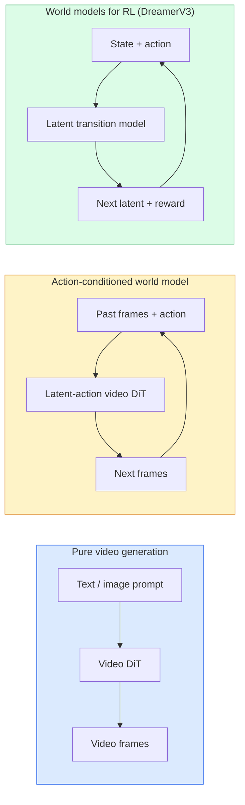

# 世界模型与视频扩散

> 一个能够预测场景接下来几秒的视频模型就是世界模拟器。如果让该预测以动作作为条件，你就得到了一个学习得到的游戏引擎。

**类型：** 学习 + 构建
**语言：** Python
**前置要求：** 第4阶段第10课（扩散模型）、第4阶段第12课（视频理解）、第4阶段第23课（DiT + 整流流）
**时间：** ~75分钟

## 学习目标

- 解释纯视频生成模型（Sora 2）与动作条件化世界模型（Genie 3、DreamerV3）之间的区别
- 描述视频DiT：时空块、3D位置编码、跨(T, H, W) token的联合注意力
- 追溯世界模型如何嵌入机器人学流程：VLM规划 → 视频模型模拟 → 逆动力学输出动作
- 针对给定用例（创意视频、交互式模拟、自动驾驶合成），在Sora 2、Genie 3、Runway GWM-1 Worlds、Wan-Video和HunyuanVideo之间做出选择

## 问题背景

视频生成与世界建模在2026年走向融合。一个能够生成连贯一分钟视频的模型，在某种意义上已经学会了世界的运动方式：物体恒存性、重力、因果性、风格。如果你让该预测以动作作为条件（向左走、开门），视频模型就变成了可学习的模拟器，可以替代游戏引擎、驾驶模拟器或机器人环境。

其意义重大。Genie 3能从单张图像生成可玩环境。Runway GWM-1 Worlds合成无限可探索场景。Sora 2生成带有同步音频和建模物理的一分钟长视频。NVIDIA Cosmos-Drive、Wayve Gaia-2和Tesla DrivingWorld生成逼真的驾驶视频用于自动驾驶训练数据。世界模型范式正在悄然接管机器人学的sim-to-real。

本课是第4阶段的"全景"课程。它将图像生成、视频理解和智能体推理连接成当前主导研究正在迈向的架构模式。

## 核心概念

### 世界建模的三大类别



- **Sora 2** 是纯提示条件化的视频生成。没有动作接口。你无法在生成过程中"操控"它。
- **Genie 3**、**GWM-1 Worlds**、**Mirage / Magica** 是动作条件化世界模型。从观测视频中推断潜在动作，然后以动作作为条件预测未来帧。可交互——你按键或移动相机，场景就会响应。
- **DreamerV3** 和经典RL世界模型家族在具有显式动作条件化的潜在空间中进行预测，以奖励信号训练。视觉性较弱；对样本高效RL更有用。

### 视频DiT架构

```
Video latent:          (C, T, H, W)
Patchify (spatial):    grid of P_h x P_w patches per frame
Patchify (temporal):   group P_t frames into a temporal patch
Resulting tokens:      (T / P_t) * (H / P_h) * (W / P_w) tokens
```

位置编码是3D的：每个(t, h, w)坐标对应一个旋转式或学习得到的嵌入。注意力可以是：

- **完全联合** — 所有token关注所有token。N个token的复杂度为O(N²)。对于长视频不可行。
- **分离式** — 交替进行时间注意力（相同空间位置，跨时间：`(H*W) * T^2`）和空间注意力（相同时间步，跨空间：`T * (H*W)^2`）。TimeSformer和大多数视频DiT使用此方案。
- **窗口式** — (t, h, w)中的局部窗口。Video Swin使用此方案。

2026年的每个视频扩散模型都采用这三种模式之一，加上AdaLN条件化（第23课）和整流流。

### 以动作为条件：潜在动作模型

Genie通过判别式地预测连续帧对之间的动作来学习每帧的**潜在动作**。模型的解码器随后以推断出的潜在动作为条件——而非显式的键盘按键。在推理时，用户可以指定一个潜在动作（或从新的先验中采样一个），模型生成与该动作一致的下一帧。

Sora完全跳过动作接口。其解码器从过去的时空token预测下一个时空token。提示条件化起始；生成过程中没有任何东西可以操控它。

### 物理合理性

Sora 2的2026年发布明确宣传了**物理合理性**：重量、平衡、物体恒存性、因果关系。团队通过人工评分的合理性指标进行测量；该模型在掉落物体、角色碰撞和故意失败（一次失败的跳跃）方面相比Sora 1有明显改进。

合理性仍是主要的失败模式。2024-2025年人们吃意大利面或用玻璃杯喝水的视频揭示了模型缺乏持久的物体表征。2026年的模型（Sora 2、Runway Gen-5、HunyuanVideo）减少了但并未消除这些问题。

### 自动驾驶世界模型

驾驶世界模型以轨迹、边界框或导航地图为条件生成逼真的道路场景。用途：

- **Cosmos-Drive-Dreams**（NVIDIA）— 生成数分钟驾驶视频用于RL训练。
- **Gaia-2**（Wayve）— 轨迹条件化场景合成用于策略评估。
- **DrivingWorld**（Tesla）— 模拟各种天气、时段、交通条件。
- **Vista**（ByteDance）— 反应式驾驶场景合成。

它们替代了昂贵的真实世界数据收集，用于边角案例——夜间行人乱穿马路、结冰路口、非常规车辆类型——否则需要数百万英里的驾驶。

### 机器人学栈：VLM + 视频模型 + 逆动力学

新兴的三组件机器人学循环：

1. **VLM** 解析目标（"拿起红色杯子"），规划高层动作序列。
2. **视频生成模型** 模拟执行每个动作会是什么样子——预测N帧后的观测。
3. **逆动力学模型** 提取能够产生那些观测的具体电机指令。

这替代了奖励塑造和重样本RL。世界模型负责想象；逆动力学在驱动上闭合循环。Genie Envisioner是其中一个实例化；许多研究组正在趋同于这一结构。

### 评估

- **视觉质量** — FVD（Fréchet Video Distance）、用户研究。
- **提示对齐度** — 每帧CLIPScore、VQA式评估。
- **物理合理性** — 在基准套件上人工评分（Sora 2内部基准、VBench）。
- **可控性**（针对交互式世界模型）— 动作→观测一致性；能否回到先前状态？

### 2026年模型格局

| 模型 | 用途 | 参数量 | 输出 | 许可 |
|------|------|--------|------|------|
| Sora 2 | 文本生成视频、音频 | — | 1分钟1080p + 音频 | 仅API |
| Runway Gen-5 | 文本/图像生成视频 | — | 10秒片段 | API |
| Runway GWM-1 Worlds | 交互式世界 | — | 无限3D展开 | API |
| Genie 3 | 从图像生成交互式世界 | 11B+ | 可玩帧 | 研究预览 |
| Wan-Video 2.1 | 开放文本生成视频 | 14B | 高质量片段 | 非商业 |
| HunyuanVideo | 开放文本生成视频 | 13B | 10秒片段 | 宽松 |
| Cosmos / Cosmos-Drive | 自动驾驶模拟 | 7-14B | 驾驶场景 | NVIDIA开放 |
| Magica / Mirage 2 | AI原生游戏引擎 | — | 可修改世界 | 产品 |

## 动手构建

### 步骤1：视频的3D块化

```python
import torch
import torch.nn as nn


class VideoPatch3D(nn.Module):
    def __init__(self, in_channels=4, dim=64, patch_t=2, patch_h=2, patch_w=2):
        super().__init__()
        self.proj = nn.Conv3d(
            in_channels, dim,
            kernel_size=(patch_t, patch_h, patch_w),
            stride=(patch_t, patch_h, patch_w),
        )
        self.patch_t = patch_t
        self.patch_h = patch_h
        self.patch_w = patch_w

    def forward(self, x):
        # x: (N, C, T, H, W)
        x = self.proj(x)
        n, c, t, h, w = x.shape
        tokens = x.reshape(n, c, t * h * w).transpose(1, 2)
        return tokens, (t, h, w)
```

步长等于核大小的3D卷积充当时空块化器。`(T, H, W) -> (T/2, H/2, W/2)` token网格。

### 步骤2：3D旋转位置编码

旋转位置嵌入（RoPE）分别沿`t`、`h`、`w`轴应用：

```python
def rope_3d(tokens, t_dim, h_dim, w_dim, grid):
    """
    tokens: (N, T*H*W, D)
    grid: (T, H, W) sizes
    t_dim + h_dim + w_dim == D
    """
    T, H, W = grid
    n, seq, d = tokens.shape
    if t_dim + h_dim + w_dim != d:
        raise ValueError(f"t_dim+h_dim+w_dim ({t_dim}+{h_dim}+{w_dim}) must equal D={d}")
    assert seq == T * H * W
    t_idx = torch.arange(T, device=tokens.device).repeat_interleave(H * W)
    h_idx = torch.arange(H, device=tokens.device).repeat_interleave(W).repeat(T)
    w_idx = torch.arange(W, device=tokens.device).repeat(T * H)
    # Simplified: just scale channels by frequencies. Real RoPE rotates pairs.
    freqs_t = torch.exp(-torch.log(torch.tensor(10000.0)) * torch.arange(t_dim // 2, device=tokens.device) / (t_dim // 2))
    freqs_h = torch.exp(-torch.log(torch.tensor(10000.0)) * torch.arange(h_dim // 2, device=tokens.device) / (h_dim // 2))
    freqs_w = torch.exp(-torch.log(torch.tensor(10000.0)) * torch.arange(w_dim // 2, device=tokens.device) / (w_dim // 2))
    emb_t = torch.cat([torch.sin(t_idx[:, None] * freqs_t), torch.cos(t_idx[:, None] * freqs_t)], dim=-1)
    emb_h = torch.cat([torch.sin(h_idx[:, None] * freqs_h), torch.cos(h_idx[:, None] * freqs_h)], dim=-1)
    emb_w = torch.cat([torch.sin(w_idx[:, None] * freqs_w), torch.cos(w_idx[:, None] * freqs_w)], dim=-1)
    return tokens + torch.cat([emb_t, emb_h, emb_w], dim=-1)
```

简化的加法形式。真实RoPE在频率上旋转成对通道；位置信息相同。

### 步骤3：分离式注意力块

```python
class DividedAttentionBlock(nn.Module):
    def __init__(self, dim=64, heads=2):
        super().__init__()
        self.time_attn = nn.MultiheadAttention(dim, heads, batch_first=True)
        self.space_attn = nn.MultiheadAttention(dim, heads, batch_first=True)
        self.ln1 = nn.LayerNorm(dim)
        self.ln2 = nn.LayerNorm(dim)
        self.ln3 = nn.LayerNorm(dim)
        self.mlp = nn.Sequential(nn.Linear(dim, 4 * dim), nn.GELU(), nn.Linear(4 * dim, dim))

    def forward(self, x, grid):
        T, H, W = grid
        n, seq, d = x.shape
        # time attention: same (h, w), across t
        xt = x.view(n, T, H * W, d).permute(0, 2, 1, 3).reshape(n * H * W, T, d)
        a, _ = self.time_attn(self.ln1(xt), self.ln1(xt), self.ln1(xt), need_weights=False)
        xt = (xt + a).reshape(n, H * W, T, d).permute(0, 2, 1, 3).reshape(n, seq, d)
        # space attention: same t, across (h, w)
        xs = xt.view(n, T, H * W, d).reshape(n * T, H * W, d)
        a, _ = self.space_attn(self.ln2(xs), self.ln2(xs), self.ln2(xs), need_weights=False)
        xs = (xs + a).reshape(n, T, H * W, d).reshape(n, seq, d)
        xs = xs + self.mlp(self.ln3(xs))
        return xs
```

时间注意力在每个空间位置内跨时间关注；空间注意力在每帧内跨位置关注。两个O(T² + (HW)²)操作替代一个O((THW)²)。这是TimeSformer和每个现代视频DiT的核心。

### 步骤4：组合微型视频DiT

```python
class TinyVideoDiT(nn.Module):
    def __init__(self, in_channels=4, dim=64, depth=2, heads=2):
        super().__init__()
        self.patch = VideoPatch3D(in_channels=in_channels, dim=dim, patch_t=2, patch_h=2, patch_w=2)
        self.blocks = nn.ModuleList([DividedAttentionBlock(dim, heads) for _ in range(depth)])
        self.out = nn.Linear(dim, in_channels * 2 * 2 * 2)

    def forward(self, x):
        tokens, grid = self.patch(x)
        for blk in self.blocks:
            tokens = blk(tokens, grid)
        return self.out(tokens), grid
```

不是可运行的视频生成器；而是一个结构演示，确保每个部分的形状正确。

### 步骤5：检查形状

```python
vid = torch.randn(1, 4, 8, 16, 16)  # (N, C, T, H, W)
model = TinyVideoDiT()
out, grid = model(vid)
print(f"input  {tuple(vid.shape)}")
print(f"tokens grid {grid}")
print(f"output {tuple(out.shape)}")
```

块化后期望`grid = (4, 8, 8)`和`out = (1, 256, 32)`；随后head将其投影为每token时空块，准备反块化回视频。

## 实际应用

2026年的生产接入模式：

- **Sora 2 API**（OpenAI）— 文本生成视频、同步音频。高端定价。
- **Runway Gen-5 / GWM-1**（Runway）— 图像生成视频、交互式世界。
- **Wan-Video 2.1 / HunyuanVideo** — 开源自托管。
- **Cosmos / Cosmos-Drive**（NVIDIA）— 驾驶模拟开放权重。
- **Genie 3** — 研究预览，申请访问。

构建交互式世界模型演示：从Wan-Video开始保证质量，叠加潜在动作适配器实现交互性。用于自动驾驶模拟：Cosmos-Drive是2026年的开放参考。

机器人学实际栈：

1. 语言目标 -> VLM（Qwen3-VL）-> 高层规划。
2. 规划 -> 潜在动作视频模型 -> 想象展开。
3. 展开 -> 逆动力学模型 -> 底层动作。
4. 执行动作 -> 观测反馈回步骤1。

## 交付成果

本课产出：

- `outputs/prompt-video-model-picker.md` — 给定任务、许可和延迟，在Sora 2 / Runway / Wan / HunyuanVideo / Cosmos之间做出选择。
- `outputs/skill-physical-plausibility-checks.md` — 一项定义自动化检查（物体恒存性、重力、连续性）的技能，在发布前对任何生成视频运行。

## 练习题

1. **（简单）** 计算5秒360p视频在patch-t=2、patch-h=8、patch-w=8时的token数量。推理此规模下注意力的内存需求。
2. **（中等）** 将上述分离式注意力块替换为完全联合注意力块，测量形状和参数量。解释为什么分离式注意力对真实视频模型是必要的。
3. **（困难）** 构建最小潜在动作视频模型：取（frame_t、action_t、frame_{t+1}）三元组数据集（任何简单2D游戏），训练以动作嵌入为条件的微型视频DiT，并展示不同动作产生不同的下一帧。

## 关键术语

| 术语 | 人们怎么说 | 实际含义 |
|------|-----------|---------|
| World model | "学习得到的模拟器" | 给定状态和动作预测未来观测的模型 |
| Video DiT | "时空transformer" | 具有3D块化和分离式注意力的扩散transformer |
| Latent action | "推断的控制" | 从帧对推断的离散或连续动作潜在变量；用于条件化下一帧生成 |
| Divided attention | "先时间后空间" | 每个块中的两次注意力操作——先跨时间再跨空间——以保持O(N²)可管理 |
| Object permanence | "东西保持真实" | 视频模型必须学习的场景属性；食物、玻璃器皿上的经典失败模式 |
| FVD | "Fréchet Video Distance" | FID的视频等价物；主要视觉质量指标 |
| Inverse dynamics model | "从观测到动作" | 给定（状态，下一状态），输出连接它们的动作；闭合机器人学循环 |
| Cosmos-Drive | "NVIDIA驾驶模拟" | 用于RL和评估的开放权重自动驾驶世界模型 |

## 延伸阅读

- [Sora技术报告（OpenAI）](https://openai.com/index/video-generation-models-as-world-simulators/)
- [Genie: Generative Interactive Environments（Bruce等，2024）](https://arxiv.org/abs/2402.15391) — 潜在动作世界模型
- [TimeSformer（Bertasius等，2021）](https://arxiv.org/abs/2102.05095) — 视频transformer的分离式注意力
- [DreamerV3（Hafner等，2023）](https://arxiv.org/abs/2301.04104) — 用于RL的世界模型
- [Cosmos-Drive-Dreams（NVIDIA，2025）](https://research.nvidia.com/labs/toronto-ai/cosmos-drive-dreams/) — 驾驶世界模型
- [2026年十大视频生成模型（DataCamp）](https://www.datacamp.com/blog/top-video-generation-models)
- [从视频生成到世界模型 — 综述仓库](https://github.com/ziqihuangg/Awesome-From-Video-Generation-to-World-Model/)
