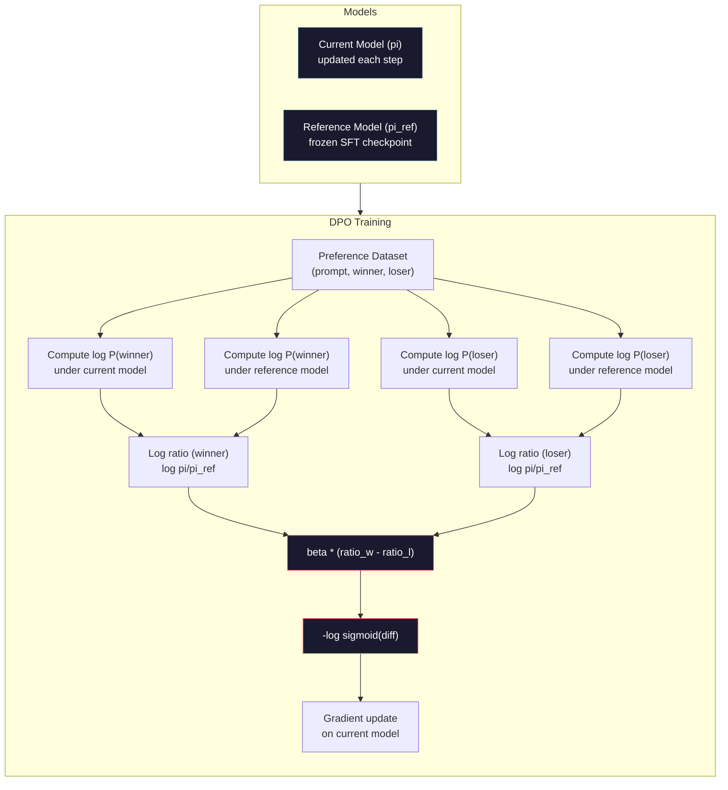

# DPO：直接偏好优化

> RLHF 有效。但它需要训练三个模型（SFT、奖励模型、策略模型），管理 PPO 的不稳定性，并调整 KL 惩罚系数。DPO 提出一个问题：如果跳过所有这些步骤会怎样？DPO 直接在偏好对上优化语言模型。无需奖励模型。无需 PPO。一个训练循环。相同的结果。

**类型：** 构建
**语言：** Python（含 numpy）
**前置要求：** 第 10 阶段，第 07 课（RLHF）
**预计时间：** 约 90 分钟

## 学习目标

- 实现 DPO 训练，直接在偏好对上优化语言模型，无需单独的奖励模型
- 推导 DPO 损失函数，并解释它如何通过策略的对数概率隐式表示奖励模型
- 从训练稳定性、计算成本和所需模型数量等方面比较 DPO 与 RLHF
- 调整 beta 参数以控制训练后的策略偏离参考模型的程度

## 问题背景

你在第 07 课中构建了 RLHF 流水线。三个阶段。三个模型。SFT 模型、奖励模型以及使用 PPO 优化的策略模型。仅奖励模型就需要数千个真人偏好对和一个独立的训练循环。PPO 需要仔细调整 KL 系数、学习率、截断比例和 epoch 数量。

在实践中，PPO 训练以极不稳定著称。微小的超参数变化就会导致训练发散。奖励模型只是人类偏好的不完美代理，而策略模型会找到利用其弱点的方法。KL 惩罚有所帮助，但需要单独调参——设置过低会导致奖励黑客行为（reward hacking），过高则模型几乎学不到东西。

正是这种复杂性导致大多数开源模型在 InstructGPT 发表后的几年里难以成功应用 RLHF。三阶段流水线非常脆弱。每个阶段都有其自身的故障模式，且错误会相互叠加。

2023 年 5 月，斯坦福大学的 Rafael Rafailov、Archit Sharma 及其同事发表了《Direct Preference Optimization: Your Language Model is Secretly a Reward Model》。核心洞察是：你不需要单独的奖励模型。最优奖励函数在数学上由语言模型自身的 token 概率决定。你可以完全跳过奖励模型，直接在偏好对上优化语言模型。

DPO 将 RLHF 简化为单一的监督学习步骤。一个模型。一个损失函数。一个训练循环。无需强化学习。Zephyr-7B 是首批大规模使用 DPO 的模型之一，在多个基准测试中达到或超越了使用完整 RLHF 训练的模型。Meta 将 DPO 作为 Llama 3 对齐流水线的一部分。Anthropic 在其对齐研究中引用了 DPO 风格的方法。

## 核心概念

### 关键洞察

RLHF 优化以下目标函数：

```
maximize: E[R(x, y)] - beta * KL(pi || pi_ref)
```

其中 R 是奖励模型，pi 是策略模型，pi_ref 是参考模型，beta 是 KL 系数。

DPO 论文表明，该目标函数存在闭式最优解。对于任意奖励函数 R，最优策略为：

```
pi*(y | x) = pi_ref(y | x) * exp(R(x, y) / beta) / Z(x)
```

其中 Z(x) 是归一化常数。重新排列可得：

```
R(x, y) = beta * log(pi*(y | x) / pi_ref(y | x)) + beta * log Z(x)
```

这是突破性进展。奖励完全用策略模型的概率和参考模型的概率来表示。你不需要训练单独的奖励模型。奖励*隐含*在概率比率中。

将其代入 Bradley-Terry 偏好模型：

```
P(y_w > y_l | x) = sigmoid(R(x, y_w) - R(x, y_l))
                  = sigmoid(beta * (log pi(y_w|x)/pi_ref(y_w|x) - log pi(y_l|x)/pi_ref(y_l|x)))
```

Z(x) 项相互抵消，因为两个响应都基于相同的提示 x。剩下的部分仅是策略模型和对偏好响应及拒绝响应的参考模型的对数概率的函数。

### DPO 损失函数

```
L_DPO = -log(sigmoid(beta * (log pi(y_w|x)/pi_ref(y_w|x) - log pi(y_l|x)/pi_ref(y_l|x))))
```

让我们拆解各个组成部分：

- **y_w** = 偏好（获胜）响应
- **y_l** = 拒绝（失败）响应
- **x** = 提示词
- **pi** = 当前模型（正在训练）
- **pi_ref** = 参考模型（冻结的 SFT 检查点）
- **beta** = 温度参数，控制偏离参考模型的程度（通常为 0.1 到 0.5）

比率 `log pi(y|x) / pi_ref(y|x)` 是对数概率比率。当该比率为正时，当前模型分配给响应 y 的概率高于参考模型。当为负时，当前模型分配的概率较低。

DPO 损失推动模型增加偏好响应的对数概率比率，并降低拒绝响应的比率。beta 参数控制模型偏离参考模型的激进程度——较小的 beta 允许较大偏离，较大的 beta 使模型保持在参考模型附近。



### 为什么 DPO 更简单

| 方面 | RLHF (PPO) | DPO |
|------|-----------|-----|
| 需训练模型 | 3 个（SFT + 奖励 + 策略） | 1 个（仅策略） |
| 训练循环 | 3 个（SFT、RM 训练、PPO） | 2 个（SFT、DPO） |
| 超参数 | lr、KL 系数、截断比例、RM lr、epochs × 3 | lr、beta、epochs |
| 奖励模型 | 必需（独立训练） | 隐含在模型概率中 |
| RL 算法 | PPO（复杂、不稳定） | 监督学习（稳定） |
| GPU 显存 | PPO 期间内存中驻留 3-4 个模型 | 2 个模型（当前 + 参考） |
| 训练稳定性 | 对超参数敏感 | 鲁棒性强，类似 SFT |

DPO 在训练时需要两个模型驻留内存——当前模型和冻结的参考模型。RLHF 需要三个或四个：策略、参考、奖励模型，以及可选的价值函数基线。对于 70B 模型，FP16 精度下每个副本占用 140GB。消除奖励模型带来的显存节省非常显著。

### DPO 优于 RLHF 的场景

**小型数据集。** 拥有 5,000-20,000 个偏好对时，DPO 通常能匹配或超越 RLHF。RLHF 中的奖励模型需要足够的数据才能泛化——数据有限时容易过拟合，产生不可靠的奖励信号。DPO 通过完全不需要奖励模型来规避此问题。

**计算资源有限。** DPO 所需的计算量约为完整 RLHF 的三分之一（一个训练循环而非三个）。对于没有大型 GPU 集群的团队，这是更务实的选择。

**快速迭代。** 想尝试 10 个不同的偏好数据集看看哪个效果最好？DPO 让你能在几小时内运行每次实验。RLHF 则需要为每个数据集重新训练奖励模型。

### RLHF 优于 DPO 的场景

**大规模训练。** 在 GPT-4 或 Claude 的规模下，RLHF 的独立奖励模型可以捕捉更细微的偏好信号。奖励模型充当自适应于复杂质量标准的“学习到的损失函数”。

**复杂的奖励信号。** 当“更好”涉及多个维度（有用性、无害性、诚实性）时，奖励模型可以学习这种多目标权衡。DPO 将每个偏好对视为二元信号——一个好一个坏——而不建模具体原因。

**迭代对齐。** RLHF 流水线可以使用当前策略生成新响应，让人类进行评分，并在在线循环中重新训练奖励模型。DPO 作用于固定的偏好对数据集。Constitutional AI（Anthropic 的方法）广泛利用了 RLHF 的这一迭代特性。

### DPO 之后：KTO、ORPO、SimPO

DPO 启发了一系列简化的对齐方法。

**KTO（卡尼曼-特沃斯基优化，2024）：** 你甚至不需要成对数据。KTO 适用于非配对反馈——只需将每个响应标记为“好”或“坏”，无需与替代方案比较。这极大地简化了数据收集。与其向标注员展示两个响应并问“哪个更好？”，不如展示一个响应并问“这个好吗？”。损失函数应用了前景理论中的损失厌恶：坏响应的惩罚力度大于好响应的奖励力度。

**ORPO（赔率偏好优化，2024）：** 在一个训练步骤中结合 SFT 和对齐。与其先做 SFT 再做 DPO，ORPO 修改了 SFT 损失以包含偏好信号。损失包含两项：偏好响应上的标准下一个 token 预测损失，加上一个赔率比率项，用于增大偏好与拒绝响应概率之间的差距。一个训练循环代替两个。

**SimPO（简单偏好优化，2024）：** 完全消除参考模型。与其计算相对于冻结参考的对数概率比率，SimPO 使用响应的平均对数概率（按长度归一化）作为隐式奖励。这节省了显存（无需参考模型）并简化了训练。长度归一化可防止模型偏向较短的响应。

| 方法 | 年份 | 内存中模型数 | 需要成对数据？ | 需要参考模型？ | 训练循环数 |
|------|------|--------------|----------------|----------------|------------|
| RLHF | 2022 | 3-4 | 是（用于 RM） | 是 | 3 |
| DPO | 2023 | 2 | 是 | 是 | 2 |
| KTO | 2024 | 2 | 否（非配对） | 是 | 2 |
| ORPO | 2024 | 1 | 是 | 否 | 1 |
| SimPO | 2024 | 1 | 是 | 否 | 1 |

趋势很明显：每种方法都在消除更多的复杂性。RLHF 需要奖励模型和 PPO。DPO 消除了两者。KTO 消除了配对数据。ORPO 消除了独立的 SFT 阶段。SimPO 消除了参考模型。对齐成本（从基础模型到对齐模型所需的计算和复杂性开销）持续下降。

### 实际 DPO 部署案例

**Zephyr-7B（HuggingFace，2023 年 10 月）：** 基于 Mistral 7B，在 UltraChat（20 万示例）上进行 SFT，随后在 UltraFeedback（6 万个偏好对）上进行 DPO。在 MT-Bench 上得分 6.47——当时最高的 7B 模型分数。相比之下，Llama 2 Chat 70B 得分为 6.86，这意味着 Zephyr 仅使用 DPO 对齐就达到了其 10 倍大小模型分数的 94%。

**Llama 3（Meta，2024 年 4 月）：** 在初始 RLHF 阶段后使用了 DPO。这种组合表明 DPO 和 RLHF 可以互补——RLHF 用于广泛对齐，DPO 用于针对性微调。

**Neural Magic / nm-chat（2024）：** 将 DPO 应用于多个开源模型，一致显示其在对齐基准测试上比仅 SFT 的基线高出 5-15%。

## 动手实践

### 步骤 1：偏好数据集

格式与 RLHF 相同——(prompt, preferred, rejected) 三元组。DPO 直接消费这些数据，无需中间的奖励模型。

```python
import numpy as np
import sys
import os
sys.path.insert(0, os.path.join(os.path.dirname(__file__), "..", "..", "04-pre-training-mini-gpt", "code"))
from main import MiniGPT, LayerNorm, Embedding, TransformerBlock

PREFERENCE_DATA = [
    {
        "prompt": "What is the capital of France?",
        "preferred": "The capital of France is Paris.",
        "rejected": "France is a country in Europe. It has many cities. The capital is Paris. Paris is known for the Eiffel Tower.",
    },
    {
        "prompt": "Explain gravity in one sentence.",
        "preferred": "Gravity is the force that attracts objects with mass toward each other.",
        "rejected": "Gravity is something that makes things fall down when you drop them.",
    },
    {
        "prompt": "What is 15 times 7?",
        "preferred": "15 times 7 is 105.",
        "rejected": "Let me think about this. 15 times 7. Well, 10 times 7 is 70, and 5 times 7 is 35, so the answer might be around 105.",
    },
    {
        "prompt": "Name three programming languages.",
        "preferred": "Python, Rust, and TypeScript.",
        "rejected": "There are many programming languages. Some popular ones include various languages like Python and others.",
    },
    {
        "prompt": "What year did World War II end?",
        "preferred": "World War II ended in 1945.",
        "rejected": "World War II was a major global conflict. It involved many countries. The war ended in the mid-1940s, specifically in 1945.",
    },
    {
        "prompt": "Define machine learning.",
        "preferred": "Machine learning is a field where algorithms learn patterns from data to make predictions without being explicitly programmed.",
        "rejected": "Machine learning is a type of AI. AI stands for artificial intelligence. Machine learning uses data to learn.",
    },
]
```

### 步骤 2：序列对数概率

DPO 损失需要计算给定提示下响应的总对数概率。这意味着在完整的 (prompt + response) 序列上运行模型，并对每个响应 token 的对数概率求和。

```python
def tokenize_sequence(text, vocab_size=256):
    return [min(t, vocab_size - 1) for t in list(text.encode("utf-8"))]


def compute_sequence_log_prob(model, prompt_tokens, response_tokens, max_seq_len=128):
    full_sequence = prompt_tokens + response_tokens
    if len(full_sequence) > max_seq_len:
        full_sequence = full_sequence[:max_seq_len]

    if len(full_sequence) < 2:
        return 0.0

    input_ids = np.array(full_sequence[:-1]).reshape(1, -1)
    target_ids = np.array(full_sequence[1:])

    logits = model.forward(input_ids)
    logits = logits[0]

    max_logits = logits.max(axis=-1, keepdims=True)
    log_probs = logits - max_logits - np.log(
        np.exp(logits - max_logits).sum(axis=-1, keepdims=True)
    )

    prompt_len = len(prompt_tokens)
    response_start = max(0, prompt_len - 1)
    response_end = len(target_ids)

    if response_start >= response_end:
        return 0.0

    response_log_probs = log_probs[response_start:response_end, :]
    response_targets = target_ids[response_start:response_end]

    total_log_prob = 0.0
    for i, target in enumerate(response_targets):
        total_log_prob += response_log_probs[i, target]

    return total_log_prob
```

该函数是 DPO 的核心引擎。对于每个偏好对，它需要运行四次：当前模型处理偏好响应、当前模型处理拒绝响应、参考模型处理偏好响应、参考模型处理拒绝响应。每个训练样本仅需 4 次前向传播，而 RLHF 需要生成 + 奖励评分 + 价值估计 + PPO 更新。更简单、更快、更稳定。

### 步骤 3：DPO 损失函数

论文核心的代码实现。一个函数。一个损失。无需奖励模型。

```python
def sigmoid(x):
    return np.where(
        x >= 0,
        1.0 / (1.0 + np.exp(-x)),
        np.exp(x) / (1.0 + np.exp(x))
    )


def dpo_loss(policy_logprob_preferred, policy_logprob_rejected,
             ref_logprob_preferred, ref_logprob_rejected, beta=0.1):
    preferred_ratio = policy_logprob_preferred - ref_logprob_preferred
    rejected_ratio = policy_logprob_rejected - ref_logprob_rejected

    logit = beta * (preferred_ratio - rejected_ratio)

    loss = -np.log(sigmoid(logit) + 1e-8)

    preferred_reward = beta * preferred_ratio
    rejected_reward = beta * rejected_ratio

    return loss, {
        "preferred_ratio": float(preferred_ratio),
        "rejected_ratio": float(rejected_ratio),
        "logit": float(logit),
        "implicit_preferred_reward": float(preferred_reward),
        "implicit_rejected_reward": float(rejected_reward),
        "reward_margin": float(preferred_reward - rejected_reward),
    }
```

`preferred_ratio` 和 `rejected_ratio` 是来自 DPO 推导的对数概率比率。当当前模型（相对于参考模型）对偏好响应分配更高概率，而对拒绝响应分配更低概率时，logit 为正且损失较低。训练信号正是推动模型朝此方向前进。

`implicit_preferred_reward` 和 `implicit_rejected_reward` 是 DPO 损失隐式分配的奖励。你可以提取它们来验证训练是否有效——随着训练进行，偏好与拒绝奖励之间的间隔应逐渐增大。

### 步骤 4：DPO 训练循环

标准的监督学习训练循环。无需 PPO。无需奖励模型。只需前向传播和梯度更新。

```python
def copy_model_weights(source, target):
    target.embedding.token_embed = source.embedding.token_embed.copy()
    target.embedding.pos_embed = source.embedding.pos_embed.copy()
    target.ln_f.gamma = source.ln_f.gamma.copy()
    target.ln_f.beta = source.ln_f.beta.copy()
    for s_block, t_block in zip(source.blocks, target.blocks):
        t_block.attn.W_q = s_block.attn.W_q.copy()
        t_block.attn.W_k = s_block.attn.W_k.copy()
        t_block.attn.W_v = s_block.attn.W_v.copy()
        t_block.attn.W_out = s_block.attn.W_out.copy()
        t_block.ffn.W1 = s_block.ffn.W1.copy()
        t_block.ffn.W2 = s_block.ffn.W2.copy()
        t_block.ffn.b1 = s_block.ffn.b1.copy()
        t_block.ffn.b2 = s_block.ffn.b2.copy()
        t_block.ln1.gamma = s_block.ln1.gamma.copy()
        t_block.ln1.beta = s_block.ln1.beta.copy()
        t_block.ln2.gamma = s_block.ln2.gamma.copy()
        t_block.ln2.beta = s_block.ln2.beta.copy()


def dpo_train(policy_model, reference_model, preference_data,
              num_epochs=5, lr=5e-6, beta=0.1, max_seq_len=128):
    print(f"DPO Training: {len(preference_data)} pairs, {num_epochs} epochs, "
          f"lr={lr}, beta={beta}")
    print()

    losses = []
    margins = []

    for epoch in range(num_epochs):
        epoch_loss = 0.0
        epoch_margin = 0.0
        num_examples = 0

        indices = np.random.permutation(len(preference_data))

        for idx in indices:
            pair = preference_data[idx]

            prompt_tokens = tokenize_sequence(pair["prompt"])
            preferred_tokens = tokenize_sequence(pair["preferred"])
            rejected_tokens = tokenize_sequence(pair["rejected"])

            pi_logprob_w = compute_sequence_log_prob(
                policy_model, prompt_tokens, preferred_tokens, max_seq_len
            )
            pi_logprob_l = compute_sequence_log_prob(
                policy_model, prompt_tokens, rejected_tokens, max_seq_len
            )
            ref_logprob_w = compute_sequence_log_prob(
                reference_model, prompt_tokens, preferred_tokens, max_seq_len
            )
            ref_logprob_l = compute_sequence_log_prob(
                reference_model, prompt_tokens, rejected_tokens, max_seq_len
            )

            loss, metrics = dpo_loss(
                pi_logprob_w, pi_logprob_l,
                ref_logprob_w, ref_logprob_l, beta
            )

            update_direction = 1.0 if metrics["logit"] < 0 else -0.1
            for block in policy_model.blocks:
                block.ffn.W1 += lr * update_direction * np.random.randn(*block.ffn.W1.shape) * 0.01
                block.ffn.W2 += lr * update_direction * np.random.randn(*block.ffn.W2.shape) * 0.01

            epoch_loss += loss
            epoch_margin += metrics["reward_margin"]
            num_examples += 1
            losses.append(float(loss))
            margins.append(metrics["reward_margin"])

        avg_loss = epoch_loss / max(num_examples, 1)
        avg_margin = epoch_margin / max(num_examples, 1)

        print(f"  Epoch {epoch + 1}/{num_epochs} | Loss: {avg_loss:.4f} | "
              f"Avg Margin: {avg_margin:.4f}")

    return policy_model, losses, margins
```

与 RLHF 相比，该训练循环简洁得令人耳目一新。对于每个偏好对：计算四个对数概率（两个模型，两个响应），代入 DPO 损失，计算梯度，更新策略。无需生成步骤。无需奖励模型推理。无需优势估计。无需截断操作。

### 步骤 5：对比 DPO 与 RLHF

测量隐式奖励间隔和对数概率偏移，以将 DPO 与第 07 课的 RLHF 模型进行对比。

```python
def evaluate_preference_accuracy(model, reference_model, preference_data, beta=0.1, max_seq_len=128):
    correct = 0
    total = 0

    for pair in preference_data:
        prompt_tokens = tokenize_sequence(pair["prompt"])
        preferred_tokens = tokenize_sequence(pair["preferred"])
        rejected_tokens = tokenize_sequence(pair["rejected"])

        pi_w = compute_sequence_log_prob(model, prompt_tokens, preferred_tokens, max_seq_len)
        pi_l = compute_sequence_log_prob(model, prompt_tokens, rejected_tokens, max_seq_len)
        ref_w = compute_sequence_log_prob(reference_model, prompt_tokens, preferred_tokens, max_seq_len)
        ref_l = compute_sequence_log_prob(reference_model, prompt_tokens, rejected_tokens, max_seq_len)

        preferred_reward = beta * (pi_w - ref_w)
        rejected_reward = beta * (pi_l - ref_l)

        if preferred_reward > rejected_reward:
            correct += 1
        total += 1

    return correct / max(total, 1)


def analyze_implicit_rewards(model, reference_model, preference_data, beta=0.1, max_seq_len=128):
    print("Implicit Reward Analysis:")
    print("-" * 65)
    print(f"  {'Prompt':<30} {'Pref Reward':>12} {'Rej Reward':>12} {'Margin':>10}")
    print("  " + "-" * 60)

    for pair in preference_data:
        prompt_tokens = tokenize_sequence(pair["prompt"])
        preferred_tokens = tokenize_sequence(pair["preferred"])
        rejected_tokens = tokenize_sequence(pair["rejected"])

        pi_w = compute_sequence_log_prob(model, prompt_tokens, preferred_tokens, max_seq_len)
        pi_l = compute_sequence_log_prob(model, prompt_tokens, rejected_tokens, max_seq_len)
        ref_w = compute_sequence_log_prob(reference_model, prompt_tokens, preferred_tokens, max_seq_len)
        ref_l = compute_sequence_log_prob(reference_model, prompt_tokens, rejected_tokens, max_seq_len)

        pref_reward = beta * (pi_w - ref_w)
        rej_reward = beta * (pi_l - ref_l)
        margin = pref_reward - rej_reward

        truncated = pair["prompt"][:28] + ".." if len(pair["prompt"]) > 30 else pair["prompt"]
        print(f"  {truncated:<30} {pref_reward:>12.4f} {rej_reward:>12.4f} {margin:>10.4f}")

    print()
```

### 步骤 6：Beta 敏感性分析

beta 参数是 DPO 中对应 RLHF KL 系数的参数。它控制模型可以偏离参考模型的程度。本实验将展示其影响。

```python
def beta_sensitivity_analysis(sft_model, preference_data, betas, max_seq_len=128):
    print("Beta Sensitivity Analysis")
    print("-" * 60)
    print(f"  {'Beta':>8} {'Final Loss':>12} {'Final Margin':>14} {'Accuracy':>10}")
    print("  " + "-" * 55)

    results = []

    for beta in betas:
        policy = MiniGPT(
            vocab_size=256, embed_dim=128, num_heads=4,
            num_layers=4, max_seq_len=max_seq_len, ff_dim=512
        )
        reference = MiniGPT(
            vocab_size=256, embed_dim=128, num_heads=4,
            num_layers=4, max_seq_len=max_seq_len, ff_dim=512
        )
        copy_model_weights(sft_model, policy)
        copy_model_weights(sft_model, reference)

        policy, losses, margins_list = dpo_train(
            policy, reference, preference_data,
            num_epochs=3, lr=5e-6, beta=beta, max_seq_len=max_seq_len
        )

        accuracy = evaluate_preference_accuracy(
            policy, reference, preference_data, beta, max_seq_len
        )

        final_loss = losses[-1] if losses else 0
        final_margin = margins_list[-1] if margins_list else 0

        print(f"  {beta:>8.3f} {final_loss:>12.4f} {final_margin:>14.4f} {accuracy:>10.1%}")
        results.append({
            "beta": beta,
            "final_loss": final_loss,
            "final_margin": final_margin,
            "accuracy": accuracy,
        })

        print()

    return results
```

较小的 beta（0.01）允许模型自由偏离参考模型——学习速度快，但存在退化解的风险。较大的 beta（1.0）使模型保持在参考模型附近——稳定但学习速度慢。大多数应用的甜蜜点是 0.1 到 0.3。

## 实际应用

### 完整 DPO 流水线演示

```python
if __name__ == "__main__":
    np.random.seed(42)

    print("=" * 70)
    print("DPO: DIRECT PREFERENCE OPTIMIZATION")
    print("=" * 70)
    print()

    print("STEP 1: Initialize SFT Model (from Lesson 06)")
    print("-" * 50)
    sft_model = MiniGPT(
        vocab_size=256, embed_dim=128, num_heads=4,
        num_layers=4, max_seq_len=128, ff_dim=512
    )
    print(f"  Parameters: {sft_model.count_parameters():,}")
    print()

    print("STEP 2: DPO Training")
    print("-" * 50)

    policy_model = MiniGPT(
        vocab_size=256, embed_dim=128, num_heads=4,
        num_layers=4, max_seq_len=128, ff_dim=512
    )
    reference_model = MiniGPT(
        vocab_size=256, embed_dim=128, num_heads=4,
        num_layers=4, max_seq_len=128, ff_dim=512
    )
    copy_model_weights(sft_model, policy_model)
    copy_model_weights(sft_model, reference_model)

    policy_model, losses, margins = dpo_train(
        policy_model, reference_model, PREFERENCE_DATA,
        num_epochs=5, lr=5e-6, beta=0.1
    )
    print()

    print("=" * 70)
    print("STEP 3: Evaluate")
    print("=" * 70)
    print()

    pre_accuracy = evaluate_preference_accuracy(
        sft_model, reference_model, PREFERENCE_DATA, beta=0.1
    )
    post_accuracy = evaluate_preference_accuracy(
        policy_model, reference_model, PREFERENCE_DATA, beta=0.1
    )

    print(f"  Preference accuracy (pre-DPO):  {pre_accuracy:.1%}")
    print(f"  Preference accuracy (post-DPO): {post_accuracy:.1%}")
    print()

    analyze_implicit_rewards(policy_model, reference_model, PREFERENCE_DATA, beta=0.1)

    print("=" * 70)
    print("STEP 4: Training Dynamics")
    print("=" * 70)
    print()

    if losses:
        print("  Loss curve:")
        window = max(1, len(losses) // 5)
        for i in range(0, len(losses), window):
            chunk = losses[i:i + window]
            avg = sum(chunk) / len(chunk)
            print(f"    Steps {i:3d}-{i + len(chunk) - 1:3d}: loss = {avg:.4f}")
        print()

    if margins:
        print("  Reward margin curve:")
        window = max(1, len(margins) // 5)
        for i in range(0, len(margins), window):
            chunk = margins[i:i + window]
            avg = sum(chunk) / len(chunk)
            print(f"    Steps {i:3d}-{i + len(chunk) - 1:3d}: margin = {avg:.4f}")
        print()

    print("=" * 70)
    print("STEP 5: Beta Sensitivity")
    print("=" * 70)
    print()

    beta_results = beta_sensitivity_analysis(
        sft_model, PREFERENCE_DATA, betas=[0.01, 0.1, 0.3, 1.0]
    )

    print("=" * 70)
    print("DPO vs RLHF COMPARISON")
    print("=" * 70)
    print()
    print("  DPO advantages:")
    print("    - 1 training loop (vs 3 for RLHF)")
    print("    - 2 models in memory (vs 3-4 for RLHF)")
    print("    - Supervised learning (vs RL, more stable)")
    print("    - No reward model to train or maintain")
    print()
    print("  RLHF advantages:")
    print("    - Separate reward model captures complex preferences")
    print("    - Online learning: generate, rate, retrain")
    print("    - Better for multi-objective alignment")
    print("    - Proven at largest scales (GPT-4, Claude)")
    print()
    print("  Practical guidance:")
    print("    - Start with DPO. It's simpler and often sufficient.")
    print("    - Switch to RLHF if DPO plateaus on your eval metrics.")
    print("    - Many production systems use both: RLHF first, DPO to refine.")
```

## 交付成果

本课将产出 `outputs/prompt-alignment-method-selector.md`——一个帮助你根据用例选择合适对齐方法（SFT、RLHF、DPO、KTO、ORPO、SimPO）的提示词。根据你的数据可用性、计算预算和对齐目标，它会推荐一种方法和训练计划。

## 练习

1. 实现 KTO（卡尼曼-特沃斯基优化）。KTO 不需要成对数据——只需将每个响应标记为“好”或“坏”。好响应的损失为 `-log(sigmoid(beta * log_ratio))`，坏响应的损失为 `-log(1 - sigmoid(beta * log_ratio))`，并对坏响应损失应用损失厌恶乘数（通常为 1.5 倍）。在同一数据上训练（将偏好视为“好”，拒绝视为“坏”，独立处理），并与 DPO 的准确率进行对比。

2. 实现长度归一化的 DPO。不使用原始对数概率，而是除以响应 token 的数量：`normalized_logprob = total_logprob / num_tokens`。这可以防止模型偏向较短的响应（其总对数概率较高）。对比归一化前后的隐式奖励间隔。

3. 构建 ORPO 风格的组合损失。在 DPO 损失的基础上，为偏好响应添加标准下一个 token 预测损失：`L = L_sft(preferred) + alpha * L_dpo`。尝试 alpha 值为 0.1、0.5 和 1.0。组合损失应能同时遵循指令（来自 SFT 项）并偏好更好的响应（来自 DPO 项），从而消除独立 SFT 阶段的需求。

4. 实现迭代式 DPO。运行 DPO 3 个 epoch，然后从训练好的模型生成新响应，将它们与原始的偏好响应配对作为新的偏好对，再次运行 DPO。进行两轮这种“自我博弈”过程。对比第一轮和第二轮后的偏好准确率，观察迭代微调是否有效。

5. 对比不同参考模型的 DPO。不将 SFT 检查点用作参考，尝试：(a) 基础模型（SFT 之前），(b) DPO 第 1 个 epoch 的检查点，(c) 策略模型的指数移动平均值。报告哪种参考模型能产生最高的偏好准确率和最稳定的训练曲线。

## 核心术语

| 术语 | 常见说法 | 实际含义 |
|------|----------|----------|
| DPO | “无强化学习的 RLHF” | 直接偏好优化：一种监督学习算法，直接在偏好对上优化语言模型，绕过奖励模型和 PPO |
| 隐式奖励 | “奖励存在于模型中” | 奖励函数由策略模型与参考模型之间的对数概率比率决定——无需单独的奖励模型 |
| Beta (DPO) | “温度参数” | 控制策略偏离参考模型的程度——较小的 beta 允许较大偏离，较大的 beta 使模型保持接近 |
| 对数概率比率 | “模型改变了多少” | log pi(y\|x) - log pi_ref(y\|x) ——正值表示当前模型分配的概率高于参考模型 |
| 参考模型 | “冻结的检查点” | SFT 模型的副本，其权重永不改变——作为计算概率比率的锚点 |
| KTO | “无需成对数据的 DPO” | 卡尼曼-特沃斯基优化：使用非配对的“好”或“坏”标签工作，而非要求偏好对 |
| ORPO | “一步对齐” | 赔率偏好优化：通过将偏好项添加到 SFT 损失中，将 SFT 和对齐合并到一个训练循环中 |
| SimPO | “无需参考模型” | 简单偏好优化：通过使用长度归一化的平均对数概率作为隐式奖励，彻底消除参考模型 |
| 对齐成本 | “让模型变安全的代价” | 从基础模型到对齐模型所需的额外计算、数据和复杂性开销——DPO 大幅降低了这一成本 |

## 延伸阅读

- [Rafailov 等，2023 ——《直接偏好优化：你的语言模型其实是一个奖励模型》](https://arxiv.org/abs/2305.18290) —— 将对齐从 RLHF 简化为监督学习的 DPO 论文
- [Tunstall 等，2023 ——《Zephyr：语言模型对齐的直接蒸馏》](https://arxiv.org/abs/2310.16944) —— Zephyr-7B，展示了在 UltraFeedback 上使用 DPO 在基准测试中可达到与 RLHF 相当的效果
- [Ethayarajh 等，2024 ——《KTO：基于前景理论优化的模型对齐》](https://arxiv.org/abs/2402.01306) —— 消除对配对偏好的需求
- [Hong 等，2024 ——《ORPO：无需参考模型的单体偏好优化》](https://arxiv.org/abs/2403.07691) —— 在一个步骤中结合 SFT 和对齐
- [Meng 等，2024 ——《SimPO：基于无参考奖励的简单偏好优化》](https://arxiv.org/abs/2405.14734) —— 彻底消除参考模型
- [Llama 3 技术报告](https://arxiv.org/abs/2407.21783) —— Meta 结合 RLHF 和 DPO 的对齐流水线
