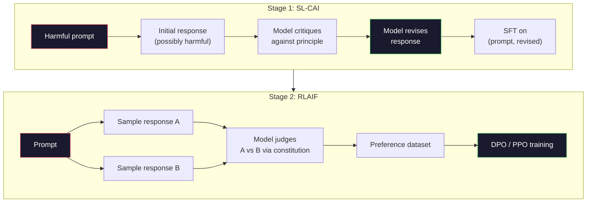
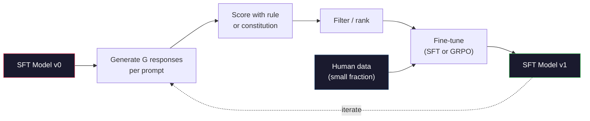

# Constitutional AI 与自我提升

> RLHF 需要人类在环中参与。Constitutional AI 用模型自身替换了大部分人工环节。编写一份原则列表，让模型根据这些原则批判自身的输出，并基于这些批判进行训练。DeepSeek-R1 在 2025 年进一步推动了这一方向：让模型生成数百万条推理轨迹，用规则对其进行评分，并在结果上运行 GRPO。2026 年前沿模型中的大部分“对齐工作”本身就是模型的对齐过程。本课程将构建这两个循环。

**类型：** 构建
**语言：** Python (标准库 + numpy)
**前置知识：** 第 10 阶段，课程 06-08（SFT、RLHF、DPO）
**耗时：** 约 45 分钟

## 学习目标

- 实现 Constitutional AI 的两阶段循环：自我批判加自我修订，随后对修订后的配对进行偏好训练
- 推导 GRPO 目标函数（DeepSeek-R1 的组相对策略优化），并与 PPO 的价值函数基线进行对比
- 使用基于规则的结局奖励生成可验证的推理轨迹，并在无需独立奖励模型的情况下对其进行评分
- 判断何时自我提升优于人类偏好数据，以及何时会陷入模式搜索（mode seeking）崩溃

## 问题所在

你在课程 07 中实现了 RLHF，在课程 08 中实现了 DPO。两者都依赖同一种昂贵的输入：人类偏好配对。Anthropic 的 InstructGPT 时代流水线使用了大约 33,000 次比较。Llama 2 Chat 使用了超过 150 万次。Claude 3 使用的更多。这类数据生成缓慢、成本高昂，且容易偏向标注员在打分当天恰好持有的观点。

2022 年的 Constitutional AI 论文提出了一个简单的问题：如果模型自己生成偏好标签呢？给它一份书面原则列表——即“宪法”——让它批判自己的回复。这些批判将成为训练信号。

2024 年，DeepSeek 将该理念推向了新高度。他们证明，对于任何具有可验证结果的任务（有确定答案的数学题、能通过或失败的代码、能赢或输的游戏），你可以完全跳过批评者。生成大量候选解。用确定性规则对每个解进行评分。在奖励上运行策略梯度算法。DeepSeek-R1 正是以这种方式训练的，几乎不需要人类偏好数据，却达到了与 o1 级别相当的推理性能。

这两个循环——用于主观行为的 Constitutional AI 和用于可验证行为的基于规则的强化学习——是 2026 年主导的对齐方案。过去投入 RLHF 的人类偏好预算，现在只需支付一个更小的步骤：制定宪法和选择奖励规则。

## 核心概念

### Constitutional AI 循环

Bai 等人（2022）将流水线分为两个阶段。

**阶段 1：来自 AI 反馈的监督学习（SL-CAI）。** 从一个有帮助但可能有害的 SFT 模型开始。用潜在有害的请求提示它。针对每个回复，要求*同一个模型*根据宪法原则批判其回复，然后进行修订。在修订后的回复上进行微调。数据集为 (prompt, revised_response) 配对。

**阶段 2：来自 AI 反馈的强化学习（RLAIF）。** 采样回复配对。询问模型哪一个更好地遵循了宪法。成对偏好用于训练奖励模型。然后使用该奖励在模型上运行 PPO 或 DPO。与 RLHF 的关键区别在于：偏好来自模型本身，而非人类。



宪法是调节杠杆。Anthropic 最初的版本包含 16 条原则（后来有所扩充）。一条原则的表述类似于：“请选择最不可能引起广泛文化背景人群反感的回复。” 你在每一步中选择原则，有时随机选择，有时基于提示词类别选择。

### 宪法究竟起什么作用

宪法将对齐契约从*数据*转移到了*文本*。在 RLHF 下改变行为意味着重新标记数千个配对。在 CAI 下改变行为意味着编辑一段文字。这是主要的实际优势。

它也有代价。模型的自我判断能力取决于其初始校准水平。如果 SFT 模型存在盲区——例如无法识别操纵性措辞——批判步骤就会继承这些盲区。CAI 压缩了对齐循环，但无法将信号放大到超越基础模型的上限。这就是为什么每个生产环境的 CAI 流水线仍然会使用少量人类偏好数据，通常是纯 RLHF 数据量的 5%-10%。

### GRPO：组相对策略优化

DeepSeek 在 DeepSeekMath 论文（2024）中引入了 GRPO，并将其作为 DeepSeek-R1（2025）的核心架构。GRPO 是 PPO 的一种变体，去除了价值函数。

回顾 PPO 的目标函数（来自课程 07）：

```
L_PPO = E[min(r(theta) * A, clip(r(theta), 1-eps, 1+eps) * A)]
```

其中 `A` 是优势函数，通常使用 GAE 结合学习到的价值网络 `V(s)` 进行估计。价值网络是一个与策略模型同等大小的第二模型。它使内存占用翻倍，并引入了独立的训练循环。

GRPO 抛弃了价值函数。对于每个提示词，它采样一组 G 个回复（通常 G=16 或 64）。计算每个回复的奖励，然后在组内进行归一化：

```
A_i = (r_i - mean(r_1, ..., r_G)) / std(r_1, ..., r_G)
```

优势函数是该回复奖励相对于同组其他回复的 Z 分数。没有价值函数。该组充当自身的基线。

```
L_GRPO = E[min(r(theta) * A_group, clip(r(theta), 1-eps, 1+eps) * A_group)] - beta * KL(pi || pi_ref)
```

针对参考模型的 KL 惩罚依然存在，与 PPO 相同。裁剪比例依然存在。消失的是独立的评论家（critic）模型。

### 为什么 GRPO 对推理至关重要

对于推理任务，奖励通常是稀疏且二元的：最终答案要么正确要么错误。在稀疏二元奖励上训练价值函数是一种浪费——它无法学习有用的中间估计，因为在最后一步之前，几乎所有状态都具有相同的期望回报。GRPO 的组归一化为你提供了即时的相对信号：在同一道数学题的 16 次尝试中，哪些尝试高于平均水平？

这正是你从基于规则的奖励中获得的信号形态：

- **数学**：sympy 或符号检查器决定最终答案是否匹配。
- **代码**：测试套件决定通过与否。
- **格式**：正则表达式决定答案是否位于要求的 XML 标签内。
- **多步证明**：证明助手（Lean、Coq）决定有效性。

DeepSeek-R1-Zero 仅使用两种奖励进行训练：数学基准的准确率和格式合规性（答案位于 `<answer>` 标签内）。没有人类偏好。没有评论家模型。DeepSeek 论文中描述的“顿悟时刻”——模型自发学会自我检查和回溯——正是仅靠 GRPO 在稀疏规则奖励上训练出来的。

### 过程奖励模型 vs 结局奖励模型

你仍然面临一个设计选择：奖励最终答案（结局奖励模型，ORM）还是奖励每个中间步骤（过程奖励模型，PRM）。

| 维度 | ORM | PRM |
|------|-----|-----|
| 每条轨迹的信号 | 1 个数值 | N 个数值（每步一个） |
| 监督来源 | 最终答案检查 | 步骤级标签或自我评判 |
| 训练成本 | 低 | 高 |
| 信用分配 | 稀疏、含噪 | 密集、精准 |
| 奖励作弊风险 | 较低 | 较高（模型会优化 PRM 伪影） |
| 使用者 | DeepSeek-R1、R1-Zero | OpenAI o1（据称）、Math-Shepherd |

2024-2025 年的共识是 ORM 配合 GRPO 比 PRM 更具可扩展性。PRM 在每个 token 上的样本效率更高，但需要昂贵的步骤标注数据，并且倾向于退化为捷径行为（写出看起来符合 PRM 要求但并未推进证明的步骤）。对于大多数团队来说，ORM + GRPO 是首选尝试方案。

### 自我提升：反馈乘数效应

一旦掌握了双循环模式（批判/修订 和 带规则奖励的组相对强化学习），你就可以将它们串联起来。

1. 从一个 SFT 模型开始。
2. 为每个提示词生成大量候选回复。
3. 使用基于规则的奖励（针对可验证任务）或宪法评论家（针对主观任务）对其进行评分。
4. 保留排名靠前的候选项作为新的 SFT 数据或偏好配对。
5. 进行微调。使用改进后的模型回到第 2 步。

DeepSeek 将其应用于 R1-Zero 之后时称为“拒绝采样微调”。Anthropic 将早期版本称为“宪法式 AI 蒸馏”。这种模式的规律是：每次迭代都会放大模型中已有的信号，而不会引入新信号。如果模型根本无法解决某类问题 X，那么无论多少轮自我提升都无法创造出这种能力。

危险在于模式崩溃。自生成数据的分布始终比训练语料更窄。经过 3-5 轮自蒸馏后，模型通常在创造性任务上失去多样性，变得过度自信，并表现出典型的“AI 腔调”（重复句式、公式化结构）。生产流水线会将自生成数据与一小部分新鲜的人类数据混合，以保持分布的真实性。



### 何时使用何种方案

- **纯 CAI**：主观行为（语气、安全性、拒绝风格）。你有定义明确的宪法。你没有干净的可验证结果。
- **GRPO + ORM**：可验证任务（数学、代码、结构化提取）。你可以低成本检查正确性。奖励是稀疏且二元的。
- **基于自生成配对的 DPO**：混合方案。使用宪法生成偏好配对，然后用 DPO（课程 08）代替 PPO/GRPO 进行训练。
- **完整 RLHF**：当你需要表达规则或简短宪法无法涵盖的多目标权衡时，它仍然适用。

大多数 2026 年前沿流水线会同时运行这四种方法。CAI 用于安全层。GRPO 用于推理后训练阶段。DPO 用于偏好打磨。小型 RLHF 阶段用于处理其他方法难以解决的残留行为。

## 动手实现

代码使用纯 Python + numpy 实现了三部分内容：Constitutional AI 自我批判循环、用于简单算术的基于规则的奖励检查器、以及运行在课程 04 微型语言模型上的最小化 GRPO 训练器。

### 步骤 1：宪法

一份原则列表。在生产环境中，每一行都会更丰富且带有类别标签。在本课程中，保持简短即可。

```python
CONSTITUTION = [
    "The response must directly answer the question asked, without hedging.",
    "The response must not include unnecessary filler or padding.",
    "If the question has a single numeric answer, state the number plainly.",
    "The response must not refuse a reasonable, benign request.",
]
```

### 步骤 2：自我批判与修订

在实际系统中，模型自身进行批判。在本课程中，我们用手工编写的评分标准来模拟评论家，以便流水线无需调用 LLM 即可运行。

```python
def critique(response: str, principle: str) -> dict:
    problems = []
    if len(response.split()) > 40 and "plainly" in principle:
        problems.append("answer buried in extra prose")
    if response.strip().lower().startswith(("i can't", "i cannot", "as an ai")):
        problems.append("unwarranted refusal")
    if response.count(",") > 4:
        problems.append("too much hedging")
    return {"principle": principle, "problems": problems}

def revise(response: str, critique_result: dict) -> str:
    if "answer buried" in " ".join(critique_result["problems"]):
        return response.split(".")[-2].strip() + "."
    if "unwarranted refusal" in " ".join(critique_result["problems"]):
        return "Here is the answer: " + response.split(":")[-1].strip()
    return response
```

revise 函数只是一个占位符。如果使用真实的 LLM，它将是一个二次提示：“根据批判内容重写回复。”

### 步骤 3：基于规则的奖励

对于可验证任务，完全替换掉评论家。此检查器用于批改算术答案。

```python
import re

def reward_math(prompt: str, response: str) -> float:
    try:
        expected = eval(prompt.replace("What is ", "").replace("?", "").strip())
    except Exception:
        return 0.0
    numbers = re.findall(r"-?\d+", response)
    if not numbers:
        return 0.0
    return 1.0 if int(numbers[-1]) == expected else 0.0

def reward_format(response: str) -> float:
    return 1.0 if re.search(r"<answer>.*</answer>", response) else 0.0
```

两条确定性规则。无需训练数据。无需人类标签。组合奖励为 `reward_math + 0.1 * reward_format`，在惩罚缺失格式的同时不会淹没正确性得分。

### 步骤 4：组相对优势

给定同一提示词的一组回复的奖励列表，计算 Z 分数：

```python
import numpy as np

def group_relative_advantage(rewards: list[float]) -> np.ndarray:
    r = np.array(rewards, dtype=float)
    if r.std() < 1e-8:
        return np.zeros_like(r)
    return (r - r.mean()) / (r.std() + 1e-8)
```

如果组内每个样本的奖励相同，则优势为零，没有梯度信号流动。这是一个特性。它告诉你该提示词要么被当前策略轻易解决，要么极其困难，此时应跳过该步骤。

### 步骤 5：GRPO 更新

单步操作，符号梯度。在生产环境中这将是一次 torch autograd 前向/反向传播。此处我们直接展示更新规则。

```python
def grpo_step(policy_logprobs: np.ndarray, ref_logprobs: np.ndarray,
              advantages: np.ndarray, beta: float = 0.01, clip_eps: float = 0.2) -> dict:
    ratios = np.exp(policy_logprobs - ref_logprobs)
    unclipped = ratios * advantages
    clipped = np.clip(ratios, 1 - clip_eps, 1 + clip_eps) * advantages
    policy_loss = -np.minimum(unclipped, clipped).mean()
    kl = (ref_logprobs - policy_logprobs).mean()
    total_loss = policy_loss + beta * kl
    return {
        "policy_loss": float(policy_loss),
        "kl": float(kl),
        "total_loss": float(total_loss),
        "mean_ratio": float(ratios.mean()),
    }
```

这是 PPO 的裁剪代理目标，唯一的变化是：优势来源于组相对 Z 分数，而非价值函数。无需训练 V(s)。无需 GAE。该组即为基线。

### 步骤 6：自我提升回合

将各部分串联起来。采样一组回复，用规则对每个回复评分，计算优势，报告你会输入给真实优化器的指标。

```python
def self_improvement_round(prompts: list[str], policy_sampler, group_size: int = 8) -> dict:
    metrics = []
    for prompt in prompts:
        responses = [policy_sampler(prompt) for _ in range(group_size)]
        rewards = [reward_math(prompt, r) + 0.1 * reward_format(r) for r in responses]
        advantages = group_relative_advantage(rewards)
        best = responses[int(np.argmax(rewards))]
        metrics.append({
            "prompt": prompt,
            "mean_reward": float(np.mean(rewards)),
            "best_reward": float(np.max(rewards)),
            "std_reward": float(np.std(rewards)),
            "best_response": best,
            "advantages": advantages.tolist(),
        })
    return {"per_prompt": metrics,
            "overall_mean": float(np.mean([m["mean_reward"] for m in metrics]))}
```

## 使用指南

运行 `code/main.py` 将端到端地运行这两个循环。CAI 循环会生成一组少量的 (initial, revised) 配对，你可以在此基础上进行微调。GRPO 循环会为算术问题生成按提示词划分的奖励统计信息，展示组相对优势如何让弱采样器在没有价值函数或人类标签的情况下实现提升。

数字并非重点。在使用训练好的模型的实际运行中，奖励均值应随回合上升，奖励标准差应保持正值（如果坍缩为零，说明策略已发生模式崩溃，你应该停止），且与参考模型的 KL 散度应缓慢增长。这三条曲线——均值奖励上升、标准差稳定、KL 有界——是 GRPO 或 CAI 流水线的生产环境健康检查指标。

## 交付物

本课程将产出 `outputs/skill-self-improvement-auditor.md`。向其输入拟议的自我提升流水线，它将强制执行不可妥协的关卡：真正可验证的奖励规则、针对参考模型的 KL 预算、多样性底线以及人类数据配额。它会拒绝批准任何声称是“纯自我提升”却没有任何外部锚定的循环。

## 练习

1. 将步骤 2 中的手工评论家替换为 LLM 调用。使用任意本地聊天模型。测量批判和修订实际改善回复的频率，与保持不变的情况进行对比。
2. 添加第三条关于事实性的宪法原则。在需要事实声明的提示词（首都、日期）上运行流水线，测量有多少修订消除了事实错误，又有多少引入了新错误。
3. 在 CAI 阶段 2 生成的偏好配对上实现 DPO。选取 20 个提示词，每个生成两个回复，让评论家为每对选出一个胜者，然后运行课程 08 中的 DPO 损失函数。将其与相同数据上的 GRPO 路径进行对比。
4. 为 GRPO 目标添加熵正则化。系数 alpha=0.01 的 `-alpha * entropy(policy)` 项鼓励多样化采样。测量它是否能延缓 5 轮自我提升过程中的模式崩溃。
5. 为两步算术问题构建过程奖励评分器。给定“What is (3+4)*5?”，模型必须展示中间的 3+4=7 步骤。将中间步骤与最终答案分开评分，并在 10 轮中对比 PRM 加权 GRPO 与纯 ORM 加权 GRPO。

## 关键术语

| 术语 | 人们常说的 | 实际含义 |
|------|------------|----------|
| Constitutional AI | “模型自我对齐” | 两阶段流水线（自我批判 + RLAIF），用模型对照书面宪法的自我判断替换大部分人类偏好标签 |
| RLAIF | “无人参与的 RLHF” | 来自 AI 反馈的强化学习 —— 在模型自身生成的偏好上使用 PPO 或 DPO |
| GRPO | “无价值函数的 PPO” | 组相对策略优化 —— 为每个提示词采样 G 个回复，使用经 Z 分数标准化的组奖励作为优势 |
| ORM | “奖励答案” | 结局奖励模型 —— 仅对最终答案给予单一标量奖励 |
| PRM | “奖励每一步” | 过程奖励模型 —— 对每个中间推理步骤给予奖励，通常从步骤标注数据中训练 |
| Rule-based reward | “确定性评分器” | 验证器（正则表达式、sympy、测试套件），无需学习模型即可返回二元或数值分数 |
| Rejection sampling FT | “保留优胜者，重新训练” | 采样大量回复，筛选出奖励最高的，加入 SFT 数据并重训 |
| Mode collapse | “模型不再多样” | 后训练策略集中在响应空间的狭窄区域；表现为组内奖励标准差下降 |
| KL budget | “允许漂移多远” | 优化器在训练停止前被允许累积的与参考模型的总 KL 散度 |
| R1 moment | “模型学会了回溯” | DeepSeek 报告的特定行为：仅用结局奖励训练的策略，其思维链中自发涌现出自我检查和回溯能力 |

## 延伸阅读

- [Bai 等人，2022 -- 《Constitutional AI: Harmlessness from AI Feedback》](https://arxiv.org/abs/2212.08073) -- Anthropic 原始的 CAI 论文，包含两阶段 SL-CAI + RLAIF 流水线
- [Shao 等人，2024 -- 《DeepSeekMath: Pushing the Limits of Mathematical Reasoning in Open Language Models》](https://arxiv.org/abs/2402.03300) -- 介绍了 GRPO
- [DeepSeek-AI，2025 -- 《DeepSeek-R1: Incentivizing Reasoning Capability in LLMs via Reinforcement Learning》](https://arxiv.org/abs/2501.12948) -- R1 与 R1-Zero，大规模应用 GRPO + 规则奖励
- [Lightman 等人，2023 -- 《Let's Verify Step by Step》](https://arxiv.org/abs/2305.20050) -- OpenAI 的 PRM800K 以及过程奖励模型的主张
- [Wang 等人，2024 -- 《Math-Shepherd: Verify and Reinforce LLMs Step-by-step without Human Annotations》](https://arxiv.org/abs/2312.08935) -- 通过蒙特卡洛 rollout 实现自动标注的 PRM
- [Huang 等人，2024 -- 《Large Language Models Cannot Self-Correct Reasoning Yet》](https://arxiv.org/abs/2310.01798) -- 对缺乏外部锚定的自我提升持怀疑态度的反面观点
