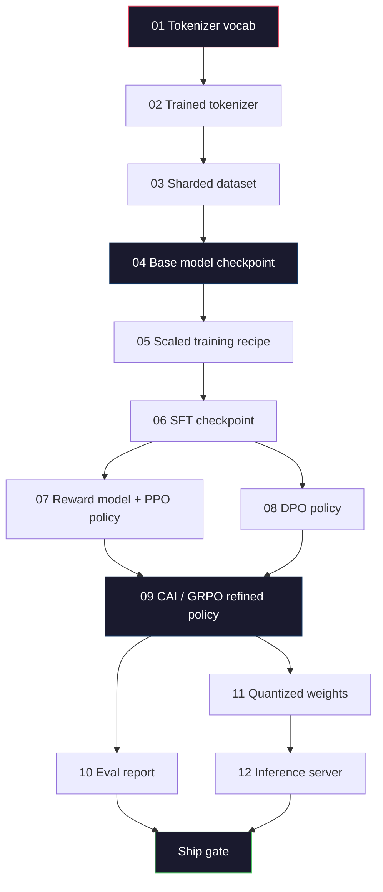
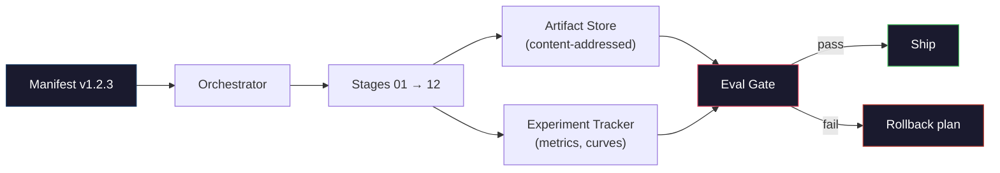

# 构建完整的 LLM 流水线

> 第 01 到 12 课的所有内容构成了一个流水线的各个阶段。本课是将其整合为单一端到端运行的脚手架：分词、预训练、扩展、SFT、对齐、评估、量化、部署。你不会在笔记本上训练一个 70B 的模型。你将构建编排层、清单文件、评估门禁以及 2026 年前沿团队用于决定发布内容的回滚方案。这是本阶段的压轴之作。

**类型：** 构建
**语言：** Python (stdlib)
**前置要求：** Phase 10 第 01-12 课全部内容
**预计时间：** ~120 分钟

## 学习目标

- 将前十一课（分词器、数据、预训练、扩展、SFT、RLHF、DPO、CAI、评估、量化、推理）组合成一个单一的、可复现的流水线规范
- 定义阶段间的产物契约：每个阶段消耗什么、产出什么，以及下一阶段如何验证输入
- 构建一个编排器，用于跟踪实验、哈希化产物，并基于评估阈值控制发布决策
- 设计回滚方案：哪些产物重新运行成本低，哪些成本高，损坏的检查点代价是什么

## 问题所在

前面的课程各自都能跑通。分词器训练完成。微型 GPT 预训练完成。SFT 数据集组装完毕。奖励模型训练完成。DPO 运行完成。评估指标已测量。量化权重已导出。推理服务器已启动。每一个都是一个 Notebook。每一个都有自己的约定、输出路径和随机种子。

前沿训练运行不是 Notebook。Llama 3 405B 在约 54 天内消耗了 3000 万 H100 小时。DeepSeek-V3 使用了约 280 万 H800 小时。在此期间，一个损坏的检查点、一次数据污染、一次评估倒退都可能让团队损失一周的实际耗时和一个月的 GPU 预算。团队应对这种情况的方式是通过流水线规范：每个阶段都有确定性输入、确定性输出、清单文件、哈希值和门禁。

这是压轴之作。你不会在笔记本上端到端运行整个流水线。你将编写协调各阶段的编排器、描述运行的清单文件、控制发布决策的验证器，以及让第三方仅凭单个文件就能重跑你工作的回放方案。代码量很小；但所需的纪律性很强。

该模式从 1 亿参数到 1 万亿参数无需更改即可扩展。相同的四个组件——清单文件、编排器、评估门禁、产物存储——既运行 Llama 3，也运行你的业余 GPT。区别在于每个阶段配置内部的数字大小，而非流水线的结构。

## 核心概念

### 十二个阶段

每个 Phase 10 的课程都是一个阶段。以下是完整的依赖图。



阶段 07 和 08 可以并行运行。其余均为硬性依赖。阶段 02（分词器）的任何变更都会使所有下游产物失效。阶段 10（评估）的变更只会影响发布决策。

### 清单文件 (Manifest)

清单文件是一个单一文件，其描述程度足以重跑整个流程。流水线产出的任何内容都不应依赖于未包含在清单文件中的状态。这些字段枯燥且必须存在。

```
pipeline_version: 1.2.3
seed: 42
git_commit: a1b2c3d4
stages:
  01_tokenizer:
    recipe: bpe_32k
    input_hash: sha256:...
    output_hash: sha256:...
    wall_clock_sec: 3600
    cost_usd: 12
```

阶段 N 的输出哈希是阶段 N+1 的输入哈希。任何偏差都会导致流水线中止。这是早期发现数据损坏的方法。也是不同大洲的队友验证他们的重跑是否产生与你相同产物的方法。

实践中，团队使用小型 YAML 架构加上一个与上次成功运行进行 diff 的清单检查器。任何超出预期字段（成本、实际耗时）的增量都是红色警报。

### 产物类型化 (Artifact Typing)

每个阶段的输出都是类型化的产物。不是目录块，不是 pickle 文件，而是具有已知架构的命名类型。

| 阶段 | 产物类型 | 关键字段 |
|------|----------|----------|
| 01-02 | 分词器 | vocab.json, merges.txt, config.json, hash |
| 03 | 数据集 | shards[], 行数, token 数, 去重统计 |
| 04-05 | 检查点 | weights.safetensors, config.json, 优化器状态, 步数 |
| 06 | SFT 模型 | 检查点 + SFT 配方 + 数据混合比例 |
| 07 | 奖励模型 | RM 检查点 + 偏好数据哈希 |
| 08-09 | 策略模型 | 检查点 + 引用模型哈希 + beta + 消耗的 KL 预算 |
| 10 | 评估报告 | 基准分数 + 回归差异 + 评估数据哈希 |
| 11 | 量化模型 | 量化权重 + 校准数据 + 与 FP16 的精度差异 |
| 12 | 服务规格 | 端点 + 模型哈希 + 配置 + 可观测性钩子 |

类型化防止了最常见的故障模式：将阶段 08 的输出用作阶段 06 的输入，将经过 DPO 训练的模型通过 SFT 路径发布。类型化的产物和类型化的阶段签名将这些错误转化为编译期失败，而非运行几天后才暴露的故障。

### 评估门禁 (Eval Gate)

发布不是“训练结束”。发布是“训练结束且评估门禁通过”。门禁在运行开始前就已定义。

```
gates:
  mmlu:      >= baseline + 0.5   # no regression
  humaneval: >= baseline + 1.0
  truthfulqa: >= baseline         # no drop
  safety_refusal_rate: <= 0.05
  kl_from_reference: <= 25.0
  cost_total_usd: <= 50000
```

每个门禁都是数值阈值。没有“看起来不错”的门禁。没有主观签字确认。如果所有门禁都通过，产物标记为可发布。如果任何门禁失败，运行将被挂起，等待指定审查员的显式覆盖，而覆盖操作本身会记录在清单文件中。

两个门禁能捕获大部分灾难。*回归门禁*（新模型在核心基准上的表现必须至少不低于旧模型）捕获训练 bug。*KL 预算门禁*（对齐后的策略模型偏离引用模型的程度不得超过 X）捕获过度对齐。每条生产流水线都必须同时具备这两者。

### 编排器 (Orchestrator)

一小段代码，读取清单文件，分发阶段，跟踪产物，并在任何契约违规时中止。这不是 Airflow。这不是 Kubeflow。对于流水线规范，你需要的是你自己编写的、枯燥可靠的工具。

编排器的职责很窄：

1. 从清单文件解析 DAG。
2. 对每个阶段，检查预期输出是否已存在于正确的哈希位置（若是则跳过）。
3. 运行阶段，捕获 stdout/stderr，测量实际耗时和成本。
4. 将输出哈希与下游阶段的预期输入哈希进行验证。
5. 失败时，写入包含确切失败阶段的局部清单文件，并以非零退出码退出。

这大约 200 行 Python 代码。它看起来会像本课中的文件 `code/main.py`。底层，真实流水线使用 `torchrun` 或 `ray` 在集群上执行各个阶段，但编排器本身在单台机器上运行。

### 实验追踪与产物存储

两个外部系统支撑着流水线。

**实验追踪器（wandb, neptune, mlflow）。** 记录每个阶段的损失曲线、评估指标、系统遥测数据。当你需要三周后对比运行 A 和运行 B 时，就会来这里查看。团队几乎总是为此使用托管追踪器——自己写会浪费本应用于训练的时间。

**产物存储（S3, R2, GCS）。** 用于检查点、数据集、分词器、评估报告的不可变对象存储。产物通过哈希寻址，而非文件名。类似 `latest.pt` 的文件名是隐患；`ckpt-7b-step-20000-sha256:abc123.safetensors` 才是契约。

编排器向两者写入数据。追踪器供人类查看图表使用。产物存储供下一阶段查找输入使用。

### 成本核算

前沿运行附带一个美元金额。预算纪律体现在两个地方。

**运行前估算。** 根据清单文件计算预期 FLOPs（预训练：6 x params x tokens）、预期 GPU 小时数（FLOPs / 峰值吞吐量 / 利用率）以及当前租赁费率下的美元成本。如果估算超过预算门禁，流水线拒绝启动。

**运行中追踪。** 按阶段记录实际耗时和成本到清单文件。每个阶段结束后检查剩余预算。如果一个阶段超支，下一个阶段的门禁将基于新的剩余预算进行评估。不要等到风投打电话来才发现没钱了。

Llama 3 的报告成本为 6100 万美元。DeepSeek-V3 报告主预训练运行成本为 560 万美元。比例差异主要来自硬件效率和 MoE（混合专家）——但具体成本之所以可见，是因为两个团队都按阶段而非按运行进行了追踪。

### 可复现性 vs 确定性

这不是一回事。*可复现*意味着相同的清单文件加上相同的代码加上相同的基础设施会产生具有等效下游指标的检查点。*确定性*意味着比特级完全相同的输出。

现代 LLM 训练是可复现的，但不是确定性的。分布式训练中的归约顺序、GPU 内核非确定性（cuBLAS, flash-attn）和混合精度舍入相结合，会导致两次运行之间在 1e-5 级别出现浮点数差异。这对最终指标没问题，因为它们不会变动。如果你试图用比特级 diff 调试，这就是致命的。解决方法是记录每个阶段的输入哈希、输出哈希和关键指标——如果这些匹配，即使权重不是比特级完全相同，该运行也算“已复现”。



### 回滚计划

在运行开始前，写下每个阶段失败时的应对措施。分为三类。

- **重新运行成本低**（小时级）：分词器、评估、量化、推理服务器。直接重新运行。
- **中等**（天级）：SFT、DPO、CAI。保留基础模型；仅重新运行对齐阶段。
- **昂贵**（周级和数百万美元）：预训练。这里的回滚计划不是“重新运行”。而是“使用最后一个良好的检查点，并使用修订后的数据重新运行较便宜的下游阶段”。

由于阶段依赖是类型化和哈希化的，编排器可以自动计算回滚集：使失败阶段及其所有后代失效。阶段 06（SFT）的失效会使 06、07、08、09、10、11、12 失效。阶段 11（量化）的失效仅使 11 和 12 失效。提前明确这一点可以避免在凌晨 4 点团队精疲力竭时临时抱佛脚。

### 2026 年观察到的生产配方

大多数前沿团队收敛于相同的骨架。

- 分词器：带 byte fallback 的 128k BPE。在小型、平衡的多语言切片上训练。
- 预训练：10-20T tokens，主要为网页、代码和合成数据。Muon 或 AdamW 优化器。FSDP2 或 DeepSpeed ZeRO-3。梯度检查点。BF16 权重，FP32 master。
- SFT：500k-2M 指令对，混合人工和合成数据，并与评估集严格去重。
- 对齐：DPO 或 CAI + GRPO。仅在偏好信号对 DPO 来说过于多维时使用 RLHF。
- 评估：MMLU-Pro, MATH, HumanEval+, GPQA, SWE-Bench Verified, LiveBench，外加一个公众永远看不到的私有保留集。
- 量化：推理使用 4-bit GPTQ 或 AWQ，安全评估使用 8-bit（因为精度差异很重要）。
- 服务：vLLM, TensorRT-LLM 或自研。连续批处理。推测解码。KV 缓存驱逐。

数字每六个月变化一次。骨架不变。

## 动手构建

本课的代码是编排器和清单检查器，而不是十二个训练脚本。每个阶段都用占位符模拟，生成具有正确形状和哈希的输出产物。端到端运行编排器可以证明流水线的管道连接正常，然后再为真实阶段燃烧 GPU 资金。

完整实现见 `code/main.py`。关键部分包括：

- `Manifest` dataclass：流水线版本、种子、git commit、阶段、门禁。
- `Stage` dataclass：名称、类型、输入（哈希）、输出（哈希）、实际耗时、成本。
- `Orchestrator.run()`：解析 DAG，分发阶段，验证哈希，更新清单文件。
- `EvalGate.check()`：读取阈值，与最新评估报告比较，返回 pass/fail。
- `ArtifactStore`（内存存根）：按哈希 put/get，模拟 S3。
- `CostTracker`：按阶段和累计，超出上限时中止。

`main.py` 中的流水线运行十二个占位符阶段，生成清单文件，并触发失败的评估门禁以展示挂起的运行状态。将每个占位符替换为对应课程的真实训练脚本，你就拥有了真实前沿流水线使用的骨架。

## 如何使用

标准工作流包含三个命令。

```
python code/main.py plan    # validate manifest, compute cost estimate, print DAG
python code/main.py run     # execute stages, writing to manifest.out.yaml
python code/main.py gate    # read manifest.out.yaml, apply eval gates, ship-or-hold
```

每次首先运行 `plan`。大多数流水线 bug 会在规划阶段暴露——缺失的门限阈值、过期的哈希、预算超支。运行 `plan` 是免费的。运行 `run` 是昂贵的。通过在低成本侧捕获 bug 来省钱。

`gate` 的输出要么是 `SHIP`，要么是 `HOLD: <reason>`。挂起的运行不是失败；它是一个决策点。指定审查员要么覆盖（覆盖操作会被记录），要么批准回滚。

## 发布上线

本课产出 `outputs/skill-llm-pipeline-reviewer.md`。向其提供拟议的流水线清单文件，它会检查所有契约：阶段类型化、哈希链、门禁、回滚计划、成本估算。它会拒绝批准缺少评估门禁、KL 预算无界或混合评估与训练数据的清单文件。

## 练习

1. 扩展编排器以支持阶段 07 和 08 的并行执行。使用 stdlib 的 `concurrent.futures` 模块。确认最终清单文件记录了两个阶段的输出，并且阶段 09 的输入哈希是两者的确定性组合。

2. 添加“污染检查”门禁。给定评估数据集哈希和训练数据集分片，计算重叠部分（精确字符串匹配或 13-gram 匹配）。如果重叠超过 0.1%，门禁失败。向其喂入受污染的训练集，并确认门禁会挂起运行。

3. 从零开始实现成本估算器。对于阶段 04（预训练），将 FLOPs 估算为 6 x params x tokens，假设 H100 在 989 TFLOPs BF16 下的 40% MFU（模型算力利用率），费率为 $2.50/GPU-hour。报告在 2T tokens 上训练 7B 模型的估算值。与已发布的 Llama 2 数据进行对比。

4. 构建部分回滚。模拟阶段 09（CAI）失败，然后重新运行阶段 09 至 12，同时保持 01-08 缓存。编排器应通过哈希检测缓存的产物并跳过它们。测量相比完整重跑节省的实际耗时。

5. 添加可观测性。为每个阶段发出 OpenTelemetry spans，属性包含 params、seen tokens、loss 和 cost。将 spans 管道传输到本地 collector。重点不在于仪表盘；重点在于每个阶段的健康状况都可以从单个 trace ID 追溯。

## 关键术语

| 术语 | 人们常说的 | 实际含义 |
|------|------------|----------|
| Manifest (清单文件) | “配方文件” | 描述流水线版本、种子、各阶段配置和门限阈值的 YAML 或 JSON —— 足以重跑一次运行 |
| Content-addressed (内容寻址) | “按哈希不按名称” | 按内容 SHA-256 存储产物，因此你永远无法混淆版本 A 和版本 B |
| Eval gate (评估门禁) | “发布标准” | 基准指标和安全分数的数值阈值，必须在标记产物可发布之前通过 |
| KL budget (KL 预算) | “对齐漂移了多少” | 跨对齐阶段的累积 KL(policy || reference) 上限，作为门禁强制执行 |
| MFU (模型算力利用率) | “你用了多少 GPU” | Model FLOPs Utilization —— 实际 FLOPs 除以理论峰值。70B 规模典型值为 40%，7B 为 55% |
| Rollback plan (回滚计划) | “坏了怎么办” | 针对每个阶段失败预先编写的一系列操作：重新运行、降级、使用修订输入重新训练 |
| Orchestrator (编排器) | “指挥家” | 读取清单文件、分发阶段、验证哈希、在任何契约违规时中止的流程 |
| Artifact store (产物存储) | “权重的版本化 S3” | 不可变的内容寻址对象存储 —— 检查点、数据集、评估报告的单一事实来源 |
| Reproducible (可复现) | “重跑得到相同指标” | 比特级不同的权重但等效的下游指标 —— 分布式 LLM 训练的现实目标 |
| Cost gate (成本门禁) | “不能超过 X” | 运行前成本估算加运行中追踪 —— 如果估算超预算，流水线拒绝启动 |

## 延伸阅读

- [Dubey et al., 2024 -- "The Llama 3 Herd of Models"](https://arxiv.org/abs/2407.21783) -- 关于前沿流水线最详细的公开描述，涵盖数据、训练、对齐、评估
- [DeepSeek-AI, 2024 -- "DeepSeek-V3 Technical Report"](https://arxiv.org/abs/2412.19437) -- 效率优先的流水线，成本约为 Llama 3 级别训练的 1/10
- [Kaplan et al., 2020 -- "Scaling Laws for Neural Language Models"](https://arxiv.org/abs/2001.08361) -- 原始的 compute-data-params 缩放关系
- [Hoffmann et al., 2022 -- "Training Compute-Optimal Large Language Models (Chinchilla)"](https://arxiv.org/abs/2203.15556) -- 对 Kaplan 的修正，重新校准了现代数据预算
- [PyTorch FSDP2 documentation](https://pytorch.org/docs/stable/fsdp.html) -- PyTorch 2.4+ 中替代 FSDP1 的分布式训练原语
- [Weights & Biases LLM Reports](https://wandb.ai/site/llms) -- 开源 LLM 运行的真实清单文件和实验追踪器输出，可作为可借鉴的模板
