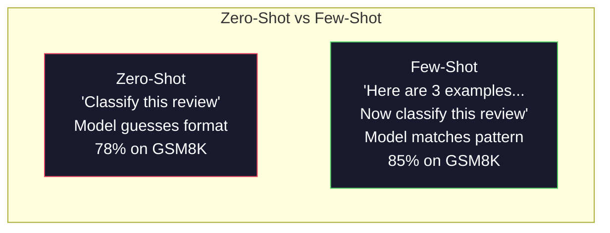
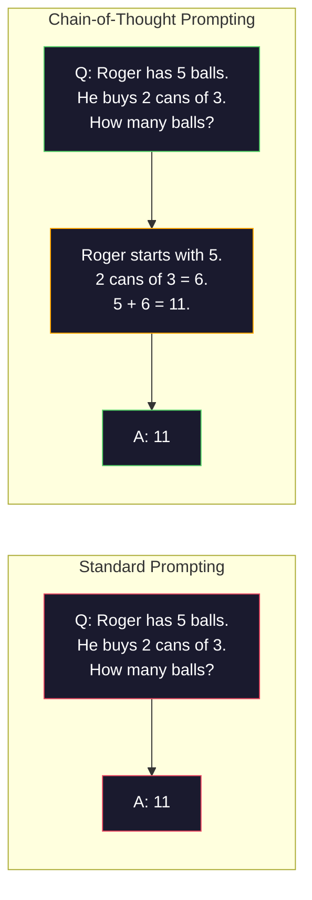
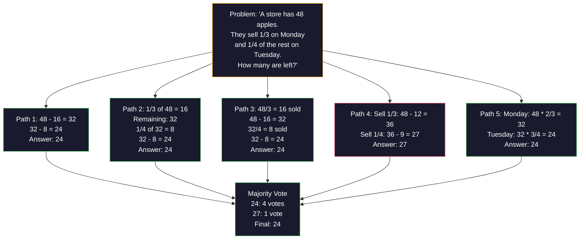
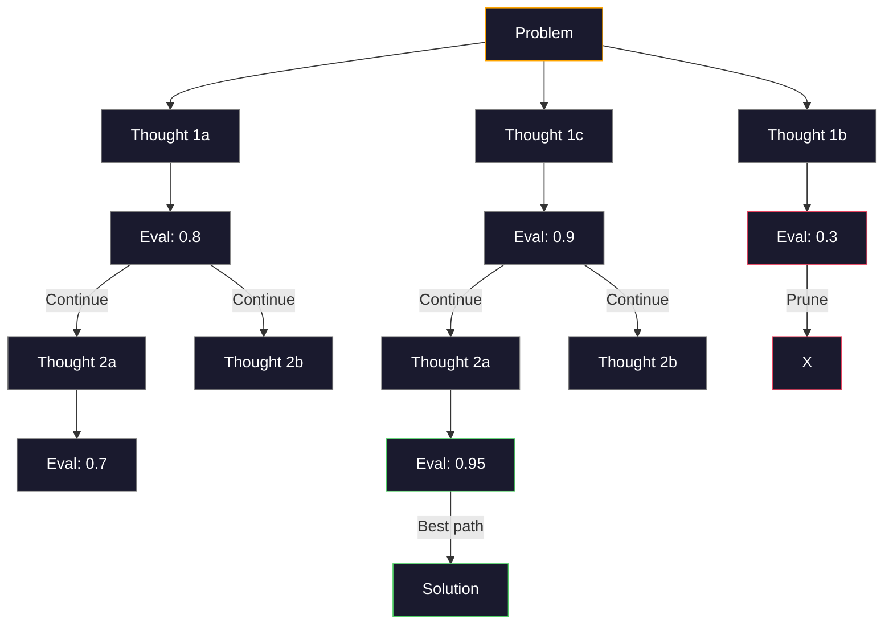
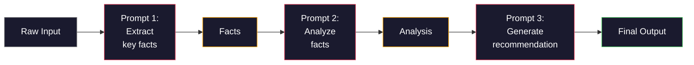

# 少样本提示、思维链、思维树

> 告诉模型该做什么是指令提示（Prompting）。展示它如何思考则是工程实践。相同模型、相同任务、相同数据下，准确率从 78% 到 91% 的差距并非源于更好的模型，而是更优的推理策略。

**类型：** 构建
**语言：** Python
**前置课程：** 第 11.01 课（提示工程）
**预计时间：** 约 45 分钟

## 学习目标

- 通过筛选和格式化示例演示，实现少样本提示，以最大化任务准确率
- 应用思维链（CoT）推理，提升数学应用题等多步问题的准确率
- 构建思维树提示，探索多条推理路径并选择最优解
- 在标准基准上测量零样本、少样本与 CoT 之间的准确率提升幅度

## 问题背景

你正在开发一款数学辅导应用。你的提示词写着：“解答这道应用题。”GPT-5 在 GSM8K（标准小学数学基准测试）上的正确率为 94%。你以为已经触顶了。其实不然——思维链仍能带来 3-4 个百分点的提升。

只需增加五个字——“让我们一步步思考”——准确率就能跃升至 91%。再添加几个带步骤的示例，准确率可达 95%。相同的模型。相同的 temperature 参数。相同的 API 成本。唯一的区别在于，你给了模型一张“草稿纸”。

这不是取巧。这才是推理的本质。人类解决多步问题并非靠一次思维飞跃。Transformer 模型也是如此。当你强制模型生成中间 token 时，这些 token 会成为下一个 token 生成的上下文。每个推理步骤都在为下一步提供输入。模型实际上是逐步计算得出答案的。

但“一步步思考”只是起点，而非终点。如果你采样五条推理路径并进行多数投票会怎样？如果你让模型探索可能性树，评估并剪枝呢？如果你将推理与工具调用交替进行会怎样？这些都不是假设。它们都是已发表且经过实测验证的技术，你将在本课中全部亲手实现。

## 核心概念

### 零样本 vs 少样本：何时示例胜过指令

零样本提示只给模型一个任务，别无其他。少样本提示则先给它看示例。

Wei 等人（2022）在 8 个基准测试中对此进行了测量。对于情感分类等简单任务，零样本和少样本的表现相差不到 2%。对于多步算术和符号推理等复杂任务，少样本能将准确率提升 10-25%。

直觉理解：示例是压缩后的指令。与其描述输出格式，不如直接展示；与其解释推理过程，不如直接演示。模型对示例的模式匹配比解读抽象指令要可靠得多。



**少样本占优的场景：** 格式敏感型任务、分类任务、结构化信息提取、领域特定术语，以及任何需要模型匹配特定模式的场景。

**零样本占优的场景：** 简单的事实性问题、示例会限制创造力的创意任务，以及寻找优质示例比编写优质指令更困难的场景。

### 示例选择：相似性优于随机性

并非所有示例都同等重要。在分类任务中，选择与目标输入相似的示例比随机选择能高出 5-15% 的准确率（Liu 等人，2022）。遵循三个原则：

1. **语义相似性**：选择在嵌入空间中距离输入最近的示例
2. **标签多样性**：确保示例覆盖所有输出类别
3. **难度匹配**：示例复杂度应与目标问题相匹配

大多数任务的最优示例数量是 3-5 个。少于 3 个时，模型缺乏足够的信号来提取模式。多于 5 个时，收益递减且浪费上下文窗口 token。对于多标签分类任务，每个标签使用一个示例即可。

### 思维链：给模型发“草稿纸”

思维链（CoT）提示由 Google Brain 的 Wei 等人（2022）提出。理念很简单：不要只问模型答案，而是要求它先展示推理步骤。



从机制上看为何有效？Transformer 生成的每个 token 都会成为下一个 token 的上下文。没有 CoT 时，模型必须将所有推理压缩到单次前向传播的隐藏状态中。有了 CoT，模型将中间计算外化为 token。每个推理 token 都扩展了有效的计算深度。

**GSM8K 基准测试（小学数学，8.5K 道题目）：**

| 模型 | 零样本 | 零样本 CoT | 少样本 CoT |
|-------|-----------|---------------|--------------|
| GPT-4o | 78% | 91% | 95% |
| GPT-5 | 94% | 97% | 98% |
| o4-mini (reasoning) | 97% | — | — |
| Claude Opus 4.7 | 93% | 97% | 98% |
| Gemini 3 Pro | 92% | 96% | 98% |
| Llama 4 70B | 80% | 89% | 94% |
| DeepSeek-V3.1 | 89% | 94% | 96% |

**关于推理模型的说明。** 像 OpenAI 的 o 系列（o3、o4-mini）和 DeepSeek-R1 这样的模型，在输出答案前会在内部运行思维链。对推理模型添加“让我们一步步思考”是多余的，有时甚至适得其反——因为它们已经内置了这一步。

CoT 有两种形式：

**零样本 CoT**：在提示词末尾追加“让我们一步步思考”。无需示例。Kojima 等人（2022）证明，仅这一句话就能在算术、常识和符号推理任务中提升准确率。

**少样本 CoT**：提供包含推理步骤的示例。比零样本 CoT 更有效，因为模型能看到你期望的确切推理格式。

**CoT 有害的场景**：简单事实回忆（“法国的首都是哪里？”）、单步分类、速度比准确率更重要的任务。每次查询会增加 50-200 个 token 的推理开销。对于高吞吐、低复杂度的任务，这是浪费成本。

### 自洽性：多次采样，一次投票

Wang 等人（2023）提出了自洽性（Self-Consistency）。核心洞察：单条 CoT 路径可能包含推理错误。但如果你采样 N 条独立的推理路径（设置 temperature > 0），并对最终答案进行多数投票，错误就会相互抵消。



在原始的 PaLM 540B 实验中，当 N=40 时，自洽性将 GSM8K 准确率从 56.5%（单条 CoT）提升至 74.4%。在 GPT-5 上提升较小（97% 到 98%），因为基础准确率已趋于饱和。该技术最适用于基础 CoT 准确率为 60-85% 的模型——这是单路径错误频繁但非系统性的“甜蜜点”。对于推理模型（o 系列、R1），自洽性已被其内置的内部采样所涵盖。

权衡取舍：N 次采样意味着 API 成本和延迟增加 N 倍。实践中，N=5 能捕获大部分收益。N=3 是有意义投票的最低要求。对于大多数任务，N > 10 的收益递减。

### 思维树：分支探索

Yao 等人（2023）提出了思维树（Tree-of-Thought, ToT）。与 CoT 遵循单一线性推理路径不同，ToT 会探索多个分支，并在继续之前评估哪些分支最有前景。



ToT 包含三个组件：

1. **思维生成**：生成多个候选下一步
2. **状态评估**：对每个候选项打分（可直接使用 LLM 自身作为评估器）
3. **搜索算法**：在树中进行 BFS 或 DFS 搜索，剪除低分分支

在“24 点游戏”任务（用四则运算组合 4 个数字得到 24）中，标准提示下的 GPT-4 解决率为 7.3%。使用 CoT 时为 4.0%（此处 CoT 反而有害，因为搜索空间过大）。使用 ToT 时达到 74%。

ToT 成本较高。树的每个节点都需要一次 LLM 调用。一个分支因子为 3、深度为 3 的树最多需要 39 次 LLM 调用。仅将其用于搜索空间大但可评估的问题——如规划、解谜、受约束的创造性问题解决。

### ReAct：思考 + 行动

Yao 等人（2022）将推理轨迹与行动相结合。模型在思考（生成推理）和行动（调用工具、搜索、计算）之间交替进行。

```mermaid
graph LR
    Q["Question:\nWhat is the\npopulation of the\ncountry where\nthe Eiffel Tower\nis located?"]
    T1["Thought: I need to\nfind which country\nhas the Eiffel Tower"]
    A1["Action: search\n'Eiffel Tower location'"]
    O1["Observation:\nParis, France"]
    T2["Thought: Now I need\nFrance's population"]
    A2["Action: search\n'France population 2024'"]
    O2["Observation:\n68.4 million"]
    T3["Thought: I have\nthe answer"]
    F["Answer:\n68.4 million"]

    Q --> T1 --> A1 --> O1 --> T2 --> A2 --> O2 --> T3 --> F

    style Q fill:#1a1a2e,stroke:#ffa500,color:#fff
    style T1 fill:#1a1a2e,stroke:#51cf66,color:#fff
    style A1 fill:#1a1a2e,stroke:#e94560,color:#fff
    style O1 fill:#1a1a2e,stroke:#808080,color:#fff
    style T2 fill:#1a1a2e,stroke:#51cf66,color:#fff
    style A2 fill:#1a1a2e,stroke:#e94560,color:#fff
    style O2 fill:#1a1a2e,stroke:#808080,color:#fff
    style T3 fill:#1a1a2e,stroke:#51cf66,color:#fff
    style F fill:#1a1a2e,stroke:#51cf66,color:#fff
```



在知识密集型任务上，ReAct 优于纯 CoT，因为它能将推理建立在真实数据之上。在 HotpotQA（多跳问答）上，配合 GPT-4 的 ReAct 精确匹配率达到 35.1%，而纯 CoT 仅为 29.4%。其真正强大之处在于，观察结果可以纠正推理错误——模型可以在执行过程中更新计划。

ReAct 是现代 AI Agent 的基础。每个 Agent 框架（LangChain、CrewAI、AutoGen）都实现了某种形式的“思考-行动-观察”循环。你将在第 14 阶段构建完整的 Agent。本课重点讲解提示模式。

### 结构化提示：XML 标签、分隔符、标题

随着提示词变得复杂，结构能防止模型混淆各个部分。三种方法：

**XML 标签**（在 Claude 上效果最佳，通用性强）：
```
<context>
You are reviewing a pull request.
The codebase uses TypeScript and React.
</context>

<task>
Review the following diff for bugs, security issues, and style violations.
</task>

<diff>
{diff_content}
</diff>

<output_format>
List each issue with: file, line, severity (critical/warning/info), description.
</output_format>
```

**Markdown 标题**（通用）：
```
## Role
Senior security engineer at a fintech company.

## Task
Analyze this API endpoint for vulnerabilities.

## Input
{api_code}

## Rules
- Focus on OWASP Top 10
- Rate each finding: critical, high, medium, low
- Include remediation steps
```

**分隔符**（简洁但有效）：
```
---INPUT---
{user_text}
---END INPUT---

---INSTRUCTIONS---
Summarize the above in 3 bullet points.
---END INSTRUCTIONS---
```

### 提示词链：顺序分解

有些任务过于复杂，无法用单个提示词完成。提示词链将其拆分为多个步骤，前一个提示词的输出成为后一个提示词的输入。



链式提示优于单提示词，原因有三：

1. **每一步更简单**：模型只需处理一个专注的任务，而非同时兼顾一切
2. **中间输出可检查**：你可以在步骤之间进行验证和修正
3. **不同步骤可使用不同模型**：用廉价模型进行信息提取，用昂贵模型进行推理

### 性能对比

| 技术 | 适用场景 | GSM8K 准确率 (GPT-5) | API 调用次数 | Token 额外开销 | 复杂度 |
|-----------|----------|------------------------|-----------|----------------|------------|
| 零样本 | 简单任务 | 94% | 1 | 无 | 极低 |
| 少样本 | 格式匹配 | 96% | 1 | 200-500 tokens | 低 |
| 零样本 CoT | 快速推理提升 | 97% | 1 | 50-200 tokens | 极低 |
| 少样本 CoT | 单次调用最高准确率 | 98% | 1 | 300-600 tokens | 低 |
| 自洽性 (N=5) | 高风险推理 | 98.5% | 5 | 5倍 token 成本 | 中 |
| 推理模型 (o4-mini) | 即插即用 CoT 替代 | 97% | 1 | 隐藏 (内部 2-10倍) | 极低 |
| 思维树 (ToT) | 搜索/规划问题 | 不适用 (24点游戏 74%) | 10-40+ | 10-40倍 token 成本 | 高 |
| ReAct | 基于知识的推理 | 不适用 (HotpotQA 35.1%) | 3-10+ | 可变 | 高 |
| 提示词链 | 复杂多步任务 | 96% (流水线) | 2-5 | 2-5倍 token 成本 | 中 |

选择合适的技术取决于三个因素：准确率要求、延迟预算和成本容忍度。对于大多数生产系统，采用少样本 CoT 并搭配 3 次采样的自洽性回退策略，即可覆盖 90% 的使用场景。

## 动手实现

我们将构建一个数学问题求解器，将少样本提示、思维链推理和自洽性投票整合到一个流水线中。随后，我们将为难题加入思维树模块。

完整实现位于 `code/advanced_prompting.py`。以下是关键组件。

### 步骤 1：少样本示例存储库

第一个组件负责管理少样本示例，并为给定问题筛选最相关的示例。

```python
GSM8K_EXAMPLES = [
    {
        "question": "Janet's ducks lay 16 eggs per day. She eats three for breakfast every morning and bakes muffins for her friends every day with four. She sells every egg at the farmers' market for $2. How much does she make every day at the farmers' market?",
        "reasoning": "Janet's ducks lay 16 eggs per day. She eats 3 and bakes 4, using 3 + 4 = 7 eggs. So she has 16 - 7 = 9 eggs left. She sells each for $2, so she makes 9 * 2 = $18 per day.",
        "answer": "18"
    },
    ...
]
```

每个示例包含三部分：问题、推理链和最终答案。推理链是将普通少样本示例转化为 CoT 少样本示例的关键。

### 步骤 2：思维链提示词构建器

提示词构建器将系统消息、带推理链的少样本示例和目标问题组装成单个提示词。

```python
def build_cot_prompt(question, examples, num_examples=3):
    system = (
        "You are a math problem solver. "
        "For each problem, show your step-by-step reasoning, "
        "then give the final numerical answer on the last line "
        "in the format: 'The answer is [number]'."
    )

    example_text = ""
    for ex in examples[:num_examples]:
        example_text += f"Q: {ex['question']}\n"
        example_text += f"A: {ex['reasoning']} The answer is {ex['answer']}.\n\n"

    user = f"{example_text}Q: {question}\nA:"
    return system, user
```

格式约束（“答案是 [数字]”）至关重要。没有它，自洽性就无法跨样本提取和比较答案。

### 步骤 3：自洽性投票

采样 N 条推理路径，并取多数答案。

```python
def self_consistency_solve(question, examples, client, model, n_samples=5):
    system, user = build_cot_prompt(question, examples)

    answers = []
    reasonings = []
    for _ in range(n_samples):
        response = client.chat.completions.create(
            model=model,
            messages=[
                {"role": "system", "content": system},
                {"role": "user", "content": user}
            ],
            temperature=0.7
        )
        text = response.choices[0].message.content
        reasonings.append(text)
        answer = extract_answer(text)
        if answer is not None:
            answers.append(answer)

    vote_counts = Counter(answers)
    best_answer = vote_counts.most_common(1)[0][0] if vote_counts else None
    confidence = vote_counts[best_answer] / len(answers) if best_answer else 0

    return best_answer, confidence, reasonings, vote_counts
```

设置 temperature 为 0.7 很重要。如果为 0.0，所有 N 次采样结果将完全相同，失去意义。你需要足够的随机性以产生多样化的推理路径，但又不能过多导致模型输出乱码。

### 步骤 4：思维树求解器

对于线性推理失效的问题，ToT 会探索多种方法并评估哪个方向最有前景。

```python
def tree_of_thought_solve(question, client, model, breadth=3, depth=3):
    thoughts = generate_initial_thoughts(question, client, model, breadth)
    scored = [(t, evaluate_thought(t, question, client, model)) for t in thoughts]
    scored.sort(key=lambda x: x[1], reverse=True)

    for current_depth in range(1, depth):
        next_thoughts = []
        for thought, score in scored[:2]:
            extensions = extend_thought(thought, question, client, model, breadth)
            for ext in extensions:
                ext_score = evaluate_thought(ext, question, client, model)
                next_thoughts.append((ext, ext_score))
        scored = sorted(next_thoughts, key=lambda x: x[1], reverse=True)

    best_thought = scored[0][0] if scored else ""
    return extract_answer(best_thought), best_thought
```

评估器本身也是一次 LLM 调用。你询问模型：“在 0.0 到 1.0 的评分中，这条推理路径解决这个问题的前景如何？”这正是 ToT 的核心洞察——模型评估自身的部分解决方案。

### 步骤 5：完整流水线

该流水线结合所有技术，并采用升级策略。

```python
def solve_with_escalation(question, examples, client, model):
    system, user = build_cot_prompt(question, examples)
    single_response = call_llm(client, model, system, user, temperature=0.0)
    single_answer = extract_answer(single_response)

    sc_answer, confidence, _, _ = self_consistency_solve(
        question, examples, client, model, n_samples=5
    )

    if confidence >= 0.8:
        return sc_answer, "self_consistency", confidence

    tot_answer, _ = tree_of_thought_solve(question, client, model)
    return tot_answer, "tree_of_thought", None
```

升级逻辑：优先尝试低成本方案（单次 CoT）。如果自洽性置信度低于 0.8（5 次采样中少于 4 次一致），则升级到 ToT。这平衡了成本与准确率——大多数问题以低成本解决，难题则分配更多算力。

## 实际应用

### 结合 LangChain

LangChain 提供了提示词模板和输出解析的内置支持，简化了少样本和 CoT 模式：

```python
from langchain_core.prompts import FewShotPromptTemplate, PromptTemplate
from langchain_openai import ChatOpenAI

example_prompt = PromptTemplate(
    input_variables=["question", "reasoning", "answer"],
    template="Q: {question}\nA: {reasoning} The answer is {answer}."
)

few_shot_prompt = FewShotPromptTemplate(
    examples=examples,
    example_prompt=example_prompt,
    suffix="Q: {input}\nA: Let's think step by step.",
    input_variables=["input"]
)

llm = ChatOpenAI(model="gpt-4o", temperature=0.7)
chain = few_shot_prompt | llm
result = chain.invoke({"input": "If a train travels 120 km in 2 hours..."})
```

LangChain 还提供了用于语义相似性选择的 `ExampleSelector` 类：

```python
from langchain_core.example_selectors import SemanticSimilarityExampleSelector
from langchain_openai import OpenAIEmbeddings

selector = SemanticSimilarityExampleSelector.from_examples(
    examples,
    OpenAIEmbeddings(),
    k=3
)
```

### 结合 DSPy

DSPy 将提示策略视为可优化的模块。无需手动编写 CoT 提示词，只需定义签名，让 DSPy 自动优化提示词：

```python
import dspy

dspy.configure(lm=dspy.LM("openai/gpt-4o", temperature=0.7))

class MathSolver(dspy.Module):
    def __init__(self):
        self.solve = dspy.ChainOfThought("question -> answer")

    def forward(self, question):
        return self.solve(question=question)

solver = MathSolver()
result = solver(question="Janet's ducks lay 16 eggs per day...")
```

DSPy 的 `ChainOfThought` 会自动添加推理轨迹。`dspy.majority` 实现了自洽性：

```python
result = dspy.majority(
    [solver(question=q) for _ in range(5)],
    field="answer"
)
```

### 对比：从零实现 vs 框架

| 特性 | 从零实现（本课） | LangChain | DSPy |
|---------|--------------------------|-----------|------|
| 提示词格式控制 | 完全掌控 | 基于模板 | 自动 |
| 自洽性 | 手动投票 | 手动 | 内置 (`dspy.majority`) |
| 示例选择 | 自定义逻辑 | `ExampleSelector` | `dspy.BootstrapFewShot` |
| 思维树 | 自定义树搜索 | 社区链 | 未内置 |
| 提示词优化 | 手动迭代 | 手动 | 自动编译 |
| 最佳适用场景 | 学习、定制流水线 | 标准工作流 | 研究、优化 |

## 交付成果

本课将产出两个工件。

**1. 推理链提示词**（`outputs/prompt-reasoning-chain.md`）：一套面向生产的少样本 CoT 提示词模板，支持自洽性。填入你的示例和问题领域即可直接使用。

**2. CoT 模式选择技能**（`outputs/skill-cot-patterns.md`）：一套决策框架，根据任务类型、准确率要求和成本约束来选择正确的推理技术。

## 练习

1. **测量差距**：选取 10 道 GSM8K 题目。分别使用零样本、少样本、零样本 CoT 和少样本 CoT 求解。记录每种方法的准确率。哪种技术对你的模型提升最大？
2. **示例选择实验**：针对同样的 10 道题，对比随机选择示例与人工挑选的相似示例。测量准确率差异。在什么情况下示例质量比数量更重要？
3. **自洽性成本曲线**：在 20 道 GSM8K 题目上运行自洽性，设置 N=1, 3, 5, 7, 10。绘制准确率与成本（总 token 数）的关系图。你的模型曲线上拐点出现在哪里？
4. **构建 ReAct 循环**：为流水线添加计算器工具。当模型生成数学表达式时，使用 Python 的 `eval()`（在沙箱环境中）执行并将结果反馈回去。测量基于工具的推理是否优于纯 CoT。
5. **ToT 用于创意任务**：将思维树求解器适配于创意写作任务：“写一个既好笑又悲伤的六字故事。”使用 LLM 作为评估器。分支探索是否能比单次生成产出更好的创意结果？

## 核心术语

| 术语 | 人们常说的说法 | 实际含义 |
|------|----------------|----------------------|
| 少样本提示 (Few-shot prompting) | “给它一些示例” | 在提示词中包含输入-输出演示，以锚定模型的输出格式和行为 |
| 思维链 (Chain-of-Thought) | “让它一步步思考” | 诱导模型生成中间推理 token，在输出最终答案前扩展模型的有效计算过程 |
| 自洽性 (Self-Consistency) | “多跑几次” | 在 temperature > 0 下采样 N 条多样化的推理路径，并通过多数投票选出最常见的最终答案 |
| 思维树 (Tree-of-Thought) | “让它探索选项” | 对推理分支进行结构化搜索，评估每个部分解决方案，仅扩展有前景的路径 |
| ReAct | “思考 + 工具使用” | 在“思考-行动-观察”循环中，将推理轨迹与外部动作（搜索、计算、API 调用）交替进行 |
| 提示词链 (Prompt chaining) | “拆分成步骤” | 将复杂任务分解为顺序提示词，每个提示词的输出作为下一个的输入 |
| 零样本 CoT (Zero-shot CoT) | “直接加上‘一步步思考’” | 在不提供任何示例的情况下，在提示词末尾追加推理触发短语，依赖模型的潜在推理能力 |

## 延伸阅读

- [Chain-of-Thought Prompting Elicits Reasoning in Large Language Models](https://arxiv.org/abs/2201.11903) -- Wei 等人，2022。Google Brain 提出的原始 CoT 论文。阅读第 2-3 节了解核心结论。
- [Self-Consistency Improves Chain of Thought Reasoning in Language Models](https://arxiv.org/abs/2203.11171) -- Wang 等人，2023。自洽性论文。表 1 包含了所需的所有数据。
- [Tree of Thoughts: Deliberate Problem Solving with Large Language Models](https://arxiv.org/abs/2305.10601) -- Yao 等人，2023。ToT 论文。第 4 节的 24 点游戏结果是亮点。
- [ReAct: Synergizing Reasoning and Acting in Language Models](https://arxiv.org/abs/2210.03629) -- Yao 等人，2022。现代 AI Agent 的基础。第 3 节解释了“思考-行动-观察”循环。
- [Large Language Models are Zero-Shot Reasoners](https://arxiv.org/abs/2205.11916) -- Kojima 等人，2022。“让我们一步步思考”的出处论文。尽管极其简单，但效果出乎意料地好。
- [DSPy: Compiling Declarative Language Model Calls into Self-Improving Pipelines](https://arxiv.org/abs/2310.03714) -- Khattab 等人，2023。将提示词视为编译问题。若想超越手动提示词工程，推荐阅读。
- [OpenAI — Reasoning models guide](https://platform.openai.com/docs/guides/reasoning) -- 厂商指南，说明何时思维链会转变为按 token 计费的内部“推理”模式，而非提示词层面的技巧。
- [Lightman et al., "Let's Verify Step by Step" (2023)](https://arxiv.org/abs/2305.20050) -- 过程奖励模型（PRM），对链条中的每一步进行评分；这是一种取代仅结果奖励的推理监督信号。
- [Snell et al., "Scaling LLM Test-Time Compute Optimally" (2024)](https://arxiv.org/abs/2408.03314) -- 对 CoT 长度、自洽性采样和 MCTS 的系统性研究；探讨当准确率比延迟更重要时，“一步步思考”应走向何方。
