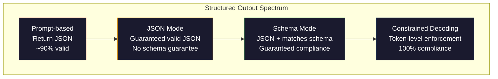
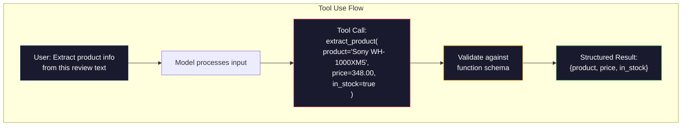

# 结构化输出：JSON、Schema 验证与约束解码

> 你的 LLM 返回的是字符串，而你的应用需要的是 JSON。这个鸿沟导致的线上系统崩溃比任何模型幻觉都要多。结构化输出是自然语言与类型化数据之间的桥梁。做对了，你的 LLM 就是一个可靠的 API；做错了，你只能在凌晨三点用正则表达式去解析自由文本。

**类型：** 构建实践
**语言：** Python
**前置知识：** 第 10 阶段，课程 01-05（从零构建 LLM）
**预计时间：** 约 90 分钟
**相关课程：** 第 5 阶段 · 20（结构化输出与约束解码）涵盖了解码器层面的理论（FSM/CFG logit 处理器、Outlines、XGrammar）。本课程侧重于生产环境的 SDK 接口（OpenAI `response_format`、Anthropic tool use、Instructor）——若想理解 API 底层发生了什么，请先阅读第 5 阶段 · 20。

## 学习目标

- 使用 OpenAI 和 Anthropic API 参数实现 JSON 模式及受 Schema 约束的输出
- 构建基于 Pydantic 的验证层，用于拒绝格式错误的 LLM 输出，并在错误反馈下重试
- 解释约束解码如何在无需后处理的情况下，在 Token 级别强制生成有效的 JSON
- 设计健壮的提取提示词，可靠地将非结构化文本转换为类型化数据结构

## 问题所在

你向 LLM 提问：“从这段文本中提取产品名称、价格和库存状态。”它回复道：

```
The product is the Sony WH-1000XM5 headphones, which cost $348.00 and are currently in stock.
```

这是一个完全正确的回答。但对你的应用来说毫无用处。你的库存系统需要的是 `{"product": "Sony WH-1000XM5", "price": 348.00, "in_stock": true}`。你需要的是一个具有特定键名、特定类型和特定值约束的 JSON 对象，而不是一句话。

朴素的解决方案：在提示词中加入“请以 JSON 格式回复”。这能解决 90% 的情况。剩下的 10% 里，模型可能会把 JSON 包裹在 Markdown 代码块中，或者加上“以下是 JSON：”之类的前缀，又或者因为提前闭合了括号而产生语法无效的 JSON。你的 JSON 解析器会崩溃，流水线会中断。于是你加上 `try/except` 和重试循环。但重试有时会产生不同的数据。现在，你在解析问题之上又叠加了一个一致性问题。

这不是提示词工程的问题，而是解码问题。模型从左到右生成 Token。在每个位置，它都会从 10 万多个选项中挑选最可能的下一个 Token。在这些选项中，绝大多数在任何给定位置都会产生无效的 JSON。如果模型刚刚输出了 `{"price":`，那么下一个 Token 必须是数字、引号（用于字符串）、`null`、`true`、`false` 或负号。其他任何内容都会导致 JSON 无效。如果没有约束，模型可能会选择一个在语义上完全合理但在句法上彻底错误的英文单词。

## 核心概念

### 结构化输出的控制层级

结构化输出控制分为四个层级，可靠性依次递增。



**基于提示词**（“请以有效 JSON 格式回复”）：无强制约束。模型通常会配合，但偶尔会失败。可靠性：约 90%。失败模式：Markdown 代码块、前缀文本、输出截断、结构错误。

**JSON 模式**：API 保证输出是有效的 JSON。通过 OpenAI 的 `response_format: { type: "json_object" }` 启用。输出将能够无误解析。但它可能不符合你预期的 Schema——可能包含多余键名、类型错误或缺失字段。

**Schema 模式**：API 接收一个 JSON Schema 并保证输出与之匹配。到了 2026 年，所有主流提供商都原生支持此功能：OpenAI 的 `response_format: { type: "json_schema", json_schema: {...} }`（也可作为 `tool_choice="required"`），Anthropic 的 tool use 配合 `input_schema`，以及 Gemini 的 `response_schema` + `response_mime_type: "application/json"`。输出将严格包含你指定的键名、类型和约束。

**约束解码**：在生成过程中的每个 Token 位置，解码器都会屏蔽所有会导致无效输出的 Token。如果 Schema 要求输出数字，而模型即将输出字母，该 Token 的概率将被置为零。模型只能生成导向有效输出的 Token。这正是 OpenAI 的结构化输出模式以及 Outlines、Guidance 等库在底层实现的方式。

### JSON Schema：契约语言

JSON Schema 是你告诉模型（或验证层）输出必须具有何种形状的方式。所有主流的结构化输出系统都依赖它。

```json
{
  "type": "object",
  "properties": {
    "product": { "type": "string" },
    "price": { "type": "number", "minimum": 0 },
    "in_stock": { "type": "boolean" },
    "categories": {
      "type": "array",
      "items": { "type": "string" }
    }
  },
  "required": ["product", "price", "in_stock"]
}
```

该 Schema 规定：输出必须是一个对象，包含字符串类型的 `product`、非负数字类型的 `price`、布尔类型的 `in_stock`，以及可选的字符串数组 `categories`。任何不匹配的输出都将被拒绝。

Schema 能够处理复杂情况：嵌套对象、包含类型化元素的数组、枚举（将字符串限制为特定值）、模式匹配（对字符串使用正则表达式）以及组合器（oneOf、anyOf、allOf 用于多态输出）。

### Pydantic 模式

在 Python 中，你不需要手动编写 JSON Schema。只需定义一个 Pydantic 模型，它便会为你自动生成 Schema。

```python
from pydantic import BaseModel

class Product(BaseModel):
    product: str
    price: float
    in_stock: bool
    categories: list[str] = []
```

这将生成与上文相同的 JSON Schema。Instructor 库（以及 OpenAI 的 SDK）直接接受 Pydantic 模型：传入模型类，即可返回经过验证的实例。如果 LLM 的输出不匹配，Instructor 会自动重试。

### 函数调用 / Tool Use

这是解决同一问题的另一种接口方式。与其让模型直接生成 JSON，不如定义带有类型参数的“工具”（函数）。模型会输出带有结构化参数的函数调用。OpenAI 称之为“函数调用”，Anthropic 称之为“tool use”。结果是一样的：结构化数据。



当模型需要决定调用哪个函数，而不仅仅是填充参数时，推荐使用 tool use。如果你拥有 10 种不同的提取 Schema，且模型必须根据输入选择正确的一种，tool use 能同时提供 Schema 选择和结构化输出。

### 常见失败模式

即使启用了 Schema 强制校验，结构化输出仍可能以微妙的方式失败。

**幻觉值**：输出符合 Schema，但包含捏造的数据。文本显示 $348，模型却输出了 `{"price": 299.99}`。Schema 验证无法捕获此类问题——类型正确，但值错误。

**枚举混淆**：你将字段约束为 `["in_stock", "out_of_stock", "preorder"]`。模型输出了 `"available"`——语义正确，但不在允许集合内。优秀的约束解码能避免此问题，基于提示词的方法则不能。

**嵌套对象深度**：深层嵌套的 Schema（4 层以上）会产生更多错误。每一层嵌套都是模型可能迷失结构的地方。

**数组长度**：模型可能在数组中生成过多或过少的元素。Schema 支持 `minItems` 和 `maxItems`，但并非所有提供商都在解码层面强制执行这些限制。

**可选字段遗漏**：模型会省略技术上可选但在你的用例中语义重要的字段。即使在数据有时缺失的情况下，也请在 Schema 中将它们设为必填——强制模型显式输出 `null`。

## 动手实践

### 步骤 1：JSON Schema 验证器

从头构建一个验证器，检查 Python 对象是否符合 JSON Schema。这是在输出端运行以验证合规性的组件。

```python
import json

def validate_schema(data, schema):
    errors = []
    _validate(data, schema, "", errors)
    return errors

def _validate(data, schema, path, errors):
    schema_type = schema.get("type")

    if schema_type == "object":
        if not isinstance(data, dict):
            errors.append(f"{path}: expected object, got {type(data).__name__}")
            return
        for key in schema.get("required", []):
            if key not in data:
                errors.append(f"{path}.{key}: required field missing")
        properties = schema.get("properties", {})
        for key, value in data.items():
            if key in properties:
                _validate(value, properties[key], f"{path}.{key}", errors)

    elif schema_type == "array":
        if not isinstance(data, list):
            errors.append(f"{path}: expected array, got {type(data).__name__}")
            return
        min_items = schema.get("minItems", 0)
        max_items = schema.get("maxItems", float("inf"))
        if len(data) < min_items:
            errors.append(f"{path}: array has {len(data)} items, minimum is {min_items}")
        if len(data) > max_items:
            errors.append(f"{path}: array has {len(data)} items, maximum is {max_items}")
        items_schema = schema.get("items", {})
        for i, item in enumerate(data):
            _validate(item, items_schema, f"{path}[{i}]", errors)

    elif schema_type == "string":
        if not isinstance(data, str):
            errors.append(f"{path}: expected string, got {type(data).__name__}")
            return
        enum_values = schema.get("enum")
        if enum_values and data not in enum_values:
            errors.append(f"{path}: '{data}' not in allowed values {enum_values}")

    elif schema_type == "number":
        if not isinstance(data, (int, float)):
            errors.append(f"{path}: expected number, got {type(data).__name__}")
            return
        minimum = schema.get("minimum")
        maximum = schema.get("maximum")
        if minimum is not None and data < minimum:
            errors.append(f"{path}: {data} is less than minimum {minimum}")
        if maximum is not None and data > maximum:
            errors.append(f"{path}: {data} is greater than maximum {maximum}")

    elif schema_type == "boolean":
        if not isinstance(data, bool):
            errors.append(f"{path}: expected boolean, got {type(data).__name__}")

    elif schema_type == "integer":
        if not isinstance(data, int) or isinstance(data, bool):
            errors.append(f"{path}: expected integer, got {type(data).__name__}")
```

### 步骤 2：Pydantic 风格模型转 Schema

构建一个最小化的类转 Schema 转换器。定义一个 Python 类并自动生成其 JSON Schema。

```python
class SchemaField:
    def __init__(self, field_type, required=True, default=None, enum=None, minimum=None, maximum=None):
        self.field_type = field_type
        self.required = required
        self.default = default
        self.enum = enum
        self.minimum = minimum
        self.maximum = maximum

def python_type_to_schema(field):
    type_map = {
        str: "string",
        int: "integer",
        float: "number",
        bool: "boolean",
    }

    schema = {}

    if field.field_type in type_map:
        schema["type"] = type_map[field.field_type]
    elif field.field_type == list:
        schema["type"] = "array"
        schema["items"] = {"type": "string"}
    elif isinstance(field.field_type, dict):
        schema = field.field_type

    if field.enum:
        schema["enum"] = field.enum
    if field.minimum is not None:
        schema["minimum"] = field.minimum
    if field.maximum is not None:
        schema["maximum"] = field.maximum

    return schema

def model_to_schema(name, fields):
    properties = {}
    required = []

    for field_name, field in fields.items():
        properties[field_name] = python_type_to_schema(field)
        if field.required:
            required.append(field_name)

    return {
        "type": "object",
        "properties": properties,
        "required": required,
    }
```

### 步骤 3：约束 Token 过滤器

模拟约束解码。给定部分 JSON 字符串和 Schema，确定当前位置哪些 Token 类别是合法的。

```python
def next_valid_tokens(partial_json, schema):
    stripped = partial_json.strip()

    if not stripped:
        return ["{"]

    try:
        json.loads(stripped)
        return ["<EOS>"]
    except json.JSONDecodeError:
        pass

    last_char = stripped[-1] if stripped else ""

    if last_char == "{":
        return ['"', "}"]
    elif last_char == '"':
        if stripped.endswith('":'):
            return ['"', "0-9", "true", "false", "null", "[", "{"]
        return ["a-z", '"']
    elif last_char == ":":
        return [" ", '"', "0-9", "true", "false", "null", "[", "{"]
    elif last_char == ",":
        return [" ", '"', "{", "["]
    elif last_char in "0123456789":
        return ["0-9", ".", ",", "}", "]"]
    elif last_char == "}":
        return [",", "}", "]", "<EOS>"]
    elif last_char == "]":
        return [",", "}", "<EOS>"]
    elif last_char == "[":
        return ['"', "0-9", "true", "false", "null", "{", "[", "]"]
    else:
        return ["any"]

def demonstrate_constrained_decoding():
    partial_states = [
        '',
        '{',
        '{"product"',
        '{"product":',
        '{"product": "Sony"',
        '{"product": "Sony",',
        '{"product": "Sony", "price":',
        '{"product": "Sony", "price": 348',
        '{"product": "Sony", "price": 348}',
    ]

    print(f"{'Partial JSON':<45} {'Valid Next Tokens'}")
    print("-" * 80)
    for state in partial_states:
        valid = next_valid_tokens(state, {})
        display = state if state else "(empty)"
        print(f"{display:<45} {valid}")
```

### 步骤 4：提取流水线

将所有组件整合为提取流水线：定义 Schema，模拟 LLM 生成结构化输出，验证输出，并处理重试逻辑。

```python
def simulate_llm_extraction(text, schema, attempt=0):
    if "headphones" in text.lower() or "sony" in text.lower():
        if attempt == 0:
            return '{"product": "Sony WH-1000XM5", "price": 348.00, "in_stock": true, "categories": ["audio", "headphones"]}'
        return '{"product": "Sony WH-1000XM5", "price": 348.00, "in_stock": true}'

    if "laptop" in text.lower():
        return '{"product": "MacBook Pro 16", "price": 2499.00, "in_stock": false, "categories": ["computers"]}'

    return '{"product": "Unknown", "price": 0, "in_stock": false}'

def extract_with_retry(text, schema, max_retries=3):
    for attempt in range(max_retries):
        raw = simulate_llm_extraction(text, schema, attempt)

        try:
            data = json.loads(raw)
        except json.JSONDecodeError as e:
            print(f"  Attempt {attempt + 1}: JSON parse error -- {e}")
            continue

        errors = validate_schema(data, schema)
        if not errors:
            return data

        print(f"  Attempt {attempt + 1}: Schema validation errors -- {errors}")

    return None

product_schema = {
    "type": "object",
    "properties": {
        "product": {"type": "string"},
        "price": {"type": "number", "minimum": 0},
        "in_stock": {"type": "boolean"},
        "categories": {"type": "array", "items": {"type": "string"}},
    },
    "required": ["product", "price", "in_stock"],
}
```

### 步骤 5：运行完整流水线

```python
def run_demo():
    print("=" * 60)
    print("  Structured Output Pipeline Demo")
    print("=" * 60)

    print("\n--- Schema Definition ---")
    product_fields = {
        "product": SchemaField(str),
        "price": SchemaField(float, minimum=0),
        "in_stock": SchemaField(bool),
        "categories": SchemaField(list, required=False),
    }
    generated_schema = model_to_schema("Product", product_fields)
    print(json.dumps(generated_schema, indent=2))

    print("\n--- Schema Validation ---")
    test_cases = [
        ({"product": "Test", "price": 10.0, "in_stock": True}, "Valid object"),
        ({"product": "Test", "price": -5.0, "in_stock": True}, "Negative price"),
        ({"product": "Test", "in_stock": True}, "Missing price"),
        ({"product": "Test", "price": "ten", "in_stock": True}, "String as price"),
        ("not an object", "String instead of object"),
    ]

    for data, label in test_cases:
        errors = validate_schema(data, product_schema)
        status = "PASS" if not errors else f"FAIL: {errors}"
        print(f"  {label}: {status}")

    print("\n--- Constrained Decoding Simulation ---")
    demonstrate_constrained_decoding()

    print("\n--- Extraction Pipeline ---")
    texts = [
        "The Sony WH-1000XM5 headphones are priced at $348 and currently available.",
        "The new MacBook Pro 16-inch laptop costs $2499 but is sold out.",
        "This is a random sentence with no product info.",
    ]

    for text in texts:
        print(f"\n  Input: {text[:60]}...")
        result = extract_with_retry(text, product_schema)
        if result:
            print(f"  Output: {json.dumps(result)}")
        else:
            print(f"  Output: FAILED after retries")
```

## 实际应用

### OpenAI 结构化输出

```python
# from openai import OpenAI
# from pydantic import BaseModel
#
# client = OpenAI()
#
# class Product(BaseModel):
#     product: str
#     price: float
#     in_stock: bool
#
# response = client.beta.chat.completions.parse(
#     model="gpt-5-mini",
#     messages=[
#         {"role": "system", "content": "Extract product information."},
#         {"role": "user", "content": "Sony WH-1000XM5, $348, in stock"},
#     ],
#     response_format=Product,
# )
#
# product = response.choices[0].message.parsed
# print(product.product, product.price, product.in_stock)
```

OpenAI 的结构化输出模式在内部使用了约束解码。模型生成的每一个 Token 都保证产出符合 Pydantic Schema 的结果。无需重试，无需额外验证。约束已内置于解码过程中。

### Anthropic Tool Use

```python
# import anthropic
#
# client = anthropic.Anthropic()
#
# response = client.messages.create(
#     model="claude-opus-4-7",
#     max_tokens=1024,
#     tools=[{
#         "name": "extract_product",
#         "description": "Extract product information from text",
#         "input_schema": {
#             "type": "object",
#             "properties": {
#                 "product": {"type": "string"},
#                 "price": {"type": "number"},
#                 "in_stock": {"type": "boolean"},
#             },
#             "required": ["product", "price", "in_stock"],
#         },
#     }],
#     messages=[{"role": "user", "content": "Extract: Sony WH-1000XM5, $348, in stock"}],
# )
```

Anthropic 通过 tool use 实现结构化输出。模型会发出带有结构化参数的工具调用，这些参数与 input_schema 匹配。结果相同，API 接口不同。

### Instructor 库

```python
# pip install instructor
# import instructor
# from openai import OpenAI
# from pydantic import BaseModel
#
# client = instructor.from_openai(OpenAI())
#
# class Product(BaseModel):
#     product: str
#     price: float
#     in_stock: bool
#
# product = client.chat.completions.create(
#     model="gpt-5-mini",
#     response_model=Product,
#     messages=[{"role": "user", "content": "Sony WH-1000XM5, $348, in stock"}],
# )
```

Instructor 封装了任意 LLM 客户端，并添加了带验证的自动重试机制。如果首次尝试未通过验证，它会将错误信息作为上下文发回给模型，并要求其修正输出。这不仅适用于 OpenAI，也兼容任何其他提供商。

## 交付成果

本课程将产出 `outputs/prompt-structured-extractor.md`——一个可复用的提示词模板，可根据 Schema 定义从任意文本中提取结构化数据。输入 JSON Schema 和非结构化文本，它将返回经过验证的 JSON。

同时还将产出 `outputs/skill-structured-outputs.md`——一个决策框架，用于根据你的提供商、可靠性要求和 Schema 复杂度来选择最合适的结构化输出策略。

## 练习

1. 扩展 Schema 验证器以支持 `oneOf`（数据必须精确匹配多个 Schema 中的一个）。这用于处理多态输出——例如，某个字段可以是形状不同的 `Product` 或 `Service` 对象。
2. 构建一个“Schema Diff”工具，用于比较两个 Schema 并识别破坏性变更（移除必填字段、更改类型）与非破坏性变更（添加可选字段、放宽约束）。这对于在生产环境中对提取 Schema 进行版本管理至关重要。
3. 实现一个更真实的约束解码模拟器。给定一个 JSON Schema 和包含 100 个 Token（字母、数字、标点、关键词）的词表，逐步演示生成过程，并在每个位置屏蔽非法 Token。统计每一步中合法 Token 占词表的百分比。
4. 构建提取评估套件。创建 50 条带有手工标注 JSON 输出的产品描述。在你的提取流水线上运行全部 50 条数据，并测量精确匹配率、字段级准确率和类型合规率。找出最难准确提取的字段。
5. 为你的提取流水线添加“置信度评分”。针对每个提取字段，估算模型的置信度（基于 Token 概率，或通过运行 3 次提取并测量一致性）。将低置信度的字段标记出来供人工复核。

## 关键术语

| 术语 | 人们常说的说法 | 实际含义 |
|------|----------------|----------|
| JSON mode | “返回 JSON” | API 标志位，保证输出语法上有效的 JSON，但不强制执行任何特定 Schema |
| Structured output | “类型化 JSON” | 符合特定 JSON Schema 的输出，包含正确的键名、类型和约束 |
| Constrained decoding | “引导生成” | 在每个 Token 位置屏蔽会导致无效输出的 Token——保证 100% 符合 Schema |
| JSON Schema | “JSON 模板” | 用于描述 JSON 数据结构、类型和约束的声明式语言（被 OpenAPI、JSON Forms 等使用） |
| Pydantic | “增强版 Python dataclasses” | 带有类型验证的 Python 数据模型库，FastAPI 和 Instructor 利用它来生成 JSON Schema |
| Function calling | “Tool use” | LLM 输出结构化的函数调用（名称 + 类型化参数）而非自由文本——OpenAI 和 Anthropic 均支持此功能 |
| Instructor | “面向 LLM 的 Pydantic” | 封装 LLM 客户端的 Python 库，返回经过验证的 Pydantic 实例，并在验证失败时自动重试 |
| Token masking | “过滤词表” | 在生成过程中将特定 Token 的概率设为零，使模型无法输出它们 |
| Schema compliance | “符合结构” | 输出包含所有必填字段、正确的类型、约束范围内的值，且无多余的禁止字段 |
| Retry loop | “重试直到成功” | 将验证错误发回给模型并要求其修正输出——Instructor 会自动执行此操作，最多重试至配置的上限 |

## 延伸阅读

- [OpenAI Structured Outputs Guide](https://platform.openai.com/docs/guides/structured-outputs) —— OpenAI API 中基于 JSON Schema 的约束解码官方文档
- [Willard & Louf, 2023 -- "Efficient Guided Generation for Large Language Models"](https://arxiv.org/abs/2307.09702) —— Outlines 论文，介绍如何将 JSON Schema 编译为有限状态机以实现 Token 级约束
- [Instructor documentation](https://python.useinstructor.com/) —— 获取任意 LLM 结构化输出的标准库，支持 Pydantic 验证与自动重试
- [Anthropic Tool Use Guide](https://docs.anthropic.com/en/docs/tool-use) —— Claude 如何通过带有 JSON Schema input_schema 的 tool use 实现结构化输出
- [JSON Schema specification](https://json-schema.org/) —— 所有主流结构化输出系统所依赖的 Schema 语言完整规范
- [Outlines library](https://github.com/outlines-dev/outlines) —— 开源约束生成库，使用编译为有限状态机的正则表达式和 JSON Schema
- [Dong et al., "XGrammar: Flexible and Efficient Structured Generation Engine for Large Language Models" (MLSys 2025)](https://arxiv.org/abs/2411.15100) —— 当前最先进的语法引擎；采用下推自动机编译技术，Token 屏蔽延迟低至约 100 ns。
- [Beurer-Kellner et al., "Prompting Is Programming: A Query Language for Large Language Models" (LMQL)](https://arxiv.org/abs/2212.06094) —— LMQL 论文，将约束解码定义为一种带有类型和值约束的查询语言。
- [Microsoft Guidance (framework docs)](https://github.com/guidance-ai/guidance) —— 基于模板的约束生成框架；与 Outlines 和 XGrammar 互补的厂商中立方案。
