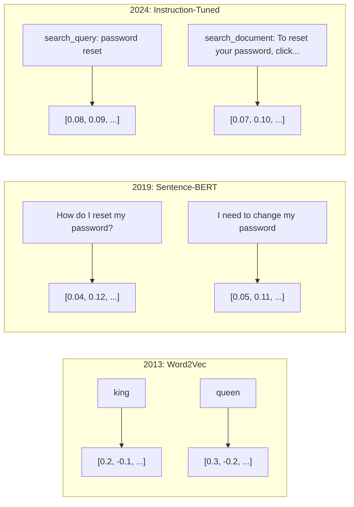
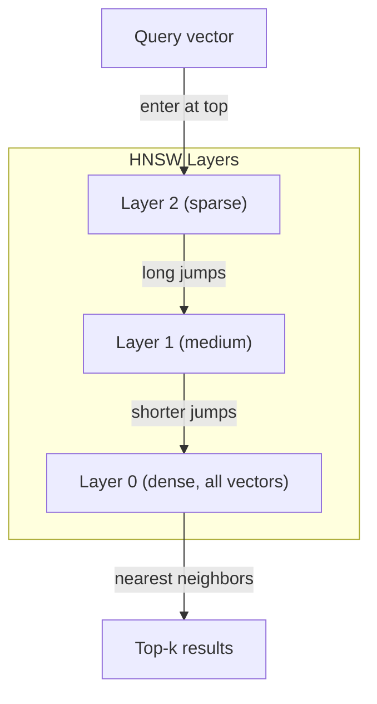

# 嵌入表示与向量表示

> 文本是离散的，数学是连续的。每次你要求大语言模型（LLM）查找“相似”文档、比较含义或进行关键词之外的搜索时，你都在依赖连接这两个世界的桥梁。这座桥梁就是嵌入表示（embedding）。如果你不理解嵌入表示，你就没有理解现代 AI。你只是在盲目使用它。

**类型：** 构建
**语言：** Python
**前置知识：** 第 11 阶段，第 01 课（提示词工程）
**预计时间：** 约 75 分钟
**相关课程：** 第 5 阶段 · 第 22 课（嵌入模型深度解析）涵盖稠密 vs 稀疏 vs 多向量、Matryoshka 截断以及按轴模型选择。本课侧重于生产环境管线（向量数据库、HNSW、相似度计算）。在选择模型前请先阅读第 5 阶段 · 第 22 课。

## 学习目标

- 使用 API 提供商和开源模型生成文本嵌入表示，并计算它们之间的余弦相似度
- 解释为什么嵌入表示能解决关键词搜索无法处理的词汇不匹配问题
- 构建语义搜索索引，按含义而非精确关键词匹配检索文档
- 使用检索基准测试（precision@k、recall）评估嵌入质量，并为任务选择合适的嵌入模型

## 问题所在

你有 10,000 张客服工单。一位客户写道“我的付款没有成功”。你需要找到过去类似的工单。关键词搜索会找到包含“payment”和“didn't go through”的工单。但它会漏掉“transaction failed”、“charge was declined”和“billing error”。这些工单描述的是完全相同的问题，只是措辞完全不同。

这就是词汇不匹配问题。人类语言有几十种方式表达同一个意思。关键词搜索将每个词视为独立的符号，没有任何含义。它无法知道“declined”和“didn't go through”指的是同一个概念。

你需要一种文本表示方式，让含义而非拼写决定相似度。你需要一种方法，在某个数学空间中把“my payment didn't go through”和“transaction was declined”拉近，同时把“my payment arrived on time”推远，尽管它们共享了“payment”这个词。

这种表示就是嵌入表示（embedding）。

## 核心概念

### 什么是嵌入表示？

嵌入表示是一个由浮点数组成的稠密向量，用于表示文本的含义。“稠密”一词很关键——每个维度都携带信息，这与稀疏表示（词袋模型、TF-IDF）不同，后者的大部分维度为零。

"The cat sat on the mat"会变成类似 `[0.023, -0.041, 0.087, ..., 0.012]` 的形式——一个包含 768 到 3072 个数字的列表，具体数量取决于模型。这些数字编码了含义。你永远不会直接检查它们，而是通过比较它们来工作。

### Word2Vec 的突破

2013 年，Google 的 Tomas Mikolov 及其同事发表了 Word2Vec。核心洞察是：训练一个神经网络，让它根据上下文预测目标词（或根据目标词预测上下文），隐藏层的权重就会变成有意义的向量表示。

著名的结论：

```
king - man + woman = queen
```

词嵌入上的向量运算能够捕捉语义关系。“man”到“woman”的方向大致等同于“king”到“queen”的方向。这是该领域意识到几何结构可以编码意义的时刻。

Word2Vec 生成 300 维向量。无论上下文如何，每个词只对应一个向量。“river bank”中的“bank”和“bank account”中的“bank”具有相同的嵌入表示。这一局限性推动了接下来十年的研究。

### 从单词到句子

词嵌入表示单个 token。生产系统需要嵌入整个句子、段落或文档。出现了四种方法：

**平均法**：取句子中所有词向量的均值。成本低、有损，但对短文本效果出奇地好。完全丢失词序——“dog bites man”和“man bites dog”会得到完全相同的嵌入表示。

**[CLS] token**：Transformer 模型（BERT，2018）输出一个特殊的 [CLS] token 嵌入表示，代表整个输入。比平均法更好，但 [CLS] token 是为下一句预测训练的，而非为相似度设计的。

**对比学习**：显式训练模型将相似对拉近、相异对推远。Sentence-BERT（Reimers & Gurevych，2019）采用了这种方法，并成为现代嵌入模型的基础。给定“How do I reset my password?”和“I need to change my password”，模型会学习到它们应该具有几乎相同的向量。

**指令微调嵌入表示**：最新的方法。像 E5 和 GTE 这样的模型接受任务前缀（如“search_query:”、“search_document:”），告诉模型生成何种类型的嵌入表示。这使得一个模型可以服务多个任务。



### 现代嵌入模型

市场已收敛于少数几个生产级选项（截至 2026 年初的 MTEB v2 分数）：

| Model | Provider | Dimensions | MTEB | Context | Cost / 1M tokens |
|-------|----------|-----------|------|---------|------------------|
| Gemini Embedding 2 | Google | 3072 (Matryoshka) | 67.7 (retrieval) | 8192 | $0.15 |
| embed-v4 | Cohere | 1024 (Matryoshka) | 65.2 | 128K | $0.12 |
| voyage-4 | Voyage AI | 1024/2048 (Matryoshka) | 66.8 | 32K | $0.12 |
| text-embedding-3-large | OpenAI | 3072 (Matryoshka) | 64.6 | 8192 | $0.13 |
| text-embedding-3-small | OpenAI | 1536 (Matryoshka) | 62.3 | 8192 | $0.02 |
| BGE-M3 | BAAI | 1024 (dense+sparse+ColBERT) | 63.0 multilingual | 8192 | Open-weight |
| Qwen3-Embedding | Alibaba | 4096 (Matryoshka) | 66.9 | 32K | Open-weight |
| Nomic-embed-v2 | Nomic | 768 (Matryoshka) | 63.1 | 8192 | Open-weight |

MTEB（大规模文本嵌入基准测试）v2 涵盖检索、分类、聚类、重排序和摘要等 100 多项任务。分数越高越好。到 2026 年，开源权重模型（Qwen3-Embedding、BGE-M3）在大多数指标上已持平或超越闭源托管模型。Gemini Embedding 2 在纯检索方面领先；Voyage/Cohere 在特定领域（金融、法律、代码）领先。在做出选择前，务必在自己的查询数据上进行基准测试。

### 相似度度量

给定两个嵌入向量，有三种衡量其相似度的方法：

**余弦相似度**：两个向量之间夹角的余弦值。范围从 -1（相反）到 1（方向完全相同）。忽略模长——如果指向同一方向，10 个词的句子和 500 个词的文档得分都可以是 1.0。这是 90% 用例的默认选择。

```
cosine_sim(a, b) = dot(a, b) / (||a|| * ||b||)
```

**点积**：两个向量的原始内积。当向量已归一化（单位长度）时，与余弦相似度相同。计算速度更快。OpenAI 的嵌入表示已归一化，因此点积和余弦相似度给出的排序结果一致。

```
dot(a, b) = sum(a_i * b_i)
```

**欧氏距离（L2）**：向量空间中的直线距离。越小越相似。对模长差异敏感。当空间中的绝对位置很重要而不仅仅是方向时使用。

```
L2(a, b) = sqrt(sum((a_i - b_i)^2))
```

何时使用哪种：

| 度量标准 | 适用场景 | 避免使用场景 |
|--------|----------|------------|
| 余弦相似度 | 比较不同长度的文本；大多数检索任务 | 模长携带重要信息时 |
| 点积 | 嵌入表示已归一化；追求极致速度 | 向量模长不一致时 |
| 欧氏距离 | 聚类；空间最近邻问题 | 比较长度差异极大的文档时 |

### 向量数据库与 HNSW

暴力相似度搜索会将查询与每个存储的向量进行比较。对于 100 万个 1536 维的向量，每次查询需要 15 亿次乘加运算。太慢了。

向量数据库通过近似最近邻（ANN）算法解决这个问题。主流算法是 HNSW（分层导航小世界图）：

1. 构建向量的多层图
2. 顶层较稀疏——远距离簇之间的长程连接
3. 底层较密集——邻近向量之间的细粒度连接
4. 搜索从顶层开始，贪婪地逐层下降以细化结果
5. 以 O(log n) 时间返回近似的 top-k 结果，而非 O(n)

HNSW 以微小的精度损失（通常为 95-99% 召回率）换取巨大的速度提升。在 1000 万个向量下，暴力搜索需要数秒，而 HNSW 仅需毫秒。



生产环境选项：

| 数据库 | 类型 | 最佳用途 | 最大规模 |
|----------|------|----------|----------|
| Pinecone | 托管 SaaS | 零运维生产环境 | 数十亿 |
| Weaviate | 开源 | 自托管、混合搜索 | 1 亿+ |
| Qdrant | 开源 | 高性能、过滤 | 1 亿+ |
| ChromaDB | 嵌入式 | 原型开发、本地调试 | 100 万 |
| pgvector | Postgres 扩展 | 已在使用 Postgres | 1000 万 |
| FAISS | 库 | 进程内、研究 | 10 亿+ |

### 分块策略

文档太长，无法作为单个向量嵌入。一份 50 页的 PDF 涵盖几十个主题——其嵌入表示会成为所有内容的大杂烩，类似于任何特定内容。你将文档拆分为块（chunks）并分别嵌入。

**固定大小分块**：每 N 个 token 拆分一次，保留 M 个 token 的重叠。简单且可预测。当文档没有清晰结构时效果良好。例如 512 token 分块带 50 token 重叠：块 1 是 token 0-511，块 2 是 token 462-973。

**基于句子的分块**：在句子边界处拆分，累积句子直到达到 token 限制。每个块至少包含一个完整的句子。优于固定大小分块，因为你永远不会把一个完整的思想切断。

**递归分块**：首先尝试在最大的边界处拆分（章节标题）。如果仍然太大，尝试段落边界。然后是句子边界。最后是字符限制。这是 LangChain 的 `RecursiveCharacterTextSplitter`，适用于混合格式的语料库。

**语义分块**：嵌入每个句子，然后将嵌入表示相似的连续句子分组。当嵌入相似度低于阈值时，开始新的一块。成本较高（需要单独嵌入每个句子），但能产生最连贯的块。

| 策略 | 复杂度 | 质量 | 最佳用途 |
|----------|-----------|---------|----------|
| 固定大小 | 低 | 尚可 | 非结构化文本、日志 |
| 基于句子 | 低 | 良好 | 文章、邮件 |
| 递归 | 中 | 良好 | Markdown、HTML、混合文档 |
| 语义 | 高 | 最佳 | 对检索质量要求极高的场景 |

大多数系统的最佳平衡点是：256-512 token 的分块，带有 50 token 的重叠。

### 双编码器与交叉编码器

双编码器独立嵌入查询和文档，然后比较向量。速度快——你只需嵌入一次查询，然后与预计算的文档嵌入进行比较。这正是检索时使用的架构。

交叉编码器将查询和文档作为单一输入，并输出相关性分数。速度慢——它将每个查询-文档对通过完整模型进行处理。但准确度远高于前者，因为它可以同时关注查询和文档的 token。

生产环境的典型模式：双编码器检索 top-100 候选项，交叉编码器将它们重排序至 top-10。这就是检索后重排序（retrieve-then-rerank）管线。


重排序模型：Cohere Rerank 3.5（$2/千次查询）、BGE-reranker-v2（免费、开源）、Jina Reranker v2（免费、开源）。

### Matryoshka 嵌入表示

传统嵌入表示是非此即彼的。一个 1536 维的向量使用 1536 个浮点数。如果不重新训练，无法将其截断为 256 维。

Matryoshka 表示学习（Kusupati 等人，2022）解决了这个问题。模型经过训练，使得前 N 个维度捕获最重要的信息，就像俄罗斯套娃一样。将 1536 维的 Matryoshka 嵌入表示截断为 256 维会损失一些精度，但仍可正常使用。

OpenAI 的 text-embedding-3-small 和 text-embedding-3-large 支持通过 `dimensions` 参数进行 Matryoshka 截断。请求 256 维而不是 1536 维可将存储空间减少 6 倍，同时在 MTEB 基准测试上仅损失约 3-5% 的精度。

### 二值量化

以 float32 存储的 1536 维嵌入表示占用 6,144 字节。乘以 1000 万份文档：仅向量就需要 61 GB。

二值量化将每个浮点数转换为单个比特：正值变为 1，负值变为 0。存储空间从 6,144 字节降至 192 字节——减少了 32 倍。相似度使用汉明距离（统计不同的位数）计算，CPU 可以在一条指令中完成。

检索召回率的精度损失约为 5-10%。常见模式：对数百万向量进行初筛时使用二值量化，然后用全精度向量对 top-1000 进行重评分。这能以 32 倍的内存节省获得 95% 以上的全精度精度。

## 动手构建

我们从头构建一个语义搜索引擎。不使用向量数据库，不使用外部嵌入 API。仅使用 Python 和 numpy 进行数学计算。

### 步骤 1：文本分块

```python
def chunk_text(text, chunk_size=200, overlap=50):
    words = text.split()
    chunks = []
    start = 0
    while start < len(words):
        end = start + chunk_size
        chunk = " ".join(words[start:end])
        chunks.append(chunk)
        start += chunk_size - overlap
    return chunks


def chunk_by_sentences(text, max_chunk_tokens=200):
    sentences = text.replace("\n", " ").split(".")
    sentences = [s.strip() + "." for s in sentences if s.strip()]
    chunks = []
    current_chunk = []
    current_length = 0
    for sentence in sentences:
        sentence_length = len(sentence.split())
        if current_length + sentence_length > max_chunk_tokens and current_chunk:
            chunks.append(" ".join(current_chunk))
            current_chunk = []
            current_length = 0
        current_chunk.append(sentence)
        current_length += sentence_length
    if current_chunk:
        chunks.append(" ".join(current_chunk))
    return chunks
```

### 步骤 2：从零构建嵌入表示

我们使用带 L2 归一化的 TF-IDF 实现一个简单的稠密嵌入表示。这不是神经嵌入表示，但它遵循相同的契约：输入文本，输出固定大小的向量，相似的文本会产生相似的向量。

```python
import math
import numpy as np
from collections import Counter

class SimpleEmbedder:
    def __init__(self):
        self.vocab = []
        self.idf = []
        self.word_to_idx = {}

    def fit(self, documents):
        vocab_set = set()
        for doc in documents:
            vocab_set.update(doc.lower().split())
        self.vocab = sorted(vocab_set)
        self.word_to_idx = {w: i for i, w in enumerate(self.vocab)}
        n = len(documents)
        self.idf = np.zeros(len(self.vocab))
        for i, word in enumerate(self.vocab):
            doc_count = sum(1 for doc in documents if word in doc.lower().split())
            self.idf[i] = math.log((n + 1) / (doc_count + 1)) + 1

    def embed(self, text):
        words = text.lower().split()
        count = Counter(words)
        total = len(words) if words else 1
        vec = np.zeros(len(self.vocab))
        for word, freq in count.items():
            if word in self.word_to_idx:
                tf = freq / total
                vec[self.word_to_idx[word]] = tf * self.idf[self.word_to_idx[word]]
        norm = np.linalg.norm(vec)
        if norm > 0:
            vec = vec / norm
        return vec
```

### 步骤 3：相似度函数

```python
def cosine_similarity(a, b):
    dot = np.dot(a, b)
    norm_a = np.linalg.norm(a)
    norm_b = np.linalg.norm(b)
    if norm_a == 0 or norm_b == 0:
        return 0.0
    return float(dot / (norm_a * norm_b))


def dot_product(a, b):
    return float(np.dot(a, b))


def euclidean_distance(a, b):
    return float(np.linalg.norm(a - b))
```

### 步骤 4：带暴力搜索的向量索引

```python
class VectorIndex:
    def __init__(self):
        self.vectors = []
        self.texts = []
        self.metadata = []

    def add(self, vector, text, meta=None):
        self.vectors.append(vector)
        self.texts.append(text)
        self.metadata.append(meta or {})

    def search(self, query_vector, top_k=5, metric="cosine"):
        scores = []
        for i, vec in enumerate(self.vectors):
            if metric == "cosine":
                score = cosine_similarity(query_vector, vec)
            elif metric == "dot":
                score = dot_product(query_vector, vec)
            elif metric == "euclidean":
                score = -euclidean_distance(query_vector, vec)
            else:
                raise ValueError(f"Unknown metric: {metric}")
            scores.append((i, score))
        scores.sort(key=lambda x: x[1], reverse=True)
        results = []
        for idx, score in scores[:top_k]:
            results.append({
                "text": self.texts[idx],
                "score": score,
                "metadata": self.metadata[idx],
                "index": idx
            })
        return results

    def size(self):
        return len(self.vectors)
```

### 步骤 5：语义搜索引擎

```python
class SemanticSearchEngine:
    def __init__(self, chunk_size=200, overlap=50):
        self.embedder = SimpleEmbedder()
        self.index = VectorIndex()
        self.chunk_size = chunk_size
        self.overlap = overlap

    def index_documents(self, documents, source_names=None):
        all_chunks = []
        all_sources = []
        for i, doc in enumerate(documents):
            chunks = chunk_text(doc, self.chunk_size, self.overlap)
            all_chunks.extend(chunks)
            name = source_names[i] if source_names else f"doc_{i}"
            all_sources.extend([name] * len(chunks))
        self.embedder.fit(all_chunks)
        for chunk, source in zip(all_chunks, all_sources):
            vec = self.embedder.embed(chunk)
            self.index.add(vec, chunk, {"source": source})
        return len(all_chunks)

    def search(self, query, top_k=5, metric="cosine"):
        query_vec = self.embedder.embed(query)
        return self.index.search(query_vec, top_k, metric)

    def search_with_scores(self, query, top_k=5):
        results = self.search(query, top_k)
        return [
            {
                "text": r["text"][:200],
                "source": r["metadata"].get("source", "unknown"),
                "score": round(r["score"], 4)
            }
            for r in results
        ]
```

### 步骤 6：比较相似度度量

```python
def compare_metrics(engine, query, top_k=3):
    results = {}
    for metric in ["cosine", "dot", "euclidean"]:
        hits = engine.search(query, top_k=top_k, metric=metric)
        results[metric] = [
            {"score": round(h["score"], 4), "preview": h["text"][:80]}
            for h in hits
        ]
    return results
```

## 实际应用

使用生产级嵌入 API 时，架构保持不变。只有嵌入器发生变化：

```python
from openai import OpenAI

client = OpenAI()

def openai_embed(texts, model="text-embedding-3-small", dimensions=None):
    kwargs = {"model": model, "input": texts}
    if dimensions:
        kwargs["dimensions"] = dimensions
    response = client.embeddings.create(**kwargs)
    return [item.embedding for item in response.data]
```

使用 OpenAI 进行 Matryoshka 截断——同一模型，更少维度，更低存储：

```python
full = openai_embed(["semantic search query"], dimensions=1536)
compact = openai_embed(["semantic search query"], dimensions=256)
```

256 维向量使用 6 倍更少的存储空间。对于 1000 万份文档，那就是 10 GB 对比 61 GB。在标准基准测试上，精度损失约为 3-5%。

使用 Cohere 进行重排序：

```python
import cohere

co = cohere.ClientV2()

results = co.rerank(
    model="rerank-v3.5",
    query="What is the refund policy?",
    documents=["Full refund within 30 days...", "No refunds after 90 days..."],
    top_n=3
)
```

使用无 API 依赖的本地嵌入表示：

```python
from sentence_transformers import SentenceTransformer

model = SentenceTransformer("BAAI/bge-small-en-v1.5")
embeddings = model.encode(["semantic search query", "another document"])
```

我们构建中的 VectorIndex 类可与上述任意方案配合使用。替换嵌入函数，保留搜索逻辑即可。

## 交付成果

本课产出：
- `outputs/prompt-embedding-advisor.md` —— 针对特定用例选择嵌入模型和策略的提示词
- `outputs/skill-embedding-patterns.md` —— 教导智能体如何在生产环境中有效使用嵌入表示的技能模块

## 练习

1. **度量标准对比**：使用余弦相似度、点积和欧氏距离，对示例文档运行相同的 5 个查询。记录每种度量的 top-3 结果。哪些查询的度量结果不一致？为什么？

2. **分块大小实验**：使用 50、100、200 和 500 词的分块大小对示例文档建立索引。对每种情况运行 5 个查询，并记录 top-1 相似度得分。绘制分块大小与检索质量之间的关系图。找出分块过大开始损害性能的那个临界点。

3. **Matryoshka 模拟**：构建一个生成 500 维向量的 SimpleEmbedder。将其截断为 50、100、200 和 500 维。测量每次截断时检索召回率的退化程度。这在无需真实训练技巧的情况下模拟了 Matryoshka 行为。

4. **二值量化**：获取搜索引擎中的嵌入表示，将其转换为二进制（正值为 1，负值为 0），并实现汉明距离搜索。将 top-10 结果与全精度余弦相似度结果进行对比。计算重合百分比。

5. **基于句子的分块**：用 `chunk_by_sentences` 替换固定大小分块。运行相同的查询并比较检索得分。尊重句子边界是否能改善结果？

## 核心术语

| 术语 | 人们常说的说法 | 实际含义 |
|------|----------------|----------------------|
| 嵌入表示 (Embedding) | “文本转数字” | 一个稠密向量，其中几何邻近性编码了语义相似度 |
| Word2Vec | “最初的嵌入模型” | 2013 年的模型，通过学习预测上下文词来获取词向量；证明了向量运算可以编码意义 |
| 余弦相似度 | “两个向量有多相似” | 向量间夹角的余弦值；1 = 方向完全相同，0 = 正交，-1 = 方向相反 |
| HNSW | “快速向量搜索” | 分层导航小世界图——多层结构，支持 O(log n) 时间的近似最近邻搜索 |
| 双编码器 | “分开嵌入，快速比较” | 独立将查询和文档编码为向量；支持预计算和快速检索 |
| 交叉编码器 | “慢但准确的重排器” | 将查询-文档对联合输入完整模型进行处理；准确率更高，不支持预计算 |
| Matryoshka 嵌入表示 | “可截断的向量” | 经过训练的嵌入表示，前 N 个维度捕获最重要信息，支持可变尺寸存储 |
| 二值量化 | “1 位嵌入表示” | 将浮点向量转换为二进制（仅符号位），结合汉明距离搜索实现 32 倍存储缩减 |
| 分块 (Chunking) | “拆分文档以便嵌入” | 将文档拆分为 256-512 token 的片段，使每个片段可独立嵌入和检索 |
| 向量数据库 | “嵌入表示的搜索引擎” | 专为存储向量和大规模执行近似最近邻搜索而优化的数据存储 |
| 对比学习 | “通过比较进行训练” | 训练方法，将相似对的嵌入表示拉近，将相异对的嵌入表示推远 |
| MTEB | “嵌入表示基准测试” | 大规模文本嵌入基准测试——涵盖 8 项任务的 56 个数据集；用于比较嵌入模型的标准 |

## 延伸阅读

- Mikolov 等人，《Efficient Estimation of Word Representations in Vector Space》（2013）—— 开启嵌入革命的经典论文，提出了著名的“国王-王后”类比
- Reimers & Gurevych，《Sentence-BERT: Sentence Embeddings using Siamese BERT-Networks》（2019）—— 如何训练用于句子级相似度的双编码器，现代嵌入模型的基础
- Kusupati 等人，《Matryoshka Representation Learning》（2022）—— 可变维度嵌入表示背后的技术，OpenAI 已将其应用于 text-embedding-3
- Malkov & Yashunin，《Efficient and Robust Approximate Nearest Neighbor using Hierarchical Navigable Small World Graphs》（2018）—— HNSW 论文，绝大多数生产级向量搜索背后的算法
- OpenAI 嵌入表示指南 (platform.openai.com/docs/guides/embeddings) —— text-embedding-3 模型的实用参考，包含 Matryoshka 降维说明
- MTEB 排行榜 (huggingface.co/spaces/mteb/leaderboard) —— 跨任务和语言的实时基准测试，比较所有嵌入模型
- [Muennighoff 等人，《MTEB: Massive Text Embedding Benchmark》（EACL 2023）](https://arxiv.org/abs/2210.07316) —— 定义了排行榜报告的 8 项任务类别（分类、聚类、配对分类、重排序、检索、STS、摘要、双语挖掘）的基准测试；在信任任何单一 MTEB 分数前请先阅读此文。
- [Sentence Transformers 官方文档](https://www.sbert.net/) —— 关于双编码器与交叉编码器、池化策略以及本课实现的“摄入-拆分-嵌入-存储”RAG 管线的权威参考。
