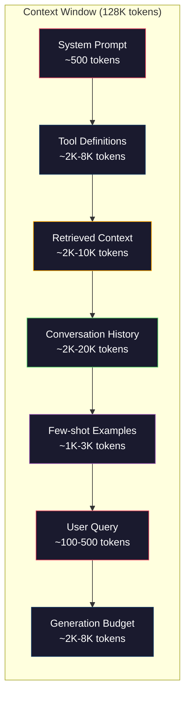
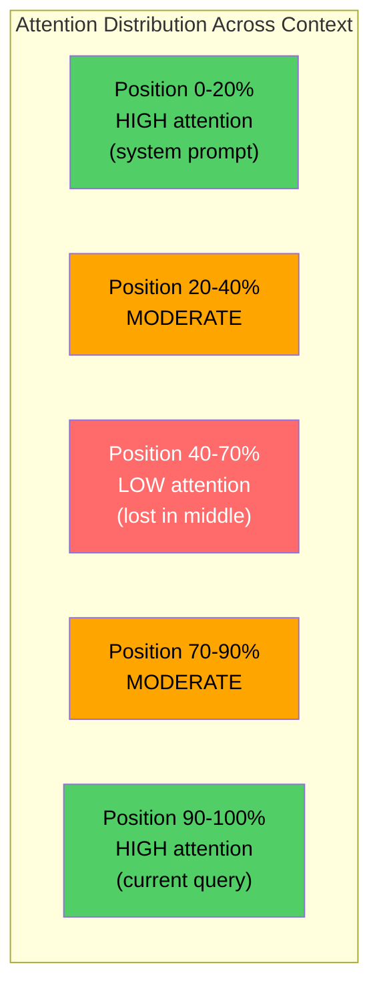
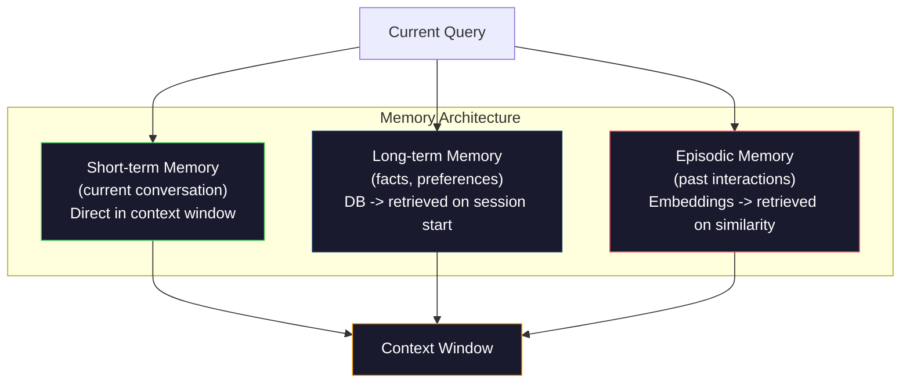

# 上下文工程：窗口、预算、记忆与检索

> 提示工程只是其中一部分。上下文工程才是全局。提示词是你输入的一串字符，而上下文是进入模型窗口的所有内容：系统指令、检索到的文档、工具定义、对话历史、少样本示例以及提示词本身。2026 年最优秀的 AI 工程师都是上下文工程师。他们决定什么该进、什么该留、以什么顺序排列。

**类型：** 实战构建
**语言：** Python
**前置知识：** 第 10 阶段（从零构建 LLM）、第 11 阶段 课程 01-02
**预计时间：** 约 90 分钟
**相关课程：** 第 11 阶段 · 15（提示词缓存）—— 缓存友好的布局是上下文工程的延伸。第 5 阶段 · 28（长上下文评估）—— 了解如何使用 NIAH/RULER 测量“中间丢失”现象。

## 学习目标

- 计算所有上下文窗口组件（系统提示词、工具、历史、检索文档、生成预留空间）的令牌预算
- 实现上下文窗口管理策略：针对对话历史的截断、摘要和滑动窗口技术
- 对上下文组件进行优先级排序与排列，以最大化模型对最相关信息注意力的分配
- 构建上下文组装器，根据查询类型和可用窗口空间动态分配令牌

## 问题所在

Claude Opus 4.7 拥有 20 万令文的窗口（Beta 版为 100 万）。GPT-5 有 40 万。Gemini 3 Pro 有 200 万。Llama 4 宣称达到 1000 万。这些数字听起来极其庞大，直到你真正填满它们。

以下是一个代码助手的真实拆解：系统提示词：500 令牌。50 个工具的定义：8,000 令牌。检索到的文档：4,000 令牌。对话历史（10 轮）：6,000 令牌。当前用户查询：200 令牌。生成预算（最大输出）：4,000 令牌。总计：22,700 令牌。这仅占 128K 窗口的 18%。

但注意力机制并不随上下文长度线性扩展。拥有 128K 令文上下文的模型需承担二次方注意力成本（在基础 Transformer 中为 O(n^2)，尽管大多数生产模型使用高效的注意力变体）。更重要的是，检索准确率会下降。“大海捞针”（Needle in a Haystack）测试表明，模型难以在长上下文中定位位于中间的信息。Liu 等人（2023）的研究显示，LLM 能以近乎完美的准确率检索长上下文开头和结尾的信息，但对于放置在中间位置（上下文长度的 40%-70%）的信息，准确率会下降 10%-20%。这种“中间丢失”（lost-in-the-middle）效应因模型而异，但会影响所有当前的架构。

实际经验教训是：拥有 20 万令文的可用容量并不意味着使用 20 万令文就是有效的。经过精心筛选的 1 万令牌上下文通常优于粗暴堆砌的 10 万令牌上下文。上下文工程是一门在上下文窗口内最大化信噪比的学科。

放入窗口的每一个令牌都会挤占本可携带更相关信息的令牌空间。每一条无关的工具定义、每一段过时的对话轮次、每一块未能回答问题的检索文本片段——都会让模型在任务表现上略微下降。

## 核心概念

### 上下文窗口是一种稀缺资源

将上下文窗口视为内存（RAM），而非磁盘。它速度快且可直接访问，但容量有限。你无法装入所有内容，必须做出选择。



每个组件都在争夺空间。增加更多工具定义意味着对话历史的剩余空间减少。增加更多检索上下文意味着少样本示例的空间减少。上下文工程就是将这笔预算分配到能最大化任务性能的艺术。

### “中间丢失”现象

上下文工程中最重要的一项实证发现。模型对上下文开头和结尾的信息关注度更高。中间位置的信息获得的注意力分数较低，更容易被忽略。

Liu 等人（2023）对此进行了系统性测试。他们将一份相关文档混入 20 份无关文档中，并置于不同位置，随后测量答案准确率。当相关文档排在第一或最后时，准确率为 85%-90%。当它位于中间（20 份中的第 10 份）时，准确率降至 60%-70%。

这对工程实践有直接影响：

- 将最重要的信息放在开头（系统提示词、关键指令）
- 将当前查询和最相关的上下文放在末尾（利用近因偏差）
- 将上下文中间区域视为最低优先级区
- 如果必须在中间包含信息，请在末尾重复关键点



### 上下文组件

**系统提示词**：设定角色、约束和行为规则。它排在首位，并在各轮对话中保持不变。Claude Code 的系统提示词（含工具定义和行为指令）大约占用 6,000 令牌。保持精简。系统提示词中的每个词都会在每次 API 调用中重复出现。

**工具定义**：每个工具会增加 50-200 令牌（名称、描述、参数 schema）。50 个工具按每个 150 令牌计算，在发生任何对话前就占用了 7,500 令牌。动态工具选择——仅包含与当前查询相关的工具——可减少 60%-80% 的开销。

**检索上下文**：来自向量数据库的文档、搜索结果、文件内容。检索质量直接决定响应质量。糟糕的检索比不检索更糟——它会用噪声填满窗口并主动误导模型。

**对话历史**：每条先前的用户消息和助手回复。随对话长度线性增长。50 轮对话，每轮 200 令牌，就会产生 10,000 令牌的历史记录。其中大部分与当前查询无关。

**少样本示例**：展示期望行为的输入/输出对。两到三个精心挑选的示例往往比数千令文的指令更能提升输出质量。但它们消耗空间。

**生成预算**：为模型回复预留的令牌。如果你把窗口填到极限，模型就没有空间作答了。至少为生成预留 2,000-4,000 令牌。

### 上下文压缩策略

**历史摘要**：与其逐字保留所有历史轮次，不如定期总结对话。“我们讨论了 X，决定了 Y，用户想要 Z”，用 100 令牌即可替代原本占用 2,000 令文的 10 轮对话。当历史记录超过阈值（例如 5,000 令牌）时运行摘要。

**相关性过滤**：根据当前查询对每份检索文档打分，丢弃低于阈值的文档。如果检索了 10 个片段但只有 3 个相关，则丢弃其余 7 个。3 个高度相关的片段优于 10 个平庸的片段。

**工具剪枝**：分类用户查询意图，仅包含与该意图相关的工具。代码问题不需要日历工具。排程问题不需要文件系统工具。这可将工具定义从 8,000 令牌降至 1,000。

**递归摘要**：对于超长文档，分阶段摘要。先总结每个章节，再总结这些摘要。一份 50 页的文档可浓缩为 500 令文的摘要，同时保留关键点。

### 记忆系统

上下文工程跨越三个时间维度。

**短期记忆**：当前对话。直接存储在上下文窗口中。随每轮对话增长。通过摘要和截断进行管理。

**长期记忆**：跨对话持久化保存的事实和偏好。“用户偏好 TypeScript。”“项目使用 PostgreSQL。”存储在数据库中，在会话开始时检索。Claude Code 将其存储在 CLAUDE.md 文件中。ChatGPT 将其存储在其记忆功能中。

**情景记忆**：可能相关的特定过往交互。“上周二，我们调试了认证模块中的一个类似问题。”存储为嵌入向量，当当前对话匹配过去的情景时进行检索。



### 动态上下文组装

核心洞察：不同的查询需要不同的上下文。静态的系统提示词 + 静态工具 + 静态历史是浪费资源的。最好的系统会为每次查询动态组装上下文。

1. 分类查询意图
2. 选择相关工具（非全部工具）
3. 检索相关文档（非固定集合）
4. 包含相关的历史轮次（非全部历史）
5. 添加与任务类型匹配的少样本示例
6. 按重要性排序：关键信息放首，重要信息放尾，可选信息放中间

这正是区分优秀 AI 应用与卓越 AI 应用的关键。模型是相同的，上下文才是差异化因素。

## 动手构建

### 步骤 1：令牌计数器

无法衡量就无法规划预算。构建一个简单的令牌计数器（使用空格分割进行近似计算，因为精确计数取决于具体的 tokenizer）。

```python
import json
import numpy as np
from collections import OrderedDict

def count_tokens(text):
    if not text:
        return 0
    return int(len(text.split()) * 1.3)

def count_tokens_json(obj):
    return count_tokens(json.dumps(obj))
```

### 步骤 2：上下文预算管理器

核心抽象。预算管理器跟踪每个组件消耗的令牌数并强制执行限制。

```python
class ContextBudget:
    def __init__(self, max_tokens=128000, generation_reserve=4000):
        self.max_tokens = max_tokens
        self.generation_reserve = generation_reserve
        self.available = max_tokens - generation_reserve
        self.allocations = OrderedDict()

    def allocate(self, component, content, max_tokens=None):
        tokens = count_tokens(content)
        if max_tokens and tokens > max_tokens:
            words = content.split()
            target_words = int(max_tokens / 1.3)
            content = " ".join(words[:target_words])
            tokens = count_tokens(content)

        used = sum(self.allocations.values())
        if used + tokens > self.available:
            allowed = self.available - used
            if allowed <= 0:
                return None, 0
            words = content.split()
            target_words = int(allowed / 1.3)
            content = " ".join(words[:target_words])
            tokens = count_tokens(content)

        self.allocations[component] = tokens
        return content, tokens

    def remaining(self):
        used = sum(self.allocations.values())
        return self.available - used

    def utilization(self):
        used = sum(self.allocations.values())
        return used / self.max_tokens

    def report(self):
        total_used = sum(self.allocations.values())
        lines = []
        lines.append(f"Context Budget Report ({self.max_tokens:,} token window)")
        lines.append("-" * 50)
        for component, tokens in self.allocations.items():
            pct = tokens / self.max_tokens * 100
            bar = "#" * int(pct / 2)
            lines.append(f"  {component:<25} {tokens:>6} tokens ({pct:>5.1f}%) {bar}")
        lines.append("-" * 50)
        lines.append(f"  {'Used':<25} {total_used:>6} tokens ({total_used/self.max_tokens*100:.1f}%)")
        lines.append(f"  {'Generation reserve':<25} {self.generation_reserve:>6} tokens")
        lines.append(f"  {'Remaining':<25} {self.remaining():>6} tokens")
        return "\n".join(lines)
```

### 步骤 3：“中间丢失”重排序

实现重排序策略：最重要的项放首尾，最不重要的放中间。

```python
def reorder_lost_in_middle(items, scores):
    paired = sorted(zip(scores, items), reverse=True)
    sorted_items = [item for _, item in paired]

    if len(sorted_items) <= 2:
        return sorted_items

    first_half = sorted_items[::2]
    second_half = sorted_items[1::2]
    second_half.reverse()

    return first_half + second_half

def score_relevance(query, documents):
    query_words = set(query.lower().split())
    scores = []
    for doc in documents:
        doc_words = set(doc.lower().split())
        if not query_words:
            scores.append(0.0)
            continue
        overlap = len(query_words & doc_words) / len(query_words)
        scores.append(round(overlap, 3))
    return scores
```

### 步骤 4：对话历史压缩器

对旧对话轮次进行摘要以回收令牌预算。

```python
class ConversationManager:
    def __init__(self, max_history_tokens=5000):
        self.turns = []
        self.summaries = []
        self.max_history_tokens = max_history_tokens

    def add_turn(self, role, content):
        self.turns.append({"role": role, "content": content})
        self._compress_if_needed()

    def _compress_if_needed(self):
        total = sum(count_tokens(t["content"]) for t in self.turns)
        if total <= self.max_history_tokens:
            return

        while total > self.max_history_tokens and len(self.turns) > 4:
            old_turns = self.turns[:2]
            summary = self._summarize_turns(old_turns)
            self.summaries.append(summary)
            self.turns = self.turns[2:]
            total = sum(count_tokens(t["content"]) for t in self.turns)

    def _summarize_turns(self, turns):
        parts = []
        for t in turns:
            content = t["content"]
            if len(content) > 100:
                content = content[:100] + "..."
            parts.append(f"{t['role']}: {content}")
        return "Previous: " + " | ".join(parts)

    def get_context(self):
        parts = []
        if self.summaries:
            parts.append("[Conversation Summary]")
            for s in self.summaries:
                parts.append(s)
        parts.append("[Recent Conversation]")
        for t in self.turns:
            parts.append(f"{t['role']}: {t['content']}")
        return "\n".join(parts)

    def token_count(self):
        return count_tokens(self.get_context())
```

### 步骤 5：动态工具选择器

仅包含与当前查询相关的工具。分类意图，然后过滤。

```python
TOOL_REGISTRY = {
    "read_file": {
        "description": "Read contents of a file",
        "tokens": 120,
        "categories": ["code", "files"],
    },
    "write_file": {
        "description": "Write content to a file",
        "tokens": 150,
        "categories": ["code", "files"],
    },
    "search_code": {
        "description": "Search for patterns in codebase",
        "tokens": 130,
        "categories": ["code"],
    },
    "run_command": {
        "description": "Execute a shell command",
        "tokens": 140,
        "categories": ["code", "system"],
    },
    "create_calendar_event": {
        "description": "Create a new calendar event",
        "tokens": 180,
        "categories": ["calendar"],
    },
    "list_emails": {
        "description": "List recent emails",
        "tokens": 160,
        "categories": ["email"],
    },
    "send_email": {
        "description": "Send an email message",
        "tokens": 200,
        "categories": ["email"],
    },
    "web_search": {
        "description": "Search the web for information",
        "tokens": 140,
        "categories": ["research"],
    },
    "query_database": {
        "description": "Run a SQL query on the database",
        "tokens": 170,
        "categories": ["code", "data"],
    },
    "generate_chart": {
        "description": "Generate a chart from data",
        "tokens": 190,
        "categories": ["data", "visualization"],
    },
}

def classify_intent(query):
    query_lower = query.lower()

    intent_keywords = {
        "code": ["code", "function", "bug", "error", "file", "implement", "refactor", "debug", "test"],
        "calendar": ["meeting", "schedule", "calendar", "appointment", "event"],
        "email": ["email", "mail", "send", "inbox", "message"],
        "research": ["search", "find", "what is", "how does", "explain", "look up"],
        "data": ["data", "query", "database", "chart", "graph", "analytics", "sql"],
    }

    scores = {}
    for intent, keywords in intent_keywords.items():
        score = sum(1 for kw in keywords if kw in query_lower)
        if score > 0:
            scores[intent] = score

    if not scores:
        return ["code"]

    max_score = max(scores.values())
    return [intent for intent, score in scores.items() if score >= max_score * 0.5]

def select_tools(query, token_budget=2000):
    intents = classify_intent(query)
    relevant = {}
    total_tokens = 0

    for name, tool in TOOL_REGISTRY.items():
        if any(cat in intents for cat in tool["categories"]):
            if total_tokens + tool["tokens"] <= token_budget:
                relevant[name] = tool
                total_tokens += tool["tokens"]

    return relevant, total_tokens
```

### 步骤 6：完整上下文组装流水线

将所有模块串联。给定一个查询，动态组装最优上下文。

```python
class ContextEngine:
    def __init__(self, max_tokens=128000, generation_reserve=4000):
        self.budget = ContextBudget(max_tokens, generation_reserve)
        self.conversation = ConversationManager(max_history_tokens=5000)
        self.system_prompt = (
            "You are a helpful AI assistant. You have access to tools for "
            "code editing, file management, web search, and data analysis. "
            "Use the appropriate tools for each task. Be concise and accurate."
        )
        self.knowledge_base = [
            "Python 3.12 introduced type parameter syntax for generic classes using bracket notation.",
            "The project uses PostgreSQL 16 with pgvector for embedding storage.",
            "Authentication is handled by Supabase Auth with JWT tokens.",
            "The frontend is built with Next.js 15 using the App Router.",
            "API rate limits are set to 100 requests per minute per user.",
            "The deployment pipeline uses GitHub Actions with Docker multi-stage builds.",
            "Test coverage must be above 80% for all new modules.",
            "The codebase follows the repository pattern for data access.",
        ]

    def assemble(self, query):
        self.budget = ContextBudget(self.budget.max_tokens, self.budget.generation_reserve)

        system_content, _ = self.budget.allocate("system_prompt", self.system_prompt, max_tokens=1000)

        tools, tool_tokens = select_tools(query, token_budget=2000)
        tool_text = json.dumps(list(tools.keys()))
        tool_content, _ = self.budget.allocate("tools", tool_text, max_tokens=2000)

        relevance = score_relevance(query, self.knowledge_base)
        threshold = 0.1
        relevant_docs = [
            doc for doc, score in zip(self.knowledge_base, relevance)
            if score >= threshold
        ]

        if relevant_docs:
            doc_scores = [s for s in relevance if s >= threshold]
            reordered = reorder_lost_in_middle(relevant_docs, doc_scores)
            doc_text = "\n".join(reordered)
            doc_content, _ = self.budget.allocate("retrieved_context", doc_text, max_tokens=3000)

        history_text = self.conversation.get_context()
        if history_text.strip():
            history_content, _ = self.budget.allocate("conversation_history", history_text, max_tokens=5000)

        query_content, _ = self.budget.allocate("user_query", query, max_tokens=500)

        return self.budget

    def chat(self, query):
        self.conversation.add_turn("user", query)
        budget = self.assemble(query)
        response = f"[Response to: {query[:50]}...]"
        self.conversation.add_turn("assistant", response)
        return budget


def run_demo():
    print("=" * 60)
    print("  Context Engineering Pipeline Demo")
    print("=" * 60)

    engine = ContextEngine(max_tokens=128000, generation_reserve=4000)

    print("\n--- Query 1: Code task ---")
    budget = engine.chat("Fix the bug in the authentication module where JWT tokens expire too early")
    print(budget.report())

    print("\n--- Query 2: Research task ---")
    budget = engine.chat("What is the best approach for implementing vector search in PostgreSQL?")
    print(budget.report())

    print("\n--- Query 3: After conversation history builds up ---")
    for i in range(8):
        engine.conversation.add_turn("user", f"Follow-up question number {i+1} about the implementation details of the system")
        engine.conversation.add_turn("assistant", f"Here is the response to follow-up {i+1} with technical details about the architecture")

    budget = engine.chat("Now implement the changes we discussed")
    print(budget.report())

    print("\n--- Tool Selection Examples ---")
    test_queries = [
        "Fix the bug in auth.py",
        "Schedule a meeting with the team for Tuesday",
        "Show me the database query performance stats",
        "Search for best practices on error handling",
    ]

    for q in test_queries:
        tools, tokens = select_tools(q)
        intents = classify_intent(q)
        print(f"\n  Query: {q}")
        print(f"  Intents: {intents}")
        print(f"  Tools: {list(tools.keys())} ({tokens} tokens)")

    print("\n--- Lost-in-the-Middle Reordering ---")
    docs = ["Doc A (most relevant)", "Doc B (somewhat relevant)", "Doc C (least relevant)",
            "Doc D (relevant)", "Doc E (moderately relevant)"]
    scores = [0.95, 0.60, 0.20, 0.80, 0.50]
    reordered = reorder_lost_in_middle(docs, scores)
    print(f"  Original order: {docs}")
    print(f"  Scores:         {scores}")
    print(f"  Reordered:      {reordered}")
    print(f"  (Most relevant at start and end, least relevant in middle)")
```

## 实际应用

### Claude Code 的上下文策略

Claude Code 采用分层方式管理上下文。系统提示词包含行为规则和工具定义（约 6K 令牌）。当你打开文件时，其内容会被注入为上下文。当你搜索时，结果会被添加。旧的对话轮次会被摘要。CLAUDE.md 提供跨会话持久化的长期记忆。

关键的工程决策：Claude Code 不会将整个代码库转储到上下文中。它是按需检索相关文件。这就是上下文工程的实践。

### Cursor 的动态上下文加载

Cursor 将整个代码库索引为嵌入向量。当你输入查询时，它使用向量相似度检索最相关的文件和代码块。只有这些片段会进入上下文窗口。一个 50 万行的代码库被压缩为最相关的 5-10 个代码块。

这一模式为：全面嵌入，按需检索，仅包含关键内容。

### ChatGPT 记忆功能

ChatGPT 将用户偏好和事实存储为长期记忆。在每次对话开始时，相关的记忆会被检索并包含在系统提示词中。“用户偏好 Python”仅消耗 5 个令牌，却能在多次对话中节省数百个令文的重复指令。

### RAG 作为上下文工程

检索增强生成（RAG）是形式化的上下文工程。与其将知识塞入模型的权重（训练）或系统提示词（静态上下文），你在查询时检索相关文档并将其注入上下文窗口。整个 RAG 流水线——分块、嵌入、检索、重排序——都只为解决一个问题：将正确的信息放入上下文窗口。

## 交付成果

本课程将产出 `outputs/prompt-context-optimizer.md` —— 一个可复用的提示词，用于审计上下文组装策略并推荐优化方案。输入你的系统提示词、工具数量、平均历史长度和检索策略，它将识别令牌浪费并提出改进建议。

同时还将产出 `outputs/skill-context-engineering.md` —— 一个基于任务类型、上下文窗口大小和延迟预算来设计上下文组装流水线的决策框架。

## 练习

1. 为 ContextBudget 类添加一个“令牌浪费检测器”。它应标记占用预算超过 30% 的组件，并为每种组件类型建议特定的压缩策略（摘要历史、剪枝工具、重排文档）。
2. 为检索上下文实现语义去重。如果两份检索文档的相似度超过 80%（通过词重叠或嵌入向量的余弦相似度计算），仅保留得分较高的那一份。测量此举能回收多少令牌预算。
3. 构建一个“上下文回放”工具。给定一段对话记录，将其输入 ContextEngine 进行回放，并可视化预算分配如何逐轮变化。绘制各组件随时间变化的令牌使用情况。识别上下文开始被压缩的那一轮。
4. 实现基于优先级的工具选择器。与其使用二元包含/排除逻辑，不如为每个工具分配与当前查询的相关性得分。按相关性降序包含工具，直到耗尽工具预算。对比包含 5、10、20 和 50 个工具时的任务表现。
5. 构建多策略上下文压缩器。实现三种压缩策略（截断、摘要、提取关键句），并在 20 份文档集上进行基准测试。测量压缩率与信息保留率之间的权衡（压缩后的版本是否仍包含查询的答案？）。

## 核心术语

| 术语 | 常见说法 | 实际含义 |
|------|----------|----------|
| 上下文窗口 | “模型能读多少内容” | 模型在单次前向传播中处理的最大令牌数（输入+输出）—— GPT-5 为 40 万，Claude Opus 4.7 为 20 万（Beta 版 100 万），Gemini 3 Pro 为 200 万 |
| 上下文工程 | “高级提示工程” | 决定哪些内容进入上下文窗口、以何种顺序排列以及优先级为何的学科——涵盖检索、压缩、工具选择和记忆管理 |
| “中间丢失” | “模型会忘记中间的内容” | 实证发现：LLM 对上下文开头和结尾的关注度更高，放置在中间的信息准确率会下降 10%-20% |
| 令牌预算 | “你还剩多少令牌” | 跨组件（系统提示词、工具、历史、检索、生成）显式分配的上下文窗口容量，并设有单组件上限 |
| 动态上下文 | “实时加载内容” | 根据意图分类、相关工具选择和检索结果，为每次查询动态组装不同的上下文窗口 |
| 历史摘要 | “压缩对话” | 用简洁的摘要替换逐字的旧对话轮次，在保留关键信息的同时降低令牌开销 |
| 工具剪枝 | “仅包含相关工具” | 分类查询意图，仅包含匹配的工具定义，将工具令牌开销降低 60%-80% |
| 长期记忆 | “跨会话记住内容” | 存储在数据库中并在会话开始时检索的事实和偏好——如 CLAUDE.md、ChatGPT Memory 及类似系统 |
| 情景记忆 | “记住特定过去事件” | 将过往交互存储为嵌入向量，并在当前查询与过去对话相似时进行检索 |
| 生成预算 | “留给答案的空间” | 为模型输出预留的令牌——如果上下文完全填满窗口，模型将没有空间作答 |

## 延伸阅读

- [Liu 等人，2023 ——《迷失在中间：语言模型如何使用长上下文》](https://arxiv.org/abs/2307.03172) —— 关于位置依赖型注意力的权威研究，表明模型在处理长上下文中间部分的信息时会遇到困难
- [Anthropic 的上下文检索博客文章](https://www.anthropic.com/news/contextual-retrieval) —— Anthropic 如何实现上下文感知的分块检索，将检索失败率降低 49%
- [Simon Willison 的《上下文工程》](https://simonwillison.net/2025/Jun/27/context-engineering/) —— 命名该学科并将其与提示工程区分开来的博客文章
- [LangChain 关于 RAG 的文档](https://python.langchain.com/docs/tutorials/rag/) —— 将检索增强生成为一种上下文工程模式的实践指南
- [Greg Kamradt 的大海捞针测试](https://github.com/gkamradt/LLMTest_NeedleInAHaystack) —— 揭示所有主流模型均存在位置依赖型检索失败的基准测试
- [Pope 等人，《高效扩展 Transformer 推理》（2022）](https://arxiv.org/abs/2211.05102) —— 解释上下文长度如何驱动内存与延迟，以及 KV 缓存、MQA 和 GQA 如何改变预算计算。
- [Agrawal 等人，《SARATHI：通过结合解码与分块预填充实现高效 LLM 推理》（2023）](https://arxiv.org/abs/2308.16369) —— 推理的两个阶段使得长提示词在 TTFT（首字延迟）上昂贵但在 TPOT（每输出令牌耗时）上便宜；揭示了上下文打包权衡背后的底层真相。
- [Ainslie 等人，《GQA：从多头检查点训练泛化多查询 Transformer 模型》（EMNLP 2023）](https://arxiv.org/abs/2305.13245) —— 提出分组查询注意力的论文，在不损失质量的情况下将生产环境解码器的 KV 内存占用降低了 8 倍。
