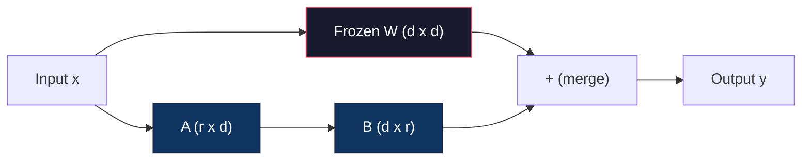
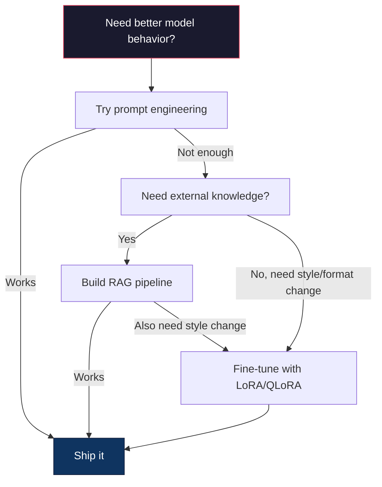

# 使用 LoRA 与 QLoRA 进行微调

> 对 7B 模型进行全量微调需要 56GB 的显存。你没有那么多，大多数公司也没有。LoRA 让你只需训练不到 1% 的参数，就能在 6GB 显存下完成同一模型的微调。这不是妥协——在大多数任务上，它能达到与全量微调相当的质量。整个开源微调生态都依赖于这一技巧。

**类型：** 构建
**语言：** Python
**前置知识：** 第 10 阶段，课程 06（指令微调 / SFT）
**耗时：** 约 75 分钟
**相关：** 第 10 阶段从零讲解了 SFT/DPO 循环。本课程将这些内容接入 2026 年的 PEFT 工具链（PEFT、TRL、Unsloth、Axolotl、LLaMA-Factory）。

## 学习目标

- 通过在预训练模型的注意力层中注入低秩适配器矩阵（A 和 B）来实现 LoRA
- 计算 LoRA 相比全量微调的参数节省情况：维度为 d_model 时，秩为 r 的 LoRA 仅训练 2*r*d 个参数，而非 d^2 个
- 使用 QLoRA（4-bit 量化基座模型 + LoRA 适配器）微调模型，使其适配消费级 GPU 显存
- 将 LoRA 权重合并回基座模型以用于部署，并对比有无适配器时的推理速度

## 问题所在

你有一个基座模型，比如 Llama 3 8B。你希望它用你们公司的语气回答客户支持工单。SFT 是答案。但 SFT 有个成本问题。

全量微调会更新模型中的每一个参数。Llama 3 8B 有 80 亿个参数。在 fp16 精度下，每个参数占用 2 字节。仅加载权重就需要 16GB。训练过程中，你还需要梯度（16GB）、Adam 优化器状态（动量+方差共 32GB）以及激活值。总计：单个 8B 模型大约需要 56GB 显存。

一块 A100 80GB 显卡勉强能装下。云服务商上两块 A100 的价格约为 3-4 美元/小时。在 50,000 个样本上训练 3 个 epoch 需要 6-10 小时。单次实验花费 30-40 美元。为了调好超参数跑 10 次实验，还没部署就花了 400 美元。

扩展到 Llama 3 70B，数字会变得荒谬。仅权重就需要 140GB。你需要一个集群。每次实验 100 美元以上。

还有一个更深层的问题。全量微调会修改模型中的所有权重。如果你在客户支持数据上进行微调，可能会削弱模型的通用能力。这被称为灾难性遗忘。模型在你指定的任务上变强了，但在其他所有事情上变弱了。

你需要一种训练更少参数、占用更少显存，且不会破坏模型现有知识的方法。

## 核心概念

### LoRA：低秩自适应

微软的 Edward Hu 等人于 2021 年 6 月发表了 LoRA。论文的核心洞察是：微调期间的权重更新具有内在的低秩特性。你不需要更新 4096x4096 权重矩阵中的全部 1670 万个参数。更新中包含的有效信息可以用秩为 16 或 32 的矩阵来捕捉。

以下是数学原理。标准线性层计算如下：

```
y = Wx
```

其中 W 是一个 d_out x d_in 矩阵。对于 4096x4096 的注意力投影，那就是 16,777,216 个参数。

LoRA 冻结 W 并添加低秩分解：

```
y = Wx + BAx
```

其中 B 是 (d_out x r)，A 是 (r x d_in)。秩 r 远小于 d——通常为 8、16 或 32。

对于 4096x4096 的层，当 r=16 时：
- 原始参数：4096 x 4096 = 16,777,216
- LoRA 参数：(4096 x 16) + (16 x 4096) = 65,536 + 65,536 = 131,072
- 缩减比例：131,072 / 16,777,216 = 0.78%

你只训练了 0.78% 的参数，却获得了 95-100% 的质量。



A 使用随机高斯分布初始化。B 初始化为零。这意味着 LoRA 的贡献从 0 开始——模型从原始行为开始训练，并逐渐学习适应。

### 缩放因子：Alpha

LoRA 引入了一个缩放因子 alpha，用于控制低秩更新对输出的影响程度：

```
y = Wx + (alpha / r) * BAx
```

当 alpha = r 时，缩放倍数为 1x。当 alpha = 2r（常见默认值）时，缩放倍数为 2x。这个超参数独立于基础学习率来控制 LoRA 路径的学习率。

实践建议：
- alpha = 2 * rank 是社区常见约定（原论文在多数实验中使用了 alpha = rank）
- alpha = rank 提供 1x 缩放，保守但稳定
- 更高的 alpha 意味着每步更新幅度更大，可能加速收敛但也可能导致不稳定

### 应用 LoRA 的位置

Transformer 包含许多线性层。你不需要在所有层上都添加 LoRA。原论文测试了不同的组合：

| 目标层 | 可训练参数 (7B) | 质量 |
|--------------|----------------------|---------|
| 仅 q_proj | 4.7M | 良好 |
| q_proj + v_proj | 9.4M | 更好 |
| q_proj + k_proj + v_proj + o_proj | 18.9M | 注意力层最佳 |
| 所有线性层（注意力 + MLP） | 37.7M | 收益边际递减，参数翻倍 |

大多数任务的最佳选择：q_proj + v_proj。这针对自注意力中的查询和值投影，控制模型关注什么以及提取什么信息。添加 MLP 层有助于代码生成等复杂任务，但对于简单任务，参数翻倍带来的收益却在递减。

### 秩的选择

秩 r 控制适应的表达能力：

| 秩 (r) | 每层可训练参数 | 适用场景 |
|------|---------------------------|----------|
| 4 | 32,768 | 简单分类、情感分析 |
| 8 | 65,536 | 单领域问答、摘要 |
| 16 | 131,072 | 多领域任务、指令跟随 |
| 32 | 262,144 | 复杂推理、代码生成 |
| 64 | 524,288 | 大多数任务收益递减 |
| 128 | 1,048,576 | 极少合理 |

Hu 等人表明，对于简单任务，r=4 已经能捕获大部分适应效果。实践中 r=8 和 r=16 是最常见的选择。超过 r=64 很少能提升质量，反而会开始丧失 LoRA 的显存优势。

### QLoRA：4-bit 量化 + LoRA

华盛顿大学的 Tim Dettmers 等人于 2023 年 5 月发表了 QLoRA。核心思想：将冻结的基座模型量化为 4-bit 精度，然后在顶部以 fp16 附加 LoRA 适配器。

这彻底改变了显存需求：

| 方法 | 权重显存 (7B) | 训练显存 (7B) | 所需 GPU |
|--------|-------------------|---------------------|-------------|
| 全量微调 (fp16) | 14GB | ~56GB | 1x A100 80GB |
| LoRA (fp16 基座) | 14GB | ~18GB | 1x A100 40GB |
| QLoRA (4-bit 基座) | 3.5GB | ~6GB | 1x RTX 3090 24GB |

QLoRA 做出了三项技术贡献：

**NF4（正态浮点 4-bit）**：一种专为神经网络权重设计的数据类型。神经网络权重大致服从正态分布。NF4 将其 16 个量化级别放置在标准正态分布的分位数上。这在信息论上对于正态分布数据是最优的。它比均匀 4-bit 量化（INT4）或标准 Float4 损失的信息更少。

**双重量化**：量化常数本身也占用显存。每 64 个权重块需要一个 fp32 缩放因子（4 字节）。对于 7B 模型，这额外增加了 0.4GB。双重量化将这些常数量化为 fp8，将开销降至 0.1GB。虽然不多，但积少成多。

**分页优化器**：在训练过程中，优化器状态（Adam 的动量和方差）在长序列上可能会超出 GPU 显存。分页优化器利用 NVIDIA 的统一内存，在 GPU 显存耗尽时将优化器状态自动交换到 CPU RAM，并在需要时换回。这以防止 OOM 崩溃为代价换取一定的吞吐量。

### 关于质量的问题

减少参数或量化基座会影响质量吗？多篇论文的结果如下：

| 方法 | MMLU (5-shot) | MT-Bench | HumanEval |
|--------|--------------|----------|-----------|
| 全量微调 (Llama 2 7B) | 48.3 | 6.72 | 14.6 |
| LoRA r=16 | 47.9 | 6.68 | 14.0 |
| QLoRA r=16 (NF4) | 47.5 | 6.61 | 13.4 |
| QLoRA r=64 (NF4) | 48.1 | 6.70 | 14.2 |

在大多数基准测试中，r=16 的 LoRA 与全量微调的差距在 1% 以内。r=16 的 QLoRA 仅再损失极小一部分。r=64 的 QLoRA 几乎匹配全量微调，同时显存使用减少了 90%。

### 实际成本

在 50,000 个样本上微调 Llama 3 8B（3 个 epoch）：

| 方法 | GPU | 时间 | 成本 |
|--------|-----|------|------|
| 全量微调 | 2x A100 80GB | 8 小时 | ~$32 |
| LoRA r=16 | 1x A100 40GB | 4 小时 | ~$8 |
| QLoRA r=16 | 1x RTX 4090 24GB | 6 小时 | ~$5 |
| QLoRA r=16 (Unsloth) | 1x RTX 4090 24GB | 2.5 小时 | ~$2 |
| QLoRA r=16 | 1x T4 16GB | 12 小时 | ~$4 |

在单张消费级 GPU 上运行 QLoRA 的成本甚至低于一顿午餐。这就是为什么 2023 年开源权重微调社区爆发式增长，以及为什么下面所有的训练框架在 2026 年都默认内置 QLoRA 的原因。

### 2026 PEFT 工具栈

| 框架 | 简介 | 适用场景 |
|-----------|-----------|-----------|
| **Hugging Face PEFT** | 标准的 LoRA/QLoRA/DoRA/IA3 库 | 需要底层控制，且你的训练循环已基于 `transformers.Trainer` |
| **TRL** | HF 的强化反馈训练器（SFT、DPO、GRPO、PPO、ORPO） | SFT 后需要 DPO/GRPO；基于 PEFT 构建 |
| **Unsloth** | 前向/反向传播的 Triton 内核重写 | 追求 2-5 倍加速 + 一半显存且无精度损失；适用于 Llama/Mistral/Qwen 系列 |
| **Axolotl** | 基于 PEFT + TRL + DeepSpeed + Unsloth 的 YAML 配置封装 | 需要可复现、版本控制的训练流程 |
| **LLaMA-Factory** | 基于 PEFT + TRL 的 GUI/CLI/API | 想要零代码微调；支持 100+ 模型家族 |
| **torchtune** | 原生 PyTorch 配方，无 `transformers` 依赖 | 需要最小依赖，且组织已标准化使用 PyTorch |

经验法则：研究用途或一次性实验 → PEFT。可重复的生产流水线 → 启用 Unsloth 内核的 Axolotl。快速原型验证 → LLaMA-Factory。

### 合并适配器

训练完成后，你会得到两样东西：冻结的基座模型和一个小型 LoRA 适配器（通常为 10-100MB）。你可以选择：

1. **保持分离**：加载基座模型，在其上加载适配器。针对不同任务切换适配器。这是如何从一个基座模型服务多个微调变体的方法。
2. **永久合并**：计算 W' = W + (alpha/r) * BA 并将结果保存为新模型。合并后的模型与原模型大小相同。无推理开销。无需管理适配器。

服务于多个任务（客服适配器、代码适配器、翻译适配器）时，保持分离。部署单一专用模型时，进行合并。

结合多个适配器的先进合并技术：

- **TIES-Merging**（Yadav 等，2023）：修剪小幅度参数，解决符号冲突，然后合并。减少适配器间的干扰。
- **DARE**（Yu 等，2023）：合并前随机丢弃部分适配器参数并重新缩放其余部分。在结合能力方面出奇地有效。
- **任务算术**：直接加减适配器权重。添加“代码”适配器和“数学”适配器通常会产生一个两者皆擅长的模型。

### 何时不应微调

微调是第三选项，而非首选。

**第一：提示词工程。** 编写更好的系统提示词。添加少样本示例。使用思维链。这零成本且只需几分钟。如果提示词能让你达到 80% 的效果，你可能根本不需要微调。

**第二：RAG。** 如果模型需要了解你的特定数据（文档、知识库、产品目录），检索比将其烘焙进权重更便宜且更易维护。参见课程 06。

**第三：微调。** 当你需要模型采用无法通过提示词实现的具体风格、格式或推理模式时使用。当你需要一致的结构化输出时。当你需要将大模型蒸馏为小模型时。当延迟至关重要且你无法承担少样本提示带来的额外 token 开销时。



## 动手实现

我们将使用纯 PyTorch 从零实现 LoRA。不依赖外部库。没有黑魔法。你将构建 LoRA 层，将其注入模型，进行训练，并将权重合并回去。

### 步骤 1：LoRA 层

```python
import torch
import torch.nn as nn
import math

class LoRALayer(nn.Module):
    def __init__(self, in_features, out_features, rank=8, alpha=16):
        super().__init__()
        self.rank = rank
        self.alpha = alpha
        self.scaling = alpha / rank

        self.A = nn.Parameter(torch.randn(in_features, rank) * (1 / math.sqrt(rank)))
        self.B = nn.Parameter(torch.zeros(rank, out_features))

    def forward(self, x):
        return (x @ self.A @ self.B) * self.scaling
```

A 使用缩放的随机值初始化。B 初始化为零。乘积 BA 从 0 开始，因此模型从原始行为开始训练。

### 步骤 2：LoRA 包装的线性层

```python
class LinearWithLoRA(nn.Module):
    def __init__(self, linear, rank=8, alpha=16):
        super().__init__()
        self.linear = linear
        self.lora = LoRALayer(
            linear.in_features, linear.out_features, rank, alpha
        )

        for param in self.linear.parameters():
            param.requires_grad = False

    def forward(self, x):
        return self.linear(x) + self.lora(x)
```

原始线性层被冻结。只有 LoRA 参数（A 和 B）是可训练的。

### 步骤 3：将 LoRA 注入模型

```python
def inject_lora(model, target_modules, rank=8, alpha=16):
    for param in model.parameters():
        param.requires_grad = False

    lora_layers = {}
    for name, module in model.named_modules():
        if isinstance(module, nn.Linear):
            if any(t in name for t in target_modules):
                parent_name = ".".join(name.split(".")[:-1])
                child_name = name.split(".")[-1]
                parent = dict(model.named_modules())[parent_name]
                lora_linear = LinearWithLoRA(module, rank, alpha)
                setattr(parent, child_name, lora_linear)
                lora_layers[name] = lora_linear
    return lora_layers
```

首先，冻结模型中的每一个参数。然后遍历模型树，找到匹配目标名称的线性层，并用 LoRA 包装的版本替换它们。LoRA 的 A 和 B 矩阵是整个模型中唯一可训练的参数。

### 步骤 4：统计参数数量

```python
def count_parameters(model):
    total = sum(p.numel() for p in model.parameters())
    trainable = sum(p.numel() for p in model.parameters() if p.requires_grad)
    frozen = total - trainable
    return {
        "total": total,
        "trainable": trainable,
        "frozen": frozen,
        "trainable_pct": 100 * trainable / total if total > 0 else 0
    }
```

### 步骤 5：将权重合并回去

```python
def merge_lora_weights(model):
    for name, module in model.named_modules():
        if isinstance(module, LinearWithLoRA):
            with torch.no_grad():
                merged = (
                    module.lora.A @ module.lora.B
                ) * module.lora.scaling
                module.linear.weight.data += merged.T
            parent_name = ".".join(name.split(".")[:-1])
            child_name = name.split(".")[-1]
            if parent_name:
                parent = dict(model.named_modules())[parent_name]
            else:
                parent = model
            setattr(parent, child_name, module.linear)
```

合并后，LoRA 层消失。模型大小与原模型相同，适应过程已烘焙进权重中。无推理开销。

### 步骤 6：模拟 QLoRA 量化

```python
def quantize_to_nf4(tensor, block_size=64):
    blocks = tensor.reshape(-1, block_size)
    scales = blocks.abs().max(dim=1, keepdim=True).values / 7.0
    scales = torch.clamp(scales, min=1e-8)
    quantized = torch.round(blocks / scales).clamp(-8, 7).to(torch.int8)
    return quantized, scales

def dequantize_from_nf4(quantized, scales, original_shape):
    dequantized = quantized.float() * scales
    return dequantized.reshape(original_shape)
```

这通过将权重映射到每 64 个一组内的 16 个离散级别来模拟 4-bit 量化。生产环境的 QLoRA 使用 bitsandbytes 库在 GPU 上实现真正的 NF4。

### 步骤 7：训练循环

```python
def train_lora(model, data, epochs=5, lr=1e-3, batch_size=4):
    optimizer = torch.optim.AdamW(
        [p for p in model.parameters() if p.requires_grad], lr=lr
    )
    criterion = nn.MSELoss()

    losses = []
    for epoch in range(epochs):
        epoch_loss = 0.0
        n_batches = 0
        indices = torch.randperm(len(data["inputs"]))

        for i in range(0, len(indices), batch_size):
            batch_idx = indices[i:i + batch_size]
            x = data["inputs"][batch_idx]
            y = data["targets"][batch_idx]

            output = model(x)
            loss = criterion(output, y)

            optimizer.zero_grad()
            loss.backward()
            optimizer.step()

            epoch_loss += loss.item()
            n_batches += 1

        avg_loss = epoch_loss / n_batches
        losses.append(avg_loss)

    return losses
```

### 步骤 8：完整演示

```python
def demo():
    torch.manual_seed(42)
    d_model = 256
    n_classes = 10

    model = nn.Sequential(
        nn.Linear(d_model, 512),
        nn.ReLU(),
        nn.Linear(512, 512),
        nn.ReLU(),
        nn.Linear(512, n_classes),
    )

    n_samples = 500
    x = torch.randn(n_samples, d_model)
    y = torch.randint(0, n_classes, (n_samples,))
    y_onehot = torch.zeros(n_samples, n_classes).scatter_(1, y.unsqueeze(1), 1.0)

    data = {"inputs": x, "targets": y_onehot}

    params_before = count_parameters(model)

    lora_layers = inject_lora(
        model, target_modules=["0", "2"], rank=8, alpha=16
    )

    params_after = count_parameters(model)

    losses = train_lora(model, data, epochs=20, lr=1e-3)

    merge_lora_weights(model)
    params_merged = count_parameters(model)

    return {
        "params_before": params_before,
        "params_after": params_after,
        "params_merged": params_merged,
        "losses": losses,
    }
```

演示创建一个小型模型，将 LoRA 注入两个层，进行训练，并将权重合并回去。在 LoRA 训练期间，可训练参数数量从全量下降到约 1%，合并后恢复为原始架构。

## 实际应用

借助 Hugging Face 生态，在真实模型上使用 LoRA 仅需约 20 行代码：

```python
from transformers import AutoModelForCausalLM, AutoTokenizer
from peft import LoraConfig, get_peft_model, TaskType

model = AutoModelForCausalLM.from_pretrained("meta-llama/Llama-3.1-8B")
tokenizer = AutoTokenizer.from_pretrained("meta-llama/Llama-3.1-8B")

lora_config = LoraConfig(
    task_type=TaskType.CAUSAL_LM,
    r=16,
    lora_alpha=32,
    lora_dropout=0.05,
    target_modules=["q_proj", "v_proj"],
)

model = get_peft_model(model, lora_config)
model.print_trainable_parameters()
```

对于 QLoRA，添加 bitsandbytes 量化：

```python
from transformers import BitsAndBytesConfig

bnb_config = BitsAndBytesConfig(
    load_in_4bit=True,
    bnb_4bit_quant_type="nf4",
    bnb_4bit_compute_dtype=torch.bfloat16,
    bnb_4bit_use_double_quant=True,
)

model = AutoModelForCausalLM.from_pretrained(
    "meta-llama/Llama-3.1-8B",
    quantization_config=bnb_config,
    device_map="auto",
)

model = get_peft_model(model, lora_config)
```

就是这样。相同的训练循环。相同的数据管道。基座模型现在以 4-bit 运行，LoRA 适配器以 fp16 训练，整体可装入 6GB 显存。

使用 Hugging Face Trainer 进行训练：

```python
from transformers import TrainingArguments, Trainer
from datasets import load_dataset

dataset = load_dataset("tatsu-lab/alpaca", split="train[:5000]")

training_args = TrainingArguments(
    output_dir="./lora-llama",
    num_train_epochs=3,
    per_device_train_batch_size=4,
    gradient_accumulation_steps=4,
    learning_rate=2e-4,
    fp16=True,
    logging_steps=10,
    save_strategy="epoch",
    optim="paged_adamw_8bit",
)

trainer = Trainer(
    model=model,
    args=training_args,
    train_dataset=dataset,
)

trainer.train()

model.save_pretrained("./lora-adapter")
```

保存的适配器大小为 10-100MB。基座模型保持不变。你可以在 Hugging Face Hub 上分享适配器，而无需重新分发完整模型。

## 交付成果

本课程将产出：
- `outputs/prompt-lora-advisor.md` —— 一个提示词，帮助你根据具体任务确定 LoRA 秩、目标模块和超参数
- `outputs/skill-fine-tuning-guide.md` —— 一项技能，教导智能体微调时机与方法的决策树

## 练习

1. **秩消融实验。** 使用秩 2、4、8、16、32 和 64 运行演示。绘制最终损失与秩的关系图。找到收益递减的点，即秩翻倍不再使损失减半的位置。对于 256 维特征的简单分类任务，该点应在 r=8-16 左右。
2. **目标模块对比。** 修改 inject_lora 使其分别仅针对层 "0"、仅针对层 "2"、仅针对层 "4" 以及全部三层。对每个变体训练 20 个 epoch。对比收敛速度和最终损失。这模拟了实际中针对 q_proj、v_proj 还是所有线性层的决策。
3. **量化误差分析。** 获取经过 quantize_to_nf4 / dequantize_from_nf4 前后训练模型的权重矩阵。计算均方误差、最大绝对误差以及原始权重与重构权重之间的相关性。尝试 block_size 值为 32、64、128 和 256。
4. **多适配器服务。** 在数据的不同子集上训练两个 LoRA 适配器（偶数索引 vs 奇数索引）。保存两个适配器。加载一次基座模型，然后切换适配器，验证它们在相同输入下是否产生不同输出。这是生产系统如何从一个基座服务多个微调模型的方式。
5. **合并与未合并推理对比。** 在相同的 100 个输入上，比较 merge_lora_weights 前后 LoRA 模型的输出。验证输出是否一致（在 1e-5 的浮点容差内）。然后对两者进行推理速度基准测试——合并版应略快，因为它是一次矩阵乘法而非两次。

## 关键术语

| 术语 | 通俗说法 | 实际含义 |
|------|----------------|----------------------|
| LoRA | “高效微调” | 低秩自适应：冻结基座权重，训练两个小矩阵 A 和 B，其乘积近似完整的权重更新 |
| QLoRA | “笔记本上微调” | 量化 LoRA：以 4-bit NF4 加载基座模型，在其上以 fp16 训练 LoRA 适配器，实现 6GB 显存下的 7B 微调 |
| 秩 (r) | “模型能学多少” | A 和 B 矩阵的内层维度；控制表达能力与参数数量的权衡 |
| Alpha | “LoRA 学习率” | 应用于 LoRA 输出的缩放因子；alpha/r 缩放适应过程对最终输出的贡献 |
| NF4 | “4-bit 量化” | 正态浮点 4-bit：一种 4-bit 数据类型，量化级别位于正态分布分位数处，最适合神经网络权重 |
| 适配器 | “训练好的小部分” | 单独保存的 LoRA A 和 B 矩阵文件（10-100MB），可加载到任意基座模型副本之上 |
| 目标模块 | “哪些层加 LoRA” | 注入 LoRA 适配器的具体线性层（如 q_proj、v_proj 等） |
| 合并 | “烘焙进去” | 计算 W + (alpha/r) * BA 并替换原始权重，消除推理时的适配器开销 |
| 分页优化器 | “训练时不爆显存” | 当 GPU 显存耗尽时，将优化器状态（Adam 动量、方差）卸载到 CPU |
| 灾难性遗忘 | “微调搞坏了其他能力” | 更新所有权重导致模型丢失先前习得的能力 |

## 延伸阅读

- Hu 等人，《LoRA: Large Language Models 的低秩自适应》（2021）—— 引入低秩分解方法的原始论文，在 GPT-3 175B 上测试，秩低至 4
- Dettmers 等人，《QLoRA: 量化语言模型的高效微调》（2023）—— 引入 NF4、双重量化和分页优化器，实现在单张 48GB GPU 上微调 65B 模型
- PEFT 库文档 (huggingface.co/docs/peft) —— Hugging Face 生态中用于 LoRA、QLoRA 及其他参数高效方法的官方库
- Yadav 等人，《TIES-Merging: 解决模型合并时的干扰问题》（2023）—— 在不降低质量的情况下结合多个 LoRA 适配器的技术
- [Rafailov 等人，《直接偏好优化：你的语言模型 secretly 是一个奖励模型》（NeurIPS 2023）](https://arxiv.org/abs/2305.18290) —— DPO 推导；SFT 之后的偏好微调阶段，无需奖励模型。
- [TRL 文档](https://huggingface.co/docs/trl/) —— `SFTTrainer`、`DPOTrainer`、`KTOTrainer` 的官方参考，以及与 PEFT/bitsandbytes/Unsloth 的集成接口。
- [Unsloth 文档](https://docs.unsloth.ai/) —— 融合内核，使微调吞吐量翻倍且显存减半；TRL 底层的性能优化层。
- [Axolotl 文档](https://axolotl-ai-cloud.github.io/axolotl/) —— 基于 YAML 配置的多 GPU SFT/DPO/QLoRA 训练器；手写脚本的“配置即代码”替代方案。
