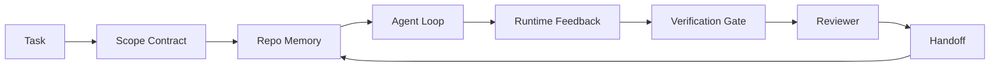

# 智能体工作台工程：为何强大的模型依然会失败

> 仅靠一个强大的模型是不够的。可靠的智能体需要一个工作台：指令、状态、范围、反馈、验证、审查和交接。如果剥离这些要素，即使是前沿模型产出的工作成果也不具备安全交付的条件。

**类型：** 学习 + 构建
**语言：** Python（标准库）
**前置条件：** 第 14 阶段 · 01（智能体循环），第 14 阶段 · 26（故障模式）
**耗时：** 约 45 分钟

## 学习目标

- 将模型能力与执行可靠性区分开来。
- 说出决定智能体能否成功交付的七个工作台表面（Surface）。
- 在小仓库任务中，对比仅使用提示词的运行与工作台引导的运行。
- 生成一份故障模式报告，将每个缺失的表面映射到其导致的具体症状。

## 问题所在

你将一个前沿模型放入真实代码库，要求它添加输入验证。它打开了四个文件，编写了看似合理的代码，声明成功并停止运行。你运行测试。两个失败了。第三个无关文件也被修改了。没有任何记录表明智能体基于什么假设、首先尝试了什么，或者还剩下什么没做。

模型对 Python 的理解没有错。错在对“工作”本身的认知。它根本不知道什么算作完成、允许在哪些地方写入、哪些测试具有权威性，也不知道下一个会话应该如何接续。

这不是模型缺陷。这是工作台缺陷。围绕智能体的表面缺少将一次性生成转化为可靠、可恢复的工程化所需的组件。

## 核心概念

工作台是任务期间包裹模型的运行环境。它包含七个表面：

| 表面 | 承载内容 | 缺失时的故障表现 |
|---------|-----------------|----------------------|
| 指令 (Instructions) | 启动规则、禁止操作、完成定义 | 智能体猜测什么是可交付状态 |
| 状态 (State) | 当前任务、已修改文件、阻塞项、下一步动作 | 每次会话都从零开始 |
| 范围 (Scope) | 允许的文件、禁止的文件、验收标准 | 修改泄露到无关代码中 |
| 反馈 (Feedback) | 捕获到循环中的真实命令输出 | 智能体在报错（如 400）时仍声明成功 |
| 验证 (Verification) | 测试、代码检查、冒烟测试、范围校验 | “看起来不错”的代码直接合入主分支 |
| 审查 (Review) | 由不同角色执行的二次检查 | 开发者给自己批改作业 |
| 交接 (Handoff) | 变更内容、原因、剩余事项 | 下一个会话重新发现所有信息 |

工作台独立于模型存在。你可以更换模型而保留这些表面。但你无法更换表面而保持可靠性。



循环的闭合依赖于状态文件，而非聊天记录。聊天记录是易失的。代码库才是事实来源（System of Record）。

### 工作台与提示词工程

提示词告诉模型你本轮想要什么。工作台告诉模型如何跨轮次、跨会话地开展工作。大多数智能体失败案例，本质上是披着提示词工程外衣的工作台失败。

### 工作台与框架

框架为你提供运行时环境（LangGraph、AutoGen、Agents SDK）。工作台为智能体提供在该运行时内部工作的场所。两者缺一不可。本迷你课程聚焦于后者。

### 从基础原语出发，而非厂商分类法

目前关于“编排工程（Harness Engineering）”的讨论很多。Addy Osmani、OpenAI、Anthropic、LangChain、Martin Fowler、MongoDB、HumanLayer、Augment Code、Thoughtworks、walkinglabs 精选列表，以及 Medium 和 Hacker News 上持续不断的文章都在探讨这一主题。他们对编排的边界、涵盖范围和术语使用存在分歧。我们无需站队。这七个表面是一个用户体验层；在每个工作台底层，支撑任何可靠后端的都是同一组分布式系统原语。

暂时抛开“智能体”这个标签。一次智能体运行是跨越时间、进程和机器的计算。要使其可靠，你需要生产系统所需的那些相同原语。

| 原语 | 定义 | 对智能体的承载意义 |
|-----------|------------|------------------------------|
| 函数 (Function) | 类型化的处理器。尽可能保持纯函数。拥有自己的输入和输出。 | 工具调用、规则检查、验证步骤、模型调用 |
| 工作者 (Worker) | 长期运行的进程，拥有一个或多个函数及生命周期 | 构建者、审查者、验证者、MCP 服务器 |
| 触发器 (Trigger) | 调用函数的事件源 | 智能体循环滴答、HTTP 请求、队列消息、定时任务、文件变更、钩子 |
| 运行时 (Runtime) | 决定什么在哪里运行、超时和资源限制边界的机制 | Claude Code 的进程、LangGraph 的运行时、工作者容器 |
| HTTP / RPC | 调用方与工作者之间的通信链路 | 工具调用协议、MCP 请求、模型 API |
| 队列 (Queue) | 触发器与工作者之间的持久缓冲；支持背压、重试、幂等 | 任务看板、反馈日志、审查收件箱 |
| 会话持久化 (Session persistence) | 崩溃、重启、模型切换后仍能保留的状态 | `agent_state.json`、检查点、KV 存储、代码库本身 |
| 授权策略 (Authorization policy) | 谁可以调用什么函数以及作用域是什么 | 允许/禁止的文件、审批边界、MCP 能力列表 |

现在将这七个工作台表面映射到这些原语上。

- **指令** — 策略 + 函数元数据。规则即检查（函数）。路由器（`AGENTS.md`）是附加在运行时启动阶段的策略。
- **状态** — 会话持久化。运行时每一步都会读取的键值存储。文件、KV 或数据库均可；持久化语义至关重要，存储后端并不重要。
- **范围** — 按任务划分的授权策略。允许/禁止的通配符即访问控制列表（ACL）。需要审批即权限格。
- **反馈** — 写入队列的调用日志。每次 Shell 调用都是一条记录，持久且可重放。
- **验证** — 一个函数。对输入具有确定性。在任务关闭时触发。故障安全（Fails closed）。
- **审查** — 一个独立的工作者，对构建产物只读，对审查报告只写。
- **交接** — 由会话结束触发器发出的持久记录。下一个会话的启动触发器会读取它。

智能体循环本身就是一个工作者，它消费事件（用户消息、工具结果、定时器滴答），调用函数（模型，然后是模型选择的工具），写入记录（状态、反馈），并发出触发器（验证、审查、交接）。毫无神秘之处；其形态与作业处理器完全一致。

### 流行模式的原语化翻译

每个流行的编排模式都可以还原为这八个原语。翻译对照表如下。

| 厂商或社区模式 | 实际本质 |
|------------------------------|--------------------|
| Ralph Loop（Claude Code、Codex、agentic_harness 书籍）——当智能体试图过早停止时，将原始意图重新注入新的上下文窗口 | 一个触发器，将任务以干净的上下文重新入队；会话持久化将目标延续下去 |
| 计划/执行/验证（PEV） | 三个工作者，各司其职，通过状态和阶段间的队列进行通信 |
| 编排与计算分离（OpenAI Agents SDK，2026年4月）——将控制面与执行面拆分 | 控制面/数据面的另一种表述。比“智能体”标签早出现几十年 |
| 开放智能体护照（OAP，2026年3月）——在执行前根据声明式策略对每次工具调用进行签名和审计 | 由前置动作工作者强制执行的授权策略，附带签名审计队列 |
| 指南与传感器（Birgitta Böckeler / Thoughtworks）——前馈规则 + 反馈可观测性 | 授权策略 + 验证函数 + 可观测性追踪 |
| 渐进式压缩，五阶段（Claude Code 逆向工程，2026年4月） | 一个状态管理工作器，像定时任务一样定期扫描会话持久化数据，以保持其在预算范围内 |
| 钩子/中间件（LangChain、Claude Code）——拦截模型和工具调用 | 触发器 + 函数，包裹在运行时的调用路径周围 |
| 基于 Markdown 的技能与渐进式披露（Anthropic、Flue） | 函数注册表，函数元数据按需加载到上下文中 |
| 沙箱智能体（Codex、Sandcastle、Vercel Sandbox） | 计算面：具有隔离文件系统、网络和生命周期的运行时 |
| MCP 服务器 | 通过稳定 RPC 暴露函数的工作者，以能力列表作为授权依据 |

表格中的每一项都是智能体社区重新发现了一个在分布式系统中已有名称的原语，并为其赋予了新名字。作为营销标签很有用；但作为工程术语则缺乏实用性。

### 数据到底说明了什么

“编排优于模型”的主张如今有了数据支撑。值得了解，因为这也是反驳“只需等待更聪明的模型”这一观点的唯一诚实论据。

- Terminal Bench 2.0 —— 同一模型，仅调整编排就将编码智能体从排名前 30 之外提升至第五名（LangChain，《智能体编排解剖学》）。
- Vercel —— 删除了智能体 80% 的工具；成功率从 80% 跃升至 100%（MongoDB）。
- Harvey —— 仅通过编排优化，法律智能体的准确率就翻了一倍以上（MongoDB）。
- 88% 的企业 AI 智能体项目未能进入生产环境。失败主要集中在运行时层面，而非推理层面（preprints.org，《语言智能体编排工程》，2026年3月）。
- 一项针对三个流行开源框架的 2025 年基准研究显示任务完成率约为 50%；长上下文 WebAgent 在长上下文条件下从 40-50% 暴跌至 10% 以下，主要归因于无限循环和目标丢失（2026 年初多篇报道均有提及）。

核心结论并非“编排永远必胜”。模型确实会随着时间推移吸收编排技巧。真正的结论是：在当今，承担核心负载的工程工作位于模型外部而非内部，而承载这些负载的原语正是每个生产系统历来所需的基础设施。

### 厂商文档的局限之处

这部分不需要客气。

- LangChain 的《智能体编排解剖学》列举了十一个组件——提示词、工具、钩子、沙箱、编排、记忆、技能、子智能体，以及一个运行时“死循环”。它未提及队列、作为部署单元的工作者、触发器语义、作为独立关注点的会话持久化，或授权策略。它将编排视为一个配置对象，而非一个部署系统。
- Addy Osmani 的《智能体编排工程》提出了框架 `Agent = Model + Harness` 和棘轮模式，但未明确说明编排由什么构成。它更像是一种立场声明，而非技术规范。
- Anthropic 和 OpenAI 在表面上挖掘最深，但始终局限于各自的运行时环境。2026年4月 Agents SDK 发布的“编排与计算分离”公告是首个明确支持控制面/数据面拆分的厂商文档。这是一个基础原语思想，并非全新概念。
- 《agentic_harness》书籍将编排视为配置对象（Jaymin West 的《智能体工程》第 6 章），其中最强的一句是“编排是智能体系统中的首要安全边界”。这仅仅是授权策略的另一种说法。
- Hacker News 上的讨论不断回归同一结论。2026年4月的帖子《智能体编排应位于沙箱之外》主张编排应“更像是一个位于一切之外的虚拟机监控程序（Hypervisor），基于上下文和用户授权访问”。这再次印证了授权策略应作为独立平面存在。

你无需反对上述任何一篇文章就能察觉其中的差距。他们是在描述一个已经存在的系统的用户体验。而我们是在构建该系统本身。当系统构建正确时，七个表面会自然地从原语中衍生出来。当构建错误时，再多的 `AGENTS.md` 打磨也无法弥补缺失的队列。

因此，当你在别处听到“编排工程”时，请将其翻译回原语。提示词和规则是策略与函数。脚手架是运行时。护栏是授权加验证。钩子是触发器。记忆是会话持久化。Ralph Loop 是重新入队。子智能体是工作者。沙箱是计算面。词汇会变，工程不变。工作台是面向智能体的用户体验；而能在下一次厂商重构中留存下来的“编排”，是指函数、工作者、触发器、运行时、队列、持久化和策略被正确连接的系统。

## 构建它

`code/main.py` 会两次运行一个微型仓库任务。第一次仅使用提示词，第二次接入七个表面。使用相同的模型和任务。脚本会统计失败运行中缺失的表面数量，并打印故障模式报告。

仓库任务故意设计得很小：为一个单文件的 FastAPI 风格处理器添加输入验证，并编写一个通过的测试。

运行它：

```
python3 code/main.py
```

输出：两次运行的并列日志、总结仅提示词运行的 `failure_modes.json`，以及工作台运行的单行结论。

该智能体只是一个微小的基于规则的桩代码；重点在于表面，而非模型。在本迷你课程的其余部分，你将把每个表面重建为真实、可复用的工件。

## 使用它

即使没人这么称呼它们，工作台的表面在实际中早已存在于以下三个地方：

- **Claude Code、Codex、Cursor。** `AGENTS.md` 和 `CLAUDE.md` 属于指令表面。斜杠命令属于范围。钩子属于验证。
- **LangGraph、OpenAI Agents SDK。** 检查点和会话存储属于状态表面。交接属于交接表面。
- **真实代码库的 CI。** 测试、代码检查和类型检查属于验证。PR 模板属于交接。CODEOWNERS 属于审查。

工作台工程是一门使这些表面显式化且可复用的学科，而不是让每个团队去重新发明轮子。

## 交付它

`outputs/skill-workbench-audit.md` 是一个可移植的技能，用于审计现有仓库的七个工作台表面，并报告哪些缺失、哪些不完整、哪些健康。将其放置在任何智能体配置旁；它会告诉你首先应该修复什么。

## 练习

1. 选择一个你已经运行智能体的仓库。为七个表面打分（0 表示缺失，2 表示健康）。你最薄弱的表面是什么？
2. 扩展 `main.py`，使仅提示词的运行也能产生虚假的“成功”声明。验证验证门控是否会捕获到它。
3. 为你的产品增加第八个表面。论证为什么它不会坍缩进现有的七个表面之一。
4. 使用一个会产生额外文件写入幻觉的不同桩智能体重跑脚本。哪个表面最先捕获到它？
5. 将第 14 阶段 · 26 中提到的五个行业常见故障模式映射到七个表面上。每个表面旨在吸收哪种故障模式？

## 关键术语

| 术语 | 人们常说的说法 | 实际含义 |
|------|----------------|------------------------|
| 工作台 (Workbench) | “环境配置” | 围绕模型构建的工程化表面，使工作变得可靠 |
| 表面 (Surface) | “一份文档”或“一个脚本” | 智能体每轮读取或写入的命名、机器可读的输入 |
| 事实来源 (System of record) | “笔记” | 当聊天记录消失时，智能体视为真理的文件 |
| 完成定义 (Definition of done) | “验收” | 客观的、基于文件的检查清单，智能体无法伪造 |
| 工作台审计 (Workbench audit) | “仓库就绪度检查” | 对工作台七个表面的遍历，在工作开始前标记缺失部分 |

## 延伸阅读

将这些资料视为数据点，而非权威指南。每一篇都只是部分分类法。在决定是否采用之前，请将每个概念翻译回原语（函数、工作者、触发器、运行时、HTTP/RPC、队列、持久化、策略）。

厂商视角：

- [Addy Osmani, Agent Harness Engineering](https://addyosmani.com/blog/agent-harness-engineering/) —— `Agent = Model + Harness` 与棘轮模式；基础设施层面较薄弱
- [LangChain, The Anatomy of an Agent Harness](https://blog.langchain.com/the-anatomy-of-an-agent-harness/) —— 十一个组件：提示词、工具、钩子、编排、沙箱、记忆、技能、子智能体、运行时；省略了队列、部署、授权
- [OpenAI, Harness engineering: leveraging Codex in an agent-first world](https://openai.com/index/harness-engineering/) —— Codex 团队对其运行时周围表面的看法
- [OpenAI, Unrolling the Codex agent loop](https://openai.com/index/unrolling-the-codex-agent-loop/) —— 将智能体循环简化为针对函数调用的 `while`
- [Anthropic, Effective harnesses for long-running agents](https://www.anthropic.com/engineering/effective-harnesses-for-long-running-agents) —— 特定运行时内的长周期表面
- [Anthropic, Harness design for long-running application development](https://www.anthropic.com/engineering/harness-design-long-running-apps) —— 应用设计笔记
- [LangChain Deep Agents harness capabilities](https://docs.langchain.com/oss/python/deepagents/harness) —— 运行时配置表面

具备实用细节的实践者文章：

- [Martin Fowler / Birgitta Böckeler, Harness engineering for coding agent users](https://martinfowler.com/articles/harness-engineering.html) —— 指南（前馈）+ 传感器（反馈）；最清晰的控制理论框架
- [HumanLayer, Skill Issue: Harness Engineering for Coding Agents](https://www.humanlayer.dev/blog/skill-issue-harness-engineering-for-coding-agents) —— “这不是模型问题，而是配置问题”
- [MongoDB, The Agent Harness: Why the LLM Is the Smallest Part of Your Agent System](https://www.mongodb.com/company/blog/technical/agent-harness-why-llm-is-smallest-part-of-your-agent-system) —— 数据支撑：Vercel 80% 到 100%，Harvey 准确率翻倍，Terminal Bench 前 30 到前 5
- [Augment Code, Harness Engineering for AI Coding Agents](https://www.augmentcode.com/guides/harness-engineering-ai-coding-agents) —— 约束优先的逐步指南
- [Sequoia podcast, Harrison Chase on Context Engineering Long-Horizon Agents](https://sequoiacap.com/podcast/context-engineering-our-way-to-long-horizon-agents-langchains-harrison-chase/) —— 运行时关注点优于模型关注点

书籍、论文与参考实现：

- [Jaymin West, Agentic Engineering — Chapter 6: Harnesses](https://www.jayminwest.com/agentic-engineering-book/6-harnesses) —— 全书篇幅论述，将编排视为主安全边界
- [preprints.org, Harness Engineering for Language Agents (March 2026)](https://www.preprints.org/manuscript/202603.1756) —— 学术框架：控制 / 代理 / 运行时
- [walkinglabs/awesome-harness-engineering](https://github.com/walkinglabs/awesome-harness-engineering) —— 精选阅读列表，涵盖上下文、评估、可观测性、编排
- [ai-boost/awesome-harness-engineering](https://github.com/ai-boost/awesome-harness-engineering) —— 替代精选列表（工具、评估、记忆、MCP、权限）
- [andrewgarst/agentic_harness](https://github.com/andrewgarst/agentic_harness) —— 生产就绪的参考实现，配备 Redis 支持的记忆和评估套件
- [HKUDS/OpenHarness](https://github.com/HKUDS/OpenHarness) —— 内置个人智能体的开源智能体编排

值得阅读以了解分歧而非共识的 Hacker News 帖子：

- [HN: Effective harnesses for long-running agents](https://news.ycombinator.com/item?id=46081704)
- [HN: Improving 15 LLMs at Coding in One Afternoon. Only the Harness Changed](https://news.ycombinator.com/item?id=46988596)
- [HN: The agent harness belongs outside the sandbox](https://news.ycombinator.com/item?id=47990675) —— 主张将授权作为独立平面

本课程内部交叉引用：

- 第 14 阶段 · 23 —— OpenTelemetry GenAI 规范：传感器文献所指的可观测性层
- 第 14 阶段 · 26 —— 故障模式目录，七个表面旨在吸收这些故障
- 第 14 阶段 · 27 —— 位于授权策略原语层面的提示词注入防御
- 第 14 阶段 · 29 —— 生产运行时（队列、事件、定时任务）：本课原语在部署中的落脚点
