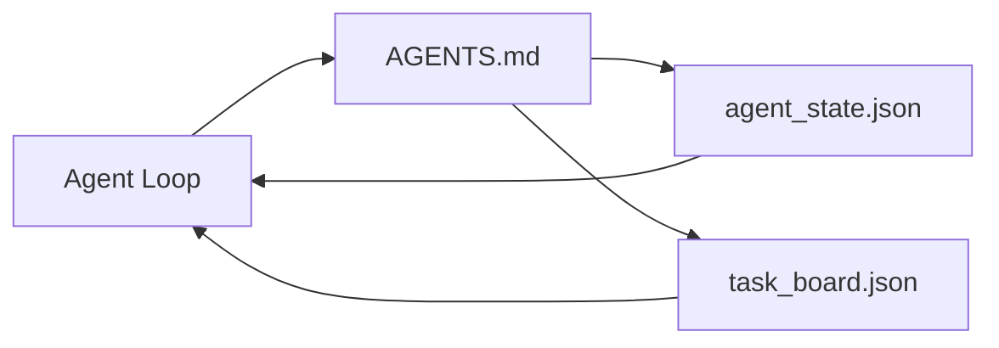

# 最小化智能体工作台

> 最精简且实用的工作台仅需三个文件：一个根指令路由器、一个状态文件和一张任务看板。其余所有功能都是在此基础上叠加的。如果一个仓库连这三个文件都承载不了，再强大的模型也救不了它。

**类型：** 构建
**语言：** Python（标准库）
**前置条件：** 阶段 14 · 31（为何能力出众的模型仍会失败）
**耗时：** 约 45 分钟

## 学习目标

- 定义构成最小可行工作台的三个文件。
- 解释为何简短的根路由器优于冗长的单体 `AGENTS.md`。
- 构建一个状态文件，供智能体在每一步读取并在结束时写入。
- 构建一张任务看板，使其能在无聊天记录的情况下跨会话持久运行。

## 问题所在

大多数团队搭建工作台的方式是写一个 3000 行的 `AGENTS.md` 然后就此收工。模型加载后，会忽略无法总结的部分，并且依然会在其一贯失败的领域栽跟头。

你需要反其道而行之。一个极小的根文件，仅在相关时才将智能体路由到更深层的文件中。一份持久的状态记录，智能体在行动前读取，行动后写入。一张任务看板，明确哪些正在处理、哪些被阻塞、哪些即将进行。

三个文件。各司其职。每个文件都具备足够的机器可读性，以便日后演进为真正的系统。

## 核心概念



### AGENTS.md 是路由器，而非操作手册

优秀的 `AGENTS.md` 应该简短。它指引智能体前往：

- 状态文件（当前所在位置）。
- 任务看板（剩余待办事项）。
- 更深层的规则（位于 `docs/agent-rules.md` 下）。
- 验证命令（如何确认一切正常）。

任何更长的内容都应放入深层文档中，仅在需要时加载。冗长的手册会被忽略，简短的路由器会被遵循。

### agent_state.json 是权威记录系统

状态包含：当前任务 ID、已修改的文件、做出的假设、阻塞项以及下一步动作。智能体在每一步都会读取它。下一次会话直接读取它，而不是重播聊天记录。

状态必须保存在文件中，因为聊天记录不可靠。会话会终止，对话会被截断，但文件不会。

### task_board.json 是任务队列

任务看板记录着所有状态为 `todo | in_progress | done | blocked` 的任务。当状态为空时，智能体会从中拉取任务；当你想知道智能体是否按部就班时，也会查看这个队列。

看板上的任务包含 ID、目标、负责人（`builder`、`reviewer` 或 `human`）以及验收标准。看板刻意保持精简：一旦它超出一个屏幕的显示范围，说明你面临的是规划问题，而不是看板设计问题。

### 三个文件只是底线，而非上限

后续课程会引入范围契约、反馈执行器、验证门禁、审查员清单和交接包。这里的三个文件是所有进阶功能的基础假设。

## 动手构建

`code/main.py` 会将最小化工作台写入空仓库，并演示单次智能体交互流程：

1. 读取 `agent_state.json`。
2. 若状态为空，则从 `task_board.json` 拉取下一个任务。
3. 在范围内修改单个文件。
4. 回写更新后的状态。

运行方式：

```
python3 code/main.py
```

该脚本会在自身旁边创建 `workdir/`，部署这三个文件，执行一次交互，并打印差异对比。重新运行它以观察第二次交互如何接续第一次的结果。

## 实际使用

在生产级智能体产品中，同样的三个文件会以不同的名称出现：

- **Claude Code：** 使用 `AGENTS.md` 或 `CLAUDE.md` 作为路由器，采用 `.claude/state.json` 风格存储状态，通过钩子管理看板。
- **Codex / Cursor：** 使用工作区规则作为路由器，会话内存保存状态，聊天侧边栏中的排队任务充当看板。
- **自定义 Python 智能体：** 正是你刚刚编写的这三个文件。

名称会变，形态不变。

## 生产环境中的常见模式

当在此基础之上叠加三种模式时，最小化工作台就能在实际单体仓库中稳定运行。这些模式相互独立；请根据你仓库的实际需求进行选择。

**嵌套的 `AGENTS.md` 与就近优先原则。** OpenAI 在其主仓库中分发了 88 个 `AGENTS.md` 文件，每个子组件对应一个。Codex、Cursor、Claude Code 和 Copilot 都会从当前工作文件向仓库根目录遍历，并拼接沿途找到的所有 `AGENTS.md`。子目录文件用于扩展根文件。Codex 引入了 `AGENTS.override.md` 以实现替换而非扩展；该覆盖机制是 Codex 特有的，跨工具协作时应避免使用。Augment Code 的测量指标表明最关键的是行数：最优秀的 `AGENTS.md` 文件能带来相当于从 Haiku 升级到 Opus 的质量飞跃；最差的则会使得输出质量比完全没有文件还要糟糕。

**必须拒绝的反模式，即使它们看起来像代码覆盖。** 冲突的指令会静默地将智能体从交互模式降级为贪婪模式（ICLR 2026 AMBIG-SWE：解决率从 48.8% 降至 28%）；请使用数字编号优先级，而非平铺堆叠。缺乏强制命令的不可验证样式规则（如“遵循 Google Python 风格指南”）会让智能体自行编造合规性；每条样式规则都必须搭配具体的 lint 命令。以样式开头而非命令开头会掩盖验证路径；应先列命令，后列样式。为人类编写而非为智能体编写会浪费上下文预算；简洁是一种特性。

**跨工具符号链接。** 带有符号链接的单一根文件（`ln -s AGENTS.md CLAUDE.md`、`ln -s AGENTS.md .github/copilot-instructions.md`、`ln -s AGENTS.md .cursorrules`）能让所有编码智能体共享同一份事实来源。Nx 的 `nx ai-setup` 能够从单一配置中自动为 Claude Code、Cursor、Copilot、Gemini、Codex 和 OpenCode 实现此功能。

## 交付使用

`outputs/skill-minimal-workbench.md` 可为任意新仓库生成三文件工作台：一个针对项目调优的 `AGENTS.md` 路由器、一个包含正确键值的 `agent_state.json`，以及一个用当前积压任务填充的 `task_board.json`。

## 练习

1. 在 `agent_state.json` 中添加 `last_run` 时间戳。除非操作员确认，否则若文件超过 24 小时则拒绝运行。
2. 为任务看板添加 `priority` 字段，并修改拉取逻辑，使其始终选择最高优先级的 `todo`。
3. 将 `task_board.json` 迁移至 JSON Lines 格式，使每个任务占一行，便于版本控制中保持差异清晰。
4. 编写一个 `lint_workbench.py`，当 `AGENTS.md` 超过 80 行或引用了不存在的文件时触发失败。
5. 判断丢失这三个文件中的哪一个会造成最大损失，并阐述理由。

## 关键术语

| 术语 | 人们常说的说法 | 实际含义 |
|------|----------------|----------|
| 路由器 (Router) | `AGENTS.md` | 简短的根文件，指引智能体访问深层文档与文件 |
| 状态文件 (State file) | “笔记” | 机器可读的智能体当前位置记录，每次交互后写入 |
| 任务看板 (Task board) | “待办列表” | 包含状态、负责人和验收标准的 JSON 工作队列 |
| 权威记录系统 (System of record) | “事实来源” | 当聊天记录消失时，工作台视为权威依据的文件 |

## 延伸阅读

- [agents.md —— 开放规范](https://agents.md/) —— 已被 Cursor、Codex、Claude Code、Copilot、Gemini、OpenCode 采纳
- [Augment Code，优秀的 AGENTS.md 是模型升级，糟糕的则比没有文档更差](https://www.augmentcode.com/blog/how-to-write-good-agents-dot-md-files) —— 实测质量提升数据
- [Blake Crosley，AGENTS.md 模式：究竟什么能改变智能体行为](https://blakecrosley.com/blog/agents-md-patterns) —— 经验证有效与无效的做法
- [Datadog 前端团队，使用 AGENTS.md 引导单体仓库中的 AI 智能体](https://dev.to/datadog-frontend-dev/steering-ai-agents-in-monorepos-with-agentsmd-13g0) —— 嵌套优先级的实际应用
- [Nx 博客，教你的 AI 智能体如何在单体仓库中工作](https://nx.dev/blog/nx-ai-agent-skills) —— 跨六种工具的单一源生成方案
- [The Prompt Shelf，AGENTS.md 最佳实践：结构、范围与实际案例](https://thepromptshelf.dev/blog/agents-md-best-practices/) —— 经得起审查的章节排序
- [Anthropic，Claude Code 子智能体与会话存储](https://docs.anthropic.com/en/docs/agents-and-tools/claude-code/sub-agents)
- 阶段 14 · 31 —— 本最小化设计所吸收的故障模式
- 阶段 14 · 34 —— 本课预览的持久状态架构
