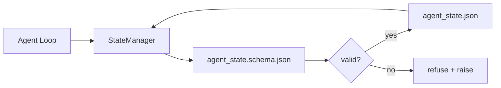

# 仓库记忆与持久化状态

> 聊天记录是易失的。仓库是持久的。工作台将智能体状态存储在版本化文件中，以便下一次会话、下一个智能体和下一位审查者都能从同一个事实来源读取数据。

**类型：** 构建
**语言：** Python（标准库 + `jsonschema` 可选）
**前置条件：** 第 14 阶段 · 32（最小工作台）
**时间：** 约 60 分钟

## 学习目标

- 明确哪些内容应放入仓库记忆，哪些应保留在聊天记录中。
- 为 `agent_state.json` 和 `task_board.json` 编写 JSON Schema。
- 构建一个状态管理器，能够加载、验证、修改并原子化持久化状态。
- 利用 Schema 在写入损坏工作台之前拒绝无效写入。

## 问题所在

智能体完成了一次会话。聊天窗口关闭。下一次会话打开时询问从哪里开始。模型说“让我检查一下文件”，读取了过时的笔记，并重做了已经完成的工作。或者更糟的是，它重写了一个已完成的文件，因为没有人告诉它该文件已经完成了。

工作台的解决方案是仓库记忆：状态以 JSON 文件的形式存在于仓库中，遵循 Schema 编写，原子化持久化，且在代码审查中便于查看差异。聊天记录只是临时流；仓库才是记录系统（System of Record）。

## 核心概念



### 哪些内容属于仓库记忆

| 属于仓库记忆 | 不属于仓库记忆 |
|--------------|----------------|
| 当前活跃任务 ID | 原始聊天记录 |
| 本次会话修改的文件 | 基于 Token 的推理轨迹 |
| 智能体做出的假设 | “用户似乎感到沮丧” |
| 未解决的阻塞项 | 采样生成的补全内容 |
| 下一步行动 | 厂商特定的模型 ID |

判断标准是持久性：三个月后在 CI 重新运行时，这些数据还有用吗？如果有用，存入仓库。如果没用，存入遥测数据。

### Schema 优先的状态管理

JSON Schema 是契约。没有它，每个智能体都会发明新字段，每位审查者都要适应新结构，每个 CI 脚本都必须对历史版本做特殊处理。有了它，无效写入会被直接拒绝。

Schema 涵盖以下内容：

- 必填键。
- 允许的 `status` 值。
- 禁止的值（例如数组中的 `null`）。
- 模式约束（任务 ID 需匹配 `T-\d{3,}`）。
- 用于迁移的版本字段。

### 原子写入

状态写入必须能容忍部分失败：先写入临时文件，执行 fsync，然后覆盖重命名到目标位置。状态文件是事实来源；半写状态比完全没有文件更糟糕。

### 迁移策略

当 Schema 发生变化时，随 Schema 版本升级一并发布迁移脚本。状态文件包含一个 `schema_version` 字段；管理器会拒绝加载无法进行迁移的旧版本文件。

## 动手实现

`code/main.py` 实现了以下功能：

- `agent_state.schema.json` 和 `task_board.schema.json`。
- 仅使用标准库的验证器（JSON Schema 的子集：required、type、enum、pattern、items）。
- `StateManager.load`、`StateManager.update`、`StateManager.commit`，采用原子化的临时文件写入与重命名。
- 一个演示程序，用于修改状态、持久化、重新加载，并验证往返流程。

运行方式：

```
python3 code/main.py
```

该脚本会写入 `workdir/agent_state.json` 和 `workdir/task_board.json`，在两个回合中对其进行修改，并在每一步打印验证后的状态。

## 生产环境中的成熟模式

四种模式将本课的最小实现转化为多智能体单体仓库能够稳定运行的架构。

**原子化的临时文件写入与重命名不是可选项。** 一份 2026 年 3 月的 Hive 项目缺陷报告清晰地记录了该故障模式：`state.json` 通过 `write_text()` 写入，异常被捕获并静默处理。部分写入导致会话在状态损坏的情况下恢复，且没有任何提示。修复方案始终如一：在与目标相同的目录中 `tempfile.mkstemp`，写入，`fsync`，`os.replace`（在 POSIX 和 Windows 上实现原子重命名）。本课的 `atomic_write` 正是如此实现的。

**为非幂等工具调用添加幂等键。** 如果智能体在调用工具后但在检查点保存结果前崩溃，恢复时会重试该工具调用。这对读取操作是安全的；但对发送邮件、数据库插入、文件上传等操作则很危险。该模式的做法是：在执行前将每个工具调用 ID 记录到 `pending_calls.jsonl` 中。重试时检查该 ID；若存在，则跳过调用并使用缓存结果。Anthropic 和 LangChain 均在 2026 年的指南中强调了这一点；LangGraph 的检查点机制同样出于此原因持久化待处理的写入操作。

**将大型工件与状态分离。** 不要将 CSV 文件、长文本转录稿或生成的文件存储在 `agent_state.json` 中。将工件保存为独立文件（或上传至对象存储），仅在状态中保留路径。这样检查点保持小巧快速，而工件可以独立增长。

**事件溯源用于审计，快照用于恢复。** 每次状态变更时追加到事件日志（`state.events.jsonl`）；定期生成快照至 `state.json`。恢复时读取快照，然后重放快照时间戳之后的所有事件。这会消耗更多磁盘空间，但允许你逐字重放智能体的决策——这在调试长周期运行任务时至关重要。这与 Postgres 内部用于 WAL 的结构相同。

**执行 Schema 迁移或拒绝加载。** `schema_version` 整数即契约。当管理器尝试加载未知版本的文件时，会拒绝读取。随 Schema 升级发布迁移脚本；`tools/migrate_state.py` 会在每次启动时幂等地运行。

## 实际应用

在生产环境中：

- **LangGraph 检查点机制。** 理念相同，存储不同。检查点机制将图状态持久化到 SQLite、Postgres 或自定义后端。本课教授的 Schema 是在检查点机制失效且你需要手动读取状态时的首选方案。
- **Letta 记忆块。** 具有结构化 Schema 的持久化块（第 14 阶段 · 08）。将同样的规范应用于长期运行的角色设定。
- **OpenAI Agents SDK 会话存储。** 支持可插拔后端，具备 Schema 感知能力。本课中的状态文件即为本地文件后端。

## 交付部署

`outputs/skill-state-schema.md` 会生成项目专用的 JSON Schema 对（状态 + 看板）、一个绑定原子写入的 Python `StateManager`，以及一个迁移脚手架，确保下一次 Schema 升级不会破坏工作台。

## 练习

1. 添加 `last_human_touch` 时间戳。拒绝任何距离人工编辑在五秒内的智能体写入。
2. 扩展验证器以支持 `oneOf`，使任务可以是构建任务或审查任务，并拥有不同的必填字段。
3. 添加 `schema_version` 字段，并编写从 v1 到 v2 的迁移脚本（将 `blockers` 重命名为 `risks`）。
4. 将存储后端从本地文件迁移至 SQLite。保持 `StateManager` API 完全一致。
5. 让两个智能体针对同一状态文件进行并发写入，竞争窗口为 50 毫秒。会发生什么错误，原子重命名如何帮你避免这个问题？

## 关键术语

| 术语 | 常见说法 | 实际含义 |
|------|----------|----------|
| 仓库记忆 | “笔记文件” | 遵循 Schema 存储在仓库受控文件中的状态 |
| Schema 优先 | “验证输入” | 在写入前定义契约，拒绝结构漂移 |
| 原子写入 | “直接重命名” | 写入临时文件、fsync、重命名，防止部分失败导致损坏 |
| 迁移 | “Schema 升级” | 将 vN 状态转换为 v(N+1) 状态的脚本 |
| 记录系统 | “事实来源” | 工作台视为权威依据的工件 |

## 延伸阅读

- [JSON Schema specification](https://json-schema.org/specification.html)
- [LangGraph checkpointers](https://langchain-ai.github.io/langgraph/concepts/persistence/)
- [Letta memory blocks](https://docs.letta.com/concepts/memory)
- [Fast.io, AI Agent State Checkpointing: A Practical Guide](https://fast.io/resources/ai-agent-state-checkpointing/) —— 结合幂等性的契约优先检查点机制
- [Fast.io, AI Agent Workflow State Persistence: Best Practices 2026](https://fast.io/resources/ai-agent-workflow-state-persistence/) —— 并发控制、TTL、事件溯源
- [Hive Issue #6263 — non-atomic state.json writes silently ignored](https://github.com/aden-hive/hive/issues/6263) —— 真实项目中的故障模式
- [eunomia, Checkpoint/Restore Systems: Evolution, Techniques, Applications](https://eunomia.dev/blog/2025/05/11/checkpointrestore-systems-evolution-techniques-and-applications-in-ai-agents/) —— 源自操作系统历史的检查点/恢复原语在智能体中的应用
- [Indium, 7 State Persistence Strategies for Long-Running AI Agents in 2026](https://www.indium.tech/blog/7-state-persistence-strategies-ai-agents-2026/)
- [Microsoft Agent Framework, Compaction](https://learn.microsoft.com/en-us/agent-framework/agents/conversations/compaction) —— 厂商提供的检查点管理器
- 第 14 阶段 · 08 —— 记忆块与休眠期计算
- 第 14 阶段 · 32 —— 本课进行 Schema 化的三文件最小集
- 第 14 阶段 · 40 —— 从同一 Schema 读取的交接数据包
