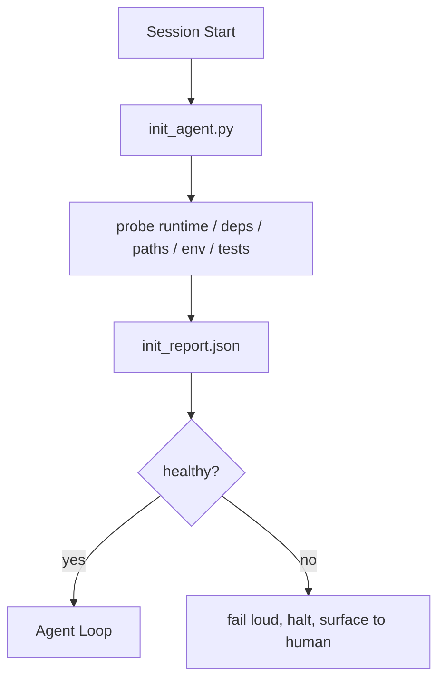

# 智能体初始化脚本

> 每次冷启动的会话都要付出代价。智能体会重复读取相同的文件、重试相同的探测，并重新发现相同的路径。初始化脚本只需支付一次代价，并将结果写入状态中。

**类型：** Build
**语言：** Python（stdlib）
**前置条件：** Phase 14 · 32（Minimal Workbench），Phase 14 · 34（Repo Memory）
**耗时：** 约 45 分钟

## 学习目标

- 识别智能体在每个会话中绝不应重复执行的工作。
- 构建一个确定性的初始化脚本，用于探测运行时环境、依赖项和仓库健康状况。
- 持久化探测结果，使智能体直接读取而非重复运行检查。
- 在初始化失败时快速、明确地报错，并提供唯一的排查入口。

## 问题所在

打开一个会话。智能体猜测 Python 版本。猜测测试命令。列出五次仓库根目录以寻找入口点。尝试导入未安装的包。询问用户配置文件的位置。等到它开始进行实际编辑时，已经消耗了上万 token 来执行本应只需一个脚本就能完成的设置工作。

解决方案是编写一个初始化脚本，它在智能体执行任何其他操作之前运行，并生成一个 `init_report.json`，供智能体在启动时读取。

## 核心概念



### 初始化脚本的探测项

| 探测项 | 重要性 |
|-------|--------|
| 运行时版本 | Python 或 Node 版本错误会导致隐蔽的版本不兼容 bug |
| 依赖可用性 | 后期缺失某个包的成本是现在捕获它的十倍 |
| 测试命令 | 智能体必须知道如何验证；如果缺少该命令，说明工作台已损坏 |
| 仓库路径 | 硬编码路径会漂移；一次性解析并固定下来 |
| 环境变量 | 缺少 `OPENAI_API_KEY` 属于明确的故障面，而非运行时的未知谜团 |
| 状态与看板新鲜度 | 来自崩溃会话的过期状态是一个致命隐患 |
| 最后已知正常提交 | 会话结束时交接差异的锚点 |

### 快速失败、明确失败、集中暴露

探测失败意味着立即停止并向人类反馈。不要指望“智能体会自己搞定”。初始化的核心目的就是在台坏掉时拒绝启动。

### 幂等性

连续运行两次。第二次运行除了更新一个新的时间戳外，应为空操作（no-op）。幂等性使得你可以将该脚本接入 CI、钩子或预任务斜杠命令中。

### 初始化脚本与启动规则的区别

规则（Phase 14 · 33）描述了采取行动前必须满足的条件。初始化脚本是建立这些规则可被检查的基础。没有初始化脚本的规则会变成“请小心”。没有规则的初始化脚本只会变成一种精致的失败。

## 构建实现

`code/main.py` 实现了 `init_agent.py`：

- 五项探测：Python 版本、通过 `importlib.util.find_spec` 列出的依赖项、测试命令的可解析性、必需的环境变量、状态文件的新鲜度。
- 每个探测项返回 `(name, status, detail)`。
- 脚本将完整探测集写入 `init_report.json`，若任何阻塞级探测失败则非零退出。

运行方式：

```
python3 code/main.py
```

脚本会打印探测项表格，写入 `init_report.json`，在正常路径下零退出，或在探测失败时非零退出并列出失败的探测项。

## 生产环境中的常见模式

三种模式能将实用的初始化脚本与繁琐的仪式区分开来。

**最后已知正常提交锚定。** 将当前提交与上次成功合并时写入的 `LKG` 文件进行比对。如果差异超出预算（默认 50 个文件），则拒绝启动并要求人工确认新基线。这正是 Cloudflare 的 AI Code Review 用于限定审查者智能体范围的做法：每次审查会话都锚定在同一份最后已知正常提交上，绝不会让漂移在会话间累积。

**带 TTL 的锁文件。** 在首次探测成功后写入 `prereqs.lock`。后续运行信任该锁 N 小时（默认 24 小时），并跳过昂贵的探测。初始化脚本优先读取锁文件；如果锁文件新鲜且依赖清单哈希匹配，则短路跳过。这与 Docker 用于层缓存的模式相同：幂等探测 + 内容哈希 = 跳过。

**热路径中无网络调用、无 LLM 交互、无意外惊喜。** 初始化探测是确定性的底层管道。调用 LLM 对故障进行分类或访问外部服务检查许可证的探测不是探测，而是工作流。如果在试运行中某项探测耗时超过三秒，应将其视为工作台异味（workbench smell），要么将其移出初始化流程，要么缓存其结果。

## 使用方式

在生产环境中：

- **Claude Code 钩子。** `pre-task` 钩子会调用初始化脚本，若失败则拒绝启动智能体。
- **GitHub Actions。** 一个 `setup-agent` 作业负责运行初始化脚本；智能体作业依赖于此。
- **Docker 入口点。** 智能体容器在执行智能体运行时之前先运行初始化脚本；失败时日志会直接输出。

初始化脚本具有可移植性，因为它不调用任何特定框架。Bash、Make 或任务文件均可将其封装。

## 交付部署

`outputs/skill-init-script.md` 会对项目进行调研，将其设置工作分类为探测项，并生成项目专属的 `init_agent.py` 以及一个在任何智能体步骤之前运行的 CI 工作流。

## 练习

1. 添加一项探测，将当前提交与最后已知正常提交进行比对，如果变更文件超过 50 个则拒绝启动。
2. 配置脚本写入 `prereqs.lock` 文件，如果锁文件超过七天则拒绝启动。
3. 添加一个 `--fix` 标志位，使其自动安装缺失的开发依赖项，但绝不在未经批准的情况下修改运行时依赖项。
4. 将探测项从硬编码函数迁移至 YAML 注册表。论证这种权衡的合理性。
5. 为每项探测添加时间预算。运行时间超过三秒的探测属于工作台异味。

## 关键术语

| 术语 | 常见说法 | 实际含义 |
|------|----------|----------|
| 探测 (Probe) | “一次检查” | 返回 `(name, status, detail)` 的确定性函数 |
| 初始化报告 (Init report) | “设置输出” | 与状态文件并列写入的包含探测结果的 JSON |
| 幂等 (Idempotent) | “可安全重复运行” | 连续运行两次生成的报告除时间戳外完全一致 |
| 快速失败 (Fail loud) | “不要吞掉错误” | 立即停止并向人类反馈；不存在静默降级 |
| 设置税 (Setup tax) | “引导成本” | 智能体每个会话为重新发现显而易见信息所消耗的 token |

## 延伸阅读

- [Anthropic, Effective harnesses for long-running agents](https://www.anthropic.com/engineering/effective-harnesses-for-long-running-agents)
- [GitHub Actions, composite actions for setup](https://docs.github.com/en/actions/sharing-automations/creating-actions/creating-a-composite-action)
- [microservices.io, GenAI dev platform: guardrails](https://microservices.io/post/architecture/2026/03/09/genai-development-platform-part-1-development-guardrails.html) —— 将 pre-commit 和 CI 检查作为初始化手段
- [Augment Code, How to Build Your AGENTS.md (2026)](https://www.augmentcode.com/guides/how-to-build-agents-md) —— 初始化期望
- [Codex Blog, Codex CLI Context Compaction](https://codex.danielvaughan.com/2026/03/31/codex-cli-context-compaction-architecture/) —— 将会话启动视为感知压缩的初始化过程
- Phase 14 · 33 —— 本脚本所启用的规则集
- Phase 14 · 34 —— 本脚本所初始化的状态文件
- Phase 14 · 38 —— 本脚本所驱动的验证门禁
- Phase 14 · 40 —— 消费初始化报告中最后已知正常提交的交接流程
