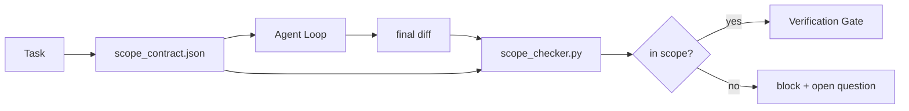

# 作用域契约与任务边界

> 模型并不知道工作的边界在哪里。作用域契约是一个按任务划分的文件，它规定了工作从哪里开始、到哪里结束，以及如果越界了该如何回滚。契约将“保持在作用域内”从一种期望变成了可检查的约束。

**类型：** 构建
**语言：** Python (stdlib)
**前置条件：** 第 14 阶段 · 32（最小工作台）、第 14 阶段 · 33（规则即约束）
**耗时：** ~50 分钟

## 学习目标

- 编写一个在任务开始时由智能体读取、在任务结束时由验证器读取的作用域契约。
- 指定允许的文件、禁止的文件、验收标准、回滚计划和审批边界。
- 实现一个作用域检查器，用于将差异（diff）与契约进行比较并标记违规项。
- 使作用域蔓延变得可见、自动且可审查。

## 问题所在

智能体会越界。任务是“修复登录 Bug”。但差异提交却触及了登录路由、邮件辅助函数、数据库驱动、README 和发布脚本。每一步在当时看来都有合理的理由。但它们合在一起，就变成了一个与已审查内容完全不同的变更。

作用域蔓延是智能体工作中监控最不足的故障模式，因为智能体会真诚地叙述每一步。解决方案不是更严格的提示词。解决方案是磁盘上的一个契约，明确说明承诺了什么，以及一个将结果与承诺进行比对的检查机制。

## 核心概念



### 作用域契约包含的内容

| 字段 | 用途 |
|-------|---------|
| `task_id` | 链接到看板上的任务 |
| `goal` | 审查者可验证的一句话描述 |
| `allowed_files` | 智能体允许写入的文件通配符 |
| `forbidden_files` | 智能体绝对不可触碰的文件通配符 |
| `acceptance_criteria` | 证明任务完成的测试命令或断言行 |
| `rollback_plan` | 操作员在需要中止时可执行的一段话操作指南 |
| `approvals_required` | 超出作用域且需要人类明确签字批准的操作 |

缺少 `forbidden_files` 的契约是不完整的。负空间（禁止项）构成了契约的一半。

### 使用通配符，而非绝对路径

真实的仓库会移动文件。将契约绑定到通配符（`app/**/*.py`、`tests/test_signup*.py`），这样会话间的重构就不会导致契约失效。

### 回滚是作用域的一部分

列出回滚步骤会迫使契约作者思考可能出现的故障。一份无法回滚的契约，就不应该被批准。

### 作用域检查即是差异检查

智能体生成差异提交。检查器读取该差异、允许的通配符列表、禁止的通配符列表，以及已执行的验收命令列表。每个违规项都会被打上标签，验证门控据此拒绝合并。

## 动手构建

`code/main.py` 实现了以下功能：

- `scope_contract.json` 数据结构（JSON Schema 的子集，包含通配符数组）。
- 一个差异解析器，将受影响的文件列表和已运行的命令列表转换为 `RunSummary` 对象。
- 一个 `scope_check`，用于对照契约返回 `(violations, in_scope, off_scope)`。
- 两次演示运行：一次严格保持在作用域内，一次发生越界。检查器会精确指出越界的文件和原因。

运行方式：

```
python3 code/main.py
```

输出：契约文件、两次运行的结果、每次运行的判定结论，以及保存的 `scope_report.json`。

## 生产环境中的实践模式

一位实践者在使用“specsmaxxing”（即在调用智能体前先用 YAML 编写作用域契约）后报告，三周内陷入死胡同（rabbit-hole）的概率从 52% 降至 21%，且未更改智能体本身。是契约完成了工作，而非模型。以下三种模式能让收益稳固落地。

**违规预算，而非二元失败。** `agent-guardrails`（通过 MCP 供 Claude Code、Cursor、Windsurf、Codex 使用的开源合并门控）为每个任务配置了 `violationBudget`：预算内的轻微越界仅作为警告提示；只有超出预算时，合并门控才会拒绝。需配合 `violationSeverity: "error" | "warning"` 使用。预算机制决定了门控是顺利上线，还是被痛恨它的团队直接禁用。

**按路径家族划分严重性不对称。** 对 `docs/**` 的越界写入通常视为 `warn`；而对 `scripts/**`、`migrations/**`、`config/prod/**` 的越界写入则一律视为 `block`。这种不对称性必须内置于契约中，而非运行时，因为它高度依赖项目特性且随任务变化。

**文件预算之外，还需时间与网络预算。** `time_budget_minutes` 字段限制物理时钟时间；若无重新审批，运行时拒绝在此之后继续执行。基于主机名的 `network_egress` 白名单可防止智能体静默调用任务范围外的外部 API。这些同样是作用域的维度；文件通配符只是必要条件，而非充分条件。

**多契约合并语义（最小权限原则）。** 当两个作用域契约同时适用时（例如全局项目契约加上特定任务契约），合并逻辑为：**交集** `allowed_files`（两份契约都必须允许该路径），**并集** `forbidden_files`（任一契约禁止即可），`time_budget_minutes` 取最严格值（最小值），`approvals_required` 累加。`network_egress` 默认值为 `None`（不强制执行），`[]` 表示全拒，`[...]` 作为白名单；合并时，`None` 以另一方为准，两个列表取交集，全拒状态保持全拒。需在契约模式中明确定义此逻辑，使合并过程机械化且可审查。

## 如何使用

生产环境用法：

- **Claude Code 斜杠命令。** 一个 `/scope` 命令负责生成契约并将其固定为会话上下文。子智能体在执行操作前会读取该契约。
- **GitHub PRs。** 将契约作为 JSON 文件推送到 PR 正文中，或作为签入的制品。CI 将对合并差异运行作用域检查器。
- **LangGraph 中断机制。** 作用域违规会触发中断；处理器会询问人类是需要扩展契约，还是需要让智能体退回。

契约随任务流转。任务关闭后，契约将归档至 `outputs/scope/closed/`。

## 交付部署

`outputs/skill-scope-contract.md` 可为任务描述生成作用域契约，并提供一个感知通配符的检查器，在 CI 中对每次智能体差异提交运行检查。

## 练习

1. 添加一个 `network_egress` 字段，列出允许的外部主机。拒绝访问其他主机的运行请求。
2. 扩展检查器，使其对 `docs/**` 软失败，对 `scripts/**` 硬失败。论证这种不对称性的合理性。
3. 让契约使用静态规则集（不调用 LLM）从 `goal` 字段派生 `allowed_files`。第一个边界情况会出现什么问题？
4. 添加一个 `time_budget_minutes`，一旦物理时钟超过该值就拒绝继续执行。
5. 将两个契约应用于同一个差异提交。当两者同时适用时，正确的合并语义是什么？

## 关键术语

| 术语 | 人们常说的说法 | 实际含义 |
|------|----------------|----------|
| Scope contract | “任务简报” | 按任务划分的 JSON 文件，列出允许/禁止的文件、验收标准及回滚方案 |
| Scope creep | “它还改了别的…” | 同一任务中修改了契约范围之外的文件 |
| Rollback plan | “我们可以回退” | 用于中止操作的一段式操作员手册 |
| Approval boundary | “需要签字确认” | 契约中列明需要人类明确批准的操作 |
| Diff check | “路径审计” | 将受影响文件与契约通配符进行比对 |

## 延伸阅读

- [LangGraph human-in-the-loop interrupts](https://langchain-ai.github.io/langgraph/concepts/human_in_the_loop/)
- [OpenAI Agents SDK tool approval policies](https://platform.openai.com/docs/guides/agents-sdk)
- [logi-cmd/agent-guardrails — merge gates and scope validation](https://github.com/logi-cmd/agent-guardrails) — violation budgets, severity tiers
- [Dev|Journal, Preventing AI Agent Configuration Drift with Agent Contract Testing](https://earezki.com/ai-news/2026-05-05-i-built-a-tiny-ci-tool-to-keep-ai-agent-configs-from-drifting-in-my-repo/) — `--strict` mode without external deps
- [Agentic Coding Is Not a Trap (production logs)](https://dev.to/jtorchia/agentic-coding-is-not-a-trap-i-answered-the-viral-hn-post-with-my-own-production-logs-33d9) — specsmaxxing receipts: 52% → 21%
- [OpenCode permission globs](https://opencode.ai/docs/agents/) — fine-grained per-permission scope
- [Knostic, AI Coding Agent Security: Threat Models and Protection Strategies](https://www.knostic.ai/blog/ai-coding-agent-security) — scope as part of least privilege
- [Augment Code, AI Spec Template](https://www.augmentcode.com/guides/ai-spec-template) — three-tier boundary system (must/ask/never)
- Phase 14 · 27 — prompt injection defenses that pair with scope locks
- Phase 14 · 33 — the rule set this contract specializes per task
- Phase 14 · 38 — the verification gate the checker reports into
