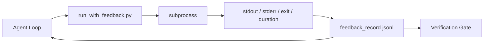

# 运行时反馈循环

> 无法看到真实命令输出的代理只能靠猜测。反馈运行器会将标准输出、标准错误、退出码和耗时捕获到一个结构化记录中，供下一轮读取。这样，代理就能基于事实做出反应，而不是基于它对事实的预测。

**类型：** 构建
**语言：** Python（标准库）
**前置条件：** 阶段 14 · 32（最小工作台）、阶段 14 · 35（初始化脚本）
**预计时间：** 约 50 分钟

## 学习目标

- 区分运行时反馈与可观测性遥测数据。
- 构建一个包装 Shell 命令并持久化结构化记录的反馈运行器。
- 以确定性方式截断大型输出，确保循环保持在令牌预算内。
- 当缺少反馈时拒绝推进循环。

## 问题所在

代理说“正在运行测试”。下一条消息显示“所有测试通过”。但现实是根本没有运行任何测试。代理可能是在脑补输出，或者它执行了命令却从未读取结果，又或者它读取了结果却静默地截断了失败行。

反馈运行器消除了这一信息断层。每条命令都必须经过该运行器。每条记录都包含命令本身、捕获的标准输出和标准错误、退出码、实际耗时以及一行代理备注。代理在下一轮会读取该记录。验证门控会在任务结束时读取这些记录。

## 核心概念



### 反馈记录包含什么

| 字段 | 重要性 |
|------|--------|
| `command` | 精确的命令行参数，避免 Shell 展开带来的意外 |
| `stdout_tail` | 最后 N 行，确定性截断 |
| `stderr_tail` | 最后 N 行，与标准输出分离 |
| `exit_code` | 明确的成功信号 |
| `duration_ms` | 暴露缓慢探测与失控进程 |
| `started_at` | 用于重放的时间戳 |
| `agent_note` | 代理关于预期结果的单行描述 |

### 截断必须是确定性的

50 MB 的日志会破坏整个循环。运行器会使用 `...truncated N lines...` 标记对头部和尾部进行截断，确保相同的输出始终生成相同的记录。不进行采样；代理需要看到的部分（最终错误、最终摘要）位于尾部。

### 反馈与遥测数据的区别

遥测数据（阶段 14 · 23，OTel GenAI 规范）供人类操作员跨时段审查运行记录。反馈则专供本次运行的下一轮使用。它们共享部分字段，但存储在不同的文件中，且保留策略不同。

### 无反馈则不推进

如果运行器在捕获退出码前发生错误，记录中将携带 `exit_code: null` 和 `error: <reason>`。代理循环必须拒绝将 `null` 视为成功状态。没有退出码，就没有进展。

## 动手实现

`code/main.py` 实现了：

- `run_with_feedback(command, agent_note)` 包装 `subprocess.run`，捕获标准输出/标准错误/退出码/耗时，进行确定性截断，并追加到 `feedback_record.jsonl`。
- 一个小型加载器，将 JSONL 流式读取为 Python 列表。
- 一个演示程序，运行三个命令（成功、失败、慢速），并打印每个命令的最后一条记录。

运行方式：

```
python3 code/main.py
```

输出：三条反馈记录被追加到 `feedback_record.jsonl`，每条的最后一条记录会内联打印。在多次重新运行中跟踪查看该文件，即可观察到循环的累积效果。

## 生产环境中的成熟模式

以下三种模式足以让运行器达到生产可用标准。

**写入时脱敏，而非读取时。** 任何涉及标准输出或标准错误的记录都可能泄露密钥。运行器在追加 JSONL 之前会执行一次脱敏处理：移除匹配 `^Bearer `、`password=`、`api[_-]?key=`、`AKIA[0-9A-Z]{16}`（AWS）、`xox[baprs]-`（Slack）的行。读取时脱敏是自找麻烦；磁盘上的文件才是攻击者能触及的目标。每季度需根据生产运行时实际观测到的密钥格式，审计脱敏规则的有效性。

**轮转策略，而非单一文件。** 限制 `feedback_record.jsonl` 单个文件大小为 1 MB；溢出时轮转为 `.1`、`.2`，丢弃 `.5`。代理循环仅读取当前文件，因此运行时开销可控。CI 制品存储会保存完整的轮转文件集。若不进行轮转，该文件将成为每次加载调用的性能瓶颈。

**重试链的父命令 ID。** 每条记录都分配 `command_id`；重试记录携带 `parent_command_id` 指向上一次尝试。审查者的“失败尝试”列表（阶段 14 · 40）和验证门控的审计都会沿此链条追溯。缺少此链接会导致重试看起来像独立的成功操作，从而掩盖失败历史。

## 应用场景

生产环境用法：

- **Claude Code Bash 工具。** 该工具已捕获标准输出、标准错误、退出码和耗时。本课的运行器是适用于任何代理产品的框架无关等价实现。
- **LangGraph 节点。** 将任意 Shell 节点包装在运行器中，使记录能够持久化到图状态之外。
- **CI 日志。** 将 JSONL 管道传输至 CI 制品存储；审查者无需重新运行会话即可重放任意命令。

该运行器是一个轻量级包装器，能够抵御每一次框架迁移，因为它牢牢掌控着记录的数据结构。

## 交付部署

`outputs/skill-feedback-runner.md` 会生成项目专属的 `run_with_feedback.py`，配置正确的截断预算，将 JSONL 写入器接入工作台，并提供代理在每轮读取的加载器。

## 练习

1. 为每条记录添加 `cwd` 字段，以便区分在不同目录下执行的相同命令。
2. 添加 `redaction` 步骤，用于移除匹配 `^Bearer ` 或 `password=` 的行。使用固定测试数据进行验证。
3. 通过将文件轮转为 `.1`、`.2`，将总 `feedback_record.jsonl` 大小限制在 1 MB 以内。阐述你的轮转策略设计理由。
4. 添加 `parent_command_id`，使重试链可见：明确哪个命令生成了下一个命令所消耗的输出。
5. 将 JSONL 管道传输至一个微型 TUI，高亮显示最新的非零退出码。列出 TUI 必须在审查中展示的八个关键功能。

## 核心术语

| 术语 | 常见说法 | 实际含义 |
|------|----------|----------|
| Feedback record（反馈记录） | “运行日志” | 包含命令、输出、退出码、耗时的结构化 JSONL 条目 |
| Tail truncation（尾部截断） | “修剪日志” | 确定性捕获头部和尾部，确保记录符合令牌预算 |
| Refuse-on-null（空值拒绝） | “数据缺失时阻塞” | 当 `exit_code` 为空时，循环不得推进 |
| Agent note（代理备注） | “预期标签” | 代理在读取结果前编写的单行预测 |
| Telemetry split（遥测分离） | “两个日志文件” | 反馈供下一轮使用，遥测供操作员审查 |

## 延伸阅读

- [OpenTelemetry GenAI 语义规范](https://opentelemetry.io/docs/specs/semconv/gen-ai/)
- [Anthropic，长期运行代理的有效编排机制](https://www.anthropic.com/engineering/effective-harnesses-for-long-running-agents)
- [Guardrails AI x MLflow —— 确定性安全、PII 保护、质量验证器](https://guardrailsai.com/blog/guardrails-mlflow) —— 将脱敏规则作为回归测试
- [Aport.io，2026 最佳 AI 代理护栏：行动前授权对比](https://aport.io/blog/best-ai-agent-guardrails-2026-pre-action-authorization-compared/) —— 工具调用前后的捕获机制
- [Andrii Furmanets，2026 年的 AI 代理：工具、记忆、评估与护栏的实用架构](https://andriifurmanets.com/blogs/ai-agents-2026-practical-architecture-tools-memory-evals-guardrails) —— 可观测性展示面
- 阶段 14 · 23 —— 遥测侧的 OTel GenAI 规范
- 阶段 14 · 24 —— 代理可观测性平台（Langfuse、Phoenix、Opik）
- 阶段 14 · 33 —— 声明完成前必须获取反馈的规则
- 阶段 14 · 38 —— 读取 JSONL 的验证门控
