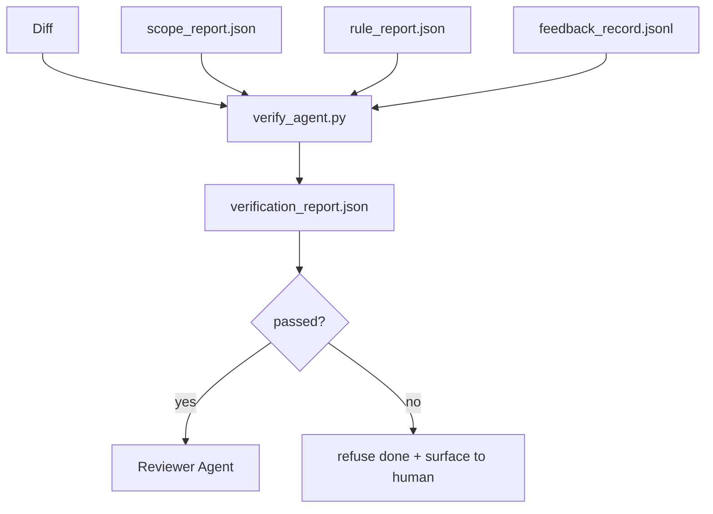

# 验证门禁

> 代理不得自行将其工作标记为完成。验证门禁会读取范围契约、反馈日志、规则报告和差异文件，并回答一个单一的问题：这项任务真的完成了吗？如果门禁判定为否，那么无论聊天界面显示什么，该任务都未完成。

**类型：** 构建
**语言：** Python（标准库）
**前置条件：** 第 14 阶段 · 33（规则）、第 14 阶段 · 36（范围）、第 14 阶段 · 37（反馈）
**耗时：** 约 55 分钟

## 学习目标

- 将验证门禁定义为作用于工作台工件的确定性函数。
- 将规则报告、范围报告、反馈记录和差异文件合并为单一裁决。
- 生成一份审查代理和 CI 均可读取的 `verification_report.json`。
- 对于任何阻塞级失败，一律拒绝推进任务，毫无例外。

## 问题所在

代理过于轻易地宣告成功。三种失败形态占据主导：

- “看起来不错。”模型阅读了自己的差异文件并判定其正确无误。
- “测试已通过。”语气自信满满。但没有任何记录表明测试实际运行过。
- “验收达标。”验收标准被宽松解读，以至于“像完工的样子就算完工”。

工作台的修复方案是引入单一的验证门禁，它读取代理已生成的工件并做出裁决。该门禁是确定性的。该门禁纳入版本控制。该门禁接入 CI 流水线。代理无法贿赂它。

## 核心概念



### 门禁检查项

| 检查项 | 来源工件 | 严重级别 |
|-------|----------|----------|
| 所有验收命令均已执行 | `feedback_record.jsonl` | 阻塞级 |
| 所有验收命令退出码均为 0 | `feedback_record.jsonl` | 阻塞级 |
| 范围检查未发现禁止写入 | `scope_report.json` | 阻塞级 |
| 范围检查未发现越界写入 | `scope_report.json` | 阻塞级或警告级 |
| 所有阻塞级规则均通过 | `rule_report.json` | 阻塞级 |
| 反馈中无 `null` 退出码 | `feedback_record.jsonl` | 阻塞级 |
| 修改的文件与 `scope.allowed_files` 匹配 | 两者皆需 | 警告级 |

一项 `warn` 发现会作为注释附加于裁决之上；一项 `block` 发现则会阻断 `passed: true`。

### 确定性而非概率性

门禁必须对同一组工件始终产生相同的裁决。不依赖 LLM 进行评判。LLM 评判应归属于审查端（第 14 阶段 · 39），其目标是定性评估，而非状态判定。

### 单一报告，单一路径

每次任务结项时，门禁仅生成一份 `verification_report.json`，保存于 `outputs/verification/<task_id>.json` 目录下。CI 消费同一路径。若多个门禁使用不同路径，将导致事实来源分裂。

### 毫无例外地拒绝

阻塞级发现无法由代理覆盖。仅能由人类覆盖，且需附带记录的 `override_reason` 及 `overridden_by` 用户 ID。覆盖操作是一项签名变更，而非代理决策。

## 构建实现

`code/main.py` 实现了以下功能：

- 各输入工件的加载器，均在本地存根化，以确保课程独立完整。
- 一个 `verify(task_id, artifacts) -> VerdictReport` 纯函数。
- 一个打印器，用于展示逐项检查结果及最终通过/失败状态。
- 一个包含三种任务场景的演示：完全通过、范围蔓延、缺失验收。

运行方式：

```
python3 code/main.py
```

输出：三份裁决报告，分别保存于脚本同级目录。

## 生产环境中的实践模式

四种模式将该门禁从“又一个代码检查任务”提升至“决定性防线”。

**纵深防御，而非单一门禁。** 预提交钩子 → CI 状态检查 → 工具前授权钩子 → 合并前门禁。每一层都是确定性的，因此某一层的失败会被下一层捕获。microservices.io 2026 年 3 月的行动指南明确指出：预提交钩子是不可绕过的，因为与模型侧技能不同，它不依赖于代理遵循指令。验证门禁位于 CI / 合并前层级。

**以确定性检查构建防御，模型评判仅用于处理细微之处。** Anthropic 2026 年的混合规范配对：可验证奖励（单元测试、架构检查、退出码）回答“代码是否解决了问题？”——LLM 评分标准回答“代码是否可读、安全、符合风格？”门禁负责第一类；审查端（第 14 阶段 · 39）负责第二类。将它们混合会导致信号衰减。

**签名覆盖日志，而非 Slack 线程。** 每次覆盖都会在 `outputs/verification/overrides.jsonl` 中生成一行记录，包含：时间戳、发现代码、原因、签名用户、当前 HEAD 提交。运行时将拒绝任何缺少签名的覆盖操作；审计轨迹由 Git 追踪。这是覆盖策略与覆盖作秀之间的界限。

**将覆盖率底线作为一等检查项。** `coverage_report.json` 为 `coverage_floor`（默认 80%）检查提供数据。如果测得覆盖率低于底线，或较上次合并的底线下降超过 1 个百分点，门禁即判定失败。若无此检查，代理会悄悄删除失败的测试，而验证报告依然显示绿色（通过）。

**`--strict` 模式将警告升级为阻塞。** 针对发布分支、阻碍发布的 PR 或事后排查，`--strict` 会将每条警告视为硬性失败。该标志按分支选择加入；并非全局默认，因为对一切严格都会侵蚀日常开发流。

## 使用方式

生产环境用法：

- **CI 步骤。** `verify_agent` 作业针对代理的最终工件运行门禁。合并保护机制在未获得 `passed: true` 时将拒绝合并。
- **交接前钩子。** 代理运行时在生成交接文档前调用门禁。未获绿色裁决，则不执行交接。
- **人工排查。** 当代理宣称成功而人类持怀疑态度时，操作员查阅报告。

该门禁是工作台流程中的决定性防线。其他所有环节均位于其上流。

## 交付配置

`outputs/skill-verification-gate.md` 将门禁接入特定项目：指定哪些验收命令为其提供输入、哪些规则属于阻塞级、容忍哪些越界写入，以及覆盖审计日志的存储方式。

## 练习

1. 添加 `coverage_floor` 检查：测试命令必须生成至少 80% 的覆盖率报告。决定由哪个工件承载该底线值。
2. 支持 `--strict` 模式，将每条 `warn` 升级为 `block`。记录严格模式作为默认值的适用场景。
3. 使门禁除 JSON 外还能生成 Markdown 摘要。论证哪些字段应包含在摘要中。
4. 添加 `time_since_last_human_touch` 检查：距离人类击键 60 秒内编辑的任何文件豁免越界标记。
5. 在你的产品上对真实的代理差异文件运行门禁。多少发现是真实的，多少是噪声？门禁需要在哪些方面增强？

## 关键术语

| 术语 | 人们常说的说法 | 实际含义 |
|------|----------------|----------|
| 验证门禁 | “阻止事物的检查” | 作用于工作台工件的确定性函数，输出通过/失败裁决 |
| 阻塞级 | “硬性失败” | 阻止 `passed: true` 的发现，且需要签名覆盖 |
| 覆盖日志 | “我们为何放行” | 包含原因和用户 ID 的签名条目，供审查审计 |
| 验收命令 | “证明” | 退出码为 0 的 Shell 命令，这正是 `done` 的含义 |
| 单一报告路径 | “事实来源” | `outputs/verification/<task_id>.json`，供 CI 和人类共同消费 |

## 延伸阅读

- [Anthropic, Harness design for long-running application development](https://www.anthropic.com/engineering/harness-design-long-running-apps)
- [OpenAI Agents SDK guardrails](https://platform.openai.com/docs/guides/agents-sdk/guardrails)
- [microservices.io, GenAI dev platform: guardrails](https://microservices.io/post/architecture/2026/03/09/genai-development-platform-part-1-development-guardrails.html) — 预提交与 CI 间的纵深防御
- [ICMD, The 2026 Playbook for Agentic AI Ops](https://icmd.app/article/the-2026-playbook-for-agentic-ai-ops-guardrails-costs-and-reliability-at-scale-1776661990431) — 审批门禁阶梯（草稿 → 审批 → 阈值内自动）
- [Type-Checked Compliance: Deterministic Guardrails (arXiv 2604.01483)](https://arxiv.org/pdf/2604.01483) — 以 Lean 4 作为确定性门禁的上限
- [logi-cmd/agent-guardrails — merge gate spec](https://github.com/logi-cmd/agent-guardrails) — 范围 + 变异测试门禁
- [Guardrails AI x MLflow](https://guardrailsai.com/blog/guardrails-mlflow) — 将确定性验证器作为 CI 评分器
- [Akira, Real-Time Guardrails for Agentic Systems](https://www.akira.ai/blog/real-time-guardrails-agentic-systems) — 工具前后置门禁
- 第 14 阶段 · 27 — 提示注入防御（门禁的对抗性配对）
- 第 14 阶段 · 36 — 本门禁强制执行的范围契约
- 第 14 阶段 · 37 — 本门禁进行评分的反馈日志
- 第 14 阶段 · 39 — 门禁移交目标的审查代理
