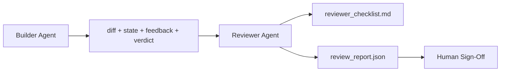

# 审查者智能体：将构建者与标记者分离

> 编写代码的智能体无法对自己进行评分。审查者是一个独立的第二循环，拥有不同的系统提示词、不同的目标，以及对构建者产出的所有内容只读访问权限。构建者与审查者之间的差距正是可靠性的主要来源。

**类型：** 构建
**语言：** Python（标准库）
**前置条件：** 第 14 阶段 · 38（验证门控）
**耗时：** 约 55 分钟

## 学习目标

- 阐述为何同一智能体无法可靠地审查自身工作。
- 构建一个审查者智能体循环，该循环消费构建者产物并输出结构化的审查报告。
- 制定一份审查量规，针对特定维度进行评分，而非凭感觉打分。
- 将审查者接入工作台，使人工审查步骤从真实产物开始。

## 问题所在

你要求智能体修复一个 Bug。它编辑了四个文件，运行测试，并报告完成。验证门控（第 14 阶段 · 38）确认验收测试已运行且范围未越界。门控返回 `passed: true`。你合并了代码。两天后你发现，该修复只解决了 Bug 的一半错误部分。

验收是必要但不充分的条件。审查者提出验收无法提出的问题：这是否解决了正确的问题？是否在未标记的情况下扩大了范围？是否记录了本应被质疑的假设？是否将工作台留在了下一个会话可以无缝接续的状态？

## 核心概念



### 审查量规

五个维度，每个维度评分为 0 到 2 分。

| 维度 | 问题 |
|-----------|----------|
| 问题契合度 | 变更是否解决了明确指定的任务，而非相近的任务？ |
| 范围纪律 | 编辑是否严格限制在契约范围内，还是故意扩大了契约？ |
| 假设记录 | 所有隐藏假设是否都记录在了可审查的位置？ |
| 验证质量 | 验收命令是否真正证明了目标，还是仅证明了一个较弱的版本？ |
| 交接就绪度 | 下一个会话能否从当前状态无缝接续？ |

总分 10 分。低于 7 分为软性失败；低于 5 分为硬性失败。

### 审查者是独立角色，而非独立模型

你可以使用与构建者相同的模型来运行审查者。关键在于角色分离：不同的系统提示词、不同的输入、对差异（diff）无写入权限。姿态的转变即信号的转变。

### 审查者不能编辑差异（diff）

审查者读取差异、状态、反馈和裁决。它撰写报告。它不修补差异。如果报告指出“修复此处”，则由下一轮构建者执行修复；审查者则继续负责审查。混合角色会破坏这种隔离机制。

### 审查量规与验证门控的区别

门控（第 14 阶段 · 38）检查确定性事实：验收是否运行、规则是否通过、范围是否守住。审查者做出定性判断：这是否是正确的工作、是否已文档化、交接是否可用。两者缺一不可。

## 构建实现

`code/main.py` 实现了以下功能：

- 一个 `ReviewerInputs` 数据类，用于捆绑审查者读取的产物。
- 一个量规评分器，每个维度对应一个函数。每个函数都是确定性的，并为课程预留了基础实现；实际实现中会调用 LLM。
- 一个 `review_report.json` 写入器，包含五个分数、总分以及裁决结果（`pass`、`soft_fail`、`hard_fail`）。
- 两个演示用例：一个干净的变更和一个“测试正确但问题错误”的变更。

运行方式：

```
python3 code/main.py
```

输出：两个写入磁盘的审查报告，以及一个显示各维度分数的控制台表格。

## 生产环境中的实践模式

实战数据：Cloudflare 于 2026 年 4 月推出的 AI 代码审查系统在 30 天内，跨越 5,169 个仓库的 48,095 次合并请求，共执行了 131,246 次审查运行。中位审查完成时间为 3 分 39 秒。多达七名专家级审查者（安全、性能、代码质量、文档、发布管理、合规、Engineering Codex）在一名审查协调员的调度下并行运行，协调员负责去重发现并判定严重程度。顶级模型专供协调员使用；专家级审查者运行在更经济的模型层级上。

四种模式使其能够规模化运作。

**专家池，而非单一大型审查者。** 对于个人维护的仓库，使用带有 5 维量规的单个审查者即可。一旦代码库涉及安全关键、性能关键和文档层面，就应拆分为具有更小提示词的专家。协调员负责去重；专家从不运行完整量规。模型层级自然分离：廉价的专家，昂贵的协调员。

**将偏差缓解作为设计需求，而非优化项。** LLM 裁判展现出四种可靠的偏差（Adnan Masood，2026 年 4 月）：位置偏差（GPT-4 在 (A,B) 与 (B,A) 排序上约 40% 不一致）、冗长偏差（对较长输出的评分膨胀约 15%）、自我偏好（裁判倾向于来自同模型家族的输出）、权威效应（裁判高估对知名作者的引用）。缓解措施：评估两种排序并仅统计一致获胜的情况；使用明确奖励简洁性的 1-4 分量表；在不同模型家族间轮换裁判；评分前剥离作者姓名。

**校准集，而非凭感觉。** 一个包含 10-20 个历史任务的集合，附带已知正确的裁决。每次提示词变更后在集合上运行审查者。如果与历史记录的一致性低于 80%，则在审查者上线前需修订量规。这是每个团队最终都会重新发现的真理；不如从一开始就采用。

**与门控的混合规范。** 验证门控（第 14 阶段 · 38）处理确定性检查（验收是否运行、测试是否通过、范围是否守住）。审查者处理语义检查（这是否是正确的工作、假设是否已文档化、交接是否可用）。Anthropic 2026 年的指导方针对此划分非常明确：不要要求审查者重复门控已经证明的内容。

## 使用指南

生产环境用法：

- **Claude Code 子智能体。** 构建者关闭任务后运行审查者子智能体。它在 PR 上发布包含量规分数的评论。
- **OpenAI Agents SDK 交接。** 构建者在任务完成时交接给审查者。审查者可带着一份发现列表交回，或直接转交给人工。
- **双模型配对。** 构建者运行在更快更便宜的模型上。审查者运行在上下文较小但能力更强的模型上，专注于判断。

当人类无法亲自完成每项审查时，审查者就是工作台所培养的“第二双眼睛”。

## 交付部署

`outputs/skill-reviewer-agent.md` 生成项目特定的审查量规、已接入构建者产物的审查者智能体存根，以及与验证门控的集成，使人工作业审查从书面报告而非空白页开始。

## 练习

1. 添加一个针对你产品领域的第六维度。论证为何它不能被现有五个维度所涵盖。
2. 使用两个不同的系统提示词（简洁版、详细版）运行审查者。哪一个生成的报告更可能被人类阅读？
3. 为每个维度添加一个 `confidence` 字段。当最低维度的置信度低于 0.6 时，拒绝发布报告。
4. 构建校准集：包含 10 个已知正确裁决的历史任务结项记录。在它们上面运行审查者。它在哪些地方与历史记录存在分歧？
5. 添加“请求更多证据”的功能：审查者可以在评分前要求构建者执行特定的测试运行。如何设置合理的退避策略以防止无限循环？

## 关键术语

| 术语 | 常见说法 | 实际含义 |
|------|----------------|------------------------|
| 审查量规 | “清单” | 五维度 0-2 分制评分，每个维度配有书面问题 |
| 软性失败 | “需修改” | 总分低于 7；构建者获取待处理发现项 |
| 硬性失败 | “拒绝” | 总分低于 5 或任一维度为 0；停止并将问题上报人工 |
| 角色分离 | “不同提示词” | 同一模型可兼任两角；关键在于输入与姿态的纪律 |
| 置信度底线 | “不发布低信号报告” | 当量规不确定时，拒绝输出裁决 |

## 延伸阅读

- [OpenAI Agents SDK 交接](https://platform.openai.com/docs/guides/agents-sdk/handoffs)
- [Anthropic Claude Code 子智能体](https://docs.anthropic.com/en/docs/agents-and-tools/claude-code/sub-agents)
- [Cloudflare，大规模编排 AI 代码审查](https://blog.cloudflare.com/ai-code-review/) —— 7 专家 + 协调员架构，30 天内 13.1 万次运行
- [Agent-as-a-Judge：使用智能体评估智能体 (OpenReview / ICLR)](https://openreview.net/forum?id=DeVm3YUnpj) —— DevAI 基准测试，366 项分层解决方案要求
- [Adnan Masood，基于量规的评估与大语言模型裁判：方法论、偏差与实证验证](https://medium.com/@adnanmasood/rubric-based-evals-llm-as-a-judge-methodologies-and-empirical-validation-in-domain-context-71936b989e80) —— 四种偏差及缓解措施
- [MLflow，大语言模型裁判评估](https://mlflow.org/llm-as-a-judge) —— 分离式构建者/评估器的生产工具链
- [LangChain，如何通过人工校正校准大语言模型裁判](https://www.langchain.com/articles/llm-as-a-judge) —— 校准集工作流
- [Evidently AI，大语言模型裁判：完全指南](https://www.evidentlyai.com/llm-guide/llm-as-a-judge)
- [Arize，大语言模型裁判——入门与预置评估器](https://arize.com/llm-as-a-judge/)
- 第 14 阶段 · 05 —— Self-Refine 与 CRITIC（单智能体自审基线）
- 第 14 阶段 · 30 —— 评估驱动的智能体开发（校准集生成器）
- 第 14 阶段 · 38 —— 审查者读取的验证门控
- 第 14 阶段 · 40 —— 审查者报告所馈送的交接包
