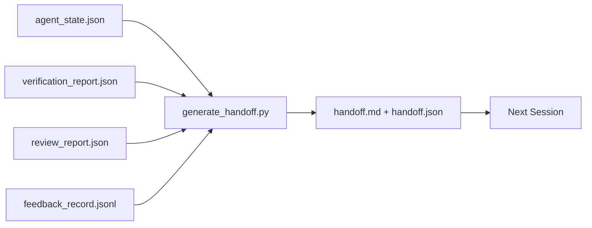

# 多会话交接

> 会话即将结束，但工作不会。交接包（handoff packet）是将“智能体工作了一小时”转化为“下一个会话在第一分钟就高效产出”的产物。要有意识地构建它，而不是作为事后补救。

**类型：** 构建
**语言：** Python (标准库)
**前置条件：** Phase 14 · 34（仓库记忆）、Phase 14 · 38（验证）、Phase 14 · 39（审查员）
**耗时：** 约 50 分钟

## 学习目标

- 识别每个交接包所需的七个字段。
- 基于工作台工件自动生成交接内容，无需手动撰写文本。
- 将庞大的反馈日志裁剪为适合交接大小的摘要。
- 确保下一个会话的第一个动作是确定性的。

## 问题所在

会话结束了。智能体说：“太好了，我们取得了进展。”下一个会话打开。新的智能体问：“我们停在哪里了？”第一个智能体的回答已经消失。新智能体重新发现、重复运行相同的命令、向人类提出相同的问题，并花费三十分钟来恢复上一个会话最后三十秒的内容。

糟糕的交接成本会在任务生命周期内的每次会话中持续支付。解决方案是在会话结束时自动生成一个数据包：记录什么发生了变化、为什么变化、尝试了什么、什么失败了、还剩下什么、下次首先该做什么。

## 核心概念



### 每个交接包必须携带的七个字段

| 字段 | 回答的问题 |
|-------|---------------------|
| `summary` | 已完成工作的单段概述 |
| `changed_files` | 一目了然的代码/文件变更差异 |
| `commands_run` | 实际执行的命令或操作 |
| `failed_attempts` | 尝试过的方法及其失败原因 |
| `open_risks` | 可能影响下一会话的风险及严重程度 |
| `next_action` | 下一会话采取的第一个具体步骤 |
| `verdict_pointer` | 验证与审查报告的路径 |

`next_action` 字段是核心承重字段。缺少 `next_action` 的交接包只是状态报告，而非真正的交接。

### 交接包由生成器创建，而非手动编写

手动编写的交接包在忙碌或困难的日子最容易被跳过。生成器读取工作台工件并输出数据包。智能体的职责是将工作台保持在生成器可总结的状态，而不是亲自撰写摘要。

### 两种形式：人类可读与机器可读

`handoff.md` 是人类阅读的版本。`handoff.json` 是下一个智能体加载的版本。两者均源自同一组源工件。若两者出现分歧，以 JSON 为准。

### 反馈日志裁剪

完整的 `feedback_record.jsonl` 可能包含数百条记录。交接包仅保留最后 K 条以及所有非零退出状态的记录。下一会话在需要时可加载完整日志，但数据包本身保持精简。

## 构建实现

`code/main.py` 实现了以下功能：

- 一个加载器，将状态、判决、审查和反馈整合到单个 `WorkbenchSnapshot` 中。
- 一个 `generate_handoff(snapshot) -> (markdown, payload)` 函数。
- 一个过滤器，用于选取最后 K 条反馈条目及所有非零退出记录。
- 一次演示运行，在脚本旁生成 `handoff.md` 和 `handoff.json`。

运行方式：

```
python3 code/main.py
```

输出：打印出的交接包正文，以及磁盘上的两个文件。

## 生产环境实践

Codex CLI、Claude Code 和 OpenCode 各自提供了不同的上下文压缩方案；结构化的交接包建立在它们之上。

**压缩策略各不相同，但数据包模式固定。** Codex CLI 的 `POST /v1/responses/compact` 是一个服务端不透明的 AES 密文块（OpenAI 模型的快速路径）；回退方案是本地“交接摘要”，作为 `_summary` 用户角色消息追加。Claude Code 在上下文达到 95% 时运行五阶段渐进式压缩。OpenCode 则采用基于时间戳的消息隐藏加上五段式 LLM 摘要。三种不同的机制，满足同一个需求：将压缩后幸存的信息序列化为可移植的工件。数据包正是该工件。

**新建会话交接并非压缩。** 压缩用于延长会话；交接则是干净地关闭当前会话并开启下一个。Hermes Issue #20372 的表述（2026年4月）是正确的：当原地压缩开始降低质量时，智能体应写入紧凑的交接包，结束当前会话，并在全新上下文中恢复。数据包使得这种过渡变得低成本。错误在于不断压缩直到质量崩溃；正确的做法是为早期、干净的交接预留预算。

**每个分支和主题仅保留一个活跃交接包。** 多智能体协调往往因陈旧的交接包而崩溃，而非模型输出不佳。务必包含 `branch`、`last_known_good_commit` 以及 `active | superseded | archived` 的 `status`。陈旧的交接包会被归档；只有活跃的交接包驱动下一个会话。这是“交接即笔记”与“交接即状态”的区别。

**在上下文使用量达 50%-75% 时收尾，而非撑到极限。** 手写交接模式指南（CLAUDE.md + HANDOVER.md）表明，当会话在 50%-75% 上下文预算时结束，效果最佳，而非等到 95%。数据包生成器能在压缩伪影污染源状态之前干净地运行。上下文完整时撰写成本低；当模型已经开始迷失方向时，成本高昂。

## 使用方式

生产环境模式：

- **会话结束钩子。** 当用户关闭聊天时，运行时触发生成器。数据包存入 `outputs/handoff/<session_id>/`。
- **PR 模板。** 生成器的 Markdown 输出同时可作为 PR 正文。审查者无需打开其他五个文件即可阅读。
- **跨智能体交接。** 用一款产品（Claude Code）构建，用另一款（Codex）继续。数据包是通用语。

数据包体积小、格式规范且生成成本低。节省的成本会随每次会话复利累积。

## 交付部署

`outputs/skill-handoff-generator.md` 生成一个针对项目工件路径调优的生成器、一个运行它的会话结束钩子，以及一个供下一个智能体启动时读取的 `handoff.json` 模式定义。

## 练习

1. 添加一个 `assumptions_to_validate` 字段，用于暴露构建者记录的所有假设，但这些假设未被审查者评分超过 1。
2. 对失败运行和成功运行采用不同的反馈摘要裁剪策略。论证这种不对称性的合理性。
3. 包含一份“向人类提问”列表。一个问题被放入数据包还是聊天消息的阈值是什么？
4. 使生成器具备幂等性：运行两次产生相同的数据包。为此需要保持哪些内容的稳定性？
5. 添加一个“下一会话前置条件”部分，精确列出下一会话在行动前必须加载的工件。

## 关键术语

| 术语 | 人们常说的说法 | 实际含义 |
|------|----------------|------------------------|
| 交接包 | “会话摘要” | 携带七个字段的生成工件，包含 Markdown 和 JSON 两种格式 |
| 下一步行动 | “首先做什么” | 启动下一个会话的唯一具体步骤 |
| 反馈裁剪 | “日志摘要” | 最后 K 条记录加上所有非零退出状态记录 |
| 状态报告 | “我们做了什么” | 缺少 `next_action` 的文档；有用，但不是交接包 |
| 判决指针 | “凭证” | 指向验证与审查报告的路径，用于追溯 |

## 延伸阅读

- [Anthropic, Effective harnesses for long-running agents](https://www.anthropic.com/engineering/effective-harnesses-for-long-running-agents)
- [OpenAI Agents SDK handoffs](https://platform.openai.com/docs/guides/agents-sdk/handoffs)
- [Codex Blog, Codex CLI Context Compaction: Architecture, Configuration, Managing Long Sessions](https://codex.danielvaughan.com/2026/03/31/codex-cli-context-compaction-architecture/) —— `POST /v1/responses/compact` 与服务端回退方案
- [Justin3go, Shedding Heavy Memories: Context Compaction in Codex, Claude Code, OpenCode](https://justin3go.com/en/posts/2026/04/09-context-compaction-in-codex-claude-code-and-opencode) —— 三大厂商压缩方案对比
- [JD Hodges, Claude Handoff Prompt: How to Keep Context Across Sessions (2026)](https://www.jdhodges.com/blog/ai-session-handoffs-keep-context-across-conversations/) —— CLAUDE.md + HANDOVER.md，50%-75% 上下文预算
- [Mervin Praison, Managing Handoffs in Multi-Agent Coding Sessions: Fresh Context Without Losing Continuity](https://mer.vin/2026/04/managing-handoffs-in-multi-agent-coding-sessions-fresh-context-without-losing-continuity/) —— 分布式系统视角下的交接管理
- [Hermes Issue #20372 — automatic fresh-session handoff when compression becomes risky](https://github.com/NousResearch/hermes-agent/issues/20372)
- [Hermes Issue #499 — Context Compaction Quality Overhaul](https://github.com/NousResearch/hermes-agent/issues/499) —— Codex CLI 中面向交接的提示词
- [Microsoft Agent Framework, Compaction](https://learn.microsoft.com/en-us/agent-framework/agents/conversations/compaction)
- [OpenCode, Context Management and Compaction](https://deepwiki.com/sst/opencode/2.4-context-management-and-compaction)
- [LangChain, Context Engineering for Agents](https://www.langchain.com/blog/context-engineering-for-agents)
- Phase 14 · 34 —— 生成器读取的状态文件
- Phase 14 · 38 —— 数据包所指向的验证判决
- Phase 14 · 39 —— 打包进数据包的审查员报告
