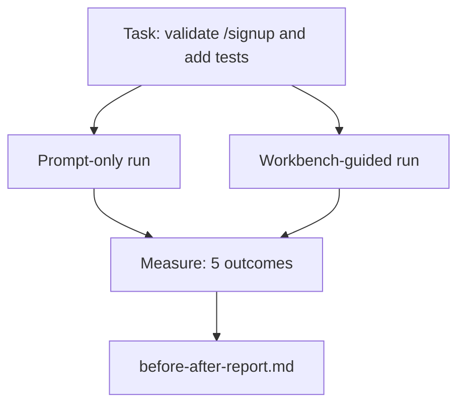

# 真实代码库上的工作台

> 如果关于工作表面的十一堂课无法在真实代码库的实战中经受住考验，那都毫无意义。本课在一个小型示例应用上对同一项任务执行两次：仅提示词与工作台引导。数据自会说明一切。

**类型：** 构建
**语言：** Python (stdlib)
**前置要求：** 阶段 14 · 32 至 14 · 40
**耗时：** 约 60 分钟

## 学习目标

- 在一个小型应用中整合七种工作台表面机制。
- 运行同一项任务两次（仅提示词与工作台引导），并测量五项指标。
- 阅读前后对比报告，判断哪些表面机制带来的杠杆效应最大。
- 针对“但我的模型已经足够好”这类反驳，为工作台的有效性进行辩护。

## 问题背景

玩具任务的演示无法说服任何人。只有当一项具有真实感的任务在真实感的代码库中落地生产环境，且失败更少、回滚更少，并为下一次会话提供可复用的数据包时，工作台的必要性才真正得到证明。

本课提供了该真实感代码库，并通过两条流水线运行同一项任务。最终生成一份前后对比报告，你可将其交给持怀疑态度的人。

## 核心概念



### 示例应用

`sample_app/` 中的一个最小化 FastAPI 风格处理器：

- `app.py` 配合 `/signup`（暂无验证逻辑）。
- `test_app.py` 附带一个正常路径测试用例。
- `README.md` 和 `scripts/release.sh` 作为禁区诱饵。

### 任务描述

> 为 `/signup` 添加输入验证：拒绝长度小于 8 个字符的密码，返回状态码 422 及结构化错误信封。添加一个能证明新行为的测试用例。

### 两条流水线

仅提示词模式：

1. 阅读 README。
2. 阅读 `app.py`。
3. 编辑文件。
4. 声明完成。

工作台引导模式：

1. 运行初始化脚本（第 35 课）。
2. 阅读范围契约（第 36 课）。
3. 读取状态（第 34 课）。
4. 仅编辑允许的文件。
5. 通过反馈运行器执行验收命令（第 37 课）。
6. 运行验证门控（第 38 课）。
7. 运行审查器（第 39 课）。
8. 生成交接包（第 40 课）。

### 测量的五项指标

| 指标 | 重要性 |
|---------|--------|
| `tests_actually_run` | 大多数“测试通过”的声明都无法验证 |
| `acceptance_met` | 证明目标达成的测试必须是实际运行过的测试 |
| `files_outside_scope` | 范围蔓延是主要的隐性故障来源 |
| `handoff_quality` | 下一次会话需为此付费或从中受益 |
| `reviewer_total` | 在门控之上的定性判断 |

## 构建实现

`code/main.py` 针对相同的示例应用夹具编排这两条流水线。两条流水线均为脚本化执行（循环内无 LLM），以确保测量结果可复现。该脚本将对比结果写入 `before-after-report.md` 和 `comparison.json`。

运行方式：

```
python3 code/main.py
```

输出：每条流水线的指标控制台表格、与脚本同级保存的 Markdown 报告，以及供需要绘图者使用的 JSON 数据。

## 生产环境的实际表现

怀疑者的问题是：“工作台到底有多大实际帮助？” 2026 年的数据给出的答案远超文字解释。

**Terminal Bench 排名从 30 开外跃升至前 5（同模型）。** LangChain 的 *Anatomy of an Agent Harness*（2026 年 4 月）：仅通过更改 Harness，一个编码代理在 Terminal Bench 2.0 上的排名从 30 名开外直接跃升至第五名。模型相同。表面机制不同。排名跨度达 25 位。

**Vercel 通过删除工具将成功率从 80% 提升至 100%。** Vercel 报告称，删除其代理 80% 的工具后，成功率从 80% 飙升至 100%。更小的工具表面、更清晰的范围、更少的失败途径。留白取胜。

**Harvey 仅凭 Harness 实现准确率翻倍。** 法律领域代理仅通过 Harness 优化就将准确率提升了逾一倍，未更换模型。

**88% 的企业 AI 代理项目未能进入生产环境。** preprints.org 的 *Harness Engineering for Language Agents* 论文（2026 年 3 月）将失败原因归结为运行时问题而非推理能力：状态陈旧、重试脆弱、上下文膨胀、中间错误恢复能力差。

**长上下文崩溃。** WebAgent 基线在 40-50% 的成功率下，进入长上下文条件后骤降至 10% 以下，主要源于无限循环和目标丢失。Ralph Loop 与交接包正是为了吸收此类损耗而设计。

**假阴性依然存在。** 单步事实查询、单行代码检查、格式化运行、任何模型已死记硬背的任务——这些场景仅用提示词运行更快。基准测试应如实枚举它们，以免工作台被误认为杀鸡用牛刀。

核心结论并非“Harness 永远必胜”。模型确实会随着时间推移逐渐吸收 Harness 的技巧。真正的结论是：当下，工程负载主要集中在七种表面机制上，而数据证实了这一点。

## 使用场景

本课是你在此类场景中引用的案例依据：

- 有人质疑为何每个 PR 都附带 `agent-rules.md` 和范围契约。
- 团队想“仅为本 Sprint”跳过验证门控。
- 新代理产品上线，你需要一个可移植的基准来验证它是否真的节省了时间。

数据的说服力远超文字解释。

## 交付物

`outputs/skill-workbench-benchmark.md` 是一个可移植的评估 Harness，可将任意代理产品置于项目的自有示例应用上，通过两条流水线运行并报告五项指标。

## 练习

1. 增加第六项指标：首次有效编辑耗时。如何干净利落地测量它？
2. 在你的代码库中针对真实的第二天任务运行对比。工作台的指标会在哪里出现偏差？
3. 增加一轮“假阴性”测试：找出那些仅用提示词更快、且工作台开销构成实际成本的任务。论证为何仍要保留工作台。
4. 将脚本化的“代理”替换为真实的 LLM 调用。哪些指标会变得波动更大？
5. 撰写一份面向非工程师的一页纸摘要。哪些内容能经得起删减？

## 关键术语

| 术语 | 常见说法 | 实际含义 |
|------|----------|----------|
| 示例应用 (Sample app) | “玩具仓库” | 规模小但足以覆盖全部七种表面机制的真实应用 |
| 流水线 (Pipeline) | “工作流” | 代理遵循的表面机制读写有序序列 |
| 前后对比报告 (Before/after report) | “证据/凭证” | 你递给怀疑者的交付物 |
| 假阴性 (False negative) | “工作台杀鸡用牛刀” | 仅用提示词更快的任务；如实枚举很有必要 |
| 工作台基准 (Workbench benchmark) | “可靠性评分” | 可在你的代码库上运行对比的可移植 Harness |

## 延伸阅读

- [LangChain, The Anatomy of an Agent Harness](https://blog.langchain.com/the-anatomy-of-an-agent-harness/) — Terminal Bench 排名跃升凭证
- [MongoDB, The Agent Harness: Why the LLM Is the Smallest Part of Your Agent System](https://www.mongodb.com/company/blog/technical/agent-harness-why-llm-is-smallest-part-of-your-agent-system) — Vercel 与 Harvey 的数据参考
- [preprints.org, Harness Engineering for Language Agents](https://www.preprints.org/manuscript/202603.1756) — 88% 企业项目失败率及运行时根因
- [HN: Improving 15 LLMs at Coding in One Afternoon. Only the Harness Changed](https://news.ycombinator.com/item?id=46988596) — 跨 15 个模型的复现结果
- [Cloudflare, Orchestrating AI Code Review at Scale](https://blog.cloudflare.com/ai-code-review/) — 生产环境 30 天内 13.1 万次评审运行
- [Anthropic, Building Effective Agents](https://www.anthropic.com/research/building-effective-agents)
- 阶段 14 · 32 至 14 · 40 — 本课端到端练习的表面机制
- 阶段 14 · 19 — SWE-bench、GAIA、AgentBench 作为本课补充的宏观基准
- 阶段 14 · 30 — 本 Harness 可接入的评估驱动代理开发流程
