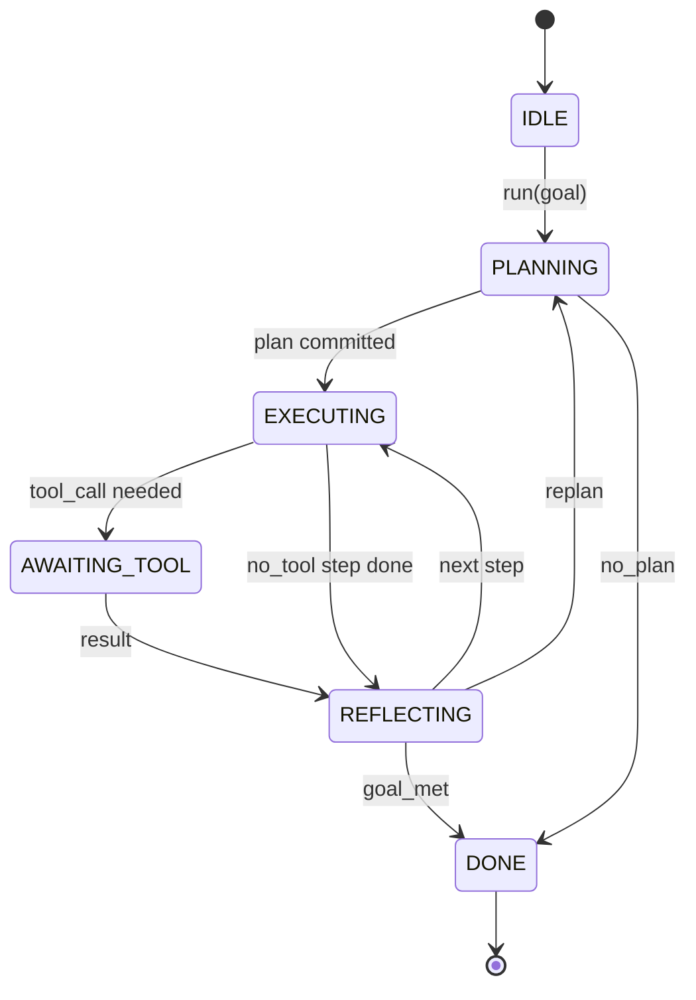

# Agent Harness 循环契约

> Harness 就是智能体。模型是协处理器。本课将固化一个循环契约，你可以将任意模型接入其中。

**类型：** 构建
**语言：** Python
**前置条件：** 第 13 阶段课程 01-07，第 14 阶段课程 01
**预计时间：** 约 90 分钟

## 学习目标
- 将智能体 Harness 循环指定为一个具有显式状态转换的确定性状态机。
- 实现十个生命周期钩子主题，供操作员接入策略、遥测数据和护栏。
- 定义两个挂起点，循环在此处将控制权交还给调用方，并在收到新输入时恢复执行。
- 强制执行每次会话的预算限制（轮次、工具调用次数、墙钟时间），且在超出限制时不会泄露部分状态。
- 发出包含十一种事件类型的类型化流，以便下游 UI 和追踪器能够直接订阅，而无需直接检查循环内部。

## 框架概述

一个无人值守运行四十个轮次的编码智能体不是一个聊天循环。它是一个状态机，其节点可被操作员拦截，其边可被操作员审计。一旦你将契约写下来，更换模型、工具或策略就不再是一次重构操作。它变成了一次注册调用。

本课将构建该契约。我们定义了六个状态、十个钩子主题、两个挂起点、十一种事件类型以及一个预算约束范围。Harness 中的其他所有内容（工具注册表、JSON-RPC 传输层、调度器、规划器）都将插入此结构中。

## 状态

循环包含六个状态。五个为活跃状态，一个为终止状态。



`IDLE` 是唯一合法入口。`DONE` 是唯一合法出口。`AWAITING_TOOL` 是唯一产生挂起点的状态。其余所有转换均为内部转换。

该状态机是确定性的。给定相同的事件日志，Harness 会重新进入相同的状态。这一特性使得你可以在不调用模型的情况下重放会话以进行调试。

## 钩子主题

钩子是操作员切入循环的接口。Harness 会触发十个主题。每个主题接受任意数量的订阅者。订阅者按注册顺序触发。订阅者可修改负载、抛出异常以中止轮次，或返回哨兵值以跳过下一步。

```text
before_plan         after_plan
before_tool_call    after_tool_call
before_step         after_step
on_error
on_pause
on_budget_exceeded
on_complete
```

其结构与 Claude Code、Cursor 和 OpenCode 在 2025 年中旬达成的共识一致。命名是功能性的，而非品牌化的。用于拦截 `rm -rf` 的钩子位于 `before_tool_call`。用于发送 OpenTelemetry span 的钩子位于 `after_step`。用于在暂停会话上恢复执行的钩子位于 `on_pause`。

## 挂起点

循环会两次交出控制权。第一次是在 `AWAITING_TOOL`，此时若无工具结果则无法继续推进。第二次是在 `on_pause`，此时预算已耗尽或某个钩子明确要求人工审核。

挂起点不是异常。它是一种返回机制。调用方检查 Harness 状态，获取 Harness 请求的内容，然后调用 `resume(payload)`。Harness 从停止的地方继续执行。这与 Python 生成器的结构相同。通过挂起点进行传输的方式由你决定。在 TUI 中是按键输入。通过 MCP 是 `tools/call`。通过队列则是任务轮询。

## 事件流

循环会在契约的特定位置向类型化流追加事件。该流仅支持追加，订阅者可以从任意偏移量开始重放。已实现的十一种事件类型如下：

- `session.start` —— 当调用 `run(goal)` 时发出一次
- `plan.draft` —— 当规划器返回草案计划时发出
- `plan.commit` —— 当草案被提交为当前计划后发出
- `step.start` —— 在每个执行步骤开始时发出
- `step.end` —— 在每个执行步骤结束时发出
- `tool.call` —— 当需要工具的步骤将控制权交还给调用方时发出
- `tool.result` —— 在使用工具结果恢复执行时发出
- `tool.error` —— 在使用错误恢复执行或钩子中止调用时发出
- `budget.warn` —— 当达到预算限制时发出
- `session.pause` —— 当循环因暂停（预算或钩子）而交出控制权时发出
- `session.complete` —— 当循环到达 `DONE` 时发出一次

事件不会重复钩子的负载内容。钩子是命令式的（修改、中止）。事件是观测式的（记录、发送）。请将它们视为正交的。

## 预算约束范围

一个会话携带三个限制。轮次计数、工具调用计数、墙钟秒数。每经过一轮，轮次计数加一。每次工具调用，工具调用计数加一。墙钟时间在每次状态转换时进行检查。当达到任何限制时，循环会触发 `on_budget_exceeded`，发出 `budget.warn`，然后在下一个挂起点处带着预算超出的原因转换到 `IDLE`。

预算不是强制终止开关。它是一种挂起机制。调用方决定是否延长预算并恢复执行，或关闭会话。

## 本课不涉及的内容

本课不调用模型。不注册真实工具。不实现传输层。这些将是接下来的四课内容。本课旨在敲定契约，以便后续四课可以直接接入而无需重写。

`main.py` 中的确定性规划器仅为占位符。它返回一个硬编码的三步计划，其中两步需要工具结果。重点在于循环本身，而非计划。

## 如何阅读代码

`HarnessLoop` 是主类。它维护状态、触发钩子、发出事件。`Budget` 负责跟踪限制。`Event` 是流上的类型化信封。`HookRegistry` 是分发表。`_transition` 是唯一改变状态的函数，因此状态机不变量集中在一处。

从上到下阅读 `main.py`。然后阅读 `code/tests/test_loop.py`。测试用例固定了每一次状态转换和每一个钩子的触发顺序。

## 进一步探索

在生产环境中构建 Harness 最难的部分不是状态机本身，而是确保契约的可执行性。契约必须能经受住规划器的热重载。必须能处理返回格式错误 JSON 的工具。必须能容忍在四十轮会话进行到三分之二时于 `before_tool_call` 抛出的钩子异常。本课的测试用例覆盖了这些故障模式。运行它们。尝试破坏它们。补充测试用例。

下一课将添加工具注册表。之后是 JSON-RPC 传输层。再之后是调度器。到第二十四课时，本文件中的循环将使用真实预算限制，针对真实工具执行真实计划。
