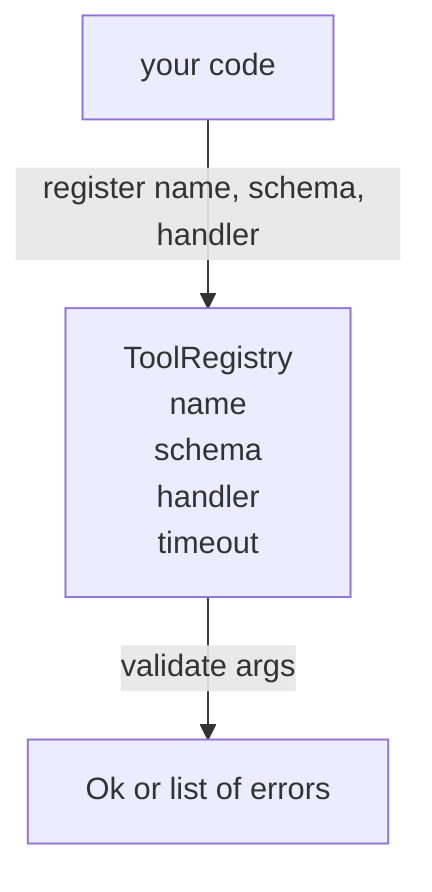

# 带模式校验的工具注册表

> 代理无法验证的工具，就是无法调用的工具。在构建工具之前，先构建注册表和模式校验器。

**类型：** 构建
**语言：** Python
**前置条件：** Phase 13 lessons 01-07, Phase 14 lesson 01
**耗时：** 约 90 分钟

## 学习目标
- 维护一个类型明确的注册表（工具名 → 模式 → 处理器），调度器只需查询一次即可信任后续结果。
- 实现一个 JSON Schema 2020-12 的子集，覆盖实际工具调用中 90% 所使用的关键字。
- 返回精确的、符合 json-pointer 格式的报错路径，以便模型能在一次往返交互中自我修正。
- 拒绝未经显式覆盖的重新注册，因为静默覆盖正是生产环境工具目录发生漂移的原因。
- 保持校验器的纯粹性（无 I/O、无时间依赖、无全局变量），以便能够在重放日志上重新运行。

## 为什么注册表要优先于工具

到 2026 年，编码代理注册的工具有可能超过单个上下文窗口能容纳的数量。一个非平凡的测试框架会注册两百个工具，并在任意给定回合中向模型暴露十到四十个。注册表是“存在哪些工具”、“它们的参数是什么结构”以及“我该调用哪个处理器”这三个问题的唯一事实来源。一旦这三个答案被确定，测试框架的其余部分就不再需要猜测。

我们要避免的错误是：发布没有模式的处理器，或发布没有校验的模式。这两种情况都很常见。它们都会让下一层（第二十三课中的调度器）变成猜谜游戏，而唯一的失败表现就是处理器抛出的堆栈跟踪。

## 工具记录的结构

```text
ToolRecord
  name        : str          (unique, lowercase alphanumeric and underscore segments separated by dots, e.g., snake_case.segment.case)
  description : str          (one line, shown to the model)
  schema      : dict         (JSON Schema 2020-12 subset)
  handler     : Callable     (async or sync, returns Any)
  idempotent  : bool         (dispatcher uses this for retry decisions)
  timeout_ms  : int          (override per-tool dispatcher default)
```

模式是校验器唯一会触及的字段。处理器对其而言是黑盒。我们故意将它们分离。模式是数据，处理器是代码。将两者混合会让你忍不住把校验逻辑塞进处理器里，而这正是我们要杜绝的缺陷。

## JSON Schema 2020-12 子集

完整的 2020-12 规范是一份学术论文。我们只需要八个关键字。

```text
type           string / number / integer / boolean / object / array / null
properties     map of property name -> schema
required       list of property names
enum           list of allowed primitive values
minLength      integer, applies to strings
maxLength      integer, applies to strings
pattern        ECMA-262-compatible regex, applies to strings
items          schema applied to every array element
```

这足以覆盖工具 API 的实际需求。我们不添加的关键字（oneOf、anyOf、allOf、$ref、conditionals）在生产级模式中是合法的，但会让校验器变成一个带有循环的树遍历器。我们在构建的是注册表，而不是 JSON Schema 引擎。

## Json Pointer 错误路径

当校验失败时，校验器会返回错误列表。每个错误都携带一个指向输入数据的 json-pointer 路径。指针是以斜杠开头的属性名和数组索引序列。

```text
{"a": {"b": [1, 2, "x"]}}
                    ^
                    /a/b/2
```

模型读取错误路径的能力优于阅读自然语言句子。如果模式要求 `args.user.email` 而模型传入了整数，则错误信息应为 `/user/email`，并附带 `expected_type: string`。模型会在下一次调用中直接修复该问题，无需经过一轮自然语言交互。

## 注册与覆盖

`register(name, schema, handler, **opts)` 默认拒绝重新注册。调用者必须传入 `override=True` 才能进行替换。这是良好的运维规范。代码库的不同部分静默注册了相同的工具名，这种缺陷在生产环境中可能需要一周才能排查出来。

注册表暴露了三个读取方法。`get(name)` 返回记录或抛出异常。`validate(name, args)` 返回 `Ok` 或错误列表。`names()` 按注册顺序返回工具名。

## 校验器的职责与边界

它对模式树进行单次递归遍历。它是纯粹的。它不会调用处理器。它不会强制转换类型（字符串 `"42"` 无法通过数字模式校验）。它不会静默截断。

它不是安全边界。即使校验通过，恶意处理器仍可能行为异常。第二十三课中的调度器会添加超时和沙箱层。注册表负责提供结构约束。

## 结构



## 如何阅读代码

`code/main.py` 定义了 `ToolRegistry`、`ToolRecord`、`ValidationError` 以及八个校验函数。校验器根据 `schema["type"]` 进行分发（或将包含 `enum` 的模式视为无类型枚举检查）。每个类型校验器要么返回空列表，要么返回 `ValidationError` 列表。顶层遍历器在向下遍历时拼接错误，并在路径前追加路径段。

`code/tests/test_registry.py` 覆盖了注册、覆盖、校验成功、带路径的校验失败以及子集中的所有关键字。

## 进阶方向

本课程落地后，你将会需要的两个扩展功能是：针对本地 definitions 块的 `$ref` 解析，以及用于严格结构的 `additionalProperties: false`。它们都很小。随着工具目录增长到超过五十个工具，通常都会添加这两个功能。我们将它们排除在本课之外，是为了确保文件内容控制在一屏阅读量以内。

下一课（第二十二课）将构建 JSON-RPC stdio 传输层，将此注册表暴露给模型客户端。再下一课（第二十三课）将在超时和重试机制背后封装这两者。
